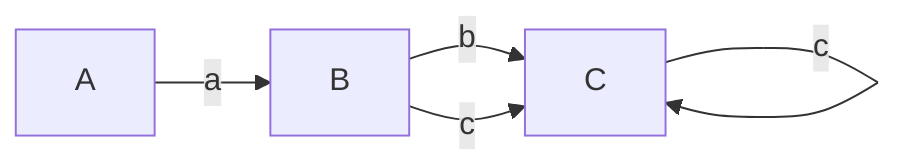
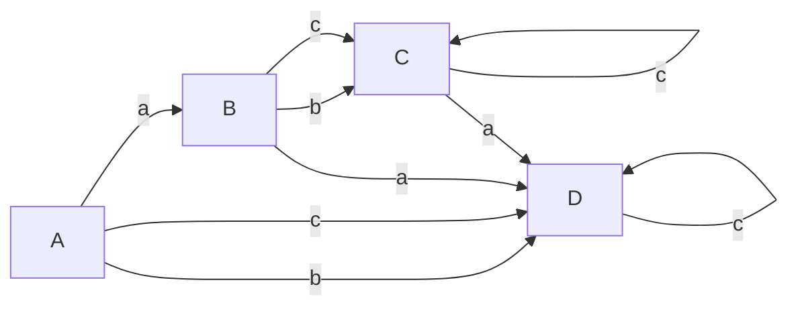
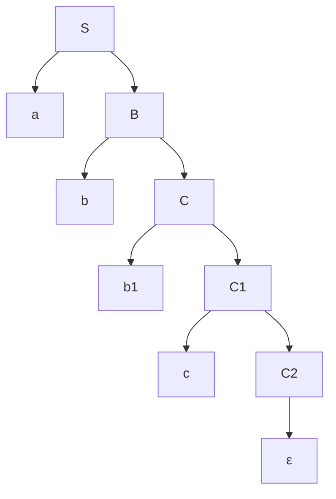
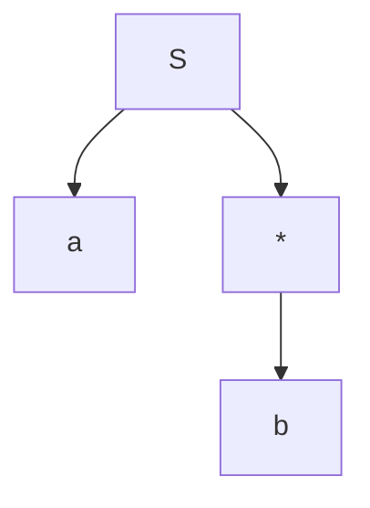
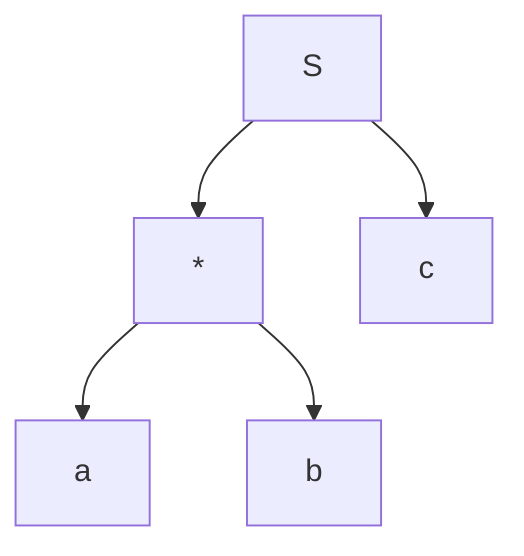
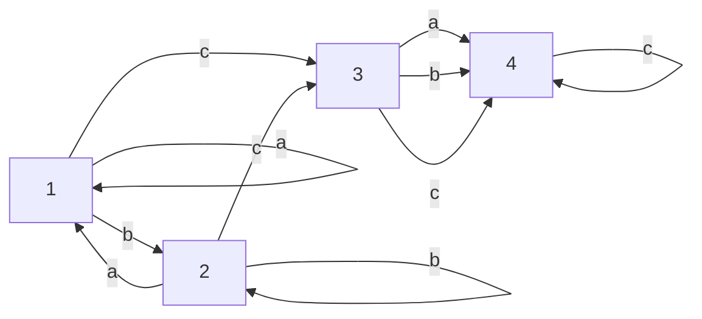

---
# Index

1. [[#Role of a Parser]]
2. [[#FLAT Recap Context Free Languages, Context Free Grammar, Derivation/Parse Trees and Ambiguous Grammar.]]
3. [[#Pre-requisites before moving to parsing]]
4. [[#1. Generating a parse tree for a Regular expression.]]
5. [[#2. First() and Follow() methods]]
6. [[#Parser Types]], [[#Constructing the parse table and checking for LL(1) compatibility]]
7. [[#Pre-requisites before heading into LR parsers types.]] (VERY VERY IMPORTANT)
8. [[#Creating the Actions and Go-To Tables]] (LR PARSING Pre-requisite)
9. [[#LR(0) Action Table]] 
10. [[#LR(0) Go-To Table.]]
11. [[#1. SLR Parser or SLR(1)]]
12. [[#SLR(1) Action table]] 
13. [[#Pre-requisites before heading into LALR parsing.]]
14. [[#LALR parser]]
15. [[#Operator Precedence Parsing]]
16. [[#Creating the Operator Precedence parsing table.]]
17. [[#Parsing a string from the Operator-Precedence Parsing Table]]
18. [[#Parser Generator (YACC)]]
19. [[#Error Recovery Strategies for Parsing Techniques]]
20. [[#3. **Error Recovery in LL Parsing**]]
21. [[#4. **Error Recovery in SLR Parsing**]]
22. [[#5. **Error Recovery in LALR Parsing**]]
23. [[#7. **Error Recovery Strategy Comparison (LL vs SLR vs LALR)**]]
---
# Role of a Parser

A **parser** is a key component of the **syntax analysis** phase of a compiler, which follows the **lexical analysis** phase. Its primary role is to check whether the input tokens, produced by the lexical analyzer, form a syntactically correct sequence based on the grammar of the language.

#### 1. **Basic Function of a Parser**

The parser takes the stream of tokens from the lexical analyzer and attempts to build a **parse tree** (or **syntax tree**) by checking if the sequence of tokens can be generated by the grammar rules of the programming language.

- **Input to Parser**: Tokens from lexical analysis.
- **Output from Parser**: Parse tree or an error message if the syntax is incorrect.

#### 2. **Role in Compiler Design**

The parser ensures that the input program follows the syntax of the programming language. It is responsible for detecting errors related to the structure of the program (syntax errors) but not semantic errors (which involve meaning).

##### Phases of Parsing:

- **Syntax Analysis** checks for proper structure based on rules defined by the grammar.
- It generates a **parse tree**, where each node represents a grammatical construct.

For example, for the expression:

```c
a = b + 5;
```

If the tokens generated by the lexical analyzer are:

- `IDENTIFIER("a")`
- `ASSIGN("=")`
- `IDENTIFIER("b")`
- `PLUS("+")`
- `NUMBER("5")`
- `SEMICOLON(";")`

The parser checks if this sequence conforms to the rules of the grammar for assignment and arithmetic expressions.

#### 3. **Key Tasks of the Parser:**

1. **Syntax Verification**:
    
    - It verifies whether the input string (a series of tokens) adheres to the grammar of the programming language.
2. **Building Parse Trees**:
    
    - If the input tokens follow the grammar, the parser constructs a parse tree, a hierarchical representation of how the program fits the grammar rules.
3. **Error Detection and Recovery**:
    
    - If the tokens do not match the grammar, the parser detects syntax errors and attempts to recover from them to continue parsing the rest of the input.
    - Parsers often use strategies like **panic-mode recovery** or **phrase-level recovery** to handle errors.

#### 4. **Types of Parsers**:

The role of the parser can be further divided into two major categories of parsers:

- **Top-Down Parsers**:
    
    - They attempt to build the parse tree starting from the root and proceed down to the leaves.
    - Example: **Recursive Descent Parsing** and **LL(1) Parsing**.
- **Bottom-Up Parsers**:
    
    - They start with the input tokens and attempt to build the parse tree by reducing tokens to non-terminals, working up to the start symbol.
    - Example: **LR Parsers** and **Shift-Reduce Parsing**.

#### 5. **Why a Parser is Important**:

- **Maintains Language Structure**: Without a parser, the compiler wouldn't be able to interpret the structure of the source code, and therefore, wouldn't be able to convert it into an executable form.
    
- **Error Reporting**: Parsers are crucial for **error reporting**. They help programmers by pinpointing exactly where in the program the syntax has gone wrong, helping with debugging.
    
- **Abstract Syntax Tree (AST)**: The **parse tree** is sometimes transformed into an **Abstract Syntax Tree (AST)**, a more concise representation of the source code's syntax that is easier for subsequent phases of the compiler to process.

---
### Example:

Consider the following grammar for a simple assignment statement:

```mathematica
S → id = E
E → E + T | T
T → id | num

```

For the input `x = y + 5`, the parser checks:

- Is `x` an identifier (`id`)?
- Is there an `=` sign?
- Does `y + 5` form a valid expression based on the rules of the grammar?

If the input matches, the parser will generate the following parse tree:

```bash
        S
       / \
      id  =
           \
            E
           / \
          E   +
         /     \
        T       T
       /       / \
     id      num

```

### Summary of the Role of Parser:

- **Input**: Token stream from the lexical analyzer.
- **Output**: Parse tree (if valid) or syntax error (if invalid).
- **Key Functions**:
    1. Verify syntax based on grammar.
    2. Build parse tree or abstract syntax tree (AST).
    3. Detect and recover from syntax errors.

---
# FLAT Recap : Context Free Languages, Context Free Grammar, Derivation/Parse Trees and Ambiguous Grammar.

## Context Free Language

![[Pasted image 20240617085935.png]]

The main difference between CFL and a Regular language is that of the production rule.
In RL the production rule is not an iteration, that is, it cannot contain an empty symbol.

However in a CFL the production rule is a closure, that is it can contain an empty symbol.

## Example

![[Pasted image 20240617090110.png]]

![[Pasted image 20240617113550.png]]

![[Pasted image 20240617114234.png]]

![[Pasted image 20240617114254.png]]

![[Pasted image 20240617115954.png]]


https://www.youtube.com/watch?v=htoFbcwES28&list=PLBlnK6fEyqRgp46KUv4ZY69yXmpwKOIev&index=72

---
## Derivation Tree

https://www.youtube.com/watch?v=u4-rpIlV9NI&list=PLBlnK6fEyqRgp46KUv4ZY69yXmpwKOIev&index=73

![[Pasted image 20240617120038.png]]

![[Pasted image 20240617120210.png]]

---

## Ambiguous Grammar

![[Pasted image 20240617120709.png]]

Here instead of drawing a tree, the variables were used on the left and right side respectively.

---
# Pre-requisites before moving to parsing

## 1. Generating a parse tree for a Regular expression.

### 1. The standard way (easy but a bit time consuming.)


Let's say we have the regex : $a(b+c)^{*}$

### Steps Involved

1. Convert the regular expression to an NFA
2. Convert the NFA to it's equivalent DFA
3. Generate CFG production rules for the DFA
4. Draw the derivation tree/parse tree from the production rules.

### Step 1. Convert RE to NFA




The state transition table for this NFA would be:


| States | a      | b      | c      |
| ------ | ------ | ------ | ------ |
| A      | B      | $\phi$ | $\phi$ |
| B      | $\phi$ | C      | C      |
| C      | $\phi$ | C      | C      |

---
### Step 2. Convert NFA to DFA

The state transition table for the DFA would be:


| States | a   | b   | c   |
| ------ | --- | --- | --- |
| A      | B   | D   | D   |
| B      | D   | C   | C   |
| C      | D   | C   | C   |
| D      | D   | D   | D   |

And the resulting DFA:



---
### Step 3. Generate CFG from the DFA

Here start symbol `S` depicts the initial state `A`.

```mathematica
S --> aB
B --> bC | cC
C --> bC | cC | ε
```

The ε symbol tells the parse tree when to stop production.

We ignore the dead state `D`.

So from this production rule, let's generate the parse tree for the regex with the example string 
`abbc`



Since the syntax for writing graph here is a bit wacky so I can't write C all the time as it will loop back to itself, hence the nodes `b1`, `C1` and `C2`. However on paper they will be just `b` and  `C`.

---
### 2. Using operator precedence

#### 1. **Identify the Operators and Operands**:

Regular expressions consist of **operands** (individual symbols or characters) and **operators** such as:

- **Concatenation**: `.` (often implicit in REs, e.g., `ab` means `a.b`)
- **Union (alternation)**: `|`  or $\cup$ or `+`
- **Kleene Star**: `*`
- **Parentheses**: Used for grouping expressions.

#### 2. **Construct Nodes Based on Precedence**:

- **Kleene Star (`*`)** has the highest precedence.
- **Concatenation** (`.`) has the next level of precedence.
- **Union (`|`)** has the lowest precedence.

The idea is to break the regular expression into smaller parts and recursively build the tree based on operator precedence.

#### 3. **Start from the Root**:

- The root of the syntax tree corresponds to the highest-precedence operator that governs the entire regular expression.
- Sub-expressions become child nodes.

#### 4. **Build the Tree Recursively**:

- Every operator has its own subtree, where the children are the operands or results of lower-precedence operations.
- Leaf nodes are the individual characters or symbols from the regular expression.

### Example

Given regex $a|b^{*}$

Given operators : `|`,  `*`

Following  operator precedence, we can do:

Let S be the root.



**Example 2:**

$(a|b)^{*}c$


Operators : `|`, `*`, `.`

Let S be the root.



where S is the concatenation operator (`.`).

---

### 3. Converting an RE to DFA directly using `firstpos`, `laspos` and `followpos` methods

Using the previous example

**Example 2:**

$(a|b)^{*}c$


Operators : `|`, `*`, `.`

Let S be the root.


where S is the concatenation operator (`.`).

First we number the leaf nodes as `positions`.

Given the regex, 

a is the first leaf node so it gets the `position of 1`.
b is the second leaf node so it gets the `position of 2`.
c is the third and last leaf node so it gets the `position of 3`.


From the given regex, here's a possible string

aac.

### What the methods, `firstpos()`, `lastpos()` and `followpos()` try to do?

1. `firstpos()` tries to figure out which of the `positions/leaf nodes` could be the `first character` in ==any== `example string` generated by the `regex`.
2. `lastpos()` tries to figure out which of the `positions/leaf nodes` could be the `last character` in ==any== `example string` generated by the `regex`.
3. `followpos()` tries to figure out, that for a given `position/leaf node` which of the `positions` could be the `next following character` in ==any== example string generated by regex.
4. When `followpos()` is called it calls `firstpos()` of the `following node`. Kind of similar to how `first and follow` work (mentioned in the next section).

This mostly happens when `followpos()` detects `Concatenation or Kleene Star operators.`

---


The methods work ==per node==. This means for a leaf node, `firstpos()` and `lastpos()` will return the exact same value, the leaf node's numbering/position.

For `root` node it will return the last position in the entire string, as intended.

Now to construct the DFA, these methods need to be executed on every node to get the accurate data to construct the DFA.

Here is our parse tree again:


Starting with the leaf nodes / positions, we find that

`firstpos(a) = 1`
`firstpos(b) = 2`

For the `*` node, it is attached to a union of leaf nodes `a` and `b`

So `firstpos(*) = firstpos(a)` $\cup$  `firstpos(b)` = `{1, 2}` .

`firstpos(S)`, the root node, we have the concatenation between nodes `*` and `c`.

So the first character from any string will come from `*` or `firstpos(*)`

$\therefore$ `firstpos(S)` = `firstpos(*) = {1,2}`.

---
Now we compute the `lastpos()` method

For the entire string itself, the last character will always be `c` no matter what string it is.

So `lastpos(S) = {3}`.

---

For the state transitions, we will need to use `followpos()`

For `S`, we see that it is only followed by  a concatenation of `*` and `c`.

`*` is followed by only the node `c`.

So `followpos(S) = firstpos(*) = {1,2}`

We also see that `*` is followed by node `c`  of position `3`.

Since we already have included `{1,2}` from `firstpos(S)`, we factor in the `followpos(*)` where we see that it is followed by `c`.

So `followpos(*)` = `firstpos(3) = {3}`

For `followpos(3), since c is the last char, it will be {}`.

So final `followpos(S)` = `firstpos(*)` $\cup$ `followpos(*)` = `{1,2,3}`


Thus, the resultant DFA table will be:


| States | a   | b   | c   |
| ------ | --- | --- | --- |
| 1      | 1   | 2   | 3   |
| 2      | 1   | 2   | 3   |
| 3      | 4   | 4   | 4   |
| 4      | 4   | 4   | 4   |

Where `4` is the dead/trapping state.

According DFA would be:




---
## 2. First() and Follow() methods

---
### 1. First() method

**Rules:**

1. `First(terminal variable) = terminal variable`

2. `First(ε) = ε`

3. `Placing ε in any non-terminal variable will completely rule it out and move to the next non-terminal variable(if any)`.
   
4. `In case of a non-terminal on the RHS, we find the first of that non-terminal, i.e the first of any non-terminal variable will always contain a terminal variable`.

---
Let's say we have a given grammar here:

```mathematica
S -> ABC | ghi | jkl 
A -> a | b | c
B -> b
D -> d
```
So the method `First()` returns the `first terminal variable` defined in the production rule of the first `non-terminal variable`.

So, `First(S)` will be the variable `A`. `First(A)` will be `a | b | c`.

`b | c are the first non-terminals from the other halfs`.

In the second half, the `first` will be `g`.

In the third half, the `first` will be `j`.

So `First(S)` = `abcgj`

---

**Example 2:**

```mathematica
S -> ABC
A -> a | b | ε
B -> c | d | ε
C -> e | f | ε
```

Here `First(S)` will be `A`. 

`First(A) = abε`
Placing `ε` in A, it will be ruled out. 
So, we proceed to B

`First(B) = cdε`

Placing `ε` in B, it will be ruled out.
So, we proceed to C
`First(C) = efε`

So the final `First(S)` will be `abcdefε`

---
**Example 3:**

```mathematica
E -> TE'
E' -> *TE'|ε
T -> FT'
T' -> ε | +FT'
F -> id|(ε
```

`First(E) will be T`
`First(T) = F`
`First(F) = id(`

$\therefore$ `First(E) = id(`

---
### 2. Follow() method

Let there be a `non-terminal` variable `A`.

$\therefore$ `Follow(A)` contains the set of all `terminal variables` in the `right` of `A`.

**Rules:**

1. `Follow(S) where S is the start symbol = {$}`
2. `Follow(A) where A is a non-terminal symbol, goes to it's immediate right.`
3. `In case of a non-terminal variable on the right, we find it's First()`
4. `In case of ε being present on the right of a non-terminal, it's Follow() will be the Follow(LHS), mostly the Follow(S) where S is the start symbol or {$} or any other non-terminal variable on the LHS.`
5. `ε is never included in the Follow set.`
6. `As previously mentioned, applying ε in a non-terminal symbol will rule it out and the next non-terminal symbol will be considered (if any).`
---
**Example 1:**

```mathematica
S -> ACD
C -> a | b

```

`Follow(S) = {$}`
`Follow(A) = First(C)` 
`First(C) = ab`

$\therefore$ `Follow(A) = ab`.

In case of `Follow(D)` we see that there is nothing on the right of `D`. We could say that `ε` is on the right of D

`S -> ACDε`

$\therefore$ `Follow(D) = $` 

---
**Example 2:**

```mathematica
S -> aSbS | bSaS | ε
```

which can be rewritten as

```mathematica
S -> aSbSε | bSaSε | ε
```

$\therefore$  `Follow(S) = {$, b, a}`

---
**Example 3:**

```mathematica
S -> AaAb | BbBa
A -> ε
B -> ε
```
`Follow(A) = {a,b}`
`Follow(B) = {b,a}`

---
**Example 4:**

```mathematica
S -> ABC
A -> DEF

B -> ε
C -> ε
D -> ε
E -> ε
F -> ε
```

`Follow(A) = First(B) = ε`.
Placing `ε` in `B` will rule it out.

So `Follow(A) = First(C) = ε`, which once again, rules out `C`.

The grammar becomes `S -> Aε`.

So `Follow(A) = Follow(S) = {$}`  ($\because$ `ε is never written in the Follow set.`)


---
# Parser Types

https://www.youtube.com/watch?v=hGuXUIefVkc&list=PLxCzCOWd7aiEKtKSIHYusizkESC42diyc&index=7

![[Pasted image 20241006114010.png]]

In our syllabus we have just :

1. **Top-Down Parsing**
    - **Recursive Descent Parsing**
    - **LL(1) Parser**
2. **Bottom-Up Parsing**
    - **LR Parsers** (SLL, LALR, and Canonical LR (LR(0)))
    - **Shift-Reduce Parsing**
3. **Operator-Precedence Parsing**

---
## 1. Top-Down Parsing

Top-Down Parsing attempts to construct a parse tree from the root (starting symbol of the grammar) down to the leaves (input tokens). It works by trying to match the input string with the production rules of the grammar.

#### 1. **Recursive Descent Parsing**

**Recursive Descent Parsing** is a type of top-down parsing that is typically implemented using a set of recursive functions, each corresponding to a non-terminal in the grammar.

- **How it works**:
    - Each function tries to match a production rule for a non-terminal and recursively calls other functions for the symbols on the right-hand side of the rule.
    - If it successfully matches the input tokens, it returns success; otherwise, it backtracks to try another rule.

#### Example:

Consider this grammar:

```css
S → a A
A → b | c
```

A recursive descent parser for this grammar would have two functions:

- `parse_S()` for the non-terminal `S`.
- `parse_A()` for the non-terminal `A`.

The function `parse_S()` would first check if the next token is `a`. If it is, it proceeds to call `parse_A()` to handle the non-terminal `A`.

The function `parse_A()` would check if the next token is `b` or `c`, and return success if one of them is found.

---

#### 2. Predictive Parsers (LL Parsing)

#### **Overview**:

- A **predictive parser** is a more advanced version of top-down parsing, which eliminates backtracking by using a **lookahead symbol**.
- **LL(1)** parsing is the most common form of predictive parsing, where **L** stands for **Left-to-right scanning**, **L** stands for **Leftmost derivation**, and **1** is the number of lookahead symbols.
- Predictive parsers use a **parsing table** to decide which rule to apply next, based on the current non-terminal and the lookahead symbol.

We need to construct the parsing table first to see if the given grammar is `LL(1)` or not.

---
## Constructing the parse table and checking for LL(1) compatibility

https://www.youtube.com/watch?v=WTxdKQmsfho&list=PLxCzCOWd7aiEKtKSIHYusizkESC42diyc&index=8 (Highly recommended to watch this video.)

To construct the parsing table, we need to use the `first()` and `follow()` methods.

**Example 1:**

Given grammar

```mathematica
S -> (L) | a
L -> SL'
L' -> ε | ,SL'
```

==Finding first of all the production rules==.

`First(S)` = `(, a`
`First(L)` = `First(S)` = `( , a`
`First(L')` = `ε, ,`


==Finding follow on the same==

We can rewrite the grammar as 

```mathematica
S -> (L) | a
L -> SL'ε
L' -> ε | ,SL'
```

`Follow(S)` = `$, First(L')`
`Follow(L)` = `)`
`Follow(L')` = `Follow(L)` = `)`

$\therefore$ `Follow(S) = {$, , , )}`

==Then we number the productions:==

`S -> (L)` = 1
`S -> a` = 2
`L -> SL` = 3
`L' -> ε` = 4
`L' -> ,SL'` = 5


Now we create the parse table
==`$` is always present as an extra terminal in the table==

We need to fill the empty part of the table with the numbered productions

| Variables | (   | )   | a   | ,   | $   |
| --------- | --- | --- | --- | --- | --- |
| S         |     |     |     |     |     |
| L         |     |     |     |     |     |
| L'        |     |     |     |     |     |

### How to find which `numbered production` goes in which box?

**Rules:**

Take one production at a time, and perform `first()` on it's `RHS`.

In case the `First()` yields an `ε`. Then we find the `Follow()` of it's `LHS`.

We **CANNOT** use `ε` as a column header in the parse table.

---


So for `1`, `First( (L) )` will be `(`.

So under the column of `(`, we will put 1 for the row of `S`.

Similarly

`2` : `a`. (Row S)

`3`: `First(S)` = `{(, a)}` (Row L)

`4` : `ε`  (Row L') . So we find `Follow(L')` = `Follow(L)` = `)
`
`5`: `,` (Row L')


---
Now, we place the values in the table

| Variables | (   | )   | a   | ,   | $   |
| --------- | --- | --- | --- | --- | --- |
| S         | 1   |     | 2   |     |     |
| L         | 3   |     | 3   |     |     |
| L'        |     | 4   |     | 5   |     |

---
## How to check whether the given grammar is LL(1) compatible or not, from the parse table?

==**If any cell/box of the table has more than one entry, then the grammar is NOT LL(1) compatible**==.

In this instance, we see that no cell has more than one entry, so this grammar, 

```mathematica
S -> (L) | a
L -> SL'
L' -> ε | ,SL'
```

is `LL(1)` compatible.

Which means that the LL(1) parser can work with this grammar.

---

**Example 2:**

Given grammar:

```mathematica
S -> aSbS | bSaS | ε
```

which can be re-written as 

```mathematica
S -> aSbSε | bSaSε | ε
```

`First(S)` = `{a, b, ε}`
`Follow(S)` = `{$, b, a}`

Now we give numbers to the productions

`S -> aSbS` = 1
`S -> bSaS` = 2
`S -> ε`  = 3

==We can't use `ε` as a column in the parse table.==

Now we construct the parse table.


| Variables | a   | b   | $   |
| --------- | --- | --- | --- |
| S         |     |     |     |

To find which production goes where, we execute `First()` on every production's `RHS`

`1`: `a`
`2`: `b`
`3`: `ε` -> `Follow(S)` -> `{$, b, a}`

We fill the values in the table:


| Variables | a   | b   | $   |
| --------- | --- | --- | --- |
| S         | 1/3 | 2/3 | 3   |

Seeing that cells under columns `a` and `b` for row `S`  have two entries, the grammar:

```mathematica
S -> aSbS | bSaS | ε
```

is  **NOT** `LL(1)` compatible.

---
## How LL(1) parser truly works in depth

https://www.youtube.com/watch?v=YvGW4Z_6POU&list=PLxCzCOWd7aiEKtKSIHYusizkESC42diyc&index=10

An **LL(1) parser** is a type of top-down parser that reads input from left to right and constructs a leftmost derivation of the sentence using one lookahead symbol at a time. The "1" in LL(1) refers to this single symbol of lookahead.

### Steps in LL(1) Parsing:

1. **Input**: A string (sentence) to be parsed.
2. **Output**: A parse tree or syntax error message.
3. **Parsing Table**: Precomputed using the grammar's FIRST and FOLLOW sets.

### Working of LL(1) Parser:

The parser uses a **stack** to hold grammar symbols and an **input buffer** that contains the string to be parsed. It consults the **parse table** to decide the next action (whether to expand a non-terminal or match a terminal).

#### Components:

1. **Stack**: Initially contains the start symbol and `$` (end of input marker).
2. **Input Buffer**: Contains the string to be parsed followed by `$`.
3. **Parsing Table**: Guides which production to apply for each combination of non-terminal and input symbol.

## Algorithm for LL(1) Parsing:

1. **Initialize** the stack with the start symbol and `$`: `Stack = [StartSymbol, $]` Set input buffer to: `InputString + $`
    
2. **Repeat until stack is empty**:
    
    - Let `X` be the top of the stack.
    - Let `a` be the current symbol in the input buffer (lookahead symbol).
    
    **If X is a terminal**:
    
    - If `X == a`, pop `X` from the stack and advance the input pointer.
    - If `X != a`, then report an error (mismatch between expected and actual input).
    
    **If X is a non-terminal**:
    
    - Look up the parsing table entry `Table[X, a]`:
        - If there is a production `X → α`, pop `X` from the stack and push `α` (right-hand side of the production) onto the stack in reverse order.
        - If `Table[X, a]` is empty, report a syntax error.
        
3. **If the stack is empty and input is fully consumed**, the parsing is successful. Otherwise, there's an error.

---
Let's understand this with an example:

```mathematica
S → A B
A → a
B → b
```

This is the given grammar.

And let's say this is the input string: `ab`.

**Components needed:**

1. The parse table. First priority should always be the parse table.
2. The input buffer, to store the string.
3. The stack, where the production rules will be stored and matched to the input.

---
### Constructing the parse table.

Use `First()` and `Follow()` to construct and fill values.

`First(S)` = `First(A)` = `a`.
`First(A)` = `a`.
`First(B)` = `b`.

`Follow(S)` = `{$}`.
`Follow(A)` = `First(B)` = `b`.
`Follow(B)` = `Follow(S)` = `{$}`

Now we number the productions: 

`S -> AB` = `1`.
`A -> a` = `2`.
`B -> b` = `3`.

We construct the table:

| Variables | a   | b   | $   |
| --------- | --- | --- | --- |
| S         |     |     |     |
| A         |     |     |     |
| B         |     |     |     |

Then we fill in values, by finding `First(RHS)` of each production.

`1`. `First(AB)` = `First(A)` = `a`.
`2`. `First(a)` = `a`.
`3`. `First(b)` = `b`.

We populate the table with these values:


| Variables | a   | b   | $   |
| --------- | --- | --- | --- |
| S         | 1   |     |     |
| A         | 2   |     |     |
| B         |     | 3   |     |

For better clarity:

| Variables | a       | b      | $   |
| --------- | ------- | ------ | --- |
| S         | `S->AB` |        |     |
| A         | `A->a`  |        |     |
| B         |         | `B->b` |     |

Parse table constructed.

---
## Working out the LL(1) parser

Now we populate the input buffer with the string, ending with the `$` symbol.

| a                      | b   | $   |
| ---------------------- | --- | --- |
| ^<br>\|\|<br>lookahead |     |     |

Now we create the stack, and push `[StartSymbol , $]` on it.


|          |
| -------- |
|          |
|          |
|          |
| S <= Top |
| $        |

Now we see that our first character on the string is `a` on the buffer.

And the top of the stack is the start symbol, `S`. Upon inspection of the parse table, we find that the corresponding rule for the character a, is `S->AB`, so we push `AB` or in this case `BA` to the stack.

The reason for `BA` is that it's read as `AB` from top to bottom.

|         |
| ------- |
|         |
|         |
|         |
| A <=Top |
| B       |
| ~~S~~   |
| $       |

`S` is `popped` from the stack and `A` becomes the new `top`.
Now for `a`, the matching production rule in `A` is `A->a`.

So `a` is pushed on the stack.


|         |
| ------- |
|         |
|         |
| a <=Top |
| ~~A~~   |
| B       |
| ~~S~~   |
| $       |

Now the `top`, `a` matches the first character in the buffer, so the lookahead variable proceeds to the next character in the buffer.


| ~~a~~   | b                      | $   |
| ------- | ---------------------- | --- |
| Matched | ^<br>\|\|<br>lookahead |     |

And the stack becomes:

|          |
| -------- |
|          |
|          |
| ~~a~~    |
| ~~A~~    |
| B <= Top |
| ~~S~~    |
| $        |

For the character `b`, the relevant rule from `B` is `B->b`. So it is pushed on the stack.


|          |
| -------- |
|          |
| b <= Top |
| ~~a~~    |
| ~~A~~    |
| ~~B~~    |
| ~~S~~    |
| $        |

We see that the top of the stack matches the current character in the buffer, so the lookahead proceeds to the next character, which in this case is `$`.

| ~~a~~   | ~~b~~   | $                      |
| ------- | ------- | ---------------------- |
| Matched | Matched | ^<br>\|\|<br>lookahead |

So the stack becomes:

| ~~b~~    |
| -------- |
| ~~a~~    |
| ~~A~~    |
| ~~B~~    |
| ~~S~~    |
| $ <= Top |

And we see that again the `top`, `$` matches the last character, `$` in the buffer, so it indicates that the parsing is successful.

The stack and buffer finally are cleared out.

| ~~b~~ |
| ----- |
| ~~a~~ |
| ~~A~~ |
| ~~B~~ |
| ~~S~~ |
| ~~$~~ |

| ~~a~~   | ~~b~~   | ~~$~~   |
| ------- | ------- | ------- |
| Matched | Matched | Matched |

And that is how the LL(1) parser works.

---
## Bottom-Down Parsing.

Bottom-up parsing attempts to **construct the parse tree from the leaves up to the root**, essentially reversing the rightmost derivation. You start with an input string and work backwards to reduce it to the start symbol of the grammar.

In contrast to top-down parsers like LL(1), which try to expand the start symbol of the grammar and work towards the input, **bottom-up parsers shift tokens onto a stack and try to reduce the stack to the start symbol of the grammar**.

#### Key Steps in Bottom-up Parsing:

1. **Shift:** Read (shift) a symbol from the input and push it onto the stack.
2. **Reduce:** Replace a substring on the top of the stack that matches the right-hand side of a production rule with the left-hand side non-terminal of that rule.
3. **Accept:** If the stack contains only the start symbol and the input buffer is empty, parsing is successful.
4. **Error:** If no valid move (shift or reduce) is possible, an error occurs.

### Types of Bottom-up Parsers

- **~~Shift-Reduce Parse~~r**: ~~A generic technique that reduces the stack's top according to production rules.~~
- **LR Parsers (Simple LR, SLR, Canonical LR, LALR)**: More structured, deterministic forms of shift-reduce parsers.

---
# LR Parser

**LR parsers** (Left-to-right, Rightmost derivation) are a type of **bottom-up parsers** that efficiently handle a large class of context-free grammars. The "L" stands for **left-to-right scanning of the input** and the "R" refers to constructing a **rightmost derivation in reverse**.

LR parsers are deterministic and produce no backtracking, making them ideal for programming languages and real-time applications. They use a **stack** to track the states and an **input buffer** to process tokens.

### Key Components of LR Parsers

1. **Stack**: Contains symbols and states used during parsing.
    
2. **Input Buffer**: Holds the string to be parsed (with `$` at the end).
    
3. **Parsing Table**: Used to decide when to shift, reduce, accept, or detect errors. It consists of:
    
    - **Action Table**: Guides shifts, reductions, acceptances, or errors based on the current state and input symbol.
    - **Goto Table**: Guides transitions between states after reductions based on the non-terminal symbol.
4. **State**: Represents the current status of the parsing process (where you are in the grammar).


### The LR Parsing Algorithm

The LR parser operates using four possible actions:

- **Shift**: Move the next input symbol to the stack.
- **Reduce**: Replace a string on the stack with a non-terminal based on a grammar rule.
- **Goto**: Transition to a new state after a reduction.
- **Accept**: Successfully finish parsing if the stack contains the start symbol and the input buffer contains `$`.
- **Error**: Occurs when no valid action is available.

The algorithm follows these basic steps:

1. Initialize the stack with the **start state**.
2. Read the **next input symbol**.
3. Based on the current state and input symbol, consult the **parsing table** for an action (shift, reduce, goto, accept, or error).
4. Continue this process until either the string is successfully parsed or an error is encountered.

---
# Pre-requisites before heading into LR parsers types.

This took me 3 days to get completely right. So buckle up, this is gonna be a wild ride, but **if you read everything to the letter with patience, you will figure this out, just like I did.**


Here's a video for reference but it's **a lot in brief**.

https://www.youtube.com/watch?v=J4ZME5KOB-s&list=PLxCzCOWd7aiEKtKSIHYusizkESC42diyc&index=20
## Important Terminology.

### 1. LR(0) Canonical Items and LR(0) Parsing table generation

Let there be a given grammar 

```mathematica
E -> T + E | T
T -> id
```

We number these productions as 1, 2 and 3

`E -> T + E` = 1
`E -> T` = 2
`T -> id` = 3


We start by augmenting the grammar, by adding a new start symbol `E'` with a new rule 

`E' -> E`

So the new augmented grammar becomes:

```mathematica
E' -> E
E -> T + E
E -> T
T -> id

```
#### Generating the canonical items

Now that we have the augmented grammar, we need to generate the **LR(0) items**. LR(0) items are productions with a dot (`.`) somewhere on the right-hand side of the production, ==representing how much of that production has been parsed so far==.

For each production in the augmented grammar, we place the dot at all possible positions to create the LR(0) items.

#### General steps to generate LR(0) items:

1. **Start with the augmented production.**  
    For the augmented grammar, the first item is:
    
```mathematica
E' -> .E

```
2. **Generate items for each production by placing the dot at different positions.**  
	For each production, move the dot from the start of the right-hand side to the end, one position at a time.


#### LR(0) items for the augmented grammar:

- **Production:** `E' -> E`
    
    - Items:

```mathematica
E' -> .E   // Initial item for the start symbol
E' -> E.   // The dot is after the entire production, meaning it's ready for reduction
```
- **Production:** `E -> T + E`

	- Items:

```mathematica
E -> .T + E   // Before anything is parsed
E -> T . + E  // After parsing `T`
E -> T + .E   // After parsing `T +`
E -> T + E.   // After parsing `T + E`
```

- **Production:** `E -> T`
	- Items:

```mathematica
E -> .T      // Before `T` is parsed
E -> T.      // After `T` is parsed (ready for reduction)
```
- **Production:** `T -> id`
	- Items:

```mathematica
T -> .id     // Before `id` is parsed
T -> id.     // After `id` is parsed (ready for reduction)
```

So, the LR(0) items (without closure) are:

```mathematica
E' -> .E
E' -> E.
E -> .T + E
E -> T . + E
E -> T + .E
E -> T + E.
E -> .T
E -> T.
T -> .id
T -> id.
```
---

Now we need to generate the **actual canonical collection** of items. We do that by finding closures of each item.

### Key Concepts Recap:

- **LR(0) Items** are grammar rules with a dot (`.`) at different positions.
- **Closure** ensures we include all necessary items for parsing by looking ahead when the dot is in front of a non-terminal.
- **States** are sets of LR(0) items that can exist at any point in parsing.
- **Transitions** occur when the dot moves past a terminal or non-terminal to a new state.

### 1. **What is the Closure of an Item?**

Closure is simply the expansion of all non-terminals, revealing all possible productions like a traversal, and adding unexplored non-terminals to the right of the dot, to consider them as **parsed**.

Closure ==**only works on non-terminal symbols**==.

**Closure** ==ensures we include all necessary items for parsing by looking ahead when the dot is in front of a non-terminal==.

#### Example:

Let's start with `E' -> .E`. The dot is in front of the non-terminal `E`.

To form the closure, we add all rules for `E`, but we place the dot at the beginning of each rule for `E`.

- We already have `E' -> .E`.
- `E -> .T + E` and `E -> .T` must be added because `T` is an expansion of `E`.

Now we look at `E -> .T + E` and `E -> .T`. In both of these, the dot is in front of `T`, so we add rules for `T`:

- `T -> .id`.

This is the **closure** of the initial item `E' -> .E`.

So item 0 ($I_0$) =

```mathematica
E' → .E
E → .T + E
E → .T
T → .id
```

Now what we do, is that we "**shift**" the dot to being parsing each of the rules within the item, searching for potential closures which can create new items.

So `E'-> .E` (`initial`). Now we shift the dot to parse `E`.

We get a new item from here, previously undiscovered. 

`E' -> E.`

Next we shift over `T` from `E → .T + E` and we get `E -> T. + E`.

We don't need to further parse from this point **for this specific item** in this rule since the `.` is in front of a terminal, `+`.

Similarly we get `E -> T.` from `E -> .T` .

So far, we got two new states. 

State $I_1$

```mathematica
E' -> E.
```

And State $I_2$

```mathematica
E -> T. + E
E -> T.
```

Here's an interesting part now, even though we cannot expand further using closure for `E -> T. + E` since the dot is in front of a terminal.

**We can still shift the dot beyond the terminal**.

So we shift the dot beyond the terminal and we get a new item, `E -> T +. E`

We can apply the closure here and expand the `E`.

After apply closure to `E` we are back at 
```mathematica
E -> T +. E
E → .T + E
E → .T
T → .id
```

A question students might have at this point.

**However when expanding the `E` at `E -> T +. E`, why did we go back to the `E` which was in I0, and use it's parts instead of using the other variations of `E` from I2 ?**

The Key Idea: **Every Non-Terminal Always Expands Using the Same Rules of the Original Augmentation.**

---
### Why not use the variations of `E` from I2?

The confusion comes from the fact that **I2** has items where we've already shifted past some of the symbols in `E`, like:

```mathematica
E → T . + E

```
This is an **intermediate state** in the parsing process, not a fundamental part of `E`'s definition. When we say we are expanding `E`, we are going back to the **original grammar** rules for `E`, not to items that show progress in parsing those rules.

In other words:

- **I2** represents progress we've made in parsing `E` (where the dot has moved), but it's not a definition of `E` itself.
- When we expand `E`, we always go back to the base productions of `E` from the grammar, not to items like `E → T . + E` that are specific parsing steps.

So, with this fact in mind, we get the final state $I_4$ as 

```mathematica
E -> T +. E
E → .T + E
E → .T
T → .id
```

More items we can get

```mathematica
E -> T + E.
```

as state $I_5$

and the final state

```mathematica
T -> id.
```

as state $I_6$


Now from this point onwards **we don't need to start parsing all over again** since all possible **closures** have been already found.


So, to recap:

- **I₀:**
```mathematica
E' → .E
E → .T + E
E → .T
T → .id
```
- **I₁:**

```mathematica
E' -> E.
```

- **I₂:**

```mathematica
E -> T. + E
E -> T.
```


- **I₃:**

```mathematica
E → T + .E
E → .T + E
E → .T
T → .id

```

- **I₄:** from ($I_3$), `E -> T + .E`

```mathematica
E -> T + E.
```

- $I_5$: (from $I_0$)

```mathematica
T -> id.
```

---
## Creating the Actions and Go-To Tables

Before proceeding in this, we need to understand a few more **terminologies**.

### What Exactly is **Reduction** in LR Parsing?

**Reduction** in LR parsing means that the parser has matched a sequence of input symbols that corresponds to the **right-hand side (RHS)** of a production rule, and it now replaces this sequence with the **left-hand side (LHS)** of the production.

Reduction is the ==reverse of derivation==:

- In **derivation**, you expand non-terminals into terminals using production rules.
- In **reduction**, you collapse terminals back into non-terminals using the production rules.

It's like a `substitution method`, but only works if it's possible to substitute the entire `input/production` rule back to the **original numbered production**.

Reduction **only works**, if the entire **production rule / terminal** has been parsed, and **end of input has been reached.** The parser then checks whether it's possible to reduce the **entire rule / terminal**, back to the **augmented start symbol**.

This is how **reduction** works in bottom-up parsing, where it gradually builds back up to the start symbol.

### Example of a **Reduction**:

Consider the grammar:

```mathematica
E → T + E
E → T
T → id

```

and it's numbered productions

`E -> T + E` = 1
`E -> T` = 2
`T -> id` = 3


Suppose the parser has just read the input sequence `id + id`. This can be broken down as follows:

1. `id` matches `T → id`, so the parser **reduces** `id` to `T`.
2. `T + id` matches the rule `E → T + E`, so the parser **reduces** `T + id` to `E`.

The goal of LR parsing is to systematically "reduce" the input back to the **start symbol** of the grammar (like `E`), which means the input has been successfully parsed.

So in case of let's say `T -> id.`, we could write `R3`, meaning reducing this non-terminal `id`, to our numbered production `3`.

---
### What exactly is Shifting in LR parsing?

#### **Shifts (`S`)**:

- **Shift** means to "read" a symbol from the input and move to a new state.
- `S3` means **Shift** the input symbol (i.e., read it) and then move to state `3`.

The number after `S` refers to the **state** the parser should transition to after the shift. Here's how it works:

- The current state looks at the next input symbol (let’s say it's `+`).
- If the table entry says `S3`, it means "Shift the input symbol `+`, consume it, and go to state `3`".

For example, if you’re in **state 0** and the next input symbol is `id`, the Action table might say `S5`. This means the parser will shift (consume `id`) and move to **state 5**.


---

So, with our `LR(0) canonical items`:

- **I₀:**
```mathematica
E' → .E
E → .T + E
E → .T
T → .id
```
- **I₁:**

```mathematica
E' -> E.
```

- **I₂:**

```mathematica
E -> T. + E
E -> T.
```


- **I₃:**

```mathematica
E → T + .E
E → .T + E
E → .T
T → .id

```

- **I₄:** from ($I_3$), `E -> T + .E`

```mathematica
E -> T + E.
```

- $I_5$: (from $I_0$)

```mathematica
T -> id.
```

And our **numbered productions**

We number these productions as 1, 2 and 3

`E -> T + E` = 1
`E -> T` = 2
`T -> id` = 3


---
## LR(0) Action Table

We first construct the **Action Table** with it's inputs and states (canonical items)

| States | `id` | `+` | `$` |
| ------ | ---- | --- | --- |
| $I_0$  |      |     |     |
| $I_1$  |      |     |     |
| $I_2$  |      |     |     |
| $I_3$  |      |     |     |
| $I_4$  |      |     |     |
| $I_5$  |      |     |     |

Examining the first item, for terminal `id`, we see that, `T → .id` exists.

So to parse this over completely, the dot would **shift to** $I_5$, where the parsing of `id` is complete.

So we write `S5` to represent "State 5". 


| States | `id` | `+` | `$` |
| ------ | ---- | --- | --- |
| $I_0$  | `S5` |     |     |
| $I_1$  |      |     |     |
| $I_2$  |      |     |     |
| $I_3$  |      |     |     |
| $I_4$  |      |     |     |
| $I_5$  |      |     |     |

The augmented grammar has `E'` as the new start symbol, and the goal of the parser is to reduce everything down to `E' → E`.

In $I_1$ we see that `E' -> E.`, the input has been reduced to the start symbol `E'`, and the dot at the end means that the entire derivation of the grammar has been successfully parsed.

So $I_1$ is the **accept** state.


| States | `id` | `+` | `$`    |
| ------ | ---- | --- | ------ |
| $I_0$  | `S5` |     |        |
| $I_1$  |      |     | accept |
| $I_2$  |      |     |        |
| $I_3$  |      |     |        |
| $I_4$  |      |     |        |
| $I_5$  |      |     |        |

In $I_2$ we see that for terminal `+`, `E -> T. + E`, exists. To parse this over completely, we would shift over  to `E → T + .E`, from $I_3$, where parsing of `+` is complete.

So we would write `S3` to represent **State 3**.

The parser sees that `E -> T.` is present in $I_2$ which can be completely reduced back to **numbered production 2**.


So we write `R2`, to represent **Reduction to rule 2**, in all the columns of that row

| States | `id` | `+`  | `$`    |
| ------ | ---- | ---- | ------ |
| $I_0$  | `S5` |      |        |
| $I_1$  |      |      | accept |
| $I_2$  | `R2` | `S3` | `R2`   |
| $I_3$  |      |      |        |
| $I_4$  |      |      |        |
| $I_5$  |      |      |        |

From $I_3$, we see that for terminal `id`, `T -> .id`, can be shifted over to `T -> id.` in $I_5$. So we write `S5`, to represent **shifting over to state 5**.

| States | `id` | `+`       | `$`    |
| ------ | ---- | --------- | ------ |
| $I_0$  | `S5` |           |        |
| $I_1$  |      |           | accept |
| $I_2$  |      | `S3`/`R2` | `R2`   |
| $I_3$  | `S5` |           |        |
| $I_4$  |      |           |        |
| $I_5$  |      |           |        |


We **didn't reduce $I_3$** to `E'` since right now we are in the middle of processing `E -> T + .E` in $I_3$. 

**Why**, do you ask?

- We know that `T → id`, so after shifting `id`, we will be in **state I₅**, where `T → id .` (dot at the end of the production).
    
    - This is a complete rule, so we can reduce `id` back to `T` using the rule **`T → id`**.
- But then, can we reduce `T` further?
    
    - We have a rule **`E → T`**, so once `T` is parsed, we can **reduce** `T` back to `E`.
- Finally, can we reduce `E` to the **augmented start symbol** `E'`?
    
    - Yes, but only when we've parsed the entire input and have reached the end symbol `$`. The final reduction happens when the entire input string conforms to the augmented start rule `E' → E`.

That's **"why"**.

To complete parsing `E -> T + .E`, we focus on $I_4$, where the rule is  `E -> T + E`. and also since the parser reached the `END OF INPUT`.

Now, **we can reduce**, this entire thing back to `E'`.

So we write `R1`, representing, **reduction to rule 1**, in all the columns of that row.


| States | `id` | `+`       | `$`    |
| ------ | ---- | --------- | ------ |
| $I_0$  | `S5` |           |        |
| $I_1$  |      |           | accept |
| $I_2$  | `R2` | `S3`/`R2` | `R2`   |
| $I_3$  | `S5` |           |        |
| $I_4$  | `R1` | `R1`      | `R1`   |
| $I_5$  |      |           |        |

Finally in $I_5$, `T -> id.` the parser sees that `id` has been completely parsed, and can be reduced back up to `E'` since `E` and `T` themselves have been completely parsed too.

So we write `R3` under `$`, indicating **reduction to rule 3**, in all the  columns of that table.

**Final Action Table**:

| States | `id` | `+`       | `$`    |
| ------ | ---- | --------- | ------ |
| $I_0$  | `S5` |           |        |
| $I_1$  |      |           | accept |
| $I_2$  | `R2` | `S3`/`R2` | `R2`   |
| $I_3$  | `S5` |           |        |
| $I_4$  | `R1` | `R1`      | `R1`   |
| $I_5$  | `R3` | `R3`      | `R3`   |

This is the **LR(0) Action Table**, ==which is necessary to understand before creating== the **SLR(0) Action Table**.

---
## LR(0) Go-To Table.

### Understanding the Go-To Table

The **Go-To table** is used when the parser is shifting over non-terminal symbols (like `E`, `T`, etc.) and needs to know which state to move to next.

- **Rows** represent the **states** of the LR(0) automaton (like I₀, I₁, etc.).
- **Columns** represent **non-terminal symbols** (like `E` and `T` in this case).

Whenever the parser shifts over a non-terminal after completing the parsing of a rule, it will refer to the Go-To table to figure out which state to move to next.


This is exactly the same as the **Action Table**, except that it works only for the `Go-To` Table.

### Step-by-Step Creation of the Go-To Table

1. **Identify the non-terminals** that will appear in the columns. In your case, these are:
    
    - `E`
    - `T`
2. **Go-To entries** are filled by looking at the transitions between states for non-terminal symbols during parsing.
---
### Recap of all our LR(0) Canonical Items

- **I₀:**
```mathematica
E' → .E
E → .T + E
E → .T
T → .id
```
- **I₁:**

```mathematica
E' -> E.
```

- **I₂:**

```mathematica
E -> T. + E
E -> T.
```


- **I₃:**

```mathematica
E → T + .E
E → .T + E
E → .T
T → .id

```

- **I₄:** from ($I_3$), `E -> T + .E`

```mathematica
E -> T + E.
```

- $I_5$: (from $I_0$)

```mathematica
T -> id.
```
----
So this is our initial **Go-To** table.

| State | E   | T   |
| ----- | --- | --- |
| $I_0$ |     |     |
| $I_1$ |     |     |
| $I_2$ |     |     |
| $I_3$ |     |     |
| $I_4$ |     |     |
| $I_5$ |     |     |

From $I_0$ we see that 

```mathematica
E' → .E
E → .T
```

To shift over `E` and `T`, we can go to :

- **I₁:**

```mathematica
E' -> E.
```

- **I₂:**

```mathematica
E -> T. + E
E -> T.
```

Respectively.

So we write

| State | E     | T     |
| ----- | ----- | ----- |
| $I_0$ | $I_1$ | $I_2$ |
| $I_1$ |       |       |
| $I_2$ |       |       |
| $I_3$ |       |       |
| $I_4$ |       |       |
| $I_5$ |       |       |


In $I_1$ , we have the accepting state, so no transitions will occur here.

No entries for $I_1$.

For $I_2$ 

```mathematica
E -> T. + E
E -> T.
```

The dot can't be shifted further as there is a terminal `+` and `T` has already been parsed.

So no entries for $I_2$.


For $I_3$. when we encounter `E` in `E → T + .E`, we can shift over to $I_4$ to get `E -> T + E.`.

So we write $I_4$ under `E`.

Similarly for `T`, we shift back to $I_2$ 

So we write $I_2$ for `T`.

| State | E     | T     |
| ----- | ----- | ----- |
| $I_0$ | $I_1$ | $I_2$ |
| $I_1$ |       |       |
| $I_2$ |       |       |
| $I_3$ | $I_4$ | $I_2$ |
| $I_4$ |       |       |
| $I_5$ |       |       |


For $I_4$ and $I_5$, we have :

- **I₄:** from ($I_3$), `E -> T + .E`

```mathematica
E -> T + E.
```

- $I_5$: (from $I_0$)

```mathematica
T -> id.
```

Here no more **non-terminals** can be processed/ shifted over, so no entries for $I_4$ and $I_5$.

So our final **Go-to** table :


| State | E     | T     |
| ----- | ----- | ----- |
| $I_0$ | $I_1$ | $I_2$ |
| $I_1$ |       |       |
| $I_2$ |       |       |
| $I_3$ | $I_4$ | $I_2$ |
| $I_4$ |       |       |
| $I_5$ |       |       |

---
## Putting it all together

We write the **Action Table** and the **Go-To Table** side by side, (finally)

| States | `id` | `+`       | `$`    | E     | T     |
| ------ | ---- | --------- | ------ | ----- | ----- |
| $I_0$  | `S5` |           |        | $I_1$ | $I_2$ |
| $I_1$  |      |           | accept |       |       |
| $I_2$  | `R2` | `S3`/`R2` | `R2`   |       |       |
| $I_3$  | `S5` |           |        | $I_4$ | $I_2$ |
| $I_4$  | `R1` | `R1`      | `R1`   |       |       |
| $I_5$  | `R3` | `R3`      | `R3`   |       |       |

---

## Types of LR Parsers

### 1. SLR Parser or SLR(1)

**SLR parsers** are the simplest form of LR parsers and rely on **LR(0) items** for parsing decisions. SLR 
parsers are less powerful but simpler to implement than other LR parsers.

#### Steps for SLR parsing.

Follow the entirety of [[#Pre-requisites before heading into LR parsers types.]]

Create the **LR(0) Canonical Items**, **Action Table** and **Go-To Table**.

Now to make the **SLR Action Table**, there is a major difference.

---

## SLR(1) Action table

https://www.youtube.com/watch?v=Z1Hu9TIef9k&list=PLxCzCOWd7aiEKtKSIHYusizkESC42diyc&index=12

We write the canonical items as they are

| States | `id` | `+` | `$` |
| ------ | ---- | --- | --- |
| $I_0$  |      |     |     |
| $I_1$  |      |     |     |
| $I_2$  |      |     |     |
| $I_3$  |      |     |     |
| $I_4$  |      |     |     |
| $I_5$  |      |     |     |

We write the shifting values as they were


| States | `id` | `+`  | `$`    |
| ------ | ---- | ---- | ------ |
| $I_0$  | `S5` |      |        |
| $I_1$  |      |      | accept |
| $I_2$  |      | `S3` |        |
| $I_3$  | `S5` |      |        |
| $I_4$  |      |      |        |
| $I_5$  |      |      |        |

Now for the reduction part, here's a ==catch==.

In **SLR Action Table**, no table entry should have **more than one shifting/reducing** for a given entry at the time.

Which was the case in our **LR(0) action table**.

So we need to find out which cell needs to be filled with the correct reduction value.

---
For that, we take a look at our original **LR(0) action table**.

| States | `id` | `+`       | `$`    |
| ------ | ---- | --------- | ------ |
| $I_0$  | `S5` |           |        |
| $I_1$  |      |           | accept |
| $I_2$  | `R2` | `S3`/`R2` | `R2`   |
| $I_3$  | `S5` |           |        |
| $I_4$  | `R1` | `R1`      | `R1`   |
| $I_5$  | `R3` | `R3`      | `R3`   |

---

For $I_2$ we see that it gets **reduced to production 2**

or `E -> T`.

So in this case, we need to find the `Follow()` of the `LHS`, that is, `Follow(E)`.

Remembering our `Follow()`, rules, the `Follow()` of a start symbol itself is just `$`.

We got `E` in another production, `E -> T + E` which can be re-written as `E -> T + Eε`, we see `ε` on the `RHS` of a `non-terminal`, we loop back to `Follow(LHS)` which again is just, `$`.

So we can write `R2` under `$`.

| States | `id` | `+`  | `$`    |
| ------ | ---- | ---- | ------ |
| $I_0$  | `S5` |      |        |
| $I_1$  |      |      | accept |
| $I_2$  |      | `S3` | `R2`   |
| $I_3$  | `S5` |      |        |
| $I_4$  |      |      |        |
| $I_5$  |      |      |        |

Now for $I_4$, the production in question was `1` or `E -> T + E`.

So we need to find the `Follow()` of the `LHS` , that is, `Follow(E)`, which is just `$`.

So we write `R1` under `$`


| States | `id` | `+`  | `$`    |
| ------ | ---- | ---- | ------ |
| $I_0$  | `S5` |      |        |
| $I_1$  |      |      | accept |
| $I_2$  |      | `S3` | `R2`   |
| $I_3$  | `S5` |      |        |
| $I_4$  |      |      | `R1`   |
| $I_5$  |      |      |        |

Lastly, we see for for $I_5$ that the production in question was `3` or `T -> id`.

So we need to find the `Follow()` of the `LHS` , that is, `Follow(T)`, which is just `$, +`.

Since from `T -> id`, we get `$`

and from `E -> T + E`, the terminal `+` is on the `RHS` of `T`.

So we write `R3` both under `+` and `$`

| States | `id` | `+`  | `$`    |
| ------ | ---- | ---- | ------ |
| $I_0$  | `S5` |      |        |
| $I_1$  |      |      | accept |
| $I_2$  |      | `S3` | `R2`   |
| $I_3$  | `S5` |      |        |
| $I_4$  |      |      | `R1`   |
| $I_5$  |      | `R3` | `R3`   |

And this is our final **SLR(1) Action Table**.

So the final merged tables for **SLR(1)** would be:

| States | `id` | `+`  | `$`    | E     | T     |
| ------ | ---- | ---- | ------ | ----- | ----- |
| $I_0$  | `S5` |      |        | $I_1$ | $I_2$ |
| $I_1$  |      |      | accept |       |       |
| $I_2$  |      | `S3` | `R2`   |       |       |
| $I_3$  | `S5` |      |        | $I_4$ | $I_2$ |
| $I_4$  |      |      | `R1`   |       |       |
| $I_5$  |      | `R3` | `R3`   |       |       |

---
### Steps to Check SLR Compatibility:

1. **Identify the Conflict Types:**
    
    - **Shift-Reduce Conflict:** This occurs when, for a given state, there is an action to **shift** and another action to **reduce** on the same lookahead symbol.
    - **Reduce-Reduce Conflict:** This occurs when there are multiple reductions possible for a given state on the same lookahead symbol.
2. **Examine the Action Table:**
    
    - Go through each entry in the Action table for each state.
    - For each lookahead symbol, check the following:
        - If there is more than one action (e.g., both `S` and `R` for the same lookahead), it's a conflict.
        - If there are multiple reductions (`R` for different rules), it’s also a conflict.
3. **Conflict Resolution:**
    
    - If any conflicts are found in the Action table, the grammar is **not SLR compatible**.
    - If there are no conflicts, the grammar is **SLR compatible**.

### Example Walkthrough:

In our **LR(0) Action Table:**

| $I_2$  | `R2` | `S3`/`R2` | `R2`   |
| ------ | ---- | --------- | ------ |
There was this `Shift-reduce` conflict in which a state was both shifting and reducing at the same time.

This made that grammar unacceptable by **LR(0)** parser.

However in **SLR(1)** parsing

| $I_2$ |     | `S3` | `R2` |
| ----- | --- | ---- | ---- |

There is **no shift-reduce conflict**.

### Summary:

- **No multiple shift or reduce actions** for the same lookahead symbol in a given state.
- If there is only one action for each entry, then the grammar is SLR compatible.

---
# Pre-requisites before heading into LALR parsing.

Since the LALR(1) parser depends on finding LR(1) canonical items, we need to know to how to find LR(1) canonical items from a given grammar.

The process is similar to LR(0) canonical items but with a key difference.

You need to track a **lookahead symbol** (which is part of LR(1) parsing). This lookahead helps the parser decide whether to reduce based on the next input symbol.

Let's proceed with an example grammar:

```mathematica
S -> aAd | bBd | aBe | bAe
A -> c
B -> c

```
We proceed similarly, first augmenting the grammar and numbering the original productions.

---
### Step 1. Augment the grammar and number it's original productions

```mathematica
S' -> S
S -> aAd | bBd | aBe | bAe
A -> c
B -> c
```

`S->aAd` = 1
`S-> bBd` = 2
`S -> aBe` = 3
`S -> bAe` = 4
`A -> c` = 5
`B -> c` = 6

---
### Step 2. Construct the first un-closured LR(1) item.

Now to find the un-closured LR(1) item.

$I_0$:
```mathematica
S' -> .S    , [$]
S  -> .aAd  , [$]
S  -> .bBd  , [$]
S  -> .aBe  , [$]
S  -> .bAe  , [$]
A -> .c, [$]
B -> .c, [$]
```
where the . indicates that it hasn't parsed anything yet, and each production of S is followed by the lookahead symbol `$`.

---
### Step 3: Perform Go-To Operations for Terminals

We now perform **Go-To** operations for terminal symbols (`a` and `b`) in **I₀**.

For `a` :

We see that productions `S -> .aAd, [$]` and `S -> .aBe, [$]` have terminal `a` in them.

So on parsing these productions would produce `Go-To` transitions on `a`.

So we can get a new LR(1) canonical item $I_1$:

```mathematica
S -> a.Ad, [$]
S -> a.Be, [$]
```

However, now since the dot is before a non-terminal, we need to find it's **closure**, or expand it.

We know that:

```mathematica
A -> .c, [$]
B -> .c, [$]
```
However we can't just leave the lookahead for `c` as `$` anymore since when are reduced to/substituted to `A` and `B` respectively, `d` and `e` are positioned after `A` and `B` respectively.

So `d` and `e` become the new lookahead symbols for each, respectively.

So we get, 

```mathematica
A -> .c , [d]
B -> .c , [e]
```
So the final $I_1$ becomes :

```mathematica
S -> a.Ad  , [$]
S -> a.Be  , [$]
A -> .c    , [d]
B -> .c    , [e]
```

Now, for terminal `b`:

We see that productions `S -> .bBd, [$]` and `S -> .bAe, [$]` have terminal `b` in them.

So on parsing these productions would produce `Go-To` transitions on `b`.

So we can get a new LR(1) canonical item $I_2$:

```mathematica
S -> b.Bd, [$]
S -> b.Ae, [$]
```
Following the rules, we get :

```mathematica
A -> .c , [d]
B -> .c , [e]
```
Since the lookahead symbols after `B` and `A` are `d` and `e` respectively.

So the final $I_2$ becomes

```mathematica
S -> b.Bd, [$]
S -> b.Ae, [$]
A -> .c , [e]
B -> .c , [d]
```
---
### Step 4: Perform Go-To for Non-terminals

Now we find the `Go-To` transitions for the non terminal symbols `A` and `B` when the parser shifts the dot over them.

For `A`:

We see that, from $I_1$ : `S -> a.Ad  , [$]`, we can shift the dot over to get `S -> aA.d  , [$]`
From $I_2$ : `S -> b.Ae, [$]`, we can shift the dot over to get  `S -> bA.e, [$]`

For `B`:

We see that from $I_1$: `S -> a.Be  , [$]`, we can shift the dot over to get `S -> aB.e  , [$]`
And, from $I_2$: `S -> b.Bd, [$]`, we can shift the dot over to get `S -> bB.d, [$]`

So the new LR(1) canonical items are:

$I_3$:
```mathematica
S -> aA.d  , [$]
```
$I_4$:
```mathematica
S -> aB.e  , [$]
```
$I_5$:
```mathematica
S -> bA.e, [$]
```
$I_6$:
```mathematica
S -> bB.d, [$]
```

---
### Step 4: Performing Go-To on remaining terminals.

From $I_0$:

```mathematica
S' -> .S    , [$]
S  -> .aAd  , [$]
S  -> .bBd  , [$]
S  -> .aBe  , [$]
S  -> .bAe  , [$]
A -> .c, [$]
B -> .c, [$]
```

There are still a few remaining terminals, `c`, `d` and `e`.

For `c`:

We see that from $I_0$: `A -> .c, [$]` and `B -> .c, [$]` can have the dot shifted over to get

`A -> c. , [$]` and `B ->c. , [$]` .

So we get a new LR(1) canonical item:

$I_7$ :

```mathematica
A -> c. , [$]
B -> c. , [$]
```

Next, from $I_1$:

We see that:

```mathematica
A -> .c    , [d]
B -> .c    , [e]
```

Here the dot can be shifted over to get

```mathematica
A -> c.    , [d]
B -> c.    , [e]
```

as a new LR(1) canonical item, $I_8$.

Thus, $I_8$:

```mathematica
A -> c.    , [d]
B -> c.    , [e]
```
Lastly, from $I_2$:

We see that:

```mathematica
A -> .c , [e]
B -> .c , [d]
```

Here the dot can be shifted over to get:

```mathematica
A -> c. , [e]
B -> c. , [d]
```
as a new LR(1) canonical item, $I_9$.

Thus $I_9$:

```mathematica
A -> c. , [e]
B -> c. , [d]
```
---
### Final recollection of all the LR(1) canonical items:


$I_0$ :

```mathematica
S' -> .S    , [$]
S  -> .aAd  , [$]
S  -> .bBd  , [$]
S  -> .aBe  , [$]
S  -> .bAe  , [$]
A -> .c, [$]
B -> .c, [$]
```

$I_1$ :

```mathematica
S -> a.Ad  , [$]
S -> a.Be  , [$]
A -> .c    , [d]
B -> .c    , [e]
```

$I_2$ :

```mathematica
S -> b.Bd, [$]
S -> b.Ae, [$]
A -> .c , [d, $]
B -> .c , [e, $]
```

$I_3$ :

```mathematica
S -> aA.d  , [$]
```

$I_4$ :

```mathematica
S -> aB.e  , [$]
```

$I_5$ :

```mathematica
S -> bA.e, [$]
```

$I_6$ :

```mathematica
S -> bB.d, [$]
```
$I_7$ :

```mathematica
A -> c. , [$]
B -> c. , [$]
```
$I_8$:

```mathematica
A -> c.    , [d, $]
B -> c.    , [e, $]
```
$I_9$:

```mathematica
A -> c. , [e, $]
B -> c. , [d, $]
```

So that is how we find the LR(1) canonical items.

---
### Making the LR(1) Action Table

The **Action table** deals with shifts, reduces, and accepts. We look at the items with:

- Shift actions: When there is a dot before a terminal symbol.
- Reduce actions: When a production is completed (dot at the end of a rule).
- Accept action: When we have `S' -> S. , [$]` in some item set.

Recapping our original numbered productions:

`S->aAd` = 1
`S-> bBd` = 2
`S -> aBe` = 3
`S -> bAe` = 4
`A -> c` = 5
`B -> c` = 6

We construct our empty **LR(1)** action table

| States | a   | b   | c   | d   | e   |
| ------ | --- | --- | --- | --- | --- |
| $I_0$  |     |     |     |     |     |
| $I_1$  |     |     |     |     |     |
| $I_2$  |     |     |     |     |     |
| $I_3$  |     |     |     |     |     |
| $I_4$  |     |     |     |     |     |
| $I_5$  |     |     |     |     |     |
| $I_6$  |     |     |     |     |     |
| $I_7$  |     |     |     |     |     |
| $I_8$  |     |     |     |     |     |
| $I_9$  |     |     |     |     |     |

So we see in item $I_0$ 
```mathematica
S  -> .aAd  , [$]
S  -> .aBe  , [$]
S  -> .bBd  , [$]
S  -> .bAe  , [$]
A -> .c, [$]
B -> .c, [$]
```

We see that on getting input `a`, the parser shifts to $I_1$, on input `b`, it shifts to $I_2$, and on `c`, the parser shifts to $I_7$ .

So we can denote these shifts as `S1`, `S2` and `S7` respectively.

Similarly in $I_1$, the parser can shift over `c` to go to $I_7$. So we can write that shift as `S7`.

Same for $I_2$,. the parser can shift over `c` to go to $I_7$. So we can write that shift as `S7`.

In $I_3$, we see that `S -> aA.d  , [$]`, the `lookahead symbol`, is `$`, which signifies the end of input. So the parser doesn't need to shift over the remaining terminal `d` and can just reduce this to our first numbered production `1`.

So we can write this as `R1`.

So we fill in our values so far :

| States | a    | b    | c    | d    | e   | $    |
| ------ | ---- | ---- | ---- | ---- | --- | ---- |
| $I_0$  | `S1` | `S2` | `S7` |      |     |      |
| $I_1$  |      |      | `S7` |      |     |      |
| $I_2$  |      |      | `S7` |      |     |      |
| $I_3$  |      |      |      | `R1` |     | `R1` |
| $I_4$  |      |      |      |      |     |      |
| $I_5$  |      |      |      |      |     |      |
| $I_6$  |      |      |      |      |     |      |
| $I_7$  |      |      |      |      |     |      |
| $I_8$  |      |      |      |      |     |      |
| $I_9$  |      |      |      |      |     |      |

From $I_4$, `S -> aB.e  , [$]`, this can be reduced to our numbered production `3`.
From $I_5$ ,  `S -> bA.e, [$]` , this can be reduced to our numbered production `4`.
From $I_6$, `S -> bB.d, [$]`, this can be reduced to our numbered production `2`.

From $I_7$ , 
```mathematica
A -> c. , [$]
B -> c. , [$]
```

This can be reduced to both numbered productions `5` and `6`.

So we fill in the values :


| States | a    | b    | c         | d    | e    | $         |
| ------ | ---- | ---- | --------- | ---- | ---- | --------- |
| $I_0$  | `S1` | `S2` | `S7`      |      |      |           |
| $I_1$  |      |      | `S7`      |      |      |           |
| $I_2$  |      |      | `S7`      |      |      |           |
| $I_3$  |      |      |           | `R1` |      | `R1`      |
| $I_4$  |      |      |           |      | `R3` | `R3`      |
| $I_5$  |      |      |           |      | `R4` | `R4`      |
| $I_6$  |      |      |           | `R2` |      | `R2`      |
| $I_7$  |      |      | `R5`/`R6` |      |      | `R5`/`R6` |
| $I_8$  |      |      |           |      |      |           |
| $I_9$  |      |      |           |      |      |           |

For $I_8$ and $I_9$ we see that:

```mathematica
A -> c.    , [d]
B -> c.    , [e]
```

and 

```mathematica
A -> c. , [e]
B -> c. , [d]
```
these can be reduced back to productions `5` and `6` respectively on account of lookahead symbols `d` and `e`.

Thus our final LR(1) action table.

| States | a    | b    | c         | d    | e    | $         |
| ------ | ---- | ---- | --------- | ---- | ---- | --------- |
| $I_0$  | `S1` | `S2` | `S7`      |      |      |           |
| $I_1$  |      |      | `S7`      |      |      |           |
| $I_2$  |      |      | `S7`      |      |      |           |
| $I_3$  |      |      |           | `R1` |      | `R1`      |
| $I_4$  |      |      |           |      | `R3` | `R3`      |
| $I_5$  |      |      |           |      | `R4` | `R4`      |
| $I_6$  |      |      |           | `R2` |      | `R2`      |
| $I_7$  |      |      | `R5`/`R6` |      |      | `R5`/`R6` |
| $I_8$  |      |      |           | `R5` | `R6` |           |
| $I_9$  |      |      |           | `R6` | `R5` |           |

---
### Making the LR(1) Go-To table

We will work with the non-terminals  `A`, `B`

Recapping our LR(1) canonical items:

$I_0$ :

```mathematica
S' -> .S    , [$]
S  -> .aAd  , [$]
S  -> .bBd  , [$]
S  -> .aBe  , [$]
S  -> .bAe  , [$]
A -> .c, [$]
B -> .c, [$]
```

$I_1$ :

```mathematica
S -> a.Ad  , [$]
S -> a.Be  , [$]
A -> .c    , [d, $]
B -> .c    , [e, $]
```

$I_2$ :

```mathematica
S -> b.Bd, [$]
S -> b.Ae, [$]
A -> .c , [d, $]
B -> .c , [e, $]
```

$I_3$ :

```mathematica
S -> aA.d  , [$]
```

$I_4$ :

```mathematica
S -> aB.e  , [$]
```

$I_5$ :

```mathematica
S -> bA.e, [$]
```

$I_6$ :

```mathematica
S -> bB.d, [$]
```
$I_7$ :

```mathematica
A -> c. , [$]
B -> c. , [$]
```
$I_8$:

```mathematica
A -> c.    , [d, $]
B -> c.    , [e, $]
```
$I_9$:

```mathematica
A -> c. , [e, $]
B -> c. , [d, $]
```

We make our empty **Go-To** table first.


| States | A   | B   |
| ------ | --- | --- |
| $I_0$  |     |     |
| $I_1$  |     |     |
| $I_2$  |     |     |
| $I_3$  |     |     |
| $I_4$  |     |     |
| $I_5$  |     |     |
| $I_6$  |     |     |
| $I_7$  |     |     |
| $I_8$  |     |     |
| $I_9$  |     |     |


From $I_0$, we see that `A` and `B` cannot be parsed yet as there are terminal symbols `a` and `b` sitting in front of them which need to be parsed first.

For $I_1$, 
```mathematica
S -> a.Ad  , [$]
S -> a.Be  , [$]
```

can be shifted over to go to:

$I_3$ : `S -> aA.d  , [$]` 
and $I_4$ : `S -> aB.e  , [$]`

So we fill in the values : 

| States | A     | B     |
| ------ | ----- | ----- |
| $I_0$  |       |       |
| $I_1$  | $I_3$ | $I_4$ |
| $I_2$  |       |       |
| $I_3$  |       |       |
| $I_4$  |       |       |
| $I_5$  |       |       |
| $I_6$  |       |       |
| $I_7$  |       |       |
| $I_8$  |       |       |
| $I_9$  |       |       |

For $I_2$, we see that :

```mathematica
S -> b.Bd, [$]
S -> b.Ae, [$]
```
can be shifted over to go to 

$I_5$ : `S -> bA.e, [$]`
$I_6$ : `S -> bB.d, [$]`

So we fill in the appropriate values :

| States | A     | B     |
| ------ | ----- | ----- |
| $I_0$  |       |       |
| $I_1$  | $I_3$ | $I_4$ |
| $I_2$  | $I_5$ | $I_6$ |
| $I_3$  |       |       |
| $I_4$  |       |       |
| $I_5$  |       |       |
| $I_6$  |       |       |
| $I_7$  |       |       |
| $I_8$  |       |       |
| $I_9$  |       |       |

$I_6$ onwards no non-terminals can be parsed as there are all terminal symbols.

So our final LR(1) Go-To table becomes:

| States | A     | B     |
| ------ | ----- | ----- |
| $I_0$  |       |       |
| $I_1$  | $I_3$ | $I_4$ |
| $I_2$  | $I_5$ | $I_6$ |
| $I_3$  |       |       |
| $I_4$  |       |       |
| $I_5$  |       |       |
| $I_6$  |       |       |
| $I_7$  |       |       |
| $I_8$  |       |       |
| $I_9$  |       |       |

---
## Putting it all together for the LR(1) parser

| States | a    | b    | c         | d    | e    | $         | A     | B     |
| ------ | ---- | ---- | --------- | ---- | ---- | --------- | ----- | ----- |
| $I_0$  | `S1` | `S2` | `S7`      |      |      |           |       |       |
| $I_1$  |      |      | `S7`      |      |      |           | $I_3$ | $I_4$ |
| $I_2$  |      |      | `S7`      |      |      |           | $I_5$ | $I_6$ |
| $I_3$  |      |      |           | `R1` |      | `R1`      |       |       |
| $I_4$  |      |      |           |      | `R3` | `R3`      |       |       |
| $I_5$  |      |      |           |      | `R4` | `R4`      |       |       |
| $I_6$  |      |      |           | `R2` |      | `R2`      |       |       |
| $I_7$  |      |      | `R5`/`R6` |      |      | `R5`/`R6` |       |       |
| $I_8$  |      |      |           | `R5` | `R6` |           |       |       |
| $I_9$  |      |      |           | `R6` | `R5` |           |       |       |

---
# LALR parser

Constructing the **LALR** action table would be slightly different from the LR(1).

We can't work on the previous example as there is a reduce-reduce conflict in state $I_7$ so the LALR parser can't merge the states.

Let's work with a different grammar.

```mathematica
E → E + T | T 
T → T * F | F 
F → ( E ) | id
```
Where:

- E represents an Expression
- T represents a Term
- F represents a Factor
- id represents an identifier or number

This grammar can handle expressions like:

- id + id
- id * id
- (id + id) * id
- id * (id + id)

So let's begin by first augmenting the grammar and numbering the respective productions.

```mathematica
E' -> .E          , [$]
E → .E + T        , [$]
E -> .T           , [$]
T → .T * F        , [$]
T -> .F           , [$]
F → .( E )        , [$]
F -> .id          , [$]
```

This is our canonical item $I_0$ with the augmented grammar.

And the numbered productions :

`E -> E + T` = 1
`E -> T` = 2
`T -> T * F` = 3
`T -> F` = 4
`F -> ( E )` = 5
`F -> id` = 6

So we perform Go-to operations for Non-terminals first

---
### Go-To operations on Non-terminals

So starting with $I_0$ we get : 

```mathematica
E -> E. + T    , [$]
E -> .T        , [$]
```
State $I_1$

From $I_1$ we can get by expanding `E`, a new state $I_2$

```mathematica
E -> T.    , [+, $]
```
Since in `E -> E + T` There is a terminal `+` after `E`, so the lookahead becomes `+` along with `$`

And then when we shift over to `T`

```mathematica
E -> E + .T , [$]
```

We get a state $I_3$.

From $I_2$  we can also get a state $I_4$

```mathematica
E -> E + T. , [$]
```

Again from $I_2$ we can get a new state $I_5$

```mathematica
T -> T. * F , [$]
```
Here, expanding `T`, we get a new state $I_6$

```mathematica
T -> .F , [*, $]  
```
Continuing we shift over the dot to get state $I_7$

```mathematica
T -> F. , [*]
```

Since in `T -> T * F`, there is a terminal `*` after `T` so the lookahead becomes `*`.

Coming back to $I_5$, we shift over `*` to get a new state $I_8$

```mathematica
T -> T * .F , [$]
```
We shift the dot over to get a new state $I_9$ :

```mathematica
T -> T * F. , [$]
```

From expanding `F` we get a new state $I_{10}$.

```mathematica
F -> (.E) , [$]
```
Continuing, we get a new state $I_{11}$

```mathematica
F -> (E.) , [$]
```

We don't need to expand `E` all over again as it has already been done. 

Continuing we get a new state $I_{12}$ 

```mathematica
F -> (E). , [$]
```

---
### Go-To operations on terminals

There are remaining terminals : `+, *, ( , )`.

We need to perform Go-To operations on them.

From state $I_1$, we have :

```mathematica
E -> E. + T    , [$]
```

By shifting over the dot, `+` gets parsed and we have our state $I_3$ as mentioned before
 
```mathematica
E -> E + .T , [$]
```
Similarly we already have states :

$I_8$

```mathematica
T -> T * .F , [$]
```

which parses `*`.

$I_{10}$

```mathematica
F -> (.E) , [$]
```

which parses `(`

$I_{12}$ 

```mathematica
F -> (E). , [$]
```
which parses `)`.

As for the terminal `id`, coming to state $I_7$

```mathematica
T -> .F , [*]  
```

When we expand `F`, 

We have `F -> .id, [$]`.

So we shift over the dot to parse `id` and get a new state $I_{13}$.

```mathematica
F -> id. , [$]
```
---
### Final Recap of all the LR(1) Canonical Items

$I_0$

```mathematica
E' -> .E          , [$]
E → .E + T        , [$]
E -> .T           , [$]
T → .T * F        , [$]
T -> .F           , [$]
F → .( E )        , [$]
F -> .id          , [$]
```

$I_1$

```mathematica
E -> E. + T    , [$]
E -> .T        , [$]
```
$I_2$

```mathematica
E -> T.    , [+, $]
```
$I_3$

```mathematica
E -> E + .T , [$]
```
$I_4$

```mathematica
E -> E + T. , [$]
```
$I_5$

```mathematica
T -> T. * F , [$]
```
 $I_6$

```mathematica
T -> .F , [*, $]  
```
$I_7$

```mathematica
T -> F. , [*, $]
```
$I_8$

```mathematica
T -> T * .F , [$]
```
 $I_9$ :

```mathematica
T -> T * F. , [$]
```
$I_{10}$

```mathematica
F -> ( .E ) , [$]
```
$I_{11}$

```mathematica
F -> ( E. ) , [$]
```
$I_{12}$ 

```mathematica
F -> ( E ). , [$]
```
$I_{13}$.

```mathematica
F -> id. , [$]
```
and our numbered productions

`E -> E + T` = 1
`E -> T` = 2
`T -> T * F` = 3
`T -> F` = 4
`F -> ( E )` = 5
`F -> id` = 6

---

### Building the LR(1) Action and Go-To tables first

Skipping the explanation this time, here are the Action and Go-To tables

Initial Action Table:

| States   | `+` | `*` | `(` | `)` | `$` |
| -------- | --- | --- | --- | --- | --- |
| $I_0$    |     |     |     |     |     |
| $I_1$    |     |     |     |     |     |
| $I_2$    |     |     |     |     |     |
| $I_3$    |     |     |     |     |     |
| $I_4$    |     |     |     |     |     |
| $I_5$    |     |     |     |     |     |
| $I_6$    |     |     |     |     |     |
| $I_7$    |     |     |     |     |     |
| $I_8$    |     |     |     |     |     |
| $I_9$    |     |     |     |     |     |
| $I_{10}$ |     |     |     |     |     |
| $I_{11}$ |     |     |     |     |     |
| $I_{12}$ |     |     |     |     |     |
| $I_{13}$ |     |     |     |     |     |

**Final LR(1)** Action Table

| States   | `+`  | `*`  | `(`   | `)`   | `id`  | `$`    |
| -------- | ---- | ---- | ----- | ----- | ----- | ------ |
| $I_0$    |      |      | `S10` |       | `S13` |        |
| $I_1$    | `S3` |      |       |       |       | accept |
| $I_2$    | `R2` |      |       |       |       | `R2`   |
| $I_3$    |      |      |       |       |       |        |
| $I_4$    |      |      |       |       |       | `R1`   |
| $I_5$    |      | `S8` |       |       |       | `S8`   |
| $I_6$    |      |      |       |       |       |        |
| $I_7$    |      | `R4` |       |       |       | `R4`   |
| $I_8$    |      |      |       |       |       |        |
| $I_9$    |      |      |       |       |       | `R3`   |
| $I_{10}$ |      |      |       |       |       |        |
| $I_{11}$ |      |      |       | `S12` |       |        |
| $I_{12}$ |      |      |       |       |       | `R5`   |
| $I_{13}$ |      |      |       |       |       | `R6`   |

Initial Go-To Table

| States   | E        | T     | F     |
| -------- | -------- | ----- | ----- |
| $I_0$    | $I_1$    | $I_2$ | $I_7$ |
| $I_1$    |          | $I_2$ |       |
| $I_2$    |          |       |       |
| $I_3$    |          | $I_4$ |       |
| $I_4$    |          |       |       |
| $I_5$    |          |       |       |
| $I_6$    |          |       | $I_7$ |
| $I_7$    |          |       |       |
| $I_8$    |          |       | $I_9$ |
| $I_9$    |          |       |       |
| $I_{10}$ | $I_{11}$ |       |       |
| $I_{11}$ |          |       |       |
| $I_{12}$ |          |       |       |
| $I_{13}$ |          |       |       |

Final table

| States   | `+`  | `*`  | `(`   | `)`   | `id`  | `$`    | E        | T     | F     |
| -------- | ---- | ---- | ----- | ----- | ----- | ------ | -------- | ----- | ----- |
| $I_0$    |      |      | `S10` |       | `S13` |        | $I_1$    | $I_2$ | $I_7$ |
| $I_1$    | `S3` |      |       |       |       | accept |          | $I_2$ |       |
| $I_2$    | `R2` |      |       |       |       | `R2`   |          |       |       |
| $I_3$    |      |      |       |       |       |        |          | $I_4$ |       |
| $I_4$    |      |      |       |       |       | `R1`   |          |       |       |
| $I_5$    |      | `S8` |       |       |       |        |          |       |       |
| $I_6$    |      |      |       |       |       |        |          |       | $I_7$ |
| $I_7$    |      | `R4` |       |       |       | `R4`   |          |       |       |
| $I_8$    |      |      |       |       |       |        |          |       | $I_9$ |
| $I_9$    |      |      |       |       |       | `R3`   |          |       |       |
| $I_{10}$ |      |      |       |       |       |        | $I_{11}$ |       |       |
| $I_{11}$ |      |      |       | `S12` |       |        |          |       |       |
| $I_{12}$ |      |      |       |       |       | `R5`   |          |       |       |
| $I_{13}$ |      |      |       |       |       | `R6`   |          |       |       |

Since there are no conflicts in this table, this grammar should be accepted by the LALR parser.

In this case there are no states with identical "cores" that can be merged together, so the LALR parsing table will be the exact same as the current one.

This is actually quite common with small, well-designed grammars. The LALR optimization is more useful with larger grammars where multiple states might have the same core items but different lookaheads.

1. Why our current states can't be merged:

- Each state has a unique configuration of items and dot positions
- For example, let's compare some seemingly similar states:
    - I₂ (E -> T.) and I₇ (T -> F.)
        - These look similar as both have dots at the end
        - But they're reducing different productions (E -> T vs T -> F)
        - Different non-terminals on the left side (E vs T)
    - I₃ (E -> E + .T) and I₈ (T -> T * .F)
        - Both have dots before a non-terminal
        - But different operators (+/*) and different non-terminals (T/F)
        - Different left-side non-terminals (E vs T)

---
# Operator Precedence Parsing

It is a type of shift-reduce parser that works by establishing a relation between adjacent operators in the input to guide parsing actions. This method is well-suited for languages where the grammar is operator-based, such as arithmetic expressions.

### Key Concepts of Operator Precedence Parsing:

1. **Operator Precedence Relations**: The core idea behind operator precedence parsing is to define relations between operators:
    
    - **Less than ( < )**: An operator has lower precedence than another operator.
    - **Greater than ( > )**: An operator has higher precedence than another operator.
    - **Equal ( = )**: Two operators have the same precedence or are related in a manner that they should be parsed together (e.g., parentheses).
2. **Operator Precedence Table**: To implement operator precedence parsing, a table is constructed that defines the precedence relations between pairs of terminal symbols (operators and operands).
    
3. **Operator Precedence Grammar**: ==Operator precedence parsing requires a special form of grammar called an **operator precedence grammar**==, which should not have:
    
    - **Epsilon (ε) productions**.
    - **Two consecutive non-terminals on the right-hand side** of any production.

---
### Steps in Operator Precedence Parsing:

1. **Precedence Relations**: Precedence relations between the operators are established using a precedence table, which compares operators and defines relations like "less than," "greater than," or "equal to."
    
2. **Shift and Reduce Operations**:
    
    - **Shift**: Push the current symbol onto the stack if it has lower precedence than the operator on top of the stack.
    - **Reduce**: Perform reductions (pop the stack and apply a grammar rule) when an operator with higher precedence than the one on top of the stack is encountered.
3. **Constructing the Precedence Table**: A key part of the operator precedence parser is the table of relations. The table is based on the grammar's operators and is used to compare operators during parsing.
---
Let's work with an example grammar to generate the Operator Precedence Parsing Table

```mathematica
T -> T + T
T -> T * T
T -> id
```

We give the productions number for ease of use during reduction

`T -> T + T` = 1
`T -> T * T` = 2
`T -> id` = 3

#### **Define Operator Precedence Rules**

We establish precedence between the terminal operators based on their natural precedence and associativity rules:

- **Multiplication (`*`)** has higher precedence than **addition (`+`)**.
- **Parentheses (`(` and `)`)** have the highest precedence, and `()` must be treated as grouping.
- **Identifiers (`id`)** represent operands.

| **Operator** | **Associativity**               | **Precedence** |
| ------------ | ------------------------------- | -------------- |
| `(` `)`      | Highest precedence              | 1              |
| `*`          | Left-to-right                   | 2              |
| `+`          | Left-to-right                   | 3              |
| `id`         | Lower than operators precedence | 4              |
| `$`          | Lowest precedence among all     | 5              |

In this table:

- Parentheses have the highest precedence and override all other operators.
- Multiplication (`*`) has a higher precedence than addition (`+`), so multiplication is performed before addition.
- Both `*` and `+` are **left-associative**, meaning expressions are evaluated from left to right when these operators appear in sequence.
- Identifiers (operands) have  precedence lower than operators.
- The `$` symbol has the lowest precedence.

---
## Creating the Operator Precedence parsing table.

This is our empty operator precedence parsing table.


| Terminals | `+` | `*` | `id` | `$` |
| --------- | --- | --- | ---- | --- |
| `+`       |     |     |      |     |
| `*`       |     |     |      |     |
| `id`      |     |     |      |     |
| `$`       |     |     |      |     |

We fill in values with either `>` or `<`.

And we remember these rules.

Since the operators are **left-associative**, this means that the in any sequence of operators, the leftmost one is parsed first.

==In case of operands next to each other, their relations are not parsed==.

![[Pasted image 20241010021324.png]]

However `operand-operator` relations are parsed and the **operand is parsed before the operator is parsed**.

`$` is always parsed last no matter what the order.

`$ - $` marks the accept state.

Following this logic, from these rules, we set up the operators precedence parsing table.

| Terminals | `+` | `*` | `id` | `$`    |
| --------- | --- | --- | ---- | ------ |
| `+`       | >   | <   | <    | >      |
| `*`       | >   | >   | <    | >      |
| `id`      | >   | >   | __   | >      |
| `$`       | <   | <   | <    | accept |

---
## Parsing a string from the Operator-Precedence Parsing Table

Here are our numbered productions from the grammar


`T -> T + T` = 1
`T -> T * T` = 2
`T -> id` = 3


Now, let's parse a string from this table : `id + id * id`.

For this, we make this table, much more convenient than having separate stack and input buffer tables.

And we start with the `$` symbol in the stack and the given string in the input section along with `$` at it's end

| Stack | Relation | Input            | Comment |
| ----- | -------- | ---------------- | ------- |
| `$`   |          | `id + id * id $` |         |
|       |          |                  |         |

We parse the string by **comparing** the current symbol in the stack with the current character in the string (reading from left to right).

So right now we have `$` in the stack which needs to be compared to `id`.

Looking at our parse table, we see that `$ < id`  so we **shift** over id to the the stack and remove the current character from the input buffer. We write **shift id** in the comment section

General rule :

If **Stack < input**, we **shift the current symbol in the input.**.
If **Stack > input**, we **reduce the top of the stack.**.

| Stack  | Relation | Input            | Comment    |
| ------ | -------- | ---------------- | ---------- |
| `$`    | <        | `id + id * id $` | Shift `id` |
| `$ id` |          | `+ id * id $`    |            |

Now we compare `id` from the stack to `+` from the input.

We see that `id > +`,  so we **reduce id** to our numbered production 3

In this case, we replace `id` by the **reduced production's start symbol**.

**No change takes place to the input buffer during reduction**.

| Stack  | Relation | Input            | Comment            |
| ------ | -------- | ---------------- | ------------------ |
| `$`    | <        | `id + id * id $` | Shift `id`         |
| `$ id` | >        | `+ id * id $`    | Reduce `id` to `3` |
| `$ T`  |          | `+ id * id $`    |                    |

We **don't compare non-terminals to terminals**, so we **compare the terminal** before `T` , `$` to `+`

We see that `$ < +`, so we shift `+`.

| Stack   | Relation | Input            | Comment            |
| ------- | -------- | ---------------- | ------------------ |
| `$`     | <        | `id + id * id $` | Shift `id`         |
| `$ id`  | >        | `+ id * id $`    | Reduce `id` to `3` |
| `$ T`   | <        | `+ id * id $`    | Shift `+`          |
| `$ T +` |          | `id * id $`      |                    |

We now compare `+` to `id`.

We see that `+ < id`, so we shift `id`

| Stack      | Relation | Input            | Comment            |
| ---------- | -------- | ---------------- | ------------------ |
| `$`        | <        | `id + id * id $` | Shift `id`         |
| `$ id`     | >        | `+ id * id $`    | Reduce `id` to `3` |
| `$ T`      | <        | `+ id * id $`    | Shift `+`          |
| `$ T +`    | <        | `id * id $`      | Shift `id`         |
| `$ T + id` |          | `* id $`         |                    |

We now compare `id` to `*`.

We see that `id > *`, so we reduce `id` to production `3`.

| Stack      | Relation | Input            | Comment            |
| ---------- | -------- | ---------------- | ------------------ |
| `$`        | <        | `id + id * id $` | Shift `id`         |
| `$ id`     | >        | `+ id * id $`    | Reduce `id` to `3` |
| `$ T`      | <        | `+ id * id $`    | Shift `+`          |
| `$ T +`    | <        | `id * id $`      | Shift `id`         |
| `$ T + id` | >        | `* id $`         | Reduce `id` to `3` |
| `$ T + T`  |          | `* id $`         |                    |

We now compare `+` to `*`.

We see that `+ < *`, so we shift `*`.

| Stack       | Relation | Input            | Comment            |
| ----------- | -------- | ---------------- | ------------------ |
| `$`         | <        | `id + id * id $` | Shift `id`         |
| `$ id`      | >        | `+ id * id $`    | Reduce `id` to `3` |
| `$ T`       | <        | `+ id * id $`    | Shift `+`          |
| `$ T +`     | <        | `id * id $`      | Shift `id`         |
| `$ T + id`  | >        | `* id $`         | Reduce `id` to `3` |
| `$ T + T`   | <        | `* id $`         | Shift `+`          |
| `$ T + T *` |          | `id $`           |                    |

We now compare `*` to `id`.

We see that `* < id`, so we shift `id`.

| Stack          | Relation | Input            | Comment            |
| -------------- | -------- | ---------------- | ------------------ |
| `$`            | <        | `id + id * id $` | Shift `id`         |
| `$ id`         | >        | `+ id * id $`    | Reduce `id` to `3` |
| `$ T`          | <        | `+ id * id $`    | Shift `+`          |
| `$ T +`        | <        | `id * id $`      | Shift `id`         |
| `$ T + id`     | >        | `* id $`         | Reduce `id` to `3` |
| `$ T + T`      | <        | `* id $`         | Shift `+`          |
| `$ T + T *`    | <        | `id $`           | Shift `id`         |
| `$ T + T * id` |          | `$`              |                    |

We now compare `id` to `$`.

We see that `id > $`, so we reduce `id` to production `3`.

| Stack          | Relation | Input            | Comment            |
| -------------- | -------- | ---------------- | ------------------ |
| `$`            | <        | `id + id * id $` | Shift `id`         |
| `$ id`         | >        | `+ id * id $`    | Reduce `id` to `3` |
| `$ T`          | <        | `+ id * id $`    | Shift `+`          |
| `$ T +`        | <        | `id * id $`      | Shift `id`         |
| `$ T + id`     | >        | `* id $`         | Reduce `id` to `3` |
| `$ T + T`      | <        | `* id $`         | Shift `+`          |
| `$ T + T *`    | <        | `id $`           | Shift `id`         |
| `$ T + T * id` | >        | `$`              | Reduce `id` to `3` |
| `$ T + T * T`  |          | `$`              |                    |

We now compare `*` to `$`.

We see that `* > $`. We can't just reduce `*` itself, so we reduce the non-terminals associated with it.

We reduce `T * T` to our numbered production `2`.

| Stack          | Relation | Input            | Comment               |
| -------------- | -------- | ---------------- | --------------------- |
| `$`            | <        | `id + id * id $` | Shift `id`            |
| `$ id`         | >        | `+ id * id $`    | Reduce `id` to `3`    |
| `$ T`          | <        | `+ id * id $`    | Shift `+`             |
| `$ T +`        | <        | `id * id $`      | Shift `id`            |
| `$ T + id`     | >        | `* id $`         | Reduce `id` to `3`    |
| `$ T + T`      | <        | `* id $`         | Shift `+`             |
| `$ T + T *`    | <        | `id $`           | Shift `id`            |
| `$ T + T * id` | >        | `$`              | Reduce `id` to `3`    |
| `$ T + T * T`  | >        | `$`              | Reduce `T * T` to `2` |
| `$ T + T`      |          | `$`              |                       |

We now compare `+` to `$`

We see that `+ > $`, so we reduce `T + T` to production `1`.

| Stack          | Relation | Input            | Comment               |
| -------------- | -------- | ---------------- | --------------------- |
| `$`            | <        | `id + id * id $` | Shift `id`            |
| `$ id`         | >        | `+ id * id $`    | Reduce `id` to `3`    |
| `$ T`          | <        | `+ id * id $`    | Shift `+`             |
| `$ T +`        | <        | `id * id $`      | Shift `id`            |
| `$ T + id`     | >        | `* id $`         | Reduce `id` to `3`    |
| `$ T + T`      | <        | `* id $`         | Shift `+`             |
| `$ T + T *`    | <        | `id $`           | Shift `id`            |
| `$ T + T * id` | >        | `$`              | Reduce `id` to `3`    |
| `$ T + T * T`  | >        | `$`              | Reduce `T * T` to `2` |
| `$ T + T`      | >        | `$`              | Reduce `T + T` to `1` |
| `$ T`          |          | `$`              |                       |

Finally we compare `$` to `$`.

We see that this is the accepting state, which means the string has been successfully parsed.

So finally :

| Stack          | Relation | Input            | Comment               |
| -------------- | -------- | ---------------- | --------------------- |
| `$`            | <        | `id + id * id $` | Shift `id`            |
| `$ id`         | >        | `+ id * id $`    | Reduce `id` to `3`    |
| `$ T`          | <        | `+ id * id $`    | Shift `+`             |
| `$ T +`        | <        | `id * id $`      | Shift `id`            |
| `$ T + id`     | >        | `* id $`         | Reduce `id` to `3`    |
| `$ T + T`      | <        | `* id $`         | Shift `+`             |
| `$ T + T *`    | <        | `id $`           | Shift `id`            |
| `$ T + T * id` | >        | `$`              | Reduce `id` to `3`    |
| `$ T + T * T`  | >        | `$`              | Reduce `T * T` to `2` |
| `$ T + T`      | >        | `$`              | Reduce `T + T` to `1` |
| `$ T`          | =        | `$`              | Accept                |
The string `id + id * id` has been parsed successfully.

---
# Parser Generator (YACC)

**YACC (Yet Another Compiler Compiler)** is a popular parser generator tool used for developing parsers for compilers. It is a program that generates a parser (in C) from a formal description of a grammar.

### 1. **Purpose of YACC**:

YACC helps automate the process of writing parsers. It takes a context-free grammar (CFG) and produces a syntax analyzer (parser) that can check if a sequence of tokens follows the grammar rules. YACC is often paired with a lexical analyzer like **Lex**, which handles tokenization.

### 2. **Basic Workflow of YACC**:

1. **Input**: YACC takes a formal grammar (BNF-style rules) with associated actions (semantic rules) as input.
2. **Output**: It generates a C source file that implements the parser. This file contains the functions to process a stream of tokens, detect syntax errors, and build data structures (e.g., an abstract syntax tree).
3. **Compiling and Linking**: After generating the parser code, the C file is compiled and linked with the lexical analyzer and other components.

### 3. **Structure of a YACC File**:

A YACC input file is divided into three sections:

1. **Definitions Section**:
    
    - Here, token names and type declarations are specified.
    - C code (header files, declarations) can also be included at the start.

```c
%{
#include <stdio.h>
int yylex();
void yyerror(const char *s);
%}
%token NUM PLUS
```
---
2. **Rules Section**:

- Grammar rules are written in a context-free grammar style.
- Each rule is followed by an optional action written in C.
- The rules define the structure of valid input and how to process it.

Example:

```c
%%
expr: expr PLUS term { printf("Addition\n"); }
    | term;

term: NUM { printf("Number: %d\n", $1); };
```
Which is kind-of similar to a grammar with **semantic** rules (we will learn about this in the next module):

```mathematica
S -> AB {S.val = A.val + B.val}
B -> num {B.val = num.lval}
```
---
3. **User Code Section**:

- The user can include additional C functions or code required by the parser.

Example:

```c
%%
int main() {
    yyparse();
}

void yyerror(const char *s) {
    fprintf(stderr, "Error: %s\n", s);
}
```

---
### 4. **Key Elements in YACC**:

1. **Grammar Rules**:
    
    - YACC uses rules similar to BNF notation.
    - Each rule represents how a non-terminal can be replaced by terminals and other non-terminals.
2. **Semantic Actions**:
    
    - After the grammar rule, we can specify actions (written in C) to perform when the rule is reduced.
    - Actions can be used to build an abstract syntax tree, calculate values, or produce code.
3. **$1, $2, ... $n Notation**:
    
    - In YACC, these refer to the values of symbols in the right-hand side of a production rule.
    - `$1` refers to the first symbol, `$2` to the second, and so on.

Example :

```c
expr: expr PLUS term { $$ = $1 + $3; }
    | term { $$ = $1; };
```
Here, `$$` refers to the value of the left-hand side (the result of reducing the rule).

4. **YYPARSE Function**:

- This function is the entry point of the YACC-generated parser. It is called to start parsing the token stream provided by the lexer (usually implemented in Lex).
---
### 5. **Conflict Resolution in YACC**:

- **Shift-Reduce and Reduce-Reduce Conflicts**: YACC uses an LR parsing method (usually SLR or LALR) but can encounter conflicts.
- If YACC detects a **shift-reduce conflict** (ambiguous grammar), it follows specific conflict resolution strategies:
    1. **Shift over Reduce**: YACC prefers to shift.
    2. **Reduce using the first rule**: If multiple rules apply, it reduces by the rule that appears first.
- Conflicts can be explicitly resolved using `%prec` directives to control operator precedence.

---
### 6. **Example Grammar in YACC**:

Here’s a simple example of a calculator grammar in YACC:

```c
%{
#include <stdio.h>
int yylex();
void yyerror(const char *s);
%}

%token NUM PLUS MINUS

%%
expr: expr PLUS term { printf("%d + %d = %d\n", $1, $3, $1 + $3); }
    | expr MINUS term { printf("%d - %d = %d\n", $1, $3, $1 - $3); }
    | term;

term: NUM { $$ = $1; };

%%
int main() {
    return yyparse();
}

void yyerror(const char *s) {
    fprintf(stderr, "Error: %s\n", s);
}
```

In this example, the grammar handles expressions with addition and subtraction. It computes the result and prints it as part of the semantic action.

---
### 7. **YACC and Lex Integration**:

- YACC typically works with **Lex**, a tool for lexical analysis. Lex generates a lexer that feeds tokens to the YACC parser.
- **Lex** breaks the input stream into tokens (e.g., numbers, operators) and passes them to YACC for parsing.
---
### 8. **Advantages of Using YACC**:

- **Automation**: YACC automates the parser generation process, saving time and reducing errors compared to writing a parser manually.
- **Modularity**: It cleanly separates grammar rules from semantic actions, allowing you to focus on defining the structure of the input language.
- **Error Handling**: YACC provides mechanisms for error recovery in parsing (discussed later).
---
# Error Recovery Strategies for Parsing Techniques

Error recovery in parsers is an essential mechanism to handle syntax errors and allow the parser to continue processing the input, instead of stopping at the first error. Different parsing techniques, such as **LL**, **SLR**, and **LALR**, handle error recovery in their own ways. Let's discuss the general strategies for each parsing method.

### 1. **Types of Errors**:

Errors in parsing can broadly be classified into:

1. **Lexical Errors**: Errors due to invalid tokens (handled by the lexer).
2. **Syntax Errors**: Errors where the input does not conform to the grammar rules (handled by the parser).
3. **Semantic Errors**: Errors in the meaning of the parsed constructs (handled in later stages of compilation).

We focus on **syntax errors** here and how to recover from them.

---

### 2. **Error Recovery Methods**:

Here are common error recovery methods used across different parsers:

#### **a. Panic Mode Recovery**:

- This is the simplest and most common method.
- When the parser encounters an error, it discards input symbols until a predefined set of "synchronizing tokens" (e.g., semicolons, closing braces) is found.
- The parser then continues processing from this point.
- **Advantages**:
    - Easy to implement.
    - Guarantees that parsing will continue.
- **Disadvantages**:
    - It can skip a large portion of the input, missing multiple errors.

#### **b. Phrase-Level Recovery**:

- The parser tries to handle errors by inserting or deleting tokens and continuing parsing.
- It modifies the input to fit the grammar rules and attempts to recover locally.
- **Advantages**:
    - More fine-grained recovery compared to panic mode.
    - Attempts to correct small mistakes.
- **Disadvantages**:
    - Can be complex to implement and may not always lead to the correct interpretation of the input.

#### **c. Error Productions**:

- The grammar itself is extended to include rules for handling common errors.
- When an error occurs, the parser reduces using these error production rules.
- **Advantages**:
    - Errors can be reported with more meaningful messages.
    - More control over the specific errors the parser can handle.
- **Disadvantages**:
    - Requires extending the grammar to handle anticipated errors.

#### **d. Global Correction**:

- The parser tries to find the smallest set of changes (inserting, deleting, or changing tokens) to make the input syntactically correct.
- **Advantages**:
    - Produces the minimum edit to correct the input.
- **Disadvantages**:
    - Computationally expensive and impractical for large inputs.

---

### 3. **Error Recovery in LL Parsing**:

**LL parsers** are **top-down** parsers that handle errors during recursive descent parsing. Here’s how they approach error recovery:

#### **Panic Mode Recovery in LL Parsing**:

- When an error occurs, the parser pops stack frames until it finds a non-terminal where it can restart parsing.
- Synchronization tokens (like closing parentheses or semicolons) are used to find safe points where the parser can resume.
- The parser may continue from the first safe token.

#### **Example for LL Error Recovery**:

Consider a grammar for expressions:
```mathematica
E -> T E'
E' -> + T E' | ε
T -> id
```
If the parser expects a `+` but encounters an invalid token, it might skip input tokens until it finds a semicolon or closing parenthesis (a synchronizing token) to continue parsing.

---
### 4. **Error Recovery in SLR Parsing**:

**SLR (Simple LR)** parsers are **bottom-up** parsers. They handle errors when the parser reaches a state where no valid action (shift or reduce) is available.

#### **Panic Mode Recovery in SLR Parsing**:

- When an error occurs, the parser pops states from the stack until it finds a state where a synchronizing token can be shifted.
- Synchronizing tokens could be semicolons, closing braces, or other tokens that signify the end of a statement or block.
- Once a synchronizing token is found, the parser attempts to continue from there.

#### **Error Productions in SLR Parsing**:

- Another strategy is to define error productions directly in the grammar. This allows the parser to reduce using an error rule when a specific error is encountered.

---

### 5. **Error Recovery in LALR Parsing**:

**LALR (Look-Ahead LR)** parsers also follow a **bottom-up** approach, but they are more powerful than SLR parsers because they consider lookahead tokens when building parsing tables. Error recovery in LALR parsers is similar to that in SLR parsers.

#### **Panic Mode Recovery in LALR Parsing**:

- Similar to SLR parsing, the parser pops states from the stack until it finds a state where a synchronizing token can be shifted.
- The synchronizing tokens are usually semicolons or closing braces.

#### **Phrase-Level Recovery in LALR Parsing**:

- LALR parsers can also use phrase-level recovery by attempting to insert or delete tokens to recover from errors.
- The parser can try to handle missing tokens or unexpected tokens based on the current context and lookahead.

---

### 6. **YACC Error Recovery**:

Since we discussed **YACC** earlier, it's important to note how **YACC** provides error recovery mechanisms. In YACC, error recovery can be explicitly handled by adding **error tokens** to the grammar.

#### **Using Error Tokens**:

- YACC supports a special token `error` that can be used in the grammar to handle syntax errors.
- When YACC encounters an error, it shifts the error token and attempts to recover by discarding tokens until it can apply a reduction involving `error`.

**Example YACC Grammar with Error Token**:

```c
%token ID NUMBER

%%
stmt: expr ';'
    | error ';' { printf("Syntax error recovered\n"); }
    ;

expr: expr '+' term
    | term
    ;

term: ID
    | NUMBER
    ;
%%

int main() {
    return yyparse();
}

void yyerror(const char *s) {
    fprintf(stderr, "Error: %s\n", s);
}
```

In this example, if a syntax error occurs while parsing an `expr`, the parser discards tokens until it finds a semicolon, recovers, and continues parsing.

---
### 7. **Error Recovery Strategy Comparison (LL vs SLR vs LALR)**:

- **LL Parsers**: Handle errors top-down using recursive descent. Panic mode is the most common, and synchronizing tokens help the parser recover.
- **SLR Parsers**: Handle errors bottom-up using state transitions. Panic mode is commonly used, but SLR can be extended with error productions for better control.
- **LALR Parsers**: Similar to SLR in terms of error recovery. However, due to its handling of lookaheads, LALR parsers can sometimes offer better diagnostics and recovery options than SLR parsers.

---
