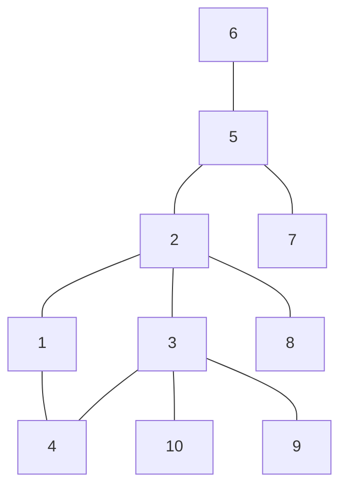
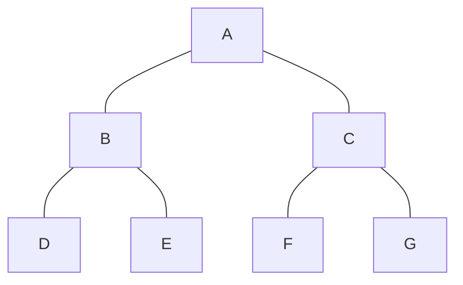
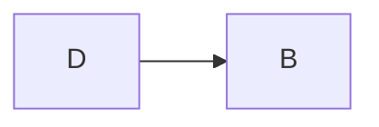
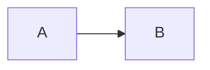
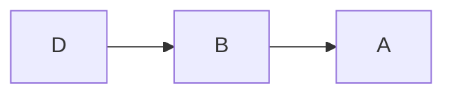
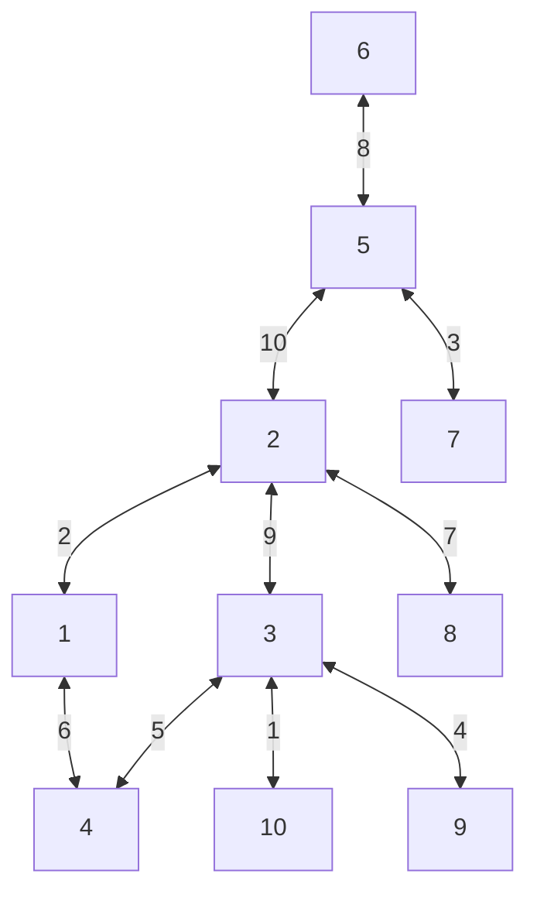
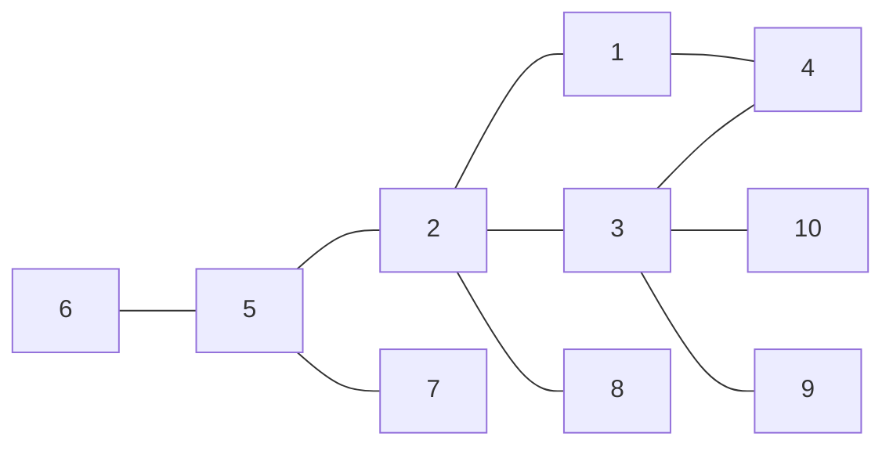
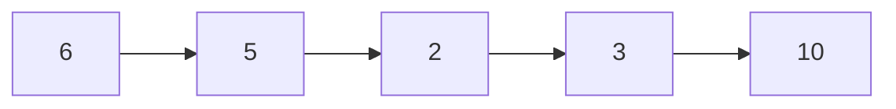
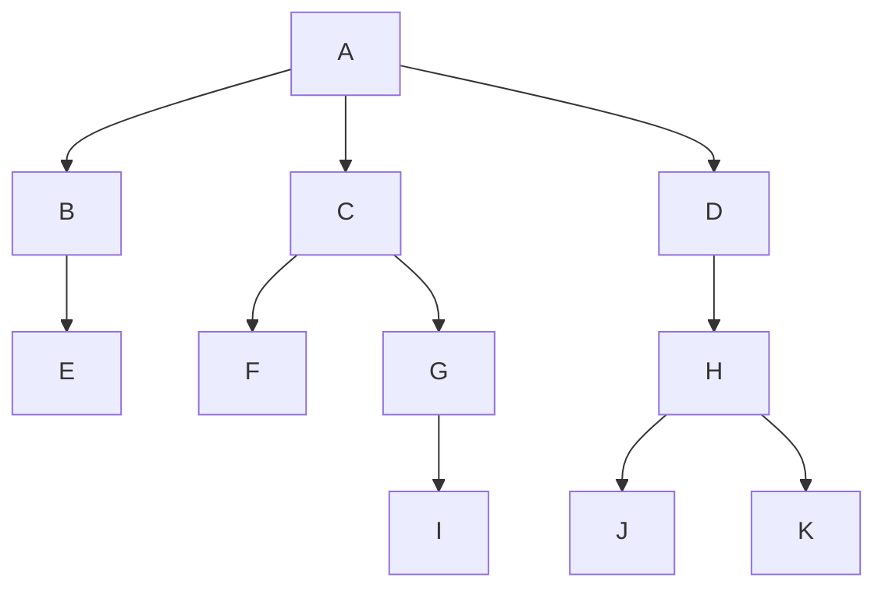

---
{"dg-publish":true,"permalink":"/artificial-intelligence/module-2-search-strategies-and-adversarial-search/","title":"Search Strategies and Adversarial Search -- Artificial Intelligence","tags":["Semester-5","Semester-4"],"created":"2025-08-23T18:06:00.391+05:30"}
---


---

# Search Strategies -- Problem Solving Agents

At their core, problem-solving agents are essentially computer programs designed to tackle problems systematically and autonomously. Think of them as virtual problem solvers that can analyze situations, devise plans, and execute actions to achieve a specific goal.

Here's a breakdown of key aspects:

- **Goal-Oriented:** Problem-solving agents always have a target objective in mind – they're trying to _solve_ something.
- **World Model:** To be effective, these agents need a representation of the world around them. This could be a simple model or a complex simulation, depending on the problem's complexity.
- **Search and Planning:** They employ search algorithms (like the ones we've been discussing!) to explore possible solutions and plan a course of action.
- **Action Execution:** Once a plan is formulated, the agent takes steps in the real world or within its simulated environment to implement it.
- **Feedback and Learning:** Many problem-solving agents can learn from their experiences. They might adjust their strategies based on successes, failures, or changing environmental conditions.

**Examples of Problem-Solving Agents:**

- **Navigation Agents:** Think of self-driving cars or robots that need to find the shortest path to a destination while avoiding obstacles.
- **Game AI:** The artificial intelligence in video games that makes decisions for characters, strategizes against players, and responds to in-game events.
- **Resource Management Systems:** Programs that optimize the allocation of resources (like energy, materials, or time) to achieve specific goals in industrial settings or simulations.

---
# Search Strategies -- Graph Algorithms.

## 1. Breadth First Search

**Concept**: BFS explores nodes ==level by level==. It starts at the root (or any arbitrary node) and explores all its neighbors at the present depth before moving on to nodes at the next depth level.

**Algorithm**:

1. Start at the root node and enqueue it.
2. Dequeue a node from the queue, mark it as visited, and enqueue all its unvisited neighbors.
3. Repeat step 2 until the queue is empty.


For example, in this graph, a possible BFS result could be:


So the main rules in BFS are :

1. You can start exploration from ==any vertex==.
2. While exploring a vertex can visit ==the adjacent vertices== in any order.
3. While exploring a vertex, you ==must visit all it's adjacent vertices== before exploring the next vertex.
4. You should select the next vertex from a ==queue== only.
5. As soon as you start exploring a vertex, it needs to be pushed onto the queue.
6. Do this till all the vertices are visited.


More viable BFS results would be :


### Algorithm


**BFS (Breadth-First Search)**

1. **Start at the root node.** Add it to a special list called the "queue".
    
2. **While the queue is not empty:**
    
    - Take the first node from the front of the queue. This is the next node we explore.
    - Visit this node (do something with it, like checking if it's our goal).
    - For each _neighbor_ (connected node) of the current node that hasn't been visited yet:
        - Add the neighbor to the back of the queue.
3. **If we never found our goal, there's no path.**

**Note** : We only push unvisited nodes to the queue

**Explanation**

- The `queue` in BFS keeps track of nodes waiting to be explored – first-in, first-out (FIFO).

---

## 2. Depth First Search

**Concept**: DFS explores ==as far as possible along each branch before backtracking==. It uses a stack/queue (or recursion) to keep track of the path.

It is similar to pre-order traversal.

The rules of DFS are :

1.  You can start exploration from ==any vertex==.
2. Once you start exploring a vertex, push it to the queue then visit the next adjacent vertices in a sequential manner.
3. In case there is another adjacent vertex on the other side of the currently explored vertex, you need to traverse back to it and then visit the other vertex.
4. Do this till all the vertices are visited.


More valid DFS results :


For the graph 


However there is a significant ==drawback== of DFS 

**Problem:** DFS can sometimes go too deep, getting stuck in infinite loops or exploring paths that aren't useful.

**Solution:** DLS sets a _maximum depth limit_. It explores branches just up to that limit, then backtracks. (Explained in DLS)

---

## 3. Depth-Limited Search

It works on the drawbacks of [[#2. Depth First Search]]

**Basic algorithm/pseudocode**

```mathematica
function depth_limited_search(node, max_depth):

  1.  If node is the goal node, return true (found it!) 
  2.  If current depth exceeds max_depth, backtrack (return false) 
  3.  Mark node as visited.
  4. For each unvisited neighbor of node:
     * Call depth_limited_search(neighbor, max_depth - 1) 
     * If any recursive call returns true (found the goal), return true

   5. Return false (didn't find the goal in this branch)
```


Here's the basic idea:

- **Problem:** DFS can sometimes go too deep, getting stuck in infinite loops or exploring paths that aren't useful.
    
- **Solution:** DLS sets a _maximum depth limit_. It explores branches just up to that limit, then backtracks.
    

Think of it as a cautious explorer who carries a rope with a set length. They can only explore down one path as far as the rope allows before having to pull back.

**How DLS Works:**

1. **Choose a Depth Limit:** Decide how many levels deep you want to explore (e.g., 3 levels).
    
2. **Start at the root node.** Mark it with depth 0.
    
3. **Recursive Exploration:**
    
    - For each neighbor of the current node:
        - Recursively call DLS on that neighbor, increasing the depth by 1.
        - If the depth limit is reached, _do not explore further_. Backtrack instead.
4. **Goal Check:** If the goal is found during exploration, you've succeeded!
    

**Advantages of DLS:**

- Avoids infinite loops: By setting a depth limit, you prevent endless searching down one path.
- More controlled than DFS: Gives you finer-grained control over how deep to explore.

### **Worked out Example**

Take this graph here for example:



**Choosing a Depth Limit:**

First, ==we need to decide how deep we want to go==. Let's say we choose a depth limit of 3. This means we'll only explore paths that are at most 3 levels deep from the starting node (6).

**Applying DLS:**

1. **Start at Node 6 (Depth 0):**
2. **Explore Neighbors:**
    - Node 5 (Depth 1):
        - Explore Node 7 (Depth 2) -> No goal found, backtrack to Node 5.
        - Explore Node 2 (Depth 1): ... continue exploring Node 2's neighbors
3. **Backtrack:** Once we've explored all reachable nodes at Depth 3 or less, the algorithm stops.

**Result:**

DLS with a depth limit of 3 will explore paths like this:

- 6 -> 5 -> 7 -> ... (stop exploring if you reach level 3)
- 6 -> 5 -> 2 -> 1 ... and so on

It ==won't necessarily find the _shortest_ path==, but it will find all paths of length 3 or less.

So to traverse this graph using DLS entirely, we can do this.

Starting with a depth level of 3

Let's set an imaginary queue to store the traversal sequence

```mathematica
Push 6
Push 5
Push 7
==LIMIT REACHED==
Backtrack to 5
Select 5
Push 2
Push 1
==LIMIT REACHED==
Select 2
Push 3
Push 8
===LIMIT REACHED==
Select 3
Push 4
Backtrack to 3
Push 10
Backtrack to 3
Push 9
==ALL NODES VISITED==
```

We read the traversal order using only the `pushed` elements.

So final sequence will be 

```mathematica
6, 5, 7, 2, 1, 3, 8, 4, 10 9
```

Another Example:



Using a depth limit of 4 this time.
And setting an imaginary queue.

```mathematica
Push A
Push B
Push D
Backtrack to B
Push E
===LIMIT REACHED===
Backtrack to A
Push C
Push F
Backtrack to C
Push G
===END OF GRAPH REACHED===
```
So the traversal sequence will be: `A, B, D, E, C, F, G`

---

## 4. Bi-Directional Search.


**The Core Idea:**

Imagine you're trying to find a specific book in a very large library. You could search from one end (like the A section) and work your way towards the other end (Z section), hoping to find the book along the way. That's similar to how Depth-First Search works.

Now, ==imagine you have two librarians, each starting from opposite ends of the library and searching simultaneously towards the middle. They are both looking for the same book. That's the essence of Bidirectional Search==!

Instead of searching in one direction only, we start searches from _both_ the initial state (your starting point) and the goal state (what you're trying to reach), expanding outwards towards each other.

**Algorithmic Explanation**

1. **Initialization**: Initialize two queues, `Q_start` and `Q_goal`, and two sets, `visited_start` and `visited_goal`, to keep track of visited nodes.
2. **Forward search**: Start a breadth-first search (BFS) from the source node, adding neighbors to `Q_start` and marking them as visited in `visited_start`. This search continues until a node is found that is also visited by the backward search (see step 5).
3. **Backward search**: Start a BFS from the goal node, adding neighbors to `Q_goal` and marking them as visited in `visited_goal`. This search continues until a node is found that is also visited by the forward search (see step 2).
4. **Intersection**: When the forward and backward searches intersect at a node, it means that the shortest path has been found. This node is the meeting point of the two searches.
5. **Path reconstruction**: Reconstruct the shortest path by tracing back from the intersection node to the source node (using `visited_start`) and from the intersection node to the goal node (using `visited_goal`). The combined path is the shortest path between the source and goal nodes.


**Advantages:**

- **Faster than Uniformed Search:** Because we're essentially converging on the solution from both sides, Bidirectional Search can often find a path much quicker than Depth-First or Breadth-First Search, especially for problems where the goal is closer to one of the starting points.
- **More Efficient Memory Usage:** In some cases, it uses less memory compared to Uniformed Search methods because we only need to store nodes relevant to both searches, not the entire search tree.

**Disadvantages:**

- **Not Always Applicable:** Bidirectional Search requires that we know the goal state in advance. It's also more complex to implement than simpler search algorithms.
- **Can Struggle with Large State Spaces:** If the problem has a very large number of possible states, it might still take a significant amount of time to converge on a solution.


### Worked out Examples.

Using graph:


So we set two queues, one from start node and another one from the goal node

Let the start node be `D` and the goal node be `A`

Following that logic, we apply DLS in this case with a `Depth Limit` of 3 to ==save time==

Thus implementing queues....

```mathematica
Select D.   Select A
Push D       Push A
Push B        Push B
=== INTERSECTION POINT FOUND AT B===

Joining paths...
```

A visual representation of the above logic would be






Intersection point : `B`

Merging the paths, we get:

Final shortest path from start to goal



**Example 2**


Let's set goal node to `6` and start node to `10`,

Setting up queues with DLS limit of `3`

One approach to this would be :

```mathematica
Select 10           Select 6
Push 10             Push 6
Push 3                Push 5
Push 2                Push 2
==INTERSECTION POINT FOUND AT 2==
```

Final traversal sequence would be: `10, 3, 2, 5, 6`


Another take at this would be:

```mathematica
Select 10            Select 6
Push 10               Push 6
Push 3                  Push 5
Push 2                  Push 7
==LIMIT REACHED==
Push 5                Backtrack to 5
=== INTERSECTION POINT FOUND AT 5===
```
Final traversal sequence would be: `10, 3, 2, 5, 6`

This second take highlights a key point: ==when using DLS, sometimes we might hit our depth limit before finding an intersection==.

----
## 5. Uniform Cost Search

The name "Uniform Cost Search" does hint at the key characteristic: all edges (connections between nodes) have a *cost*.

So this means that "Uniform Cost Search" operates on a **weighted graph**. Each edge connecting nodes has an associated _cost_ or _weight_. Since all edges have the same cost in this algorithm, that weight is consistent for every connection

**Algorithm**

1. **Initialization:**
    
    - Start at the root node (your starting point).
    - Create a set called "visited nodes" to keep track of explored nodes.
    - Create a set called "frontier" and add the root node to it.
    - Assign a tentative cost of 0 to the root node.
2. **Iteration:** * While the frontier is not empty:
    
    - Select the node from the frontier with the lowest tentative cost (this prioritizes paths with lower total cost so far).
    - If the selected node is your goal node, you've found a solution! Trace back the path to reconstruct the solution.
    - Otherwise, mark the selected node as "visited".
    - For each neighbor of the selected node:
        - If the neighbor is not visited:
            - Calculate the tentative cost to reach the neighbor (cost from root to current node + edge cost).
            - Add the neighbor to the frontier.
            - Assign the calculated tentative cost to the neighbor.
3. **No Solution:** If the frontier becomes empty, it means there's no path from the start node to the goal node within the given constraints.





Initialize a queue called "visited nodes"

Let's find a path from node 1 to node 8 using Uniform Cost Search

```mathematica
Select Node 1 as our starting node.

Assign a cost of 0 to node 1.

Push node 1 to "visited nodes". [1]


Expand node 1 -> Neighbours ((2, edge cost = 2), (4, edge cost = 6))

Select node 2, push node 2 to "visited nodes". [1, 2]

Expand node 2 -> Neighbours ((5, edge cost = 10), (8, edge cost = 7), (3, edge cost = 9))

Goal node detected: Node 8, edge cost = 7

Push node 8 to "visited nodes". [1, 2, 8]

```
Final traversal sequence :  

```mathematica
[1 -> 2 -> 8]

Total cost incurred = 0 + 2 + 7 = 9

```

---
# Search Strategies -- Comparison between uninformed search methods.

| Algorithm                      | Description                                                                                                                                                 | Space Complexity | Time Complexity | Advantages                                                                          | Disadvantages                                                                    |
| ------------------------------ | ----------------------------------------------------------------------------------------------------------------------------------------------------------- | ---------------- | --------------- | ----------------------------------------------------------------------------------- | -------------------------------------------------------------------------------- |
| **Breadth-First Search (BFS)** | Explores the graph level by level. Visits all nodes at a given depth before moving to the next deeper level.                                                | O(b^d)           | O(b^d)          | Guaranteed to find the shortest path (if one exists)                                | Can be memory intensive for large graphs                                         |
| **Depth-First Search (DFS)**   | Explores as far as possible along each branch before backtracking.                                                                                          | O(b^d)           | O(b^d)          | Simple to implement, good for finding paths even if they are not shortest           | Might get stuck in infinite loops; doesn't guarantee shortest path               |
| **Depth-Limited Search (DLS)** | Similar to DFS but with a depth limit. Stops exploring a branch once the limit is reached.                                                                  | O(b^d)           | O(b^d)          | Prevents infinite loops; useful when finding shortest path is not essential         | May not find the optimal solution if the solution is deeper than the depth limit |
| **Bidirectional Search**       | Uses two queues, one starting at the goal and one starting at the initial state. Converges towards each other.                                              | O(b^d)           | O(b^(d/2))      | Often significantly faster than other methods when a solution exists                | Requires knowledge of the goal state in advance; can be complex to implement     |
| **Uniform Cost Search (UCS)**  | Explores the graph by always selecting the node with the lowest total cost so far. Guarantees finding the shortest path if all edge costs are non-negative. | O(b^d)           | O(b^d)          | Guaranteed to find the shortest path; works even for graphs with varying edge costs | Can be less efficient than other algorithms if the graph is sparse               |

**Key:**

- **b:** The branching factor (average number of children nodes per node)
- **d:** The depth of the solution

---

# Heuristic Search Strategies : Informed search algorithms & Shortest Path Algorithms.

## 1. Greedy best-first search.

Greedy best-first search is a heuristic search algorithm that prioritizes exploring nodes that appear most promising based on an immediate reward or cost estimate provided by the heuristic function.

**Core Idea:** At each step, the algorithm selects the node that appears to lead to the goal state most quickly, according to the heuristic function. It essentially "greedily" chooses the path that seems best in the short term, without considering the long-term consequences.

**How it Works:**

1. **Start at the initial node.**
2. **Evaluate the cost to reach each neighboring node using the heuristic function.** The heuristic function estimates the distance or cost from a given node to the goal state.
3. **Select the neighbor with the lowest estimated cost (according to the heuristic).**
4. **Expand the selected node, exploring its neighbors and repeating steps 2-3.**

**Example:** Imagine finding the shortest path in a maze using a heuristic that estimates the distance to the exit. Greedy best-first search would always choose the path that appears to be closest to the exit at each step, even if it leads to a dead end later on.

**Pros:**

- **Simple to implement.**
- **Can be efficient when the heuristic is accurate and the goal state is close.**

**Cons:**

- **May not find the optimal solution.** Because it only considers short-term gains, it can get stuck in local optima and miss better paths further down the line.
- **Relies heavily on the accuracy of the heuristic function.** If the heuristic is flawed, the algorithm may lead to suboptimal or incorrect results.

Taking our graph example again




For this example, let's assume our **goal node is node 10**. We also need to define a **heuristic function** that estimates the distance from each node to node 10. You can choose any reasonable heuristic for this example graph. For simplicity, let's say the heuristic assigns a value equal to the number of edges we need to traverse to reach node 10 directly.

Let's start from **node 6**.

Based on this, let's implement an imaginary queue for visualization purposes

So, following the generated heuristic data:


```
Node 5: Heuristic(5) = 3 (Select 5 since 5 is the only node connected to 6)
Push 5
Node 2: Heuristic(2) = 3
Node 7: Heuristic(7) = 5

Select Node 2 as it has the lower heuristic value of 3
Push 2

Node 1: Heuristic(1) = 4
Node 3: Heuristic(3) = 1
Node 8: Heuristic(8) = 4

Select Node 3 as it has the lower heuristic value of 1.
Push 3

Node 10: Heuristic(10) = 0
Node 4: Heuristic(4) = 2
Node 9: Heuristic(9) = 2

Select Node 10 as it has the lowest heuristic value of 0 and is our goal node
Push 10
```


**Time complexity**:

- **Best Case:** O(b), where 'b' is the branching factor (average number of neighbors per node).
    - This occurs when the heuristic function always guides the search directly to the goal node with minimal exploration.
- **Average Case:** O(b^d), where 'd' is the depth of the shortest path to the goal node.
    - In most cases, Greedy Best-First Search might explore a number of nodes proportional to the average branching factor raised to the power of the depth of the shortest path.
- **Worst Case:** O(b^m), where 'm' is the maximum depth of the search tree.
    - The worst case occurs when the heuristic function consistently leads the algorithm astray, resulting in a very long and deep exploration of the graph.

---
## A* search algorithm

- **Foundation:** A* builds upon the concepts of Greedy Best-First Search, incorporating a key component: the cost so far (g) to reach a node from the starting node.
    
- **Two Costs:**
    
    - g(n): The actual cost (distance or steps) incurred in traveling from the start node to node 'n'.
    - h(n): The heuristic function's estimate of the cost to travel from node 'n' to the goal node.
- **f(n):** The total estimated cost to reach the goal node through node 'n', calculated as: f(n) = g(n) + h(n)
    
- __How A_ Works:_*
    
    1. **Initialization:** Start at the initial node and set its `f(n)` value.
    2. **Open List and Closed List:** Use an open list (nodes to be explored) and a closed list (nodes already explored). Initially, only the starting node is on the open list.
    3. **Node Selection:**
        - Select the node from the open list with the lowest f(n) value.
        - Remove this node from the open list and add it to the closed list.
    4. **Neighbor Exploration:** For each neighbor of the selected node:
        - Calculate `g(neighbor)`, `h(neighbor)`, and `f(neighbor)`.
        - If the neighbor is already on the closed list and has a lower `f(neighbor`) value than before, update its `f(neighbor)` value.
        - If the neighbor is not on either list, add it to the open list.
    5. **Goal Check:** If the goal node is selected, reconstruct the path from the starting node to the goal node by backtracking through the nodes' parent pointers (usually stored during the search process).

__Advantages of A_ Search:_*

- **Optimal Solution:** Guarantees finding the shortest (lowest cost) path to the goal if the heuristic function is admissible (never overestimates the cost to reach the goal).
- **Efficient:** Often outperforms uninformed search algorithms and can be more efficient than Greedy Best-First Search.

**Disadvantages:**

- Requires a good heuristic function. Choosing an inappropriate heuristic can lead to suboptimal or incorrect results.
- May still be computationally expensive for very large search spaces.

**Example Heuristic Function:** In a grid-based map, the Manhattan distance between two points could serve as a heuristic, estimating the cost based on the horizontal and vertical distances.

Taking our examples graph again:


Let's say for now we have some dummy heuristic and cost values

| Node | Cost (g) | Heuristic (h) | Total(f) |
| ---- | -------- | ------------- | -------- |
| 6    | 0        | 9             | 9        |
| 5    | 1        | 7             | 8        |
| 7    | 2        | 6             | 8        |
| 2    | 3        | 4             | 7        |
| 1    | 4        | 2             | 6        |
| 3    | 5        | 0             | 5        |
| 4    | 6        | 1             | 7        |
| 8    | 7        | 3             | 10       |
| 9    | 8        | 5             | 13       |
| 10   | 9        | 0             | 9        |
We need to find the shortest path from node 6 to node 10.

==The actual calculation of f, g and h for each node is done in real time when the nodes are approached in real world examples using pre-defined heuristic methods. Here for understanding purposes, we have dummy values present.==

So a detailed working using an open list and a closed list, would be:

```mathematica
Open list: [6, f=9]

Push 6 on closed list. f(n) = 9 , 
Expand node 6, neighbors: 5  push [5, f=8] on open list, delete node 6 from open list
Push 5 on closed list f(n) = 8 
Expand 5, neighbors: 2, 7, push [(2, f=7), (7, f=8)] on open list, delete node 5 from open list

Expand 2, neighbors: 1, 3, 8, push [(1, f=6), (3, f=5), (8, f=10)] on open list, delete node 2 from open list
Push 2 on closed list f(n) = 7 (less than f(7) = 8)
Delete: 7 from open list.
Expand 1, neighbors: 4, not goal node.
Delete: 1 from open list
Expand 3, neighbors: 4, 10, 9, push [(4, f=7), (10, f=9), (9, f=13)]
Push 3 on closed list f(n) = 5 (less than f(1) = 6 and f(8) = 10)
Delete: 3 and 8 from open list
Push 10 on closed list f(n) = 9 (greater than f(4) = 7 and lesser than f(9) = 13) but it is the goal 
node so node 4 is skipped
```
Final shortest path will be:

```mathematica
[6,5,2,3,10]
```


So in simple terms, ==once we have the **h(n)** and **g(n)** values, we add them up and get the **total estimated cost** for each node, which we then follow in order of the shortest to the largest to get to the goal==.

---

## Memory-bound Heuristic Search Algorithms

**What is Memory-Bounded Heuristic Search?**

- **Problem:** ==Standard A* search can be memory intensive, especially in large search spaces==. It stores all explored nodes and their information.
- **Solution:** ==Memory-bounded heuristic search algorithms impose limits on the amount of memory used during the search process==. This forces us to make decisions about which nodes to keep track of and which to discard.

**Key Concepts:**

- **Memory Limit (k):** Defines the maximum number of nodes that can be stored in memory at any given time.
- **Trade-offs:** There's a trade-off between search efficiency and solution quality. Limited memory might lead to suboptimal solutions, but it also makes the search more feasible in large problems.

**Applications of Memory-Bounded Search:**

- **Game Playing:** AI agents often need to search large game states efficiently, so memory limitations are crucial.
- **Natural Language Processing:** Text generation and machine translation tasks involve extensive searches over possible word sequences.
- **Robotics Path Planning:** Robots must find paths in complex environments with limited computational resources.

---
## More on memory bound heuristic search:

### Local search algorithms and optimization problems.

#### Hill climbing algorithm.


**Hill Climbing Search** is a local search algorithm used for finding the optimal or near-optimal solution in a problem space. It works by repeatedly making small changes to the current state, moving towards a direction that seems to improve the objective function (the function you want to maximize or minimize). Imagine it like climbing a hill – you take steps uphill until you reach a peak.

**Here's how it works:**

1. **Initialization:** Start with an initial random state.
2. **Evaluation:** Evaluate the objective function for the current state.
3. **Neighbor Exploration:** Consider all possible neighboring states (adjacent solutions).
4. **Selection:** Choose the neighbor that leads to the greatest improvement in the objective function value.
5. **Update:** Move to the selected neighbor, making it the new current state.
6. **Repeat Steps 2-5:** Continue this process until a stopping condition is met. Common stopping conditions include reaching a maximum number of iterations, finding a state where no neighbors improve the objective function (a local optimum), or exceeding a predefined time limit.

### State Space in Hill climbing

1. **Definition**:
    
    - The state space ==is the collection of all possible states or configurations== that can be achieved based on the problem constraints and rules.
    - Each state represents a possible situation or configuration that the algorithm can encounter during the search.
2. **Components of State Space**:
    
    - **States**: Each state is a unique configuration of the problem variables. For example, in a puzzle-solving problem, each arrangement of pieces would be a different state.
    - **Initial State**: The starting point of the search, from which the algorithm begins its exploration.
    - **Goal State**: The desired state or solution the algorithm is trying to reach.
    - **Neighbors**: The set of states that can be reached directly from the current state by applying valid actions or moves.
    - **Transitions**: The rules or actions that move the algorithm from one state to another.


**Terminologies associated with state space:**

- **Objective Function**: This represents the ==function that the algorithm is trying to optimize==. In hill climbing, ==this could be a cost function, score, or any metric used to evaluate== the quality of a solution.
    
- **State Space**: It encompasses ==all possible configurations or solutions== that the algorithm can explore. Each point in this space corresponds to a potential state or configuration of the problem.
    
- **Current State**: The ==current position in the state space from where the algorithm starts== or is currently exploring. It is the initial solution or configuration in the optimization process.
    
- **Global Maximum**: This is the ==highest point== in the entire state space, ==representing the optimal solution==. The goal of the hill climbing algorithm is to reach this point.
    
- **Local Maximum**: A peak in the state space that is higher than all neighboring states but not the highest point in the entire space. ==The algorithm may mistakenly converge here, believing it to be the best solution==.
    
- **Flat Local Maximum**: ==A plateau in the state space where neighboring states have equal value to the current state. This can trap the algorithm==, as it can't determine a better direction to move in.
    
- **Shoulder**: ==A region where the objective function remains relatively constant over a range of states, followed by a rise==. It can be challenging for the algorithm to move past this region due to the lack of improvement in the objective function.

**Advantages of Hill Climbing Search:**

- Simple to understand and implement.
- Can be relatively efficient for problems with a well-defined search space.
- Works well when the objective function is smooth and unimodal (has a single peak).

**Disadvantages of Hill Climbing Search:**

- Can get stuck in local optima, meaning it might find a good solution but not the absolute best one.
- Sensitive to the initial state – different starting points can lead to different results.
- May not be suitable for complex problems with many local optima or a non-smooth objective function.

Let's use our example graph here.


### State Space in the Graph Example

1. **Nodes as States**:
    
    - Each node in the graph represents a unique state in the state space.
    - For instance, nodes `1`, `2`, `3`, etc., are different states.
2. **Edges as Transitions**:
    
    - Each edge between nodes represents a transition or action that can be taken to move from one state to another.
    - The cost associated with each edge is like the "effort" or "cost" required to transition between these states.
3. **Initial State**:
    
    - This is the starting node from where the search begins. In your example, if the start is node `1`, then node `1` is the initial state.
4. **Goal State**:
    
    - This is the target node that you want to reach. For example, if you want to reach node `8`, then node `8` is the goal state.
5. **Neighbors**:
    
    - The neighboring nodes of a current node represent the possible states that can be reached directly from the current state by following the edges.
    - For instance, from node `1`, you can move to nodes `2` and `4` with respective edge costs of `2` and `6`. These nodes are neighbors in the state space of node `1`.


Let our objective function here be the total cost function (edge cost.)

Start node: 1
Goal Node: 8

```mathematica
Select 1
Push 1 -> [1]

Expand node 1 -> Neighbours ((2, edge cost = 2), (4, edge cost = 6))
Select node 2, push node 2 -> [1,2]

Expand node 2 -> Neighbours ((5, edge cost = 10), (8, edge cost = 7), (3, edge cost = 9))

Goal node detected: Node 8, edge cost = 7, which is also the lowest among the other neighbours.
Push 8 -> [1, 2, 8]

```
With respect to state space:

### Example of State Space Exploration in Hill Climbing

1. **Initial State**: Let's start at node `1`.
    
    - Current state: `1`
    - Neighbors: `2` (cost `2`), `4` (cost `6`).
2. **Next State Selection**:
    
    - Hill Climbing selects the neighbor with the least cost (or best heuristic).
    - Choose `2` (cost `2`).
3. **New Current State**: Node `2`
    
    - Current state: `2`
    - Neighbors: `5` (cost `10`), `8` (cost `7`), `3` (cost `9`).
4. **Next State Selection**:
    
    - The goal node `8` is detected with a cost of `7`.
    - Move to node `8` as it represents the goal state in the state space.
5. **Final Path**:
    
    - The final path is `[1 -> 2 -> 8]` with a total cost of `9`.


Final traversal sequence: `[1 -> 2 -> 8]`

Total cost incurred = `0 + 2 + 7 = 9`

---
#### Steepest Hill climbing algorithm.

The Steepest Hill Climbing algorithm (aka Steepest-Ascent Hill Climbing Algorithm) is a variation of the hill climbing algorithm that evaluates all neighboring states and selects the one with the highest improvement (steepest ascent) over the current state. It ensures that each move is the most optimal among all possible moves from the current state.

#### Key Characteristics:

1. **Evaluates All Neighbors**: ==Unlike the basic hill climbing algorithm that evaluates one neighbor at a time, steepest-ascent evaluates all possible neighboring states==.
2. **Selects the Best Move**: Moves to the neighbor with the highest value (steepest increase in the objective function).
3. **Prevents Some Local Maxima**: While it can still get stuck in local maxima, it tends to reach better solutions than simple hill climbing.

### How It Works:

1. **Start**: Begin at an initial state (current state).
2. **Generate Neighbors**: Generate all possible neighboring states.
3. **Evaluate Neighbors**: Evaluate all neighbors and select the one with the highest value.
4. **Move to the Best Neighbor**: Move to the neighbor with the highest value.
5. **Repeat**: Repeat steps 2-4 until no better neighbors exist (local maximum).


**Example:**

Using the same graph:


Let's take the same start node and goal node:

Start node: 1
Goal node: 8

#### Step-by-Step:

1. **Start at Node 1**:
    
    - Path: `[1]`
    - Current Cost: `0`
2. **Generate Neighbors of Node 1**:
    
    - Neighbors: `(2, edge cost = 2)`, `(4, edge cost = 6)`
    - Evaluate all neighbors: choose node 2 (lower edge cost of 2).
    - Path: `[1, 2]`
    - Current Cost: `0 + 2 = 2`
3. **Generate Neighbors of Node 2**:
    
    - Neighbors: `(5, edge cost = 10)`, `(8, edge cost = 7)`, `(3, edge cost = 9)`
    - Evaluate all neighbors: choose node 8 (goal node) with the lowest edge cost of 7.
    - Path: `[1, 2, 8]`
    - Current Cost: `0 + 2 + 7 = 9`
4. **Goal Reached**:
    
    - Node 8 is the goal node, so the algorithm terminates.

### Final Path:

- **Traversal Sequence**: `[1 -> 2 -> 8]`
- **Total Cost**: `9`

### Comparison to Simple Hill Climbing

- Both algorithms resulted in the same path in this case because the best path was directly available.
- **Steepest-Ascent Hill Climbing** always evaluates all neighbors at each step to make the optimal choice.

---
#### Stochastic Hill Climbing

Stochastic Hill Climbing is a variant of the basic hill climbing algorithm ==where instead of deterministically choosing the best neighbor, a random neighbor is chosen at each step==. This introduces randomness into the process, allowing the algorithm to potentially escape local maxima and explore a broader area of the state space.

#### Steps in Stochastic Hill Climbing:

1. **Start with an Initial State**: Choose an initial state, often randomly or based on prior knowledge.
2. **Generate a Random Neighbor**: Instead of evaluating all neighbors, randomly select one neighbor from the current state.
3. **Compare the Neighbor**: If the randomly selected neighbor has a better objective function value than the current state, move to this neighbor.
4. **Repeat**: Continue generating and evaluating random neighbors until a stopping criterion is met, such as a maximum number of iterations or a satisfactory objective function value.
5. **Termination**: If no better neighbor is found, the algorithm stops, potentially at a local maximum.

#### Advantages:

- **Escape Local Maxima**: The randomness allows the algorithm to potentially escape local maxima and explore different parts of the state space.
- **Simplicity**: The algorithm is easy to implement and doesn’t require evaluating all neighbors.

#### Disadvantages:

- **No Guarantee of Optimality**: The random nature may cause the algorithm to miss the global optimum.
- **Sensitivity to Parameters**: Performance may vary greatly depending on the problem and parameters like the step size or neighborhood definition.


---
#### Simulated Annealing

Simulated Annealing ==is an optimization algorithm that builds on hill climbing and aims to overcome its limitations, such as getting stuck in local maxima==. Inspired by the annealing process in metallurgy, it introduces a probabilistic decision-making mechanism to escape local optima by allowing occasional "downhill" moves.

#### Key Concepts:

**1. Temperature Parameter**: ==The algorithm uses a temperature parameter, `T`, which controls the probability of accepting worse solutions==. ==The temperature decreases over time, reducing the likelihood of accepting worse solutions as the algorithm progresses==.
    
**2. Acceptance Probability**: When a worse solution is encountered, ==it is accepted with a certain probability==, which decreases as the temperature decreases. This helps the algorithm explore the search space more broadly in the beginning and focus on optimization towards the end.
     
 If a solution is worse (higher cost), it can still be accepted based on the probability calculated as:
     
$P=e^{-\Delta\ E / T}$
    
**3. Cooling Schedule**: 
   - The process of reducing the temperature over time is called the cooling schedule. A common cooling schedule is to multiply the temperature by a factor, such as 
	   $T = T * \alpha$ ,  where $0 < \alpha < 1$,  where $\alpha$ is a constant typically between 0.8 and 0.99.
    
- The choice of α\alphaα affects the convergence speed and exploration. A high $\alpha$ (close to 1) leads to slower cooling, allowing more exploration, while a low $\alpha$ (e.g., 0.8) cools the temperature rapidly, reducing the acceptance of worse solutions quickly.

**4. Stopping Criteria**:

- The algorithm usually stops when the temperature reaches a minimal threshold, or after a certain number of iterations, indicating that the search is now focused and the solution is likely near optimal.
### How It Works:

1. **Start with an Initial Solution**: Begin with an initial state and a high temperature.
2. **Generate Neighbor**: Generate a neighboring state.
3. **Evaluate**:
    - If the neighbor is better, move to the neighbor.
    - If the neighbor is worse, move to the neighbor with a probability based on the difference in evaluation and the current temperature.
4. **Update Temperature**: Reduce the temperature according to the cooling schedule.
5. **Repeat**: Continue until a stopping criterion is met, such as a minimal temperature or a certain number of iterations.

### Temperature's Role in Iterations

1. **Early Iterations**:
    
    - High $T$: The algorithm ==accepts worse solutions frequently==, avoiding getting trapped in local minima early in the search. It performs a more global exploration of the solution space.
      
2. **Middle Iterations**:
    
    - Moderate $T$: ==The acceptance probability decreases==, and the algorithm becomes more selective. It still explores but with a tendency to settle into more favorable regions.
      
3. **Late Iterations**:
    
    - Low $T$: ==The algorithm behaves more like a greedy hill-climbing search==, primarily accepting improvements or only very slight deteriorations. The search focuses on fine-tuning the current best solution.


    `Example layout of how the temperature drops over time for 10 iterations`
### Explanation:

- **`labels`**: The iterations (1 to 10).
- **`series`**: Contains a list of datasets:
    - **`title`**: Label for the data series (in this case, "Temperature").
    - **`data`**: The corresponding temperature values at each iteration, calculated using the formula $T=T_0 \times \alpha^n$ with $T_0=100$ and $\alpha = 0.95$.


### Example

Using our example graph again:


Now let's say that we want to move from node 6 to node 10 


```mathematica
Initial state/node = 6, Temperature: 100 
Generate neighbors: [5, cost=8] 
Select 5 as it is the only neighbor, temperature = 100 * 0.8 = 80 

Total current cost = 0 + 8 = 8

Generate neighbors of 5, : [2,7], costs: 10, 3 each. 
Ignore 7 as it is a leaf node and not our goal node. 
Select 2, cost = 10, temperature = 80 * 0.8 = 64 

Total current cost =  8 + 10 = 18

Generate neighbors of 2: [1, 3, 8], costs: 2, 9, 7

Move to node 3: Incremental cost = 18 + 9 = 27
Move to node 1: Incremental cost = 18 + 2 = 20

Calculate acceptance proabability of a higher cost move (moving to node 3)

```
$\Delta E = 27 - 20 = 7$

$P(accept) = e^{-7/64} \approx 0.89$

```mathematica
Since the probability of acceptance is very close to 1, accept the move to node 3.


Select node 3, cost = 9, temperature = 64 * 0.8 = 51.2
Total incremental cost= 18 + 9 = 27

Generate neighbours of 3: [4, 10, 9], each costs= 5, 1, 4

Select 10 as it is the goal node and has the lowest cost of 1.

Temperature = 51.2 * 0.8 = 40.96
Total incremental cost = 27 + 1 = 28

===GOAL NODE REACHED===

```

Final traversal sequence : `6, 5, 2, 3, 10`

Total incremental cost = `27 + 1 = 28`


`Graph showing the temperature drop and incremental cost as we move towards goal`


The <span style="color:rgb(0, 176, 240)">blue</span> line is the dropping of the temperature as the traversal is done, while the <span style="color:rgb(0, 255, 255)">cyan</span> line indicates the incremental cost as we traverse the given route to the goal node.

---
#### Beam Search

Beam search is a search algorithm that explores a graph ==by expanding the most promising nodes based on a heuristic evaluation function==. It ==keeps track of multiple paths simultaneously but limits the number of paths expanded at each level==. This limitation is controlled by a parameter called the _beam width_.

### How Beam Search Works:

1. **Initialization**:
    
    - Start from the initial node and evaluate its neighbors using a heuristic function (e.g., cost, distance, etc.).
    - Expand only the best _k_ nodes (based on beam width), where ==_k_ is the beam width==.
2. **Expansion**:
    
    - For each of the _k_ nodes, evaluate all their neighbors.
    - From all the expanded nodes, again select the top _k_ based on the heuristic.
3. **Iterative Process**:
    
    - Repeat the process of expanding only the best _k_ nodes at each step until the goal is found or all nodes are expanded.
4. **Termination**:
    
    - The search terminates when the goal node is reached within the selected nodes or no further nodes can be expanded.

### Advantages and Disadvantages:

- **Advantages**:
    
    - Efficient use of memory compared to exhaustive search algorithms.
    - Can be more effective than greedy search if the beam width is appropriately chosen.
- **Disadvantages**:
    
    - Risk of missing the optimal solution if the beam width is too narrow (pruning the optimal path).
    - Still requires careful tuning of the beam width for effective performance.

### Example

Using our example graph again:


Let's say we want to find the path from Node 1 to Node 8.

Let's say here the heuristic method be simply the ==cumulative path cost==.

| Node | Immediate edge cost (h) |
| ---- | ----------------------- |
| 6    | 0                       |
| 5    | 1                       |
| 7    | 2                       |
| 2    | 3                       |
| 1    | 4                       |
| 3    | 5                       |
| 4    | 6                       |
| 8    | 7                       |
| 9    | 8                       |
| 10   | 9                       |
```mathematica

-Initialization
    
    - Start at Node 1.
    - Neighbors: [2 (cost = 2), 4 (cost = 6)]
    - Choose top 2 nodes based on cost: [2, 4]]
    
- Expand Nodes 2 and 4:
    
    - Node 2 Neighbors: [5 (cost = 10), 8 (cost = 7), 3 (cost = 9)]
    - Node 4 Neighbors: [1 (cost = 6), 3 (cost = 5)]
    - Choose top 2 nodes based on cost: [8 (cost = 7), 3 (cost = 5)]
    
- Expand Nodes 8 and 3:
    
    - Goal Node 8 is found.
    - Path: 1 → 2 → 8 (Total Cost = 2 + 7 = 9)


```

Here node 4 although was expanded, was not considered as the cumulative cost from node 1 to node 2 through node 4 was higher(6+5+9=20) than directly going to node 2 (0+2 = 2).


**However the result entirely depends on the ==heuristic== function chosen. In this case it's only the ==cumulative path cost==.**

==**Using a different heuristic would have a totally different result.**==

---
### Constraint Specification Problem (CSP)

==A **Constraint Satisfaction Problem (CSP)** is a type of problem where the goal is to find a set of variable assignments that satisfy a number of constraints==. It is a standard framework used in many AI applications like scheduling, planning, and resource allocation.

#### Elements of a CSP:

1. **Variables**: The elements we want to find values for, e.g., `X1`, `X2`, ..., `Xn`.
2. **Domains**: The possible values each variable can take, e.g., `X1 ∈ {1, 2, 3}`.
3. **Constraints**: Rules that limit the values the variables can take, e.g., `X1 ≠ X2`.

A solution to a CSP is an assignment of values to all variables that satisfies all constraints.

#### Examples of CSPs:

- **Map Coloring**: Variables are regions or countries, domains are colors, and constraints are that adjacent regions should not have the same color.
- **Sudoku**: Variables are cells, domains are digits 1-9, and constraints are that no digit repeats in a row, column, or 3x3 grid.
- **N-Queens Problem**: Variables are the positions of queens on a chessboard, domains are rows or columns, and constraints are that no two queens can attack each other.


### Local Search for CSPs

Local search is a heuristic method that can be used for solving CSPs by starting from a complete but possibly incorrect solution and iteratively making improvements.

#### Characteristics of Local Search for CSP:

1. **Initial State**: Start with a complete assignment of values to all variables, even if it violates some constraints.
2. **Objective Function**: Minimize the number of violated constraints or the degree of violation.
3. **Neighbors**: States that can be reached by making a small change, e.g., changing the value of one variable.
4. **Hill Climbing or Random Walk**: Choose moves that reduce violations, or occasionally make random moves to escape local minima.
5. **Termination**: The search ends when no more improvements can be made or when all constraints are satisfied.

#### Techniques for Local Search in CSPs:

1. **Min-Conflicts Heuristic**: Choose the variable that is involved in the most constraints and change its value to minimize the number of conflicts with other variables.
2. **Simulated Annealing**: A probabilistic technique that allows bad moves occasionally to escape local minima.
3. **Genetic Algorithms**: Use a population of states and evolve them using crossover and mutation.

### Example: 4-Queens Problem Using Min-Conflicts

1. **Problem Setup**:
    
    - Variables: Positions of 4 queens on a 4x4 chessboard.
    - Domains: Rows (1-4) for each column.
    - Constraints: No two queens can be in the same row, column, or diagonal.
2. **Initial State**:
    
    - Start with a random configuration, e.g., `Q1 = (1, 1)`, `Q2 = (2, 3)`, `Q3 = (3, 4)`, `Q4 = (4, 2)`.
3. **Evaluate Conflicts**:
    
    - Count the number of conflicts for each queen. For instance, Q2 and Q4 are in the same diagonal, causing a conflict.
4. **Select Queen and Modify Position**:
    
    - Choose the queen with the highest conflict, e.g., Q2.
    - Change its row to minimize conflicts, e.g., move Q2 to `(2, 1)`.
5. **Repeat**:
    
    - Continue selecting and moving queens until no conflicts remain or a maximum number of iterations is reached.

Let's visualize this in a chart to understand better:


`Initial State`

This bar chart represents the initial positions of the queens (Q1 to Q4) on a 4x4 chessboard. The `data` array values represent the rows in which the queens are placed. This configuration could have conflicts that we'll visualize next


**Conflict Count Evaluation**


This line chart represents the number of conflicts each queen has in the initial state. For instance, Queen 2 has 2 conflicts with other queens (possibly sharing a diagonal or row).

### Analyzing Conflicts:

1. **Queen 1 (Q1)**:
    
    - **Position**: Row 1, Column 1.
    - **Conflicts**:
        - Diagonal conflict with Q4 (Row 2, Column 4) because they are on the same diagonal (both decrease by 1 when moving left and down).
2. **Queen 2 (Q2)**:
    
    - **Position**: Row 3, Column 2.
    - **Conflicts**:
        - Diagonal conflict with Q4 (Row 2, Column 4). They are on the same diagonal (both increase by 1 when moving right and down).
3. **Queen 3 (Q3)**:
    
    - **Position**: Row 4, Column 3.
    - **Conflicts**:
        - Diagonal conflict with Q2 (Row 3, Column 2). They are on the same diagonal (both decrease by 1 when moving left and up).
4. **Queen 4 (Q4)**:
    
    - **Position**: Row 2, Column 4.
    - **Conflicts**:
        - Diagonal conflict with Q1 (Row 1, Column 1) as discussed.
        - Diagonal conflict with Q2 (Row 3, Column 2) as discussed.

### Summary of Conflicts:

1. **Q1** has a diagonal conflict with Q4.
2. **Q2** has a diagonal conflict with Q4 and Q3.
3. **Q3** has a diagonal conflict with Q2.
4. **Q4** has a diagonal conflict with Q1 and Q2.

**State Transition (First Step)**


This bar chart shows the updated positions after moving Q2 to row 1, which reduces conflicts. We use the `min-conflicts` heuristic to choose the move.


**Updated Conflict Count**


This line chart represents the updated conflicts after the first move. There are still some conflicts, so we need to continue the search.


**Final State (No Conflicts)**


This bar chart represents the final state where all queens are placed in a configuration that avoids conflicts. Each queen is placed in a different row and column, and no two queens are in the same diagonal.


**Final Conflict Count**


This line chart represents the final conflict count after all queens are placed correctly. There are no conflicts left.


**Above representations need not be taken literally. It is just an example to show how CSPs are satisfied with a local search**.

---

# Adversarial Search


Adversarial search is a category of algorithms used for decision-making in competitive environments where multiple agents (often two) have opposing objectives. This is most commonly applied in game theory, where we analyze games like chess, tic-tac-toe, or checkers, where one player’s gain is another player’s loss. Here are the core concepts involved:

### Key Concepts in Adversarial Search

1. **Game Tree**:
    
    - A game tree is a graph representing all possible moves in a game, starting from the initial state and branching out for every possible move of the players.
    - Nodes represent game states, and edges represent moves.
      
2. **Minimax Algorithm**:
    
    - A strategy for minimizing the possible loss for a worst-case scenario.
    - The algorithm explores the entire game tree to choose a move that maximizes the player's minimum gain.
    - The player (Max) and the opponent (Min) alternate turns. Max tries to maximize the score, while Min tries to minimize it.
      
3. **Alpha-Beta Pruning**:
    
    - An optimization technique for the minimax algorithm that reduces the number of nodes evaluated.
    - It "prunes" branches in the game tree that won't affect the final decision, saving computational resources.
    - Uses two parameters, alpha and beta, to keep track of the minimum score that the maximizing player is assured of and the maximum score that the minimizing player is assured of, respectively.

---

## Min Max Algorithm (or Mini-Max Algorithm)

https://www.youtube.com/watch?v=Ntu8nNBL28o

The Minimax algorithm is a decision rule for minimizing the possible loss for a worst-case scenario.

In the game of **Tic-Tac-Toe**, it helps us decide the optimal move by exhaustively exploring the game tree, simulating all possible moves and counter-moves.

It is a ==backtracking== algorithm.

---

## ==**Read the following part with patience and you will understand how Mini-Max Algorithm works.**==

**Max (let's say human player)** will try to maximize it's utility (best move). 

**Min (computer)** will try to minimize it's utility (worse move for max)

Utility simply means the winning / losing points


Time complexity of Min Max = $O(b^d)$
where b = branching factor
d = depth.


Let's say we have a game tree here


==Both Max and Min do a thorough recursive traversal (DFS) in the game tree.==

Here Max decides it's strategy by seeing that if max traverses (`A->B->D`) then it will have the maximum reward of 8.

**How max decides it's strategy**:

At node B it sees that it has two places to go, D and E.

Taking maximum of the values in node D will result in `max(-1, 8) = 8`

And for the values of E, `max (-3, -1) = -1`

So max decides the the path of `A->B->D` will give the maximum output of 8, (`max(D) = max(8,-1)`).

Thus **maximizing it's score**.

And it will be 2, for (`A->C->F`) and 4 for (`A->C->G`)

Now when Min decides it's strategy it sees that Max has a win of 8 if it goes (`A->B->D`) 
And also Max has a win of 4 if it goes (`A->C->G`). (`max(C) = max(2,4)`)

Since Min's goal is to minimize Max's utility it selects the Move of -1 which will lead down the path of `A->B->E`

**How min decides it's strategy:**

At `A->D->E` it also sees that the maximum output is -1.

So it does a `min(D) = min(8, -1)` and gets the output of `-1`, which it thinks is the worst outcome for Max in case of branch D, thus **minimizing** Max's score.

Similarly in branch C, Min does a `min(C) = min(2,4)`, getting the value of `2` which it thinks is the worst outcome for Max in case of branch C, thus **minimizing** Max's score.

So Max knows that when it selects the D branch, Min will automatically put the value of `-1` in D, thus lowering the score of Max in that branch.

Max also knows that when it selects the C branch, Min will automatically put the value of `2` in C, thus lowering the score of Max in that branch as well.


Max then does a `max(D, C)` and gets the value of `2` as a result, thus opting for the score of `2` as it is better than the score of `-1`.


Final score of Max: `2`.

---
### Common Misconceptions by students.

However people might commonly question =="Max could simply ignore min's move of selecting -1 and go to D and get reward 8"== or =="Min could block the maximum reward of 8 by selecting it and Max has no choice but to go to -1"==

The key point to understand here is that ==the Minimax algorithm assumes both players are playing optimally==. This means that Min will always try to minimize Max's outcome to the best possible extent, and ==Max will always try to maximize its outcome to the best possible extent, considering Min's optimal responses==.

So one could say that Min is ==misleading== Max as any typical adversary should do.

However that is **not** the case here.

The Minimax tree is a way to ==simulate all possible moves== and ==counter-moves in advance==, ~~rather than a real-time, turn-by-turn decision-making process~~.


==**The simulation does happen turn wise, first Max doing an analysis of the node A then Min analyzing Node B , then Max analyzing nodes D, backtracks to B then analyzes Node E. The same happens for the branch of Node C as well.**==

`Max->Min->Max->Min......` like this.

---
### Why This Matters:

- **Game Tree vs. Real Game:**
    
    - In the actual game, Max and Min take turns making moves.
    - In the Minimax game tree, all possible moves are simulated **at once** to find the best strategy beforehand.
    
- **Planning Ahead:**
    
    - This strategy is akin to **planning ahead** in chess or tic-tac-toe.
    - A human might think, "If I move here, my opponent will likely respond there, then I'll move here..."
    - Minimax does this systematically, evaluating all potential moves and their consequences to choose the optimal first move.

---
### Key points to remember:

==If the game were genuinely turn-based== and if Min were able to make its own decisions to directly counter Max's moves, ==then Min would certainly choose to block Max's best outcome by picking a move that reduces Max’s advantage==.

However,
**Minimax Does Not Simulate Blocking:**

- Minimax, however, doesn’t simulate this blocking behavior in turn-based scenarios.
- Instead, it assumes that Min would minimize Max’s score by always choosing the least favorable outcome for Max in the full game tree, rather than actively countering Max's individual moves in real-time.

### Summary:

==Minimax serves as a blueprint==, mapping out all possible scenarios and guiding Max and Min on how to act optimally. It’s a strategic planning tool rather than an active player. The decisions it suggests are based on theoretical perfect play rather than dynamic interaction.


---
### Minimax in Tic-Tac-Toe

https://www.youtube.com/watch?v=5y2a0Zhgq0U

#### 1. **Game Representation**

Tic-Tac-Toe is represented as a 3x3 grid where players alternate placing their symbols (`X` and `O`) on the board. The objective is to get three of their symbols in a row, column, or diagonal.

#### 2. **Players and Goals**

- **Max**: ==Represents the AI or the player who is trying to maximize the score==. For example, if Max is `X`, they want to win the game.
- **Min**: ==Represents the opponent trying to minimize Max's score==. If Min is `O`, they want to block Max or win if possible.

#### 3. **Minimax Algorithm Steps**

1. **Initialization**: Start at the root node of the game tree, representing the current board state.
2. **Recursion**:
    - If the game is in a terminal state (win, loss, or draw), return a utility value (e.g., `+1` for a win for Max, `-1` for a win for Min, and `0` for a draw).
    - For each possible move, recursively calculate the value of the resulting state:
        - If it’s Max’s turn, pick the move with the highest value (maximize).
        - If it’s Min’s turn, pick the move with the lowest value (minimize).
3. **Backpropagation**: Propagate the utility value back up the tree to decide the optimal move at each step.

---
### How Minimax Works:

1. **Max's Turn**: The algorithm will pick the move that yields the highest score.
2. **Min's Turn**: The algorithm will pick the move that yields the lowest score.

The scores represent the desirability of the resulting game state. In Tic-Tac-Toe:

- `+1` for a win.
- `0` for a draw.
- `-1` for a loss.

Let's assume we're at the top of a Tic-Tac-Toe game tree. It’s Max’s turn to play:

The base states are indicated by the terminal states of `+1`, `0` and `-1`

The scores to the base states are assigned by the `evaluation function`.


Here the minimax algorithm generates all possible moves and counter moves, then backtracks to the current state, with the knowledge of each possible outcome, thus developing an unbeatable strategy.


**Min will most probably opt for the middle branch as that assures either a draw or a loss for Max, i.e ==Max never wins== in this scenario.**

**Max will most probably opt for the third branch as that assures either a draw or a win for Max, i.e ==Min never wins== in this scenario.**

The first branch will most probably ==not be chosen by either **Min or Max**== as both stand an equal chance of winning/losing the probability is 50/50.

Since both's respective goals are to *maximize/minimize the score* to the most, mostly second and third branches will take place. 

### How Values Change:

- **Max's Turn**: The values are calculated to maximize the outcome for Max.
- **Min's Turn**: The values are calculated to minimize the outcome for Max.

In a deeper tree, this process continues, and Minimax will recursively backtrack the values from leaves to the root, ensuring that both players are playing optimally. The final value chosen by Max will be the best possible outcome given optimal play by both players.


This chart illustrates how the Minimax values change as the algorithm recursively explores different paths in the decision tree, helping to visualize the decision-making process of the algorithm.

### Explanation:

- **`labels`**: The x-axis labels correspond to the depth levels in the recursive Minimax tree.
- **`series`**: Each series represents a different branch in the Minimax tree, showing the evaluation score as we move from depth 0 (initial call) down to depth 2 (after two recursive calls).

### Visual Interpretation:

Y axis: The scores for initial states `+1, 0, -1`.
X axis: The number of moves.

- **Depth 0**: Initial evaluation is `0` for all branches.
- **Depth 1**: The Min player evaluates moves; different branches show different evaluations.
- **Depth 2**: Further recursive calls with varying evaluations depending on the board state.

---
### Minimax Algorithm for Tic-Tac-Toe: Pseudocode

#### 1. **Function: Minimax**

- **Input**:
    - `board`: Current state of the Tic-Tac-Toe board.
    - `depth`: Current depth of the game tree.
    - `isMax`: Boolean indicating if it's Max's (`X`'s) turn (`True`) or Min's (`O`'s) turn (`False`).
- **Output**:
    - The best score for the current player.

```mathematica
Function Minimax(board, depth, isMax):
    score = Evaluate(board)
    
    If score is 1:          # Max (X) wins
        Return score
    
    If score is -1:         # Min (O) wins
        Return score
    
    If no moves left:       # Draw
        Return 0

    If isMax is True:       # Maximizer's move
        best = -∞           # Initialize best score as negative infinity
        For each empty cell in the board:
            Make a temporary move (place 'X')
            value = Minimax(board, depth + 1, False)   # Recur for Min's turn
            Undo the move
            best = max(best, value)   # Choose the maximum value
        Return best

    Else:                   # Minimizer's move
        best = ∞            # Initialize best score as positive infinity
        For each empty cell in the board:
            Make a temporary move (place 'O')
            value = Minimax(board, depth + 1, True)   # Recur for Max's turn
            Undo the move
            best = min(best, value)   # Choose the minimum value
        Return best

```

#### 2. **Function: Evaluate**

- **Input**:
    - `board`: Current state of the Tic-Tac-Toe board.
- **Output**:
    - The score representing the current state.
        - `+1`: If Max (`X`) has won.
        - `-1`: If Min (`O`) has won.
        - `0`: If it's a draw or the game is ongoing.

```mathematica
Function Evaluate(board):
    Check all rows, columns, and diagonals:
        If any row, column, or diagonal has three 'X's:
            Return 1      # Max wins
        If any row, column, or diagonal has three 'O's:
            Return -1     # Min wins
    Return 0              # Draw or ongoing game

```

#### 3. **Function: Find Best Move for Max**

- **Input**:
    - `board`: Current state of the Tic-Tac-Toe board.
- **Output**:
    - `bestMove`: The coordinates of the best move for Max (`X`).

```mathematica
Function FindBestMove(board):
    bestVal = -∞           # Initialize best score as negative infinity
    bestMove = (-1, -1)    # Initialize best move as undefined

    For each empty cell in the board:
        Make a temporary move (place 'X')
        moveVal = Minimax(board, 0, False)   # Evaluate the move
        Undo the move

        If moveVal > bestVal:
            bestMove = (row, column)       # Update best move
            bestVal = moveVal              # Update best score

    Return bestMove

```

### Explanation of Each Step:

1. **Minimax Function**:
    
    - It recursively simulates all possible moves for both players.
    - If it's Max's turn (`isMax` is `True`), it tries to maximize the score by choosing the move with the highest value.
    - If it's Min's turn (`isMax` is `False`), it tries to minimize the score by choosing the move with the lowest value.
2. **Evaluate Function**:
    
    - It checks if the current board state is a win, loss, or draw.
    - It assigns scores based on the outcome.
3. **Find Best Move Function**:
    
    - It iterates through all possible moves, uses the Minimax function to evaluate each move, and chooses the one with the highest score for Max.

### Notes:

- **Maximizer** (`X`) tries to maximize the score.
- **Minimizer** (`O`) tries to minimize the score.
- **Depth** is used to track the number of moves played in the game tree. It helps in scenarios where the game reaches a terminal state at different depths.
- The **base cases** for Minimax are when the game is won, lost, or drawn.

---

## Alpha-Beta Pruning

https://www.youtube.com/watch?v=dEs_kbvu_0s

Alpha-beta pruning ==is an optimization technique for the minimax algorithm==. It reduces the number of nodes evaluated in the game tree, allowing the algorithm to look further ahead in the same amount of time.

### Key Concepts:

1. **Minimax Recap:**
    
    - Minimax evaluates every node in the game tree to determine the best move for both players.
    - It can be inefficient for large trees because it evaluates all possible outcomes.
2. **Alpha-beta Pruning:**
    
    - Alpha-beta pruning improves minimax by "pruning" (cutting off) branches that won't affect the final decision.
    - It uses two parameters: **alpha** and **beta**.
    - **Alpha**: The best value that the maximizing player can guarantee. It starts at `-∞` and only increases.
    - **Beta**: The best value that the minimizing player can guarantee. It starts at `∞` and only decreases.


### How Alpha-beta Pruning Works:

1. **Pruning Condition:**
    
    - During the search, if the current node's value indicates that the opponent will never allow this move, the algorithm stops exploring that branch further.
    - Specifically, if the value of a node is worse than what a previous ancestor has already guaranteed, the node and its descendants are pruned.
2. **When to Prune:**
    
    - **Maximizing Player (Max):** If a node's value is greater than or equal to β, it will not be chosen by the minimizing player, so prune it.
    - **Minimizing Player (Min):** If a node's value is less than or equal to α, it will not be chosen by the maximizing player, so prune it.


Example: Let's try out the algorithm on this example game tree.


### Initial Setup:

- **Max Node**: Alpha starts at `-∞`.
- **Min Node**: Beta starts at `+∞`.

We'll update these values as we explore the tree.

```mathematica

We explore the first node's depth.


As we reach the terminal value of 3, we send it up the grapevine to the Min node, where the β value is set to 3.

So this node says that it will only accept a value of 3 or less than that.

Now we push the value up to the Max node where α will be set to 3, which means that node will only accept a value of 3 or more.


In the next branch, we also see that a possible β value of 2 is available.
Since it's parent max node will only accept a value of >=3, so this branch is useless to explore, and hence shall be pruned.


```


We prune this branch.

```mathematica

Now the value of 3 travels up the grapevine to the next min node, where the β value is set to 3.

This means that this node will only accept a value of 3 or less.


Exploring the child branch till the terminal we see that we are getting a value of 7 in the child max node.

But since the parent min node will only accept a value of 3 or less, this entire branch is useless and thus, shall be pruned.

```


This child branch is pruned as well.

``` mathematica

Continuing onward we send the value of 3 up the grapevine to the topmost max node where the α value is set to 3.

Now if we traverse the left side right side child branch till a leaf node, we get a value of β value of 2, which is then pushed upwards to the child max node, α = 2, further up where the child min node, β = 2.

However since the parent max node requires a value of 3 or greater than 3, the child branch is unnecessary, and it thus, pruned.


```


This entire branch is pruned.

### Final Value for Max:

- From the entire tree and pruning rules, we see that Max's best value (the value it can guarantee with optimal play) is 3.

So our game tree becomes a lot more optimized.

The time complexity of Alpha-Beta Pruning algorithm is $O(b^{d/2})$

where $b$ is the branching factor and $d$ is the depth.

---
## Iterative Deepening Search

Iterative deepening is a search strategy used in game trees (like those in chess or other decision-making games) that ==combines the depth-first search (DFS) and breadth-first search (BFS) ==techniques. It is especially useful when searching in an environment where the depth of the solution is unknown, and you want to ensure an optimal solution is found without running out of time or memory.

#### The Concept:

1. **Depth-Limited Search**:
    
    - Start by exploring the game tree up to a depth of 1 (only root and its children).
    - Then, increase the depth limit incrementally (e.g., 2, 3, 4, etc.), until you reach a certain depth or time limit.
    - At each depth, you explore the tree using DFS.
2. **Why Use Iterative Deepening?**
    
    - It combines the advantages of DFS (lower memory usage) with the advantages of BFS (finding the shallowest solution).
    - You can find the best move within a given time, even if you don’t know how deep the solution is.
    - In game-playing AI, it ensures that the program can stop at any time and still have a good approximation of the best move to make, even if it didn't reach the maximum depth.
3. **How It Works:**
    
    - **Initialize** the maximum depth to 1.
    - **Search** the game tree up to the current maximum depth using DFS.
    - **Increase** the depth limit.
    - Repeat the process until the desired depth or time is reached.
4. **Time and Space Complexity**:
    
    - The time complexity of iterative deepening is similar to that of BFS (`O(b^d)`) where `b` is the branching factor and `d` is the depth.
    - The space complexity is better than BFS, similar to DFS (`O(d)`), because at any one time, only one branch of the tree needs to be stored in memory.

Let's understand this with an example graph.




So we apply `BFS` first then `DFS`.

Which means we will exploring the graph level by level. And then perform `DFS` at each level.

Let's setup a table for this.

Let's set our goal node be `K`

| Depth (or Level) | Iterative deepening Search                                                                      |
| ---------------- | ----------------------------------------------------------------------------------------------- |
| 0                | Top most level --> `A`, not goal node, proceed to next level.                                   |
| 1                | `A-->B`, `A-->C`, `A-->D`, goal node not found, proceed to next level.                          |
| 2                | `A-->B-->E`, `A-->C-->F`, `A-->C-->G`, `A-->D-->H`, goal node not found, proceed to next level. |
| 3                | `A-->C-->G-->I`, `A-->D-->H-->J`, `A-->D-->H-->K`, goal node, found.                            |

Final traversal path: `A-->D-->H-->K`.

---
`==============================END OF MODULE 2====================================`


