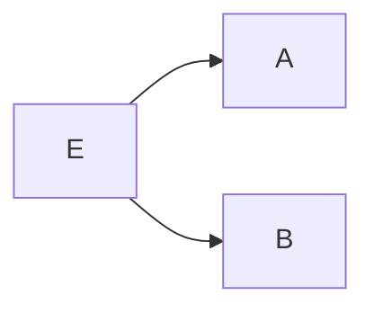
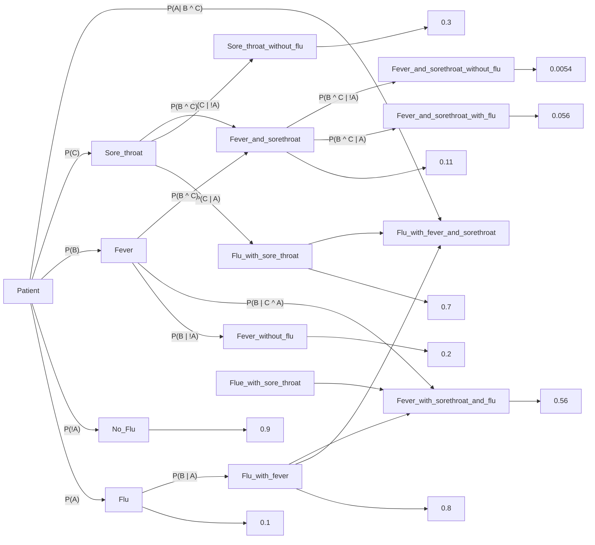

---
{"dg-publish":true,"permalink":"/artificial-intelligence/module-4-predicate-logic-and-probabilistic-reasoning/","title":"Predicate logic and Probabilistic reasoning -- Artificial Intelligence","tags":["Semester-5","Semester-4"],"created":"2025-03-06T18:33:20.089+05:30"}
---


---
# Index


1. [[#Representing Simple Facts in Logic]]
2. [[#Discrete mathematics recap from semester 4.]] (Pre-requisite to predicate logic)
3. [[#For the first 4 logical operators Quick rundown of basics]]
4. [[#Implication.]]
5. [[#Biconditional Operator.]]
6. [[#Precedence of Logical Operators.]] 
7. [[#Important logical formulae]] (Pre-requisite to predicate logic)
8. [[#Logical Inference Basic Terminology (Semester 4).]] (Pre-requisite to Resolutions and Natural deduction)
9. [[#Rules of inference.]] (Pre-requisite to Resolutions and Natural deduction)
10. [[#Predicate Logic (Semester 4).]] (And in AI too)
11. [[#Predicates]]
12. [[#Quantifiers.]]
13. [[#How to write predicate logic]] (Pre-requisite to instances and is-a relationships)
14. [[#Representing instance and ISA (is-a) relationships]]
15. [[#1. What are instances and ISA (is-a) relationships?]]
16. [[#3. Using Predicate Logic to Represent Instances and IS-A Relationships]]
17. [[#Computable functions and predicates]]
18. [[#1. What are computable functions?]]
19. [[#Resolution and Natural deduction]]
20. [[#1. Resolution]]
21. [[#2. Natural Deduction]]
22. [[#The Gray Area in Natural Deduction]]
23. [[#Resolution vs. Natural Deduction in AI Systems]]
24. [[#Probabilistic reasoning in Artificial Intelligence]]
25. [[#Bayes Theorem and Total Probability]]
26. [[#Representing knowledge in an uncertain domain.]]
27. [[#Bayesian Networks]]
28. [[#Dempster-Shafer Theory]]
29. [[#Fuzzy logic and fuzzy sets]]

---
# Representing Simple Facts in Logic

In knowledge representation, **predicate logic** (or first-order logic) is commonly used to represent simple facts. Predicate logic allows us to define relations and properties of objects in a more expressive way than propositional logic, making it suitable for representing knowledge in AI.

#### Key Components in Predicate Logic:

1. **Constants**: Represent specific objects or entities. Example: `john`, `apple`, `room1`.
2. **Predicates**: Describe properties of objects or relationships between objects. Example: `Loves(john, mary)` represents "John loves Mary."
3. **Variables**: Stand for general elements in the domain, often used in conjunction with quantifiers. Example: `x`, `y`.
4. **Quantifiers**:
    - **Universal quantifier** (`∀`): Indicates that a statement applies to all elements in a domain. Example: `∀x Loves(john, x)` means "John loves everyone."
    - **Existential quantifier** (`∃`): Indicates the existence of at least one element in the domain that satisfies a property. Example: `∃x Loves(x, mary)` means "Someone loves Mary."

#### Example of Representing Simple Facts:

Let's represent some facts in predicate logic:

- "John is a human" → `Human(john)`
- "Mary loves John" → `Loves(mary, john)`
- "All humans are mortal" → `∀x (Human(x) → Mortal(x))`

#### How This Helps in AI:

Representing facts in logic allows AI systems to:

- Infer new knowledge (e.g., if `John` is a `Human`, and all humans are mortal, we can infer `Mortal(john)`).
- Perform reasoning based on given facts and rules.
- Enable systems to answer questions and make decisions based on logical deductions.


For a more in-depth explanation, I added relevant notes from discrete maths from last semester.

---
# Discrete mathematics recap from semester 4.


These notes were originally quite wacky in presentation so I fixed up a lot of stuff this time around.

## What is Propositional Logic?


Area of logic that studies ways of ==joining and/or modifying propositions== to form complicated propositions.


Example: "Adam is good at playing football ==and== is representing his college at national level."

This statement could be broken into two propositions P1 and P2:

P1: Adam is good at playing football
P2:   is representing his college at national level

Here P1 and P2 are ==propositional variables==


Here the =="logical connective" (logical operator)== used to form a complicated and meaningful proposition is the ==AND== operator.

Now you can either choose to read about this in detail or follow the link below for a brief but good enough explanation:

https://www.youtube.com/watch?v=6490tKrGEic&list=PLxCzCOWd7aiHGhOHV-nwb0HR5US5GFKFI&index=22

---

# Logical Operators

## Types of Logical Operators :

`Some of these are from ADE.`

1. Negation (NOT)
2. Conjunction (AND)
3.  Disjunction (OR)
4.  Exclusive OR (EX-OR / XOR)
5.  ==Implication== ( $p \rightarrow q$ )
6. ==Biconditional== ( $p \leftrightarrow q$ )

---
## For the first 4 logical operators: Quick rundown of basics: 


1. Negation :

	 Let there be a propositional variable p.
   
    Denoted by : 

   Truth Table :
	  
	  

2.  Conjunction : 
     
     Let there be two propositional variables p and q
     
     Conjunction of p and q will be denoted by: 
     
     
  (`p^q`)


	 Truth Table :


	
   3. Disjunction :
      
	  `Disjunction of p and q will be denoted by:`
		
		
		 
	
	  `Truth table:`


	     
	     
4. Exclusive-OR:
	   
	`Denoted by: ` 


	
	
	`Truth Table:` 
	


---
# Implication.

 **"if p then q"**

Denoted by : $p \rightarrow q$

Truth table :

| p   | q   | $p \rightarrow q$ |
| --- | --- | ----------------- |
| T   | T   | T                 |
| T   | F   | F                 |
| F   | T   | T                 |
| F   | F   | T                 |

---
### Note:

 **if the value of first variable (p) is F (false) then no matter what the value of q is,     p --> q will always be T (True)**.


"Easy understandable pseudocode explanation from my end":


```python
if p and q == True then:
	p --> q == True
		
else if p == True and q == False:
	p --> q == False
		
else if p == False:
	ignore q.
	p --> q == True.
```


---
## Some examples for implication:


---
# Biconditional Operator.


Let `p` and `q` be two propositional variables. 
The biconditional statement of the form :  $p \leftrightarrow q$ is the proposition ==p "if and only if" q==

$p \leftrightarrow q$ is true whenever the truth values of p and q are the same.


---
## Representations of Biconditional Operator.


---
# Precedence of Logical Operators.


The precedence helps us to decide ==which operator will get evaluated first== in a complicated looking ==compound proposition.==

Highest precedence starts from 1 to the lowest being 5.


---
# Important logical formulae 

**Important Logical Equivalences**, you will need these to convert english sentences into predicate logic

Here are some essential logical equivalences that you might find useful:


---
# Logical Inference : Basic Terminology (Semester 4).

## Inference involves two parts :

1. Premise
2. Conclusion

 **Premise** is a ==proposition on which one would be able to draw a conclusion.==

Therefore initially we assume something is true and on the basis of that we draw some conclusions.

**Conclusion** is a ==proposition that is reached from the given set of premises.==

Basically : 

 `if premise then conclusion`

let `p` = premise, `c` = conclusion

Then $p \rightarrow c$.

---

# Rules of inference.

 Rules of inference are the templates for constructing valid arguments.

## Types of inference rules :


1. Modus Ponens.

   

	Here it says that for two propositional variables `p` and `q` :
	
	if `p --> q` is True ==AND== `p` is True then the Conclusion will be `q` (True)
	


2. Modus Tollens.
   
   


	Here `~` (squiggly symbol) is the same as the negation operator $\neg$.
	
	 It states that for two propositional variables `p` and `q` :
	
	
	 if $p \rightarrow q$ is True ==AND== NOT(`q`) is True then the Conclusion will be  NOT(`p`) (True).


 3. Hypothetical Syllogism

    

	This states that,  for three propositional variables `p` ,  `q` and `r` :
	
	 if $p \rightarrow q$  and  $q \rightarrow r$ then  the Conclusion will be $p \rightarrow r$  (Transitive property)


  4. Disjunctive Syllogism
     


It states that for two propositional variables `p` and `q` :

if ` p or q ` is True ==AND== NOT(`p`) is True then the Conclusion will be `q`

  5.  Addition
     


It states that for two propositional variables `p` and `q` :
if `p` is True then the Conclusion will be `p or q`.


  6.  Simplification
     
It states that for two propositional variables `p` and `q` :
 
If `p` AND `q` is True then the conclusion will be `p`.

7. Conjunction 
   
   

Simply `p` ==AND== `q`. 

8. ==Resolution==  
   
   Later referenced in [[#Resolution and Natural deduction]]
   

This states that,  for three propositional variables `p` ,  `q` and `r` :

if `p OR q` is True ==AND== ``NOT(q) OR r``  is True then the Conclusion will be `q or r`.

---
#  Predicate Logic (Semester 4).

https://www.youtube.com/watch?v=FpGeg27Ffk8&list=PLxCzCOWd7aiHGhOHV-nwb0HR5US5GFKFI&index=42 (A better explanation than the neso academy playlist).

 Used to verify whether an argument is correct or incorrect.

 To understand Predicate Logic, we need to understand :

 1. Predicates
 2. Quantifiers

---

# Predicates 

 Predicates are statements involving variables ==which are neither True nor False==, until or unless the values of the variables are specified.

 ==They are NOT propositions==. (Propositions have a fixed value, either True or False.)


---

# Quantifiers.

 Quantifiers are words that refer to quantities such as =="some"== or =="all"==. It tells for how many elements a given predicate is True.

 In English, Quantifiers are used to express the quantities without giving an exact number.

 E.g: all, same, many, move, few, etc.

 Sentences like: "Can I have some water?" or "Jack has many friends."

## Types of Quantifiers:

1. Universal Quantifiers.
2. Existential Quantifiers.


Here "domain" is merely the input of the function Q.

---

# Universal Quantifiers

Definition : The Universal Quantification of some function P(x) is the statement 
"P(x)"  ==for all  values of x in the  domain==

or in simple terms :

**Universal quantifier says that "for all values, let's say x in the domain of something, applies to this proposition, or the proposition is true for all those values in that domain"**.


---
## Domain or Domain of Discourse

A domain specifies the possible set of values of the variable under consideration.

For example : Let P(x) is the the statement " x+1 > x"

Let us assume that the domain is the set of all positive integers.

Therefore, 

P(1): 1+1 > 1 (True)
P(2): 2+2 > 2 (True).

Thus,


---

# Existential Quantifiers

Definition : The existential quantification of a function P(x) is the proposition "==There exists== an element in the ==domain== such that P(x)........"

or in simple terms, "**There exists an element x in the domain such that a proposition P(x) holds true for that element**".


---
# How to write predicate logic

https://www.youtube.com/watch?v=Aw3EOSr64j0&list=PLxCzCOWd7aiHGhOHV-nwb0HR5US5GFKFI&index=43

To convert an english statement to a predicate logic is very much needed, as it helps conveying and structuring information properly for an AI system to understand, and make decisions based on that information.


So let's say we have a statement given : 

**"Not all that glitters is gold"**.

So analyzing the statement, we get to know that this statement follows the universal quantifier (**presence of the word "all"**).

Let's say we focus only on the part of "**all that glitters is gold**", for now.

So we could assume two functions, $Glitter(x)$  and $Gold(x)$ .

And thus, we have two viable solutions :

$$\forall(x) Glitter(x) \rightarrow Gold(x)$$

and $$\forall(x)Glitter(x) \wedge Gold(x)$$
Both are viable in this context, but which is the better answer?

Let's draw up the operator's truth tables to judge that.

Let's assume that the $Glitter(x)$ function is denoted by `p`.
and the $Gold(x)$ function is denoted by `q`.

a) For the **implication** operator:

| p   | q   | p -> q |
| --- | --- | ------ |
| T   | T   | T      |
| T   | F   | F      |
| F   | T   | T      |
| F   | F   | T      |

So if we were to consider the following reasonings :

1. All that glitters is gold, that's definitely satisfied.
2. All that is not glittering, is not gold, valid.
3. All that is not glittering, could be gold, valid. (For example, the metal, rose gold, it doesn't glitter, but it is still an alloy of gold.)
4. All that glitters, is not gold, valid. (For example any other metal/object/material that could glitters too, but that doesn't mean that it's gold).

So here we see that **implication satisfies all cases**.

b) Now in case of the **conjunction** operator:

| p   | q   | $p \wedge q$ |
| --- | --- | ------------ |
| T   | T   | T            |
| T   | F   | F            |
| F   | T   | F            |
| F   | F   | F            |

So if we were to consider the following reasonings :

1. All that glitters is gold, that's definitely satisfied.
2. All that is not glittering, is not gold, valid.
3. All that is not glittering, could be gold, invalid.
4. All that glitters, is not gold, invalid.

So conjunction says that in order to be gold, it has to glitter or else it's not gold. So **conjunction doesn't cover all the possible cases**.

It is thus, more suited to a specific example, and thus the existential quantifier.

However since we are dealing with the universal quantifier, which considers all cases, implication is the better answer in this case.

So now coming back to the original statement.

"Not all that glitters is gold", for the **not**, we will add a negation operator in the front.

So we currently get the predicate logic as :

$$\neg \forall(x)[Glitters(x) \rightarrow Gold(x)]$$
Now if we simplify this equation a bit

**The negation of a universal quantifier leads to an existential quantifier**.

So now the predicate logic becomes : $$\exists(x)\neg[Glitters(x) \rightarrow Gold(x)]$$
Now we simplify the implication first using $P -> Q = \neg P \vee Q$

$$\therefore \exists(x)\neg[\neg Glitters(x) \vee Gold(x)]$$

Now from De-Morgan's law $\neg(P \vee Q) = \neg P \wedge \neg Q$

Thus, we get our final predicate logic as :

$$\therefore \boxed{\exists(x)[Glitters(x) \wedge \neg Gold(x)]}$$

which is read as : "**There exists an `x` such that `x` glitters and `x` is not gold.**"

**This way the statement "Not all that glitters is gold, or all that glitters is not gold", can be conveyed properly to an AI for it's understanding.**


Here is a video link on the topic of "negation of quantifiers" for the curious cat: 

https://www.youtube.com/watch?v=XYfTz5gziBk&list=PLxCzCOWd7aiHGhOHV-nwb0HR5US5GFKFI&index=44

---
## For more practice on quantifiers:

(Neso academy videos)

 **Universal Quantifiers** : https://www.youtube.com/watch?v=6Ebxy33e-Wk&list=PLBlnK6fEyqRhqJPDXcvYlLfXPh37L89g3&index=36&pp=iAQB

 **Existential Quantifiers**: https://www.youtube.com/watch?v=YsWn609V6As&list=PLBlnK6fEyqRhqJPDXcvYlLfXPh37L89g3&index=39&pp=iAQB

 **Expressing Quantifications in English** : https://www.youtube.com/watch?v=JY03HH0p14U&list=PLBlnK6fEyqRhqJPDXcvYlLfXPh37L89g3&index=37&pp=iAQB

---
# Representing instance and ISA (is-a) relationships

## 1. What are instances and ISA (is-a) relationships?

- **Instance**: In knowledge representation,==an _instance_ is a specific member of a class or category==. For example, if "Dog" is a category or class, then "Buddy" (a specific dog) is an instance of that class. In terms of predicate logic, we use predicates to describe instances and their properties.

- **IS-A Relationship**: ==The _IS-A_ relationship, also called an _inheritance relationship_, defines a hierarchical connection between two classes or categories. It represents that one class (a _subclass_) is a specialized version of another class (a _superclass_)==. For instance, "Dog IS-A Animal" means that "Dog" is a subclass of the "Animal" class. In predicate logic, the IS-A relationship can be represented by statements that connect categories to broader categories.

---
## 2. Examples in AI systems

- **Knowledge Graphs**: AI systems often use knowledge graphs to organize data in a way that represents real-world relationships. For example:

    - _Instance_: The knowledge graph might have an entity like "Paris" that is an instance of the "City" class.
    - _IS-A Relationship_: The knowledge graph can also define that "City" IS-A "`Location`," and "`Location`" IS-A "`PhysicalEntity`." This hierarchy helps the AI understand Paris's nature in a broader context.

- **Expert Systems**: In expert systems (e.g., medical diagnosis systems), instances and IS-A relationships allow the system to apply general rules to specific cases. For example, if "`BacterialInfection` IS-A Infection," the system can infer that any rules or treatments for "Infection" also apply to "`BacterialInfection`."

- **Natural Language Processing (NLP)**: ==In NLP, instances and IS-A relationships help AI systems understand language structure and meaning==. For example, recognizing that "Sparrow IS-A Bird" allows the AI to infer that "Sparrow can fly" if it knows that "Birds can fly."
---
## 3. Using Predicate Logic to Represent Instances and IS-A Relationships

#### Instances

To represent an instance in predicate logic, we typically use a predicate that links an entity to its category. For example:

- Suppose we have an entity named "Buddy" who is a specific dog. We can represent this as: $$Dog(Buddy)$$ This means **"Buddy is an instance of the Dog category."**

#### IS-A Relationships

To represent IS-A relationships, we use implications in predicate logic. For example, if we want to represent that "Dog IS-A Animal," we would write:

$$\forall(x)(Dog(x) \rightarrow Animal(x)$$

This statement means, "For all $x$, if $x$ is a dog, then $x$ is also an animal."

#### Example Scenario

Consider the following hierarchy and example:

1. **Animal** (superclass)
    - **Mammal** (subclass of Animal)
        - **Dog** (subclass of Mammal)
            - Instance: "Buddy" (instance of Dog)

To represent this in predicate logic, we might write:

1. $\forall(x)Dog(x) \rightarrow Mammal(x)$
2. $\forall(x)Mammal(x) \rightarrow Animal(x)$
3. $Dog(Buddy)$

Using these statements, we can derive that:

- Since $Dog(Buddy)$ is true, , $Mammal(Buddy)$ is true.
- Since $Mammal(Buddy)$ is true,, $Animal(Buddy)$ is true.

Through these logical statements, we establish the hierarchical relationships that allow the AI to understand that **Buddy** inherits the properties of **Dog**, **Mammal**, and **Animal**.

---
## 4. Importance of Instances and IS-A Relationships in AI Systems

The use of instances and IS-A relationships provides several advantages for AI systems:

- **Efficient Inference**: By representing knowledge hierarchically, AI systems can make inferences more efficiently. For example, if a system knows that "Dog IS-A Animal" and "All animals need oxygen," it can infer that dogs need oxygen without requiring direct knowledge about dogs.

- **Reusability of Rules**: IS-A relationships allow rules and properties to be applied across different levels of hierarchy. If "All mammals have a spine" is known, then we don’t need to state that specifically for dogs, cats, or other mammals.

- **Consistency and Structure**: IS-A hierarchies help maintain a consistent structure of knowledge. Each subclass inherits the properties and rules of its superclasses, making it easier for AI to reason about entities without redundancies or contradictions.

- **Simplified Learning**: For machine learning models, especially in fields like natural language understanding, defining IS-A relationships allows the system to generalize. For example, if a system learns that "Birds can fly," it can generalize this to all instances of birds unless specified otherwise (e.g., penguins).
---
## 5. Challenges and Limitations

- **Over-Simplification**: Sometimes, real-world relationships do not fit neatly into an IS-A hierarchy. For example, "Ostrich IS-A Bird" but does not inherit the ability to fly.

- **Complex Relationships**: Real-world entities can have multiple types of relationships that go beyond simple IS-A hierarchies, such as "Part-Of" or "Has-A." These relationships require additional representations.

- **Dynamic Changes**: Knowledge representation systems must handle dynamic updates, as real-world information can evolve. For instance, if "Brontosaurus IS-A Dinosaur" but later evidence refutes it, the system must update its hierarchy.
---
# Computable functions and predicates 

## 1. What are computable functions?

==A **computable function** is a function that can be calculated using a finite series of steps. More formally, it’s a function where, given an input, an algorithm exists that can determine the function's output in a finite amount of time==.

In AI, computable functions are useful for creating rule-based systems where inputs are processed to produce specific outputs, such as in expert systems, planning, and decision-making.
#### Example of a Computable Function

Consider a simple computable function that calculates the square of an integer:
$$f(x) = x^2$$
Given an input $x$, the function will output $x^2$, and there exists a finite procedure (multiplying $x$ by itself) to calculate the output.

---
## 2. Predicates in computable functions

Predicates are functions that return **true** or **false** based on a specific property or condition. In predicate logic, predicates help define relationships or properties that an element may have. In the context of computable functions, predicates can be used to define properties or constraints on inputs and outputs.

For instance:

- Let $Even(x)$ be a predicate that returns a **true** value if $x$ is even and **false** value otherwise.
- Let $GreaterThan(x,y)$ be a predicate that returns **true** if $x$ is greater than $y$ and **false** if otherwise.

---
## 3. Using Computable functions and predicates together

==In AI systems, computable functions and predicates are often combined to make complex decisions==. For example, we might use predicates to check certain conditions and computable functions to compute values based on those conditions.

#### Example Scenario

Suppose we have an AI system designed to approve loan applications based on specific criteria. We can represent the criteria using predicates and functions as follows:

1. **Predicates**:
   - $Income(x)$ returns **true** if applicant $x$'s income meets a certain threshold.
   - $CreditScore(x)$ returns **true** if applicant $x$'s credit score is above a certain threshold.

2. **Computable Functions**:
   - $LoanAmount(x)$: computes the maximum loan amount applicant $x$ qualifies for based on their income and credit score.

In this scenario, the system might decide:

If 
$$Income(x) \wedge CreditScore(x)$$, then approve $$LoanAmount(x)$$
Here, the predicates determine eligibility, and the computable function calculates the exact loan amount.

---
## 4. Representation in Predicate Logic

==We can formalize the use of computable functions and predicates within predicate logic by combining logical operators and quantifiers==.

For instance:
- **Eligibility for a loan**: Let's say we define a predicate $Eligible(x)$ that represents whether an applicant xxx is eligible for a loan. We could express eligibility as:
  $$Eligible(x) \leftrightarrow Income(x) \wedge CreditScore(x)$$
- **Loan Amount Calculation**: We might represent this with a function $LoanAmount(x) = f(x)$, where $f(x)$, calculates the amount based on applicant $x$'s attributes


Now, **looking at this statement one might think that implication is a valid choice here**, since the whole thing is an **if-then statement**.

But, as fitting as it sounds, no **implication is not a valid choice here**.

---
### Conjunction vs. Implication in the Eligibility Example

In the eligibility example:

$$Eligible(x) \leftrightarrow Income(x) \wedge CreditScore(x)$$

we're defining eligibility as something that **only holds true if both conditions** (income and credit score) are satisfied. Here, the conjunction $\wedge$ is used to indicate that both predicates (income and credit score) must be true for eligibility.

---
### Why Implication Wouldn't Be Ideal Here

If we were to use implication, it would look something like:

$$Income(x) \wedge CreditScore(x) \rightarrow Eligible(x)$$

This implies that **whenever both income and credit score conditions hold, eligibility holds as a consequence**. This might sound correct, but **implication is looser in logic because it does not require both conditions to be necessary** for eligibility. In fact, under implication:

- **If either condition is false**, the implication would still hold **true** by the rules of logical implication. This is not desirable here, as it would mean that **eligibility could still be true without both conditions** being met.
---
### Conjunction Enforces Necessity

By using:  $$Eligible(x) \leftrightarrow Income(x) \wedge CreditScore(x)$$

we’re setting up a **necessary and sufficient condition**: **an applicant is eligible if and only if they meet both conditions**. This is exactly what we want in a rule-based AI system for eligibility criteria.

---
### Universal Quantifier Consideration

If we were to generalize this eligibility criterion for **all applicants**, we could write it as: 

$$\forall(x)[Eligible(x) \leftrightarrow Income(x) \wedge CreditScore(x)]$$

This would mean that **all applicants** must meet both conditions to be eligible, which is valid for establishing universal rules.

Now let's get back to the main topic.

---
## 5. Importance in AI Systems

Computable functions and predicates are particularly important in AI for:

- **Decision-Making**: By combining predicates (for conditions) and computable functions (for calculations), AI systems can make informed decisions in areas like medical diagnosis, financial services, and automated recommendations.

- **Data Filtering and Selection**: Predicates are useful for filtering data based on specific properties. For example, a recommendation system might use predicates to select only the relevant products for a customer based on their preferences.

- **Constraints and Conditions**: In constraint-based AI systems, predicates define the conditions that solutions must satisfy. For instance, in scheduling problems, predicates can specify constraints like "no two meetings can overlap."
---
## 6. Computable Functions, Predicates, and Their Relation to Algorithms

Computable functions often map directly to algorithms that solve specific tasks, such as sorting, searching, or evaluating expressions. By defining functions and predicates, AI systems can break down complex tasks into smaller, computable parts that each solve a piece of the overall problem.

For example, suppose an AI needs to check if a path exists between two nodes in a graph:

1. We define a predicate $PathExists(x,y)$ to check if there’s a path between nodes $x$ and $y$.
2. We implement a computable function $FindPath(x,y)$ that returns the path between $x$ and $y$ if it exists.
---
## 7. Limitations and Challenges

While computable functions and predicates are powerful, they also have limitations:

- **Non-computable Problems**: Some functions and problems are inherently non-computable, meaning they cannot be solved in a finite amount of time (e.g., the Halting Problem).

- **Complexity**: As functions and predicates become more complex, the time required to evaluate them increases, which can impact performance.

- **Representational Limits**: Predicate logic may not be expressive enough for all types of knowledge, especially when representing uncertain or probabilistic information.

---
# Resolution and Natural deduction

## 1. Resolution

**Resolution** is a powerful **inference rule** used primarily in propositional logic and first-order predicate logic. It’s widely used in AI systems for automated reasoning, particularly in **logic programming** and **automated theorem proving**.

From the [[#Rules of inference.]] , in the last rule, Resolution we see that :


This states that,  for three propositional variables `p` ,  `q` and `r` :

if `p OR q` is True ==AND== ``NOT(q) OR r``  is True then the Conclusion will be `q or r`.

---
### What is Resolution?

In simple terms, **resolution** ==is a method to deduce a contradiction by combining pairs of statements until only one literal (a variable or its negation) remains==. If we derive a contradiction (e.g., both a statement and its negation), it indicates that the original assumption is **unsatisfiable**.

---
### How Resolution Works

Resolution operates on statements in **clausal form** (conjunctions of disjunctions). Each clause is treated as a disjunction of literals. Here’s the key principle:

- If we have two clauses, one containing a literal $P$ and the other containing $\neg P$, we can “resolve” them by combining the remaining literals from both clauses into a single clause.
---
### Example of Resolution

Let’s say we have these two statements:

1. $P \vee Q$ 
2. $\neg P \vee R$

The **resolution rule** allows us to combine these to get: $$Q \vee R$$

Here’s what happened:

- From $P \vee Q$ and $\neg P \vee R$, we see that $P$ and $\neg P$ “cancel” each other.
- The remaining literals $Q$ and $R$ form a new clause $Q \vee R$.

---
### Using Resolution for Proofs

To prove that a statement is true using resolution:

1. **Assume the negation** of the statement we want to prove.
2. Apply the resolution rule repeatedly on the set of clauses.
3. If we derive an **empty clause** (i.e., a contradiction), then our assumption was wrong, meaning the original statement must be true.

This method is commonly known as **proof by contradiction** or **refutation**.

---
## 2. Natural Deduction

**Natural Deduction** is another technique for reasoning in predicate logic. **Unlike resolution, which focuses on finding contradictions, natural deduction provides direct rules for deriving conclusions step-by-step**.

#### What is Natural Deduction?

Natural deduction is based on **intuitive rules** that reflect how we naturally derive conclusions from assumptions. Each rule corresponds to a logical operation, such as conjunction, disjunction, implication, and negation. Using these rules, we can derive a conclusion from premises without aiming for a contradiction.

These are the same as [[#Rules of inference.]] (click this link to go back there) and a few more

- **Universal Introduction and Elimination**:  
    For universal quantifiers ($\forall$), you can generalize from an arbitrary instance, or apply the universal rule to any specific instance.
    
- **Existential Introduction and Elimination**:  
    For existential quantifiers ($\exists$), you can introduce an existential claim from a specific instance, or apply an existential rule to deduce something about a particular case.

Let's understand this with an example.

#### Example of Natural Deduction

Suppose we want to prove:  
If **“All humans are mortal”** and **“Socrates is a human,”** then **“Socrates is mortal.”**

We could start with the first premise.

For the statement, "All humans are mortal", we could first define predicates :

$Human(x)$ and $Mortal(x)$

Thus we can derive a predicate logic as:

$$\forall(x)(Human(x) \rightarrow Mortal(x))$$
And for the second premise, we could define it as an instance relationship where $$Human(Socrates)$$

So from the first premise we get to see if $$\forall(x)(Human(x) \rightarrow Mortal(x))$$ is true, then 

for $$Human(Socrates)$$, 

$$Mortal(Socrates)$$

So **Socrates** is an instance of **Mortal**

So the system will naturally deduce that **Socrates** is a mortal (or was, as we know).

---
### However, there is a gray area in this deduction

We had the predicate logic as :

$$\forall(x)(Human(x) \rightarrow Mortal(x))$$

This means that for any individual $x$, if $x$ is a human, then $x$ is mortal.

---
### Implication Truth Table

The truth table for implication $p \rightarrow q$ (where $p$ is "$Human(x)$" and $q$ is "$Mortal(x)$" is:

| p   | q   | $p \rightarrow q$ |
| --- | --- | ----------------- |
| T   | T   | T                 |
| T   | F   | F                 |
| F   | T   | T                 |
| F   | F   | T                 |

---

### The Gray Area in Natural Deduction

What I thought was this 

If we apply the truth table of implication here, 
We see the cases 
Human is mortal = True 
Human is not mortal = False 
==Not human is mortal = True? ==
Not human is not mortal = True 

The third line, which in the truth table of implication is `F , T -> T` 

How can something be not human and be not immortal? Hit a bit of a gray area don't you think? 

Since we share this planet with a lot of non-humans and we know for a fact they are mortals, some maybe long lived than us, but still mortals.

Generally we could extend this to animals, and other life-forms, but still I feel that there's too much ambiguity. 

A conjunction could possibly fix this instead? As it limits the condition to only humans being mortals and keeps out ambiguity?

---
## The reasoning

This is where the ambiguity comes in. **The implication does not state that only humans are mortal, just that if someone is human, they are mortal. Non-humans could also be mortal, and the implication would still hold true**.

### Using Conjunction

To restrict the statement strictly to humans, a conjunction might indeed provide more clarity if you're aiming to express a more limited relationship. For instance:

$$\forall(x)(Human(x) \rightarrow Mortal(x))\wedge \forall(x)(NotHuman(x) \rightarrow NotMortal(x))$$

**This would state that not only are all humans mortal, but it also imposes a condition on non-humans, stating they are not mortal**.

Which kinda doesn't make sense again since **non-humans**, literally our nearest relatives, apes, monkeys, chimps, are all mortals, but again aliens could be mortal/immortal. Heck even God who technically non-human is immortal (let's just think hypothetically here).

So a lot of ambiguity huh? That's the downside of Natural Deduction you could say. This type of ambiguity arises when the context is not sufficient.

---
## Resolution vs. Natural Deduction in AI Systems

### Natural Deduction

- **Flexibility in Reasoning**: Natural deduction is particularly well-suited for exploring theoretical scenarios, thought experiments, and general reasoning. It allows for the derivation of conclusions from a set of premises using rules of inference, which makes it excellent for engaging in speculative or abstract reasoning.
- **Intuitive Structure**: The structure of natural deduction mirrors how humans often think—starting from assumptions and building conclusions step-by-step. This makes it suitable for AI systems designed to model human-like reasoning, especially when exploring new ideas or hypotheses.
- **Handling Ambiguities**: Natural deduction can accommodate ambiguity and nuances in language and meaning, which is useful when the context is not strictly defined or when theorizing about hypothetical situations.

### Resolution

- **Grounded Logic and Proofs**: Resolution, on the other hand, is more systematic and better suited for handling grounded logic and well-defined proofs. It works particularly well with propositional logic and first-order logic, where the premises and conclusions are clearly defined.
- **Mechanistic Approach**: The resolution method involves transforming statements into a specific form (typically conjunctive normal form) and then applying a refutation-based approach. This is effective for automated theorem proving and ensuring that the conclusions follow logically from the premises.
- **Precision in Established Knowledge**: Since resolution relies on a clear set of rules and transformations, it is ideal for domains where established knowledge and proven facts are crucial, such as mathematics or formal verification in computer science.

Both techniques are valuable tools in **knowledge representation and reasoning** for AI, enabling systems to **infer knowledge**, **prove statements**, and **make decisions** based on logical rules.

So ==one could say that natural deduction is better when let's say letting an AI think or theorize or indulge in thought experiments, where as Resolution is better when handling grounded logic, stuff that is already proven==.

---
# Probabilistic reasoning in Artificial Intelligence

## Bayes Theorem and Total Probability

https://www.youtube.com/watch?v=SktJqrYereQ&list=PLxCzCOWd7aiHGhOHV-nwb0HR5US5GFKFI&index=45

**Bayes' theorem** provides a way to update the probability of a hypothesis based on new evidence. It essentially answers the question: _If we know the likelihood of certain evidence given a hypothesis, and we know the probability of the hypothesis itself, how does observing the evidence change our confidence in the hypothesis?_

The formula is as follows:

$$\boxed{P(A|B) = \frac{P(B|A).P(A)}{P(B)}}$$
Here:

- $P(A|B)$ **Posterior Probability** — the probability of the hypothesis $A$ being true given that we have observed evidence $B$.
- $P(B∣A)$: **Likelihood** — the probability of observing evidence $B$ if the hypothesis $A$ is true.
- $P(A)$: **Prior Probability** — the initial probability of the hypothesis $A$, before seeing any evidence.
- $P(B)$: **Marginal Probability of B** — the overall probability of observing evidence $B$ under all possible scenarios.

The idea behind Bayes' theorem is to update our belief in a hypothesis as new data (or evidence) becomes available. This helps refine predictions and decisions in situations where we are working with incomplete information.

---
## A better understanding of the terminologies.

**Let's understand this in a more simple language**.

So we can visualize the situation using a graph:




Let's say we have two events, A and B. Both have an equal chance of happening

1. **$P(A∣B)$**: This represents the **probability of event A happening given that event B has already happened**.
    - **“Given that B is true”** ==means we’re considering only situations where B has already occurred and are looking at how likely A is to happen under that condition==.
    - For example, if A represents having a disease and B represents testing positive for the disease, then $P(A∣B)$ is the probability of having the disease _given_ that you've tested positive.

2. **$P(B∣A)$**: Similarly, this is the **probability of event B happening given that event A has already happened**.
    
    - **“Given that A is true”** ==means we’re considering only scenarios where A has occurred and are interested in the likelihood of B under that condition==.
    - In the example above, $P(B∣A)$ would be the probability of testing positive if you actually have the disease.

3. **$P(A)$ and $P(B)$**: These are just the independent probabilities of each event happening without any conditions.
    
    - Since we assumed both events have an equal chance of occurring, $P(A)=0.5$ and $P(B)=0.5$, but this is just an assumption for simplicity. In real scenarios, these probabilities are often quite different, and might not always have a 50-50 chance of occurrence.

To sum up, $P(A∣B)$ focuses on how likely $A$ is to happen in cases where $B$ is known to have happened, while $P(B∣A)$ flips the condition and asks how likely $B$ is if $A$ has already occurred.

---
### Example: Medical Diagnosis -- Total Probability and Bayes theorem

Suppose we want to diagnose a rare disease based on a test result. Let:

- $A$ represent "having the disease."
- $B$ represent "a positive test result."

Now, let’s assign some example probabilities:

1. **Prior Probability, $P(A)$**: Suppose the disease affects 1 in 1,000 people, so $P(A)=0.001$.
2. **Likelihood, $P(B∣A)$: If a person has the disease, the test correctly gives a positive result 99% of the time, so $P(B∣A)=0.99$.
3. **Marginal Probability, $P(B)$**: The probability of a positive test result in the entire population, factoring in both people with and without the disease.


To calculate $P(B)$, we use the **law of total probability**: $$\boxed{P(B) = P(B|A).P(A) + P(B|\neg A) . P(\neg A)}$$
where:
- $P(B|\neg A)$ : the probability of a positive test if the person doesn’t have the disease (false positive rate), which will be equal to $1 - P(B|A) = 1 - 0.99 = 0.01$
- $P(\neg A)$: the probability of not having the disease, which will be equal to $1 - P(A) = 1 - 0.001 = 0.999$ 

These are also known as **complementary probability**.

However in this case, if we assume a false positive rate ($P(B | \neg A$) = $5 \%$ , or $0.05$, we get :

$$\boxed{P(B) = (0.99 . 0.001) + (0.05).(0.999) = 0.00099 + 0.04995 = 0.05094}$$
**Interpretation**: Despite a positive test result, the probability of actually having the disease is about 1.94%. This is much lower than one might expect, highlighting how even reliable tests can have surprising implications when dealing with rare events.

---
## Representing knowledge in an uncertain domain.

In AI, ==uncertain domains often come into play when a system must make predictions or decisions based on incomplete, ambiguous, or noisy data==. For instance, a medical diagnostic system that interprets symptoms for a diagnosis faces uncertainty since symptoms might not always point to a single disease. This requires the AI system to manage probabilities rather than certainties.

Here’s how we generally go about representing this knowledge:

1. **Probabilistic Statements**:
    
    - We use probabilities to represent the likelihood of events or conditions. Each event or condition, like "the patient has disease X," is assigned a probability value.
2. **Prior Knowledge**:
    
    - We start by incorporating prior probabilities (often from historical data or general information). For example, in a diagnostic tool, the likelihood of certain diseases given the patient’s demographics or other general symptoms might serve as prior knowledge.
3. **Conditional Probability**:
    
    - As we encounter new information, such as a specific symptom (or test result), we update the probabilities to reflect this new data. Conditional probabilities like $P(disease∣symptom)$ become central because they adjust the initial (prior) probability in light of observed evidence.
4. **Bayesian Inference**:
    
    - Bayesian inference is applied to continuously update probabilities as more data or evidence becomes available, using Bayes’ theorem. This makes probabilistic reasoning dynamic and adaptable to changing inputs.
5. **Decision Theory**:
    
    - Finally, to enable the system to make choices in uncertain situations, decision theory often supplements probabilistic reasoning. Here, we analyze different outcomes by combining probability with utility (or reward) to identify the most favorable decision.

By leveraging probabilities, AI systems can reason in uncertain domains, considering not only the likelihood of certain outcomes but also how new evidence impacts these probabilities.

---
### Example

Let's understand this better with an example.

This example also serves an example on [[#Bayesian Networks]].

**Example Scenario: Diagnosing a Disease Based on Symptoms**

Imagine we’re building a simple diagnostic system that assesses the likelihood of a patient having the flu based on certain symptoms—say, a fever and a sore throat.

Here’s how we’d represent this information probabilistically:

### Step 1: Define Events

- Let **A** represent the event "Patient has the flu."
- Let **B** represent the event "Patient has a fever."
- Let **C** represent the event "Patient has a sore throat."

---
### Step 2: Establish Probabilities

- From prior data, let’s assume the probability of a person having the flu at any given time is: $P(A) = 0.1$ or $10\%$
- Thus probability of a person not having the flu at any given time is $P(\neg A) = 1 - 0.1 = 0.9$
  
- Let us also assume: 
	  - The probability of a fever given that the patient has the flu is $P(B|A) = 0.8$
	  - The probability of a sore throat given that the patient has the flu is $P(C|A) = 0.7$
	  - The probabilities of fever and sore throat when the patient **does not** have the flu are $P(B | \neg A) = 1 - P(B|A) = 1 - 0.8  = 0.2$ and $P(C | \neg A) = 1 - P(C|A) = 1 - 0.7 = 0.3$, respectively.

Or better, with a probability tree(also known as a Bayesian network) :



---
### Step 3: Using Conditional Probability to Update Beliefs

When the system observes a patient with a fever (B) and a sore throat (C), it uses this evidence to update the probability of flu (A) using Bayes’ theorem.

We’re looking to find: $$P (A | B \wedge C)$$
which is the **probability of a flu of a patient who has both fever and a sore throat**.

---
### Step 4: Apply Bayes’ Theorem

Using Bayes’ theorem in an uncertain domain, we can calculate $P(A | B \wedge C)$ like this:

$$P(A|B \wedge C) = \frac{P(B|C \wedge A) . P(A)}{P(B \wedge C)}$$


1. Find $P(B \wedge C | A)$  = $P(B|A) . P(C|A) = (0.8) . (0.7) = 0.56$, which is the probability of the **patient having a fever, while having the flu and a sore-throat**.
2. Find $P(B \wedge C | \neg A) = P(B| \neg A) . P(C | \neg A) = (0.2) . (0.3) = 0.6$, which is the probability of the **patient having fever and sore-throat without a flu**.
3. Find $P(B \wedge C) = P(B \wedge C | A) . P(A) + P(B \wedge C | \neg A) . P(\neg A) = (0.56) . (0.1) + (0.06).(0.9) = 0.11$, which is the **probability of a patient having fever and sore throat only**.
4. Finally, we find $P(A|B \wedge C)$, which is the **probability of a flu of a patient who has both fever and a sore throat**.

Thus,  $$P(A|B \wedge C) = \frac{P(B|C \wedge A) . P(A)}{P(B \wedge C)} = \frac{(0.56).(0.1)}{0.11} = 0.51$$

---
### Result

**After observing both symptoms, the probability that the patient has the flu increases to 51% from the initial 10%. This updated probability reflects the system’s improved understanding, based on the presence of uncertain evidence**.

This example illustrates how we represent knowledge under uncertainty. We start with prior beliefs, update them as new information (or symptoms) emerges, and arrive at a more accurate, evidence-based conclusion.

---
# Bayesian Networks

Here is a video explanation of it

https://www.youtube.com/watch?v=DVnubVOjZtg&list=PLxCzCOWd7aiHGhOHV-nwb0HR5US5GFKFI&index=47

---
## Graph example


Considering this graph from our previous example, 

**A Bayesian Network is a probabilistic graphical model that represents a set of random variables and their conditional dependencies**. It consists of:

1. **Nodes**: Nodes represent random variables (e.g., "Patient has flu," "Patient has fever," "Patient has sore throat").
2. **Edges**: Edges represent conditional dependencies between variables.

The key characteristics of a Bayesian network that this graph satisfies are:

- **Directed Acyclic Graph (DAG)**: The edges are directional, and there are no cycles.
- **Probabilistic Nodes**: Each node is associated with a probability distribution.
- **Conditional Independence**: The value of a node is conditionally independent of its non-descendants given its parents. This means that the probability of a node depends only on its immediate predecessors in the graph.

In this specific scenario, the patient is the root node, the patient's condition, flu,  fever and sore throat are its children. The probabilities associated with each node and the dependencies between them capture the uncertainty and relationships in the medical diagnosis process.

---
## Visualizing and Interpreting Bayesian Networks

Bayesian networks are often visualized using graphs like the one above. Each node is typically represented by a shape (e.g., circle, square, oval), and edges are represented by arrows. The probability distributions associated with each node can be shown either directly on the nodes or in a separate table.

Interpreting these networks can involve:

- **Inference**: Given some evidence (e.g., patient has fever and sore throat), you can infer the probability of the target variable (e.g., patient has flu). This can be done through techniques like belief propagation.
- **Learning**: If you have data, you can learn the structure and parameters of the network.

By representing the diagnostic scenario as a Bayesian network, we gain a powerful tool for reasoning with uncertainty and making probabilistic inferences based on the available evidence.

---
# Dempster-Shafer Theory

https://www.youtube.com/watch?v=X85lad3rW_I

### What is Dempster-Shafer Theory?

Dempster-Shafer theory (DST), also known as **evidence theory** or **belief function theory**, provides a framework for reasoning with uncertain, incomplete, or ambiguous information. It’s based on two main ideas:

1. **Belief Functions**: Rather than assigning precise probabilities to events, DST allows for assigning a range of probabilities.
2. **Combining Evidence**: DST has rules for combining multiple sources of evidence, which can strengthen or adjust our belief in an event.

### Key Concepts in Dempster-Shafer Theory

1. **Frame of Discernment**:
    
    - This is the set of all possible outcomes or hypotheses. For example, if we’re diagnosing a patient, the frame of discernment might be `{Flu, Cold, Allergy}`.
      
2. **Basic Probability Assignment (BPA)**:
    
    - Each subset of the frame of discernment is assigned a number between 0 and 1, called the **mass** or **belief mass**, representing the degree of belief exactly in that subset (and not any other subset).
    - The sum of all belief masses for the subsets must equal 1.
    - For example, `m({Flu}) = 0.6` might indicate that 60% of our belief supports the patient having the flu.
      
3. **Belief (Bel)** and **Plausibility (Pl)**:
    
    - **Belief**: For any subset $A$, belief is the total belief that supports $A$ with certainty. Belief is calculated by summing the masses of all subsets that are contained within $A$.
    - **Plausibility**: This represents the maximum belief that could support $A$ and is calculated by summing the masses of all subsets that intersect $A$.

Mathematically:
- $Bel(A) = \Sigma_B\subseteq_A .{m(B)}$
- $Pl(A) = \Sigma_B\cap_A\neq\phi .{m(B)}$

4. **Dempster’s Rule of Combination**:

- This rule allows us to combine evidence from different sources. If we have two independent bodies of evidence with masses m1m_1m1​ and m2m_2m2​, we combine them using:
  
where $K$ is a normalization factor that accounts for conflicting evidence.


Give an example of the dempster-shafer theory, how it works. 

Use the following text and continue from there
### Scenario: Diagnosing a Disease

Imagine a doctor is trying to diagnose a patient who has symptoms that could indicate one of three possible conditions:

1. **Flu**
2. **Cold**
3. **Allergy**

We’ll represent these conditions with a **frame of discernment** $\Theta = \{Flu, Cold, Allergy\}$

The doctor has access to two diagnostic tests:

- **Test 1** focuses on certain symptoms that are commonly associated with the flu.
- **Test 2** focuses on other symptoms that could either be related to a cold or allergy.

Each test provides a degree of belief for certain subsets of $\Theta$

Let's say Test 1 returns a high level of confidence in "Flu" while being neutral about "Cold" and "Allergy." This means the test result could be represented as:

**Test 1:**  {*Belief(Flu) = 0.8*} , {*Belief(Cold) = 0.1*} , {*Belief(Allergy) = 0.1*}

Similarly, Test 2 might reveal a moderate belief in "Cold" and "Allergy," while showing little confidence in "Flu." This could be represented as:

**Test 2:**  {*Belief(Cold) = 0.6*} , {*Belief(Allergy) = 0.4*} , {*Belief(Flu) = 0.1*}

==The Dempster-Shafer theory allows the doctor to combine these two pieces of evidence in a way that reflects uncertainty.  Instead of simply averaging the results, it considers the potential for conflicts and overlaps between the tests==. 

For instance, if Test 1 strongly suggests "Flu" but Test 2 hints at "Cold" or "Allergy," the theory would acknowledge this contradiction and adjust the overall belief accordingly. This process involves calculating **focal elements** (subsets of $\Theta$ that have a certain degree of belief) and using  **Dempster's rule of combination** to update these beliefs based on the combined evidence from both tests.

Ultimately, the Dempster-Shafer theory provides a more nuanced and flexible framework for medical diagnosis compared to simple probability approaches. It acknowledges the inherent uncertainty in medical information and allows doctors to make more informed decisions by considering all available evidence and potential conflicts.

---
### Advantages of Dempster-Shafer Theory

- **Flexible Representation**: DST allows for partial belief assignment to sets rather than single outcomes, which makes it well-suited to handling incomplete information.
- **Conflict Management**: When evidence is conflicting, DST’s combination rules help manage how much weight each source of evidence should receive.

### Limitations of Dempster-Shafer Theory

- **Complexity**: Calculating belief and plausibility can become computationally intensive with a large frame of discernment.
- **Assumptions of Independence**: Dempster’s combination rule assumes the sources of evidence are independent, which may not always hold true in real-world scenarios.

Dempster-Shafer theory is a powerful way to represent and reason under uncertainty when exact probabilities aren’t available or when different sources of evidence need to be combined.

---
# Fuzzy logic and fuzzy sets

### 1. Fuzzy Sets

==In classical (crisp) set theory, an element either belongs to a set or it doesn’t==. For example, if we define a set of "tall people" with a minimum height of 6 feet, a person who is 5'11" would not be in this set at all, while someone who is 6'1" would fully belong to it.

In contrast, ==**fuzzy sets** allow elements to have **degrees of membership**==. Instead of saying someone is simply "tall" or "not tall," fuzzy sets allow for partial membership, with values between 0 (not in the set) and 1 (fully in the set).

#### Example of a Fuzzy Set

Suppose we have a fuzzy set for "tall people" with a membership function $\mu_{tall}(x)$ that assigns each height $x$ a value between 0 and 1:

- A height of 5'0" might have a membership value of 0 (not tall at all).
- A height of 6'0" might have a membership value of 0.7 (somewhat tall).
- A height of 6'6" might have a membership value of 1 (fully tall).

This degree of membership allows fuzzy sets to capture the "gray areas" of classification where crisp sets cannot.

### 2. Membership Functions

==The **membership function** $\mu$ defines the degree to which an element belongs to a fuzzy set==. Membership functions can take various shapes, including:

- **Triangular**: A simple function with a peak and straight lines on either side.
- **Trapezoidal**: Similar to a triangle but with a flat top.
- **Gaussian**: A bell-shaped curve, often used for smooth transitions.

These functions are tailored to suit the specific fuzzy concept. For example, "warm temperature" could have a membership function that gradually increases as the temperature goes from 60°F to 80°F, peaking at 75°F.

### 3. Fuzzy Logic

Fuzzy logic extends classical logic by allowing **degrees of truth**. In binary logic, statements are either true (1) or false (0). Fuzzy logic introduces intermediate truth values between 0 and 1, which makes it useful for reasoning with imprecise or subjective information.

#### Basic Fuzzy Logic Operators

Just like classical logic, fuzzy logic has operators like **AND**, **OR**, and **NOT**. However, these operators are adapted to work with degrees of truth:

1. **Fuzzy AND (Intersection)**: The truth value of $A$ AND $B$ is typically the **minimum** of the truth values of $A$ and $B$.

$$AND(A, B) = min(\mu_A, \mu_B)$$

2. **Fuzzy OR (Union)**: The truth value of $A$ OR $B$ is typically the **maximum** of the truth values of $A$ and $B$. $$OR(A,B) = max(\mu_A, \mu_B)$$
3. **Fuzzy NOT (Complement)**: The truth value of NOT $A$ is the **complement** of the truth value of $A$.

$$NOT(A) = 1 - \mu_A$$
---
### 4. Example of Fuzzy Logic in Action

Let’s work through a simple example of how fuzzy logic might be used.

#### Scenario: Air Conditioning Control

Imagine we want to control an air conditioner based on the temperature and humidity in a room. We’ll use fuzzy logic to decide whether the air conditioner should be set to "high," "medium," or "low."

1. **Define Fuzzy Sets for Temperature and Humidity**
    
    - Temperature: Define fuzzy sets for **Cold**, **Warm**, and **Hot**.
    - Humidity: Define fuzzy sets for **Low**, **Moderate**, and **High**.
      
2. **Define Fuzzy Rules** Fuzzy rules are if-then statements that describe how to react to certain fuzzy conditions. Here are some example rules:
    
    - **Rule 1**: IF temperature is Hot AND humidity is High, THEN set AC to High.
    - **Rule 2**: IF temperature is Warm AND humidity is Moderate, THEN set AC to Medium.
    - **Rule 3**: IF temperature is Cold, THEN set AC to Low.
      
3. **Apply Membership Functions** Suppose the current temperature is 85°F, and humidity is 70%. We can use the membership functions for each fuzzy set to find the degree of truth for each condition:
    
    - Temperature: $\mu_{Hot}(85) = 0.8$, $\mu_{Warm}(85) = 0.2$
    - Humidity: $\mu_{High}(70) = 0.7$, $\mu_{Moderate}(70) = 0.3$
      
4. **Evaluate the Rules**
    
    - For **Rule 1**: Temperature is Hot (0.8) AND Humidity is High (0.7). Using the AND operation (minimum), the truth value of this rule is 0.7.
    - For **Rule 2**: Temperature is Warm (0.2) AND Humidity is Moderate (0.3). The truth value of this rule is 0.2.
    - For **Rule 3**: Temperature is Cold (membership value is 0, so the rule does not activate).
      
5. **Combine Results and Defuzzify**: After evaluating the rules, we need to determine a final output (High, Medium, Low) for the AC setting. This is often done through a process called ==**defuzzification**, which converts fuzzy values back to a crisp decision==.
    
    One common defuzzification method is the **centroid** method, which calculates a weighted average based on the truth values. In this example, since Rule 1 has the highest truth value (0.7), the AC might be set to High.

---
### 5. Applications of Fuzzy Logic

Fuzzy logic is widely used in systems that require approximate reasoning, including:

- **Control systems** (like temperature and humidity control)
- **Decision-making** systems (such as risk assessment)
- **Image processing** and **pattern recognition**

It’s particularly useful when working with human-centered concepts where things are often “a bit of this” or “a bit of that,” rather than strictly true or false.

---

So one could say that this introduces "Half-truths" into logic.

==One of the core strengths of fuzzy logic is that it allows for **partial truths** or “half-truths,” which are values that lie between complete truth (1) and complete falsehood (0). This concept makes fuzzy logic very powerful for modeling and reasoning in situations where binary true/false statements don’t capture the nuances of real-world conditions==.

In traditional binary logic, something can only be entirely true or false. For example, the statement “The room is warm” would either be true (1) or false (0), with no middle ground. However, in fuzzy logic, we can represent degrees of truth, allowing the room to be "partially warm" with a value between 0 and 1 based on actual conditions.

**Sounds quite similar to quantum mechanics if you ask me**.

For instance:

- If the room is **slightly warm**, we might assign a membership value of **0.3** to the term "warm."
- If it’s **comfortably warm**, it could be **0.7**.
- If it’s **very warm**, it could be **0.9**.

These intermediate values represent “half-truths” or partial truths, indicating how well the current state fits a category like "warm."

### How This Works in Practice

The ability to handle partial truths makes fuzzy logic particularly valuable in applications where clear boundaries don’t exist. For example:

- **Control Systems**: In a fuzzy control system, instead of switching a heater on or off at a specific temperature, the system could gradually increase heating as the temperature drifts further from the desired range, creating a smoother control response.
- **Decision-Making Systems**: In AI applications, fuzzy logic can assess scenarios where inputs are uncertain or ambiguous. For instance, a medical diagnosis might incorporate symptoms that are “somewhat present” or “likely,” instead of requiring a strict yes/no answer, allowing for a more nuanced evaluation.

### Example of a Half-Truth in Fuzzy Logic

Imagine a statement: **“The weather is cool.”** On a day when the temperature is mild, fuzzy logic might assign a **truth value of 0.5** to this statement, suggesting that it’s “somewhat true” or “half-true” that the weather is cool. If the temperature drops, the truth value might increase (say, to 0.8), representing that it’s “mostly true” the weather is cool. Conversely, if the temperature rises, the truth value might decrease.

This concept of half-truths is also why fuzzy logic is often associated with **linguistic variables** like “cool,” “warm,” or “hot,” which have inherently fuzzy boundaries. Fuzzy logic helps translate these vague human terms into computable values, allowing AI systems to handle more natural, human-like reasoning.

---
