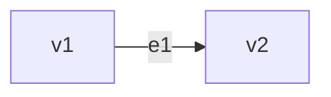

---
{"dg-publish":true,"permalink":"/calculus-3-stuff/graph-theory-semester-3/","title":"Graph Theory -- Semester-3 -- Mathematics III","tags":["Semester-3"],"created":"2025-03-06T18:33:20.181+05:30"}
---


---
# Index

1. [[#What is a Graph?]]
2. [[#Basic Terminology]]
3. [[#Types of Graph]]
4. [[#Complement of a graph.]]
5. [[#Planar Graph]]
6. [[#Di-graph (or Directed Graph)]]
7. [[#==Important Terminologies==]]
8. [[#Euler Line, Eulerian Circuit and Euler Graph]]
9. [[#Hamiltonian path, Hamiltonian Circuit and Hamiltonian Graph]]
10. [[#Isomorphic Graphs]]
11. [[#Theorems of Graph Theory]]
12. [[#Incidence and Adjacency]]
13. [[#Matrix Representation of a graph.]]
14. [[#Adjacency Matrix]]
15. [[#Incidence Matrix]]
16. [[#Trees]]
17. [[#Spanning Trees]]
18. [[#Minimal Spanning Trees]]
19. [[#Algorithms for finding the (Minimal Spanning Tree) MST of a Tree.]]
20. [[#1. Kruskal's Algorithm]]
21. [[#2. Prim's Algorithm]]

**Note** : If the equations on the website seem a bit to clumped up/clogged, please go to the resources section and download the PDF. It has better indentation.

---
# What is a Graph?

A graph is a mathematical structure containing 2 sets *V* and *E*  where *V*  represents a non-empty set of vertices and *E* represents a non-empty set of edges.


# Basic Terminology

1. Trivial Graph : A graph containing only one vertex no edge.
2. Null Graph: A graph containing n vertices and no edge.
3. Directed Graph: A graph consisting the direction of edges is called a directed graph.
4. Undirected Graph: A graph which is not directed.
5. Self loop in a graph: If edge having the same vertex as both it's end vertices is called a self loop.
6. Proper edge: An edge which is not self loop is called proper edge.
7. Multi edge: A collection of two or more vertices having a same end point.


---
# Types of Graph

1. Complete Graph: A simple connected graph is said to be complete if each vertex links to every other vertex.
2. Regular Graph: A graph G is said to be regular if every vertex has the same degree. If the degree of each vertex of graph G is K, then it is called K-regular graph. 
3. Bi-graph (or Bipartite Graph):  Let all the vertices contained in set 
   
   $$ V = \{v1, v2, v3, v4, v5\} $$
   and let X and Y be two ===disjoint sets=== having vertices which are not connected to each other :
   
   $$ X = \{v_{1}, v_{4}\} $$
   and
   
   $$ Y = \{ v_3, v_2, v_5 \} $$
	

	

  4. Complete Bi-partite graph: If every vertex in X is disjoint with every vertex in Y, then the graph is called a complete Bi-partite graph.
     
     
	
  5. Subgraph : Let there be a graph G(*V*, *E*), *V* and *E* being the two sets for it's vertices and edges. Let *V'* and *E'* be the subsets of *V* and *E* respectively. Thus G(*V'*, *E"*) is a graph and ==subgraph== of G(*V*, *E*).
---
# Complement of a graph.

The complement of a graph is basically the :

==connection of previously unconnected vertices==

and 

==removal of the connection of currently connected vertices==


---
# Planar Graph

A graph which can be drawn in a plane so that it's ==edges do not cross== are called planar graphs.


Self loops or parallel edges may be allowed here.


---
# Di-graph (or Directed Graph)

It is a type of graph where each edge has a direction.


The starting vertex is called the ==initial vertex==.

The ==vertex== which has ==no incoming edges== but only ==outgoing edges is called a source==.

The ==vertex== which has ==only incoming edges== and ==no outgoing edges== is ==called a sink==.

The ==In-degree== of a di-graph is the ==number of incoming edges==.

Denoted by  $$ d^-(v) $$
==Out- degree== of di-graph is the ==number of edges outgoing from a vertex.==

Denoted by $$ d^+(v) $$


---

# ==Important Terminologies==

## What is a Walk?

A walk is ==simply the traversal of all vertices in a graph and coming back to the initial vertex==.


## What is a Trail?

A trail is also a walk which ==traverses all the vertices and ending at the last vertex==, where ==no edges are repeated== and ==the starting vertex is not equal to the ending vertex==. 


## What is a Circuit?

A circuit is a ==closed trail== where the ==starting vertex is the same as the ending vertex==, i.e the walk ends at the initial vertex (==no edges are repeated==).

So, taking the graph above, the Circuit would be 

```mathematica
v1 -> v2 -> v3 -> v4 -> v5 -> v6 -> v7 -> v1
```

as **no edges are repeated** (only accessed once).

## What is a Path?

A path is a ==walk== where ==neither edges nor vertices are repeated== and ==the start vertex is not equal to the end vertex==, i.e the ==walk ends at the last vertex of the graph==.

In the graph above, the sequence, 

```mathematica
v1 -> v2 -> v3 -> v4 -> v5 -> v6 -> v7
```

is applicable as a path as **no edges or vertices are repeated**.

## What is a Cycle?

A cycle is a ===closed Path=== where the ===starting vertex is the same as the ending vertex=== , i.e ===the walk ends at the initial vertex of the graph===.

In the graph above, the sequence: 

```mathematica
v1 -> v2 -> v3 -> v4 -> v5 -> v6 -> v7 -> v1
```

is applicable as a cycle since **no intermediate edges or vertices except the starting vertex are repeated** and the **traversal ends at the starting vertex of the graph**.

---

# Euler Line, Eulerian Circuit and Euler Graph

## What is a Euler line?

A ==Euler line== is a ==trail== where ==each edge is visited exactly once==.

## What is a Eulerian Circuit?

A circuit that ==contains all the edges(without repeating any)== is called a Eulerian circuit.

## What is a Euler graph?

A graph ==that contains a Eulerian circuit== is called a ==Euler Graph==.


---

# Hamiltonian path, Hamiltonian Circuit and Hamiltonian Graph

## What is a Hamiltonian path?

A path which ==obtains every vertex of a graph exactly once== is called a ==Hamiltonian Path==.

## What is a Hamiltonian circuit?

A circuit which ==passes through every vertex at least once== is called a Hamiltonian circuit (ends at the starting vertex).

## What is a Hamiltonian graph?

A graph which contain a Hamiltonian circuit is called a Hamiltonian graph.


## Note : A Hamiltonian circuit will always have a Hamiltonian path but the reverse is not always true.


---

# Isomorphic Graphs

Two graphs *G* and *G'* are said to be *isomorphic* if

1. They have the same number of edges.
2. They have the same number of vertices.
3. The vertices in graph *G'* should have the same degree as the vertices in the graph *G*.


---

# Vertex-disjoint and Edge disjoint Graphs

Two graphs called ==vertex disjoint== if they have ==no vertex in common== .

Two graphs are called ==edge disjoint== if they have ==no edge in common== .


---

# Theorems of Graph Theory 

## 1. ==Handshaking Theorem/ The first theorem of graph theory==.

This theorem states that the "sum of the degree of the vertices of a graph is equal to **twice** the number of edges in a graph G".


## 2. The degree of any vertex in a simple graph with any vertices is n-1.

## 3. ==The maximum number of edges in a connected simple graph with n vertices is :
## n(n-1)/2==.

## 4. The number of odd vertices in any graph is even.

## 5. Minimum number of edges in a connected graph with n vertices in n-1.


---
# Incidence and Adjacency



Let there be an edge $e_1$ joining two vertices $v_1$ and $v_2$

Therefore one can say that edge $e_1$ is incident for $v_1$ and $v_2$

And the vertices $v_1$ and $v_2$ are adjacent on edge $e_1$.

==Edge, incident for vertices. Vertices adjacent on edge.==

---
# Matrix Representation of a graph.

https://www.youtube.com/watch?v=17erhldpZ8E&list=PLU6SqdYcYsfLV24T0XVb3z3mjl8QG0EBN&index=3
## Adjacency Matrix

Adjacency matrix: Let $a_{ij}$ denote the number of edges connecting vertices ($v_i$, $v_j$), then A = $[a_{ij}]_{m X m}$ is called an adjacency matrix of a graph G, if $a_{ij}$ = 1 if the vertices $v_1$ and $v_2$ are connected, and 0 if they are not connected.

Let's understand this using an example.


| Vertex | $v_1$ | $v_2$ | $v_3$ | $v_4$ | $v_5$ |
| ------ | ----- | ----- | ----- | ----- | ----- |
| $v_1$  |       |       |       |       |       |
| $v_2$  |       |       |       |       |       |
| $v_3$  |       |       |       |       |       |
| $v_4$  |       |       |       |       |       |
| $v_5$  |       |       |       |       |       |

So this is how we setup our adjacency matrix.

Now we see that $v_1$ is connected to  $v_2$ and $v_5$.

So we will fill the values with 1 under them and the rest with 0.

| Vertex | $v_1$ | $v_2$ | $v_3$ | $v_4$ | $v_5$ |
| ------ | ----- | ----- | ----- | ----- | ----- |
| $v_1$  | 0     | 1     | 0     | 0     | 1     |
| $v_2$  |       |       |       |       |       |
| $v_3$  |       |       |       |       |       |
| $v_4$  |       |       |       |       |       |
| $v_5$  |       |       |       |       |       |

Now we see $v_2$ is connected both to $v_1$ and $v_3$. So we fill their places with 1.

| Vertex | $v_1$ | $v_2$ | $v_3$ | $v_4$ | $v_5$ |
| ------ | ----- | ----- | ----- | ----- | ----- |
| $v_1$  | 0     | 1     | 0     | 0     | 1     |
| $v_2$  | 1     | 0     | 1     | 0     | 0     |
| $v_3$  |       |       |       |       |       |
| $v_4$  |       |       |       |       |       |
| $v_5$  |       |       |       |       |       |

For $v_3$, it's connected to $v_2$ and $v_4$, so we fill 1 under their places.

| Vertex | $v_1$ | $v_2$ | $v_3$ | $v_4$ | $v_5$ |
| ------ | ----- | ----- | ----- | ----- | ----- |
| $v_1$  | 0     | 1     | 0     | 0     | 1     |
| $v_2$  | 1     | 0     | 1     | 0     | 0     |
| $v_3$  | 0     | 1     | 0     | 1     | 0     |
| $v_4$  |       |       |       |       |       |
| $v_5$  |       |       |       |       |       |

For $v_4$, it's connected to $v_3$ and $v_5$. So we fill 1 under their places.

| Vertex | $v_1$ | $v_2$ | $v_3$ | $v_4$ | $v_5$ |
| ------ | ----- | ----- | ----- | ----- | ----- |
| $v_1$  | 0     | 1     | 0     | 0     | 1     |
| $v_2$  | 1     | 0     | 1     | 0     | 0     |
| $v_3$  | 0     | 1     | 0     | 1     | 0     |
| $v_4$  | 0     | 0     | 1     | 0     | 1     |
| $v_5$  |       |       |       |       |       |

For $v_5$, it's connected to $v_4$ and $v_1$. So we fill 1 under their places.

| Vertex | $v_1$ | $v_2$ | $v_3$ | $v_4$ | $v_5$ |
| ------ | ----- | ----- | ----- | ----- | ----- |
| $v_1$  | 0     | 1     | 0     | 0     | 1     |
| $v_2$  | 1     | 0     | 1     | 0     | 0     |
| $v_3$  | 0     | 1     | 0     | 1     | 0     |
| $v_4$  | 0     | 0     | 1     | 0     | 1     |
| $v_5$  | 1     | 0     | 0     | 1     | 0     |

So this is our final adjacency matrix.

---
## Example 2: Self loops and Parallel Edges in Adjacency Matrix

Let's say that this diagram was now modified to look like this :


So here, self-loops would count as 1, towards the same vertex, and the extra paths would add up as well.

So the modified adjacency matrix would be:

| Vertex | $v_1$ | $v_2$ | $v_3$ | $v_4$ | $v_5$ |
| ------ | ----- | ----- | ----- | ----- | ----- |
| $v_1$  | 0     | 1     | 0     | 0     | 3     |
| $v_2$  | 1     | 1     | 1     | 0     | 0     |
| $v_3$  | 0     | 1     | 0     | 1     | 0     |
| $v_4$  | 0     | 0     | 1     | 1     | 1     |
| $v_5$  | 3     | 0     | 0     | 1     | 0     |

Since there are 3 edges from $v_1$ to $v_5$ and vice-versa, and self loops in vertices $v_2$ and $v_4$.

---
## Example 3 : Adjacency matrix for Directed Graphs

In case of a directed graph, where the edges follow a certain direction only, ==we need to consider only the direction in which the edge is flowing, not the reverse==.


---
## Incidence Matrix

Let G be a graph with **m** vertices $V_1$, $V_2$, $V_3$ and **n** edges, $e_1$, $e_2$, $e_3$, ..... , $e_n$.

Let a matrix **M** = $[m_{ij}]_{mXn}$ , $m_{ij}$ = 1, if the vertex is incident on the edge.

$m_{ij}$ = 0, if the vertex is not incident on the edge.

$m_{ij}$ = 2, if the vertex is at the end of a self loop.


Let's take an example to understand this :


So this is our initial incidence matrix.

| Vertex | $e_1$ | $e_2$ | $e_3$ | $e_4$ | $e_5$ | $e_6$ |
| ------ | ----- | ----- | ----- | ----- | ----- | ----- |
| $v_1$  |       |       |       |       |       |       |
| $v_2$  |       |       |       |       |       |       |
| $v_3$  |       |       |       |       |       |       |
| $v_4$  |       |       |       |       |       |       |
| $v_5$  |       |       |       |       |       |       |

So we see vertices $v_1$ and $v_2$ are incident on edge $e_1$
And vertices $v_1$ and $v_5$ are incident on edge $e_6$.

Therefore we fill `1` under their places for the respective vertices, and the rest with `0`.

| Vertex | $e_1$ | $e_2$ | $e_3$ | $e_4$ | $e_5$ | $e_6$ |
| ------ | ----- | ----- | ----- | ----- | ----- | ----- |
| $v_1$  | 1     | 0     | 0     | 0     | 0     | 1     |
| $v_2$  | 1     |       |       |       |       |       |
| $v_3$  |       |       |       |       |       |       |
| $v_4$  |       |       |       |       |       |       |
| $v_5$  |       |       |       |       |       | 1     |

Now we see vertices $v_2$ and $v_3$ are incident on edge $e_2$. 
And vertices $v_2$ and $v_4$ are incident on edge $e_3$.

Therefore we fill `1` under their places for the respective vertices, and the rest with `0`.

| Vertex | $e_1$ | $e_2$ | $e_3$ | $e_4$ | $e_5$ | $e_6$ |
| ------ | ----- | ----- | ----- | ----- | ----- | ----- |
| $v_1$  | 1     | 0     | 0     | 0     | 0     | 1     |
| $v_2$  | 1     | 1     | 1     | 0     | 0     | 0     |
| $v_3$  |       | 1     |       |       |       |       |
| $v_4$  |       |       | 1     |       |       |       |
| $v_5$  |       |       |       |       |       | 1     |

Now we see vertices $v_3$ and $v_4$ are incident on edge $e_4$.

And vertices $v_4$ and $v_5$ are incident on edge $e_5$.

Therefore we fill `1` under their places for the respective vertices, and the rest with `0`.

| Vertex | $e_1$ | $e_2$ | $e_3$ | $e_4$ | $e_5$ | $e_6$ |
| ------ | ----- | ----- | ----- | ----- | ----- | ----- |
| $v_1$  | 1     | 0     | 0     | 0     | 0     | 1     |
| $v_2$  | 1     | 1     | 1     | 0     | 0     | 0     |
| $v_3$  | 0     | 1     | 0     | 1     | 0     | 0     |
| $v_4$  | 0     | 0     | 1     | 1     | 1     | 0     |
| $v_5$  | 0     | 0     | 0     | 0     | 1     | 1     |

And this is our resultant incidence matrix.

Now let's say the graph was modified to have a new edge $e_7$, on a self loop.


We see the vertex $v_3$ is incident on the edge $e_7$ which is bound in a self loop.

So ==self loops in incidence matrix are counted as 2==.

| Vertex | $e_1$ | $e_2$ | $e_3$ | $e_4$ | $e_5$ | $e_6$ | $e_7$ |
| ------ | ----- | ----- | ----- | ----- | ----- | ----- | ----- |
| $v_1$  | 1     | 0     | 0     | 0     | 0     | 1     | 0     |
| $v_2$  | 1     | 1     | 1     | 0     | 0     | 0     | 0     |
| $v_3$  | 0     | 1     | 0     | 1     | 0     | 0     | 2     |
| $v_4$  | 0     | 0     | 1     | 1     | 1     | 0     | 0     |
| $v_5$  | 0     | 0     | 0     | 0     | 1     | 1     | 0     |

And this would be the resultant incidence matrix.

---
# Trees

A tree is a connected graph ==without any loops or circuits==.

Example :


---
## Rooted Tree

A rooted tree is a tree in which vertex acts as the root(initial vertex) of the tree.


---
## Binary Tree

A binary tree is defined as a tree in which ==*there is exactly one vertex of degree two* which acts as the root vertex and *the remaining vertices could be of degrees one or three but not two*==.


These are binary trees.

However:


This is not a binary tree as there is one vertex other than the root which has a degree of 2.

The vertices at the end of the tree (or leaf nodes) are called *pendant vertices* since they have a degree of 1.


---
## Path length of a tree

A path length of a tree is defined as the sum of edges from the root to all the pendant vertices.


---
# Spanning Trees

Video explanation (Recommended to watch) :

https://www.youtube.com/watch?v=f30rxGvPWPo&list=PLU6SqdYcYsfLV24T0XVb3z3mjl8QG0EBN&index=9

A spanning tree is basically a subgraph of a graph G.


*ST = Spanning Trees*

---
## Some examples on Spanning Trees


---
# Minimal Spanning Trees

Let G be a weighted graph. ==A minimal spanning tree of G is a spanning tree of minimum weight==.


Graph G.


However the ==MST of G== will be ==the spanning tree whose combined length is the least of all the spanning trees==.


---
# Algorithms for finding the (Minimal Spanning Tree) MST of a Tree.

https://www.youtube.com/watch?v=f30rxGvPWPo&list=PLU6SqdYcYsfLV24T0XVb3z3mjl8QG0EBN&index=9 (MST, Kruskal's and Prim's algorithms)

## 1. Kruskal's Algorithm

  Step 1. Choose an edge of minimal weight.
  Step 2. At each step, choose the edge whose ==inclusion will not create a circuit==.
 Step 3. If a graph G has *n* vertices then stop after (*n*-1) edges.

Example of Kruskal's algorithm:


---
## 2. Prim's Algorithm

Step 1. Select any vertex and choose the edge and smallest weight from G.

Step 2. At each stage choose the edge of smallest weight, don't connect the vertices which are already connected with the smallest weight.

Step 3. Continue till all vertices are included.

Example of Prim's Algorithm :


---
