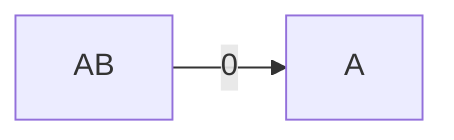
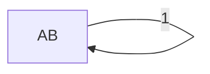
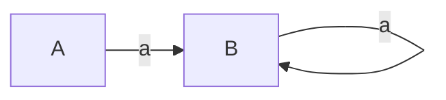
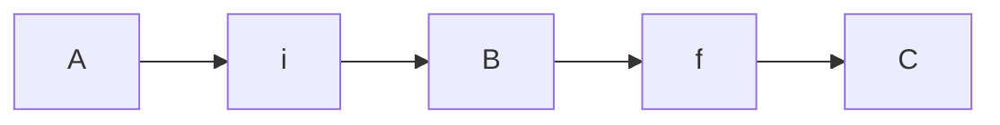

---
{"dg-publish":true,"permalink":"/compiler-design/module-2-lexical-analysis/","title":"Lexical Analysis -- Compiler design","tags":["Semester-5"],"created":"2025-03-06T18:33:20.247+05:30"}
---


---


# **Role of the Lexical Analyzer**

The **lexical analyzer** is the first phase in the compilation process. ==Its primary role is to read the source code, break it down into meaningful sequences called **tokens**, and pass those tokens to the next phase (Syntax Analysis)==. Let's dive deeper into its responsibilities and functions.

#### 1. **Breaking Down the Source Code**

- The source code of a program ==consists of a stream of characters==.
- The ==lexical analyzer groups these characters into **lexemes** based on predefined rules==.
- Each ==lexeme corresponds to a **token** — a fundamental unit like a keyword, identifier, or operator==.

Example: Consider this simple line of code:

```C
int x = 10;
```

The lexical analyzer would break this into the following tokens:

- `int` (Keyword)
- `x` (Identifier)
- `=` (Operator)
- `10` (Literal)
- `;` (Symbol)

---
#### 2. **Token Generation**

- ==A **token** is an abstract representation of a lexeme==. It consists of:
    - **Token Type**: A label indicating the kind of lexeme (e.g., `KEYWORD`, `IDENTIFIER`, `OPERATOR`).
    - **Value**: The actual value or lexeme associated with the token.

For example, for the lexeme `x`, the lexical analyzer might generate the token:

```python
Token Type: IDENTIFIER, Value: "x"
```
---
#### 3. **Skipping Whitespace and Comments**

- ==The lexical analyzer is responsible for **ignoring unnecessary details** like whitespaces, tabs, and comments==.
- For example:
```c
int a = 5;   // This is a comment

```
The lexical analyzer ignores spaces and the comment while processing the tokens `int`, `a`, `=`, and `5`.

---
#### 4. **Error Handling**

- ==The lexical analyzer must detect **lexical errors** early in the process. A lexical error occurs when a sequence of characters does not match any valid token pattern==.
- For example, the sequence `#foo` is an invalid identifier in C, and the lexical analyzer should raise an error immediately.
---
#### 5. **Interaction with the Syntax Analyzer**

- ==The lexical analyzer simplifies the work of the syntax analyzer by converting the source program into a sequence of tokens==.
- ==The **syntax analyzer** then uses these tokens to check the grammatical structure of the program== (as we'll see in the next module).
---
#### 6. **Symbol Table Interaction**

- ==The lexical analyzer sometimes interacts with the **symbol table**, a data structure that stores information about identifiers (variables, functions, etc.)==.
- For example, when the lexical analyzer encounters a variable like `x`, it might add an entry for `x` in the symbol table with details like its name and type.
---
#### 7. **Advantages of Lexical Analysis**

- **Modularity**: Lexical analysis separates the concerns of dealing with individual characters and tokens from the higher-level structure of the program.
- **Efficiency**: Since the lexical analyzer works with simple patterns (like regular expressions), it is usually fast.
- **Error Detection**: Early detection of invalid tokens helps prevent cascading errors in later phases.

---
#### 8. **Output of the Lexical Analyzer**

- The output is a **stream of tokens** that is passed to the syntax analyzer.
- For instance, the following source code:

```c
float result = x + y;
```
would generate tokens like:

```python
Token Type: KEYWORD, Value: "float"
Token Type: IDENTIFIER, Value: "result"
Token Type: OPERATOR, Value: "="
Token Type: IDENTIFIER, Value: "x"
Token Type: OPERATOR, Value: "+"
Token Type: IDENTIFIER, Value: "y"
Token Type: SYMBOL, Value: ";"
```
---
# 2. **Tokens, Patterns, and Lexemes**

In lexical analysis, the source program is broken down into **tokens** based on the recognition of **patterns**, where each **token** is associated with a sequence of characters called a **lexeme**. Let’s break down each term and see how they work together.

#### **1. Tokens**

==A **token** is a symbolic name for a sequence of characters that represent a meaningful element in a programming language==. The lexical analyzer's main job is to identify tokens from the source code.

Each token belongs to a certain **token type** or **category**. Some common token categories include:

- **Keywords**: Reserved words that have special meaning in a programming language (e.g., `if`, `while`, `int`, `return`).
- **Identifiers**: Names for variables, functions, classes, etc. (e.g., `x`, `myFunction`, `totalSum`).
- **Literals**: Constants in the source code (e.g., numeric literals like `123`, string literals like `"hello"`).
- **Operators**: Symbols that represent operations (e.g., `+`, `-`, `=`, `*`).
- **Punctuation/Symbols**: Characters like `;`, `{`, `}`, `(`, `)` that have syntactical meaning.

For example, in the statement:
```c
int count = 10;
```

The tokens would be:

- `int` (Keyword)
- `count` (Identifier)
- `=` (Operator)
- `10` (Literal)
- `;` (Punctuation)

---
#### **2. Lexemes**

==A **lexeme** is the actual sequence of characters in the source program that corresponds to a token==. The lexical analyzer groups characters into lexemes, and then assigns a token to each lexeme based on its type.

For example:

- In the statement `x = 42;`, the lexemes are:
    - `x`
    - `=`
    - `42`
    - `;`

Each of these lexemes corresponds to a particular token type:

- `x`: **IDENTIFIER**
- `=`: **OPERATOR**
- `42`: **LITERAL**
- `;`: **PUNCTUATION**

---

#### **3. Patterns**

==A **pattern** defines the structure that a lexeme must follow in order to be recognized as a certain type of token==. Patterns are often described using **regular expressions** (which we will discuss in more detail soon).

For example:

- The pattern for an identifier in many programming languages might be:
    - **`[a-zA-Z_][a-zA-Z0-9_]*`**
    - This regular expression means an identifier starts with a letter or underscore (`[a-zA-Z_]`) and can be followed by any number of letters, digits, or underscores (`[a-zA-Z0-9_]*`).

##### Example: Patterns for Different Token Types

1. **Keywords**: Recognized by fixed strings (e.g., `int`, `while`, `return`).
2. **Identifiers**: Defined by a regular expression like `[a-zA-Z_][a-zA-Z0-9_]*`.
3. **Literals**: Defined by patterns like:
    - **Integer Literals**: `[0-9]+` (One or more digits).
    - **Floating-point Literals**: `[0-9]+\.[0-9]+` (Digits followed by a decimal point and more digits).
4. **Operators**: Recognized by single or double characters (e.g., `+`, `-`, `*`, `==`).

---
#### **4. Token Recognition Process**

Here’s how the lexical analyzer uses patterns to recognize tokens:

1. **Scan the Source Code**: It reads the source code character by character.
2. **Match Lexemes to Patterns**: The lexical analyzer compares sequences of characters (lexemes) against a set of predefined patterns (rules) for each token type.
3. **Generate Tokens**: When a lexeme matches a pattern, the corresponding token is generated.

Let’s break this down with an example.

**Example**: Consider the following line of code:

```c
float total = 25.5 + x;
```
The lexical analyzer will scan this line and break it into lexemes, comparing each lexeme to its respective pattern:

- `float`: This lexeme matches the pattern for **Keyword**, so the token generated is `KEYWORD(float)`.
- `total`: This matches the pattern for an **Identifier** (`[a-zA-Z_][a-zA-Z0-9_]*`), so the token is `IDENTIFIER(total)`.
- `=`: This is an **Operator**, so the token is `OPERATOR(=)`.
- `25.5`: This matches the pattern for a **Floating-point literal**, so the token is `LITERAL(25.5)`.
- `+`: This is an **Operator**, so the token is `OPERATOR(+)`.
- `x`: This matches the pattern for an **Identifier**, so the token is `IDENTIFIER(x)`.
- `;`: This matches the pattern for **Punctuation**, so the token is `PUNCTUATION(;)`.

---
#### **5. Important Token Types in Detail**

Let’s look a bit deeper at some key token types:

- **Keywords**: ==These are predefined, reserved words in the language’s grammar. They cannot be used as identifiers==. Common keywords include `int`, `float`, `if`, `else`, `return`, `for`, `while`, etc.
    
    **Example**: In the following code:
```c
if (x > 10) {
    return x;
}

```
- The tokens `if` and `return` are keywords.

---

- **Identifiers**: ==These are names defined by the programmer for variables, functions, or other program elements==. Identifiers must adhere to specific naming rules in most languages, such as starting with a letter or underscore.
    
    **Example**: In the following code:
```c
int myVar = 100;
```

- The token `myVar` is an identifier.

---
- **Operators**: ==Operators perform operations on operands==. Examples include arithmetic operators (`+`, `-`, `*`, `/`), relational operators (`<`, `>`, `==`), and logical operators (`&&`, `||`).
    
    **Example**: In the expression `x + y`, `+` is an operator token.
    
- **Literals**: These are constant values embedded in the code, such as numeric constants (`100`, `3.14`), string constants (`"Hello"`), and boolean constants (`true`, `false`).
    
    **Example**: In the line `int count = 42;`, the number `42` is a literal token.

---
- **Punctuation**: ==These are symbols used to separate tokens and define the structure of the program==. Examples include semicolons (`;`), commas (`,`), parentheses (`()`), and braces (`{}`).

**Example**: In the function definition:

```c
void func(int x, int y) {
}
```
The tokens `(`, `)`, `{`, `}`, and `,` are punctuation tokens.

---
### Summary of Tokens, Patterns, and Lexemes:

1. **Token**: A token is a basic unit of meaning, like keywords, identifiers, operators, literals, etc.
2. **Lexeme**: A lexeme is the actual string of characters from the source code that matches a token pattern.
3. **Pattern**: A pattern is a rule (usually defined by regular expressions) that tells how to recognize lexemes for specific tokens.
4. **Process**: The lexical analyzer `scans the source code --> matches lexemes to patterns --> and generates tokens based on the patterns`.

---

# 3. **Lexical Errors** (not directly in syllabus but still beneficial)

A **lexical error** occurs when the lexical analyzer encounters a sequence of characters that does not match any valid token pattern. Since lexical analysis is the first phase of compilation, it plays a crucial role in detecting and reporting errors early in the process.

#### **Types of Lexical Errors**

There are several common types of lexical errors that can occur during compilation:

1. **Invalid Characters**
    
    - If the source code contains a character that is not recognized by the lexical analyzer (i.e., it doesn't fit any pattern for a token), a lexical error is reported.
    - Example: If the character `@` appears in C code where it is not valid, the lexical analyzer will flag it as an invalid character.
    
**Example**:
```c
int num@ = 10;  // '@' is not a valid character in this context
```
---
2. **Unrecognized Token**

- A lexical error occurs if a sequence of characters does not match any valid token pattern.
- Example: If a language has specific naming rules for identifiers and a programmer violates those rules, the lexical analyzer will fail to recognize the token.

**Example**:
```c
int 9num = 5;  // Identifiers cannot start with a number in most programming languages
```
---
3. **Incomplete Tokens**

- In some cases, the lexical analyzer may encounter an incomplete or malformed token. For example, in string literals, failing to close the string with a proper delimiter (e.g., `"` or `'`) would result in a lexical error.

**Example**:
```c
char* str = "Hello world;  // Missing closing quotation mark
```
----
4. **Invalid Number Format**

- Numeric literals must follow specific patterns, and violating these patterns can lead to errors. For example, a floating-point number might be written without a proper decimal point, or an integer might have an invalid prefix.

**Example**:

```c
int x = 09;  // Leading zero is not valid for decimal numbers in many languages
```
---
5. **Illegal Escape Sequences**

- In string or character literals, escape sequences must follow valid formats. If an invalid escape sequence is used, a lexical error is reported.

**Example**:

```c
char newline = '\x';  // Invalid escape sequence for character literals

```
---

### Summary of Lexical Errors

1. **Invalid Characters**: Unrecognized symbols that are not part of the language.
2. **Unrecognized Tokens**: Sequences that do not match any valid token pattern.
3. **Incomplete Tokens**: Tokens that are improperly formed, such as unclosed string literals.
4. **Invalid Number Formats**: Numbers that violate the language's syntax rules (e.g., leading zeros).
5. **Illegal Escape Sequences**: Improperly used or unknown escape sequences in string/character literals.

---
# 4. **Input Buffering**

In lexical analysis, **input buffering** ==is a technique used to handle the input stream more efficiently==. ==Since the lexical analyzer processes the source code character by character, it needs a way to reduce the overhead of reading one character at a time from the source file. Input buffering helps achieve this by reading chunks of the input and processing them in a way that reduces the number of disk I/O operations==.

#### **Why Input Buffering is Necessary**

Without input buffering, the lexical analyzer would need to access the input stream for each individual character, which would be inefficient. File I/O operations are slow relative to in-memory operations, so to avoid this bottleneck, input buffering is used to read a block of characters at once and process them efficiently from memory.

#### **Two-Buffer Scheme**

The most common input buffering strategy is the **two-buffer scheme**. This scheme uses two memory buffers of fixed size. Let's break down how this scheme works:

1. **Buffer Setup**:
    
    - ==The input is divided into two equal-sized buffers== (let's say each buffer holds `N` characters).
    - ==When one buffer is being processed by the lexical analyzer, the other buffer is being filled with the next portion of the input stream==.
    
2. **Forward and Lexeme Start Pointers**:
    - There are two pointers used:
        - **lexeme start**: Points to the start of the current lexeme (token being analyzed).
        - **forward pointer**: Points to the current character being processed.
    - ==As the lexical analyzer scans characters, the **forward** pointer moves ahead, searching for the end of a lexeme (token)==.
    - ==Once a token is identified, the lexeme start pointer is moved to the next unprocessed character==.
    
3. **Handling End of Buffer**:
    
    - ==When the **forward pointer** reaches the end of one buffer, the second buffer is loaded with the next block of input characters==.
    - If both buffers have been processed, the file's end is reached, and the lexical analyzer concludes the input processing.
    - The two-buffer approach ensures that there’s no need to move characters around or reprocess parts of the input, improving efficiency.

---
#### **Sentinel Characters**

==To avoid complex checking at the boundary between the two buffers (where the end of one buffer meets the beginning of the next), a **sentinel character** is used. The sentinel, typically an **EOF** (end-of-file) character, marks the boundary of each buffer==.

- The sentinel indicates the end of the input or the end of a buffer, signaling that the next buffer needs to be loaded.
- ==When the forward pointer encounters the sentinel, the lexical analyzer knows that it has reached the end of the current buffer and needs to move to the next one==.


#### **Example of Input Buffering**:

Consider a source file containing the following input:

```c
int x = 10;
```

Here’s how the two-buffer scheme might handle it:

1. The file is divided into two buffers:
    
    - Buffer 1: `int x =`
    - Buffer 2: `10;EOF`
2. The **lexeme start** and **forward** pointers begin at the start of buffer 1:
    
    - Initially, both point to the first character `'i'`.
3. The **forward** pointer moves through the buffer, identifying characters until it forms the lexeme `"int"`.
    
4. Once the lexeme `"int"` is formed, the lexical analyzer moves the **lexeme start** pointer to the first character after `"int"` (i.e., the space character `' '`).
    
5. The **forward** pointer continues scanning, looking for the next lexeme (`x`).
    
6. When the **forward** pointer reaches the end of buffer 1, it encounters a sentinel (`EOF` or another special marker).
    
7. The lexical analyzer then loads buffer 2 and continues scanning from the start of the second buffer.
    
8. The process continues until all characters in the input are processed, forming tokens.

---
#### **Advantages of Input Buffering**:

- **Faster processing**: By using buffers, the lexical analyzer reduces the number of I/O operations, which significantly speeds up the process.
- **Simplified I/O handling**: The two-buffer approach simplifies the handling of input data by avoiding repeated access to the file system.
- **Efficient lexeme recognition**: With the forward and lexeme start pointers, the lexical analyzer can efficiently recognize tokens without moving characters around in memory.

---

### Summary of Input Buffering:

- **Purpose**: ==Input buffering is used to reduce the overhead of reading one character at a time from the input stream==.
- **Two-buffer scheme**: This strategy divides the input into two fixed-sized buffers, reducing I/O operations by reading chunks of data.
- **Pointers**: ==The lexeme start and forward pointers are used to track the current token being processed==.
- **Sentinel characters**: Sentinels mark the end of buffers, allowing smooth transitions between them.
---

# Recap from FLAT (Formal language and Automata Theory) in relation to Compiler Design

### 1. Finite Automata

#### Basic Terminologies

1. Symbol : Any *alphanumeric* stuff : "a, b, c, 0, 1, 2, 3".... and so on.
2. Alphabet : $\sum$ , denotes a *collection of symbols*. For example $\sum -> \{a,b\}$ or $\sum -> \{d,e,f,g\}$ or $\sum -> \{0,1,2\}$
3. String : "A *sequence of symbols*". For example: "a,b,0,1,aa,bb,ab,01"
4. Language: A set of strings. For example $\sum -> \{0,1\}$

Let L1 be a set of strings of length 2

Therefore $\sum -> \{00,01,10,11\}$

L2 = Set of strings of length 3

$\sum -> \{000,001,010,011,100,101,110,111\}$

This can also be expressed as powers of $\sum$ .

For first case, it will be L1 = $\sum^{2}$ 

For second case, it will be L2 = $\sum^{3}$ 

There's two types of Finite Automata

1. Finite Automata without Output:
	1. Deterministic Finite Automata (DFA)
	2. Non-Deterministic Finite Automata (NFA)
~~2. Finite Automata with Output:
	1. Moore Machine
	2. Mealy Machine~~

---
#### Deterministic Finite Automata (DFA)

1. It is the simplest model of computation
2. It has a very limited memory.


Here *A,B,C,D* are the *states*. The edges having "0" or "1" are the inputs and also the transition states which determine which state will the DFA shift to.

The incoming arrow at state *A* indicates that *A* is the starting state.

The double circle in state *D* indicates that it is the *final state* of the DFA.

Every DFA/NFA can be defined using these 5 tuples

(Q, $\sum$, $q_0$, F, $\delta$ )


Symbol Pronunciation

$\sum$ = sigma (not the brainrot sigma kid)
$q_0$ = q "not"
$\delta$  = delta

## Example


Start from initial state A. Since we can only have input strings which start with 0, we send it to a final state B. Now in case B receives any more inputs, those will be looped at B.

Now we need to take care of the case of input strings starting with 1. Therefore we design another state C where those strings are sent and subsequent inputs in C, stay at C.

This state C is also known as the "dead state" where unwanted strings go to in DFA.

More DFA example videos:

https://www.youtube.com/watch?v=40i4PKpM0cI&list=PLBlnK6fEyqRgp46KUv4ZY69yXmpwKOIev&index=4
https://www.youtube.com/watch?v=2KindKcLjos&list=PLBlnK6fEyqRgp46KUv4ZY69yXmpwKOIev&index=5
https://www.youtube.com/watch?v=_2cKtLkdwnc&list=PLBlnK6fEyqRgp46KUv4ZY69yXmpwKOIev&index=6

---

#### Non-deterministic Finite Automata


 

The ==main difference== between DFA and NFA is that in DFA all the states are ==*pre-determined*== and there is only one *unique next state*,  however in NFA there could be, given the current state  *multiple next states* and the ==next state may be chosen at random== and all the *next states could be chosen in parallel*.

## Examples


Let's create an NFA for this set

We start with our initial state A and another state B


We declare B as final state and for any subsequent inputs to B, we loop them into B itself


Now we could have looped inputs of 1 into A itself, or sent it to a final state in case of a DFA, but in this case of an NFA, this NFA is complete.

Example test strings


3. 

So we need to make two states whose combined inputs will result in a string of length 2 and a final state to hold the strings.


Note that we want our NFA to be restricted to the values of set L and thus we didn't make any changes to final state C.


All example videos on NFA:

https://www.youtube.com/watch?v=4bjqVsoy6bA&list=PLBlnK6fEyqRgp46KUv4ZY69yXmpwKOIev&index=12
https://www.youtube.com/watch?v=Bcen1W_uFEU&list=PLBlnK6fEyqRgp46KUv4ZY69yXmpwKOIev&index=13
https://www.youtube.com/watch?v=--CSVsFIDng&list=PLBlnK6fEyqRgp46KUv4ZY69yXmpwKOIev&index=15

---
#### Conversion of NFA to DFA


## Example.


Given NFA here.

Step 1. ==Make the state transition table for the NFA==.


Here as we can see, on input 0, *A* goes to *B* and on input 1, *A* goes to $\phi$ (NULL)
On input 0, *B* loops back to itself and on getting input 1, *B* goes to $\phi$ (NULL)

Step 2. ==Make the state transition table for the resultant DFA from the state transition table of the NFA==.


Since we ==cannot leave unwanted strings to loop in any other state than a dead state== in ==DFA==, we put a new state C in place of $\phi$ .

And since we created a new state C, we need to define the transitions on C as well, which loops to itself despite any input to state C.


Thus the new resultant DFA.

## Example 2. (Important)


Here's our given NFA and it's transition state table. Note that on an input of 1, state *A* loops to itself and also goes to final state *B*, to represent that we created a new state which represents states $\{A, B\}$ .


In case of a DFA since there is ==*only one unique next state*== we need to represent $\{A, B\}$ using a new state *AB*.

And we also need to define the state transitions of *AB*.


==**We only considered state AB instead B in the second part since state is unreachable from the new transition table**==. How?


| States | 0   | 1   | Remark                                                                        |
| ------ | --- | --- | ----------------------------------------------------------------------------- |
| A      | A   | AB  | --> Here Only states A and AB are present but B **explicitly** is not present |
| AB     | A   | AB  | So we only work on states A and AB.                                           |


Since state **AB** is a **union** of states **A** and **B**, it's state transitions are defined by the ==**union of the state transitions of both A and B**==.

So 


is given by $\{A\} \cup \phi$, which gives $\{A\}$

and 



is given by $\{AB\} \cup \phi$ which gives $\{AB\}$

This method of creating new states which contains more than one state is called "Subset creation method".

Thus the resultant DFA will be:


And $\{AB\}$ will be the final state since part of it's **union** was **B** which was the original final state.

---

More example videos :

https://www.youtube.com/watch?v=i-fk9o46oVY&list=PLBlnK6fEyqRgp46KUv4ZY69yXmpwKOIev&index=17

https://www.youtube.com/watch?v=dY1bCC6syLI&list=PLBlnK6fEyqRgp46KUv4ZY69yXmpwKOIev&index=18

https://www.youtube.com/watch?v=dY1bCC6syLI&list=PLBlnK6fEyqRgp46KUv4ZY69yXmpwKOIev&index=18

https://www.youtube.com/watch?v=Y92dtMnarAU&list=PLBlnK6fEyqRgp46KUv4ZY69yXmpwKOIev&index=19

---
#### Minimization of DFA [Hopcroft's Algorithm]

Minimization of DFA is required to obtain the minimal version of any DFA which consists of the minimum number of states possible.


Let's understand this practically using examples.

## Example 1.

Given a DFA and it's state transition table.


==Step 0==. Remove any **unreachable** states. Just don't consider them at all.

==Step 1==. Write the zero equivalence as two separate sets : {Set of non-final states} {Set of final states}

 0 equivalence = $\{A,B,C,D\}$ $\{E\}$ 

==Step 2==. Write 1 equivalence.

Here we see that in the first set, there are 4 states. Now ==we need to see if those states are 1 equivalent to each other==. How we do that is ==we take pairs of the sets==, then check if the ==next states of the pairs are equal to each other== . If so then the pair is 1 equivalent to each other.

We get to see that for input 0, both A and B go to state B and for input 1, we see that A goes to state C and B goes to state D.

Thus we need to check if C and D are 1 equivalent to each other or not.

We see that both C and D go to state B on input 0 and on input 1, C loops to itself and D goes to state E.

Now we also see that A and C share the same next states for both inputs.

Thus C and D are not 1-equivalent to each other.

Therefore

1 equivalence = $\{A,B,C\}$ $\{D\}$ $\{E\}$ 


==Step 3: Check for 2-equivalence using the same method==

Use the row of 1-equivalence

We will only focus on the set of $\{A,B,C\}$

We know that on input 0, A and B go to the same states, but on input 1, A goes to state C and B goes to state D.

Check if C and D are in the same set or not. [False].
Thus A and B are not 2-equivalent to each other.

Thus, 

2 equivalence = $\{A,B\}$ $\{C\}$ $\{D\}$ $\{E\}$

Now we see that for any further equivalences, the result is the same, so we can stop the process here.


Now using this equivalence and the existing transition state table, we get the new minimized DFA


Where AC is treated as a single new state.

Therefore, DFA before minimization


And DFA after minimization


**Another simplified way to understand this process.**

- **Remove Unreachable States**:
    
    - Start from the initial state and remove any state that can't be reached by any sequence of inputs from the initial state.
- **Partition States**:
    
    - First, divide the set of states into two groups:
        1. **Final states** (accepting states)
        2. **Non-final states** (non-accepting states)
- **Refine the Partition**:
    
    - Repeatedly refine these groups by checking for distinguishability:
        - ==For each group of states, if two states have transitions under the same input symbol leading to different groups, they are distinguishable and must be separated into different groups==.
    - This step continues until no more refinements are possible.
- **Construct the Minimized DFA**:
    
    - Each group of indistinguishable states from the final partition can be combined into a single state in the minimized DFA.
    - Define the transitions for the new minimized states based on the representative state from each group.


### Key points to look for:

1. **Compare Transition Behavior**:
    
    - When checking if two states can be grouped together, observe where they transition based on each input. If they transition to the same or already grouped states for each input, they can potentially be merged.
2. **Use Existing Groups to Form New Groups**:
    
    - If a state transitions to an already grouped state, it strengthens the case for merging that state with others that also transition to the same group.
    - For example, as you noticed, since **q0** and **q4** transition to {q1, q7} and to **q5** for their respective inputs, they can be grouped together because their outputs align with already established groups.
3. **Refine Based on Group Similarities**:
    
    - When two states transition to similar groups for all inputs, they can be combined into a single state in the minimized DFA.
    - As the partition process refines, states that behave similarly are grouped together, further reducing the DFA.

### How to Apply This in Practice:

- **Step 1**: Start by partitioning states based on final and non-final states.
- **Step 2**: For each input, check where each state transitions.
- **Step 3**: ==If two states transition to the same states or groups (including already grouped states), then those states can be grouped==.
- **Step 4**: ==Continue refining your groups until no further grouping is possible==.


---
More examples on the DFA minimization

https://www.youtube.com/watch?v=0XaGAkY09Wc&list=PLBlnK6fEyqRgp46KUv4ZY69yXmpwKOIev&index=21
https://www.youtube.com/watch?v=ex9sPLq5CRg&list=PLBlnK6fEyqRgp46KUv4ZY69yXmpwKOIev&index=22
https://www.youtube.com/watch?v=DV8cZp-2VmM&list=PLBlnK6fEyqRgp46KUv4ZY69yXmpwKOIev&index=23
https://www.youtube.com/watch?v=kYMqDgB2GbU&list=PLBlnK6fEyqRgp46KUv4ZY69yXmpwKOIev&index=24

---
# Regular Languages


---
# Regular Expressions


Important operations to remember in Regular Expressions.

1. Union : The union of any two RE is denoted by $R_1 + R_2$ 
2. Concatenation : The concatenation of any two RE is denoted by $R_1 . R_2$ 
3. Iteration/Closure: The iteration of any RE is denoted by $RE^{*}$. 
For example :

$a^{*}$ = { ^, a, aa, aaaa}.... where ^ is called the *empty symbol*. The empty symbol's presence is mandatory for such an RE to be considered a closure.

## Examples 


Any comma in the set is denoted by Union (or), but if it has the empty symbol as in example 2, it is denoted by concatenation(and).

---
# Identities of Regular expressions 


https://www.youtube.com/watch?v=yp4pYgXfYD8&list=PLBlnK6fEyqRgp46KUv4ZY69yXmpwKOIev&index=47

---
# Arden's Theorem


Proof in case someone wants to memorize this


https://www.youtube.com/watch?v=Idl_0mPzZjE&list=PLBlnK6fEyqRgp46KUv4ZY69yXmpwKOIev&index=48

## Example video 

https://www.youtube.com/watch?v=TkqcPh0BFUw&list=PLBlnK6fEyqRgp46KUv4ZY69yXmpwKOIev&index=49

If $R = Q + RP$ , then: $R = QP^{*}$, provided P does not contain $\in$

---

# Designing of Regular Expressions


https://www.youtube.com/watch?v=FOhEmW_nMRs&list=PLBlnK6fEyqRgp46KUv4ZY69yXmpwKOIev&index=50

---
# Conversion of NFA to Regular Expression


Step 1. Create equations of each state which includes it's *incoming* state transitions


Solve the equations to get an RE in terms of the final state.


Thus, by Arden's Theorem:


---

# Conversion of DFA to Regular Expression


## Example 2: When DFA has multiple final states


Find RE in terms of both the final states then perform a Union of the two


---

# Conversion of Regular expression to Finite Automata


Union : both inputs can go to the same state.
Concatenation: Will need two states of one input each
Closure: Will loop into that state itself.
Iteration: Send to a next state then self loop.

Example: For $a^{+}$



## Example


All example videos on this topic : 

https://www.youtube.com/watch?v=62JAy4oH6lU&list=PLBlnK6fEyqRgp46KUv4ZY69yXmpwKOIev&index=55
https://www.youtube.com/watch?v=RsSQPwUIR8U&list=PLBlnK6fEyqRgp46KUv4ZY69yXmpwKOIev&index=56
https://www.youtube.com/watch?v=zSHS_7omxRY&list=PLBlnK6fEyqRgp46KUv4ZY69yXmpwKOIev&index=57

---

# Design of Lexical Analyzer Generator (Lex)

### 1. **Overview of Lex and its Role in Compiler Design**

Lex, short for **Lexical Analyzer Generator**, is a tool that automates the creation of a **lexical analyzer** (also called lexer or scanner). The lexical analyzer is responsible for reading the source code of a program and dividing it into **tokens**, which are meaningful units like keywords, identifiers, numbers, etc. These tokens are passed to the parser in the next stage of compilation.

- **Input**: Lex takes a specification of token patterns (usually written as regular expressions).
- **Output**: Lex produces C code for a lexical analyzer. This lexer will scan the source code, identify tokens, and trigger corresponding actions (like passing tokens to the parser).

### 2. **The Design Process of Lex**

The design process of Lex consists of the following major steps:

- **Step 1**: Writing the Lex specification (regular expressions and actions).
- **Step 2**: Converting regular expressions to a Non-deterministic Finite Automaton (NFA).
- **Step 3**: Converting the NFA to a Deterministic Finite Automaton (DFA).
- **Step 4**: Minimizing the DFA for efficiency.
- **Step 5**: Code generation to recognize tokens and execute actions.

Let’s dive deeper into each step of the process:

---
### **Step 1: Writing the Lex Specification**

The first step is to provide Lex with a **specification file**. This file contains regular expressions for token patterns and the corresponding actions to take when a pattern is recognized.

A Lex specification has three main sections:

1. **Definitions section** (`%{ ... %}`): This contains any C code that needs to be included in the generated lexical analyzer. For example, you may include headers or define global variables that the actions will use.
2. **Rules section** (`%% ... %%`): This is the heart of the specification. It defines **patterns** (using regular expressions) and **actions** (written in C).
3. **Auxiliary functions**: Additional C functions or code that will be used in the rules section.

```lex
%{
#include <stdio.h>
%}

%%
[0-9]+    { printf("Found a number: %s\n", yytext); }
[a-zA-Z][a-zA-Z0-9]*   { printf("Found an identifier: %s\n", yytext); }
[ \t]+    { /* Ignore whitespace */ }
.         { printf("Unknown character: %c\n", yytext[0]); }
%%

int main() {
    yylex();  // Lex function to start tokenizing
    return 0;
}

```
### **Step 2: Regular Expression to NFA Conversion**

Once the regular expressions are provided, Lex converts them into **NFAs (Non-deterministic Finite Automata)**. An NFA is a type of automaton that can have multiple possible transitions from a state for the same input symbol. NFAs are suitable for handling regular expressions because of their flexibility in matching patterns.

- **NFA Construction for Single Regular Expression**: For each regular expression in the Lex specification, Lex constructs an NFA. For example, the regular expression `[a-zA-Z]` (which matches any letter) would be represented as an NFA that transitions on any letter.
    
- **Union of NFAs**: If there are multiple regular expressions (which is usually the case), Lex constructs individual NFAs for each regular expression and combines them using the **union operation**. This creates a single NFA capable of recognizing multiple patterns.
    

### **Step 3: NFA to DFA Conversion**

Since NFAs are non-deterministic (i.e., they can have multiple transitions for the same input symbol), they are less efficient for scanning input streams. To make the lexical analyzer more efficient, Lex converts the NFA into a **DFA (Deterministic Finite Automaton)**.

- **DFA Construction**: In a DFA, each state has exactly one transition for each possible input symbol. This makes DFAs much faster for recognizing patterns because they always know the next state based on the current state and input character.
    
- **Subset Construction Algorithm**: The most common algorithm for converting an NFA to a DFA is the **subset construction algorithm**. The idea is to create a DFA where each state represents a set of NFA states. By processing all possible combinations of NFA states, Lex ensures that the DFA will recognize the same patterns as the NFA, but more efficiently.
    

### **Step 4: DFA Minimization**

Once the DFA is constructed, Lex **minimizes** the DFA to reduce the number of states and transitions. This step is essential for making the generated lexer more efficient.

- **Minimization Process**:
    - Merge **equivalent states** (states that behave identically for all inputs) into a single state.
    - This results in a smaller, faster DFA that still correctly recognizes the tokens described by the original regular expressions.

### **Step 5: Code Generation**

After constructing and minimizing the DFA, Lex generates **C code** for the lexical analyzer. This code is designed to scan the input, identify tokens, and execute the corresponding actions.

- **Lex Functionality**:
    
    - The generated C code includes a function called **`yylex()`**, which is responsible for scanning the input stream and identifying tokens.
    - The lexer will read the input character by character and use the DFA to determine which token (if any) matches the current input.
- **Matching Process**:
    
    - Lex will always try to match the **longest** possible string that fits any regular expression. This ensures that tokens like `==` are not misinterpreted as two separate `=` tokens.

---
## In-Depth Example: Tokenizing a Simple Language

Let’s go through an example of designing a lexical analyzer using Lex to tokenize a simple programming language.

1. **Token Definitions**: We’ll define regular expressions for basic tokens like keywords (`if`, `else`), operators (`+`, `-`), numbers, and identifiers.
    
2. **Lex Specification**:

```lex
%{
#include <stdio.h>
%}

%%
"if"      { printf("Keyword: IF\n"); }
"else"    { printf("Keyword: ELSE\n"); }
[0-9]+    { printf("Number: %s\n", yytext); }
[a-zA-Z][a-zA-Z0-9]*   { printf("Identifier: %s\n", yytext); }
"+"       { printf("Operator: +\n"); }
"-"       { printf("Operator: -\n"); }
[ \t\n]+  { /* Ignore whitespace */ }
.         { printf("Unknown character: %s\n", yytext); }
%%

int main() {
    yylex();  // Start the lexical analysis
    return 0;
}

```

---

The code works somewhat like this :

```lex
%{
#include <stdio.h>
%}
```

This imports the headers/global variables

Inside 

```lex
%%

"regular-expression" {Action to be done on detecting the regular expression}

%%
```

For example in this line

```lex
"if"      { printf("Keyword: IF\n"); }

```

An NFA is constructed like this:



and when the expected inputs are detected, this printed by the lex

```python
Keyword: IF
```

---

3. **DFA for Token Matching**:
    
    - **`"if"`**: A DFA will be constructed for the regular expression `"if"`. The DFA will recognize the sequence of characters `i`, `f` and transition to an accepting state.
    - **`[a-zA-Z][a-zA-Z0-9]*`**: A DFA will be built to match identifiers. The DFA starts in a state that accepts letters and can transition to states that accept letters or digits.
    
4. **Lex Action**: When the DFA matches a token (like a keyword or operator), the corresponding action (e.g., printing the token or passing it to the parser) is executed.

---
### **Summary: Design Process of Lex**

- **Input Specification**: Write the regular expressions and actions.
- **Regular Expressions to NFA**: Lex converts the regular expressions into NFAs.
- **NFA to DFA Conversion**: Lex uses the subset construction algorithm to convert the NFA into a DFA.
- **DFA Minimization**: The DFA is minimized to optimize performance.
- **C Code Generation**: Lex generates C code for a lexer that uses the DFA to recognize tokens and execute actions.

By automating these steps, Lex simplifies the process of designing a lexical analyzer, allowing you to focus on defining token patterns and actions instead of manually building DFAs.

---