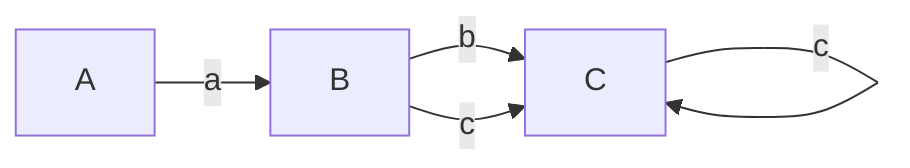
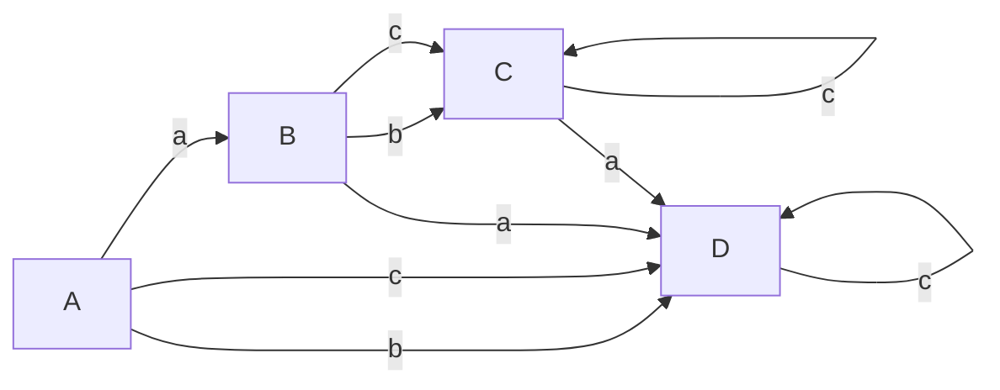
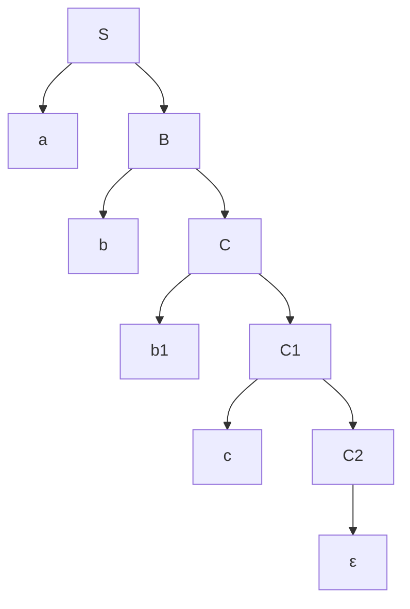
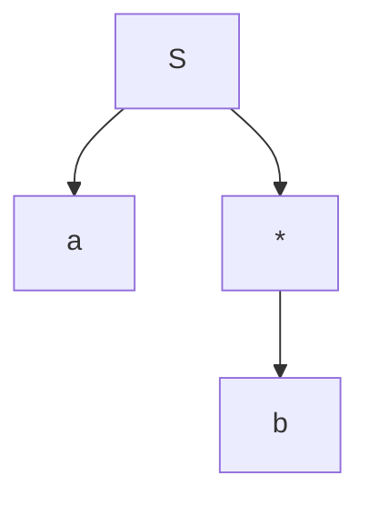
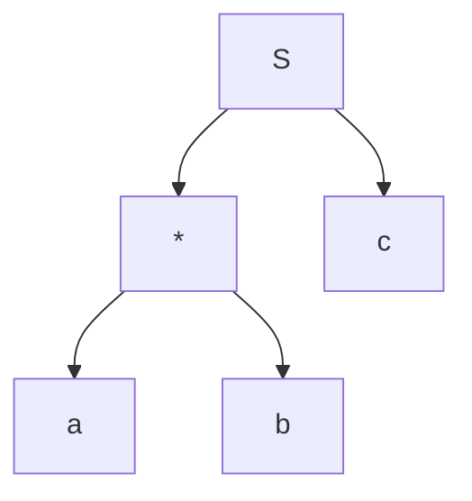
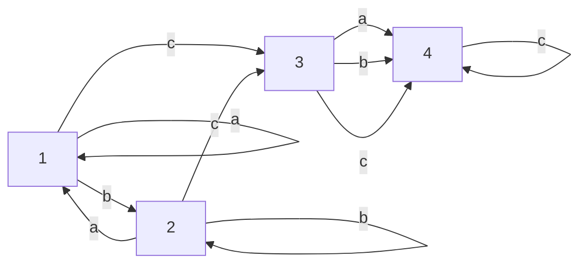

---
{"dg-publish":true,"permalink":"/compiler-design/module-3-syntax-analysis-and-parser/","title":"Syntax Analysis and Parsing -- Compiler Design","tags":["Semester-5","Semester-4"],"created":"2025-03-06T18:33:20.260+05:30"}
---


---
# Index

1. [[#Role of a Parser]]
2. [[#FLAT Recap Context Free Languages, Context Free Grammar, Derivation/Parse Trees and Ambiguous Grammar.]]
3. [[#Pre-requisites before moving to parsing]]
4. [[#1. Generating a parse tree for a Regular expression.]]
5. [[#2. First() and Follow() methods]]
6. [[#Parser Types]], [[#Constructing the parse table and checking for LL(1) compatibility]]
7. [[#Pre-requisites before heading into LR parsers types.]] (VERY VERY IMPORTANT)
8. [[#Pre-requisites before heading into LALR parsing.]]
9. [[#LALR parser]]
10. [[#Operator Precedence Parsing]]
11. [[#Creating the Operator Precedence parsing table.]]
12. [[#Parsing a string from the Operator-Precedence Parsing Table]]
13. [[#Parser Generator (YACC)]]
14. [[#Error Recovery Strategies for Parsing Techniques]]
15. [[#3. Error Recovery in LL Parsing]]
16. [[#4. Error Recovery in SLR Parsing]]
17. [[#5. Error Recovery in LALR Parsing]]
18. [[#7. Error Recovery Strategy Comparison (LL vs SLR vs LALR)]]
---
# Role of a Parser

A **parser** is a key component of the **syntax analysis** phase of a compiler, which follows the **lexical analysis** phase. Its primary role is to check whether the input tokens, produced by the lexical analyzer, form a syntactically correct sequence based on the grammar of the language.

#### 1. **Basic Function of a Parser**

The parser takes the stream of tokens from the lexical analyzer and attempts to build a **parse tree** (or **syntax tree**) by checking if the sequence of tokens can be generated by the grammar rules of the programming language.

- **Input to Parser**: Tokens from lexical analysis.
- **Output from Parser**: Parse tree or an error message if the syntax is incorrect.

#### 2. **Role in Compiler Design**

The parser ensures that the input program follows the syntax of the programming language. It is responsible for detecting errors related to the structure of the program (syntax errors) but not semantic errors (which involve meaning).

##### Phases of Parsing:

- **Syntax Analysis** checks for proper structure based on rules defined by the grammar.
- It generates a **parse tree**, where each node represents a grammatical construct.

For example, for the expression:

```c
a = b + 5;
```

If the tokens generated by the lexical analyzer are:

- `IDENTIFIER("a")`
- `ASSIGN("=")`
- `IDENTIFIER("b")`
- `PLUS("+")`
- `NUMBER("5")`
- `SEMICOLON(";")`

The parser checks if this sequence conforms to the rules of the grammar for assignment and arithmetic expressions.

#### 3. **Key Tasks of the Parser:**

1. **Syntax Verification**:
    
    - It verifies whether the input string (a series of tokens) adheres to the grammar of the programming language.
2. **Building Parse Trees**:
    
    - If the input tokens follow the grammar, the parser constructs a parse tree, a hierarchical representation of how the program fits the grammar rules.
3. **Error Detection and Recovery**:
    
    - If the tokens do not match the grammar, the parser detects syntax errors and attempts to recover from them to continue parsing the rest of the input.
    - Parsers often use strategies like **panic-mode recovery** or **phrase-level recovery** to handle errors.

#### 4. **Types of Parsers**:

The role of the parser can be further divided into two major categories of parsers:

- **Top-Down Parsers**:
    
    - They attempt to build the parse tree starting from the root and proceed down to the leaves.
    - Example: **Recursive Descent Parsing** and **LL(1) Parsing**.
- **Bottom-Up Parsers**:
    
    - They start with the input tokens and attempt to build the parse tree by reducing tokens to non-terminals, working up to the start symbol.
    - Example: **LR Parsers** and **Shift-Reduce Parsing**.

#### 5. **Why a Parser is Important**:

- **Maintains Language Structure**: Without a parser, the compiler wouldn't be able to interpret the structure of the source code, and therefore, wouldn't be able to convert it into an executable form.
    
- **Error Reporting**: Parsers are crucial for **error reporting**. They help programmers by pinpointing exactly where in the program the syntax has gone wrong, helping with debugging.
    
- **Abstract Syntax Tree (AST)**: The **parse tree** is sometimes transformed into an **Abstract Syntax Tree (AST)**, a more concise representation of the source code's syntax that is easier for subsequent phases of the compiler to process.

---
### Example:

Consider the following grammar for a simple assignment statement:

```mathematica
S → id = E
E → E + T | T
T → id | num

```

For the input `x = y + 5`, the parser checks:

- Is `x` an identifier (`id`)?
- Is there an `=` sign?
- Does `y + 5` form a valid expression based on the rules of the grammar?

If the input matches, the parser will generate the following parse tree:

```bash
        S
       / \
      id  =
           \
            E
           / \
          E   +
         /     \
        T       T
       /       / \
     id      num

```

### Summary of the Role of Parser:

- **Input**: Token stream from the lexical analyzer.
- **Output**: Parse tree (if valid) or syntax error (if invalid).
- **Key Functions**:
    1. Verify syntax based on grammar.
    2. Build parse tree or abstract syntax tree (AST).
    3. Detect and recover from syntax errors.

---
# FLAT Recap : Context Free Languages, Context Free Grammar, Derivation/Parse Trees and Ambiguous Grammar.

## Context Free Language


The main difference between CFL and a Regular language is that of the production rule.
In RL the production rule is not an iteration, that is, it cannot contain an empty symbol.

However in a CFL the production rule is a closure, that is it can contain an empty symbol.

---
## Example


https://www.youtube.com/watch?v=htoFbcwES28&list=PLBlnK6fEyqRgp46KUv4ZY69yXmpwKOIev&index=72

---
## Derivation Tree

https://www.youtube.com/watch?v=u4-rpIlV9NI&list=PLBlnK6fEyqRgp46KUv4ZY69yXmpwKOIev&index=73


---

## Ambiguous Grammar


Here instead of drawing a tree, the variables were used on the left and right side respectively.

---
## Reduction/Simplification of Context-Free Grammar

### 1. Reduction of CFG

https://www.youtube.com/watch?v=EF09zxzpVbk&list=PLBlnK6fEyqRgp46KUv4ZY69yXmpwKOIev&index=78


---
Let's work this out using an example:


---
### Removal of Unit Production

https://www.youtube.com/watch?v=B2o75KpzfU4&list=PLBlnK6fEyqRgp46KUv4ZY69yXmpwKOIev&index=76


Let's understand this using an example.


---
### Removal of Null Productions

https://www.youtube.com/watch?v=mlXYQ8ug2v4&list=PLBlnK6fEyqRgp46KUv4ZY69yXmpwKOIev&index=77


---
## Removal of Left Recursions

**This happens during the conversion of Chomsky Normal Form to Greibach Normal Form**.

We don't have the conversions in this semester anymore.

But there was one question regarding the **removal of left recursion** from a grammar in last year's (2023) paper.

So I will cover this part.

Still here's the link for the video where the original production was given in case someone wants to view it

https://www.youtube.com/watch?v=ZCbJan6CGNM&list=PLBlnK6fEyqRgp46KUv4ZY69yXmpwKOIev&index=80&pp=iAQB


So this is how a left recursion looks.

**When the start symbol on the LHS keeps repeating endlessly on the RHS, it's called a left recursion**.


---
# Pre-requisites before moving to parsing

## 1. Generating a parse tree for a Regular expression.

### 1. The standard way (easy but a bit time consuming.)


Let's say we have the regex : $a(b+c)^{*}$

### Steps Involved

1. Convert the regular expression to an NFA
2. Convert the NFA to it's equivalent DFA
3. Generate CFG production rules for the DFA
4. Draw the derivation tree/parse tree from the production rules.

### Step 1. Convert RE to NFA




The state transition table for this NFA would be:


| States | a      | b      | c      |
| ------ | ------ | ------ | ------ |
| A      | B      | $\phi$ | $\phi$ |
| B      | $\phi$ | C      | C      |
| C      | $\phi$ | C      | C      |

---
### Step 2. Convert NFA to DFA

The state transition table for the DFA would be:


| States | a   | b   | c   |
| ------ | --- | --- | --- |
| A      | B   | D   | D   |
| B      | D   | C   | C   |
| C      | D   | C   | C   |
| D      | D   | D   | D   |

And the resulting DFA:



---
### Step 3. Generate CFG from the DFA

Here start symbol `S` depicts the initial state `A`.

```mathematica
S --> aB
B --> bC | cC
C --> bC | cC | ε
```

The ε symbol tells the parse tree when to stop production.

We ignore the dead state `D`.

So from this production rule, let's generate the parse tree for the regex with the example string 
`abbc`



Since the syntax for writing graph here is a bit wacky so I can't write C all the time as it will loop back to itself, hence the nodes `b1`, `C1` and `C2`. However on paper they will be just `b` and  `C`.

---
### 2. Using operator precedence

#### 1. **Identify the Operators and Operands**:

Regular expressions consist of **operands** (individual symbols or characters) and **operators** such as:

- **Concatenation**: `.` (often implicit in REs, e.g., `ab` means `a.b`)
- **Union (alternation)**: `|`  or $\cup$ or `+`
- **Kleene Star**: `*`
- **Parentheses**: Used for grouping expressions.

#### 2. **Construct Nodes Based on Precedence**:

- **Kleene Star (`*`)** has the highest precedence.
- **Concatenation** (`.`) has the next level of precedence.
- **Union (`|`)** has the lowest precedence.

The idea is to break the regular expression into smaller parts and recursively build the tree based on operator precedence.

#### 3. **Start from the Root**:

- The root of the syntax tree corresponds to the highest-precedence operator that governs the entire regular expression.
- Sub-expressions become child nodes.

#### 4. **Build the Tree Recursively**:

- Every operator has its own subtree, where the children are the operands or results of lower-precedence operations.
- Leaf nodes are the individual characters or symbols from the regular expression.

### Example

Given regex $a|b^{*}$

Given operators : `|`,  `*`

Following  operator precedence, we can do:

Let S be the root.



**Example 2:**

$(a|b)^{*}c$


Operators : `|`, `*`, `.`

Let S be the root.



where S is the concatenation operator (`.`).

---

### 3. Converting an RE to DFA directly using `firstpos`, `laspos` and `followpos` methods

Using the previous example

**Example 2:**

$(a|b)^{*}c$


Operators : `|`, `*`, `.`

Let S be the root.


where S is the concatenation operator (`.`).

First we number the leaf nodes as `positions`.

Given the regex, 

a is the first leaf node so it gets the `position of 1`.
b is the second leaf node so it gets the `position of 2`.
c is the third and last leaf node so it gets the `position of 3`.


From the given regex, here's a possible string

aac.

### What the methods, `firstpos()`, `lastpos()` and `followpos()` try to do?

1. `firstpos()` tries to figure out which of the `positions/leaf nodes` could be the `first character` in ==any== `example string` generated by the `regex`.
2. `lastpos()` tries to figure out which of the `positions/leaf nodes` could be the `last character` in ==any== `example string` generated by the `regex`.
3. `followpos()` tries to figure out, that for a given `position/leaf node` which of the `positions` could be the `next following character` in ==any== example string generated by regex.
4. When `followpos()` is called it calls `firstpos()` of the `following node`. Kind of similar to how `first and follow` work (mentioned in the next section).

This mostly happens when `followpos()` detects `Concatenation or Kleene Star operators.`

---


The methods work ==per node==. This means for a leaf node, `firstpos()` and `lastpos()` will return the exact same value, the leaf node's numbering/position.

For `root` node it will return the last position in the entire string, as intended.

Now to construct the DFA, these methods need to be executed on every node to get the accurate data to construct the DFA.

Here is our parse tree again:


Starting with the leaf nodes / positions, we find that

`firstpos(a) = 1`
`firstpos(b) = 2`

For the `*` node, it is attached to a union of leaf nodes `a` and `b`

So `firstpos(*) = firstpos(a)` $\cup$  `firstpos(b)` = `{1, 2}` .

`firstpos(S)`, the root node, we have the concatenation between nodes `*` and `c`.

So the first character from any string will come from `*` or `firstpos(*)`

$\therefore$ `firstpos(S)` = `firstpos(*) = {1,2}`.

---
Now we compute the `lastpos()` method

For the entire string itself, the last character will always be `c` no matter what string it is.

So `lastpos(S) = {3}`.

---

For the state transitions, we will need to use `followpos()`

For `S`, we see that it is only followed by  a concatenation of `*` and `c`.

`*` is followed by only the node `c`.

So `followpos(S) = firstpos(*) = {1,2}`

We also see that `*` is followed by node `c`  of position `3`.

Since we already have included `{1,2}` from `firstpos(S)`, we factor in the `followpos(*)` where we see that it is followed by `c`.

So `followpos(*)` = `firstpos(3) = {3}`

For `followpos(3), since c is the last char, it will be {}`.

So final `followpos(S)` = `firstpos(*)` $\cup$ `followpos(*)` = `{1,2,3}`


Thus, the resultant DFA table will be:


| States | a   | b   | c   |
| ------ | --- | --- | --- |
| 1      | 1   | 2   | 3   |
| 2      | 1   | 2   | 3   |
| 3      | 4   | 4   | 4   |
| 4      | 4   | 4   | 4   |

Where `4` is the dead/trapping state.

According DFA would be:




---
## 2. First() and Follow() methods

---
## 1. First() method

### Recapping the rules

1. `First(terminal variable) = terminal variable`
2. `First(ε) = ε` 
3. `Placing ε in any non-terminal variable will completely rule it out and move to the next non-terminal variable(if any)`.
4. `In case of a non-terminal on the RHS, we find the first of that non-terminal, i.e the first of any non-terminal variable will always contain a terminal variable`.

---
#### Example 1

```mathematica
S -> A B c 
A -> a | b A 
B -> d B | ε
```

So the `first(S)` would be `A`.
`first(A) = ab` 
`first(B) = dε`

So we can say that `first(S)` becomes `ab`.

---
#### Example 2

```mathematica
S -> ABC
A -> a | b | ε
B -> c | d | ε
C -> e | f | ε
```
So here we have `first(S) = A`

`first(A) = abε`
`first(B) = cdε`
`first(C) = efε`

So we can also say that `first(S) = abε`

Now as soon as `ε` is placed, `A` will get ruled out and the next non-terminal is considered, which is `B` in this case.

So `first(S) = abcdε`.

Again, in the same way, `B` is ruled out and now `C` is considered.

So `first(S) = abcdefε`. No more non-terminals left to consider so this is the `First()` set of `S`.

---
#### Example 3

```mathematica
E -> TE'
E' -> *TE'|ε
T -> FT'
T' -> ε | +FT'
F -> id|(ε
```

`first(E) = T`
`first(T) = F`
`first(F) = id(`

Thus `first(E) = id(`

---
## 2. Follow() method

### Recapping the rules

1. `Follow(S) where S is the start symbol = {$}`
2. `Follow(A) where A is a non-terminal symbol, goes to it's immediate right.`
3. `In case of a non-terminal variable on the right, we find it's First()`
4. `In case of ε being present on the right of a non-terminal, it's Follow() will be the Follow(LHS), mostly the Follow(S) where S is the start symbol or {$} or any other non-terminal variable on the LHS.`
5. `ε is never included in the Follow set.`
6. `As previously mentioned, applying ε in a non-terminal symbol will rule it out and the next non-terminal symbol will be considered (if any).`

#### Example 1

```mathematica
S -> A B c 
	A -> a | b A 
B -> d B | ε
```

we can re-write the grammar as 

```mathematica
S -> A B c ε
A -> a ε | b A ε 
B -> d B ε | ε
```

So `follow(S)` will include `$`

And  `follow(A) = first(B)`
`first(B) = dε`

Also from `A -> a ε | b A ε `, we see that `ε` maps back to it's start symbol, which is also `A`.

So follow of it's start symbol will be `$`

Therefore `follow(A) = {$, d}`

`ε` was skipped as it is not included in follow sets.

Therefore `follow(B) = c` and from `B -> d B ε | ε`,  there is `ε` on the RHS of B so it maps back to the start symbol, which is also `B`. Now follow of any start symbol is `$`.

So `follow(B) = {$, c}`

---
#### Example 2

```mathematica
S -> A C B
A -> a A | ε
B -> b B | ε
C -> c C | d
```

This grammar can be re-written as :

```mathematica
S -> A C B ε
A -> a A ε | ε
B -> b B ε | ε
C -> c C ε | d ε
```

`follow(S) = {$}`
`follow(A) = {$, first(C)} = {$, cd}`


`follow(B) = {$}`
`follow(C) = {$, first(B)} = {$, b}`, `ε` not included

---
# Parser Types

https://www.youtube.com/watch?v=hGuXUIefVkc&list=PLxCzCOWd7aiEKtKSIHYusizkESC42diyc&index=7


In our syllabus we have just :

1. **Top-Down Parsing**
    - **Recursive Descent Parsing**
    - **LL(1) Parser**
2. **Bottom-Up Parsing**
    - **LR Parsers** (SLL, LALR, and Canonical LR (LR(0)))
    - **Shift-Reduce Parsing**
3. **Operator-Precedence Parsing**

---
## 1. Top-Down Parsing

Top-Down Parsing attempts to construct a parse tree from the root (starting symbol of the grammar) down to the leaves (input tokens). It works by trying to match the input string with the production rules of the grammar.

#### 1. **Recursive Descent Parsing**

**Recursive Descent Parsing** is a type of top-down parsing that is typically implemented using a set of recursive functions, each corresponding to a non-terminal in the grammar.

- **How it works**:
    - Each function tries to match a production rule for a non-terminal and recursively calls other functions for the symbols on the right-hand side of the rule.
    - If it successfully matches the input tokens, it returns success; otherwise, it backtracks to try another rule.

#### Example:

Consider this grammar:

```css
S → a A
A → b | c
```

A recursive descent parser for this grammar would have two functions:

- `parse_S()` for the non-terminal `S`.
- `parse_A()` for the non-terminal `A`.

The function `parse_S()` would first check if the next token is `a`. If it is, it proceeds to call `parse_A()` to handle the non-terminal `A`.

The function `parse_A()` would check if the next token is `b` or `c`, and return success if one of them is found.

---

#### 2. Predictive Parsers (LL Parsing)

#### **Overview**:

- A **predictive parser** is a more advanced version of top-down parsing, which eliminates backtracking by using a **lookahead symbol**.
- **LL(1)** parsing is the most common form of predictive parsing, where **L** stands for **Left-to-right scanning**, **L** stands for **Leftmost derivation**, and **1** is the number of lookahead symbols.
- Predictive parsers use a **parsing table** to decide which rule to apply next, based on the current non-terminal and the lookahead symbol.

We need to construct the parsing table first to see if the given grammar is `LL(1)` or not.

---
## Constructing the parse table and checking for LL(1) compatibility

https://www.youtube.com/watch?v=WTxdKQmsfho&list=PLxCzCOWd7aiEKtKSIHYusizkESC42diyc&index=8 (Highly recommended to watch this video.)

The LL(1) parser belongs to the category of **Top-Down parsing**.

## LL(1) parsing table creation

1. Find `first()` and `follow()` of all variables
2. Assign numbers to the productions
3. Create the parsing table.
4. Fill in the values based on the `first()` of each variable on RHS  of each production
5. In case of `ε` on the RHS, we will find the `follow()` of the production's start symbol

---
### Example 1

So let's say we have been given a grammar

```mathematica
S -> (L) | a
L -> SL'
L' -> ε | ,SL'
```
This grammar can be re-written as:

```mathematica
S -> (L)ε | aε
L -> SLε'
L' -> ε | ,SL'ε
```
---
#### First sets

`first(S) = {(, a}`
`first(L) = {first(S)} = {(, a}`
`first(L') = {ε, ,}`

---
#### Follow sets


`follow(S) = {$, first(L')} = {$, )}`
`follow(L) = {)}`
`follow(L') = follow(L) = )

---
Now we assign numbers to the productions :

`S -> (L)` = `1`
`S -> a` = `2`
`L -> SL'` = `3`
`L' -> ε` = `4`
`L' -> ,SL'` = `5`

Now we create the parse table ==with each column header containing a terminal symbol ==.
==$ is always present as an extra terminal in the table==
We **CANNOT** use `ε` as a column header in the parse table.

We need to fill the empty part of the table with the numbered productions

| Variables | (   | )   | a   | ,   | $   |
| --------- | --- | --- | --- | --- | --- |
| S         |     |     |     |     |     |
| L         |     |     |     |     |     |
| L'        |     |     |     |     |     |

So we take production 1

`S -> (L)` and we find the `first()` of it's RHS, which is just `(`

So we fill `1` under the `(` symbol.

| Variables | (   | )   | a   | ,   | $   |
| --------- | --- | --- | --- | --- | --- |
| S         | `1` |     |     |     |     |
| L         |     |     |     |     |     |
| L'        |     |     |     |     |     |

As for production 2, `S -> a`, we just write `2` under `a` symbol in the table.

| Variables | (   | )   | a   | ,   | $   |
| --------- | --- | --- | --- | --- | --- |
| S         | `1` |     | `2` |     |     |
| L         |     |     |     |     |     |
| L'        |     |     |     |     |     |

For production 3 `L -> SL'`, `first(L)` = `S`, so we find first of `S` which is `{(, a}`

So we write `3` under the `(` symbol and the `a` symbol

| Variables | (   | )   | a   | ,   | $   |
| --------- | --- | --- | --- | --- | --- |
| S         | `1` |     | `2` |     |     |
| L         | `3` |     | `3` |     |     |
| L'        |     |     |     |     |     |

For production 4, `L' -> ε` , we see that we have `ε` on the RHS. So we find the `follow(L')` which is `{)}`

So we write `4` under the `)` symbol.

| Variables | (   | )   | a   | ,   | $   |
| --------- | --- | --- | --- | --- | --- |
| S         | `1` |     | `2` |     |     |
| L         | `3` |     | `3` |     |     |
| L'        |     | `4` |     |     |     |

And lastly for production 5, `L' -> ,SL'`, the `first(L') = {,}`

So we write `5` under the `,` symbol.

| Variables | (   | )   | a   | ,   | $   |
| --------- | --- | --- | --- | --- | --- |
| S         | `1` |     | `2` |     |     |
| L         | `3` |     | `3` |     |     |
| L'        |     | `4` |     | `5` |     |

Now **if any cell within the LL(1) parse table has more than one entry in it, then the given grammar is NOT LL(1) compatible**.

Here we see that the populated cells have only one entry each.

So, the given grammar, 

```mathematica
S -> (L) | a
L -> SL'
L' -> ε | ,SL'
```

is LL(1) compatible.

---
### Example 2

```mathematica
S -> aSbS | bSaS | ε
```
So we can re-write this grammar as :

```mathematica
S -> aSbSε | bSaSε | ε
```

We need to check whether this grammar is LL(1) compatible or not.

#### First sets

`first(S) = abε`

#### Follow sets


`follow(S) = {$, a, b}`

Therefore the LL(1) parsing table will be:

| Variables | a   | b   | $   |
| --------- | --- | --- | --- |
| S         |     |     |     |

Now we number the productions :

`S -> aSbS`  = `1`.
`S -> bSaS` = `2`.
`S -> ε` = `3`.

Starting with production `1`, we find the `first(S)` which is `a`.

So we write `1` under the column of `a` symbol.

| Variables | a   | b   | $   |
| --------- | --- | --- | --- |
| S         | `1` |     |     |

For production `2`, `first(S) = b`.

So we write `2` under the `b` symbol.

| Variables | a   | b   | $   |
| --------- | --- | --- | --- |
| S         | `1` | `2` |     |

For production `3`, we see that `first(S) = ε`. So it will result in a `follow(S)` which is `{$, a, b}`.
So we will write `3` in all the cells of the table.

Existing values will assume a fractional form as follows: 

| Variables | a     | b     | $   |
| --------- | ----- | ----- | --- |
| S         | `1/3` | `2/3` | `3` |

So here we see that two cells contain more than one value.

So the grammar :

```mathematica
S -> aSbS | bSaS | ε
```

is NOT, LL(1) compatible.


---
## Working out the LL(1) parser

Now we populate the input buffer with the string, ending with the `$` symbol.

| a                      | b   | $   |
| ---------------------- | --- | --- |
| ^<br>\|\|<br>lookahead |     |     |

Now we create the stack, and push `[StartSymbol , $]` on it.


|          |
| -------- |
|          |
|          |
|          |
| S <= Top |
| $        |

Now we see that our first character on the string is `a` on the buffer.

And the top of the stack is the start symbol, `S`. Upon inspection of the parse table, we find that the corresponding rule for the character a, is `S->AB`, so we push `AB` or in this case `BA` to the stack.

The reason for `BA` is that it's read as `AB` from top to bottom.

|         |
| ------- |
|         |
|         |
|         |
| A <=Top |
| B       |
| ~~S~~   |
| $       |

`S` is `popped` from the stack and `A` becomes the new `top`.
Now for `a`, the matching production rule in `A` is `A->a`.

So `a` is pushed on the stack.


|         |
| ------- |
|         |
|         |
| a <=Top |
| ~~A~~   |
| B       |
| ~~S~~   |
| $       |

Now the `top`, `a` matches the first character in the buffer, so the lookahead variable proceeds to the next character in the buffer.


| ~~a~~   | b                      | $   |
| ------- | ---------------------- | --- |
| Matched | ^<br>\|\|<br>lookahead |     |

And the stack becomes:

|          |
| -------- |
|          |
|          |
| ~~a~~    |
| ~~A~~    |
| B <= Top |
| ~~S~~    |
| $        |

For the character `b`, the relevant rule from `B` is `B->b`. So it is pushed on the stack.


|          |
| -------- |
|          |
| b <= Top |
| ~~a~~    |
| ~~A~~    |
| ~~B~~    |
| ~~S~~    |
| $        |

We see that the top of the stack matches the current character in the buffer, so the lookahead proceeds to the next character, which in this case is `$`.

| ~~a~~   | ~~b~~   | $                      |
| ------- | ------- | ---------------------- |
| Matched | Matched | ^<br>\|\|<br>lookahead |

So the stack becomes:

| ~~b~~    |
| -------- |
| ~~a~~    |
| ~~A~~    |
| ~~B~~    |
| ~~S~~    |
| $ <= Top |

And we see that again the `top`, `$` matches the last character, `$` in the buffer, so it indicates that the parsing is successful.

The stack and buffer finally are cleared out.

| ~~b~~ |
| ----- |
| ~~a~~ |
| ~~A~~ |
| ~~B~~ |
| ~~S~~ |
| ~~$~~ |

| ~~a~~   | ~~b~~   | ~~$~~   |
| ------- | ------- | ------- |
| Matched | Matched | Matched |

And that is how the LL(1) parser works.

---
## Bottom-Down Parsing.

Bottom-up parsing attempts to **construct the parse tree from the leaves up to the root**, essentially reversing the rightmost derivation. You start with an input string and work backwards to reduce it to the start symbol of the grammar.

In contrast to top-down parsers like LL(1), which try to expand the start symbol of the grammar and work towards the input, **bottom-up parsers shift tokens onto a stack and try to reduce the stack to the start symbol of the grammar**.

#### Key Steps in Bottom-up Parsing:

1. **Shift:** Read (shift) a symbol from the input and push it onto the stack.
2. **Reduce:** Replace a substring on the top of the stack that matches the right-hand side of a production rule with the left-hand side non-terminal of that rule.
3. **Accept:** If the stack contains only the start symbol and the input buffer is empty, parsing is successful.
4. **Error:** If no valid move (shift or reduce) is possible, an error occurs.

### Types of Bottom-up Parsers

- **~~Shift-Reduce Parse~~r**: ~~A generic technique that reduces the stack's top according to production rules.~~
- **LR Parsers (Simple LR, SLR, Canonical LR, LALR)**: More structured, deterministic forms of shift-reduce parsers.

---
# LR Parser

**LR parsers** (Left-to-right, Rightmost derivation) are a type of **bottom-up parsers** that efficiently handle a large class of context-free grammars. The "L" stands for **left-to-right scanning of the input** and the "R" refers to constructing a **rightmost derivation in reverse**.

LR parsers are deterministic and produce no backtracking, making them ideal for programming languages and real-time applications. They use a **stack** to track the states and an **input buffer** to process tokens.

### Key Components of LR Parsers

1. **Stack**: Contains symbols and states used during parsing.
    
2. **Input Buffer**: Holds the string to be parsed (with `$` at the end).
    
3. **Parsing Table**: Used to decide when to shift, reduce, accept, or detect errors. It consists of:
    
    - **Action Table**: Guides shifts, reductions, acceptances, or errors based on the current state and input symbol.
    - **Goto Table**: Guides transitions between states after reductions based on the non-terminal symbol.
4. **State**: Represents the current status of the parsing process (where you are in the grammar).


### The LR Parsing Algorithm

The LR parser operates using four possible actions:

- **Shift**: Move the next input symbol to the stack.
- **Reduce**: Replace a string on the stack with a non-terminal based on a grammar rule.
- **Goto**: Transition to a new state after a reduction.
- **Accept**: Successfully finish parsing if the stack contains the start symbol and the input buffer contains `$`.
- **Error**: Occurs when no valid action is available.

The algorithm follows these basic steps:

1. Initialize the stack with the **start state**.
2. Read the **next input symbol**.
3. Based on the current state and input symbol, consult the **parsing table** for an action (shift, reduce, goto, accept, or error).
4. Continue this process until either the string is successfully parsed or an error is encountered.

---
# Pre-requisites before heading into LR parsers types.

This took me 3 days to get completely right. So buckle up, this is gonna be a wild ride, but **if you read everything to the letter with patience, you will figure this out, just like I did.**


Here's a video for reference but it's **a lot in brief**.

https://www.youtube.com/watch?v=J4ZME5KOB-s&list=PLxCzCOWd7aiEKtKSIHYusizkESC42diyc&index=20

---
## Checking if a grammar is SLR(1) compatible.

**SLR(1) parsing belongs to the parsing type of Bottom-up parsing where the entire production is scanned first by the parser to the bottom then reduced back to it's start symbol at the top**.

Let's say we have been given an example grammar:

```mathematica
E -> T + E | T
T -> id
```

1. We number the productions as we did previously.

`E -> T + E` = `1`.
`E -> T` = `2`.
`T -> id` = `3`.

2. We then, **augment** the grammar by adding a new production rule which points to the start symbol.

`E' -> E`

So the new augmented grammar becomes:

```mathematica
E' -> E
E -> T + E
E -> T
T -> id
```

3. Build the LR(0) canonical item sets.
4. Build the LR(0) Action and Go-To tables
5. Build the SLR(1) Action Table from the LR(0) Action Table
6. If there are no conflicts (shift-reduce or reduce-reduce), then the grammar is SLR(1) compatible.

---
## Recapping the concepts of LR(0) canonical items, shifting and reduction LR(0) parsing.

The parsing process happens with the help of **certain items** called canonical items. In this instance, these are called LR(0) canonical items **as SLR(1) parsing depends on LR(0) canonical items**.

So here the parser (atleast in theory let's assume we have a machine called a parser), will **scan** through all the symbols one at a time.

We visually represent this process by using a dot `.`

So, there will be a **stage** when the dot is before a variable (meaning it's not scanned), and a stage after the variable, where it's scanned( which means that production is ready to be reduced.)


So we get these :

- **Production:** `E' -> E`
    
    - Items:

```mathematica
E' -> .E   // Initial item for the start symbol
E' -> E.   // The dot is after the entire production, meaning it's ready for reduction
```
- **Production:** `E -> T + E`

	- Items:

```mathematica
E -> .T + E   // Before anything is parsed
E -> T . + E  // After parsing `T`
E -> T + .E   // After parsing `T +`
E -> T + E.   // After parsing `T + E`
```

- **Production:** `E -> T`
	- Items:

```mathematica
E -> .T      // Before `T` is parsed
E -> T.      // After `T` is parsed (ready for reduction)
```
- **Production:** `T -> id`
	- Items:

```mathematica
T -> .id     // Before `id` is parsed
T -> id.     // After `id` is parsed (ready for reduction)
```

So, the LR(0) items (without closure) are:

```mathematica
E' -> .E
E' -> E.
E -> .T + E
E -> T . + E
E -> T + .E
E -> T + E.
E -> .T
E -> T.
T -> .id
T -> id.
```

Now these items are called **LR(0) canonical items without closure**. 

---
### What is closure by the way?

It's basically the expansion of non-terminal variables, revealing all possible productions like a traversal, and adding unexplored non-terminals to the right of the dot, to consider them as **parsed**.

Like opening a folder to see their contents inside.

It only works on **non-terminal variables**.

---

So after applying closure, the items will be **grouped into sets**, called **canonical item sets**.

So here we have the first production:

`E' -> .E`


So here to form a closure of `E'`, it needs to be expanded.


So accommodating all expansions of `E'`, we get the first LR(0) canonical item set $I_0$ as :

```mathematica
E' → .E
E → .T + E
E → .T
T → .id
```
Now to open the folder of `E` or expand on `E`, the parser needs to **shift over** `E` first so that it's ready for reduction.

So we get a new LR(0) canonical item set $I_1$ as :

```mathematica
E' -> E.
```


Next we open the folder of `E` or expand on `E` (however you say it).


So we get to see the two productions which `E` leads to and the parser shifts over the first variable, `T` in both cases, meaning the variable `T` is ready for reduction.

So we get a new LR(0) canonical item set $I_2$ as:

```mathematica
E → T. + E
E → T.
```


Now we can't parse the next variable **as it's a terminal variable** and closure only works on **non-terminal variables**, but the parser can **still shift beyond the terminal to access any remaining non-terminals**.

So the parser just shifts over the terminal symbol `+` to get a new production 

`E -> T + .E`

So, we get a new canonical item set $I_3$ as :

```mathematica
E -> T +. E
E → .T + E
E → .T
T → .id
```
A question students might have at this point.

**However when expanding the `E` at `E -> T +. E`, why did we go back to the `E` which was in I0, and use it's parts instead of using the other variations of `E` from I2 ?**

The Key Idea: **Every Non-Terminal Always Expands Using the Same Rules of the Original Augmentation.**

---
### Why not use the variations of `E` from I2?

The confusion comes from the fact that **I2** has items where we've already shifted past some of the symbols in `E`, like:

```mathematica
E → T . + E

```
This is an **intermediate state** in the parsing process, not a fundamental part of `E`'s definition. When we say we are expanding `E`, we are going back to the **original grammar** rules for `E`, not to items that show progress in parsing those rules.

In other words:

- **I2** represents progress we've made in parsing `E` (where the dot has moved), but it's not a definition of `E` itself.
- When we expand `E`, we always go back to the base productions of `E` from the grammar, not to items like `E → T . + E` that are specific parsing steps.


**Why are not the remaining productions shifted over too?**

```mathematica
E → .T + E
E → .T
T → .id
```
These?

Because :
1. `T` has already been parsed over, so we don't need to shift the dots again over the remaining `T`.
   
   In:
   
   ```mathematica
	E → T. + E
	E → T.
	```
   `T` has already been **shifted over**.
   
   So we **don't expand T again**.
   
   And in :
   
   ```mathematica
   E' -> E.
	```
   `E` has already been parsed completely.
   
   So even after shifting over to get :
   
   ```mathematica
   E → T + E.
	```
   We **don't expand E again**. 
   
2. ==The way the shifting is done is dictated by the rules of the original grammar==. These "canonical item sets" we see are **in-between phases** of parsing, so we don't follow their "rules" to shift over again.


So from $I_3$, after shifting the dot over `E` we get a new LR(0) canonical item $I_4$ as :

```mathematica
E → T + E.
```


And shifting the dot over terminal `id` we get the last LR(0) canonical item $I_5$ set as :

```mathematica
T -> id.
```

And thus finally all non-terminals have been expanded and are ready for reduction.

---
### What Exactly is **Reduction** in LR Parsing?

**Reduction** in LR parsing means that the parser has matched a sequence of input symbols that corresponds to the **right-hand side (RHS)** of a production rule, and it now replaces this sequence with the **left-hand side (LHS)** of the production.

Reduction is the reverse of derivation:

- In **derivation**, you expand non-terminals into terminals using production rules.
- In **reduction**, you collapse terminals back into non-terminals using the production rules.

It’s like a `substitution method`, but only works if it’s possible to substitute the entire `input/production` rule back to the **original numbered production**.

Reduction **only works**, if the entire **production rule / terminal** has been parsed, and **end of input has been reached.** The parser then checks whether it’s possible to reduce the **entire rule / terminal**, back to the **augmented start symbol**.

This is how **reduction** works in bottom-up parsing, where it gradually builds back up to the start symbol.

---
### What exactly is Shifting in LR parsing?

#### **Shifts (`S`)**:

- **Shift** means to “read” a symbol from the input and move to a new state.
- `S3` means **Shift** the input symbol (i.e., read it) and then move to state `3`.

The number after `S` refers to the **state** the parser should transition to after the shift. Here’s how it works:

- The current state looks at the next input symbol (let’s say it’s `+`).
- If the table entry says `S3`, it means “Shift the input symbol `+`, consume it, and go to state `3`”.

For example, if you’re in **state 0** and the next input symbol is `id`, the Action table might say `S5`. This means the parser will shift (consume `id`) and move to **state 5**.

---
## Creating the LR(0) Action and Go-To Tables

Recapping our LR(0) canonical items

- **I₀:**

```mathematica
E' → .E
E → .T + E
E → .T
T → .id
```

- **I₁:**

```mathematica
E' -> E.
```

- **I₂:**

```mathematica
E -> T. + E
E -> T.
```

- **I₃:**

```mathematica
E → T + .E
E → .T + E
E → .T
T → .id
```

- **I₄:** from (I3​), `E -> T + .E`

```mathematica
E -> T + E.
```

- I5​: (from I0​)

```mathematica
T -> id.
```

And our **numbered productions**

We number these productions as 1, 2 and 3

`E -> T + E` = 1 
`E -> T` = 2 
`T -> id` = 3

---
### Creating the LR(0) Action Table.


All the state transitions are depicted in this picture.

**The action table denotes transitions over terminal symbols and the reductions**

We create the action table as follows :

The column headers are all the terminal symbols because that's where the shifting takes place.

| States | `id` | `+` | `$` |
| ------ | ---- | --- | --- |
| $I_0$​ |      |     |     |
| $I_1$​ |      |     |     |
| $I_2$​ |      |     |     |
| $I_3$​ |      |     |     |
| $I_4$​ |      |     |     |
| $I_5$​ |      |     |     |

For terminal `id` we see that $I_0$ goes to $I_5$ from the image.

So $I_0$ will shift over `id` to $I_5$

So we write `S5` to represent “Shift to State 5”.

| States | `id` | `+` | `$` |
| ------ | ---- | --- | --- |
| $I_0$​ | `S5` |     |     |
| $I_1$​ |      |     |     |
| $I_2$​ |      |     |     |
| $I_3$​ |      |     |     |
| $I_4$​ |      |     |     |
| $I_5$​ |      |     |     |

The augmented grammar has `E'` as the new start symbol, and the goal of the parser is to reduce everything down to `E' → E`.

In $I_1$​ we see that `E' -> E.`, the input has been reduced to the start symbol `E'`, and the dot at the end means that the entire derivation of the grammar has been successfully parsed.

So $I_1$​ is the **accept** state.

| States | `id` | `+` | `$`        |
| ------ | ---- | --- | ---------- |
| $I_0$​ | `S5` |     |            |
| $I_1$​ |      |     | **accept** |
| $I_2$​ |      |     |            |
| $I_3$​ |      |     |            |
| $I_4$​ |      |     |            |
| $I_5$​ |      |     |            |

The reason the **accept** word is written under `$` symbol is because there is no shift/reduction happening here.

For $I_2$ we see that it shifts over to $I_3$ for `+` terminal.

So we write `S3` denoting "Shift to State 3"

The parser sees that `E -> T.` is present in $I_2$​ which can be completely reduced back to **numbered production 2**.

So we write `R2`, to represent **Reduction to rule 2**, in all the columns of that row.

| States | `id` | `+`     | `$`        |
| ------ | ---- | ------- | ---------- |
| $I_0$​ | `S5` |         |            |
| $I_1$​ |      |         | **accept** |
| $I_2$​ | `R2` | `S3/R2` | `R2`       |
| $I_3$​ |      |         |            |
| $I_4$​ |      |         |            |
| $I_5$​ |      |         |            |

Now dealing with $I_3$ , we see that it shifts over `id` to $I_5$.

So we write `S5` to represent “Shift to State 5”.

| States | `id` | `+`     | `$`        |
| ------ | ---- | ------- | ---------- |
| $I_0$​ | `S5` |         |            |
| $I_1$​ |      |         | **accept** |
| $I_2$​ | `R2` | `S3/R2` | `R2`       |
| $I_3$​ | `S5` |         |            |
| $I_4$​ |      |         |            |
| $I_5$​ |      |         |            |

Now for $I_4$, `E -> T + E.` can be completely reduced back to production `1`. So we write `R1` in the entire row, denoting `Reduce to rule 1`.

| States | `id` | `+`     | `$`        |
| ------ | ---- | ------- | ---------- |
| $I_0$​ | `S5` |         |            |
| $I_1$​ |      |         | **accept** |
| $I_2$​ | `R2` | `S3/R2` | `R2`       |
| $I_3$​ | `S5` |         |            |
| $I_4$​ | `R1` | `R1`    | `R1`       |
| $I_5$​ |      |         |            |

And for $I_5$, `T -> id.`, can be completely reduced back to production `3`. So we write `R3` in the entire row, denoting `Reduce to rule 3`.

| States | `id` | `+`     | `$`        |
| ------ | ---- | ------- | ---------- |
| $I_0$​ | `S5` |         |            |
| $I_1$​ |      |         | **accept** |
| $I_2$​ | `R2` | `S3/R2` | `R2`       |
| $I_3$​ | `S5` |         |            |
| $I_4$​ | `R1` | `R1`    | `R1`       |
| $I_5$​ | `R3` | `R3`    | `R3`       |

This is the **LR(0) Action Table**, ==which is necessary to understand before creating== the **SLR(0) Action Table**.

---
### Creating the LR(0) Go-To table

Referencing the image again :


The Go-To table denotes **shifts over all non-terminal variables**.

The non-terminal shifts here are only for 

$I_0$ to $I_1$ for `E`  --> `S1`
$I_0$ to $I_2$ for `T` --> `S2`
$I_3$ to $I_4$ for `E` --> `S4`
$I_3$ to $I_2$ for `T` --> `S2`

So this is our initial **Go-To** table.

| State  | E   | T   |
| ------ | --- | --- |
| $I_0$​ |     |     |
| $I_1​$ |     |     |
| $I_2$​ |     |     |
| $I_3$​ |     |     |
| $I_4$​ |     |     |
| $I_5$​ |     |     |

And after filling in all the transitions, we get :

| State  | E    | T    |
| ------ | ---- | ---- |
| $I_0$​ | `S1` | `S2` |
| $I_1​$ |      |      |
| $I_2$​ |      |      |
| $I_3$​ | `S4` | `S2` |
| $I_4$​ |      |      |
| $I_5$​ |      |      |

Here is our final LR(0) Go-to Table.

---

The actual LR(0) **parsing table** is the combination of both of these tables.

|States|`id`|`+`|`$`|E|T|
|---|---|---|---|---|---|
|I0​|`S5`|||I1​|I2​|
|I1​|||accept|||
|I2​|`R2`|`S3`/`R2`|`R2`|||
|I3​|`S5`|||I4​|I2​|
|I4​|`R1`|`R1`|`R1`|||
|I5​|`R3`|`R3`|`R3`|||

---
## Creating the SLR(1) parsing table.

The SLR(1) Go-To table is the same as the LR(0) Go-To table, however there is a significant difference between the Action Tables of the two.

As we can see in the LR(0) parsing table, one cell has both a shift and a reduction at the same time.

**This is called a shift-reduce conflict, which  SLR(1) and LR(0) DO NOT allow**.

So to make the action table for SLR(1) we need to see if the removal of the shift-reduce conflict and the reduce-reduce conflict is possible or not. If yes, then the given grammar will be compatible with an SLR(1) parser.

So, we start with the current LR(0) Action Table

| States | `id` | `+`     | `$`        |
| ------ | ---- | ------- | ---------- |
| $I_0$​ | `S5` |         |            |
| $I_1$​ |      |         | **accept** |
| $I_2$​ | `R2` | `S3/R2` | `R2`       |
| $I_3$​ | `S5` |         |            |
| $I_4$​ | `R1` | `R1`    | `R1`       |
| $I_5$​ | `R3` | `R3`    | `R3`       |

$I_2$ has a reduction to rule 2, and a shift reduce conflict as well.

So we need to find the follow of the LHS of this rule here.


So we write `R2` under $\$$ symbol

| States | `id` | `+`  | `$`        |
| ------ | ---- | ---- | ---------- |
| $I_0$​ | `S5` |      |            |
| $I_1$​ |      |      | **accept** |
| $I_2$​ |      | `S3` | `R2`       |
| $I_3$​ | `S5` |      |            |
| $I_4$​ | `R1` | `R1` | `R1`       |
| $I_5$​ | `R3` | `R3` | `R3`       |

For $I_4$ :


So we write `R1` under $\$$ symbol

| States | `id` | `+`  | `$`        |
| ------ | ---- | ---- | ---------- |
| $I_0$​ | `S5` |      |            |
| $I_1$​ |      |      | **accept** |
| $I_2$​ |      | `S3` | `R2`       |
| $I_3$​ | `S5` |      |            |
| $I_4$​ |      |      | `R1`       |
| $I_5$​ | `R3` | `R3` | `R3`       |

And for $I_5$ :


Therefore we will place `R3` under both `+` and $\$$ symbols

| States | `id` | `+`  | `$`        |
| ------ | ---- | ---- | ---------- |
| $I_0$​ | `S5` |      |            |
| $I_1$​ |      |      | **accept** |
| $I_2$​ |      | `S3` | `R2`       |
| $I_3$​ | `S5` |      |            |
| $I_4$​ |      |      | `R1`       |
| $I_5$​ |      | `R3` | `R3`       |

Now we see that **there are no-more shift-reduce conflicts**, so this grammar is **SLR(1) compatible**, but **LR(0) incompatible**.

This means that **SLR(1) may accept extra grammars which are not LR(0) compatible**.

---
### Steps to Check SLR Compatibility:

1. **Identify the Conflict Types:**
    
    - **Shift-Reduce Conflict:** This occurs when, for a given state, there is an action to **shift** and another action to **reduce** on the same lookahead symbol.
    - **Reduce-Reduce Conflict:** This occurs when there are multiple reductions possible for a given state on the same lookahead symbol.
2. **Examine the Action Table:**
    
    - Go through each entry in the Action table for each state.
    - For each lookahead symbol, check the following:
        - If there is more than one action (e.g., both `S` and `R` for the same lookahead), it's a conflict.
        - If there are multiple reductions (`R` for different rules), it’s also a conflict.
3. **Conflict Resolution:**
    
    - If any conflicts are found in the Action table, the grammar is **not SLR compatible**.
    - If there are no conflicts, the grammar is **SLR compatible**.

---
### Example Walkthrough:

In our **LR(0) Action Table:**

| $I_2$  | `R2` | `S3`/`R2` | `R2`   |
| ------ | ---- | --------- | ------ |
There was this `Shift-reduce` conflict in which a state was both shifting and reducing at the same time.

This made that grammar unacceptable by **LR(0)** parser.

However in **SLR(1)** parsing

| $I_2$ |     | `S3` | `R2` |
| ----- | --- | ---- | ---- |

There is **no shift-reduce conflict**.

### Summary:

- **No multiple shift or reduce actions** for the same lookahead symbol in a given state.
- If there is only one action for each entry, then the grammar is SLR compatible.

---
# Pre-requisites before heading into LALR parsing.

Since the LALR(1) parser depends on finding LR(1) canonical items, we need to know to how to find LR(1) canonical items from a given grammar.

The process is similar to LR(0) canonical items but with a key difference.

You need to track a **lookahead symbol** (which is part of LR(1) parsing). This lookahead helps the parser decide whether to reduce based on the next input symbol.

1. Construct LR(1) canonical items
2. Construct LR(1) Action and Go-To table
3. See if merging of states is possible or not, without any conflicts.
4. If possible, then the grammar is LALR(1) compatible, else it is not LALR(1) compatible.

---
Let's proceed with an example grammar:

```mathematica
S -> aAd | bBd | aBe | bAe
A -> c
B -> c

```
We proceed similarly, first augmenting the grammar and numbering the original productions.

So let's say we have an example grammar here: 

```mathematica
S -> aAd | bBd | aBe | bAe
A -> c
B -> c
```
We proceed similarly, first augmenting the grammar and numbering the original productions.

```mathematica
S' -> S
S -> aAd | bBd | aBe | bAe
A -> c
B -> c
```

`S->aAd` = 1 
`S-> bBd` = 2 
`S -> aBe` = 3
`S -> bAe` = 4 
`A -> c` = 5
`B -> c` = 6

---
## Step 2. Construct the first unclosured LR(1) item

$I_0$:

```mathematica
S' -> .S    , [$]
S  -> .aAd  , [$]
S  -> .bBd  , [$]
S  -> .aBe  , [$]
S  -> .bAe  , [$]
A -> .c, [$]
B -> .c, [$]
```

where the dot indicates that it hasn’t parsed anything yet, and each production of S is followed by the lookahead symbol `$`.

We get a new canonical item $I_1$ as

```mathematica
S' -> S.    , [$]
```

which is the accepting state as the original start symbol has been parsed.

---
## Step 3. Construct Go-To operations on terminal symbols first.

For `a` ,

We can get a new canonical item $I_2$

```mathematica
S  -> a.Ad  , [$]
S  -> a.Be  , [$]
```

Now we see that the dot is in front of non-terminals `A` and `B`, so they need to expanded further.

```mathematica
A -> .c, [$]
B -> .c, [$]
```
However in this instance the lookahead for `c` won't be `$`, since there are terminals `d` and `e` after the expansion of the non-terminals `A` and `B`. So we the new lookahead symbols will be `d` and `e` respectively

```mathematica
A -> .c, [d]
B -> .c, [e]
```

So the final $I_2$ becomes :
```mathematica
S  -> a.Ad  , [$]
S  -> a.Be  , [$]
A -> .c, [d]
B -> .c, [e]
```

In a similar way, we can find the next canonical item $I_3$ for terminal `b`.

```mathematica
S  -> b.Bd  , [$]
S  -> b.Ae  , [$]
A -> .c, [e]
B -> .c, [d]
```
---
## Step 4. Perform Go-To operations on non-terminals.

Right now, the parser is at a stage where it needs to shift and parse over the non-terminal symbols before parsing the remaining terminal symbols.

So from items $I_1$ and $I_2$, we get:

$I_4$​:

```mathematica
S -> aA.d  , [$]
```

$I_5$:

```mathematica
S -> aB.e  , [$]
```

$I_6$:

```mathematica
S -> bA.e, [$]
```

$I_7$​:

```mathematica
S -> bB.d, [$]
```
---
## Step 5. Perform Go-To operations on remaining terminal symbols

Now that the non-terminal symbols have been parsed, we can parse the remaining terminal symbols

There are still a few remaining terminals, `c`, `d` and `e`.

For `d` and `e`

And from states $I_4$, and $I_5$,  we get:

`S  -> aAd.  ,[$]`  -> $I_8$
`S  -> aBe.  , [$]` -> $I_9$

And from states $I_6$ and $I_7$, we get: 

`S  -> bBd.  , [$]` -> $I_{10}$
`S  -> bAe.  , [$]` -> $I_{11}$


And for `c`:

We see that from $I_2$: `A -> .c, [d]` and `B -> .c, [e]` can have the dot shifted over to get

 $I_{12}$:
```mathematica
A -> c. , [d]
B ->c. , [e]
```

And from $I_3$ : `A -> .c, [e]`  and `B -> .c, [d]` can have the dot shifted over to get

$I_{13}$:
```mathematica
A -> c. , [e]  
B ->c. , [d]
```

So, the final recollection of all **LR(1)** canonical items


---
## Step 6. Building the LR(1) and Go-To tables

The **Action table** deals with shifts, reduces, and accepts. We look at the items with:

- Shift actions: When there is a dot before a terminal symbol.
- Reduce actions: When a production is completed (dot at the end of a rule).
- Accept action: When we have `S' -> S. , [$]` in some item set.


We construct our empty **LR(1)** action table

| States   | a   | b   | c   | d   | e   | $   |
| -------- | --- | --- | --- | --- | --- | --- |
| $I_0$    |     |     |     |     |     |     |
| $I_1$    |     |     |     |     |     |     |
| $I_2$    |     |     |     |     |     |     |
| $I_3$    |     |     |     |     |     |     |
| $I_4$    |     |     |     |     |     |     |
| $I_5$    |     |     |     |     |     |     |
| $I_6$    |     |     |     |     |     |     |
| $I_7$    |     |     |     |     |     |     |
| $I_8$    |     |     |     |     |     |     |
| $I_9$    |     |     |     |     |     |     |
| $I_{10}$ |     |     |     |     |     |     |
| $I_{11}$ |     |     |     |     |     |     |
| $I_{12}$ |     |     |     |     |     |     |
| $I_{13}$ |     |     |     |     |     |     |

Referencing our image again,


We see that for terminal `a`, $I_0$ goes to state $I_2$ 
For terminal `b`, $I_0$ goes to state $I_3$

And $I_1$ is the accepting state here.

Therefore we denote those shifts with `S2` and `S3`

| States   | a    | b    | c   | d   | e   | $          |
| -------- | ---- | ---- | --- | --- | --- | ---------- |
| $I_0$    | `S2` | `S3` |     |     |     |            |
| $I_1$    |      |      |     |     |     | **accept** |
| $I_2$    |      |      |     |     |     |            |
| $I_3$    |      |      |     |     |     |            |
| $I_4$    |      |      |     |     |     |            |
| $I_5$    |      |      |     |     |     |            |
| $I_6$    |      |      |     |     |     |            |
| $I_7$    |      |      |     |     |     |            |
| $I_8$    |      |      |     |     |     |            |
| $I_9$    |      |      |     |     |     |            |
| $I_{10}$ |      |      |     |     |     |            |
| $I_{11}$ |      |      |     |     |     |            |
| $I_{12}$ |      |      |     |     |     |            |
| $I_{13}$ |      |      |     |     |     |            |

For terminal `c`, $I_2$ goes to $I_{12}$ and $I_3$ goes to $I_{13}$

So, we denote those shifts using `S12` and `S13`

| States   | a    | b    | c     | d   | e   | $          |
| -------- | ---- | ---- | ----- | --- | --- | ---------- |
| $I_0$    | `S2` | `S3` |       |     |     |            |
| $I_1$    |      |      |       |     |     | **accept** |
| $I_2$    |      |      | `S12` |     |     |            |
| $I_3$    |      |      | `S13` |     |     |            |
| $I_4$    |      |      |       |     |     |            |
| $I_5$    |      |      |       |     |     |            |
| $I_6$    |      |      |       |     |     |            |
| $I_7$    |      |      |       |     |     |            |
| $I_8$    |      |      |       |     |     |            |
| $I_9$    |      |      |       |     |     |            |
| $I_{10}$ |      |      |       |     |     |            |
| $I_{11}$ |      |      |       |     |     |            |
| $I_{12}$ |      |      |       |     |     |            |
| $I_{13}$ |      |      |       |     |     |            |

For terminal `d`, $I_4$ and $I_6$ go to $I_8$ and $I_{10}$ each.

So we denote the shifts using `S8` and `S10`.

| States   | a    | b    | c     | d     | e   | $          |
| -------- | ---- | ---- | ----- | ----- | --- | ---------- |
| $I_0$    | `S2` | `S3` |       |       |     |            |
| $I_1$    |      |      |       |       |     | **accept** |
| $I_2$    |      |      | `S12` |       |     |            |
| $I_3$    |      |      | `S13` |       |     |            |
| $I_4$    |      |      |       | `S8`  |     |            |
| $I_5$    |      |      |       |       |     |            |
| $I_6$    |      |      |       | `S10` |     |            |
| $I_7$    |      |      |       |       |     |            |
| $I_8$    |      |      |       |       |     |            |
| $I_9$    |      |      |       |       |     |            |
| $I_{10}$ |      |      |       |       |     |            |
| $I_{11}$ |      |      |       |       |     |            |
| $I_{12}$ |      |      |       |       |     |            |
| $I_{13}$ |      |      |       |       |     |            |

For terminal `e`, $I_5$ and  $I_7$ go to $I_9$ and $I_{11}$ each.

So we denote those shifts using `S10` and `S11`.

| States   | a    | b    | c     | d     | e     | $          |
| -------- | ---- | ---- | ----- | ----- | ----- | ---------- |
| $I_0$    | `S2` | `S3` |       |       |       |            |
| $I_1$    |      |      |       |       |       | **accept** |
| $I_2$    |      |      | `S12` |       |       |            |
| $I_3$    |      |      | `S13` |       |       |            |
| $I_4$    |      |      |       | `S8`  |       |            |
| $I_5$    |      |      |       |       | `S9`  |            |
| $I_6$    |      |      |       | `S10` |       |            |
| $I_7$    |      |      |       |       | `S11` |            |
| $I_8$    |      |      |       |       |       |            |
| $I_9$    |      |      |       |       |       |            |
| $I_{10}$ |      |      |       |       |       |            |
| $I_{11}$ |      |      |       |       |       |            |
| $I_{12}$ |      |      |       |       |       |            |
| $I_{13}$ |      |      |       |       |       |            |


Now from the image, we see that, states $I_8$ to $I_{13}$ are all reducible states.

Recapping our original numbered productions:

`S->aAd` = 1
`S-> bBd` = 2
`S -> aBe` = 3
`S -> bAe` = 4
`A -> c` = 5
`B -> c` = 6


So the reduction goes like this,

$I_8$  has `S  -> aAd.  ,[$]` which can be reduced back to rule `1`
$I_9$ has `S  -> aBe.  , [$]`, which can be reduced back to rule `3`
$I_{10}$ has `S  -> bBd.  , [$]`, which can be reduced back to rule `2`
$I_{11}$ has `S  -> bAe.  , [$]`, which can be reduced back to rule `4`

$I_{12}$ has :
```mathematica
A -> c., [d]
B -> c., [e]
```
which reduce to rules `5` and `6` 

and $I_{13}$ has: 

```mathematica
A -> c., [e]
B -> c., [d]
```
which, again reduce to rule `5` and `6`.

So the resulting Action Table accordingly will be:

| States   | a    | b    | c     | d     | e     | $          |
| -------- | ---- | ---- | ----- | ----- | ----- | ---------- |
| $I_0$    | `S2` | `S3` |       |       |       |            |
| $I_1$    |      |      |       |       |       | **accept** |
| $I_2$    |      |      | `S12` |       |       |            |
| $I_3$    |      |      | `S13` |       |       |            |
| $I_4$    |      |      |       | `S8`  |       |            |
| $I_5$    |      |      |       |       | `S9`  |            |
| $I_6$    |      |      |       | `S10` |       |            |
| $I_7$    |      |      |       |       | `S11` |            |
| $I_8$    |      |      |       |       |       | `R1`       |
| $I_9$    |      |      |       |       |       | `R3`       |
| $I_{10}$ |      |      |       |       |       | `R2`       |
| $I_{11}$ |      |      |       |       |       | `R4`       |
| $I_{12}$ |      |      |       | `R5`  | `R6`  |            |
| $I_{13}$ |      |      |       | `R6`  | `R5`  |            |

---
### Constructing the LR(1) Go-To table

As usual, the Go-To table will focus on transitions over non-terminal symbols

We have non-terminals **A** and **B**.


Referencing our image again, we see that :

$I_0$ goes to $I_1$ for non-terminal `S`.

$I_2$ goes to $I_4$ for non-terminal `A`.
$I_2$ goes to $I_5$ for non-terminal `B`.

$I_3$ goes to $I_6$ for non-terminal `B`.
$I_3$ goes to $I_7$ for non-terminal `A`.

So the final LR(1) parsing table will be :

| States   | a    | b    | c     | d     | e     | $          | S    | A    | B    |
| -------- | ---- | ---- | ----- | ----- | ----- | ---------- | ---- | ---- | ---- |
| $I_0$    | `S2` | `S3` |       |       |       |            | `S1` |      |      |
| $I_1$    |      |      |       |       |       | **accept** |      |      |      |
| $I_2$    |      |      | `S12` |       |       |            |      | `S4` | `S5` |
| $I_3$    |      |      | `S13` |       |       |            |      | `S7` | `S6` |
| $I_4$    |      |      |       | `S8`  |       |            |      |      |      |
| $I_5$    |      |      |       |       | `S9`  |            |      |      |      |
| $I_6$    |      |      |       | `S10` |       |            |      |      |      |
| $I_7$    |      |      |       |       | `S11` |            |      |      |      |
| $I_8$    |      |      |       |       |       | `R1`       |      |      |      |
| $I_9$    |      |      |       |       |       | `R3`       |      |      |      |
| $I_{10}$ |      |      |       |       |       | `R2`       |      |      |      |
| $I_{11}$ |      |      |       |       |       | `R4`       |      |      |      |
| $I_{12}$ |      |      |       | `R5`  | `R6`  |            |      |      |      |
| $I_{13}$ |      |      |       | `R6`  | `R5`  |            |      |      |      |

---
## Step 7. Checking if merging of states is possible or not.

**LALR parser works by merging similar states into a single state, thus reducing the number of shifts.**

Here we see that we have two similar states under different lookaheads `d` and `e`


and 


Both can be merged into a single state, **however this will lead to a reduce-reduce conflict which LALR(1) parser DOES NOT allow**.

---
### How does the reduce-reduce conflict arise?

Well, since these two states had initially separate reductions under the different lookaheads

| $I_{12}$ |      |      |       | `R5` | `R6`  |
| -------- | ---- | ---- | ----- | ---- | ----- |
| $I_{13}$ |      |      |       | `R6` | `R5`  |

On being merged :


The reductions will be in a single cell now, which will cause a reduce-reduce conflict.

Thus this grammar is **NOT LALR(1) compatible**.

However, for an example grammar which is indeed compatible, check example 2 from this video :

https://www.youtube.com/watch?v=GOlsYofJjyQ&list=PLxCzCOWd7aiEKtKSIHYusizkESC42diyc&index=15


---
# LALR parser

However, for an example grammar which is indeed compatible, check example 2 from this video :

https://www.youtube.com/watch?v=GOlsYofJjyQ&list=PLxCzCOWd7aiEKtKSIHYusizkESC42diyc&index=15

---
# Operator Precedence Parsing

https://www.youtube.com/watch?v=7K2U4Otqhpk

==It is a type of shift-reduce parser== that works by establishing a relation between adjacent operators in the input to guide parsing actions. This method is well-suited for languages where the grammar is operator-based, such as arithmetic expressions.

### Key Concepts of Operator Precedence Parsing:

1. **Operator Precedence Relations**: The core idea behind operator precedence parsing is to define relations between operators:
    
    - **Less than ( < )**: An operator has lower precedence than another operator.
    - **Greater than ( > )**: An operator has higher precedence than another operator.
    - **Equal ( = )**: Two operators have the same precedence or are related in a manner that they should be parsed together (e.g., parentheses).
2. **Operator Precedence Table**: To implement operator precedence parsing, a table is constructed that defines the precedence relations between pairs of terminal symbols (operators and operands).
    
3. **Operator Precedence Grammar**: ==Operator precedence parsing requires a special form of grammar called an **operator precedence grammar**==, which should not have:
    
    - **Epsilon (ε) productions**.
    - **Two consecutive non-terminals on the right-hand side** of any production.

---
### Steps in Operator Precedence Parsing:

1. **Precedence Relations**: Precedence relations between the operators are established using a precedence table, which compares operators and defines relations like "less than," "greater than," or "equal to."
    
2. **Shift and Reduce Operations**:
    
    - **Shift**: Push the current symbol onto the stack if it has lower precedence than the operator on top of the stack.
    - **Reduce**: Perform reductions (pop the stack and apply a grammar rule) when an operator with higher precedence than the one on top of the stack is encountered.
3. **Constructing the Precedence Table**: A key part of the operator precedence parser is the table of relations. The table is based on the grammar's operators and is used to compare operators during parsing.
---
Let's work with an example grammar to generate the Operator Precedence Parsing Table

```mathematica
T -> T + T
T -> T * T
T -> id
```

We give the productions number for ease of use during reduction

`T -> T + T` = 1
`T -> T * T` = 2
`T -> id` = 3

#### **Define Operator Precedence Rules**

We establish precedence between the terminal operators based on their natural precedence and associativity rules:

- **Multiplication (`*`)** has higher precedence than **addition (`+`)**.
- **Parentheses (`(` and `)`)** have the highest precedence, and `()` must be treated as grouping.
- **Identifiers (`id`)** represent operands.

| **Operator** | **Associativity**                | **Precedence** |
| ------------ | -------------------------------- | -------------- |
| `id`         | Higher than operators precedence | 1              |
| `(` `)`      | Highest precedence               | 2              |
| `*`          | Left-to-right                    | 3              |
| `+`          | Left-to-right                    | 4              |
| `$`          | Lowest precedence among all      | 5              |


In this table:

- Parentheses have the highest precedence and override all other operators.
- Multiplication (`*`) has a higher precedence than addition (`+`), so multiplication is performed before addition.
- Both `*` and `+` are **left-associative**, meaning expressions are evaluated from left to right when these operators appear in sequence.
- Identifiers (operands) have  precedence lower than operators.
- The `$` symbol has the lowest precedence.

---
## Creating the Operator Precedence parsing table.

So let's say we have this grammar :


This is our empty operator precedence parsing table.

| Terminals | `+` | `*` | `id` | `$` |
| --------- | --- | --- | ---- | --- |
| `+`       |     |     |      |     |
| `*`       |     |     |      |     |
| `id`      |     |     |      |     |
| `$`       |     |     |      |     |

We fill in values with either `>` or `<`.

And we remember these rules.

Since the operators are **left-associative**, this means that the in any sequence of operators, the leftmost one is parsed first. **This means that in the case of the same operators, the leftmost one will get the higher priority. And in case of different operators, the precedence will give them value**.

==In case of operands next to each other, their relations are not parsed==.


However `operand-operator` relations are parsed and the **operand is parsed before the operator is parsed**.

`$` is always parsed last no matter what the order.

`$ - $` marks the accept state.

Following this logic, from these rules, we set up the operators precedence parsing table.

Initially we see that we have the `+` operator against the `+` operator. Since it is left associative, the `+` operator will get the higher priority, and we will put `>` next to it.

| Terminals | `+` | `*` | `id` | `$` |
| --------- | --- | --- | ---- | --- |
| `+`       | >   |     |      |     |
| `*`       |     |     |      |     |
| `id`      |     |     |      |     |
| `$`       |     |     |      |     |

Next up, the `*` operator is up against the `+` operator. Since `*` operator has a higher priority, we will put `>` next to it.

| Terminals | `+` | `*` | `id` | `$` |
| --------- | --- | --- | ---- | --- |
| `+`       | >   | <   | <    | >   |
| `*`       |     |     |      |     |
| `id`      |     |     |      |     |
| `$`       |     |     |      |     |

Next up we had `id`, which is an operand. Operands has lower priority than operators, so we will put a `<` next to it.

And then we have the `$` symbol, which has the lowest priority. So we will put a `<` next to it.

| Terminals | `+` | `*` | `id` | `$` |
| --------- | --- | --- | ---- | --- |
| `+`       | >   | <   | <    | >   |
| `*`       |     |     |      |     |
| `id`      |     |     |      |     |
| `$`       |     |     |      |     |

For the next column, we will follow the rules as before and get this column :

| Terminals | `+` | `*` | `id` | `$` |
| --------- | --- | --- | ---- | --- |
| `+`       | >   | <   | <    | >   |
| `*`       | >   | >   | <    | >   |
| `id`      |     |     |      |     |
| `$`       |     |     |      |     |

For the operand `id`, we will follow the same rules as before.

| Terminals | `+` | `*` | `id` | `$` |
| --------- | --- | --- | ---- | --- |
| `+`       | >   | <   | <    | >   |
| `*`       | >   | >   | <    | >   |
| `id`      | >   | >   |      |     |
| `$`       |     |     |      |     |

However as we have seen before : **operand-operand rules are not parsed**. So we leave the field blank for `id` against `id`.


| Terminals | `+` | `*` | `id` | `$` |
| --------- | --- | --- | ---- | --- |
| `+`       | >   | <   | <    | >   |
| `*`       | >   | >   | <    | >   |
| `id`      | >   | >   | __   | >   |
| `$`       |     |     |      |     |

And lastly `$` has the lowest precedence so we put a `<` in it's field.


| Terminals | `+` | `*` | `id` | `$` |
| --------- | --- | --- | ---- | --- |
| `+`       | >   | <   | <    | >   |
| `*`       | >   | >   | <    | >   |
| `id`      | >   | >   | __   | >   |
| `$`       |     |     |      |     |

And for the column of `$` we follow the same rules as before to get :

| Terminals | `+` | `*` | `id` | `$`    |
| --------- | --- | --- | ---- | ------ |
| `+`       | >   | <   | <    | >      |
| `*`       | >   | >   | <    | >      |
| `id`      | >   | >   | __   | >      |
| `$`       | <   | <   | <    | accept |

And when `$` is against `$`, **it is the accepting state**.

---
## Parsing a string from the Operator-Precedence Parsing Table

Here are our numbered productions from the grammar


`T -> T + T` = 1
`T -> T * T` = 2
`T -> id` = 3


Now, let's parse a string from this table : `id + id * id`.

For this, we make this table, much more convenient than having separate stack and input buffer tables.

And we start with the `$` symbol in the stack and the given string in the input section along with `$` at it's end

We follow the main rule here : 


| Stack | Relation | Input            | Comment |
| ----- | -------- | ---------------- | ------- |
| `$`   |          | `id + id * id $` |         |
|       |          |                  |         |

We parse the string by **comparing** the current symbol in the stack with the current character in the string (reading from left to right).

So right now we have `$` in the stack which needs to be compared to `id`.

Looking at our parse table, we see that `$ < id`  so we **shift** over id to the the stack and remove the current character from the input buffer. We write **shift id** in the comment section

General rule :

If **Stack < input**, we **shift the current symbol in the input.**.
If **Stack > input**, we **reduce the top of the stack.**.

| Stack  | Relation | Input            | Comment    |
| ------ | -------- | ---------------- | ---------- |
| `$`    | <        | `id + id * id $` | Shift `id` |
| `$ id` |          | `+ id * id $`    |            |

Now we compare `id` from the stack to `+` from the input.

We see that `id > +`,  so we **reduce id** to our numbered production 3

In this case, we replace `id` by the **reduced production's start symbol**.

**No change takes place to the input buffer during reduction**.

| Stack  | Relation | Input            | Comment            |
| ------ | -------- | ---------------- | ------------------ |
| `$`    | <        | `id + id * id $` | Shift `id`         |
| `$ id` | >        | `+ id * id $`    | Reduce `id` to `3` |
| `$ T`  |          | `+ id * id $`    |                    |

We **don't compare non-terminals to terminals**, so we **compare the terminal** before `T` , `$` to `+`

We see that `$ < +`, so we shift `+`.

| Stack   | Relation | Input            | Comment            |
| ------- | -------- | ---------------- | ------------------ |
| `$`     | <        | `id + id * id $` | Shift `id`         |
| `$ id`  | >        | `+ id * id $`    | Reduce `id` to `3` |
| `$ T`   | <        | `+ id * id $`    | Shift `+`          |
| `$ T +` |          | `id * id $`      |                    |

We now compare `+` to `id`.

We see that `+ < id`, so we shift `id`

| Stack      | Relation | Input            | Comment            |
| ---------- | -------- | ---------------- | ------------------ |
| `$`        | <        | `id + id * id $` | Shift `id`         |
| `$ id`     | >        | `+ id * id $`    | Reduce `id` to `3` |
| `$ T`      | <        | `+ id * id $`    | Shift `+`          |
| `$ T +`    | <        | `id * id $`      | Shift `id`         |
| `$ T + id` |          | `* id $`         |                    |

We now compare `id` to `*`.

We see that `id > *`, so we reduce `id` to production `3`.

| Stack      | Relation | Input            | Comment            |
| ---------- | -------- | ---------------- | ------------------ |
| `$`        | <        | `id + id * id $` | Shift `id`         |
| `$ id`     | >        | `+ id * id $`    | Reduce `id` to `3` |
| `$ T`      | <        | `+ id * id $`    | Shift `+`          |
| `$ T +`    | <        | `id * id $`      | Shift `id`         |
| `$ T + id` | >        | `* id $`         | Reduce `id` to `3` |
| `$ T + T`  |          | `* id $`         |                    |

We now compare `+` to `*`.

We see that `+ < *`, so we shift `*`.

| Stack       | Relation | Input            | Comment            |
| ----------- | -------- | ---------------- | ------------------ |
| `$`         | <        | `id + id * id $` | Shift `id`         |
| `$ id`      | >        | `+ id * id $`    | Reduce `id` to `3` |
| `$ T`       | <        | `+ id * id $`    | Shift `+`          |
| `$ T +`     | <        | `id * id $`      | Shift `id`         |
| `$ T + id`  | >        | `* id $`         | Reduce `id` to `3` |
| `$ T + T`   | <        | `* id $`         | Shift `*`          |
| `$ T + T *` |          | `id $`           |                    |

We now compare `*` to `id`.

We see that `* < id`, so we shift `id`.

| Stack          | Relation | Input            | Comment            |
| -------------- | -------- | ---------------- | ------------------ |
| `$`            | <        | `id + id * id $` | Shift `id`         |
| `$ id`         | >        | `+ id * id $`    | Reduce `id` to `3` |
| `$ T`          | <        | `+ id * id $`    | Shift `+`          |
| `$ T +`        | <        | `id * id $`      | Shift `id`         |
| `$ T + id`     | >        | `* id $`         | Reduce `id` to `3` |
| `$ T + T`      | <        | `* id $`         | Shift `*`          |
| `$ T + T *`    | <        | `id $`           | Shift `id`         |
| `$ T + T * id` |          | `$`              |                    |

We now compare `id` to `$`.

We see that `id > $`, so we reduce `id` to production `3`.

| Stack          | Relation | Input            | Comment            |
| -------------- | -------- | ---------------- | ------------------ |
| `$`            | <        | `id + id * id $` | Shift `id`         |
| `$ id`         | >        | `+ id * id $`    | Reduce `id` to `3` |
| `$ T`          | <        | `+ id * id $`    | Shift `+`          |
| `$ T +`        | <        | `id * id $`      | Shift `id`         |
| `$ T + id`     | >        | `* id $`         | Reduce `id` to `3` |
| `$ T + T`      | <        | `* id $`         | Shift `*`          |
| `$ T + T *`    | <        | `id $`           | Shift `id`         |
| `$ T + T * id` | >        | `$`              | Reduce `id` to `3` |
| `$ T + T * T`  |          | `$`              |                    |

We now compare `*` to `$`.

We see that `* > $`. We can't just reduce `*` itself, so we reduce the non-terminals associated with it.

We reduce `T * T` to our numbered production `2`.

| Stack          | Relation | Input            | Comment               |
| -------------- | -------- | ---------------- | --------------------- |
| `$`            | <        | `id + id * id $` | Shift `id`            |
| `$ id`         | >        | `+ id * id $`    | Reduce `id` to `3`    |
| `$ T`          | <        | `+ id * id $`    | Shift `+`             |
| `$ T +`        | <        | `id * id $`      | Shift `id`            |
| `$ T + id`     | >        | `* id $`         | Reduce `id` to `3`    |
| `$ T + T`      | <        | `* id $`         | Shift `*`             |
| `$ T + T *`    | <        | `id $`           | Shift `id`            |
| `$ T + T * id` | >        | `$`              | Reduce `id` to `3`    |
| `$ T + T * T`  | >        | `$`              | Reduce `T * T` to `2` |
| `$ T + T`      |          | `$`              |                       |

We now compare `+` to `$`

We see that `+ > $`, so we reduce `T + T` to production `1`.

| Stack          | Relation | Input            | Comment               |
| -------------- | -------- | ---------------- | --------------------- |
| `$`            | <        | `id + id * id $` | Shift `id`            |
| `$ id`         | >        | `+ id * id $`    | Reduce `id` to `3`    |
| `$ T`          | <        | `+ id * id $`    | Shift `+`             |
| `$ T +`        | <        | `id * id $`      | Shift `id`            |
| `$ T + id`     | >        | `* id $`         | Reduce `id` to `3`    |
| `$ T + T`      | <        | `* id $`         | Shift `*`             |
| `$ T + T *`    | <        | `id $`           | Shift `id`            |
| `$ T + T * id` | >        | `$`              | Reduce `id` to `3`    |
| `$ T + T * T`  | >        | `$`              | Reduce `T * T` to `2` |
| `$ T + T`      | >        | `$`              | Reduce `T + T` to `1` |
| `$ T`          |          | `$`              |                       |

Finally we compare `$` to `$`.

We see that this is the accepting state, which means the string has been successfully parsed.

So finally :

| Stack          | Relation | Input            | Comment               |
| -------------- | -------- | ---------------- | --------------------- |
| `$`            | <        | `id + id * id $` | Shift `id`            |
| `$ id`         | >        | `+ id * id $`    | Reduce `id` to `3`    |
| `$ T`          | <        | `+ id * id $`    | Shift `+`             |
| `$ T +`        | <        | `id * id $`      | Shift `id`            |
| `$ T + id`     | >        | `* id $`         | Reduce `id` to `3`    |
| `$ T + T`      | <        | `* id $`         | Shift `*`             |
| `$ T + T *`    | <        | `id $`           | Shift `id`            |
| `$ T + T * id` | >        | `$`              | Reduce `id` to `3`    |
| `$ T + T * T`  | >        | `$`              | Reduce `T * T` to `2` |
| `$ T + T`      | >        | `$`              | Reduce `T + T` to `1` |
| `$ T`          | =        | `$`              | Accept                |
The string `id + id * id` has been parsed successfully.

---
# Parser Generator (YACC)

**YACC (Yet Another Compiler Compiler)** is a popular parser generator tool used for developing parsers for compilers. It is a program that generates a parser (in C) from a formal description of a grammar.

### 1. **Purpose of YACC**:

YACC helps automate the process of writing parsers. It takes a context-free grammar (CFG) and produces a syntax analyzer (parser) that can check if a sequence of tokens follows the grammar rules. YACC is often paired with a lexical analyzer like **Lex**, which handles tokenization.

### 2. **Basic Workflow of YACC**:

1. **Input**: YACC takes a formal grammar (BNF-style rules) with associated actions (semantic rules) as input.
2. **Output**: It generates a C source file that implements the parser. This file contains the functions to process a stream of tokens, detect syntax errors, and build data structures (e.g., an abstract syntax tree).
3. **Compiling and Linking**: After generating the parser code, the C file is compiled and linked with the lexical analyzer and other components.

### 3. **Structure of a YACC File**:

A YACC input file is divided into three sections:

1. **Definitions Section**:
    
    - Here, token names and type declarations are specified.
    - C code (header files, declarations) can also be included at the start.

```c
%{
#include <stdio.h>
int yylex();
void yyerror(const char *s);
%}
%token NUM PLUS
```
---
2. **Rules Section**:

- Grammar rules are written in a context-free grammar style.
- Each rule is followed by an optional action written in C.
- The rules define the structure of valid input and how to process it.

Example:

```c

int main() {
    yyparse();
}

void yyerror(const char *s) {
    fprintf(stderr, "Error: %s\n", s);
}
```

---
### 4. **Key Elements in YACC**:

1. **Grammar Rules**:
    
    - YACC uses rules similar to BNF notation.
    - Each rule represents how a non-terminal can be replaced by terminals and other non-terminals.
2. **Semantic Actions**:
    
    - After the grammar rule, we can specify actions (written in C) to perform when the rule is reduced.
    - Actions can be used to build an abstract syntax tree, calculate values, or produce code.
3. **$1, $2, ... $n Notation**:
    
    - In YACC, these refer to the values of symbols in the right-hand side of a production rule.
    - `$1` refers to the first symbol, `$2` to the second, and so on.

Example :

```c
expr: expr PLUS term { $ = $1 + $3; }
    | term { $ = $1; };
```
Here, `$$` refers to the value of the left-hand side (the result of reducing the rule).

4. **YYPARSE Function**:

- This function is the entry point of the YACC-generated parser. It is called to start parsing the token stream provided by the lexer (usually implemented in Lex).
---
### 5. **Conflict Resolution in YACC**:

- **Shift-Reduce and Reduce-Reduce Conflicts**: YACC uses an LR parsing method (usually SLR or LALR) but can encounter conflicts.
- If YACC detects a **shift-reduce conflict** (ambiguous grammar), it follows specific conflict resolution strategies:
    1. **Shift over Reduce**: YACC prefers to shift.
    2. **Reduce using the first rule**: If multiple rules apply, it reduces by the rule that appears first.
- Conflicts can be explicitly resolved using `%prec` directives to control operator precedence.

---
### 6. **Example Grammar in YACC**:

Here’s a simple example of a calculator grammar in YACC:

```c
%{
#include <stdio.h>
int yylex();
void yyerror(const char *s);
%}

%token NUM PLUS MINUS

%%
expr: expr PLUS term { printf("%d + %d = %d\n", $1, $3, $1 + $3); }
    | expr MINUS term { printf("%d - %d = %d\n", $1, $3, $1 - $3); }
    | term;

term: NUM { $ = $1; };

%%
int main() {
    return yyparse();
}

void yyerror(const char *s) {
    fprintf(stderr, "Error: %s\n", s);
}
```

In this example, the grammar handles expressions with addition and subtraction. It computes the result and prints it as part of the semantic action.

---
### 7. **YACC and Lex Integration**:

- YACC typically works with **Lex**, a tool for lexical analysis. Lex generates a lexer that feeds tokens to the YACC parser.
- **Lex** breaks the input stream into tokens (e.g., numbers, operators) and passes them to YACC for parsing.
---
### 8. **Advantages of Using YACC**:

- **Automation**: YACC automates the parser generation process, saving time and reducing errors compared to writing a parser manually.
- **Modularity**: It cleanly separates grammar rules from semantic actions, allowing you to focus on defining the structure of the input language.
- **Error Handling**: YACC provides mechanisms for error recovery in parsing (discussed later).
---
# Error Recovery Strategies for Parsing Techniques

Error recovery in parsers is an essential mechanism to handle syntax errors and allow the parser to continue processing the input, instead of stopping at the first error. Different parsing techniques, such as **LL**, **SLR**, and **LALR**, handle error recovery in their own ways. Let's discuss the general strategies for each parsing method.

### 1. **Types of Errors**:

Errors in parsing can broadly be classified into:

1. **Lexical Errors**: Errors due to invalid tokens (handled by the lexer).
2. **Syntax Errors**: Errors where the input does not conform to the grammar rules (handled by the parser).
3. **Semantic Errors**: Errors in the meaning of the parsed constructs (handled in later stages of compilation).

We focus on **syntax errors** here and how to recover from them.

---

### 2. **Error Recovery Methods**:

Here are common error recovery methods used across different parsers:

#### **a. Panic Mode Recovery**:

- This is the simplest and most common method.
- When the parser encounters an error, it discards input symbols until a predefined set of "synchronizing tokens" (e.g., semicolons, closing braces) is found.
- The parser then continues processing from this point.
- **Advantages**:
    - Easy to implement.
    - Guarantees that parsing will continue.
- **Disadvantages**:
    - It can skip a large portion of the input, missing multiple errors.

#### **b. Phrase-Level Recovery**:

- The parser tries to handle errors by inserting or deleting tokens and continuing parsing.
- It modifies the input to fit the grammar rules and attempts to recover locally.
- **Advantages**:
    - More fine-grained recovery compared to panic mode.
    - Attempts to correct small mistakes.
- **Disadvantages**:
    - Can be complex to implement and may not always lead to the correct interpretation of the input.

#### **c. Error Productions**:

- The grammar itself is extended to include rules for handling common errors.
- When an error occurs, the parser reduces using these error production rules.
- **Advantages**:
    - Errors can be reported with more meaningful messages.
    - More control over the specific errors the parser can handle.
- **Disadvantages**:
    - Requires extending the grammar to handle anticipated errors.

#### **d. Global Correction**:

- The parser tries to find the smallest set of changes (inserting, deleting, or changing tokens) to make the input syntactically correct.
- **Advantages**:
    - Produces the minimum edit to correct the input.
- **Disadvantages**:
    - Computationally expensive and impractical for large inputs.

---

### 3. Error Recovery in LL Parsing:

**LL parsers** are **top-down** parsers that handle errors during recursive descent parsing. Here’s how they approach error recovery:

#### **Panic Mode Recovery in LL Parsing**:

- When an error occurs, the parser pops stack frames until it finds a non-terminal where it can restart parsing.
- Synchronization tokens (like closing parentheses or semicolons) are used to find safe points where the parser can resume.
- The parser may continue from the first safe token.

#### **Example for LL Error Recovery**:

Consider a grammar for expressions:
```mathematica
E -> T E'
E' -> + T E' | ε
T -> id
```
If the parser expects a `+` but encounters an invalid token, it might skip input tokens until it finds a semicolon or closing parenthesis (a synchronizing token) to continue parsing.

---
### 4. Error Recovery in SLR Parsing:

**SLR (Simple LR)** parsers are **bottom-up** parsers. They handle errors when the parser reaches a state where no valid action (shift or reduce) is available.

#### **Panic Mode Recovery in SLR Parsing**:

- When an error occurs, the parser pops states from the stack until it finds a state where a synchronizing token can be shifted.
- Synchronizing tokens could be semicolons, closing braces, or other tokens that signify the end of a statement or block.
- Once a synchronizing token is found, the parser attempts to continue from there.

#### **Error Productions in SLR Parsing**:

- Another strategy is to define error productions directly in the grammar. This allows the parser to reduce using an error rule when a specific error is encountered.

---

### 5. Error Recovery in LALR Parsing:

**LALR (Look-Ahead LR)** parsers also follow a **bottom-up** approach, but they are more powerful than SLR parsers because they consider lookahead tokens when building parsing tables. Error recovery in LALR parsers is similar to that in SLR parsers.

#### **Panic Mode Recovery in LALR Parsing**:

- Similar to SLR parsing, the parser pops states from the stack until it finds a state where a synchronizing token can be shifted.
- The synchronizing tokens are usually semicolons or closing braces.

#### **Phrase-Level Recovery in LALR Parsing**:

- LALR parsers can also use phrase-level recovery by attempting to insert or delete tokens to recover from errors.
- The parser can try to handle missing tokens or unexpected tokens based on the current context and lookahead.

---

### 6. YACC Error Recovery:

Since we discussed **YACC** earlier, it's important to note how **YACC** provides error recovery mechanisms. In YACC, error recovery can be explicitly handled by adding **error tokens** to the grammar.

#### **Using Error Tokens**:

- YACC supports a special token `error` that can be used in the grammar to handle syntax errors.
- When YACC encounters an error, it shifts the error token and attempts to recover by discarding tokens until it can apply a reduction involving `error`.

**Example YACC Grammar with Error Token**:

```c
%token ID NUMBER

%%
stmt: expr ';'
    | error ';' { printf("Syntax error recovered\n"); }
    ;

expr: expr '+' term
    | term
    ;

term: ID
    | NUMBER
    ;
%%

int main() {
    return yyparse();
}

void yyerror(const char *s) {
    fprintf(stderr, "Error: %s\n", s);
}
```

In this example, if a syntax error occurs while parsing an `expr`, the parser discards tokens until it finds a semicolon, recovers, and continues parsing.

---
### 7. Error Recovery Strategy Comparison (LL vs SLR vs LALR):

- **LL Parsers**: Handle errors top-down using recursive descent. Panic mode is the most common, and synchronizing tokens help the parser recover.
- **SLR Parsers**: Handle errors bottom-up using state transitions. Panic mode is commonly used, but SLR can be extended with error productions for better control.
- **LALR Parsers**: Similar to SLR in terms of error recovery. However, due to its handling of lookaheads, LALR parsers can sometimes offer better diagnostics and recovery options than SLR parsers.

---
