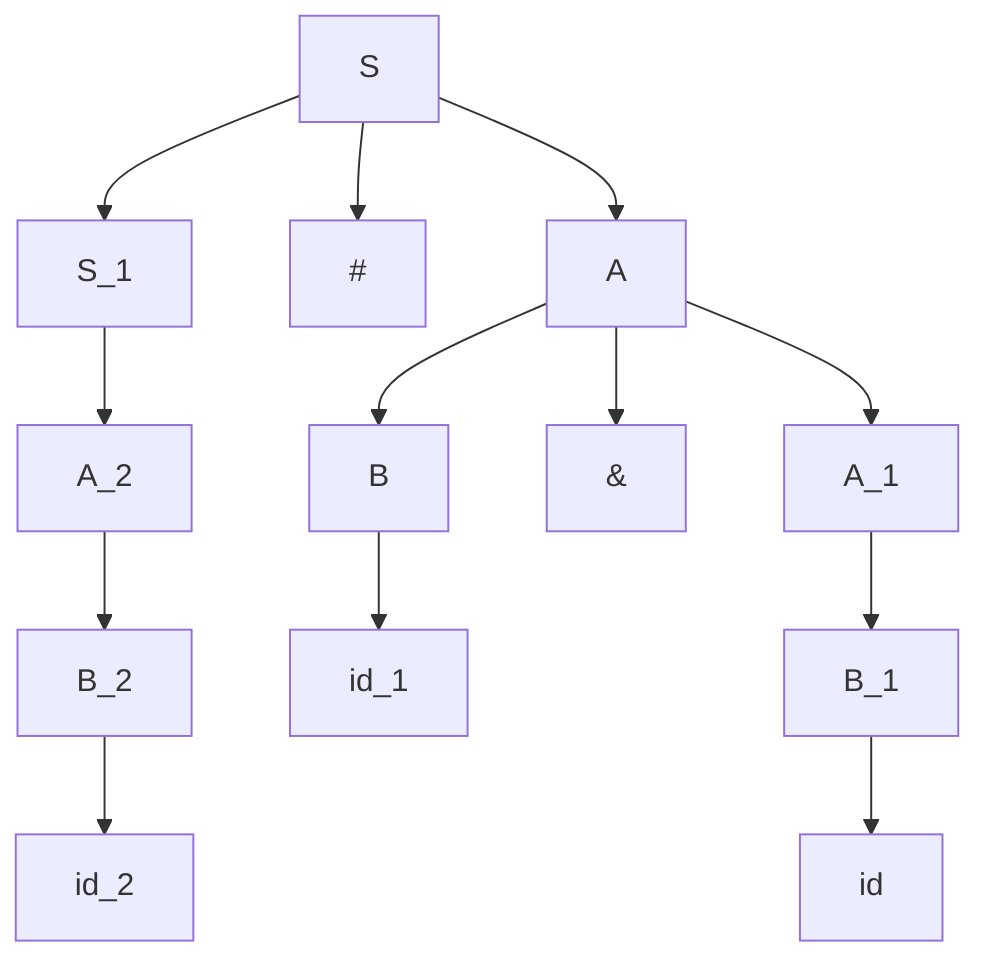
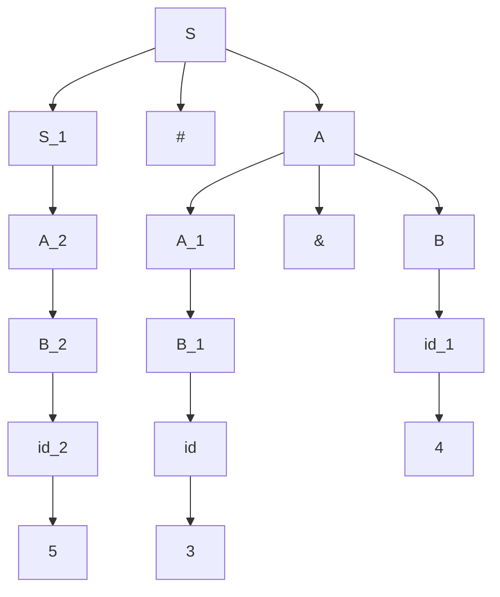
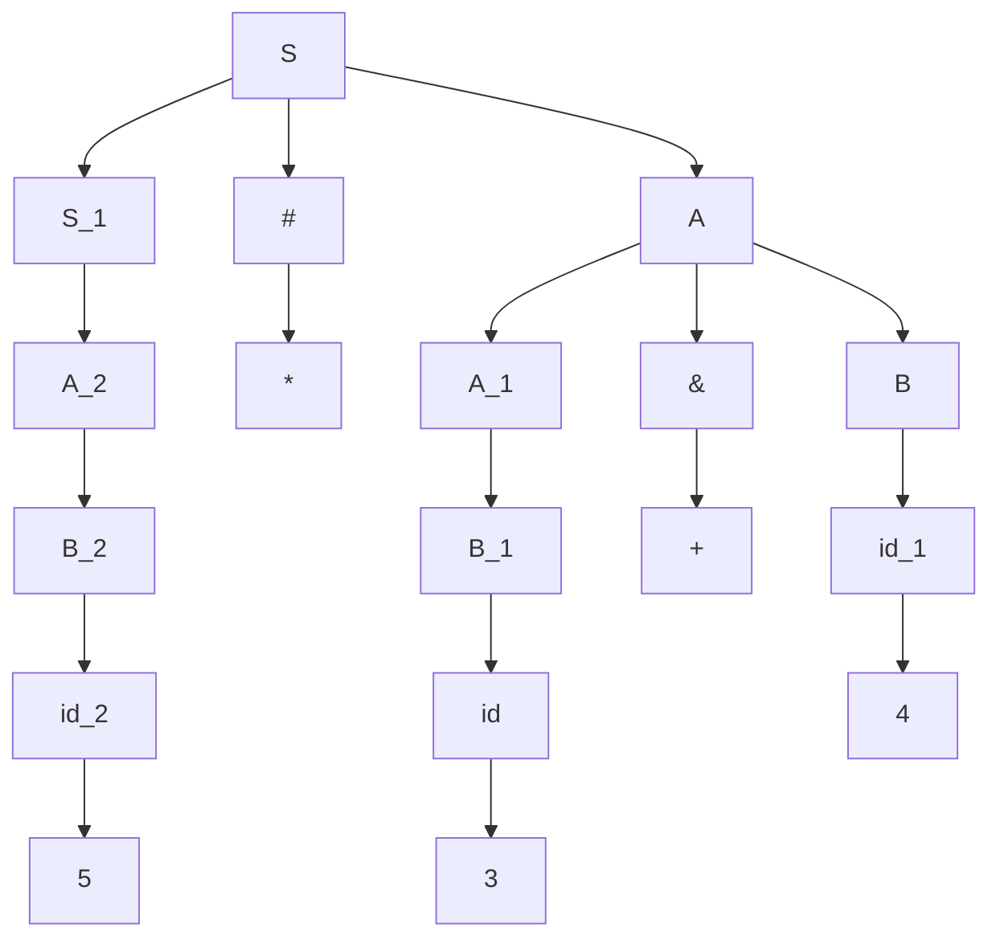
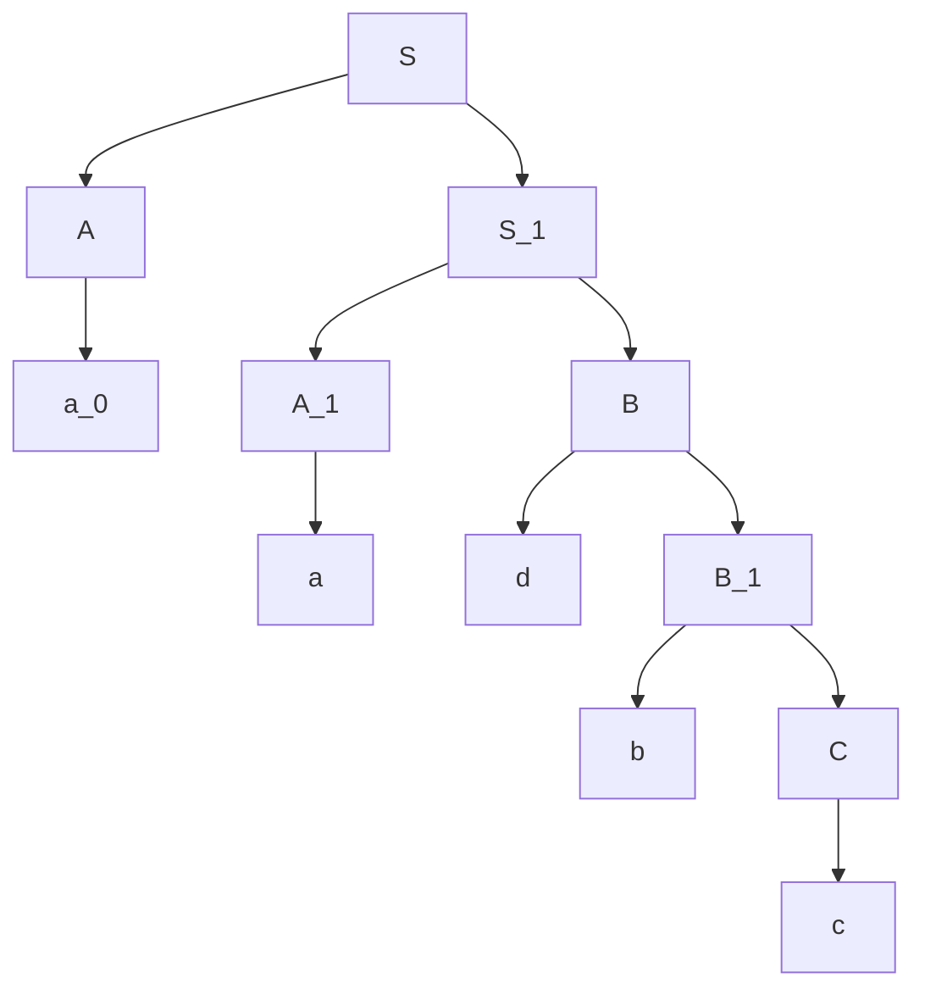

---
{"dg-publish":true,"permalink":"/compiler-design/module-4-syntax-directed-translation/","title":"Syntax Directed Translation -- Compiler Design","tags":["Semester-5"],"created":"2025-03-06T18:33:20.263+05:30"}
---


---
# Index

- [[#1. Syntax Directed Definitions (SDDs)]]
- [[#2. Construction of a Syntax Tree and parsing an SDD.]]
- [[#3. How to evaluate an arithmetic expression using SDT.]]
- [[#4. S-attributed definitions vs L-attributed definitions]]
- [[#5. Bottom-Up Evaluation of Inherited Attributes]]
- [[#6. Bottom-up Evaluation of S-attributed SDT]]
---
# 1. Syntax Directed Definitions (SDDs)

**Definition**: ==Syntax Directed Definitions (SDDs) provide a way to associate semantic information with the syntactic structures of a language, effectively combining syntax and semantics==. An SDD consists of a context-free grammar along with semantic rules that specify how to compute attributes for the non-terminals in the grammar.

https://www.youtube.com/watch?v=_CloXDbYAAg&list=PLxCzCOWd7aiEKtKSIHYusizkESC42diyc&index=17
#### Components of SDDs:

1. **Grammar**:
    
    - A set of production rules that define the syntax of a language.
    - Each non-terminal in the grammar is associated with attributes that can be synthesized or inherited.
2. **Attributes**:
    
    - **Syntactic Attributes**: Derived from the structure of the syntax tree.
    - **Semantic Attributes**: Associated with specific meanings or values in the context of the language.
    - Attributes can be **synthesized** (computed from children nodes) or **inherited** (passed down from parent nodes).
3. **Semantic Rules**:
    
    - Rules that define how the attributes of non-terminals are computed.
    - Each production rule may have associated semantic actions that specify how to calculate the attributes when that production is applied.

#### Types of Attributes:

1. **S-attributed Definitions**:
    
    - All attributes are synthesized.
    - Computation occurs in a bottom-up manner, where attributes of a non-terminal are calculated from its children.
2. **L-attributed Definitions**:
    
    - Attributes can be both synthesized and inherited.
    - Allows for more complex computations, where some attributes may depend on values from parent or sibling nodes.


For example :


Here the rule `S -> S # A | A` , has the semantic rule of `S.val = S.val * A.val` 

which means that whatever be the value of `S` and `A`, they will be multiplied and then stored back in `S`.

The rule `A -> A & B | B` , has the semantic rule of  `A.val = A.val + B.val`.

which means that whatever be the value of `A` and `B`, they will be added and then stored back in `A`.

The rule `B -> id` has the semantic rule of `B.val = id.lval`

Here this rule means that the value of `B` will be whatever the **lexical value** of the terminal, `id` is.

To better understand how this works, let's try to parse through an input and get it's actual value.


Let's say we have a given string `5 # 3 & 4`.

We construct the **parse tree** for this grammar.

Note that some of the nodes in this tree will have `_aNumber` in their names to separate them from the other similar nodes, due to how the graph syntax works.



This is our parse tree.

Now we follow the semantic rules to convert it into a **Syntax Tree**.

Since the inputs `5`, `3` and `4` will fit in the terminal `id`, so it's semantic rule `B.value = id.lvalue` will apply to all it's variants as well.

So we apply the inputs to the terminals first.



Now the values will get **back-propagated** up the parse tree.

We apply the semantic rules to the rest of the nodes



So now this is the complete **Syntax Tree** for the given grammar.

Now if we do a readout from the tree, we get:

`5 * 3 + 4`

Now, solving this expression, we need to apply :

### Operator Precedence

- The grammar implicitly gives precedence through the structure of the rules. In this case:
    - The rule `S -> S # A` appears to allow multiplication to take precedence over addition because of how `S` (multiplication) can be evaluated before `A` (addition).
    - When evaluating, you first calculate the result of `3 & 4` (which adds to `7`), and then we multiply that result by `5`.

So, given the way the rules are structured and the semantic evaluations defined, the expression evaluates to **35**:

1. `A.val = 3 + 4 = 7` (from the rule `A -> A & B`)
2. `S.val = 5 * 7 = 35` (from the rule `S -> S # A`)

So the final answer of `5 * 3 + 4` will be `35` (because of **bottom-up** parsing, `A` gets parsed first along with it's semantic, followed by `S` along with it's semantic).

---

# 2. Construction of a Syntax Tree and parsing an SDD.

https://www.youtube.com/watch?v=7wlyOkz61ig&list=PLxCzCOWd7aiEKtKSIHYusizkESC42diyc&index=18

Let's say we have a grammar with given semantic rules:

```mathematica
S -> AS {printf(1)} 1
S -> AB {printf(2)} 2
A -> a {printf(3)}  3
B -> bC {printf(4)} 4
B -> dB {printf(5)} 5
C -> c {printf(6)}  6
```

We number each production from 1 to 6.

Let's say we have an input string "aadbc".

Now this SDD can be parsed in two ways, the top-down or the **bottom-up** approach.

Since we only have the **bottom-up** approach we will proceed with this.

So first, we create the parse tree.



Now we start parsing from the bottom to the top.

The way we do this, is we start with a stack and an output buffer

|     |     |     |     |     |
| --- | --- | --- | --- | --- |

Stack


|     |     |     |     |     |     |     |
| --- | --- | --- | --- | --- | --- | --- |

Output buffer.

Now we got the input string of "aadbc"

So we push `a` on to the stack

| a   |     |     |     |     |
| --- | --- | --- | --- | --- |

Now the parser checks the grammar for possible reductions

`A -> a {printf(3)}` is a valid reduction so the grammar reduces right away, executing the semantic instruction of `printf(3)`

So we push `3` on to the output buffer

And replace `a` with `A` on the stack

| 3   |     |     |     |     |     |     |
| --- | --- | --- | --- | --- | --- | --- |

Proceeding from the input, we push the next character, `a`

| A   | a   |     |     |     |
| --- | --- | --- | --- | --- |

The parser once again checks for possible reductions, and it sees that `a` can be reduced.

So we get another `3` as output.

| 3   | 3   |     |     |     |     |     |
| --- | --- | --- | --- | --- | --- | --- |

We push the next input onto the stack `d`

| A   | A   | d   |     |     |
| --- | --- | --- | --- | --- |

The parser checks for possible reductions

`B -> dB {printf(4)} 4`, in here, it is not yet possible to reduce `B ->dB` since `C` hasn't been parsed from `B -> bC` yet.

So we push the next character and wait till `C` is processed.

| A   | A   | d   | b   |     |
| --- | --- | --- | --- | --- |

The parser cannot reduce `B -> bC` as `C -> c` hasn't been parsed yet.

So we push the next character and see what can be done

| A   | A   | d   | b   | c   |
| --- | --- | --- | --- | --- |

Here the parser sees that `c` can be reduced back to `C -> c`

So it reduces c and executes the semantic instruction of `printf(6)`. So we add `6` to the output buffer and replace `c` with `C` on the stack


| A   | A   | d   | b   | C   |
| --- | --- | --- | --- | --- |

| 3   | 3   | 6   |     |     |     |     |
| --- | --- | --- | --- | --- | --- | --- |

Since `C` has been parsed, now `d` cannot be parsed yet as it depends on 
`B -> bC` to be parsed.

So now `B -> bC` can be reduced completely, executing the semantic instruction of `printf(4)`.

So we replace `b` with `B` on the stack

| A   | A   | d   | B   |     |
| --- | --- | --- | --- | --- |

Now `B -> dB` can be successfully reduced with the instruction of `printf(5)`

And the output buffer becomes

| 3   | 3   | 6   | 4   | 5   |
| --- | --- | --- | --- | --- |

and the stack becomes

| A   | A   | B   |     |     |
| --- | --- | --- | --- | --- |

The parser checks the grammar for possible reductions.

From `S -> AB`, the parser now reduce `AB` back to `S`, with the semantic instruction of `printf(2)`

So the stack now becomes :

| A   | S   |     |     |     |
| --- | --- | --- | --- | --- |

And the output buffer becomes :

| 3   | 3   | 6   | 4   | 5   | 2   |
| --- | --- | --- | --- | --- | --- |

Using `S -> AS` the parser can further reduce `AS` back to `S` with the semantic instruction of `printf(1)`.

So the stack now becomes:

| S   |     |     |     |     |
| --- | --- | --- | --- | --- |

And the output buffer becomes:

| 3   | 3   | 6   | 4   | 5   | 2   | 1   |
| --- | --- | --- | --- | --- | --- | --- |

Looking at the grammar, there are no rules left for parsing `S` itself, so the parser stops parsing.

So, input string `aadbc`. Output : `3364521`.

---
# 3. How to evaluate an arithmetic expression using SDT.

https://www.youtube.com/watch?v=CrLGZlvNvCw&list=PLxCzCOWd7aiEKtKSIHYusizkESC42diyc&index=19&pp=iAQB

Let's say we have a given grammar with semantic instructions

```mathematica
E -> E & T {E.val = E.val * T.val}
E -> T {E.val = T.val}


T -> T @ F {T.val = T.val - F.val}
T -> F {T.val = F.val}

F -> num {F.val = num}
```

And we have an input string of `4 & 8 @ 5 & 7 @ 3`.

So we construct a `parse tree` based on the input we have here.

Keeping in mind `bottom-up` parsing, the parse tree will be somewhat like this.


There is a small mistake in the right side of this tree where it should be `T -> F -> num`, but I guess the guy in the video forgot to write that.

Now to start parsing this, we need as usual, an input buffer, a stack and an output buffer.

We push the first character to the input buffer


| 4   |     |     |
| --- | --- | --- |

Here `num->4`

So we push `num` onto the stack

| num |     |
| --- | --- |

And checking the grammar we see that `F->num {F.val = num.val}`, so `F becomes 4`.

So the parser reduces `num` to `F`

| F   |     |
| --- | --- |

Following the rules, we see `T ->F {T.val = F.val}`, so `T becomes 4`.

So the parser reduces `F` to `T`

| T   |     |
| --- | --- |

Following the rules, we see `E -> T {E.val = T.val}`, so `E becomes 4`.

So the parser reduces `T` to `E`.

| E   |     |
| --- | --- |

Now for this `E` to be reduced to the upper `E`, that can't happen yet as `E -> E & T`, so the other `T` needs to be parsed.

So we push the next symbol on the input buffer.

| 4   | &   |     |
| --- | --- | --- |

Which already matches `E -> &` from `E -> E & T`, but needs to wait for `T` to be parsed. We push `&` onto the stack

| E   | &   |     |
| --- | --- | --- |

So we input the next symbol on the input buffer.

| 4   | &   | 8   |
| --- | --- | --- |

Following the previous rules, we first input `num` on the stack 

| E   | &   | num |
| --- | --- | --- |

And it gets reduced all the way to `T` using previously explained rules

| E   | &   | T   |
| --- | --- | --- |

So the stack becomes

| E   | &   | T   |
| --- | --- | --- |

Now we push the next symbol on the input buffer

| 4   | &   | 8   | @   |
| --- | --- | --- | --- |

So similarly it gets pushed to stack as it's a terminal `@`

| E   | &   | T   | @   |
| --- | --- | --- | --- |

Then we push the next symbol `5` on to the input buffer

| 4   | &   | 8   | @   | 5   |
| --- | --- | --- | --- | --- |

So similarly we push `num` onto the stack

| E   | &   | T   | @   | num |
| --- | --- | --- | --- | --- |

And it gets reduced all the way back to `F`.

| E   | &   | T   | @   | F   |
| --- | --- | --- | --- | --- |

Now the parser can reduce `T @ F` back to `T` with the semantic rules of `T.val = T.val - F.val`

The stack becomes :

| E   | &   | T   |     |     |
| --- | --- | --- | --- | --- |

Now `E & T` are reduced back to `E` with the semantic rules of `E.val = E.val * T.val`

So the output buffer will push `4 * 8 - 5`

| 4   | *   | 8   | -   | 5   |
| --- | --- | --- | --- | --- |

And the stack becomes just 

| E   |     |     |     |     |
| --- | --- | --- | --- | --- |

Now we push the next symbol onto the input buffer `&`.

| 4   | &   | 8   | @   | 5   | &   |
| --- | --- | --- | --- | --- | --- |

This gets pushed to stack as well

| E   | &   |     |     |     |
| --- | --- | --- | --- | --- |

We push the next symbol on the input buffer, `7`

| 4   | &   | 8   | @   | 5   | &   | 7   |
| --- | --- | --- | --- | --- | --- | --- |

So now in similar fashion, we push `num`, which gets reduced all the way back to `T`

| E   | &   | T   |     |     |
| --- | --- | --- | --- | --- |

Now this `T` cannot be reduced back to `T -> T @ F` as the `F` needs to be parsed.

So we push the next symbol `@`, which then gets pushed to stack directly as it's a terminal.

So input buffer:

| 4   | &   | 8   | @   | 5   | &   | 7   | @   |
| --- | --- | --- | --- | --- | --- | --- | --- |

Stack :

| E   | &   | T   | @   |
| --- | --- | --- | --- |

Now we push the next symbol `3` on the input buffer:

| 4   | &   | 8   | @   | 5   | &   | 7   | @   | 3   |
| --- | --- | --- | --- | --- | --- | --- | --- | --- |

And in the stack, in similar fashion, the `num` which corresponds to `3` gets reduced all the way back to `F`.

So the stack becomes :

| E   | &   | T   | @   | F   |
| --- | --- | --- | --- | --- |

Now the entire expression of `T @ F` can be reduced back to `T -> T @ F {T.val = T.val - F.val}` `(7-3)`

So the stack becomes :

| E   | &   | T   |     |     |
| --- | --- | --- | --- | --- |

Now this entire expression of `E & T` can be parsed back to just `E` with the same semantic rules for `E -> E & T` as before

So the stack becomes

| E   |     |     |     |     |
| --- | --- | --- | --- | --- |

And we push on to the output buffer : `* 7 - 3` as the value of `E` is already there.

So final output buffer:

| 4   | *   | 8   | -   | 5   | *   | 7   | -   | 3   |
| --- | --- | --- | --- | --- | --- | --- | --- | --- |

So to solve this expression we apply operator precedence which is defined by the grammar as 

`- > *` in bottom-up parsing

So the solving will be as follows:

`8 - 5 = 3`
`7 - 3 = 4`

So, finally:

`4 * 3 * 4` which will be `12 * 4 = 48`

So input string : `4 & 8 @ 5 & 7 @ 3`
Arithmetic output: `48`.

---
# 4. S-attributed definitions vs L-attributed definitions

https://www.youtube.com/watch?v=w03voSY4REs&list=PLxCzCOWd7aiEKtKSIHYusizkESC42diyc&index=23

Before heading into **S-attributed and L-attributed** definitions we need to understand :

## Synthesized vs Inherited attributes

Let's say that we have a grammar here

```mathematica
A -> XYZW
```
Now in layman's terms, the LHS is considered the **parent** and the RHS is considered as the **child**.

`XYZW` are all **siblings** of each other.

If any **attributes** involve the **parent taking any value from the child**, the attribute is called a **synthesized attribute**.

And if any attributes involve the **child taking any value from the parent**, the attribute is called an **inherited attribute**.

Or if the attribute involves the **child taking any value from it's sibling(other non-terminals)** then it's also called an **inherited attribute**.

---
## Types of SDT

### 1. S-attributed SDT

1. It's based on **synthesized attributes**.
2. Uses **bottom-up parsing**
3. Semantic rules are always written at rightmost position in the RHS.

### 2. L-attributed SDT

1. Based on **both synthesized and inherited attribute**.
2. Uses **top-down parsing**.
3. Semantic rules can be written anywhere in the RHS.
4. The L in L-attributed SDT stands for **Left** in which the grammar can only inherit values from it's siblings on it's **left**.

We can better understand this with examples.

Let's say there are two grammars:

```mathematica
A -> LM {L.i = l(A.i); M.i = m(L.s); A.s = f(M.s)}
A -> QR {R.i = r(A.i); Q.i = q(R.s); A.s = f(Q.s)}
```

So in the semantic rules of the first grammar we see that.

`L.i`, means it's inheriting a value.

So `L.i = l(A.i)`, it's inheriting a value from it's parent `A`.

This means that `L.i = l(A.i)` is an **inherited attribute**.

Similarly `M` is inheriting a value from `L`.

So this means `M.i = m(L.s)` is an **inherited attribute**.

Lastly `A` is taking a value from it's child, `M`.

Since the parent here is taking a value from it's child we can say that `A.s = f(M.s)`**synthesized attribute**.

Here we see that the entire semantic rule is a mix of synthesized an inherited attributes.

The inherited attribute of `M.i = m(L.s)` also follows the rule of `L-attributed SDT`, since it's inheriting the value from it's left sibling, `L`.

So `A -> LM {L.i = l(A.i); M.i = m(L.s); A.s = f(M.s)}` is a **L-attributed SDT**.

Now, from the second grammar: 

```mathematica
A -> QR {R.i = r(A.i); Q.i = q(R.s); A.s = f(Q.s)}
```

We see that `R` inherits a value from it's parent `A`, so `R.i = r(A.i)` is an **inherited attribute**.

Next we see that `Q` inherits a value from it's sibling, `R`. So, `Q.i = q(R.s)` is an **inherited** attribute.

In the final attribute, we see that the parent `A` takes a value from it's child `Q`. So, `A.s = f(Q.s)` is a **synthesized** attribute.

This grammar, has both **inherited** and **synthesized** attributes however the **inherited** attribute, 
`Q.i = q(R.s)` involves `Q` inheriting a value from it's **right** sibling. So this **inherited** attributed does **not** tick the box for a `L-attributed SDT`.

So in all the, grammar :
```mathematica
A -> QR {R.i = r(A.i); Q.i = q(R.s); A.s = f(Q.s)}
```
is **NOT** a **L-attributed SDT**.

---
# 5. Bottom-Up Evaluation of Inherited Attributes

In bottom-up parsing of inherited attributes, the key challenge is to evaluate inherited attributes while building the parse tree bottom-up. To do this, we need to propagate the inherited attributes from the parent or left siblings during reductions. This requires a careful approach since, in bottom-up parsing, we start with the input terminals and reduce them to non-terminals step by step.

### Steps to Evaluate Inherited Attributes in Bottom-Up Parsing

1. **Understand the Structure of the Grammar:** First, you need to identify the grammar and determine which attributes are inherited and which are synthesized.
    
2. **Track Inherited Attributes:** Since inherited attributes are passed from the parent or left sibling, and reductions are performed bottom-up, you need to ensure that inherited attributes are stored and propagated during reductions. This is often managed using **semantic rules** that update inherited attributes during parsing.
    
3. **Apply Semantic Actions:** For each reduction rule in the grammar, you will have to define **semantic actions** that will compute the inherited attributes for the children. These actions are executed when reductions take place.
    
4. **Simulate a Bottom-Up Parsing Process:** When parsing the input string, keep track of both synthesized and inherited attributes for each non-terminal on the stack. The inherited attributes will be passed down from parent non-terminals or left siblings during reductions.

Let's understand this with an example:

```mathematica
S -> A B        { S.val = A.val + B.val }
A -> a          { A.val = f(a) }
B -> b          { B.val = g(b, A.val) }  // B inherits A.val
```

Here we can see that `A` is a **synthesized** attribute, as seen from the second semantic rule.
`B` is an inherited attribute, as it depends on it's left sibling `A`. (given by the last semantic rule).

We simulate bottom-up parsing behaviour by using an input buffer and a stack.

We will work with the terminals `a` and `b`.

So first we push `a` onto the input buffer

| a   |     |     |
| --- | --- | --- |

The parser sees that `a` can be reduced to `A` through `A -> a`.

So the stack becomes:

| A   |     |     |
| --- | --- | --- |

and the semantic rule of `A.val = f(a)` is computed.

Now we shift `b` onto the input buffer.

| a   | b   |     |
| --- | --- | --- |

And the parser sees that `b` can reduced to `B` through `B -> b`.

So the stack becomes :

| A   | B   |     |
| --- | --- | --- |

and the semantic rule of `B.val = g(b, A.val)` is executed, where `B` inherits the value of `A` 

Now the parser sees that `AB` can be reduced to `S` through `S -> AB`.

and the semantic rule of `S.val = A.val + B.val` is executed using values from `A` and `B`, making `S` a **synthesized attribute**.

So the stack becomes:

| S   |     |     |
| --- | --- | --- |

And the **bottom-up evaluation of inherited attributes** is done.

---
# 6. Bottom-up Evaluation of S-attributed SDT

### **S-Attributed SDT (Bottom-Up Parsing)**

Since **S-attributed SDTs** use only synthesized attributes, the attribute values are passed from children to parents during reductions in the parse tree. Here's an example:

```mathematica
E -> E + T   { E.val = E.val + T.val }
E -> T       { E.val = T.val }
T -> T * F   { T.val = T.val * F.val }
T -> F       { T.val = F.val }
F -> ( E )   { F.val = E.val }
F -> num     { F.val = num.val }
```

We parse this grammar using bottom-up parsing by ==starting from the terminals== `num` (or the leaf nodes).

#### SDT Description:

- Every non-terminal’s value is synthesized from its children.
- The input string is `3 + 2 * 4`, which means we have `num = 3`, `num = 2`, and `num = 4`.

#### Bottom-Up Parsing Process:

We simulate bottom-up parsing with a stack and input buffer:

Here tables were not used to save some time while making this part.

1. **Shift '3' (num)**:
    
    - Input: `num + num * num`
    - Stack: `num`
    - The parser sees that `num` can be reduced to `F`, so `F.val = num.val = 3`.
2. **Reduce `F -> num`**:
    
    - Stack: `F`
    - `T -> F`: Now `T.val = F.val = 3`.
3. **Reduce `T -> F`**:
    
    - Stack: `T`
    - `E -> T`: Now `E.val = T.val = 3`.
4. **Shift '+'**:
    
    - Stack: `E +`
    - The next terminal is shifted onto the stack.
5. **Shift '2' (num)**:
    
    - Stack: `E + num`
    - The parser sees that `num` can be reduced to `F`, so `F.val = num.val = 2`.
6. **Reduce `F -> num`**:
    
    - Stack: `E + F`
    - `T -> F`: Now `T.val = F.val = 2`.
7. **Reduce `T -> F`**:
    
    - Stack: `E + T`
    - Now the parser has `E + T`, but it doesn’t reduce yet because it’s waiting for the next operator.
8. **Shift '*'**:
    
    - Stack: `E + T *`
    - Shift the operator `*`.
9. **Shift '4' (num)**:
    
    - Stack: `E + T * num`
    - The parser sees that `num` can be reduced to `F`, so `F.val = num.val = 4`.
10. **Reduce `F -> num`**:
    
    - Stack: `E + T * F`
    - `T -> T * F`: Now `T.val = T.val * F.val = 2 * 4 = 8`.
11. **Reduce `T -> T * F`**:
    
    - Stack: `E + T`
    - The parser reduces `T` using `T.val = 8`.
12. **Reduce `E -> E + T`**:
    
    - Stack: `E`
    - `E.val = E.val + T.val = 3 + 8 = 11`.

The final result for this expression is `11`.

---
