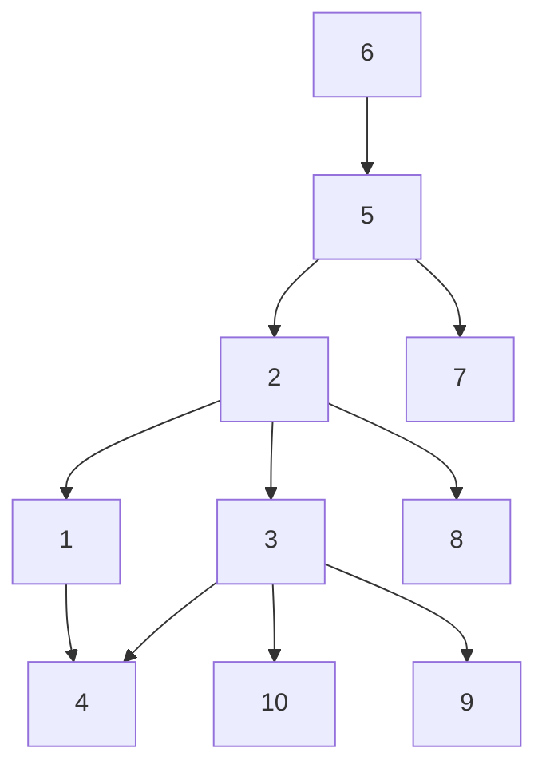

---
{"dg-publish":true,"permalink":"/daa-speedrun/fundamental-algorithmic-strategies-graph-and-tree-algorithms/","title":"Graph and Tree algorithms -- Design and Analysis of Algorithms -- Module 2 and  Module 3","tags":["Semester-4"],"created":"2025-03-06T18:33:20.329+05:30"}
---

---

# Dynamic Programming -- Continued

## Floyd-Warshall Algorithm

The Floyd-Warshall algorithm is used to find the shortest paths between all pairs of vertices in a weighted graph. It's particularly useful for dense graphs and can handle both positive and negative edge weights, but not negative cycles.

#### Simple Explanation

Imagine you have a map of cities connected by roads, and you want to find the shortest path between every pair of cities. The Floyd-Warshall algorithm systematically updates the shortest paths by considering each city as an intermediate point and checks if passing through this city offers a shorter path between two other cities.

#### Steps of the Algorithm

1. **Initialize the Distance Matrix**: Create a matrix `dist` where `dist[i][j]` represents the shortest distance from city `i` to city `j`. Initially, set `dist[i][j]` to the weight of the edge between `i` and `j` if it exists; otherwise, set it to infinity. Set `dist[i][i]` to 0 for all `i`.
    
2. **Update the Distance Matrix**: For each pair of cities `(i, j)`, consider each city `k` as an intermediate point. Update `dist[i][j]` to be the minimum of `dist[i][j]` and `dist[i][k] + dist[k][j]`. This means if passing through `k` offers a shorter path from `i` to `j`, update the shortest path.
    
3. **Repeat for All Cities**: Repeat the update step for all cities `k`.
    

By the end of this process, `dist[i][j]` will contain the shortest distance from city `i` to city `j`.

==Or in simple terms==, observe the below stuff

#### Visual Aid

Imagine a graph with four cities (A, B, C, D) and the following distances between them:

- A to B: 3
- A to C: 10
- B to C: 1
- B to D: 2
- C to D: 4

Here each row, each vertex is considered an **intermediate point**. 

In this case, A sets the distance to itself as 0, and we write the rest of the distances from A to other vertices.

In the second row, B is set as the **intermediate point**. And we do the same for B. Note that from B's perspective the *vertex before it* is *already considered* and thus is set to infinity and not considered anymore.

In the third row, C is set as the **intermediate point**.  And we repeat the same for C.

In the last row, D is set as the **intermediate point**. And we repeat the same for D.

Now we find from the graph that two shortest distances appear when we consider A as an **intermediate point**. 

A to C is previously set as 4 and A to D is set as infinity but now :

In the updated distance matrix, we find shortest distances for the pair of cities *C* and *D* through *A* being an **intermediate point**.

---
# Heuristics

In the context of the design and analysis of algorithms, heuristics refer to strategies or techniques that guide the problem-solving process to find good-enough, practical solutions in a reasonable amount of time. Heuristics do not guarantee the optimal solution but are often employed when traditional methods are too slow or complicated.

### Key Characteristics of Heuristics:

1. **Efficiency**: Heuristics aim to provide a solution more quickly than exhaustive methods, making them useful for large or complex problems.
    
2. **Simplicity**: They often rely on simple rules of thumb or intuitive judgments rather than complex mathematical procedures.
    
3. **Feasibility**: While they may not always find the best solution, they aim to find a satisfactory solution that is good enough for practical purposes.
    
4. **Adaptability**: Heuristics can be modified and adapted to different types of problems and datasets.
    

### Common Types of Heuristics:

1. **Greedy Algorithms**: These make locally optimal choices at each step with the hope of finding a global optimum. For example, the coin change problem where the largest denomination coin is chosen first.
    
2. **Divide and Conquer**: This strategy breaks a problem into smaller subproblems, solves each subproblem individually, and combines their solutions. An example is the merge sort algorithm.
    
3. **Genetic Algorithms**: Inspired by natural selection, these use processes such as mutation, crossover, and selection to evolve solutions to optimization problems over time.

### Applications:

- **Optimization Problems**: Finding the best solution among a set of possible solutions, such as scheduling, routing, and resource allocation problems.
- **Search Problems**: Locating an item or a path in a large dataset or graph, such as in games or AI pathfinding.
- **Machine Learning**: Used in various algorithms to optimize parameters and improve model performance.

### Advantages and Disadvantages:

- **Advantages**:
    
    - Can provide quick and acceptable solutions for complex problems.
    - Often simpler to implement than exact algorithms.
    - Flexible and can be tailored to specific problem domains.
- **Disadvantages**:
    
    - No guarantee of finding the optimal solution.
    - Performance can be highly dependent on the nature of the problem and the quality of the heuristic.
    - May require tuning and experimentation to achieve good results.

Heuristics are valuable tools in algorithm design, particularly when dealing with NP-hard problems where finding exact solutions is computationally infeasible.

---
# Graph Traversal Algorithms.

These algorithms to traverse and search elements in a graph.

There are two graph traversal algorithms under our syllabus:

1. BFS : Breadth First Search
2. DFS: Depth First Search

https://www.youtube.com/watch?v=pcKY4hjDrxk

## 1. Breadth First Search

**Concept**: BFS explores nodes ==level by level==. It starts at the root (or any arbitrary node) and explores all its neighbors at the present depth before moving on to nodes at the next depth level.

**Algorithm**:

1. Start at the root node and enqueue it.
2. Dequeue a node from the queue, mark it as visited, and enqueue all its unvisited neighbors.
3. Repeat step 2 until the queue is empty.

For example, in this graph, a possible BFS result could be:

So the main rules in BFS are :

1. You can start exploration from ==any vertex==.
2. While exploring a vertex can visit ==the adjacent vertices== in any order.
3. While exploring a vertex, you ==must visit all it's adjacent vertices== before exploring the next vertex.
4. You should select the next vertex from a ==queue== only.
5. As soon as you start exploring a vertex, it needs to be pushed onto the queue.
6. Do this till all the vertices are visited.

More viable BFS results would be :

## 2. Depth First Search

**Concept**: DFS explores as far as possible along each branch before backtracking. It uses a stack/queue (or recursion) to keep track of the path.

It is similar to pre-order traversal.

The rules of DFS are :

1.  You can start exploration from ==any vertex==.
2. Once you start exploring a vertex, push it to the queue then visit the next adjacent vertices in a sequential manner.
3. In case there is another adjacent vertex on the other side of the currently explored vertex, you need to traverse back to it and then visit the other vertex.
4. Do this till all the vertices are visited.

More valid DFS results :

For the graph 

### Conclusion

- **BFS** is good for finding the shortest path in an unweighted graph.
- **DFS** is useful for pathfinding and topological sorting in a graph.

---
# Topological sorting

https://www.youtube.com/watch?v=7J3GadLzydI

Topological sorting is a linear ordering of vertices in a directed acyclic graph (DAG) such that for every directed edge $uv$ from vertex $u$ to vertex $v$, $u$ comes before $v$ in the ordering. It is used in scenarios where certain tasks must be performed before others, like course prerequisite structures, task scheduling, etc.

### Simple Explanation

1. **Directed Acyclic Graph (DAG)**: A graph with directed edges and no cycles.
2. **Vertices and Edges**: Vertices (nodes) represent tasks, and directed edges (arrows) represent dependencies.
3. **Linear Ordering**: Arrange the tasks such that every task comes before all tasks that depend on it.
### Steps to Perform Topological Sort

1. **Identify vertices with no incoming edges (in-degree of 0)**: These vertices have no dependencies.
2. **Remove these vertices and their outgoing edges from the graph**.
3. **Add the removed vertices to the topological order**.
4. **Repeat until all vertices are processed**.

Let's say we have this graph right here

We will apply DFS to it to reach all the leaf nodes/ last children one by one and push the nodes into a queue.

As soon we reached I, it was added to the queue, then we explored J and then K, being the leaf node was added to the queue, followed by J as the next child had already been explored.

or in another simple example :

---

