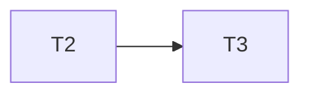
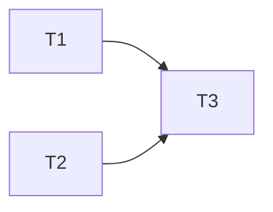
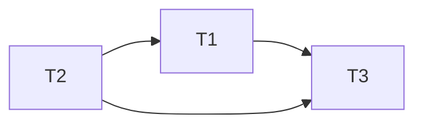
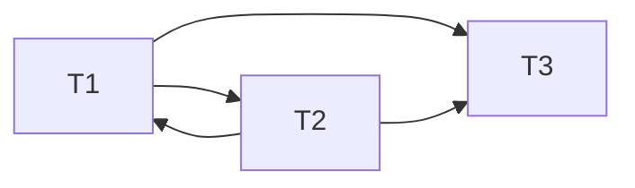

---
{"dg-publish":true,"permalink":"/dbms/dbms-organizer-questions-module-1-2-4/","title":"Important Organizer Questions for DBMS","tags":["DBMS","Semester-6"],"created":"2025-05-26T00:24:50.773+05:30"}
---

---
# Read this before you start.

This PDF contains all the important questions pulled together by deep research on the organizer PDF by the 3 different AI agents. Probably the best idea I have ever had in the last few semesters.

To jump to the very important questions, just press `CTRL + F` and type "#important". That will lead you to the most important questions, one at a time.

To jump to each question image by image, just press `CTRL + F` and type "#image". That will lead you to each question image by image.

Godspeed to whoever is reading this.

---
# Index

1. [[#Modules priority list]]
2. [[#What is metadata (or data dictionary)? `[WBUT 2007, 2010, 2017]` (Short Answer; Page 12)]]
3. [[#Questions on Relational Algebra/Calculus]]
4. [[#Questions on Normalization / Armstrong’s Axioms / Dependencies]]
5. [[#Armstrong's axioms Inference rules]]
6. [[#Questions on Equivalence of Functional Dependency / Closure / Lossless and dependency preserving decomposition]]
7. [[#Questions on Transactions / Serializability / Concurrency Control Protocols]]
8. [[#Questions on Deadlock Detection, Prevention & Handling]]
9. [[#Questions on Query Optimization / Database Recovery]]

---
# Modules priority list:

|Rank|Topic|Syllabus Unit|Importance|
|---|---|---|---|
|1|Relational Database Design & Normalization|Unit 2|Very High|
|2|Transaction Processing & Concurrency|Unit 4|Very High|
|3|Relational Query Languages (SQL, Algebra)|Unit 2|High|
|4|DB System Architecture & Data Independence|Unit 1|High|
|5|Storage Strategies & Indexing|Unit 3|Medium-High|
|6|Database Security|Unit 5|Medium|
|7|Data Models (ER, etc.)|Unit 1|Medium|
|8|Integrity Constraints|Unit 1|Medium-Low|
|9|DBA Roles & Metadata|Unit 1|Low|

---
# What is metadata (or data dictionary)? `[WBUT 2007, 2010, 2017]` (Short Answer; Page 12)

In simple terms, metadata is defined as the data which provides information about other data.

Think about every file you access on the internet, every file you download, every message you send, every message you receive, they all have some "metadata" in them, which tells the respective application about the file -- what type is it, what's it's length, what are it's contents etc.


---
# What are the main functions of a database manager? List five major functions of a Database Administrator (DBA). `[WBUT 2006]` (Short Answer; Page 3)


#image

Yeah, I'm not gonna rephrase this one.

What I will do, however is paste the stuff here for easier access.


---
# Define physical data independence and logical data independence. `[WBUT 2015]` (Short Answer; Page 9)

**Logical Data Independence:**
    
- **Concept:**  
        ==Changes at the conceptual level (like altering the table structure or adding a new column) do not affect the external views.==
        
- **Example:**  
        Imagine a student table that originally shows only Name and Age. If a new column (Mobile Number) is added for certain users, those who aren’t meant to see it continue to view just the original two columns, because the view (external schema) is kept independent.
        
- **How It’s Achieved:**  
        Through the use of views (virtual tables), the DBMS can present a consistent interface to users even if the underlying logical design changes.
        
- **Physical Data Independence:**
    
    - **Concept:**  
        ==Changes at the physical level (like moving files to a different disk or changing the indexing method) do not affect the conceptual schema==.
        
    - **Example:**  
        If a database is moved from one hard disk to another or if the DBMS changes the file structure for performance improvements, the structure of the tables and relationships as defined in the conceptual schema remains unchanged.
        
    - **Benefit:**  
        Applications and users continue to access data normally, without any disruption, because the logical view they work with is not affected by physical alterations.

---
Page 46:


#image

The answer to this is pretty easy but often doesn't come off the top of one's head.


---

Page 45:


#image

Also answers:

Page 43-44:


#important  #image

A **trigger** ==is a special type of stored procedure that **automatically executes (or "fires")** when a specific event occurs in the database==. ==These events are usually DML (Data Manipulation Language) operations==: `INSERT`, `UPDATE`, or `DELETE` on a specified table.

Think of it like this:

- You tell the database: "If _this_ happens (e.g., a new order is placed), then automatically do _that_ (e.g., update inventory levels)."
- It's a way to enforce complex business rules or maintain data integrity that simple constraints (like `NOT NULL` or `FOREIGN KEY`) can't handle alone.

**Analogy:**

Imagine a smart vending machine.

- **Event:** Someone inserts money and selects a drink.
- **Trigger:** This event "fires" a hidden mechanism.
- **Action:** The machine automatically dispenses the drink and deducts the price from the internal cash counter.

In a database, the "event" is a change to a table, and the "action" is a set of SQL statements defined in the trigger.

---
### **Key Components of a Trigger:**

==Just get a basic understanding. No need of memorization==.

1. **Event (When it fires):**
    
    - `INSERT`: When new rows are added to a table.
      
    - `UPDATE`: When existing rows in a table are modified. You can even specify `ON COLUMN` (e.g., `ON UPDATE OF Quantity`) to fire only when a specific column is updated.
      
    - `DELETE`: When rows are removed from a table.
      
2. **Timing (When exactly it fires relative to the event):**
    
    - **`BEFORE`**: The trigger fires _before_ the actual DML operation (INSERT/UPDATE/DELETE) is performed. This is useful for validation or modifying data _before_ it's written.
      
    - **`AFTER`**: The trigger fires _after_ the DML operation is completed. This is common for logging, auditing, or updating related tables.
      
3. **Level (How often it fires):**
    
    - **`FOR EACH ROW` (Row-level trigger):** The trigger body executes once for _each row_ affected by the DML operation. This is the most common type. If you update 10 rows, the trigger fires 10 times.
      
    - **`FOR EACH STATEMENT` (Statement-level trigger):** The trigger body executes only _once_ per DML statement, regardless of how many rows are affected. If you update 10 rows with one `UPDATE` statement, the trigger fires only once. (Some database systems, like Oracle, differentiate this more clearly; others, like MySQL, are primarily row-level by default).
      
4. **Condition (Optional):**
    
    - You can include a `WHEN` clause to specify a condition that must be true for the trigger to fire. For example, `WHEN (NEW.Quantity < OLD.Quantity)`.
      
5. **Trigger Body (What it does):**
    
    - This is the SQL code that gets executed when the trigger fires. It can contain `INSERT`, `UPDATE`, `DELETE` statements, procedure calls, error handling, etc.
      
    - Inside the trigger body, you often have access to special "transition" tables or pseudo-records that represent the data _before_ the change (`OLD` values) and _after_ the change (`NEW` values). The exact syntax varies by database system (e.g., `OLD.column_name`, `NEW.column_name` in MySQL/PostgreSQL; `:OLD.column_name`, `:NEW.column_name` in Oracle).

---
### **Why are Triggers Important? (Advantages):**

- **Enforcing Complex Business Rules:** ==They can enforce rules that cannot be handled by standard constraints==. E.g., "An employee's salary cannot be more than twice their manager's salary."
  
- **Maintaining Data Consistency and Integrity:** ==Automatically update related data==. E.g., when an item is sold, automatically reduce its quantity in the `Inventory` table.
  
- **Auditing and Logging:** ==Record changes to important data==. E.g., log who changed what, when, and from what value to what value.
  
- **Security:** ==Implement custom security logic==, like restricting operations based on time of day or user roles.
  
- **Replication and Synchronization:** ==Automatically propagate changes to other tables or databases==.
  
- **Centralized Logic:** ==Business logic can be stored and managed within the database itself, ensuring it's applied consistently regardless of which application performs the DML operation==.

---
### Disadvantages/Considerations:

- **Hidden Logic:** Triggers run automatically and invisibly to the application. This can make debugging difficult if you don't know they exist or what they do.
  
- **Complexity:** Overuse of triggers can make the database schema complex and hard to understand or maintain.
  
- **Performance Overhead:** Triggers add overhead to DML operations. If not well-written, they can significantly slow down your database.
  
- **Circular References:** Care must be taken to avoid triggers firing other triggers in an infinite loop.
  
- **Portability:** Trigger syntax can vary more significantly between different SQL database systems (MySQL, PostgreSQL, Oracle, SQL Server) compared to standard SQL queries.

---

These were some of the very basic stuff, now questions by particular topic:

---
# Questions on Relational Algebra/Calculus


#image

It will be option a:

$$\sigma_{balance \ \gt \ 1000}(Deposit)$$

---


#image

Answer : `Projection`

---


#important  #image

Let's write the two schemas as follows:

$M = {Material-Master}(\text{item-id, item-name, reorder-level)}$

 $D = Material-Dts(item-id, Supplier-id, Pharchase-date, Qty, Utcost$


 (i): 
 
 $\pi_{Qty}(\sigma_{M.item-id \ = \ D.item-id} \ (M \ \times \  D))$
 
Notice how we didn't directly use the **bowtie** $\bowtie$ operator which signifies a natural join and rather used the old school way of select(condition) + cartesian product.

(ii): 

Since in relational algebra there are some methods called "aggregate methods", not present, for simplicity purposes we will use them here.

$$\pi_{item-name}(\sigma_{M.item-id \ = \ D.item-id} \ \wedge \ \max(Qty) (M \ \times \ D))$$

where as you can guess, the $\max()$ is an aggregate (or `built-in`) method in SQL to find out the maximum of a given column.

(iii): 

Typically we would, in SQL, use UPATE with a condition to solve this.

In relational algebra however it is done this way:

$$\pi_{item-id, \ item-name, \ reorder-level \ \leftarrow \ "UPS"}(\sigma_{item-name \ = \ "power \ supply"}(M))$$

Note that we are selecting every part of the $M$ schema in the project operator, not just the item's name.

Why?

Since relational algebra is _theoretical_. (Like how Oppenheimer was). When are writing a relational algebra query, especially when it's time to alter stuff, 
we are creating a new schema which would theoretically show the entire output as expected when we run it's practical SQL equivalent.

For a better explanation,

Imagine `Material_Master (M)` looks like this:

|item_id|item_name|reorder_level|
|---|---|---|
|101|power supply|50|
|102|monitor|20|
|103|keyboard|30|
|104|power supply|40|

This part is perfectly alright:

$\sigma_{item-name \ = \ "power \ supply"}(M)$

It will return

|item_id|item_name|reorder_level|
|---|---|---|
|101|power supply|50|
|104|power supply|40|

If I did only  $\pi_{item-name \ \leftarrow \ "UPS"}$

This would only return a modified in-memory, non-committed (like my crush who rejected me) table like this:

| item_name |
| --------- |
| UPS       |
| UPS       |

which is not the output we would really want to see if we wrote an SQL query like:

```sql
UPDATE material_master SET item_name = "UPS" WHERE item_name = "power supply";
```

We would **want to see the rest of columns as well**.

This is why in the query we need to **project all the attributes**. (also called a general projection).

---
Page 49:


#image


Let's first define all the three schemas as single letters for easy work:

$$H \ = \ \set{Hotel-No, \ Hotel \ Name \ Address}$$

$$R \ = \ \set{Room-No, \ Hotel-No, \ Type, \ Price-pn}$$
(`price_pn` stands for "price per night")

$$B \ = \ \set{Hotel-No, \ Guest-No, \ Date \ From, \ Date \ To, \ Room \ No}$$

$$G \ = \ \set{Guest-No, \ Guest \ Name, \ Guest \ Address}$$

Now, for question (i):


$$\sigma_{Address \ = \ "Kolkata"}(Hotel)$$

----


$$\pi_{Room-No}(\sigma_{Type \ = \ "Single" \ \wedge \ Price-pn \ = \ "1000"}(Room))$$

---


#important

Now, this is indeed a tricky one.

Here are all the schemas again:


What we are asked to do, requires fetching values from 3 different schemas.

And joins work only on two tables at a time.

So let's focus on this part of the question first:

"all the guests who are going to stay from 25th December to 1st January".

This one's easy.

$$\sigma_{\set{B.Guest-No \ = \ G.Guest-No}} \ \wedge \ Date \ From=2512 \ \wedge \ Date \ To=0101(B \ \times \ G)$$

So, that part of the query is down.

Now we need to display this as a separate schema


$$\pi_{Booking \ Guests \ \leftarrow \ (\sigma_{\set{B.Guest-No \ = \ G.Guest-No}} \ \wedge \ Date \ From=2512 \ \wedge \ Date \ To=0101(B \ \times \ G)}$$

The properties of the schema(or table) would be:

$$BG \ = \ \set{Hotel-No, \ Guest-No, Guest \ Name, \ Guest \ Addres, \ Date \ From, \ Date \ To, \ Room \ No}$$

This table will already have all the names of guests who are going to stay from December 12th to January 1st.

Since it's a join between Booking and Guests.

Now for this part of the query: "List the name of all guests who are going to stay at the ITC Hotel...",

We will join this newly formed schema with the Hotel schema.

So the final query would be:

$$\pi_{Guest-Name}(\sigma_{\set{H.Hotel-No \ = \ BG.Hotel-No} \ \wedge \ Hotel \ Name \ = \ "ITC \ Hotel"}(H \ \times \ BG))$$

And this query will return all the guests name from ITC hotel who are going to stay from December 12th to January 1st.

And there you have it folks.

The lazy asses wrote it this way, saving a lot of explanation but it does the same thing.


---


Again, solved with a simple natural join.

$$\pi_{\set{Hotel-No, \ Room-No, \ Price-pn, \ Type}}(\sigma_{\set{Hotel.Hotel-No \ = \ Room.Hotel-No \ \wedge \ Hotel \ Name \ = \ "Grand \ Hotel"}}(H \ \times \ R))$$

Which should theoretically result in a table like:

| Hotel No | Room No | Price | Type |
| -------- | ------- | ----- | ---- |
|          |         |       |      |

Which is more than enough for a good amount of information.

---
Page 27:


#image

Let's understand first the difference between **entity integrity** and **referential integrity**.

## 1. Entity integrity

Entity Integrity is a rule that says **the primary key of a table cannot have NULL (empty) values.** Also, every row in a table must have a unique primary key value.

**Analogy:** Imagine your school has a rule that every student _must_ have a unique student ID number, and that ID number can never be left blank. If someone tries to enroll a student without an ID, or with an ID that's already taken, the system won't allow it.

**Why it's important:**

- **Unique Identification:** The primary key is how you uniquely identify each individual record (entity) in a table. If it's NULL, you can't tell that record apart. If it's not unique, you might confuse one record for another.
  
- **Reliable Relationships:** Other tables often link to this table using its primary key (via foreign keys). If the primary key isn't solid, those links break, and your database becomes inconsistent.
  
- **Data Accuracy:** It ensures that every entity (e.g., every material, every customer) represented in the table is properly and uniquely identified, preventing duplicate or ambiguous entries.
  
- **Foundation for Other Integrity Rules:** Referential integrity (explained next) relies entirely on entity integrity being enforced.

---
## 2. Referential integrity

Referential Integrity is a rule that says **if a foreign key exists in one table, its values must match the primary key values in the table it refers to, OR the foreign key value can be NULL.** (The "can be NULL" part depends on whether the foreign key is optional or mandatory).

**Analogy:** Think about a library. You have a `Books` table (with `BookID` as primary key) and a `Borrowings` table (with `BookID` as a foreign key). Referential integrity ensures that you can't record a borrowing for a `BookID` that doesn't actually exist in the `Books` table. It's like saying, "You can only borrow a book that the library actually owns."

**Why it's important:**

- **Maintaining Relationships:** This is the glue that holds related tables together. It ensures that links between tables are valid and meaningful.
  
- **Preventing Orphan Records:** It stops you from having "orphan" records in the "child" table (the one with the foreign key) that refer to non-existent records in the "parent" table (the one with the primary key). For example, a purchase detail for a material that doesn't exist in `Material_Master`.
  
- **Data Consistency:** It prevents inconsistent data. If you delete a material from `Material_Master`, referential integrity rules can ensure that dependent purchase details are also handled (e.g., deleted, set to NULL, or the deletion is prevented).
  
- **Accurate Queries:** When you join tables, you rely on these relationships. Referential integrity ensures that joins produce correct and meaningful results

---
### **Overall Importance in a Database (Summary):**

Both Entity Integrity and Referential Integrity are fundamental for ensuring the **quality, reliability, and consistency of data** in a relational database.

- Without **Entity Integrity**, your individual records are ambiguous, making it impossible to uniquely identify them or to link to them reliably.
- Without **Referential Integrity**, the relationships _between_ your tables break down, leading to "dangling pointers" and inconsistent data, making your database unusable for accurate querying and analysis.

---
Page 28:

#important


#image

>Quick Recap: What's a Cartesian Product?

It's a relational algebra operator, that, when used between two tables, returns a **product of each row with each column** of the two tables.

Example:


Cartesian Product will map each row of Depositor to each column of Borrower

$$(Depositor) \ \times \ (Borrower)$$


So output will be:


---
## Why is a Cartesian Product disadvantageous by itself?

Let's say we took another two tables:

Let `TableA` have `3 rows` and `TableB` have `4 rows`. The Cartesian Product `TableA x TableB` will result in `3 * 4 = 12 rows`.

If `TableA` is `(ID, Name)`:

|ID|Name|
|---|---|
|1|Alice|
|2|Bob|

And `TableB` is `(OrderID, Product)`:

|OrderID|Product|
|---|---|
|101|Pen|
|102|Book|

`TableA x TableB` would be:

| ID  | Name  | OrderID | Product |
| --- | ----- | ------- | ------- |
| 1   | Alice | 101     | Pen     |
| 1   | Alice | 102     | Book    |
| 2   | Bob   | 101     | Pen     |
| 2   | Bob   | 102     | Book    |

The main disadvantage of the Cartesian Product is that **it often produces a lot of meaningless or irrelevant data (tuples).**

**Analogy:** Imagine you have a list of `Students` and a separate list of `Courses`. If you take the Cartesian Product of `Students` and `Courses`, you'll get _every student paired with every single course_, regardless of whether that student is actually enrolled in that course.

- **Explosion of Data:** If you have `N` rows in one table and `M` rows in another, the result has `N * M` rows. ==This can become extremely large very quickly, even for moderately sized tables, potentially crashing systems or taking immense time to process==.
  
- **Meaningless Combinations:** ==Most of the resulting rows are likely not actual, valid relationships==. In our example above, Alice didn't necessarily order both a Pen and a Book, and Bob didn't either. The rows `(1, Alice, 102, Book)` and `(2, Bob, 101, Pen)` etc., are just combinations, not necessarily factual data. They don't represent a real-world connection unless _every_ student bought _every_ product.
  
- **Performance Impact:** ==Due to the massive number of rows generated, it's very inefficient in terms of processing time and memory usage==.

---
## How to recover from the disadvantage from the usage of Cartesian Product?

You "recover" from the disadvantage of a Cartesian Product by **filtering it down to meaningful data using a JOIN condition.**

The most common way to recover is to apply a **Selection (σ)** condition _after_ the Cartesian Product, which effectively turns it into a **Theta Join** or, more commonly, a **Natural Join**.

**Analogy:** Going back to the `Students` and `Courses` example. The Cartesian Product gives you _every student with every course_. To "recover," you would then apply a filter like "only show me the rows where the `StudentID` in the `Students` table matches the `StudentID` in the `Enrollment` table (which links students to courses)."

**In Relational Algebra:**

Instead of just R1​×R2​, you typically want a **Join** operation.

The **Theta Join** is defined as a Cartesian Product followed by a Selection: R1​⋈condition​R2​≡σcondition​(R1​×R2​)

The most common type of Theta Join is the **Equi-Join**, where the condition is an equality (e.g., `TableA.ID = TableB.FK_ID`).

The **Natural Join (⋈)** is even more specific. It automatically performs an Equi-Join on all common attributes between two tables and then removes duplicate columns.

---

**Example of Recovery using Join:**

To get meaningful data from our `TableA` and `TableB` example, you'd usually have a foreign key in `TableB` that links to `TableA` (e.g., `TableB.CustomerID` linking to `TableA.ID`).

Let's assume `TableB` was actually `(OrderID, CustomerID, Product)`:

`TableA (ID, Name)`

|ID|Name|
|---|---|
|1|Alice|
|2|Bob|

`TableB (OrderID, CustomerID, Product)`

|OrderID|CustomerID|Product|
|---|---|---|
|101|1|Pen|
|102|2|Book|
|103|1|Mug|

To find out what each customer ordered, you'd use a Join:

`TableA ⋈_{A.ID = B.CustomerID} TableB` (Equi-Join) or `TableA ⋈ TableB` (if `ID` and `CustomerID` were named identically, e.g., both `CustomerID`, for a Natural Join)

Result of Join:

|ID|Name|OrderID|CustomerID|Product|
|---|---|---|---|---|
|1|Alice|101|1|Pen|
|1|Alice|103|1|Mug|
|2|Bob|102|2|Book|

This shows only the _meaningful_ combinations where a customer actually placed an order.

---
# Questions on Normalization / Armstrong’s Axioms / Dependencies


#important  #image

This explanation also answers:
## When do we call a relation to be in Third Normal Form (3NF)? `[WBUT 2013]` (Short Answer; Page 77)

## Compare Third Normal Form (3NF) and Boyce–Codd Normal Form (BCNF) with example. `[WBUT 2012]` (Long Answer; Page 60)

## Explain with example: “BCNF is stricter than 3NF”. `[WBUT 2015]` (Short Answer; Page 57)

Page 69:


#image

Page 70:


#image

Yeah we don't have to do till 5NF. We only got till BCNF in the syllabus.

But just this once I will still include the 4NF and 5NF for extra context.

---

Starting with 1NF:
## 1NF (First Normal Form)

All the attributes in the table must be **single-valued** (or atomic).

For example, we can't have:

| student_id | name  | phone_numbers      |
| ---------- | ----- | ------------------ |
| 1          | Alice | 123-4567, 234-5678 |
| 2          | Bob   | 345-6789           |

as **1NF**.

For 1NF, things should be like this:


| student_id | name  | phone_number |
| ---------- | ----- | ------------ |
| 1          | Alice | 123-4567     |
| 1          | Alice | 234-5678     |
| 2          | Bob   | 345-6789     |

See the difference? Good. No? Maybe get your eyes checked.

---
## 2NF (Second Normal Form)

Requirements: The table **MUST BE** in 1NF.

And now the gist:

**All the non-prime functional dependencies should be dependent on on the entire primary key/candidate key, not just parts of it**.

I will try to keep this explanation as easy and minimal as possible:

|student_id|course_id|student_name|course_name|
|---|---|---|---|
|1|101|Alice|Math|
|1|102|Alice|History|
|2|101|Bob|Math|

Say we have this table, and we have the functional dependencies as:

`student_id -> student_name`
`course_id -> course_name`

>Quick recap:  A functional dependency (FD) means how to attributes (fields) of a table are semantically (logically) linked to each other.

And using the process of closure (https://www.youtube.com/watch?v=bSdvM_0hzgc&list=PLxCzCOWd7aiFAN6I8CuViBuCdJgiOkT2Y&index=23) (or refer to my DBMS module 2 notes, I picked the same example),

We found out the candidate key to be:

`{student_id, course_id}` 

Now the non-prime attributes are the ones which are not in the candidate key.

So the non-prime attributes are: `student_name, course_name`.

Now from the given FDs, we will try to find the **partial dependencies**.

>A partial dependency occurs when a non-prime attribute is subset of only a part of the primary/candidate key, not the whole itself.

`student_id -> student_name`
`course_id -> course_name`

We see that `student_name` is not dependent on `course_id`, only on `student_id`.

`course_name` is not dependent on `student_id`, only on `course_id`.

So we have the two partial dependencies. 

>To convert to 2NF we will **split(or decompose) the original** table based on the partial dependencies.

One table will be the candidate key itself:

**Course Enrollment Table:**

|student_id|course_id|
|---|---|
|1|101|
|1|102|
|2|101|

And the other partial dependency tables:

**Student Table:**

|student_id|student_name|
|---|---|
|1|Alice|
|2|Bob|

**Course Table:**

|course_id|course_name|
|---|---|
|101|Math|
|102|History|

Now this in 2NF because in each of the decomposed tables, 

`student_id` is a primary key. And `student_name` is fully dependent on the primary key.

`course_id` is a primary key. And `course_name` is fully dependent on the primary key.

`student_id` is a primary key. And `course_id` is fully dependent on the primary key and itself is a foreign to key to the third table.

This satisfies 2NF.

---
## 3NF (Third Normal Form)

3NF is even more stricter than 2NF.

It requires that:

The schemas **MUST BE** in 2NF.

And :

There are **no transitive dependencies** for non-prime attributes.

>Quick recap:  A transitive dependency exists when a non-key attribute depends on another non-key attribute rather than directly on the primary key.

Or, in more simple English,

If $A \ \rightarrow \ B$ (A derives B) and $B \ \rightarrow \ C$  (B derives C) then by law of transitivity (an armstrong axiom) :

$A \ \rightarrow C$ (A derives C). 

It's like having a mutual friend, which is B in this case, so it makes A and C friends as well, via their mutual friend B.

In the case of transitive dependencies in non-prime attributes, we can spot them if:

`candidate key part 1 -> candidate key part 2-> a non prime attribute`

or 

`primary key -> foreign key -> a non prime attribute`.

So considering our example here:

**Course Enrollment Table:**

|student_id|course_id|
|---|---|
|1|101|
|1|102|
|2|101|

And the other partial dependency tables:

**Student Table:**

|student_id|student_name|
|---|---|
|1|Alice|
|2|Bob|

**Course Table:**

|course_id|course_name|
|---|---|
|101|Math|
|102|History|

We have the functional dependencies:

`student_id <-> course_id` (the candidate key)
`course_id -> course_name`
`student_id -> student_name`

For the non-prime attributes `course_name` and `student_name`.

There are no direct links between these two, and no transitive links as well since we can't reach `student_name` from `course_id` via `course_name` and the same goes for the other way as well.

**IT MIGHT LOOK LIKE** there is a transitive dependency that goes like this:

`student_id -> course_id -> course_name`.

But it looks like that when we write all the FDs together like this:

`student_id <-> course_id` (the candidate key)
`course_id -> course_name`
`student_id -> student_name`

But in reality **these are all separate tables**. So **there is no transitive dependency among the non-prime attributes**.

However, if we did have an example where there were transitive dependencies:

| student_id | student_name | advisor   | advisor_office |
| ---------- | ------------ | --------- | -------------- |
| 1          | Alice        | Dr. Smith | Room 101       |
| 2          | Bob          | Dr. Jones | Room 102       |

We have primary key: `student_id`
We have functional dependencies as follows:

`student_id -> student_name`
`student_id -> advisor`
`advisor -> advisor_office`

Yup there's a clear transitive dependency:

`student_id -> advisor -> advisor_office`.

So in this case, we decompose this table further so that **no transitive dependencies remain**.

| student_id | student_name | advisor   |
| ---------- | ------------ | --------- |
| 1          | Alice        | Dr. Smith |
| 2          | Bob          | Dr. Jones |

| advisor   | advisor_office |
| --------- | -------------- |
| Dr. Smith | Room 101       |
| Dr. Jones | Room 102       |
 
Now this satisfies 3NF.

---
## BCNF

(Boyce-Codd Normal Form) is an even more stricter normal form

whose requirements are :

- The schemas **MUST BE** in 3NF
- For every non-trivial functional dependency $X \rightarrow Y$, $X$ is a candidate key/superkey. (A superkey is an attribute or set of attributes that uniquely identifies a tuple.)

>Quick recap: What does it mean to "uniquely identify a tuple"? What even is a tuple?

> In pythonic syntax a tuple is like this:

```python
(a, b, c, d)
```

> We get these when we run SQL queries via a python bridge, but in general terms any "row" is considered a tuple.

> So to **uniquely identify** a tuple it means that any particular field that can semantically (logically) link to all the other fields in the table, essentially an entire row, or tuple.

> Now if more than one attributes(fields) can do that, then it's called a **super key**. A minimal version (as less number of fields needed as possible) of the super key is called a candidate key. 

Now, for the next part, what is a **non-trivial FD**?

If in any functional dependency of the types:

`LHS -> {LHS, RHS}` or `LHS -> LHS`.

These are called trivial dependencies since the attribute on the LHS is in the RHS as well.

And for these FDs : `LHS -> RHS`, if `LHS` $\neq$  `RHS`  then it's called a **non-trivial functional dependency**.

Now, let's take our previous example of 3NF


| student_id | student_name | advisor   |
| ---------- | ------------ | --------- |
| 1          | Alice        | Dr. Smith |
| 2          | Bob          | Dr. Jones |

| advisor   | advisor_office |
| --------- | -------------- |
| Dr. Smith | Room 101       |
| Dr. Jones | Room 102       |

In table 1, the FDs are:

`student_id -> student_name`
`student_id -> advisor`

Both these are non-trivial FDs and `student_id` is the primary key, it can uniquely identify all the tuples in the table.

So `student_id` is the super key in this table.

Now for the second table, the FDs are:

`advisor -> advisor_office`, `advisor` is the primary key. `advisor` can also be used to uniquely identify all the tuples in this table, making it a super key as well.

So this existing form:


| student_id | student_name | advisor   |
| ---------- | ------------ | --------- |
| 1          | Alice        | Dr. Smith |
| 2          | Bob          | Dr. Jones |

| advisor   | advisor_office |
| --------- | -------------- |
| Dr. Smith | Room 101       |
| Dr. Jones | Room 102       |

satisfies BCNF.

---
## For 4NF and 5NF

I will try to keep this as simple as possible since these are waters outside of our syllabus.

### 4NF : Fourth Normal Form. Deals with Multi-Valued Dependencies.

**The Problem:** Even if a table is in BCNF, you can still have redundancy if there are "multi-valued dependencies." 

>An MVD occurs when one attribute (or set of attributes) uniquely determines a _set_ of values for another attribute, but independently of other attributes. This isn't about one value determining another value (like FDs), but one value determining a _collection_ of values.

If that didn't get into your head, maybe it's time for an example.

**Example:** Imagine a table `Employee_Skills_Projects` with:

- `EmployeeID`
- `Skill`
- `ProjectID`

Let's say:

- An employee can have multiple skills.
- An employee can work on multiple projects.
- **Crucially, an employee's skills are independent of the projects they work on.** (This is the key for MVD)

If `EmployeeID` determines a set of `Skill`s **AND** `EmployeeID` determines a set of `ProjectID`s, and these two sets are independent, you have MVDs:

- `EmployeeID --> Skill` (Employee ID multi-determines Skill)
- `EmployeeID --> ProjectID` (Employee ID multi-determines Project ID)

A row might look like:

|EmployeeID|Skill|ProjectID|
|---|---|---|
|1|Java|ProjectA|
|1|Java|ProjectB|
|1|Python|ProjectA|
|1|Python|ProjectB|

This means that you have **one common denominator** between two entirely uncommon, different sets.

==It's like when you perform a set intersection to find something common between two different sets. The one which turns out common, is the multi-valued dependency or MVD==.

This is what creates a redundancy and calls for 4NF.

To decompose into 4NF we need to split on the multi-valued dependency, which is `Employee_ID` in this case.

So a 4NF split would look like this.

- `Employee_Skills (EmployeeID, Skill)`
- `Employee_Projects (EmployeeID, ProjectID)`

---
### 5NF : Dealing with Join Dependencies (JDs)

**The Problem:** 5NF addresses a very specific and rare type of dependency called a "join dependency." 

> This dependency arises when a table can be losslessly decomposed into three or more smaller tables, but _not_ into just two smaller tables. This means that information can only be accurately reconstructed by joining all the smaller tables together. If you try to join fewer than all of them, you might get "spurious tuples" (incorrect extra rows).

I think you might understand this better with an example and a later question of what's lossless decomposition.

**Example:** Consider a `Supplier_Product_Part` table (or `Agent_Company_Product` as often cited) with:

- `Agent`
- `Company`
- `Product`

Assume these business rules:

1. An `Agent` can sell a `Product`.
2. A `Company` can make a `Product`.
3. An `Agent` represents a `Company`.
4. **Crucially:** An agent sells a product **only if** they represent the company that makes that product. (This is the specific business rule that leads to a JD and makes 5NF relevant).


About point 4: If we do a join between the Agent and Company tables first then join that with Product, if we try to decompose this joined table into let's say, `Agent_Company` and `Company_Product`), we might lose information or create spurious tuples when rejoining them, unless the very specific rule (4) is enforced.

To solve this, 5NF comes into play:

**How to achieve 5NF (Decomposition):** To achieve 5NF, you decompose the table into its constituent binary (or ternary, etc.) relationships if a join dependency exists. For the example above, you might decompose into:

1. `Agent_Company (Agent, Company)`
2. `Company_Product (Company, Product)`
3. `Agent_Product (Agent, Product)`

The original data can only be losslessly recovered by joining all three.

A more simplified explanation of this would be:

> 5NF is about ==ensuring that a table doesn't imply a relationship that doesn't actually exist in the real world when joining its decomposed parts==.

---
# Armstrong's axioms : Inference rules

#important

This explanation answers the questions

Page 87:


#image

Page 70:


#image

(This question is a bit overkill)

Armstrong’s Axioms provide a sound and complete set of rules to infer all functional dependencies from a given set. There are three primary axioms and 3 more derived (one we can infer from (think about it ourselves)) axioms.

## 1. Reflexivity

If $Y$ is a subset of $X$ (written $Y \subseteq X$), then $X \rightarrow Y$.

We can determine if an attribute is a subset of another attribute, if **it's a part of that other attribute / set**.

This also means that an attribute can derive itself since an attribute is always a subset of itself.

---
## 2. Augmentation

If  $X \rightarrow Y$ holds, then for any set of attributes $Z$, the dependency $XZ \rightarrow YZ$ also holds.

Think of it like how we can do multiplication on both sides.

$2 \ \times \ 2 \ = \ 4$

So, 

$(2 \ \times \ 2) \ \times \ 1 \ = \ 4 \ \times \ 1$ 

Ultimately ends up with the same result.

---
## 3. Transitivity

I think I explained this above, but I will do so once again.

If $A \ \rightarrow \ B$ (A derives B) and $B \ \rightarrow \ C$  (B derives C) then by law of transitivity: 

$A \ \rightarrow C$ (A derives C). 

It's like having a mutual friend, which is B in this case, so it makes A and C friends as well, via their mutual friend B.

---

Using Armstrong's basic axioms, we can derive additional useful rules. ==These are not independent of the three axioms but are convenient shortcuts==.

## 4. Union Rule (Additivity)

- **Statement**:  
    If $X \rightarrow Y$ and $X \rightarrow Z$, then $X \rightarrow Y \cup Z$.
    
- **Example**:  
    Suppose:
    
    - $\{A\} \rightarrow \{B\}$
    - $\{A\} \rightarrow \{C\}$ 
    
    Then:
    
    $\{A\} \rightarrow \{B, C\}$

---
## 5.  Decomposition (Projectivity)

I think we are fairly familiar with decomposition at this point, but still:

If $X \rightarrow YZ$ holds, then $X \rightarrow Y$ and $X \rightarrow Z$ holds separately.

**Example**:
  
  Given: 
  $$\{ A \} \ \rightarrow \ \{B, C \}$$
  It follows that: 
  
  $\{ A \} \ \rightarrow \{ B \}$
  $\{ A \} \ \rightarrow \{ C \}$

---
## 6. Pseudotransitivity

  If $X \rightarrow Y$ and $WY \rightarrow Z$ hold, then $XW \rightarrow Z$ holds.

Suppose :
  $$\{ A \} \ \rightarrow \ \{ B \}$$
  
  and 
  
  $$\{C, B \} \ \rightarrow \ \{D \}$$
  
  Then, by pseduotransitivity:
  
  $$\{ A, C \} \ \rightarrow \ \{ D \}$$

---
# Questions on Equivalence of Functional Dependency / Closure / Lossless and dependency preserving decomposition

https://www.youtube.com/watch?v=eIXC6NfKno4&list=PLxCzCOWd7aiFAN6I8CuViBuCdJgiOkT2Y&index=36 (Equivalence of Functional dependencies)

Page 63:


#important  #image

A closure is an operation (was first introduced to us way back in FLAT).

It is denoted by $X^+$ where $X$ is an attribute.

An example of a closure may be as follows. This will also answer the question of **minimal cover**. 

To check if two functional dependencies / relations "cover" each other or are equivalent to each other.

We check if: 

$X$ covers $Y$ i.e $X \subseteq Y$  AND $Y$ covers $X$ i.e $Y \subseteq X$  or

$X^+$ = $Y^+$

Let's take an example to better understand this:


So we have two relations :

$X \ = \ \{ A \rightarrow B , \ B \rightarrow C \}$
$Y \ = \ \{A \rightarrow B, \ B \rightarrow C, \ A \rightarrow C \}$

So first we need to check if $X$ covers $Y$.

So we start with the closure of the attributes of $X$.

$A^+ \ = \ \set{A, \ B, \ C}$  (due to transitivity (since $B \ \rightarrow \ C$))
$B^+ \ = \ \set{B, C}$

Now we need to check if these are consistent with the FDs of $Y$.

For $Y$:

$A^+ \ = \ \set{A, \ B, \ C}$
$B^+ \ = \ \set{B, \ C}$

So for $X$ and $Y$ we see that $A^+ \ = \ A^+$  and $B^+ \ = \ B^+$ .

So $X \ \subseteq Y$  and $Y \ \subseteq \ X$. This means that $X$ is equivalent to $Y$.

---
## Minimal Cover.

Now to find the minimal cover, we need to follow these rules after finding the closures:


#image

We had the two relations as:

$X \ = \ \{ A \rightarrow B , \ B \rightarrow C \}$
$Y \ = \ \{A \rightarrow B, \ B \rightarrow C, \ A \rightarrow C \}$

Let's say for $X$, we had the closures of it's attributes as:

$A^+ \ = \ \set{A, \ B, \ C}$
$B^+ \ = \ \set{B, \ C}$ 

- First rule : **RHS should not contain more than one attribute**.

So we can split them.

$A \ \rightarrow \ B$
$B \ \rightarrow \ C$

Now we check if there are any other rules violated:

- **If LHS has more than attribute, remove one extra attribute**.

That's all good here.

- **Remove extra FD's one by one**:

For $X \ = \ \{ A \rightarrow B , \ B \rightarrow C \}$

$A \ \rightarrow \ B$
$B \ \rightarrow \ C$

There are no extra FDs.

So the minimal cover for $X$ is $\boxed{\set{A \ \rightarrow \ B, \ B \ \rightarrow \ C}}$

For $Y \ = \ \{A \rightarrow B, \ B \rightarrow C, \ A \rightarrow C \}$:

We had the same closures:

$A^+ \ = \ \set{A, \ B, \ C}$
$B^+ \ = \ \set{B, \ C}$ 

For RHS, we split:

$A \ \rightarrow \ B$
$B \ \rightarrow \ C$
$A \ \rightarrow \ C$

And there are no more rule violations.

So for $Y$, the minimal cover is: $Y \ = \ \boxed{\set{A \ \rightarrow \ B, \ B \ \rightarrow \ C, \ A \ \rightarrow \ C}}$

---


#image

In this example however, the decompositions had to be done since the original FD had more than one attributes on both the LHS and RHS.

---
## Inclusion dependencies

Unlike Functional Dependencies (FDs), Multi-valued Dependencies (MVDs), or Join Dependencies (JDs) which focus on dependencies _within_ a single relation, **Inclusion Dependencies describe relationships _between_ two different relations (tables).**


> **What is an Inclusion Dependency?** An Inclusion Dependency states that the values in one set of attributes (columns) in a relation (table) **must also appear** as values in another set of attributes (columns) in a _different_ relation.

Let's understand this with an example.

**Example:**

Let's use the `Material_Master` and `Material_Dts` tables:

- `Material_Master (item_id, item_name, reorder_level)`
- `Material_Dts (item_id, Supplier_id, Pharchase_date, Qty, Utcost)`

Here, the `item_id` in `Material_Dts` tells us _which_ material was purchased. But what material is that? We need to look it up in `Material_Master`.

An Inclusion Dependency exists here:

**`Material_Dts[item_id] ⊆ Material_Master[item_id]`**

**What this means simply:**

"Every `item_id` value that appears in the `Material_Dts` table **must also exist** as an `item_id` value in the `Material_Master` table."

**Why this is important (and where it often becomes a "Foreign Key"):**

- **Data Integrity:** ==It prevents "orphan" records==. You can't have a purchase detail for an `item_id` that doesn't actually exist in your master list of materials.
- **Consistency:** ==It ensures that references from one table to another are always valid==.
- **Relating Data:** ==It's the mechanism that formally defines how two tables are related to each other, allowing you to join them meaningfully==.

And if you still didn't understand:

> **Simplified:** ==An Inclusion Dependency is just a formal way of saying "whenever a value shows up here (in table A's column X), it _must_ have come from over there (in table B's column Y).==" ==It's the rule that makes sure your connections between tables make sense==.

---


#image

Yeah this one's easy.

So we have this relation:

$F \ = \ \set{A \ \rightarrow \ B, \ A \ \rightarrow \ C, \ CG \ \rightarrow \ H, \ CG \ \rightarrow I, \ B \ \rightarrow \ H}$

For $AG^+$  we need to find $A^+ \ \cup \ G^+$

$A^+ \ = \ \set{A, B, C, H}$
For $G^+$ to have something in common with $A^+$, it needs to be coming from $CG$.

Now we have $C$ and $H$  in $A^+$ and $CG  \ \rightarrow \ H$ 

By Armstrong's axiom of pseduotransitivity:

  If $X \rightarrow Y$ and $WY \rightarrow Z$ hold, then $XW \rightarrow Z$ holds.

So in this case, 

$A \ \rightarrow \ C$
$GC \ \rightarrow \ \set{H}$ ($GC$ is the same as $CG$)

So $AG \ = \ {H}$

So $AG^+ \ = \ \set{A, B, C, H}$

or another way would to do this be to assume that:

$AG^+ \  = \ AB^+$

$AB^+ \ = \ A^+ \ \cup \ B^+$

$AB^+ \ = \ \set{B, C, H} \ \cup \ \set{B, H}$

So $AB^+ \ = \ {A, B, C, H}$

So, $AG^+ \ = \ \set{A, \ B, \ C, \ H}$

I recommend the second method as it makes more sense and involves less shenanigans (funny monkey business).

---


#important #image

Also answers:

Page 70:


#image

Let's understand first what it means by lossless and dependency preserving decomposition

https://www.youtube.com/watch?v=0oeap0QDslY&list=PLxCzCOWd7aiFAN6I8CuViBuCdJgiOkT2Y&index=37

So when we normalize relations and break them down (decompose) into further smaller tables and relations, we must ensure that all the original attributes are present in the decomposed tables such that taking a union of all the decomposed tables will result in all the original attributes from the table.

So, in this question, we have an original relation:

$R(A, B, C, D)$ with FDs: $F \ = \ \set{A \ \rightarrow \ B, \ A \ \rightarrow \ C, \ C \ \rightarrow \ D}$

Now it's given that $R$ is decomposed into two relations :

$R1(A, B, C)$  with FDs, $F1 \ = \ \set{A \ \rightarrow \ B, \ A \ \rightarrow \ C}$
$R2(C, D)$ with FDs, $F2 \ = \ \set{C \ \rightarrow \ D}$

Now, for a decomposition to be dependency preserving, the rule is that:

$$R \ = \ R1 \ \cup \ R2$$

So if we perform $R1 \ \cup \ R2 \ = \ \set{A \ \rightarrow \ B, \ A \ \rightarrow \ C, \ C \ \rightarrow \ D}$ which is the same as the original FD $F$  of relation $R$.

So yes, this decomposition is dependency preserving.

Now, on to the topic of lossless decomposition.

The lossless condition states that:

For a decomposition of relation $R$ into let's say two relations, $R1$ and $R2$ to be lossless, 

$R1 \ \cap \ R2 \ \rightarrow \ R1$  or  $R1 \ \cap \ R2 \ \rightarrow \ R2$

Now let's take a look at $R1$ and $R2$ again.

$R1(A, B, C)$  with FDs, $F1 \ = \ \set{A \ \rightarrow \ B, \ A \ \rightarrow \ C}$
$R2(C, D)$ with FDs, $F2 \ = \ \set{C \ \rightarrow \ D}$

If we were to just do an intersection based on attributes only:

$R1 \ \cap \ R2 \ = \ \set{C}$  which is present in $R2$ itself.

on the basis of FDs

We already have $C \ \rightarrow D$

But by Armstrong's axiom of reflexivity, an attribute can derive itself.

So, $C \ \rightarrow \ CD$

So $F2 \ = \ \set{C \ \rightarrow \ CD}$

Now if we were to do :

$F1 \ \cap \ F2 \ = \ \set{C} \ = \ \set{C \ \rightarrow \ CD} \ = \ R2$

So, yes this decomposition is lossless.

---
# Questions on Transactions / Serializability / Concurrency Control Protocols

Page 117:


#image

Also answers:

Page 107:


#image

Also answers:

Page 103-104


#image
## Transaction

==A transaction is defined as a set of operations performed to complete a specific task==. In everyday language, when we think of transactions, we might think of monetary actions like transferring money, withdrawing cash, or making deposits. ==In the context of a DBMS, a transaction represents any change (or even a read) performed on the database==.

## States of a Transaction

https://www.youtube.com/watch?v=ObwYFVLB_VI&list=PLxCzCOWd7aiFAN6I8CuViBuCdJgiOkT2Y&index=76


### 1. Active State

- **What It Means:**  
    ==When a transaction begins execution==, it enters the **active state**. In this state, the transaction is performing its operations.
    
- **Operations:**  
    The transaction performs a series of read and write operations. For example, it might:
    
    - Read data from the database (stored permanently on the hard disk).
    - Perform arithmetic operations on the data (like deducting an amount from one account and adding it to another).
    - Write these changes to local memory (RAM).
- **Memory Context:**  
    The operations in the active state occur in RAM, which allows the CPU (via its ALU—the Arithmetic Logical Unit) to process data quickly compared to directly accessing the hard disk.
    

---
### 2. Partially Committed State

- **What It Means:**  
    ==Once a transaction has completed all its operations (read and write) except the final commit==, it is said to be in a **partially committed state**. At this point, all operations have been executed in RAM, but the changes have not yet been saved permanently.
    
- **Key Point:**  
    Even though the transaction appears to have done most of its work, until the commit operation is performed, the changes remain temporary and only reside in memory.
    

---
### 3. Commit State

- **What It Means:**  
    The **commit operation** is the ==final step of a transaction==. When the commit is executed:
    - All the changes made during the transaction are permanently saved to the hard disk.
    - The transaction is considered successfully completed, and its changes become durable.
- **Outcome:**  
    After commit, the updated values (for example, updated account balances) are stored permanently in the database, ensuring that they persist even if the system is restarted.

---
### 4. Termination (Deallocation)

- **What It Means:**  
    ==Once a transaction commits, the resources it used (CPU time, RAM, registers, network bandwidth) are released==.
- **Key Aspect:**  
    The operating system takes back these resources so they can be used by other transactions or processes, ensuring efficient resource management.

---
### 5. Failed (Abort) State and Rollback

- **Failure Conditions:**  
    ==A transaction may fail if an error occurs during its execution (for example, a power failure, network outage, or unexpected interruption)==.
- **Abort and Rollback:**
    - If a transaction fails **before the commit** operation (whether during the active state or while it is partially committed), the system will **abort** the transaction.
    - **Rollback** is performed: all operations executed by the transaction are undone, returning the database to its previous state before the transaction began.
- **Restart Requirement:**  
    A failed transaction cannot simply resume from where it left off; it must be restarted entirely from the beginning to ensure data consistency and integrity.

---
### Conclusion

- It starts in the **active state** when executing operations in RAM.
- It moves to the **partially committed state** after executing all operations but before committing.
- It reaches the **commit state** once all changes are permanently saved to disk.
- Finally, the transaction is **terminated** by deallocating the resources it used.
- In case of any error before commit, the transaction moves to a **failed (abort) state**, triggering a rollback to preserve consistency.

---
## ACID Properties of Transactions

https://www.youtube.com/watch?v=-GS0OxFJsYQ&list=PLxCzCOWd7aiFAN6I8CuViBuCdJgiOkT2Y&index=75

### 1. Atomicity

- **Definition:**  
    ==Atomicity means that a transaction is treated as a single, indivisible unit of work. Either all operations in the transaction are executed completely, or none of them are==.
    
- **Key Concept:**
    
    - **All-or-Nothing:** If any part of a transaction fails (even one operation out of many), the entire transaction is rolled back.
    - **Example:**  
        Consider an ATM transaction where multiple steps are involved (card insertion, PIN entry, amount selection, etc.). If the transaction fails at any step before the commit (for instance, due to a network failure or an incorrect OTP), all changes are undone, and the transaction must restart from the beginning. This prevents partial updates, ensuring that no operation is left half-done.

---
### 2. Consistency

- **Definition:**  
    ==Consistency ensures that a transaction brings the database from one valid state to another valid state, preserving all predefined rules and constraints==.
    
- **Key Concept:**
    
    - **Before and After Balance:** For instance, when transferring money between two accounts, the sum of the account balances should remain the same before and after the transaction.
    - **Example:**  
        If account A has 2000 rupees and account B has 3000 rupees (totaling 5000 rupees), and a transaction transfers 1000 rupees from A to B, then after the transaction, A should have 1000 rupees and B should have 4000 rupees. The total remains 5000 rupees. If any error occurs (such as the cash not being dispensed from an ATM), the inconsistency would be detected, and the transaction would be rolled back to maintain the total.

---
### 3. Isolation

- **Definition:**  
    ==Isolation ensures that concurrently executing transactions do not interfere with one another, so that the outcome is the same as if the transactions were executed sequentially (i.e., in a serial schedule)==.
    
- **Key Concept:**
    
    - **Parallel vs. Serial Execution:** Even though transactions might run in parallel (interleaved in execution), the DBMS must manage them in such a way that the final database state is as if the transactions had been processed one after the other.
    - **Example:**  
        In a system where multiple transactions are reading and writing to the same data simultaneously, isolation prevents one transaction’s intermediate state from affecting another. Conceptually, a parallel schedule (interleaving of transactions) can be transformed into an equivalent serial schedule, ensuring that the operations do not conflict and that the final state is consistent.

---
### 4. Durability

- **Definition:**  
    ==Durability guarantees that once a transaction has been committed, its changes are permanent—even in the case of a system crash or power failure==.
    
- **Key Concept:**
    
    - **Permanent Storage:** After the commit operation, all changes are written permanently to disk. This means that even if the system restarts, the committed transaction's effects remain in the database.
    - **Example:**  
        In an online banking system, once money is transferred and the transaction is committed, the updated balances (for example, 1000 in account A and 4000 in account B after a transfer) are saved permanently. This permanence is ensured by writing the changes to the hard disk, not just keeping them in RAM.

---
### Conclusion

The ACID properties ensure that database transactions are processed reliably and safely:

- **Atomicity** prevents partial transactions.
- **Consistency** maintains the integrity of the data before and after transactions.
- **Isolation** avoids conflicts between concurrently running transactions.
- **Durability** ensures that committed changes persist permanently.

---
Page 110:


#image

Also answers:


#image

==A schedule is a chronological sequence that defines the order in which operations from multiple transactions are executed==. It essentially shows the interleaving of operations from transactions (e.g., T1, T2, T3) and determines how these operations are arranged in time.

There are two types of schedules:

- **Serial Schedule:**
    
    - **Definition:**  
        ==In a serial schedule, transactions execute one after the other with no interleaving==.
    - **Execution Order:**  
        For example, if T1 starts first, it will complete (commit) entirely before T2 begins. Then T2 will finish before T3 starts.
    - **Advantages:**
        - **Consistency:** Since no two transactions interfere with each other, the database state remains consistent.
    - **Disadvantages:**
        - **Waiting Time:** All transactions that arrive simultaneously must wait for the one in progress to finish, which can lead to decreased throughput and longer response times.
 

- **Parallel (Concurrent) Schedule:**
    
    - **Definition:**  
        ==In a parallel schedule, operations of multiple transactions are interleaved. The CPU switches among transactions, allowing them to execute concurrently==.
    - **Execution Order:**  
        Instead of waiting for T1 to completely finish before T2 begins, the system may execute parts of T1, then T2, then T3, and then resume T1, etc.
    - **Advantages:**
        - **Performance & Throughput:** More transactions can be executed per unit time because the system utilizes parallel processing. This is critical in real-world scenarios (like online banking or booking systems) where high throughput is required.
    - **Disadvantages:**
        - **Complexity & Interference:** With concurrent execution, transactions might interfere with one another, leading to potential consistency issues if not managed properly. Concurrency control techniques (such as serializability) are required to ensure that a parallel schedule is equivalent to a serial one.

## Serializable schedule

A schedule $S$ containing `n` transactions is considered to be serializable if it is equivalent to (or if it can be rearranged to be like) another schedule $S_1$ containing the same `n` transactions, meaning that the outcome of both the schedules are the same. 

---
Page 117:


#important #image
## Problems of concurrent executions of transactions

### 1. Dirty Read

==A dirty read occurs when one transaction (say, T2) reads data that has been modified by another transaction (T1) but has not yet been committed==. If T1 later fails and rolls back, T2 has acted upon data that never truly existed in the final database state.

- **Example:**
    
    - T1 reads a value A = 100, then updates it to 50.
    - T2 reads the updated value (50) before T1 commits.
    - If T1 eventually fails and rolls back, the value “50” becomes invalid, and T2 has worked with an incorrect, “dirty” value.

---
### 2. Incorrect Summary

- **Definition:**  
    ==This problem arises when a transaction calculates an aggregate (like an average or sum) based on data that is in the process of being updated by another transaction, leading to an incorrect summary if that data isn’t final==.

> Quick Recap: What is an aggregate function?

An **aggregate function** is a `built-in` method within the SQL engine that is used to perform different tasks. For example `sum()` is used to calculate the sum of the values in a column. Other examples include, `max()`, `avg()` and so on..

- **Example:**
    
    - Initially, the value of A is 1000.
    - T1 reads A = 1000 and subtracts 50, updating it to 950.
    - T2, running concurrently, reads the value 950 (instead of the original 1000) to compute an average.
    - If T1 later rolls back or further modifies the value, the aggregate computed by T2 is incorrect because it was based on intermediate, uncommitted data.

---
### 3. Lost Update

- **Definition:**  
    ==Lost update occurs when two transactions simultaneously update the same data. One transaction’s update overwrites the other’s, causing the earlier update to be lost==.
    
- **Example:**
    
    - T1 reads a product’s quality value and updates it to 6.
    - Meanwhile, T2 reads the same quality value and updates it to 10.
    - If T2’s update overwrites T1’s without combining both changes, the final value may only reflect one of the updates, leading to a “lost” update from T1.

---
### 4. Unrepeatable Read

- **Definition:**  
    ==An unrepeatable read happens when a transaction reads a row of data twice and finds that the value has changed between the two reads because another transaction modified it in the meantime==.
    
- **Example:**
    
    - A transaction reads the value of X as 100.
    - Before it can read X again, another transaction updates X to 50.
    - When the original transaction reads X again, it sees a different value (50), making the result inconsistent across multiple reads.

---
### 5. Phantom Read

- **Definition:**  
    ==A phantom read occurs when a transaction executes a query to retrieve a set of rows, and a subsequent re-execution of the same query (within the same transaction) returns a different set of rows because another transaction has inserted or deleted rows==.
    
- **Example:**
    - A transaction reads all rows where a condition is met (say, all records with a value X).
    - Another transaction then inserts or deletes rows that meet the condition.
    - When the first transaction re-queries the database, it finds “phantom” rows that were not there initially, resulting in inconsistent results.

---
Page 119:


#important  #image

> Quick Recap: What is Conflict Serializability and non-conflict serializability?

Conflict serializability checks **whether a schedule (sequence of operations from different transactions)** can be rearranged into a **serial schedule** without changing the outcome.

A schedule is **non-conflict serializable** if it **cannot be transformed into an equivalent serial schedule by only swapping non-conflicting operations.**

**To summarize:**

- **Conflict Serializable:** ==Good==. Can be rearranged to a correct serial order without changing results.
- **Non-Conflict Serializable:** ==Bad==. Cannot be rearranged to a correct serial order without changing results, meaning its outcome might be inconsistent.

## Checking this with the help of precedence graphs

With the help of precedence graph:

- **Goal:** Determine if a schedule is **conflict serializable** using a **precedence graph**.
- If **no cycle** exists in the graph → ✅ Conflict serializable.
- If a cycle **does exist** → ❌ Not conflict serializable.

> Another Quick Recap: What is a cycle in a graph and how to spot them?

A **cycle** in a graph is a path that starts and ends at the same vertex, and contains at least one other vertex. ==In simpler terms, it's a closed loop within the graph==.


### Steps to check conflict serializability with the help of a precedence graph

#### ✅ **Step 1: Identify Transactions**

- List all transactions involved.  
    Example: `T1, T2, T3` → **3 vertices** in the graph.

#### ✅ **Step 2: Draw Nodes**

- Create one node per transaction (T1, T2, T3).

#### ✅ **Step 3: Add Directed Edges for Conflicts**

Check **conflicting operations** _between different transactions only_ (not within the same transaction). Conflicts arise when:

> These operations are also called conflict pairs.

> We can identify conflict pairs when both the operations access the same item **and** **atleast one of the operations MUST BE a WRITE operation**.

Possible conflict pairs:

1. **Read(X)** → **Write(X)** (RW)
2. **Write(X)** → **Read(X)** (WR)
3. **Write(X)** → **Write(X)** (WW)

Then,

Draw an edge:

- From transaction $T_i$ to $T_j$
- If $T_i$'s operation occurs **before** $T_j$'s conflicting operation in the schedule

#### ✅ **Step 4: Detect Cycles**

- If any cycle exists in the graph → **Not conflict serializable**
- If **no cycles** → **Conflict serializable**

---
### Example

Let's say we are given this schedule which contains a bunch of transactions

```css
T1: R(X)      → Read of X  
T2: R(Y)      → Read of Y  
T3: R(X)      → Read of X  
T1: R(Y)      → Read of Y  
T2: R(Z)      → Read of Z  
T3: W(Y)      → Write of Y  
T1: W(Z)      → Write of Z  
T2: W(Z)      → Write of Z
```

#### Step 1: Find conflict pairs

1. `T1: R(X)`. To find a conflict pair we must look for a write operation on `X` in the remaining transactions.
   
   We found `T3: R(X)`, but it's a read operation. No write operation on `X` found so, no edge.
   
2. `T2: R(Y)`, found : `T3: W(Y)`, write operation on `Y` found, so, we get an edge.



3. `T3: R(X)`, next transaction: No further operations on `X` found, so, no edge.
4. `T1: R(Y)`, found: `T3: W(Y)`, so, we get an edge.



5. `T2: R(Z)`, found `T1: W(Z)`, so, we get an edge.



6. `T3: W(Y)`, no further operations on `Y` found, so, no edge.
7. `T1: W(Z)`, found: `T2: W(Z)`, so, we get an edge.




Notice how we get a closed loop from `T1` to `T2`. This means there's a cycle present in this graph.

Since there's a cycle present in this graph, this schedule **is not** conflict serializable.

---
Page 113:


#important  #image

Also answers:

Page 117:


#important #image

(which we have already covered)

Also answers:

Page 103:


## a): Difference between Locking and Timestamp protocols.

==Locking is done to prevent multiple transactions from accessing the data items concurrently and then messing up the outcome==. It is the most common method used to ensure serializability. 

==A lock variable is associated with data items== that describe the status of the item with respect to the possible operations that can be applied to it.

Locking falls under **Pessimistic Concurrency Control** which ==proceeds on the assumption that most of the transactions will try to access the data items simultaneously==.

There are various types of locks that are used in Concurrency control, they also come with their own protocols.

- Binary Locks (or mutexes, we read about these back in OS).
- Shared/Exclusive Locks. These have their own protocol as well as a compatibility matrix.

### Lock Lifecycle

For each transaction:

1. **Lock** the required data item(s) using `S` or `X`.
2. **Perform operations** (read/write).
3. **Unlock** when done.

This is typically implemented with the help of a **lock manager** inside the database that follows the compatibility rules.

---
### 1. Shared/Exclusive Locking

This is one of the **basic concurrency control mechanisms** in databases. Its **main purpose** is to:

- Ensure **serializability** (transactions appear to run one after the other, not concurrently).
- Maintain **consistency**, part of the **ACID properties**.
- Avoid conflicts during concurrent access.

This protocol introduces two types of locks:

#### 1. Shared Locks (S-Lock):

- Allows **only reading**.
- **Multiple transactions** can hold a shared lock on the same data at the same time.   
- No changes can be made to the data.

---
#### 2. Exclusive Locks (X-Lock):

- Allows **both reading and writing**.
- **Only one transaction** can hold an exclusive lock on a data item.
- No other transaction can access the data in any form while this lock is held.

---
#### When to use which lock?

- If a transaction only needs to **read** a data item → **Shared Lock**.
- If a transaction needs to **read and write** → **Exclusive Lock**.

And a compatibility matrix which dictates how both locks interact with each other.

|**Currently Held (Grant)**|**Requested Lock**|**Allowed?**|
|---|---|---|
|Shared|Shared|✅ Yes|
|Shared|Exclusive|❌ No|
|Exclusive|Shared|❌ No|
|Exclusive|Exclusive|❌ No|

---
#### Why?

- **Shared + Shared** → OK: Both only read; no conflict.
- **Shared + Exclusive** → Not OK: Could lead to a **read-write conflict**.
- **Exclusive + Shared/Exclusive** → Not OK: Already modifying data; any other access causes potential **write conflicts**.

#### Drawbacks of Shared-Exclusive locking

|Drawback|Description|
|---|---|
|❌ Not always serializable|Locking doesn't **guarantee** serializable schedules|
|❌ Irrecoverable schedules|Transactions may **commit after reading dirty data**, breaking consistency|
|⚠️ Deadlock possible|Circular waiting on locks causes **indefinite blocking**|
|⚠️ Starvation possible|Some transactions may **never get the lock** if others keep acquiring it|

(Read module 4 of DBMS to know about the drawbacks in more depth) 

---
### 2. Two-Phase Locking: 2PL

https://www.youtube.com/watch?v=1pUaEDNLWi4&list=PLxCzCOWd7aiFAN6I8CuViBuCdJgiOkT2Y&index=89

To solve the drawbacks of Shared-Exclusive locking, 2PL is introduced.

In simpler locking protocols (like Shared & Exclusive locks), **inconsistencies or non-serializable schedules** may occur due to poor coordination. ==2PL adds structure== to **how and when** locks are acquired or released during a transaction ==to avoid such problems==.

####  2 Phases in 2PL

1. **🔼 Growing Phase**
    
    - You can **acquire (take)** locks (Shared or Exclusive).
    - You **cannot release** any locks.
    - Think of this as the “gather all resources you need” phase.
    
2. **🔽 Shrinking Phase**
    
    - You **release** locks.
    - You are **not allowed to acquire** any new locks.
    - Once a transaction releases its **first lock**, it enters this phase, and cannot go back.

> 🔁 The transition from growing to shrinking happens the **moment a transaction releases any lock**.

The **Lock-Point** of a transaction is the moment when a transaction acquires it's last lock (or the end of the growing phase).

---
#### So how does 2PL achieve serializability?

Let’s take an example:

- T1: Read(A), Write(A), Read(B)
- T2: Read(A), Read(C)

In 2PL:

- T1 will **acquire all its locks first** (exclusive lock on A, maybe shared on B), and **only then** release them.
- T2 **cannot get a lock** on A until T1 is done **releasing it**.

This creates a natural **serial order** — since T2 had to **wait**, it can be considered to have happened **after T1**.

So:  
⏳ **Order of lock acquisition determines order of transaction execution**, even if they're overlapping in real time.

---
#### Drawbacks of 2PL

| Issue               | Possible in 2PL? | Why?                        |
| ------------------- | ---------------- | --------------------------- |
| Irrecoverability    | ✅ Yes            | No commit-order enforcement |
| Cascading Rollbacks | ✅ Yes            | No control on dirty reads   |
| Deadlocks           | ✅ Yes            | No deadlock avoidance       |
| Starvation          | ✅ Yes            | No fairness policy          |
(Read module 4 of DBMS to know about the drawbacks in more depth) 

---
#### Summary of 2PL

|Term|Explanation|
|---|---|
|**Growing Phase**|Only lock acquisition allowed|
|**Shrinking Phase**|Only lock release allowed|
|**Lock-Point**|The point where a transaction acquires its **last lock** (or equivalently, the point where it releases its **first lock**) — helps determine the **serialization order**|
|**Compatibility Table**|Dictates whether two locks can coexist. E.g. Shared-Shared = ✅, Shared-Exclusive = ❌|

#### 🛑 Common Misconceptions Cleared

- ❌ _Only one transaction works at a time in 2PL_ — _Wrong!_  
    ✅ Multiple transactions **can grow simultaneously**, **as long as their locks are compatible** (e.g., Shared on Shared).
    
- ❌ _Exclusive locks can be given if growing phase is active_ — _Wrong!_  
    ✅ You still need to follow the **compatibility rules**; Exclusive lock won’t be granted if someone else has a Shared lock.

---
### 3. Strict and Rigorous 2PL

Both these protocols build on the basics 2PL protocol and add their own rules on top to solve the drawbacks of 2PL.

#### 1. Strict 2PL

- Inherits rules of **Basic 2PL**:
    
    - **Growing Phase**: Locks can be acquired, not released.
    - **Shrinking Phase**: Locks can be released, not acquired.

---
#### 📌 Additional Rule in Strict 2PL:

- **All Exclusive Locks must be held until the transaction _commits_ or _aborts_.**
    
    - Exclusive locks are released **only after** commit or abort.

---
#### 🛠 What Problems It Solves:

1. **Cascading Rollback**:
    
    - If another transaction reads a value written by an uncommitted transaction, and the writer aborts → the reader must also roll back (cascading).
    - Strict 2PL prevents this by **not allowing reads on uncommitted data**.
        
2. **Irrecoverability**:
    
    - A committed transaction reading from a transaction that later aborts → makes rollback impossible.
    - Prevented because reads can't happen until the writer commits.

---
#### 2. Rigorous 2PL

Even more restrictive than Strict 2PL

- **Both Shared and Exclusive locks are held until commit or abort.**
    
    - Not just exclusive (as in Strict 2PL), but **shared too** are retained till the end.

#### ✅ What It Guarantees:

- Same benefits as Strict 2PL:
    
    - **Recoverable schedules**
    - **Cascade-less execution**
        
- But adds **stricter control** by retaining even read-locks (shared locks) until commit.

---
### Comparison between all 3 types of 2PL:

|Property|Basic 2PL|Strict 2PL|Rigorous 2PL|
|---|---|---|---|
|Follows Growing/Shrinking?|✅ Yes|✅ Yes|✅ Yes|
|Holds exclusive locks till commit?|❌ No|✅ Yes|✅ Yes|
|Holds shared locks till commit?|❌ No|❌ No|✅ Yes|
|Prevents cascading rollback?|❌ No|✅ Yes|✅ Yes|
|Prevents irrecoverability?|❌ No|✅ Yes|✅ Yes|
|More strict?|Least strict|Moderate|Most strict|

---
## Timestamp Ordering Protocol

Now to solve the problems of 2PL, there is another way to do it. By introducing timestamps and the Timestamp Ordering Protocol.

A timestamp is a unique variable associated with a transaction. ==The timestamp is assigned by the database system in the order which the transaction is submitted to the system==. 

Based on this the Timestamp ordering protocol is created.

Now there are two variants of this protocol.

### Difference between the PCC and OCC versions of the Timestamp Ordering protocol

| Feature              | Pessimistic Timestamp Ordering (PCC)                                                                | Optimistic Timestamp Ordering (OCC)                                                  |
| :------------------- | :-------------------------------------------------------------------------------------------------- | :----------------------------------------------------------------------------------- |
| **Philosophy**       | "Prevent conflicts before they happen."                                                             | "Assume no conflicts, check at the end."                                             |
| **Conflict Check**   | **During** execution (on every read/write operation)                                                | **At the end** (during the validation phase)                                         |
| **Locking/Overhead** | Involves **checking timestamps/potential aborts at each access**; higher overhead during execution. | **No checks/locks during execution**; lower overhead during execution.               |
| **Aborts**           | **Earlier** aborts (less work wasted per abort)                                                     | **Later** aborts (more work potentially wasted per abort)                            |
| **Best For**         | **High contention** environments                                                                    | **Low contention** environments                                                      |
| **Latency**          | Can have **higher transaction latency** due to checks/restarts throughout execution.                | Can have **lower transaction latency** during execution, but high latency on aborts. |
| **Concurrency**      | Can restrict concurrency more due to early aborts if conflicts are frequent.                        | Can allow **more concurrency** initially as transactions run freely.                 |

---
## Timestamp Ordering Protocol -- PCC version

**"Prevent conflicts before they happen."**

- Each **transaction** is assigned a **unique timestamp (TS)** when it enters the system.
- This timestamp determines its **age**:
    - **Smaller TS ⇒ Older Transaction**
    - **Larger TS ⇒ Younger Transaction**

---
### Working Principle 

**"Older transactions should not be affected by younger ones."**

If a **younger transaction tries to read/write something modified by an older transaction**, it **might be aborted** to **preserve the correct order** of operations.

---
### 🕒 Three Important Timestamps

For every **data item (say A)**, we track:

1. **TS($T_i$)**: Timestamp of transaction $T_i$.
2. **RTS(A)**: Read Timestamp of A → TS of the most recent transaction that successfully **read A**.
3. **WTS(A)**: Write Timestamp of A → TS of the most recent transaction that successfully **wrote A**.

---
### 🔐 Rules of Timestamp Ordering Protocol

Let’s say transaction **T** wants to perform **Read(A)** or **Write(A)**.

#### 1. **Read Rule**

Transaction **T** with timestamp **TS(T)** wants to **read A**.

- ✅ **If** `TS(T) ≥ WTS(A)` → (meaning if the read is being done after the value to A has been written) allow the read.
- ❌ **If** `TS(T) < WTS(A)` → (meaning if the read is being done before the value to A has been written)  **abort** T and restart with a new timestamp.

**Why?**  
Because T is older, but A was written by a younger transaction, which violates the order.

**Example**:

- T1 (TS=100)
- T2 (TS=200) writes A → WTS(A)=200
- Now T1 wants to read A  
    → `TS(T1) = 100 < WTS(A) = 200` → ❌ ABORT T1

---
#### 2. **Write Rule**

Transaction **T** wants to **write A**.

- ❌ **If** `TS(T) < RTS(A)` → **abort** T  
    (Someone already read A who should come after T)
    
- ❌ **If** `TS(T) < WTS(A)` → **abort** T  
    (Someone already wrote A who should come after T)
    
- ✅ **If** both conditions are false → allow the write, and set `WTS(A) = TS(T)`
    

**Example**:

- T1 (TS=100) reads A → RTS(A)=100
- T2 (TS=90) wants to write A  
    → `TS(T2)=90 < RTS(A)=100` → ❌ ABORT T2

Because someone already read A (T1), and if T2 writes now, it will create a **non-serializable** schedule.

---
### ⚖️ Summary Table

|Operation|Condition|Action|
|---|---|---|
|**Read(A)** by T|`TS(T) ≥ WTS(A)`|✅ Allow|
||`TS(T) < WTS(A)`|❌ Abort T|
|**Write(A)** by T|`TS(T) ≥ RTS(A)` **and** `TS(T) ≥ WTS(A)`|✅ Allow|
||`TS(T) < RTS(A)` or `TS(T) < WTS(A)`|❌ Abort T|

---
### 🔁 What Happens on Abort?

When a transaction is **aborted**, it's **restarted with a new timestamp** (i.e., treated as a newer transaction). This may cause starvation, so **modifications like Wait-Die or Wound-Wait** are used to handle starvation (just like in 2PL).

---
### ✅ Advantages

- Ensures **conflict serializability**
- No deadlocks (no locks → no cycles)

---
### ❌ Disadvantages

- **Starvation** can happen (younger transactions may be aborted repeatedly)
- Overhead in **maintaining timestamps** for each data item
- Can be **too strict** in some situations (may abort even when a conflict could have been resolved)

---
## Timestamp Ordering Protocol -- OCC version

**"Assume no conflicts, check at the end."**

Transactions **execute without locking** during their read/write phase.  
Conflicts are only checked **during the commit phase** using timestamps.

### 🔄 Phases in Timestamp Ordering OCC version:

#### 🔄 **1. Read Phase**

- Transaction **reads** values from the database into local memory.
- **Writes are buffered** (not applied yet).
- Reads are **not blocked**, and **no locks** are held.

---
#### ✍️ **2. Validation Phase (Key Phase for OCC)**

- Before committing, the system checks whether this transaction can **safely write** without causing **conflicts**.
- This is where **timestamp ordering logic** is applied.
- If **conflict is detected**, transaction is **aborted** and restarted.

---
#### ✅ **3. Write Phase**

- If validation succeeds, the buffered writes are **applied to the database**.

---
### 🧠 Example of OCC with Timestamps

Let’s say:

- T1: TS=10, finishes at FT=30 (FT here is the finish time)
- T2: TS=25 (starts before T1 finishes)

 T1 writes A → W(T1) = {A}

 T2 reads A → R(T2) = {A} (T2 read A before T1 was done writing to A)

Now, apply validation:

- `FT(T1) = 30`, `TS(T2) = 25` ⇒ **T1 didn’t finish before T2 started**
- `W(T1) ∩ R(T2) = {A}` ⇒ **conflict**
- ❌ **T2 is aborted**

---
## b) 


#image

Already covered previously

---
## c)


#image  #important

So, we have two transactions:

Transaction `T1`:
- `read (A)`
- `read (B)`
- `if A = 0, then B : B+1`
- `write (B)`

Transaction `T2`:
- `read (B)`
- `read (A)`
- `If B = 0, then A : A+1`
- `Write (A)`

We are now asked to add locking instructions in such a way that we observe 2PL.

Recapping 2PL:

2PL is a concurrency control protocol that ensures **conflict serializability**. It works by making transactions acquire and release locks in two phases:

1. **Growing Phase:** A transaction can acquire (request) locks, but **cannot release any locks**.
2. **Shrinking Phase:** A transaction can release locks, but **cannot acquire any new locks**.

The transaction transitions from the Growing Phase to the Shrinking Phase only after it has acquired all the locks it needs. The point where it stops acquiring and starts releasing is called the **lock point**.

- So we need to apply **shared lock** for read operations and **exclusive locks** for **write** operations. 

- Following 2PL's logic, we need to acquire all locks first (growing phase), then when the work is done, release the locks (shrinking phase).

---
### Transaction `T1`

So, applying 2PL to `T1`

- T1 reads A, reads B, writes B.
- It needs S-locks for `read(A)` and `read(B)`.
- It needs an X-lock for `write(B)`.

**Modified `T1` with 2PL**:

```java
T1: 

	LOCK_S (A) // Acquire Shared lock on A for read(A) 
	read (A) 
	LOCK_S (B) // Acquire Shared lock on B for read(B) 
	read (B) 


// Check condition (A = 0) 

if A = 0 then 
	LOCK_X (B) // Upgrade to Exclusive lock on B for write(B). 
			// If T1 already holds S(B), it tries to upgrade. 
			// If B was read by T1, it holds S(B). 
			// If not, it just acquires X(B). 
	
	B : B+1 
	write (B) 
end if 

UNLOCK (A) // Release lock on A. 

// Start of shrinking phase. No more locks can be acquired. 
	
UNLOCK (B) // Release lock on B.
```

**Important Note on `LOCK_X (B)`:** Since T1 already holds an S-lock on B (from `read(B)`), it would attempt an **upgrade** from S-lock to X-lock. This is allowed in 2PL within the growing phase. If it didn't already have an S-lock on B, it would just acquire an X-lock directly.

---
### Transaction `T2`

- T2 reads B, reads A, writes A.
- It needs S-locks for `read(B)` and `read(A)`.
- It needs an X-lock for `write(A)`.

```java
T2: 

	LOCK_S (B) // Acquire Shared lock on A for read(A) 
	read (B) 
	LOCK_S (A) // Acquire Shared lock on B for read(B) 
	read (A) 


// Check condition (B = 0) 

if B = 0 then 
	LOCK_X (A) // Upgrade to Exclusive lock on A for write(A). 
			// If T2 already holds S(A), it tries to upgrade. 
	
	A : A+1 
	write (A) 
end if 

UNLOCK (B) // Release lock on B. 

// Start of shrinking phase. No more locks can be acquired. 
	
UNLOCK (A) // Release lock on A.
```
---
### **Part 2: Can the execution of these transactions result in a deadlock?**

>**What is Deadlock?** ==Deadlock occurs when two or more transactions are each waiting for a lock that the other holds. It's like two people walking towards each other on a narrow path, both refusing to move==.

**Conditions for Deadlock (informally):**

1. **Mutual Exclusion:** Resources (data items) are non-sharable (e.g., X-locks).
2. **Hold and Wait:** A transaction holds one resource while waiting for another.
3. **No Preemption:** Resources cannot be forcibly taken from a transaction.
4. **Circular Wait:** A circular chain of transactions exists, where each transaction waits for a resource held by the next transaction in the chain.

Let's analyze if these `T1` and `T2`, with 2PL, can lead to a circular wait condition.

Scenario for Deadlock:

Consider the following interleaved execution sequence:

1. **T1: `LOCK_S(A)`** (T1 acquires S-lock on A)
2. **T1: `read(A)`**
3. **T1: `LOCK_S(B)`** (T1 acquires S-lock on B)
4. **T1: `read(B)`**
    
    _At this point, T1 holds S(A) and S(B)._
    
5. **T2: `LOCK_S(B)`** (T2 requests S-lock on B. This is compatible with T1's S-lock, so T2 acquires S-lock on B)
6. **T2: `read(B)`**
   
7. **T2: `LOCK_S(A)`** (T2 requests S-lock on A. This is compatible with T1's S-lock, so T2 acquires S-lock on A)
   
8. **T2: `read(A)`**
    
    _At this point, T1 holds S(A), S(B). T2 holds S(A), S(B)._ (Both hold S-locks on both A and B).
    
    Now, let's assume the `if` conditions are met for both to perform a write:
    
    - For T1: `A=0` (so T1 will `write(B)`)
    - For T2: `B=0` (so T2 will `write(A)`)
      
9. **T1: `LOCK_X(B)` (Attempt Upgrade)**
    
    - T1 holds S(B). It tries to get an X-lock on B.
    - **T2 also holds S(B).** Since an X-lock is not compatible with another S-lock, **T1 must wait for T2 to release S(B).**
      
10. **T2: `LOCK_X(A)` (Attempt Upgrade)**
    
    - T2 holds S(A). It tries to get an X-lock on A.
    - **T1 also holds S(A).** Since an X-lock is not compatible with another S-lock, **T2 must wait for T1 to release S(A).**

**Result: DEADLOCK!**

- T1 is holding S(A) and waiting for T2 to release S(B).
- T2 is holding S(B) and waiting for T1 to release S(A).

They are both waiting for each other in a circular fashion, and neither can proceed.

---
### Conclusion:

**Yes, the execution of these transactions (T1 and T2) under the Two-Phase Locking Protocol can result in a deadlock.** This happens when both transactions acquire shared locks on both data items (A and B) and then attempt to upgrade those shared locks to exclusive locks on the _other_ data item, creating a circular wait.

---
## Multi-version of 2PL 

#important

This falls under Multi-version concurrency control (MVCC)

In [MVCC](https://www.geeksforgeeks.org/concurrency-control-techniques/#:~:text=Multiversion%20Concurrency%20Control%3A%20Multiversion%20schemes%20keep%20old%20versions%20of%20data%20item%20to%20increase%20concurrency.%20Multiversion%202%20phase%20locking%3A), ==every data item has multiple versions of itself. When a transaction starts, it reads the version that is valid at the start of the transaction. And when the transaction writes, it creates a new version of that specific data item. That way, every transaction can concurrently perform their operations==.

==Each successful write results in the creation of a new version of the data item written. Timestamps are used to label the versions==. When a read(X) operation is issued, select an appropriate version of X based on the timestamp of the transaction

***Example***: In a banking system two or more user can transfer money without blocking each other simultaneously.

Now, onto the Multi-version of 2PL

### **The Problem with Standard 2PL (Briefly):**

Remember standard 2PL? It's great for serializability, but it can limit concurrency.

- If Transaction `T1` holds an **Exclusive (X)** lock on data item `A` (because T1 wants to write to A), then _no other transaction_ can read `A` (acquire an S-lock) or write `A` (acquire an X-lock) until T1 releases its lock.
  
- This means **readers often get blocked by writers**, and **writers get blocked by readers or other writers**. This can slow things down, especially in databases with many read operations.

---
### **Multi-version 2PL: The "Copy" Solution**

**The Core Idea:** ==Instead of just having _one_ version of each data item, Multi-version 2PL allows the database to keep multiple versions of the same data item. This trick allows readers to _never_ be blocked by writers, and writers to _rarely_ be blocked by readers==.

**Analogy:** Imagine a library where books are frequently updated.

- **Standard 2PL Library:** If someone is _editing_ a book (writing), no one else can even _read_ that book until the editor is finished and puts it back on the shelf. This is slow for readers.
  
- **Multi-version 2PL Library:** When an editor starts changing a book, they don't lock the _original_ book. Instead, they make a **new copy** of the book to edit. Readers can continue to read the **original (older) version** of the book without any problems. Only when the editor is done, and their changes are approved, does the new copy replace the old one (or become the new "current" version).

---
### **How Multi-version 2PL Works:**

1. **Multiple Versions:** For every data item `X`, the database stores several committed versions. Each version has a timestamp or a unique ID.
    
    - `X_1` (oldest version, committed by T1)
    - `X_2` (newer version, committed by T2)
    - `X_3` (newest version, committed by T3)
      
2. **Read Operations (Simple!):**
    
    - When a transaction wants to `read(X)`, it doesn't need to acquire any locks that could block a writer.
      
    - It simply reads the **most recent _committed_ version** of `X` that existed _before_ its own transaction started.
      
    - **Result:** Readers never wait for writers because they can always pick an available, consistent historical version.
      
3. **Write Operations (Still use 2PL rules):**
    
    - When a transaction `Tw` wants to `write(X)`:
        - It _still needs to acquire an **Exclusive (X)** lock_ on `X`. This is to prevent _other writers_ from simultaneously trying to write to the _same logical data item_ and causing conflicts.
          
        - Instead of modifying the existing `X`, `Tw` creates a **brand new version** of `X`. This new version is only visible to `Tw` itself until it commits.
          
        - The X-lock is held until `Tw` commits (following the 2PL rules).
    - **Result:** Writers still wait for other writers (if an X-lock is held), but they **don't block readers** because readers are accessing older versions.
4. **Garbage Collection:** Over time, many old versions accumulate. The system needs a mechanism to clean up old, unneeded versions (e.g., versions that no active transaction could possibly need to read anymore).
---
### **Advantages of Multi-version 2PL:**

- **Increased Concurrency (Major Benefit!):**
    - **Readers never block writers.**
    - **Writers never block readers.**
    - This is huge for systems with many concurrent read and write requests.
      
- **No Read-Write or Write-Read Conflicts:** Because readers access old versions, these types of conflicts are effectively eliminated. Only Write-Write conflicts (between concurrent writers) remain, which are handled by the X-locks.
  
- **Rollback/Recovery:** Easier because old versions are available, making it simpler to revert to a previous consistent state.

---
### Disadvantages of Multi-version 2PL:

- **Increased Storage Space:** Storing multiple versions of data items requires significantly more disk space.
  
- **Overhead for Version Management:** The database system needs complex logic to create, track, and eventually garbage-collect multiple versions.
  
- **Consistency Issues (Subtle):** A reader might see a slightly "stale" version of data if it reads a version that was valid at its start time, but a newer version has already been committed by another transaction. For many applications (like analytical queries), this is acceptable ("snapshot isolation"), but for others (like banking where you need the absolute latest balance), it might not be.

---
**In a Nutshell:**

==Multi-version 2PL is like having a living historical archive of your data. Readers can always pick an appropriate historical "snapshot" to read, so they don't have to wait for writers==. Writers still need to acquire exclusive locks to prevent other writers from interfering with their new version, but they don't bother any ongoing readers. This boosts concurrency significantly at the cost of more storage and management complexity.

---
Page 109:


#image #important


So we have two transactions

**T1**:

- read(A)
- read(B)
- write(B) (B = B+1) if A = 0

So by now you can guess that is the same question as the one on page 113.

If we apply the same locking as 2PL then a deadlock will ensue.

Maybe let's do something different this time eh?

We apply a shared lock on a since we are only reading A
And we apply and exclusive lock on B since we are both reading and writing to B

```java
T1: 

	LOCK_S (A) // Acquire Shared lock on A for read(A) 
	read (A) 
	LOCK_X (B) // Acquire Exclusive lock on B for read(B) 
	read (B) 


// Check condition (A = 0) 

if A = 0 then
	B : B+1 
	write (B) 
end if 

UNLOCK (A) // Release lock on A. 	
UNLOCK (B) // Release lock on B.
```
For T2:

- read(B)
- read(A)
- write (A) (A = A + 1) (if B = 0)

So we write similar instructions for T2:

```java
T1: 

	LOCK_S (B) // Acquire Shared lock on B for read(B) 
	read (B) 
	LOCK_X (A) // Acquire Exclusive lock on A for read(A) 
	read (A) 


// Check condition (B = 0) 

if B = 0 then
	A : A+1 
	write (A) 
end if 

UNLOCK (A) // Release lock on A. 	
UNLOCK (B) // Release lock on B.
```

These schedules won't have deadlocks since T1 doesn't have to wait for T2 to upgrade to an exclusive lock for writing and vice-versa, since we already defined the exclusive locks at the start.


---
# Questions on Deadlock Detection, Prevention & Handling

Page 109:


#image

Also answers:

Page 123:


#image

>**What is Deadlock?** ==Deadlock occurs when two or more transactions are each waiting for a lock that the other holds. It's like two people walking towards each other on a narrow path, both refusing to move==.

**Conditions for Deadlock (informally):**

1. **Mutual Exclusion:** Resources (data items) are non-sharable (e.g., X-locks).
2. **Hold and Wait:** A transaction holds one resource while waiting for another.
3. **No Preemption:** Resources cannot be forcibly taken from a transaction.
4. **Circular Wait:** A circular chain of transactions exists, where each transaction waits for a resource held by the next transaction in the chain.

In the context of transactions, a set of transactions are considered to be in a deadlock state, if the transactions are waiting for one another to release the data items needed for them that are held by others.

In a deadlock state, no transaction will proceed.

The deadlock can be handled by **rolling back a transaction** which would be chosen as the victim.


#image

---
Page 111:


#image  #important

These are two specific strategies used in database systems to prevent deadlocks from happening in the first place, typically when transactions are requesting locks. They both rely on **timestamps** assigned to transactions.

**Key Idea:** When a transaction `Ti` requests a lock held by `Tj`, instead of just letting `Ti` wait (which could lead to a deadlock), the system uses timestamps to decide who "wins" the conflict: the older transaction or the younger one.

Let `TS(Ti)` be the timestamp of transaction `Ti` (usually its start time). A smaller timestamp means the transaction is **older**.

---
## 1. Wait-Die Protocol("Older waits for younger to die")

**Philosophy:** ==An older transaction (which presumably has done more work) is allowed to wait for a younger one, but a younger transaction is _never_ allowed to wait for an older one; it must "die" (abort) immediately==.

**Rule:** When `Ti` (the **requester**) tries to acquire a lock that is currently held by `Tj` (the **holder**):

- **If `TS(Ti) < TS(Tj)` (Ti is OLDER than Tj):**
    
    - `Ti` is allowed to **WAIT**. (The older transaction waits for the younger one to release the lock).
    - Think: "If I'm older, I'll wait my turn for the kid to finish."
    - 
- **If `TS(Ti) > TS(Tj)` (Ti is YOUNGER than Tj):**
    
    - `Ti` is immediately **ABORTED** (it "dies"). It's then restarted later with its original timestamp.
    - Think: "If I'm younger, I don't get to make the older one wait for me. I just give up and try again later."

**Why it Prevents Deadlock:** ==This protocol ensures that there are never any circular waits. A transaction will only wait for transactions that are _younger_ than itself==. If `Ti` waits for `Tj`, and `Tj` waits for `Tk`, etc., this chain can only involve progressively younger transactions. Eventually, the youngest transaction in any potential cycle would try to wait for an older one, but it would be forced to die, breaking the cycle.

**Analogy:** Imagine a busy office.

- **Older Boss (Ti)** needs a file held by **Younger Intern (Tj)**: Boss waits patiently for intern to finish.
- **Younger Intern (Ti)** needs a file held by **Older Boss (Tj)**: Intern immediately gives up their current task (dies) and restarts it later when the boss is done.

---
## 2. Wound-Wait Protocol ("Younger waits for older to wound")

**Philosophy:** ==An older transaction is so important that it "wounds" (forces to abort) any younger transaction that holds a resource it needs. A younger transaction, however, must always wait for an older one==.

**Rule:** When `Ti` (the **requester**) tries to acquire a lock that is currently held by `Tj` (the **holder**):

- **If `TS(Ti) < TS(Tj)` (Ti is OLDER than Tj):**
    
    - `Tj` (the holder) is immediately **ABORTED** (it is "wounded" by the older `Ti`). `Ti` then acquires the lock. `Tj` is restarted later with its original timestamp.
    - Think: "If I'm older, I can just kick out the younger one and take what I need."
      
- **If `TS(Ti) > TS(Tj)` (Ti is YOUNGER than Tj):**
    
    - `Ti` is forced to **WAIT** (for the older `Tj` to release the lock).
    - Think: "If I'm younger, I always have to wait for the older one to finish."

**Why it Prevents Deadlock:** ==Similar to Wait-Die, it breaks any potential cycles. A transaction will only be _wounded_ (aborted) by an _older_ transaction. A transaction will only _wait_ for an _older_ transaction==. This ensures that no circular wait can form, as an older transaction will never wait for a younger one.

**Analogy:** Imagine a strict hierarchy.

- **Older Boss (Ti)** needs a file held by **Younger Intern (Tj)**: Boss immediately takes the file, forcing the intern to stop (wound).
- **Younger Intern (Ti)** needs a file held by **Older Boss (Tj)**: Intern waits patiently for the boss to finish.

---
### **Summary of Main Differences:**

| Feature               | Wait-Die                                                                                      | Wound-Wait                                                                                                                                               |
| :-------------------- | :-------------------------------------------------------------------------------------------- | :------------------------------------------------------------------------------------------------------------------------------------------------------- |
| **Requester Older**   | **Waits** (Ti waits for Tj)                                                                   | **Wounds** (Tj aborts, Ti proceeds)                                                                                                                      |
| **Requester Younger** | **Dies** (Ti aborts)                                                                          | **Waits** (Ti waits for Tj)                                                                                                                              |
| **Who Aborts**        | The **younger** transaction (requester dies)                                                  | The **younger** transaction (holder is wounded)                                                                                                          |
| **Starvation**        | Neither experiences starvation if timestamps are unique.                                      | Neither experiences starvation if timestamps are unique.                                                                                                 |
| **Restarts**          | Favors older transactions (they wait less). Can lead to many restarts for young transactions. | Favors older transactions (they get resources faster). Can lead to more restarts overall if older transactions are frequently requesting held resources. |

Both protocols are effective at preventing deadlocks by using transaction timestamps to decide who gets to wait and who gets to abort, ensuring no circular waiting condition can form. They just apply their "who wins" logic in opposite ways.

---
# Questions on Query Optimization / Database Recovery

Page 34:


#image 

Also answers:

Page 26:


#image 

### **Query Optimization: Finding the Best Path**

**What it is (Simple Explanation):**

When you write an SQL query (like `SELECT * FROM Customers WHERE City = 'New York';`), you are telling the database _what_ data you want. You are _not_ telling it _how_ to get that data.

**Query Optimization is the process where the Database Management System (DBMS) analyzes your SQL query and figures out the _most efficient way_ to execute it.** It's like a GPS for your query. Just as a GPS finds the fastest route to your destination, a query optimizer finds the fastest way to get your results.

**Analogy:**

Imagine you want to go from your house to a specific shop in a big city.

You could:

1. Walk around randomly until you find it. (Very inefficient!)
   
2. Follow a specific, pre-determined path (e.g., always turn left at the first intersection). (Might work, but not always the best.)
   
3. **Use a GPS:** It looks at all possible roads, traffic conditions, one-way streets, and then suggests the quickest route. This is exactly what a query optimizer does for your SQL query.

---
### Why is Query Optimization Needed?

Query optimization is absolutely critical because **there are often many, many different ways to execute the exact same SQL query**, and some ways can be _vastly_ slower than others.

Here's why it's needed:

1. **Multiple Execution Paths:**
    
    - **Join Order:** If you're joining three tables (A, B, C), you could join (A then B) then C, or (B then C) then A, or (A then C) then B, etc. Each order can have drastically different performance.
      
    - **Access Methods:** To find data, should the database:
        - Read every single row in a table (a "full table scan")?
        - Use an index (like a book's index) to jump directly to the relevant rows?
          
    - **Operation Order:** Should a `WHERE` clause filter happen _before_ a `JOIN`, or _after_? Filtering early usually reduces the amount of data processed by the join.
      
2. **Performance Matters:**
    
    - **Speed:** Users expect queries to run quickly. A slow query can make an application feel sluggish or even unusable. Imagine waiting minutes for a simple search result.
    - **Resource Usage:** An unoptimized query can consume excessive CPU, memory, and disk I/O, slowing down the entire database system for _all_ users, not just the one running the slow query. This translates to higher infrastructure costs.
      
3. **Complexity of Queries:**
    
    - Modern applications often involve complex queries with multiple joins, subqueries, aggregations, and sorting. Manually figuring out the best execution plan for these is nearly impossible for a human.
      
4. **Changing Data and Indexes:**
    
    - The "best" way to run a query can change over time. As data is added or deleted, table sizes change. As new indexes are created or existing ones are dropped, the optimal access paths change.
    - A good optimizer adapts to these changes, using up-to-date **statistics** about the data (e.g., how many rows are in a table, how many unique values are in a column).
      
5. **User Simplicity:**
    
    - As a user or developer, you just want to express _what_ you want (the declarative SQL). You shouldn't have to be a database expert to manually figure out the most efficient _how_. The optimizer handles this complexity for you.

---
### How Query Optimization Works (Briefly):

The query optimizer typically goes through these steps:

1. **Parsing and Semantic Checking:** Ensures the query is syntactically correct and references valid tables/columns.
2. **Transformation/Rewriting:** Rewrites the query into an equivalent, but potentially more efficient, form (e.g., converting subqueries to joins).
3. **Plan Generation:** Generates multiple possible execution plans (different combinations of join orders, access methods, etc.).
4. **Cost Estimation:** Uses **statistics** about the data and indexes to estimate the "cost" (e.g., CPU time, I/O operations) of each plan.
5. **Plan Selection:** Chooses the plan with the lowest estimated cost.

---
Page 107:


#image #important

## Log based recovery

**What it is (Simple Explanation):**

Imagine a database as a constantly busy office. People are always making changes (updating records, adding new ones, deleting old ones). If the power suddenly goes out, how do you know what was happening just before the crash? What changes were made? What changes were _in the middle_ of being made?

**Log-based recovery works by keeping a detailed, chronological record of _every single change_ made to the database.** This record is called the **transaction log** (or journal).

**Analogy:** Think of the black box flight recorder on an airplane. It continuously records everything that happens: engine status, altitude, pilot commands, etc. If the plane crashes, investigators can use the black box to figure out exactly what happened leading up to the crash.

Similarly, the database transaction log records:

- **Start of a transaction**
- **Write operations:**
    - The `Transaction ID` that made the change.
    - The `Data item ID` that was changed.
    - The `OLD value` of the data item (before the change).
    - The `NEW value` of the data item (after the change).
- **Commit of a transaction**
- **Abort of a transaction**

This log is usually stored on a separate, highly reliable storage device and is written to _before_ any changes are actually written to the main data files. This is called the **Write-Ahead Log (WAL) protocol** – changes are logged _before_ they are applied to the database.

**How Recovery Works Using the Log (After a Crash):**

When the database system restarts after a crash, it doesn't just open the data files. It uses the log to figure out what happened:

1. **Redo Phase (Roll-Forward):** The system scans the log forward from a certain point (we'll discuss checkpoints soon).
    - For every transaction that `committed` (has a "commit" record in the log), the system reapplies all its changes (`NEW values`) to the database. This ensures that all committed changes, even those that hadn't been written to the disk before the crash, are now permanently applied.
      
2. **Undo Phase (Roll-Backward):** After the redo phase, the system scans the log backward from the end.
    - For every transaction that was `active` (started but didn't commit or abort) at the time of the crash, the system undoes all its changes (`OLD values`). This brings the database back to the state it was in before these incomplete transactions started, ensuring atomicity.

**Why it's important:**

- **Atomicity:** Ensures that a transaction is either fully completed or completely undone. If a crash occurs mid-transaction, its changes are undone.
- **Durability:** Ensures that once a transaction is committed, its changes are permanent, even if the system crashes afterward. The log contains the necessary information to reapply these changes.
- **Consistency:** Helps maintain the database in a consistent state by recovering only committed transactions and undoing incomplete ones.

---
### **2. Checkpoints: Shortcutting the Recovery Process**

**What it is (Simple Explanation):**

If a database has been running for days or weeks, the transaction log can become enormous. If a crash occurs, scanning the entire log from the very beginning would take a very long time, making recovery slow.

**A Checkpoint is a special event where the database system temporarily pauses, writes all pending changes from memory to disk, and records a special "checkpoint record" in the log.**

**Analogy:** Imagine writing a very long essay. You don't want to lose all your work if your computer crashes. So, every 15-30 minutes, you hit "Save" (which is like a checkpoint). If the computer crashes, you only lose the work done _since the last save_, not everything from the very beginning.

**What happens during a Checkpoint (Simplified):**

1. **Stop New Activity (briefly):** The system might momentarily prevent new transactions from starting or existing transactions from making new modifications.
2. **Flush Dirty Pages:** All data pages in memory that have been modified (and not yet written to disk) are "flushed" (written) to the stable disk storage.
3. **Write Checkpoint Record:** A special record is added to the transaction log, noting:
    - That a checkpoint occurred.
    - Which transactions were active (running) at the time of the checkpoint.
4. **Resume Activity:** Normal transaction processing continues.

**Why Checkpoints are Important (and why they help Log-Based Recovery):**

- **Shorter Recovery Time:** The most significant benefit. After a crash, the system doesn't need to scan the _entire_ log from the very beginning. It only needs to start its recovery (redo and undo) process from the **last checkpoint record** in the log. This drastically reduces the time needed for recovery.
- **Reduced Log Size for Scanning:** By periodically flushing changes to disk, checkpoints effectively "reset" the starting point for log scanning during recovery.
- **Improved Performance (less I/O during normal operations):** During normal operation, changes are primarily written to memory (buffer cache) for speed. Checkpoints help synchronize these memory changes with disk in a controlled manner, preventing a massive write burden all at once during a crash.

---

**In essence:**

- **Log-based recovery** is the detailed "black box" recording system that ensures no data is lost or corrupted after a crash.
- **Checkpoints** are strategically placed "save points" that make this recovery process much faster and more efficient by limiting how much of the log needs to be scanned and processed.

---
Page 115:


#image 

ARIES stands for **A**lgorithm for **R**ecovery and **I**solation **E**xploiting **S**emantics. It's a robust and widely used recovery algorithm in many real-world database systems. ARIES is designed to handle various types of failures, including system crashes, media failures, and transaction aborts.

Think of ARIES as a highly organized and meticulous detective solving a mystery after a power outage in a busy office (the database). The "log" is their detailed notebook.

When a database crashes, ARIES goes through three distinct phases to restore the database to a consistent state:

### **1. Analysis Phase (The Detective's Initial Assessment)**

**Role:** This is the _first_ phase ARIES runs after a system crash. Its main role is to figure out **what happened just before the crash** and **where to start the recovery process**.

**What it does:**

- **Reads the log forward from the last checkpoint.** Remember our "checkpoint" explanation? This is where it pays off! ARIES starts scanning the log from the most recent "checkpoint record" it finds. This is much faster than scanning the entire log from the very beginning.
- **Identifies all dirty pages in the buffer cache at the time of the crash.** These are pages that were modified in memory but hadn't yet been written back to disk when the crash occurred. ARIES reconstructs a "Dirty Page Table" for this.
- **Identifies all active transactions at the time of the crash.** These are transactions that were running but hadn't committed or aborted when the crash happened. ARIES reconstructs a "Transaction Table" for this.

**Why it's important:**

- It quickly establishes the **starting point** for recovery (the `redo_LSN` - Log Sequence Number).
- It determines **what needs to be redone** (which modified pages might not be on disk) and **what needs to be undone** (which transactions were incomplete).
- It sets up the necessary data structures (Dirty Page Table, Transaction Table) for the next two phases.

**Analogy:** The detective comes to the crashed office. They quickly scan the last few minutes of security footage (the log from the last checkpoint) to see:

- Which files were open on which desks (dirty pages).
- Which employees were still working (active transactions).
- They write down this list to prepare for the next steps.

---
### **2. Redo Phase (Re-applying All Committed Work)**

**Role:** The Redo phase ensures **durability**. Its main role is to **re-apply all changes (both committed and uncommitted)** that might not have made it to disk before the crash. This ensures that no committed work is lost.

**What it does:**

- **Reads the log forward from the `redo_LSN` (the earliest LSN from the Analysis phase's Dirty Page Table).**
- **Applies every operation's "new value" from the log record to the database page.** This is done regardless of whether the transaction that made the change committed or not. Why? Because the goal here is to bring the database _forward_ in time to the exact state it was in at the moment of the crash.
- It also updates the Dirty Page Table if it encounters an LSN on a page that is older than the log record's LSN, ensuring the page's state is current.

**Why it's important:**

- **Guarantees Durability:** Ensures that all transactions that _successfully committed_ are reflected permanently in the database, even if their changes hadn't been fully written to disk before the crash.
- **Brings Database to Crash Point:** It reconstructs the exact state of the database _at the instant of the crash_, including incomplete transactions. This sets up the Undo phase correctly.
- **Idempotent Operations:** ARIES uses "ARIES-style logging" which makes Redo operations idempotent (meaning applying them multiple times has the same effect as applying them once). This simplifies recovery because ARIES doesn't need to check if a change was already applied to disk; it just reapplies it.

**Analogy:** The detective now takes their list from the Analysis phase. For every change recorded from that point forward (whether it was part of a finished task or an unfinished one), they meticulously re-do it exactly as the diary says. This brings all files back to the exact state they were in when the lights went out.

---
### **3. Undo Phase (Rolling Back Incomplete Work)**

**Role:** The Undo phase ensures **atomicity**. Its main role is to **reverse the changes made by any transactions that were active (incomplete) at the time of the crash**, bringing them back to their state before they started.

**What it does:**

- **Reads the log backward from the end of the log.** It looks at the list of active transactions identified in the Analysis phase.
- For each active transaction, it finds its most recent log record.
- It uses the **"old value"** (undo information) from the log record to revert the change on the database page.
- As it undoes an operation, it writes a special **Compensation Log Record (CLR)** to the log. CLRs prevent the same operation from being undone again if another crash occurs during the Undo phase (making Undo idempotent).
- Continues backward until all active transactions from the Analysis phase (and any new ones that became active during the Redo phase) have been completely undone.

**Why it's important:**

- **Guarantees Atomicity:** Ensures that transactions are "all or nothing." If a transaction didn't commit, its changes are completely removed, as if it never ran.
- **Restores Consistency:** After the Undo phase, the database is in a consistent state where all committed transactions are reflected, and all uncommitted transactions have been rolled back.

**Analogy:** Now that all the files are back to their crash-time state, the detective looks at the incomplete tasks (active transactions). For each of _those specific tasks_, they reverse every step meticulously, using the "undo" information from the diary. As they reverse a step, they make a note in the diary saying "I just undid this step, so don't try to undo it again." Once all incomplete tasks are fully erased, the office is back to a clean and consistent state.

---

Questions on module 3 will be covered in a different PDF.