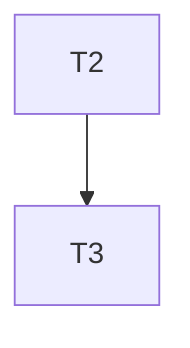
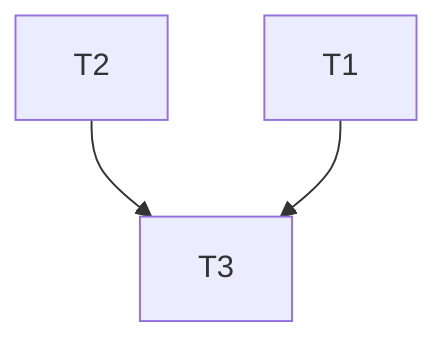
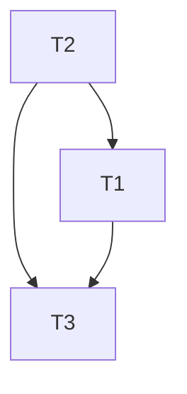
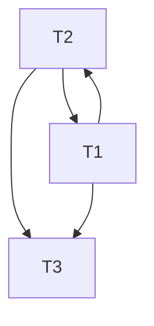

---
{"dg-publish":true,"permalink":"/dbms/module-4-dbms/","title":"Module 4 -- Transaction Concurrency -- DBMS","tags":["DBMS","SQL","Semester-6"],"created":"2025-03-15T13:28:34.611+05:30"}
---

---
# Index

1. [[#Transaction Concurrency]]
2. [[#ACID properties of Transaction]]
3. [[#Problems of Concurrency (Parallel Scheduling)]]
4. [[#Serializability of Schedulers]]
5. [[#Conflict Serializability Finding the Conflict Equivalent Schedule for a parallel schedule.]]
6. [[#Conflict serializability Using Precedence graphs to determine whether a schedule is conflict serializable or not]]
7. [[#View Serializability]]
8. [[#Pessimistic Concurrency Control (PCC) -- Basic overview]]
9. [[#1. Shared-Exclusive Locking Protocol]]
10. [[#Drawbacks of Shared-Exclusive Locking]]
11. [[#2. 2-Phase Locking (2PL)]]
12. [[#Drawbacks of 2PL]]
13. [[#Strict 2PL and Rigorous 2PL]]
14. [[#Timestamp Ordering Protocol (Pessimistic Concurrency Control)]]
15. [[#Optimistic Concurrency Control (OCC)]]
16. [[#1. Timestamp Ordering (OCC) version]]
17. [[#2. Multi-Version Concurrency Control (MVCC)]]
18. [[#Database Recovery]]
19. [[#Immediate vs Deferred Update in Database Recovery]]

---
# Transaction Concurrency

https://www.youtube.com/watch?v=t5hsV9lC1rU&list=PLxCzCOWd7aiFAN6I8CuViBuCdJgiOkT2Y&index=74

### 1. Definition of a Transaction

- **Transaction as a Logical Unit of Work:**  
    A transaction is defined as a set of operations performed to complete a specific task. In everyday language, when we think of transactions, we might think of monetary actions like transferring money, withdrawing cash, or making deposits. ==In the context of a DBMS, a transaction represents any change (or even a read) performed on the database==.
    
- **Example – ATM Withdrawal:**  
    When you withdraw money from an ATM, several steps occur sequentially:
    
    - **Card Insertion:** The card is inserted, and the machine reads the corresponding account details.
    - **Authentication:** The user’s details (such as PIN) are verified.
    - **Account Selection:** The system may ask the user to select an account (savings or current).
    - **Amount Entry:** The amount to withdraw is entered.
    - **Processing:** The ATM deducts the amount from your account.
    - **Completion:** The money is dispensed, and a confirmation (transaction complete) is displayed and sent via SMS.

This sequence of operations forms one transaction.

---
### 2. Core Operations in a Database Transaction

- **Read Operation:**
    
    - **Purpose:** To fetch data from the database.
    - **How It Works:** Data (such as the current balance of an account) is stored on the hard disk. When a transaction starts, the necessary data is read from the disk into RAM, where it can be processed quickly.
      
- **Write Operation:**
    
    - **Purpose:** To update or change data in the database.
    - **How It Works:** After reading the data into RAM, the transaction performs the required arithmetic or logical operations (for example, deducting an amount from one account and adding it to another). These changes initially occur in RAM.
      
- **Commit Operation:**
    
    - **Purpose:** To permanently save the changes made during the transaction.
    - **How It Works:** Once all operations (read and write) are successfully completed in RAM, the commit operation writes the changes back to the hard disk, ensuring the database is updated with the new values.
      
- **Additional Operation – Rollback (Mentioned Briefly):**  
  
    Although not detailed in the video, a rollback operation is used to undo the changes if something goes wrong during the transaction. This helps maintain data integrity by reverting the database to its previous state.

---
### 3. Why Transactions Are Important in DBMS

- **Ensuring Data Integrity:**  
  
    Transactions ensure that a series of operations either all occur successfully or none do. This all-or-nothing approach maintains the consistency of the database. For example, during a funds transfer, the money must be deducted from one account and added to another. If one part fails, the entire transaction is rolled back.
    
- **Improving System Efficiency:**  
  
    Since the CPU processes data in RAM (which is much faster than a hard disk), read and write operations are performed in memory first. The final commit ensures that the changes are safely stored on disk without directly affecting the user experience.
    
- **User Assurance:**  
  
    When a transaction is complete, users receive confirmation (like a “transaction completed successfully” message). This assurance is vital in applications like banking, where accurate and reliable data processing is critical.
    

---
### 4. Summarizing the Process of a Transaction

1. **Read Data:**  
    The necessary data is read from the hard disk into RAM.
    
2. **Perform Operations:**  
    The transaction performs its logical unit of work (e.g., deducting from one account, adding to another). These operations are processed in RAM for speed.
    
3. **Write Data:**  
    The updated values are stored in RAM as the transaction is processed.
    
4. **Commit:**  
    Finally, the commit operation saves the changes permanently to the hard disk.
    
5. **(Optional) Rollback:**  
    If any error occurs during the process, a rollback can revert the changes to maintain data consistency.
---
# ACID properties of Transaction

https://www.youtube.com/watch?v=-GS0OxFJsYQ&list=PLxCzCOWd7aiFAN6I8CuViBuCdJgiOkT2Y&index=75

### 1. Atomicity

- **Definition:**  
    ==Atomicity means that a transaction is treated as a single, indivisible unit of work. Either all operations in the transaction are executed completely, or none of them are==.
    
- **Key Concept:**
    
    - **All-or-Nothing:** If any part of a transaction fails (even one operation out of many), the entire transaction is rolled back.
    - **Example:**  
        Consider an ATM transaction where multiple steps are involved (card insertion, PIN entry, amount selection, etc.). If the transaction fails at any step before the commit (for instance, due to a network failure or an incorrect OTP), all changes are undone, and the transaction must restart from the beginning. This prevents partial updates, ensuring that no operation is left half-done.

---
### 2. Consistency

- **Definition:**  
    ==Consistency ensures that a transaction brings the database from one valid state to another valid state, preserving all predefined rules and constraints==.
    
- **Key Concept:**
    
    - **Before and After Balance:** For instance, when transferring money between two accounts, the sum of the account balances should remain the same before and after the transaction.
    - **Example:**  
        If account A has 2000 rupees and account B has 3000 rupees (totaling 5000 rupees), and a transaction transfers 1000 rupees from A to B, then after the transaction, A should have 1000 rupees and B should have 4000 rupees. The total remains 5000 rupees. If any error occurs (such as the cash not being dispensed from an ATM), the inconsistency would be detected, and the transaction would be rolled back to maintain the total.

---
### 3. Isolation

- **Definition:**  
    ==Isolation ensures that concurrently executing transactions do not interfere with one another, so that the outcome is the same as if the transactions were executed sequentially (i.e., in a serial schedule)==.
    
- **Key Concept:**
    
    - **Parallel vs. Serial Execution:** Even though transactions might run in parallel (interleaved in execution), the DBMS must manage them in such a way that the final database state is as if the transactions had been processed one after the other.
    - **Example:**  
        In a system where multiple transactions are reading and writing to the same data simultaneously, isolation prevents one transaction’s intermediate state from affecting another. Conceptually, a parallel schedule (interleaving of transactions) can be transformed into an equivalent serial schedule, ensuring that the operations do not conflict and that the final state is consistent.

---
### 4. Durability

- **Definition:**  
    ==Durability guarantees that once a transaction has been committed, its changes are permanent—even in the case of a system crash or power failure==.
    
- **Key Concept:**
    
    - **Permanent Storage:** After the commit operation, all changes are written permanently to disk. This means that even if the system restarts, the committed transaction's effects remain in the database.
    - **Example:**  
        In an online banking system, once money is transferred and the transaction is committed, the updated balances (for example, 1000 in account A and 4000 in account B after a transfer) are saved permanently. This permanence is ensured by writing the changes to the hard disk, not just keeping them in RAM.

---
### Conclusion

The ACID properties ensure that database transactions are processed reliably and safely:

- **Atomicity** prevents partial transactions.
- **Consistency** maintains the integrity of the data before and after transactions.
- **Isolation** avoids conflicts between concurrently running transactions.
- **Durability** ensures that committed changes persist permanently.

These principles are fundamental in DBMS design and are crucial for systems like banking applications, where accuracy and reliability of transactions are paramount.

---
# States of a transaction

https://www.youtube.com/watch?v=ObwYFVLB_VI&list=PLxCzCOWd7aiFAN6I8CuViBuCdJgiOkT2Y&index=76


### 1. Transaction States Overview

- **Definition:**  
    A transaction is a set of operations that performs a logical unit of work. As it executes, it transitions through several states—from the time it begins to the time it either commits its changes permanently or fails.
    
- **Analogy:**  
    The video compares a transaction to a program that is stored on a hard disk (inactive) and then loaded into RAM (active) for execution. Similarly, a transaction is “inactive” until it is started, and then it becomes “active” when it is executing.
    

---
### 2. Active State

- **What It Means:**  
    ==When a transaction begins execution==, it enters the **active state**. In this state, the transaction is performing its operations.
    
- **Operations:**  
    The transaction performs a series of read and write operations. For example, it might:
    
    - Read data from the database (stored permanently on the hard disk).
    - Perform arithmetic operations on the data (like deducting an amount from one account and adding it to another).
    - Write these changes to local memory (RAM).
- **Memory Context:**  
    The operations in the active state occur in RAM, which allows the CPU (via its ALU—the Arithmetic Logical Unit) to process data quickly compared to directly accessing the hard disk.
    

---
### 3. Partially Committed State

- **What It Means:**  
    ==Once a transaction has completed all its operations (read and write) except the final commit==, it is said to be in a **partially committed state**. At this point, all operations have been executed in RAM, but the changes have not yet been saved permanently.
    
- **Key Point:**  
    Even though the transaction appears to have done most of its work, until the commit operation is performed, the changes remain temporary and only reside in memory.
    

---
### 4. Commit State

- **What It Means:**  
    The **commit operation** is the ==final step of a transaction==. When the commit is executed:
    - All the changes made during the transaction are permanently saved to the hard disk.
    - The transaction is considered successfully completed, and its changes become durable.
- **Outcome:**  
    After commit, the updated values (for example, updated account balances) are stored permanently in the database, ensuring that they persist even if the system is restarted.

---
### 5. Termination (Deallocation)

- **What It Means:**  
    ==Once a transaction commits, the resources it used (CPU time, RAM, registers, network bandwidth) are released==.
- **Key Aspect:**  
    The operating system takes back these resources so they can be used by other transactions or processes, ensuring efficient resource management.

---
### 6. Failed (Abort) State and Rollback

- **Failure Conditions:**  
    ==A transaction may fail if an error occurs during its execution (for example, a power failure, network outage, or unexpected interruption)==.
- **Abort and Rollback:**
    - If a transaction fails **before the commit** operation (whether during the active state or while it is partially committed), the system will **abort** the transaction.
    - **Rollback** is performed: all operations executed by the transaction are undone, returning the database to its previous state before the transaction began.
- **Restart Requirement:**  
    A failed transaction cannot simply resume from where it left off; it must be restarted entirely from the beginning to ensure data consistency and integrity.

---
### Conclusion

- It starts in the **active state** when executing operations in RAM.
- It moves to the **partially committed state** after executing all operations but before committing.
- It reaches the **commit state** once all changes are permanently saved to disk.
- Finally, the transaction is **terminated** by deallocating the resources it used.
- In case of any error before commit, the transaction moves to a **failed (abort) state**, triggering a rollback to preserve consistency.

---
# Scheduling in DBMS

https://www.youtube.com/watch?v=1cbmhsSJRWc&list=PLxCzCOWd7aiFAN6I8CuViBuCdJgiOkT2Y&index=77

### 1. Definition of a Transaction Schedule

- **What Is a Schedule?**  
    ==A schedule is a chronological sequence that defines the order in which operations from multiple transactions are executed==. It essentially shows the interleaving of operations from transactions (e.g., T1, T2, T3) and determines how these operations are arranged in time.

---
### 2. Types of Schedules

The video outlines two main types of schedules:

- **Serial Schedule:**
    
    - **Definition:**  
        ==In a serial schedule, transactions execute one after the other with no interleaving==.
    - **Execution Order:**  
        For example, if T1 starts first, it will complete (commit) entirely before T2 begins. Then T2 will finish before T3 starts.
    - **Advantages:**
        - **Consistency:** Since no two transactions interfere with each other, the database state remains consistent.
    - **Disadvantages:**
        - **Waiting Time:** All transactions that arrive simultaneously must wait for the one in progress to finish, which can lead to decreased throughput and longer response times.
 

- **Parallel (Concurrent) Schedule:**
    
    - **Definition:**  
        ==In a parallel schedule, operations of multiple transactions are interleaved. The CPU switches among transactions, allowing them to execute concurrently==.
    - **Execution Order:**  
        Instead of waiting for T1 to completely finish before T2 begins, the system may execute parts of T1, then T2, then T3, and then resume T1, etc.
    - **Advantages:**
        - **Performance & Throughput:** More transactions can be executed per unit time because the system utilizes parallel processing. This is critical in real-world scenarios (like online banking or booking systems) where high throughput is required.
    - **Disadvantages:**
        - **Complexity & Interference:** With concurrent execution, transactions might interfere with one another, leading to potential consistency issues if not managed properly. Concurrency control techniques (such as serializability) are required to ensure that a parallel schedule is equivalent to a serial one.

---
### 3. Real-World Analogies and Examples

- **ATM Example:**  
    Imagine an ATM with a single machine: if multiple people queue up, only one transaction can be processed at a time (a serial schedule). This ensures that while one person is using the ATM, no other person’s transaction interferes, but it leads to waiting time.
    
- **Online Banking and IRCTC:**  
    In online systems like banking apps or the IRCTC booking system, thousands of transactions can occur simultaneously. Here, a parallel schedule is used to process multiple transactions concurrently. While this greatly increases throughput and performance, it also requires robust concurrency control to maintain data consistency.

---

### 4. Throughput and Performance

- **Throughput:**  
    This is the number of transactions executed per unit time (e.g., per second, minute, or hour). A parallel schedule tends to increase throughput by allowing multiple transactions to be processed at the same time.
    
- **Performance Impact:**
    
    - **Serial Scheduling:** Lower throughput and longer waiting times, but ensures consistent outcomes.
    - **Parallel Scheduling:** Higher throughput and better performance, but it requires careful management to avoid conflicts and ensure consistency.

---
# Problems of Concurrency (Parallel Scheduling)

## 1. Dirty Read (Read After Write Problem)

https://www.youtube.com/watch?v=oP8yLMjmszE&list=PLxCzCOWd7aiFAN6I8CuViBuCdJgiOkT2Y&index=78


- **Definition:**  
    ==A dirty read occurs when one transaction (say, T2) reads data that has been modified by another transaction (T1) but has not yet been committed==. If T1 later fails and rolls back, T2 has acted upon data that never truly existed in the final database state.
    
- **Example:**
    
    - T1 reads a value A = 100, then updates it to 50.
    - T2 reads the updated value (50) before T1 commits.
    - If T1 eventually fails and rolls back, the value “50” becomes invalid, and T2 has worked with an incorrect, “dirty” value.


A more detailed video on Dirty Read: https://www.youtube.com/watch?v=r_oI0jLqlVY&list=PLxCzCOWd7aiFAN6I8CuViBuCdJgiOkT2Y&index=79

---
## 2. Incorrect Summary 


- **Definition:**  
    ==This problem arises when a transaction calculates an aggregate (like an average or sum) based on data that is in the process of being updated by another transaction, leading to an incorrect summary if that data isn’t final==.
    
- **Example:**
    
    - Initially, the value of A is 1000.
    - T1 reads A = 1000 and subtracts 50, updating it to 950.
    - T2, running concurrently, reads the value 950 (instead of the original 1000) to compute an average.
    - If T1 later rolls back or further modifies the value, the aggregate computed by T2 is incorrect because it was based on intermediate, uncommitted data.

---
## 3. Lost Update


- **Definition:**  
    ==Lost update occurs when two transactions simultaneously update the same data. One transaction’s update overwrites the other’s, causing the earlier update to be lost==.
    
- **Example:**
    
    - T1 reads a product’s quality value and updates it to 6.
    - Meanwhile, T2 reads the same quality value and updates it to 10.
    - If T2’s update overwrites T1’s without combining both changes, the final value may only reflect one of the updates, leading to a “lost” update from T1.

---
## 4. Unrepeatable Read


- **Definition:**  
    ==An unrepeatable read happens when a transaction reads a row of data twice and finds that the value has changed between the two reads because another transaction modified it in the meantime==.
    
- **Example:**
    
    - A transaction reads the value of X as 100.
    - Before it can read X again, another transaction updates X to 50.
    - When the original transaction reads X again, it sees a different value (50), making the result inconsistent across multiple reads.

A better video on unrepeatable read: https://www.youtube.com/watch?v=vwIeKYGXmjI&list=PLxCzCOWd7aiFAN6I8CuViBuCdJgiOkT2Y&index=80

---
## 5. Phantom Read


- **Definition:**  
    ==A phantom read occurs when a transaction executes a query to retrieve a set of rows, and a subsequent re-execution of the same query (within the same transaction) returns a different set of rows because another transaction has inserted or deleted rows==.
    
- **Example:**
    - A transaction reads all rows where a condition is met (say, all records with a value X).
    - Another transaction then inserts or deletes rows that meet the condition.
    - When the first transaction re-queries the database, it finds “phantom” rows that were not there initially, resulting in inconsistent results.
---
# Serializability of Schedulers

https://www.youtube.com/watch?v=s8QlJoL1G6w&list=PLxCzCOWd7aiFAN6I8CuViBuCdJgiOkT2Y&index=83

### 1. What Is Serializability?

- **Definition:**  
    ==Serializability means that a given schedule (the interleaved execution of operations from multiple transactions) can be rearranged into a serial schedule (where transactions execute one after another without any interleaving) without affecting the final outcome. In simple terms, even if transactions run concurrently, their combined effect should be the same as if they were executed one by one==.

---
### 2. Serial Schedules vs. Parallel Schedules

- **Serial Schedule:**
    
    - In a serial schedule, transactions execute completely one after another.
    - For example, if there are transactions T1 and T2, T1 executes fully and commits before T2 starts.
    - **Graphical Representation:**  
        The schedule can be depicted as a simple precedence graph with vertices representing transactions, showing that one transaction completely precedes the next (e.g., T1 → T2).
- **Parallel (Concurrent) Schedule:**
    
    - In a parallel schedule, operations from multiple transactions are interleaved.
    - For example, some operations of T1 may execute, then some of T2, and then T1 again.
    - **Identification of Parallelism:**  
        When you draw a precedence graph for a parallel schedule, you might see loops (cycles) that indicate the interleaving of operations from different transactions.

---
### 3. Determining Serializability

- **Objective:**  
    The goal is to determine whether the parallel schedule is equivalent to some serial schedule (i.e., whether it is serializable). This means checking if the outcome of the interleaved execution is the same as one of the possible serial orders.
    
- **Methods:**  
    Two main approaches are mentioned:
    
    - **Conflict Serializability:**
        - ==This method examines the order of conflicting operations (such as reads and writes on the same data item) to determine if the schedule can be rearranged into a serial order==.
    - **View Serializability:**
        - ==This method is more general and checks if the final outcome (the view of the data) in the parallel schedule is the same as in some serial schedule==.

- **Multiple Transactions Example:**  
    If there are three transactions (T1, T2, T3), the possible serial orders are determined by the number of permutations (3! = 6). The idea is to see if one of these six serial orders produces the same final result as the parallel schedule.
    
---
### 4. Key Takeaways

- **Serializability Ensures Consistency:**  
    Even when transactions are executed concurrently, if the schedule is serializable, the database remains consistent because its final state is equivalent to that of some serial execution.
    
- **Exam Focus:**  
    In competitive exams like GATE or UGC NET, questions on serializability are common. They often provide a parallel schedule and ask you to determine if it is serializable or to find its equivalent serial schedule.
    
- **Practical Implications:**  
    Serializability is crucial for maintaining data consistency in multi-user environments where transactions run in parallel. Without proper serializability, concurrent transactions could lead to anomalies and inconsistent data.
---
# Conflict Serializability: Finding the Conflict Equivalent Schedule for a parallel schedule.

https://www.youtube.com/watch?v=ckqDozxECp0&list=PLxCzCOWd7aiFAN6I8CuViBuCdJgiOkT2Y&index=84

### 1. Conflict Equivalence Concept

- **Definition:**  
    ==Two schedules are conflict equivalent if one can be transformed into the other by swapping adjacent operations that do not conflict. In other words, despite their different appearances, the schedules yield the same final result because their conflicting operations occur in the same order==.
    
- **Why It Matters:**  
    Determining conflict equivalence helps us understand whether a parallel (concurrent) schedule behaves the same as some serial schedule, which is essential for ensuring database consistency.
---
### ✅ Definitions You Need to Know First

#### 🔹 **Schedule**

A sequence of **operations (read/write)** from multiple transactions (like T1, T2...).

#### 🔹 **Conflict Operations**

Two operations **conflict** if:

1. They are from **different transactions**, AND
2. They access the **same data item**, AND
3. At least **one of them is a write**.

So, these are the **conflict pairs**:

- **Read–Write (RW)** on the same data item.
- **Write–Read (WR)** on the same data item.
- **Write–Write (WW)** on the same data item.

These **cannot be swapped**.

#### 🔹 **Non-conflict pairs**

- **Read–Read (RR)** → No problem (no conflict).
- Operations on **different variables** (e.g., one on A, another on B).

These **can be swapped safely** in the schedule.

---
### 🔁 How to Check Conflict Equivalence

You’re usually given:

- A **schedule S**
- A **target serial schedule S′** (or another order)
- You need to check if **S can be converted into S′** by **swapping only non-conflicting adjacent operations**.

#### Steps:

1. **Identify conflicting and non-conflicting pairs.**
2. Start from the schedule S.
3. **Find adjacent non-conflict pairs**.
4. **Swap them**, one by one, to reorder S into S′.
5. If you can **transform S into S′** using only **non-conflicting adjacent swaps**, then **they are conflict equivalent**.

⚠️ **Do not swap conflict pairs**, or operations will become inconsistent.

---
### Example Scenario (as per the video)

Let's say we have a schedule `S`

```css
T1: Read(A), Write(A)
T2: Read(B)
```

And a schedule `S'`:

```css
T2: Read(B)
T1: Read(A), Write(A)
```

These look different in order, so the goal is to **transform S into S′** by **swapping only non-conflicting adjacent operations**.

#### Step 1: Identify the conflict and non-conflict pairs.

Now we know that conflict pairs are: 

- The pairs which are acting on the same data (or variable)
- One of the operations involved is a **write** operation.
- They are each from different transactions.

### ✅ **Conflict vs. Non-Conflict Pairs**

|Pair|Same data item?|Conflict?|Why?|
|---|---|---|---|
|`R(A)` – `R(A)`|Yes|❌ No conflict|Both are just reading|
|`R(A)` – `W(A)`|Yes|✅ Conflict|Read followed by write changes value|
|`W(A)` – `R(A)`|Yes|✅ Conflict|Value is read after modification|
|`W(A)` – `W(A)`|Yes|✅ Conflict|Write overwrites previous write|
|Any operations on **different** data items|No|❌ No conflict|No interference|

---
#### Step 2: Swap the pairs step by step till you achieve your target schedule

So the flattened version of our original schedule `S`:

```scss
R1(A), W1(A), R2(B)
```

And our target schedule `S'`:

```scss
R1(A), R2(B), W1(A)
```

Now we can just swap `W1(A)` with `R2(B)` .

But first we need to check (even though it's obvious in this scenario) if they are a **non-conflict** pair or not:

- Are they adjacent? ✅ Yes
- Are they operating on the same data item? ❌ No (A vs. B)
- So it's a **non-conflict pair** ✅

So we can swap the two operations.

Now new order:

```scss
R1(A), R2(B), W1(A)
```

This matches our target schedule `S'`.

---
### ✅ Final Conclusion:

Since we were able to convert `S` into `S'` using only **adjacent non-conflicting swaps**, they are:

> **Conflict Equivalent Schedules**

---
### 🧠 Key Takeaways

- Only **adjacent non-conflicting operations** can be swapped.
- Goal: Achieve the same order of **conflicting operations**.
- Conflict equivalence implies **conflict-serializability**.
---
## Conflict serializability: Using Precedence graphs to determine whether a schedule is conflict serializable or not

https://www.youtube.com/watch?v=zv0ba0Iok1Y&list=PLxCzCOWd7aiFAN6I8CuViBuCdJgiOkT2Y&index=85

Conflict serializability checks **whether a schedule (sequence of operations from different transactions)** can be rearranged into a **serial schedule** without changing the outcome.

- **Goal:** Determine if a schedule is **conflict serializable** using a **precedence graph**.
- If **no cycle** exists in the graph → ✅ Conflict serializable.
- If a cycle **does exist** → ❌ Not conflict serializable.

### Quick recap from graph theory, what is a Cycle in a graph and how to spot them?

A **cycle** in a graph is a path that starts and ends at the same vertex, and contains at least one other vertex. In simpler terms, it's a closed loop within the graph.


---
### 🛠️ **Steps to Check Conflict Serializability**

Let’s break it down step-by-step:

#### ✅ **Step 1: Identify Transactions**

- List all transactions involved.  
    Example: `T1, T2, T3` → **3 vertices** in the graph.
#### ✅ **Step 2: Draw Nodes**

- Create one node per transaction (T1, T2, T3).

#### ✅ **Step 3: Add Directed Edges for Conflicts**

Check **conflicting operations** _between different transactions only_ (not within the same transaction). Conflicts arise when:

1. **Read(X)** → **Write(X)** (RW)
2. **Write(X)** → **Read(X)** (WR)
3. **Write(X)** → **Write(X)** (WW)

**Important**: These operations must access the **same data item** (like X, Y, Z).

Draw an edge:

- From transaction $T_i$ to $T_j$
- If $T_i$'s operation occurs **before** $T_j$'s conflicting operation in the schedule

#### ✅ **Step 4: Detect Cycles**

- If any cycle exists in the graph → **Not conflict serializable**
- If **no cycles** → **Conflict serializable**

---
### Example

Let's say we are given this schedule which contains a bunch of transactions

```css
T1: R(X)      → Read of X  
T2: R(Y)      → Read of Y  
T3: R(X)      → Read of X  
T1: R(Y)      → Read of Y  
T2: R(Z)      → Read of Z  
T3: W(Y)      → Write of Y  
T1: W(Z)      → Write of Z  
T2: W(Z)      → Write of Z
```
#### Step 1: Identify transactions

We see:

- **T1**
- **T2**
- **T3**

So we’ll have **3 nodes** in the graph:

```css
T1 T2 T3
```
---
#### Step 2: Check for conflicts and add edges

Let’s go **line-by-line** and check for conflicts.

### 🔍 Operation 1: `T1: R(X)`

Look for:

- Later `W(X)` from **other transactions** (T2, T3)  
    → None found  
    ✅ No edge

---
### 🔍 Operation 2: `T2: R(Y)`

Look for:

- Later `W(Y)`  
    → `T3: W(Y)`  
    ✅ Conflict (RW) → Add edge from **T2 → T3**



---
### 🔍 Operation 3: `T3: R(X)`

Look for:

- Later `W(X)`  
    → None  
    ✅ No edge

---
### 🔍 Operation 4: `T1: R(Y)`

Look for:

- Later `W(Y)`  
    → `T3: W(Y)`  
    ✅ Conflict (RW) → Add edge from **T1 → T3**



---
### 🔍 Operation 5: `T2: R(Z)`

Look for:

- Later `W(Z)`  
    → `T1: W(Z)`  
    ✅ Conflict (RW) → Add edge from **T2 → T1**



---
### 🔍 Operation 6: `T3: W(Y)`

Look for:

- Later `R(Y)` or `W(Y)` from others  
    → None  
    ✅ No edge
    

---
### 🔍 Operation 7: `T1: W(Z)`

Look for:

- Later `R(Z)` or `W(Z)`  
    → `T2: W(Z)`  
    ✅ Conflict (WW) → Add edge from **T1 → T2**



---
### 🔍 Operation 8: `T2: W(Z)`

Look for:

- No more operations  
    ✅ No edge

---
So, the final precedence graph is:


---
#### Step 3: Check for Cycles

To be **conflict serializable**, the graph must be **acyclic** (no cycles).

Let’s trace:

- From T1 → T2 → T3 → ❌ nothing more
- From T2 → T1 → T2 → ❌ back to T2 → This is a **cycle**


> ⚠️ **There is a cycle between T1 and T2**  
> ✅ So the schedule is **NOT conflict serializable**.

---
### ✅ Summary of Steps:

| Step | Action                                                                   |
| ---- | ------------------------------------------------------------------------ |
| 1    | Identify all transactions (T1, T2, T3)                                   |
| 2    | Check each operation for conflicts (RW, WR, WW) with later ops           |
| 3    | Add an edge from the **first transaction → second** for every conflict   |
| 4    | Build the **precedence graph**                                           |
| 5    | **Detect cycles** in the graph                                           |
| 6    | If cycle exists → **Not conflict serializable**, else → **Serializable** |

---
# View Serializability

https://www.youtube.com/watch?v=8LKM_RWeroM&list=PLxCzCOWd7aiFAN6I8CuViBuCdJgiOkT2Y&index=86

Let's first recap conflict serializability to understand why view serializability is important and **why it may hold in cases where conflict serializability fails**.

### 🔁 Part 1: Conflict Serializability Recap

**Schedule S** has 3 transactions:

- **T1**
- **T2**
- **T3**

These transactions have operations like `Read(A)` and `Write(A)` on the same variable **A**.

#### Conflict Serializability Check:

To check **conflict serializability**, we:

1. **Identify conflicting pairs**:
    
    - `Read(A)` conflicts with `Write(A)`
    - `Write(A)` conflicts with both `Read(A)` and `Write(A)`
      
2. **Draw a Precedence Graph**:
    
    - Nodes: `T1, T2, T3`
    - Directed edges represent the _order imposed_ by conflicts.
      
3. **Cycle in the graph?**
    
    - ✅ If **NO cycles** → schedule is conflict serializable.
    - ❌ If **cycle exists** → **not conflict serializable**.

> In the video, there's a **cycle between T1 and T2** (`T1 → T2 → T1`), so it's **not conflict serializable**.

---
### 🧠 Part 2: So... Is the schedule serializable at all?

**Important clarification:**

> **Just because a schedule is _not conflict serializable_, doesn’t mean it’s not serializable.**

That’s where **View Serializability** comes in.

---
### 👁️ Part 3: View Serializability Explained

The idea of **View Serializability** is looser than Conflict Serializability. It checks if two schedules:

- Read the same initial values,
- Write final values that match,
- And have the same final write (last `Write(A)` is by the same transaction in both schedules).

In the video:

- A schedule was **rearranged** by moving some `Write(A)` operations.
- Even though the operations are reordered (so it's **not conflict-equivalent**), the **final outcome** is the same.

---
### 📊 Concrete Example in the Video:

Let's walk through the data operations:

**Initial value of A = 100**

- T1 reads `A = 100`
- T2: `Write(A) → A = A - 40` → A becomes 60
- T1: `Write(A) → A = A - 40` → A becomes 20
- T3: `Write(A) → A = A - 20` → A becomes 0

Now in the rearranged schedule:

- T1 reads 100
- T1 does `A = A - 40` → A = 60
- T2 does `A = A - 40` → A = 20
- T3 does `A = A - 20` → A = 0

➡️ In **both schedules**, final value of A is **0**  
➡️ The **final write is by T3** in both  
➡️ **Read-from relationships** and **final effects** are **preserved**

So even though the **conflict graph has a cycle**, the two schedules are **view equivalent**.

---
### Example 2

We’ll work with three transactions:

- **T1**: `R(A)`, `W(A)`
- **T2**: `W(A)`
- **T3**: `W(A)`

Let’s say the schedule `S` is:

```css
T1: R(A)     
T2:       W(A)   
T3:             W(A)
T1:                  W(A)

```
or better:

|Step|Operation|
|---|---|
|1|T1: R(A)|
|2|T2: W(A)|
|3|T3: W(A)|
|4|T1: W(A)|
#### Step 1: Check Initial Reads

- `T1: R(A)` is the first read of `A` and reads the initial database value of `A`.
- In a serial schedule, if `T1` goes first, it would also read the initial value.
- ✅ **Pass**

#### Step 2: Read-from Matches

- `T1: R(A)` reads the initial value (no prior write to `A`).
- No other transaction reads anything in this schedule.
- ✅ **Pass**

#### Step 3: Final Write Match

- Final write on `A` is from `T1: W(A)`.
- If we reorder transactions as: `T1 → T2 → T3`, the final write would be from T3 ❌
- But if we reorder as: `T2 → T3 → T1`, the final write would still be from `T1` ✅

So we can find **at least one serial schedule** (`T2 → T3 → T1`) that ends in the same final writer as this schedule.

- ✅ **Pass**

Even if this schedule has conflicts (e.g., `T1: R(A)` before `T2: W(A)` → write-after-read), and might create a cycle in the **precedence graph** (making it **not conflict serializable**), it is still **view serializable** because:

- Same reads from initial state
- Same final writes
- Read-from mapping preserved

---
### ✅ Key Summary:

|Concept|Meaning|This Schedule|
|---|---|---|
|**Conflict Serializable**|No cycle in precedence graph|❌ Not conflict serializable (has cycle)|
|**View Serializable**|Same read-from & final writes|✅ Yes, view serializable|
|**Final Output**|Same value of A (0)|✅ Yes|

---
### 🎯 Why Use View Serializability?

> Because **conflict serializability is stricter** than necessary.  
> In some cases (like this one), a schedule **is logically correct and consistent**, even though **conflict rules say no**.

Hence, **View Serializability** allows us to accept more schedules that are still safe and correct.

### 🔁 TL;DR

If **conflict serializability** fails (due to cycles), **view serializability** is the next step to check. It’s **more powerful** but harder to implement in practice. The key idea is to make sure that the “story” of what happened to the data is the same, even if the order of events is different.

---
# Pessimistic Concurrency Control (PCC) -- Basic overview

These parts will be applicable in distributed systems module 3 as well.


https://www.geeksforgeeks.org/concurrency-control-in-distributed-transactions/

The [Pessimistic Concurrency Control Mechanisms](https://www.geeksforgeeks.org/difference-between-pessimistic-approach-and-optimistic-approach-in-dbms/#:~:text=A%20Pessimistic%20approach%20is%20an%20approach%20of%20concurrency%20control%20algorithms%20in%20which%20the%20transaction%20is%20delayed%20if%20there%20is%20a%20conflict%20with%20each%20other%20at%20some%20point%20of%20time%20in%20the%20future) ==proceeds on assumption that==, most of the [transactions](https://www.geeksforgeeks.org/transaction-control-in-dbms/) ==will try to access the same resource simultaneously==. It's basically used to prevent concurrent access to a shared resource and provide a system of acquiring a Lock on the data item before performing any operation.

Algorithms that fall under this protocol:

- Two-phase locking protocol (The pre-requisite is Share-Exclusive Locking Protocol)
- Timestamp Ordering Protocol

## 1. Shared-Exclusive Locking Protocol

https://www.youtube.com/watch?v=94C0V7f2zm4&list=PLxCzCOWd7aiFAN6I8CuViBuCdJgiOkT2Y&index=87

This is one of the **basic concurrency control mechanisms** in databases. Its **main purpose** is to:

- Ensure **serializability** (transactions appear to run one after the other, not concurrently).
- Maintain **consistency**, part of the **ACID properties**.
- Avoid conflicts during concurrent access.

## 🧠 Two Types of Locks:

1. **Shared Lock (S-lock)**:
    
    - Allows **only reading**.
    - **Multiple transactions** can hold a shared lock on the same data at the same time.
    - No changes can be made to the data.
      
2. **Exclusive Lock (X-lock)**:
    
    - Allows **both reading and writing**.
    - **Only one transaction** can hold an exclusive lock on a data item.
    - No other transaction can access the data in any form while this lock is held.
---
###  When to Use Which?

- If a transaction only needs to **read** a data item → **Shared Lock**.
- If a transaction needs to **read and write** → **Exclusive Lock**.

Examples:

- `T1: Read(A)` → Take `S(A)` → After done, `Unlock(A)`
- `T2: Read(A), Write(A)` → Take `X(A)` → After done, `Unlock(A)`

---
### Compatibility Table

This table determines whether a new **lock request** is allowed based on the **currently held lock** on the data item.

|**Currently Held (Grant)**|**Requested Lock**|**Allowed?**|
|---|---|---|
|Shared|Shared|✅ Yes|
|Shared|Exclusive|❌ No|
|Exclusive|Shared|❌ No|
|Exclusive|Exclusive|❌ No|

### 🔎 Why?

- **Shared + Shared** → OK: Both only read; no conflict.
- **Shared + Exclusive** → Not OK: Could lead to a **read-write conflict**.
- **Exclusive + Shared/Exclusive** → Not OK: Already modifying data; any other access causes potential **write conflicts**.

---
### Lock Lifecycle 

For each transaction:

1. **Lock** the required data item(s) using `S` or `X`.
2. **Perform operations** (read/write).
3. **Unlock** when done.

This is typically implemented with the help of a **lock manager** inside the database that follows the compatibility rules.

---
### Goal of the protocol

- Make sure **concurrent schedules** are **serializable** (i.e., produce the same result as some serial schedule).
- Ensure **consistency** of data is not violated during concurrent access.
- It's a **simple way** to avoid many of the problems like dirty reads, lost updates, etc.
---
### Drawbacks of Shared-Exclusive Locking

https://www.youtube.com/watch?v=UsqtDD1VriY&list=PLxCzCOWd7aiFAN6I8CuViBuCdJgiOkT2Y&index=88

#### 🔒 Shared-Exclusive Locking: Quick Recap

- **Shared Lock (S)**: Multiple transactions can read (shared lock) the same data simultaneously.
- **Exclusive Lock (X)**: Only one transaction can write (exclusive lock) to a data item, and no other transaction can read/write it while the exclusive lock is held.

---
#### 1. **May Not Guarantee Serializability**

> **"May not be sufficient to produce only serializable schedules."**

- **Explanation**: Although locking protocols are intended to ensure serializability (a key property of correct concurrent schedules), basic shared-exclusive locking **does not guarantee** that **every schedule** it allows is **serializable**.
    
- **Example**: If transactions are interleaved in a certain way, you might end up with a schedule that violates the **serializability** requirement. This happens when the **conflict graph** of the schedule contains a **cycle** (e.g., T1 → T2 → T1).

---
#### 2. **May Not Ensure Recoverability (Irrecoverable Schedules Possible)**

> **"May not be free from irrecoverability."**

- **Explanation**: If a transaction **reads dirty (uncommitted) data** written by another transaction and then **commits** before the other transaction aborts, it leads to an **irrecoverable schedule**. Shared-exclusive locking **does not prevent** this by itself.
    
- **Why It's a Problem**: If the earlier writing transaction fails and rolls back, the reading transaction has already committed based on invalid data — causing a **dirty read** and **data inconsistency**.
    
- **Fix**: Recoverability can be ensured using **strict or cascadeless schedules**, but **plain locking alone** doesn’t prevent this issue.
  
---
#### 3. **Possibility of Deadlock**

> **"May not be free from deadlock."**

- **Explanation**: Deadlock happens when two or more transactions wait indefinitely for each other to release locks.
  
- **Scenario**:
    
    - T1 locks A, then waits for B.
    - T2 locks B, then waits for A.
    - Neither can proceed, resulting in a **deadlock**.
        
- **Why It Happens**: The locking protocol does not **prevent circular wait** conditions.
- **Fix**: You need **deadlock detection and resolution** mechanisms or use **timeout or wait-die/wound-wait** schemes.

---
#### 4. **Possibility of Starvation**

> **"May not be free from starvation."**

- **Explanation**: Starvation occurs when a transaction keeps waiting for a lock but **never gets it**, because other transactions continuously acquire the lock before it gets the chance.
    
- **Scenario**:
    
    - T2 requests a **shared** lock on A and waits.
    - T1 keeps requesting and acquiring **exclusive** locks before T2 gets its turn.
- **Why It Happens**: There is no **fairness** in lock granting — especially if **priority or order** is not maintained.
    
- **Fix**: Implementing a **fair scheduler** or **queue-based locking** helps reduce starvation.

---
###  Summary of All Key Drawbacks

|Drawback|Description|
|---|---|
|❌ Not always serializable|Locking doesn't **guarantee** serializable schedules|
|❌ Irrecoverable schedules|Transactions may **commit after reading dirty data**, breaking consistency|
|⚠️ Deadlock possible|Circular waiting on locks causes **indefinite blocking**|
|⚠️ Starvation possible|Some transactions may **never get the lock** if others keep acquiring it|

---
## 2. 2-Phase Locking (2PL)

https://www.youtube.com/watch?v=1pUaEDNLWi4&list=PLxCzCOWd7aiFAN6I8CuViBuCdJgiOkT2Y&index=89

In simpler locking protocols (like Shared & Exclusive locks), **inconsistencies or non-serializable schedules** may occur due to poor coordination. 2PL adds structure to **how and when** locks are acquired or released during a transaction to avoid such problems.

---
### 🧩 2 Phases in 2PL

1. **🔼 Growing Phase**
    
    - You can **acquire (take)** locks (Shared or Exclusive).
    - You **cannot release** any locks.
    - Think of this as the “gather all resources you need” phase.
        
2. **🔽 Shrinking Phase**
    
    - You **release** locks.
    - You are **not allowed to acquire** any new locks.
    - Once a transaction releases its **first lock**, it enters this phase, and cannot go back.

> 🔁 The transition from growing to shrinking happens the **moment a transaction releases any lock**.

---
### ✅ How Does 2PL Achieve Serializability?

Let’s take an example:

- T1: Read(A), Write(A), Read(B)
- T2: Read(A), Read(C)

In 2PL:

- T1 will **acquire all its locks first** (exclusive lock on A, maybe shared on B), and **only then** release them.
- T2 **cannot get a lock** on A until T1 is done **releasing it**.

This creates a natural **serial order** — since T2 had to **wait**, it can be considered to have happened **after T1**.

So:  
⏳ **Order of lock acquisition determines order of transaction execution**, even if they're overlapping in real time.

---
### 🧠 Key Concepts You Must Remember

|Term|Explanation|
|---|---|
|**Growing Phase**|Only lock acquisition allowed|
|**Shrinking Phase**|Only lock release allowed|
|**Lock-Point**|The point where a transaction acquires its **last lock** (or equivalently, the point where it releases its **first lock**) — helps determine the **serialization order**|
|**Compatibility Table**|Dictates whether two locks can coexist. E.g. Shared-Shared = ✅, Shared-Exclusive = ❌|

---
### ⚙ Example Breakdown

Let’s say:

- T1 does: Lock - `S(A), Lock-S(B), Unlock(A), Unlock(B)`
- T2 does: Lock - `S(A), Lock-X(B), Unlock(A), Unlock(B)`

**What happens?**

- T1 starts in Growing Phase: takes` S(A)`, then `S(B)`.
- Once it Unlocks A → it enters Shrinking Phase.
- After that, **it cannot acquire new locks** (even if needed).
- T2 can still start its Growing Phase, but it’ll be **blocked** if it needs Exclusive lock on B while someone else holds Shared.

---
### 🛑 Common Misconceptions Cleared

- ❌ _Only one transaction works at a time in 2PL_ — _Wrong!_  
    ✅ Multiple transactions **can grow simultaneously**, **as long as their locks are compatible** (e.g., Shared on Shared).
    
- ❌ _Exclusive locks can be given if growing phase is active_ — _Wrong!_  
    ✅ You still need to follow the **compatibility rules**; Exclusive lock won’t be granted if someone else has a Shared lock.

---
### Drawbacks of 2PL

### 1. **Irrecoverable Schedules**

#### 🔍 What it means:

A schedule is **recoverable** if a transaction `T2` that reads data written by `T1` **commits only after `T1` commits**.

#### ❌ Problem:

In 2PL, there is no rule that enforces this ordering of commits. So:

- If `T1` writes to `A`
- `T2` reads `A` before `T1` commits
- `T2` commits, and then later `T1` fails

You **cannot roll back** `T2` even though it read uncommitted/dirty data. This leads to an **irrecoverable schedule**, which **violates atomicity**.

---
### 2. **Cascading Rollbacks**

#### 🔍 What it means:

A **cascading rollback** happens when a failure in one transaction forces **multiple other transactions to roll back**, due to them having read its data.

#### ❌ Problem:

2PL allows this to happen:

- `T1` writes to `A`
- `T2`, `T3`, and `T4` all **read** `A` after acquiring **shared locks**
- If `T1` fails and is rolled back, now all dependent transactions (`T2`, `T3`, `T4`) must also be rolled back

This leads to a **chain of rollbacks**, which hurts **performance and consistency**.

> 💡 Even though 2PL controls how locks are acquired/released, it doesn’t **stop reads from uncommitted writes**, which causes the issue.

---
### 3. **Deadlocks**

#### 🔍 What it means:

A **deadlock** occurs when two or more transactions wait for each other indefinitely to release locks.

#### ❌ Problem:

2PL doesn’t avoid deadlocks. For example:

- `T1` locks `A` and waits for `B`
- `T2` locks `B` and waits for `A`

Now, both transactions are stuck—**circular waiting**—and neither can proceed.

> Deadlocks are a classic problem in locking systems and need **separate detection and recovery mechanisms**, like:
> 
> - Wait-for graphs
>  
> - Timeout-based aborts
>   
> - Deadlock prevention protocols (e.g., wait-die or wound-wait)
>   

---
### 4. **Starvation**

#### 🔍 What it means:

**Starvation** happens when a transaction **never gets a chance to execute** because other transactions keep overtaking it.

#### ❌ Problem:

Under 2PL, a transaction can be **perpetually delayed** in acquiring a lock if:

- Other transactions keep acquiring and releasing locks before it gets its chance
- There’s no priority or fair queuing system

This leads to starvation of long-waiting transactions.

---
### 🔄 Summary of Drawbacks:

|Issue|Possible in 2PL?|Why?|
|---|---|---|
|Irrecoverability|✅ Yes|No commit-order enforcement|
|Cascading Rollbacks|✅ Yes|No control on dirty reads|
|Deadlocks|✅ Yes|No deadlock avoidance|
|Starvation|✅ Yes|No fairness policy|

---
### ✅ How to fix them?

To address these problems, stronger protocols can be used, such as:

1. **Strict 2PL**:
    
    - All **exclusive locks** are held **until commit/abort**
    - Prevents **cascading rollbacks**
    - Guarantees **recoverable** and **cascade-less schedules**

2. **Rigorous 2PL**:
    
    - All **locks (shared and exclusive)** are held till commit
    - Ensures both **recoverability** and **serializability**

3. **Timestamp Ordering / Optimistic Concurrency**:
    
    - To avoid **deadlocks** entirely (no locks involved)

---
So this means that, what shared and exclusive locks did was give us two locks: 

- Shared is only used for reading Exclusive is used for both reading and writing. 

- S-E maintains a compatibility table which logs the logs acquired on an item and where more such locks can be acquired on the same item or not. 

- The rules are that if a lock of one type is held, another lock of the same type can be allowed to acquire on the same item but a lock of a different type cannot be allowed to be acquired. However this doesn't extend to exclusive lock (for the same lock acquiring the same lock part). 
  
- For example if `T1` holds an exclusive lock on `A`, another transaction `T2` cannot hold any lock on `A` until `T1` releases it. 

- This doesn't mean however that a transaction **cannot reacquire an exclusive lock it already holds**, that's **not necessarily true**—it can, depending on how lock upgrades/downgrades are handled.

- This means that shared on shared locks can happen, but exclusive on shared(already held) or shared on exclusive locks (already held) cannot be acquired. Also an exclusive on exclusive lock can't be acquired. 
 
 - But S-E has drawbacks, it may not guarantee serializability for every schedule, there might also be possibilities of deadlocks, starvation. 
 
 Enter 2-Phase locking:
 
 - 2-Phase locking aims to solve that by adding a sort of order on when and how the locks are acquired and released by splitting into two phases, the growing and shrinking phase. 
 
 - In the growing phase, any lock (multiple) can be acquired, and none can be released, however the rules of compatibility must be followed. In the shrinking phase, locks are released and no new ones can be acquired. This happens as soon as any transaction releases a lock.

- **Bonus**: **The Lock Point of a transaction**. The Lock Point of a transaction is the moment it **acquires it's last lock** (the end of growing phase). It's useful to define a serial schedule: if T1's lock point is before T2's, we say T1 is before T2 in the equivalent serial schedule.
  
- However 2PL can still have defects and it may still cause issues such as cascading rollbacks, deadlock and starvation
  
- To be rid of these problems we need stronger versions of 2PL or a different protocol, such as Timestamp Ordering.

---
## Strict 2PL and Rigorous 2PL

Both these protocols build on the basics 2PL protocol and add their own rules on top.

### 🔐 Strict 2-Phase Locking (Strict 2PL)

#### 🧱 Base Foundation:

- Inherits rules of **Basic 2PL**:
    
    - **Growing Phase**: Locks can be acquired, not released.
    - **Shrinking Phase**: Locks can be released, not acquired.

#### 📌 Additional Rule in Strict 2PL:

- **All Exclusive Locks must be held until the transaction _commits_ or _aborts_.**
    
    - Exclusive locks are released **only after** commit or abort.

---
#### 🛠 What Problems It Solves:

1. **Cascading Rollback**:
    
    - If another transaction reads a value written by an uncommitted transaction, and the writer aborts → the reader must also roll back (cascading).
    - Strict 2PL prevents this by **not allowing reads on uncommitted data**.
        
2. **Irrecoverability**:
    
    - A committed transaction reading from a transaction that later aborts → makes rollback impossible.
    - Prevented because reads can't happen until the writer commits.

---
#### 🧠 Insight:

- Ensures **recoverable** and **cascade-less** schedules.
- Transactions can’t read or write a value changed by another transaction until that transaction commits

---
### 🧱 Rigorous 2-Phase Locking (Rigorous 2PL)

#### 🔒 Even More Restrictive:

- **Both Shared and Exclusive locks are held until commit or abort.**
    
    - Not just exclusive (as in Strict 2PL), but **shared too** are retained till the end.

#### 💡 Key Difference from Strict 2PL:

- In Strict 2PL: Shared locks can be released before commit.
- In Rigorous 2PL: **No lock is released before commit**, neither shared nor exclusive.

---
#### ✅ What It Guarantees:

- Same benefits as Strict 2PL:
    
    - **Recoverable schedules**
    - **Cascade-less execution**
        
- But adds **stricter control** by retaining even read-locks (shared locks) until commit.

---
### 📊 Summary of Comparison:

|Property|Basic 2PL|Strict 2PL|Rigorous 2PL|
|---|---|---|---|
|Follows Growing/Shrinking?|✅ Yes|✅ Yes|✅ Yes|
|Holds exclusive locks till commit?|❌ No|✅ Yes|✅ Yes|
|Holds shared locks till commit?|❌ No|❌ No|✅ Yes|
|Prevents cascading rollback?|❌ No|✅ Yes|✅ Yes|
|Prevents irrecoverability?|❌ No|✅ Yes|✅ Yes|
|More strict?|Least strict|Moderate|Most strict|

---
### 🧱 What They _Don’t_ Solve:

- **Deadlocks**: Still possible, as locks are held longer.
- **Starvation**: A transaction might wait indefinitely if others keep taking locks.

---
# Timestamp Ordering Protocol (Pessimistic Concurrency Control)

## What is the Timestamp Ordering Protocol?

**Timestamp Ordering Protocol** is a concurrency control method that **ensures serializability** by ordering transactions based on their **timestamps**.

- Each **transaction** is assigned a **unique timestamp (TS)** when it enters the system.
- This timestamp determines its **age**:
    - **Smaller TS ⇒ Older Transaction**
    - **Larger TS ⇒ Younger Transaction**

---
## 🕒 Three Important Timestamps

For every **data item (say A)**, we track:

1. **TS($T_i$)**: Timestamp of transaction $T_i$.
2. **RTS(A)**: Read Timestamp of A → TS of the most recent transaction that successfully **read A**.
3. **WTS(A)**: Write Timestamp of A → TS of the most recent transaction that successfully **wrote A**.

---
## 🧠 Basic Principle

**"Older transactions should not be affected by younger ones."**

If a **younger transaction tries to read/write something modified by an older transaction**, it **might be aborted** to **preserve the correct order** of operations.

---
## 🔐 Rules of Timestamp Ordering Protocol

Let’s say transaction **T** wants to perform **Read(A)** or **Write(A)**.

### 1. **Read Rule**

Transaction **T** with timestamp **TS(T)** wants to **read A**.

- ✅ **If** `TS(T) ≥ WTS(A)` → allow the read.
- ❌ **If** `TS(T) < WTS(A)` → **abort** T and restart with a new timestamp.

**Why?**  
Because T is older, but A was written by a younger transaction, which violates the order.

**Example**:

- T1 (TS=100)
- T2 (TS=200) writes A → WTS(A)=200
- Now T1 wants to read A  
    → `TS(T1) = 100 < WTS(A) = 200` → ❌ ABORT T1

---
### 2. **Write Rule**

Transaction **T** wants to **write A**.

- ❌ **If** `TS(T) < RTS(A)` → **abort** T  
    (Someone already read A who should come after T)
    
- ❌ **If** `TS(T) < WTS(A)` → **abort** T  
    (Someone already wrote A who should come after T)
    
- ✅ **If** both conditions are false → allow the write, and set `WTS(A) = TS(T)`
    

**Example**:

- T1 (TS=100) reads A → RTS(A)=100
- T2 (TS=90) wants to write A  
    → `TS(T2)=90 < RTS(A)=100` → ❌ ABORT T2

Because someone already read A (T1), and if T2 writes now, it will create a **non-serializable** schedule.

---
## ⚖️ Summary Table

|Operation|Condition|Action|
|---|---|---|
|**Read(A)** by T|`TS(T) ≥ WTS(A)`|✅ Allow|
||`TS(T) < WTS(A)`|❌ Abort T|
|**Write(A)** by T|`TS(T) ≥ RTS(A)` **and** `TS(T) ≥ WTS(A)`|✅ Allow|
||`TS(T) < RTS(A)` or `TS(T) < WTS(A)`|❌ Abort T|

---
## 🔁 What Happens on Abort?

When a transaction is **aborted**, it's **restarted with a new timestamp** (i.e., treated as a newer transaction). This may cause starvation, so **modifications like Wait-Die or Wound-Wait** are used to handle starvation (just like in 2PL).

---
## ✅ Advantages

- Ensures **conflict serializability**
- No deadlocks (no locks → no cycles)

---
## ❌ Disadvantages

- **Starvation** can happen (younger transactions may be aborted repeatedly)
- Overhead in **maintaining timestamps** for each data item
- Can be **too strict** in some situations (may abort even when a conflict could have been resolved)

---
## A few examples on Timestamp Ordering to cement the understanding.

### 🔍 **Quick Recap: Timestamp Ordering Protocol (TO Protocol)**

- Each **transaction** is assigned a unique **timestamp (TS)** when it enters the system.
- **Older transactions** (lower TS) get **priority** over younger ones (higher TS).
- For every **data item X**, the system keeps:
    
    - **`read_TS(X)`** – the largest timestamp of a transaction that has successfully read X.
    - **`write_TS(X)`** – the largest timestamp of a transaction that has successfully written to X.

---
### ✅ **Rules** (Basic Timestamp Ordering):

When a transaction **T** wants to **Read(X)** or **Write(X)**:

1. **Read(X) by $T_i$:**
    
    - If `TS(Ti) < write_TS(X)`: ❌ **Abort Ti** (you’re trying to read something already overwritten by a younger transaction — violates consistency).
        
    - Else: ✅ **Allow the read**, and update `read_TS(X)` = max(`read_TS(X)`, `TS(Ti)`)

2. **Write(X) by $T_i$:**
    
    - If `TS(Ti) < read_TS(X)` **or** `TS(Ti) < write_TS(X)`:  
        ❌ **Abort $T_i$** (you're trying to write something based on outdated read or overwritten value).
        
    - Else: ✅ **Allow the write**, and update `write_TS(X)` = `TS(Ti)`

---
### 🧠 **Examples (Easy to Follow):**

Let’s say:

- T1: `TS(T1) = 5`
- T2: `TS(T2) = 10`

Let’s say current state for **data item A**:

- `read_TS(A) = 0`
- `write_TS(A) = 0`

---

Example 1: T1 reads A, then T2 writes A

```css
T1: Read(A)
T2: Write(A)
```

- `TS(T1) = 5`, `TS(T2) = 10`

1. **T1 reads A**:
    
    - 5 $\geq$ `write_TS(A)` (0) → ✅ Allow.
    - Set `read_TS(A) = 5`.
        
2. **T2 writes A**:
    
    - 10 $\geq$ `read_TS(A)` (5) and 10 $\geq$ `write_TS(A)` (0) → ✅ Allow.
    - Set `write_TS(A) = 10`.
 
✅ **Both succeed**.

---
#### **Example 2: T2 reads A, then T1 writes A**

```css
T2: Read(A)
T1: Write(A)
```

Initial state: `read_TS(A) = 0`, `write_TS(A) = 0`

1. **T2 reads A**:
    
    - 10 ≥ `write_TS(A)` (0) → ✅ Allow.
    - Update `read_TS(A) = 10`.
        
2. **T1 writes A**:
    
    - 5 < `read_TS(A)` (10) → ❌ **Abort T1**


❌ **T1 is aborted**. Because it’s older and tries to write something read by a younger transaction → violates timestamp order.

---

#### **Example 3: T2 wants to write A but T1 already wrote A**

```css
T1: Write(A)
T2: Write(A)
```

Initial: `write_TS(A) = 0`

1. **T1 writes A**:
    
    - 5 ≥ 0 → ✅ Allow.
    - Update `write_TS(A) = 5`.
        
2. **T2 writes A**:
    
    - 10 ≥ `read_TS(A)` (assume still 0), 10 ≥ `write_TS(A)` (5) → ✅ Allow.
    - Update `write_TS(A) = 10`.

✅ **Both succeed**.

---

#### **Example 4: Younger T2 tries to read A after older T1 wrote A**

```css
T1: Write(A)
T2: Read(A)
```

1. **T1 writes A** → ✅ `write_TS(A) = 5`
2. **T2 reads A**:
    
    - 10 ≥ `write_TS(A)` (5) → ✅ Allowed.
    - `read_TS(A)` = 10

✅ **Both succeed**.

---

#### **Example 5: Younger transaction tries to write A, older already wrote A**

```css
T1: Write(A)
T2: Write(A)
```

Assume `write_TS(A) = 5` from T1

Now T2 (`TS = 4`) tries to write A

- 4 < `write_TS(A)` (5) → ❌ **Abort T2**

You can't let a younger timestamp transaction overwrite data written by an older one.

---
### 🔁 Summary Table:

|Case|Outcome|
|---|---|
|Old reads, young writes|✅ Allowed|
|Young reads, old writes|✅ Allowed|
|Old writes, young reads|✅ Allowed|
|Young writes, old reads|❌ Abort|
|Young writes, old writes|❌ Abort if TS < `write_TS`|
|Old writes, young writes|✅ Allowed|

---
## Advantages of Pessimistic Concurrency Control

- ***Prevents Conflicts:*** Records, therefore, cannot be changed by other transactions due to locking, thus having few conflicts when the transaction is not complete. 

- ***High Reliability***: It is useful in situations with a high level of transaction contention due to the locks that are important in maintaining consistency of the data. 

---
## Disadvantages of Pessimistic Concurrency Control

- ***Deadlock Risk:*** So, when dealing with locks, it must be understood that they can lead to [deadlocks](https://www.geeksforgeeks.org/introduction-of-deadlock-in-operating-system/) and thus make programming even more complicated. 
- ***Lower Concurrency:*** Locks decrease the system’s concurrency since transactions may have to wait in order to obtain the right to use the required locks. 
- ***Higher Storage Costs:*** Most of the time it demands more storage space as there is the need to preserve the locks or other [concurrency control](https://www.geeksforgeeks.org/concurrency-control-in-dbms/).

---
## Pessimistic Concurrency Control Methods (Basic gist)

### 1. Isolation Level

The [isolation levels](https://www.geeksforgeeks.org/transaction-isolation-levels-dbms/) are defined as a degree to which the data residing in [Database](https://www.geeksforgeeks.org/what-is-database/) ==must be isolated by transactions for modification==. ==Because, if some transactions are operating on some data let's say transaction - T1 & there comes another transaction - T2 and modifies it further while it was under operation by transaction T1 this will cause unwanted inconsistency problems==.

---
### 2. Two-Phase Locking Protocol

We have already covered this before.

---
### 3. Distributed Lock Manager

==A distributed lock a critical component in the distributed transaction system, which co-ordinates the lock acquiring, and releasing operations in the transactions==. It helps in synchronizing the transaction and their operation so that data integrity is maintained.


---
### 4. Multiple Granularity Lock

==A lock can be acquired at various granular level like: table level, row/record level, page level or any other resource's level. In transaction system a transaction can lock a whole table, or a specific row while performing some changes on it==. This lock acquiring when done by various transactions simultaneously, this phenomena is called as [multiple granularity locking](https://www.geeksforgeeks.org/multiple-granularity-locking-in-dbms/).

---
# Optimistic Concurrency Control (OCC)

==The problem with pessimistic concurrency control systems is that, if a transaction acquires a lock on a resource so that no other transactions can access it==. This will result in reducing concurrency of the overall system.

The [Optimistic Concurrency control techniques](https://www.geeksforgeeks.org/difference-between-pessimistic-approach-and-optimistic-approach-in-dbms/) ==proceeds on the basis of assumption that, 0 or very few transactions will try to access a certain resource simultaneously==. We can describe a system as ***FULLY OPTIMISTIC***, if it uses ***No-Locks*** at all & checks for conflicts at commit time. It has following 4-phases of operation:

- ***Read Phase***: ==When a transaction begins, it reads the data while also logging the time-stamp at which data is read== to verify for conflicts during the validation phase.
- ***Execution Phase***: ==In this phase, the transaction executes all its operation== like create, read, update or delete etc.
- ***Validation Phase***: Before [committing](https://www.geeksforgeeks.org/difference-between-commit-and-rollback-in-sql/) a transaction, ==a validation check is performed to ensure consistency== by checking the ***`last_updated`*** [timestamp](https://www.geeksforgeeks.org/introduction-to-timestamp-and-deadlock-prevention-schemes-in-dbms/) with the one recorded at ***`read_phase`***. ==If the timestamp matches, then the transaction will be allowed to be committed== and hence proceed with the commit phase.
- ***Commit phase***: ==During this phase, the transactions will either be committed== or [aborted](https://www.geeksforgeeks.org/transaction-states-in-dbms/), ==depending on the validation check performed during previous phase==. If the timestamp matches, then transactions are committed else they're aborted.

---
### Some OCC methods

#### 1. Timestamp Ordering (OCC) version

#### 💡 Core Idea:

Transactions **execute without locking** during their read/write phase.  
Conflicts are only checked **during the commit phase** using timestamps.

---
#### 🔄 Phases in OCC:

##### 🔄 **1. Read Phase**

- Transaction **reads** values from the database into local memory.
- **Writes are buffered** (not applied yet).
- Reads are **not blocked**, and **no locks** are held.

---
##### ✍️ **2. Validation Phase (Key Phase for OCC)**

- Before committing, the system checks whether this transaction can **safely write** without causing **conflicts**.
- This is where **timestamp ordering logic** is applied.
- If **conflict is detected**, transaction is **aborted** and restarted.

---
##### ✅ **3. Write Phase**

- If validation succeeds, the buffered writes are **applied to the database**.

---
#### 🧠 Example of OCC with Timestamps

Let’s say:

- T1: TS=10, finishes at FT=30
- T2: TS=25 (starts before T1 finishes)

 T1 writes A → W(T1) = {A}

 T2 reads A → R(T2) = {A}

Now, apply validation:

- `FT(T1) = 30`, `TS(T2) = 25` ⇒ **T1 didn’t finish before T2 started**
- `W(T1) ∩ R(T2) = {A}` ⇒ **conflict**
- ❌ **T2 is aborted**

---
#### 🔄 Key Difference vs Basic Timestamp Ordering

| Feature                        | Basic TO Protocol       | OCC with Timestamps                    |
| ------------------------------ | ----------------------- | -------------------------------------- |
| **When conflicts are checked** | On every read/write     | Only during validation (before commit) |
| **Abort timing**               | During execution        | At commit time                         |
| **Overhead**                   | Constant checks         | Buffered work + validation logic       |
| **Best suited for**            | High conflict workloads | Low conflict workloads                 |

---
#### 📋 Summary Table:

|Phase|What Happens|
|---|---|
|Read|Transaction reads freely, stores changes locally|
|Validation|Timestamp-based check against committed transactions|
|Write|If valid, writes changes to DB; otherwise, aborts|

---
#### ✅ Key Points:

- **No locks used → high concurrency**
- **Conflicts are handled only at commit time**
- Works well when **conflicts are rare**

---
#### 2. Multi-Version Concurrency Control (MVCC)

In [MVCC](https://www.geeksforgeeks.org/concurrency-control-techniques/#:~:text=Multiversion%20Concurrency%20Control%3A%20Multiversion%20schemes%20keep%20old%20versions%20of%20data%20item%20to%20increase%20concurrency.%20Multiversion%202%20phase%20locking%3A), ==every data item has multiple versions of itself. When a transaction starts, it reads the version that is valid at the start of the transaction. And when the transaction writes, it creates a new version of that specific data item. That way, every transaction can concurrently perform their operations==.

==Each successful write results in the creation of a new version of the data item written. Timestamps are used to label the versions==. When a read(X) operation is issued, select an appropriate version of X based on the timestamp of the transaction

***Example***: In a banking system two or more user can transfer money without blocking each other simultaneously.

---
# Database Recovery

### 🛠️ What is Database Recovery?

**Database recovery** refers to the set of techniques used to **restore a database to a correct state** after a failure—whether it's due to a system crash, power loss, software bug, or disk error. The goal is to **ensure data consistency, atomicity, and durability** despite failures.

---
### 🔄 Why is it Important?

Databases follow the **ACID properties** (Atomicity, Consistency, Isolation, Durability). Recovery ensures:

- **Atomicity**: If a transaction was incomplete at crash time, its effects are undone.
- **Durability**: If a transaction was committed before the crash, its effects remain even after recovery.

---
### 💾 Recovery Concepts:

1. **Logs (Write-Ahead Logging - WAL)**:
    
    - Every change is first written to a **log file** _before_ being applied to the database.
    - These logs are used to **redo** committed transactions and **undo** uncommitted ones during recovery.
    
2. **Checkpoints**:
    
    - Periodically, the database saves a snapshot of the current state to avoid redoing the entire log from the beginning.
    - Speeds up recovery by telling the system: "You can start recovering from here."

---
### 🔃 Recovery Steps (Simplified):

On system restart after crash:

- **Undo** all uncommitted transactions (rollback).
- **Redo** all committed transactions (reapply their effects) using the log.

---
### 🧠 Techniques Used:

- **Deferred Update**: Actual changes to the DB are made _after_ the transaction commits. Easier to recover, but slower.
- **Immediate Update**: Changes are made immediately but backed by logs. Needs both undo and redo operations.
- **Shadow Paging**: Instead of overwriting data, writes go to new pages; swap pointers on commit. No need for undo logs, but less flexible.

---
### ✅ Summary:

Database recovery is all about **maintaining correctness after failure**. It uses **logs, checkpoints, and rollback/redo mechanisms** to bring the system back to a consistent state, ensuring no data is lost or wrongly retained.

---
## Immediate vs Deferred Update in Database Recovery

These two approaches define **when** the database gets physically updated during a transaction's execution.

### 🟢 **Deferred Update (Postponed Update)**

#### 🔹 Concept:

- Updates to the **actual database** are _deferred_ (i.e., delayed) **until the transaction successfully commits**.
- Until then, all changes are only recorded in the **log** (or a temporary buffer).

#### 🔹 Key Points:

- **No need for UNDO**, because if a transaction fails before commit, it didn’t make any changes to the DB.
- **Needs only REDO** for committed transactions after a crash.
- Safer, because the DB isn’t touched until the transaction is sure to complete.

---
#### 🔹 Example:

Imagine a transaction `T1` wants to set `A = A + 100`.

- Log: `T1: WRITE A = A+100` → stored in log.
- Only at `COMMIT`, this update is applied to the DB.
#### 🔹 Pros:

- Easier recovery: only redo needed.
- Safe and reliable.
#### 🔹 Cons:

- Slower for real-time systems — changes only appear after commit.
- Requires large memory/buffer to hold all updates.

---
### 🔴 **Immediate Update**

#### 🔹 Concept:

- Updates are made to the **actual database immediately** as the transaction executes.
- But before any update, it is **logged first** (Write-Ahead Logging - WAL).

---
#### 🔹 Key Points:

- Requires **both UNDO and REDO** during recovery.
    - **UNDO** for uncommitted transactions.
    - **REDO** for committed ones.
- More complex, but allows quicker visibility of changes.

---
#### 🔹 Example:

For the same `T1` → `A = A + 100`:

- Log first: `Old A`, `New A`.
- Then immediately update `A` in the database — even before `T1` commits.

---
#### 🔹 Pros:

- Faster response time (changes visible sooner).
- Suitable for high-speed systems.

---
#### 🔹 Cons:

- Recovery is harder and slower (both undo and redo operations needed).
- Requires careful logging.
---
### ⚖️ Summary Table:

|Feature|Deferred Update|Immediate Update|
|---|---|---|
|When DB is updated|After commit|During execution|
|Needs UNDO|❌ No|✅ Yes|
|Needs REDO|✅ Yes|✅ Yes|
|Recovery Complexity|Simple|Complex|
|Speed|Slower (delayed effect)|Faster (instant update)|
|Example Usage|Batch systems|Real-time transaction systems|

---
