---
{"dg-publish":true,"permalink":"/data-warehousing-and-data-mining/data-mining-practice-module-2/","title":"Data Mining Numericals Practice -- Module 2","tags":["Data-Mining","Semester-6"],"created":"2025-08-29T17:20:44.330+05:30","updated":"2025-09-10T11:49:36.796+05:30"}
---


---
# Index

1. [[#Clustering]]
2. [[#Partitioning algorithms]]
3. [[#1. K-Means]]
4. [[#2. K-Medoids]]
5. [[#2. Hierarchical Clustering]]
6. [[#1. Agglomerative clustering]]
7. [[#2. Divisive Clustering]]
8. [[#Decision Trees]]
9. [[#1. ID3 (Iterative Dichotomiser 3)]]
10. [[#2. CART (Classification and Regression Trees)]]
11. [[#Sequential Pattern Mining]]
12. [[#1. Apriori Algorithm]]
13. [[#2. F-P Growth]]

---
# Clustering 

## Partitioning algorithms

### 1. K-Means

### Example 1

Given Dataset

```python
{
    (1.0, 2.0): 10,
    (1.5, 1.8): 12,
    (5.0, 8.0): 60,
    (8.0, 8.0): 65,
    (1.0, 0.6): 8
}

```

We need to perform K-means algorithm and find the clusters then perform regression to predict the value for test inputs:

- (2.0, 1.0)
- (7.0, 8.0)

#### Step 1: Choose a `k` value and randomly choose `k` centroids

Let `k = 3`

We create a list of clusters with `k` clusters in it.

`cluster_list = {0: [], 1: [], 2: []}`. (3 clusters, with 0-indexing).

So we need to choose 3 centroids having random points ranging from `0 - 9`  for both `x` and `y`.

Let the first centroid be: `(8,7)`
Let the second centroid be: `(2,2)`
Let the third centroid be: `(8,8)`

We create a list of these centroids: `[(8,7), (2,2), (8,8)]`

**Note that every time we do this algorithm the centroids chosen will be random**.

---
#### Step 2: Assign each point from the dataset to the nearest centroids.

##### Take a point from the dataset and compute it's distance to all the centroids in the centroid list (using euclidean distance) over iterations (for all points).

The formula for euclidean distance is:

$$Distance \ = \ \sqrt{(x_2 \ - \ x_1)^2 \ + \ (y_2 \ - \ y_1)^2}$$

Since we have 5 points in the dataset, there will be 5 iterations:

###### Iteration 1:

For point `(1.0, 2.0)` to `(8,7)`, the distance is $\sqrt{49 \ + \ 25} \ = \ \sqrt{74} \ = \ 8.6023$.
For point `(1.0, 2.0)` to `(2,2)`, the distance is $\sqrt{1 \ + \ 0} \ = \ 1$.
For point `(1.0, 2.0)` to `(8,8)`, the distance is $\sqrt{49 \ + \ 36} \ = \ \sqrt{85} \ = \ 9.2195$.

Now we put these distances into a list `[8.6023, 1, 9.2195]`.

---
#### Step 2. Find the minimum distance out of all the computed distances and then using the index of the minimum distance append the point to the cluster list's cluster at that index.

So $\min{(8.6023, 1, 9.2195)} \ = \ 1$
Index of `1` in the distances list is `1`. (Second element in the list).

So we append point `(1.0, 2.0):10` to the cluster at index `1` in the clusters list.

So: 

```python
cluster_list = {0: [], 1: [((1.0, 2.0),10)], 2: []}
```

###### Iteration 2.

For point `(1.5, 1.8)`.


Distance to centroid `(8,7)` is $\sqrt{42.25 \ + \ 27.04} \ = \ \sqrt{69.29} \ = \ 8.3240$
Distance to centroid `(2,2)` is $\sqrt{0.25 \ + \ 0.04} \ = \ \sqrt{0.29} \ = \ 0.5385$
Distance to centroid `(8,8)` is $\sqrt{42.25 \ + \ 38.44} \ = \ \sqrt{80.69} \ = \ 8.9827$

`[8.3240, 0.5385, 8.9827]`

$\min{(8.3240, 0.5385, 8.9827)} \ = \ 0.5385$ 
`index(0.5385) = 1`

So, 

```python
cluster_list = {0: [], 1: [((1.0, 2.0),10), ((1.5, 1.8),12)], 2: []}
```

###### Iteration 3

For point `(5.0), (8.0)` 

Distance to centroid `(8,7)` is $\sqrt{9 \ + \ 1} \ = \ \sqrt{10} \ = \ 3.1622$
Distance to centroid `(2,2)` is $\sqrt{9 \ + \ 36} \ = \ \sqrt{45} \ = \ 6.7082$
Distance to centroid `(8,8)` is $\sqrt{9 \ + \ 0} \ = \ \sqrt{9} \ = \ 3$

`[3.1622, 6.7082, 3]`

$\min{(3.1622, 6.7082, 3)} \ = \ 3$

`index(3) = 2`

So, 

```python
cluster_list = {0: [], 1: [((1.0, 2.0),10), ((1.5, 1.8),12)], 2: [((5.0, 8.0), 60)]}
```

###### Iteration 4

For point `(8.0, 8.0)`

Distance to centroid `(8,7)` is $\sqrt{0 \ + \ 1} \ = \ \sqrt{1} \ = \ 1$
Distance to centroid `(2,2)` is $\sqrt{36 \ + \ 36} \ = \ \sqrt{45} \ = \ 8.4852$
Distance to centroid `(8,8)` is $\sqrt{0 \ + \ 0} \ = \ \sqrt{0} \ = \ 0$

`[1, 8.4852, 0]`

$\min{(1, 8.4852, 0)} \ = \ 0$
`index(0) = 2`

So, 

```python
cluster_list = {0: [], 1: [((1.0, 2.0),10), ((1.5, 1.8),12)], 2: [((5.0, 8.0), 60), ((8.0, 8.0), 65)]}
```
###### Iteration 5

For point `(1.0, 0.6)`

Distance to centroid `(8,7)` is $\sqrt{49 \ + \ 40.96} \ = \ \sqrt{89.96} \ = \ 9.4847$
Distance to centroid `(2,2)` is $\sqrt{1 \ + \ 1.96} \ = \ \sqrt{2.96} \ = \ 1.7204$
Distance to centroid `(8,8)` is $\sqrt{49 \ + \ 54.76} \ = \ \sqrt{103.76} \ = \ 10.1862$

`[9.4847, 1.7204, 10.1862]`

$\min{(9.4847, 1.7204, 10.1862)} \ = \ 1.7204$

`index(1.7204) = 1`

So,

```python
cluster_list = {0: [], 1: [((1.0, 2.0),10), ((1.5, 1.8),12), ((1.0, 0.6), 5)], 2: [((5.0, 8.0), 60), ((8.0, 8.0), 65)]}
```
---
#### Step 3: Recompute the centroids based on the current points in the cluster.

Using this formula:

$$New \ x \ = \ \frac{x_1 \ + \ x_2 \ + \ x_3 \ + \ .... \ + \ x_n}{n}$$

$$New \ y \ = \ \frac{y_1 \ + \ y_2 \ + \ y_3 \ + \ .... \ + \ y_n}{n}$$

where $n$ is the total number of points.

###### Cluster 0:

- No points assigned, centroid `(8,7)` remains unchanged

###### Cluster 1:

- Points assigned: `[((1.0, 2.0),10), ((1.5, 1.8),12), ((1.0, 0.6), 5)]`

$n \ = \ 3$

New $x$  = $\frac{3.5}{3} \ = \ 1.1666$
New $y \ = \ \frac{4.4}{3} \ = \ 1.4666$

###### Cluster 2:

- Points assigned `[((5.0, 8.0), 60), ((8.0, 8.0), 65)]`

$n \ = \ 2$

New $x$  = $\frac{13}{2} \ = \ 6.5$
New $y$  = $\frac{16}{2} \ = \ 8$

So new centroids = `[(8,7), (1.1666, 1.4666), (6.5, 8)]`

---
#### Step 4: Repeat the process again till the entire centroids list converge (stop changing / no more new centroids).

##### Process Iteration 2

###### Iteration 1

For point `(1.0, 2.0)`

Distance to `(8,7)`, is $\sqrt{49 \ + \ 25} \ = \ \sqrt{74} \ = \ 8.6023$.
Distance to `(1.1666, 1.4666)`, the distance is $\sqrt{0.0277 \ + \ 0.2845} \ = \ 0.5587$.
Distance to `(6.5,8)`, the distance is $\sqrt{30.25 \ + \ 36} \ = \ \sqrt{66.25} \ = \ 8.1394$.

 `[8.6023, 0.5587, 8.1394]`.

`min = 0.5587, index = 2`

New cluster: 

```python
cluster_list = {0: [], 1: [], 2: [((1.0, 2.0), 10)]}
```

###### Iteration 2

For point `(1.5, 1.8)`

Distance to `(8,7)`, is $8.3240$.
Distance to `(1.1666, 1.4666)`, the distance is $0.4714$.
Distance to `(6.5,8)`, the distance is $7.9649$.

`min = 0.4714, index = 1`

So, 

```python
cluster_list = {0: [], 1: [((1.5, 1.8), 12)], 2: [((1.0, 2.0), 10)]}
```
###### Iteration 3

For point `(5.0, 8.0)`

Distance to `(8,7)`, is $3.1622$.
Distance to `(1.1666, 1.4666)`, the distance is $7.5749$.
Distance to `(6.5,8)`, the distance is $1.5$.

`min = 1.5, index = 2`

So,

```python
cluster_list = {0: [], 1: [((1.5, 1.8), 12)], 2: [((1.0, 2.0), 10), ((5.0, 8.0), 60)]}
```
###### Iteration 4

For point `(8.0, 8.0)`

Distance to `(8,7)`, is $1$.
Distance to `(1.1666, 1.4666)`, the distance is $9.4541$.
Distance to `(6.5,8)`, the distance is $1.5$.

`min = 1.5, index = 2`

So, 

```python
cluster_list = {0: [], 1: [((1.5, 1.8), 12)], 2: [((1.0, 2.0), 10), ((5.0, 8.0), 60), ((8.0, 8.0), 65)]}
```
###### Iteration 5

For point `(1.0, 0.6)`

Distance to `(8,7)`, is $9.4847$.
Distance to `(1.1666, 1.4666)`, the distance is $0.8824$.
Distance to `(6.5,8)`, the distance is $9.2200$.

`min = 0.8824, index = 1`

So, 

```python
cluster_list = {0: [], 1: [((1.5, 1.8), 12), ((1.0, 0.6), 5)], 2: [((1.0, 2.0), 10), ((5.0, 8.0), 60), ((8.0, 8.0), 65)]}
```
---
#### Recompute centroids again

##### Cluster 0:

- Empty, centroid unchanged: `(8,7)`

##### Cluster 1:

- Points: `[((1.5, 1.8), 12), ((1.0, 0.6), 5)]`

Centroid = `(1.25, 1.2)`

##### Cluster 2:

- Points : `[((1.0, 2.0), 10), ((5.0, 8.0), 60), ((8.0, 8.0), 65)]`

Centroid = `(4.6666, 6)`

So new centroids = `[(8,7), (1.25, 1.2), (4.6666, 6)]`

---
##### Iteration 3

###### **Point (1.0, 2.0)**

Distances to centroids:

- To `(8, 7)`: $8.6023$
- To `(1.25, 1.2)`: $0.8381$
- To `(4.6666, 6)`: $5.4262$

Minimum = `0.8381` → Index `1`

→ **Assign to Cluster 1**

###### **Point (1.5, 1.8)**

- To `(8, 7)`: $8.3240$
- To `(1.25, 1.2)`: $0.6500$
- To `(4.6666, 6)`: $5.2590$

Minimum = `0.6500` → Index `1`

→ **Assign to Cluster 1**


###### **Point (5.0, 8.0)**

- To `(8, 7)`: $3.1622$
- To `(1.25, 1.2)`: $7.7653$
- To `(4.6666, 6)`: $2.0276$

Minimum = `2.0276` → Index `2`

→ **Assign to Cluster 2**


###### **Point (8.0, 8.0)**

- To `(8, 7)`: $1.0$
- To `(1.25, 1.2)`: $9.5811$
- To `(4.6666, 6)`: $3.8873$

Minimum = `1.0` → Index `0`

→ **Assign to Cluster 0**


###### **Point (1.0, 0.6)**

- To `(8, 7)`: $9.4847$
- To `(1.25, 1.2)`: $0.6500$
- To `(4.6666, 6)`: $6.5280$

Minimum = `0.6500` → Index `1`

→ **Assign to Cluster 1**

So, new cluster:

```python
cluster_list = {
    0: [((8.0, 8.0), 65)],
    1: [((1.0, 2.0), 10), ((1.5, 1.8), 12), ((1.0, 0.6), 5)],
    2: [((5.0, 8.0), 60)]
}
```
---
#### Recompute centroids again

##### Cluster 0:

- Centroid: `(8.0, 8.0)`
##### Cluster 1:

- Centroid: `(1.1666, 1.4666)`

##### Cluster 2:

- Centroid: `(5.0, 8.0)`

So, new centroid list = `[(8.0, 8.0), (1.1666, 1.4666), (5.0, 8.0)]`

---
And this will keep going on and on probably till the clusters stop changing.

I will do myself a favor and run my python program to get the proper target cluster.

```python
Centroids:  [(8.0, 8.0), (1.1666666666666667, 1.4666666666666666), (5.0, 8.0)] 

Cluster:  {0: [((8.0, 8.0), 65)], 1: [((1.0, 2.0), 10), ((1.5, 1.8), 12), ((1.0, 0.6), 8)], 2: [((5.0, 8.0), 60)]}

```

So after a few runs I managed to get an output consistent with our working so far over 10 total iterations.

---
#### Step 5. For regression, calculate the cluster targets.

This is done by:

For all the points within a specific cluster, we calculate the mean of their target values.

For empty clusters we set the target to None, which will indicate that the model has not been fitted for a certain set of points (or a cluster)

We store this `{cluster_index : target_value}` in a new `dict`.


So the cluster targets will be:

Cluster 0 : 65
Cluster 1: 10
Cluster 2: 60

Now for prediction:

- (2.0, 1.0)
- (7.0, 8.0)

We calculate the distance of the target point to all the current centroids.

So, for point `(2.0, 1.0)`:

Distance to all the centroids:

```
9.219544457292887
0.9551288499464351
7.615773105863909
```

Now the most shortest distance of the three is 0.95512...

And it's index is 2

So it will be assigned to cluster 2

whose target value is 60

So the predicted value for `(2.0, 1.0)` is `60`.

Similarly, for point `(7.0, 8.0)`

Distance to all the centroids:

```
1.0
8.75864550715463
2.0
```

`min = 1.0`, `index = 0`

So it will be assigned to cluster 0, whose target value is 65

So the predicted value for `(7.0, 8.0)` is `65`.

---
### 2. K-Medoids

Same procedure, the difference is that instead of centroids, we use medoids (which are part of the actual points in the dataset) in this method, so that outliers don't pull the medoids like they do in centroids.

Let's work with an even reduced dataset this time, to save time on calculations

```python
points = [
    ((1.0, 2.0), 10),
    ((5.0, 8.0), 60),
    ((1.5, 1.8), 12)
]
```

Let's choose `k = 2`.

So we will choose two random medoids.

`[(1.5, 1.8), (5.0, 8.0)]`

We create a list of clusters with `k` clusters in it.

`cluster_list = {0: [], 1: []}`. (2 clusters, with 0-indexing).

#### Step 1: Assign the points to the medoids.

##### 1. For point `(1.0, 2.0)`

The respective distances to the medoids are:

```python
0.5385164807134504
7.211102550927978 
```
`min_index = 0`

So this point will be assigned to cluster 0:

```python
cluster_list = {0: [((1.0, 2.0), 10)], 1: []}
```
##### 2. For point `(5.0, 8.0)`

The respective distances to the medoids are:

```python
7.119691004531026
0.0
```

`min_index = 1`

So this point will be assigned to cluster 1:

```python
cluster_list = {0: [((1.0, 2.0), 10)], 1: [((5.0, 8.0), 60)]}
```
##### 3. For point `(1.5, 1.8)`

The respective distances to the medoids are:

```python
0.0
7.119691004531026
```
`min_index = 0`

So, this point will be assigned to cluster 0:

```python
cluster_list = {0: [((1.0, 2.0), 10), ((1.5, 1.8), 12)], 1: [((5.0, 8.0), 60)]}
```
---
Now, recalculate the medoids.

For cluster 0:

Distance between the two points: `0.5385164807134504`

Since there are only two points in cluster 0 and both points are equidistant to each other, we can choose either point as the medoid

For cluster 1:

There is only one point so distance to itself will be : 0 and this point will remain as the medoid.

Now we can either stop the process since our medoids list didn't change

`[(1.5, 1.8), (5.0, 8.0)]`.

Or If we wanted to continue we could have chosen :

`[(1.0, 2.0), (5.0, 8.0)]` as the medoid list and maybe would have run for another iteration.

I will go for one more iteration just to further cement the understanding.

---
#### Reassign the points to the medoids again

##### 1. For point `(1.0, 2.0)`

The respective distances to the medoids are:

```python
0.0
7.211102550927978 
```
`min_index = 0`

So this point will be assigned to cluster 0:

```python
cluster_list = {0: [((1.0, 2.0), 10)], 1: []}
```
##### 2. For point `(5.0, 8.0)`

The respective distances to the medoids are:

```python
7.211102550927978
0.0
```

`min_index = 1`

So this point will be assigned to cluster 1:

```python
cluster_list = {0: [((1.0, 2.0), 10)], 1: [((5.0, 8.0), 60)]}
```
##### 3. For point `(1.5, 1.8)`

The respective distances to the medoids are:

```python
0.5385164807134504
7.119691004531026
```
`min_index = 0`

So, this point will be assigned to cluster 0:

```python
cluster_list = {0: [((1.0, 2.0), 10), ((1.5, 1.8), 12)], 1: [((5.0, 8.0), 60)]}
```

Now we recompute the medoids:

For cluster 0:

Distance between the two points: `0.5385164807134504`

Since there are only two points in cluster 0 and both points are equidistant to each other, we can choose either point as the medoid

For cluster 1:

There is only one point so distance to itself will be : 0 and this point will remain as the medoid.

Now we can either stop the process since our medoids list didn't change

`[(1.0, 2.0), (5.0, 8.0)]`.

Or If we wanted to continue we could have chosen :

`[(1.5, 1.8), (5.0, 8.0)]` as the medoid list and maybe would have run for another iteration.

But since the dataset size is small another iteration won't have any effect since the clusters will remain unchanged too.

---
#### Calculate the cluster targets

So now we calculate the cluster targets.

```python
cluster_list = {0: [((1.0, 2.0), 10), ((1.5, 1.8), 12)], 1: [((5.0, 8.0), 60)]}
```

For cluster 0, target is `11`
For cluster 1, target is `60`

So now for points:

- (2.0, 1.0)
- (7.0, 8.0)

- For `(2.0, 1.0)`

Distance to all the medoids:

```
1.4142135623730951
7.615773105863909
```

`min_index = 0`, `target_cluster = 0`, `target_value = 11`

- For `(7.0, 8.0)`

Distance to all the medoids:

```
8.48528137423857
2.0
```

`min_index = 1, target_cluster = 1, target_value = 60`

---
## 2. Hierarchical Clustering

### 1. Agglomerative clustering

Let's work with agglomerative clustering now

We have this dataset.

```python
[
    ((1.0, 1.0), 10),
    ((1.5, 1.5), 12),
    ((5.0, 5.0), 50),
    ((3.0, 4.0), 30),
    ((4.5, 5.0), 48)
]
```

#### Step 1: Treat all the individual points as a cluster itself and select a `k` value

Done

Let's proceed with `k = 3`.

#### Step 2: Select a Linkage Method.

| Method               | Description                                                  |
| -------------------- | ------------------------------------------------------------ |
| **Single Linkage**   | Minimum distance between two points from different clusters. |
| **Complete Linkage** | Maximum distance between two points from different clusters. |
| **Average Linkage**  | Average distance between all pairs from two clusters.        |

Let's proceed with single linkage.

#### Step 3: For each cluster, find the distance using the chosen linkage method to the remaining clusters. The cluster which is it's closest to based on the linkage method, is grouped into a cluster itself. Then repeat till the list of all clusters is equal to `k`.

```python
[
    ((1.0, 1.0), 10),
    ((1.5, 1.5), 12),
    ((5.0, 5.0), 50),
    ((3.0, 4.0), 30),
    ((4.5, 5.0), 48)
]
```

- For point `(1.0, 1.0)`

Distance list: `[0.7071067811865476, 5.656854249492381, 3.605551275463989, 5.315072906367325]`

The minimum of this list is `0.7071067811865476`, which is the distance to point `(1.5, 1.5)`


So we create a new cluster :

```python
[
[
((1.0, 1.0), 10),
((1.5, 1.5), 12),
],
((5.0, 5.0), 50),
((3.0, 4.0), 30),
((4.5, 5.0), 48)
]
```

**Note**: If we used a different linkage method, let's say **complete linkage**, we would take the **maximum** of this distances list which would be `5.656854249492381` which is to point `(5.0, 5.0)`.

So the cluster in that case would be:

```python
[
    [((1.0, 1.0), 10), ((5.0, 5.0), 50)],
    ((1.5, 1.5), 12),
    ((3.0, 4.0), 30),
    ((4.5, 5.0), 48)
]
```

So, going back to **Single linkage**, 

Now we recompute the distance to the other clusters from this newly formed cluster.

We’ll compute **min distance between any point in Cluster 0 to the singleton clusters.** (due to single linkage method).

##### 🔹 Cluster 0 to Cluster 1 (`(5.0, 5.0)`):

- `(1.0, 1.0)` to `(5.0, 5.0)` → `~5.656`
- `(1.5, 1.5)` to `(5.0, 5.0)` → `~4.95`

✅ **Min = 4.95**

##### 🔹 Cluster 0 to Cluster 2 (`(3.0, 4.0)`):

- `(1.0, 1.0)` to `(3.0, 4.0)` → `~3.606`
- `(1.5, 1.5)` to `(3.0, 4.0)` → `~2.915`

✅ **Min = 2.915**


##### 🔹 Cluster 0 to Cluster 3 (`(4.5, 5.0)`):

- `(1.0, 1.0)` to `(4.5, 5.0)` → `~5.315`
- `(1.5, 1.5)` to `(4.5, 5.0)` → `~4.609`

✅ **Min = 4.609**


So distances list = 

```python
[
  Cluster 1: 4.95,
  Cluster 2: 2.915,
  Cluster 3: 4.609
]
```

The minimum of this is `2.915` which is to point `(3.0, 4.0)`.

So now we get the updated cluster list as:

```python
[
  Cluster 0: [((1.0, 1.0), 10), ((1.5, 1.5), 12), ((3.0, 4.0), 30)],
  Cluster 1: ((5.0, 5.0), 50),
  Cluster 2: ((4.5, 5.0), 48)
]
```

Since our length of cluster equals `k = 3`. We can stop the clustering process.

Now for regression, we calculate the cluster targets:

---
#### Step 4: Regression, calculate the cluster targets, find medoids.

`Cluster 0 = 17.3333`
`Cluster 1 = 50`
`Cluster 2 = 48`

To find `k` number of medoids:

- For each point in the cluster:
    - Calculate the **Euclidean distance** from that point to **every other point in the same cluster**.
    - Sum those distances.
- The point with the **lowest total distance** is the medoid.

#### For cluster 0
###### 1️⃣ For `(1.0, 1.0)`:

- to `(1.5, 1.5)` → $\sqrt{(1.5−1.0)^2 + (1.5−1.0)^2} \ = \ \sqrt{0.5^2 + 0.5^2} = \sqrt{0.5} ≈$ `0.7071`
- to `(2.0, 2.0)` → $\sqrt{(2−1)^2 + (2−1)^2} \ = \ \sqrt{2} \approx$`1.4142`
  
- **Total distance** = `0.7071 + 1.4142 = 2.1213`

###### 2️⃣ For `(1.5, 1.5)`:

- to `(1.0, 1.0)` = `0.7071` (already computed)
- to `(2.0, 2.0)` = `0.7071`
  
- **Total distance** = `0.7071 + 0.7071 = 1.4142`

###### 3️⃣ For `(2.0, 2.0)`:

- to `(1.0, 1.0)` = `1.4142`
- to `(1.5, 1.5)` = `0.7071`
  
- **Total distance** = `1.4142 + 0.7071 = 2.1213`

`(1.5, 1.5)` has the **lowest total distance** (`1.4142`)  
So, **`(1.5, 1.5)` is the medoid** of cluster 0

Since clusters 1 and 2 have only 1 points so clusters 1 and 2 are the remaining 2 medoids.

So medoids list: `[(1.5, 1.5), (5.0, 5.0), (4.5, 5.0)]`

---

For points : `(2.0, 2.0)` or `(4.0, 5.0)`

- `(2.0, 2.0)` : 

Distances to all the medoids:
  
```python
0.7071067811865476
4.242640687119285
3.905124837953327
```

`min_index = 0, target_medoid = (1.5, 1.5), target_cluster = 0`

So value for `(2.0, 2.0) = 17.3333`

- `(4.0, 5.0)`:

Distances to all the medoids:

```python
4.301162633521313
1.0
0.5
```

`min_index = 2, target_medoid = (4.5, 5.0), target_cluster = 2`

So, value for `(4.0, 5.0) = 48`.

---
### 2. Divisive Clustering

Let's proceed with Divisive clustering, which is just the reverse of agglomerative clustering.

We have this dataset now
```python
[
    ((1.0, 2.0), 10),
    ((1.2, 1.8), 12),
    ((4.0, 4.0), 40),
    ((4.5, 4.2), 42),
    ((5.0, 5.0), 50)
]
```
which we will treat a single cluster.
#### Step 1. Choose a `k` value.

Let `k = 3`.

---
#### Step 2: Pick the two farthest points in the cluster.

For this we compute pair-wise distances and then pick the pair whose distance is the maximum out of all distances.

```python
{
	(1.0, 2.0): [0.28284271247461895, 3.605551275463989, 4.1340053217188775, 5.0], 
	(1.2, 1.8): [3.560898762952971, 4.080441152620633, 4.967896939349688], 
	(4.0, 4.0): [0.5385164807134505, 1.4142135623730951], 
	(4.5, 4.2): [0.9433981132056602], 
	(5.0, 5.0): []
}
```

From the original dataset and from this distance data, it looks like that the two farthest points are:

`(1.0, 2.0)` and `(5.0, 5.0)` since the distance from `(1.0, 2.0)` to `(5.0, 5.0)` is the highest.

Now we separate these two points out from the cluster to remove confusion.

```python
[
    ((1.2, 1.8), 12),
    ((4.0, 4.0), 40),
    ((4.5, 4.2), 42),
]
```
to create their own separate clusters:

```python
[
	[(1.0, 2.0)],
	[(5.0, 5.0)]
], 
```

---
#### Step 3: For each point in the existing cluster, calculate the distance to both the farthest points. The minimum of the distance values will decided with farthest point the selected point in cluster should be added to.

So, 

- For point `(1.2, 1.8)`:

Distances to `(1.0, 2.0)` and `(5.0, 5.0)` respectively are:

```python
0.28284271247461895
4.967896939349688
```

So it looks like `(1.2, 1.8)` is close to the first point `(1.0, 2.0)`. So we group these together to form a new cluster.

```python
[
	[(1.0, 2.0), (1.2, 1.8)],
	[(5.0, 5.0)]
], 
```

- For point `(4.0, 4.0)`:

Distances to `(1.0, 2.0)` and `(5.0, 5.0)` respectively are:

```python
3.605551275463989
1.4142135623730951
```
Closer to `(5.0, 5.0)`.

So, 

```python
[
	[(1.0, 2.0), (1.2, 1.8)],
	[(4.0, 4.0), (5.0, 5.0)]
], 
```

- For point `(4.5, 4.2)`:

Distances to `(1.0, 2.0)` and `(5.0, 5.0)` respectively are:

```python
4.1340053217188775
0.9433981132056602
```
Closer to `(5.0, 5.0)`.

So, 

```python
[
	[(1.0, 2.0), (1.2, 1.8)],
	[(4.0, 4.0), (4.5, 4.2), (5.0, 5.0)]
], 
```
---
#### Step 4: Mark the cluster with the lesser number of points as "done" and put it in a new final cluster list, then repeat the process on the remaining larger cluster till the length of the new cluster list = `k`.

We see that cluster 0: `[(1.0, 2.0), (1.2, 1.8)]` has lesser number of elements.

So we separate it out.

```python
[[(1.0, 2.0), (1.2, 1.8)]]
```

Now back to our old cluster list

```python
[(4.0, 4.0), (4.5, 4.2), (5.0, 5.0)]
```

We repeat the process again.

Pick the farthest points:

```python
{
	(4.0, 4.0): [0.5385164807134505, 1.4142135623730951], 
	(4.5, 4.2): [0.9433981132056602], 
	(5.0, 5.0): []
}
```

So it looks like that the farthest points are `(4.0, 4.0)` and `(5.0, 5.0)`

We separate these two out:

```python
[
	(4.0, 4.0),  
	(5.0, 5.0)
]
```

and keep the old cluster as :

```python
[(4.5, 4.2)]
```

Now we compute the distance of this point in the old cluster to the farthest points:

```python
0.5385164807134505
0.9433981132056602
```

So it's closest to `(4.0, 4.0)`

So the cluster list becomes:

```python
[
	[(4.0, 4.0), (4.5, 4.2)],
	[(5.0, 5.0)]
]

```
Now we mark cluster 1 as done since is has lesser elements than cluster 0

Our final cluster list becomes:

```python
[
	[(1.0, 2.0), (1.2, 1.8)],
	[(4.0, 4.0), (4.5, 4.2)],
	[(5.0, 5.0)]
]
```

Note that I stopped the process here to make these 3 our final clusters since the total length of the cluster list has reached `k = 3`.

---
#### Step 5: For regression, calculate cluster targets and find medoids and predict for any input point.

Our final cluster with it's target values are:

```python
[
	[((1.0, 2.0), 10), ((1.2, 1.8), 12)],
	[((4.0, 4.0), 40), ((4.5, 4.2), 42)],
	[((5.0, 5.0), 50)]
]
```

So the cluster targets are:

`Cluster 0 = 11`
`Cluster 1 = 41`
`Cluster 2 = 50`

Now for the medoids

- For cluster 0:

Distance between point `(1.0, 2.0)` and `(1.2, 1.8)` = `0.28284271247461895`

Since there are only 2 points and both points are equidistant to each other we can choose either point as the medoid, I will choose `(1.2, 1.8)`

- For cluster 1:

Distance between point `(4.0, 4.0)` and `(4.5, 4.2)` = `0.5385164807134505`

Since there are only 2 points and both points are equidistant to each other we can choose either point as the medoid, I will choose `(4.0, 4.0)

- For cluster 2:

Since there is only 1 point, `(5.0, 5.0)` will be the medoid.

So, list of medoids = `[(1.2, 1.8), (4.0, 4.0), (5.0, 5.0)]`

Now let's say for points

- `(1.1, 2.1)`
- `(4.8, 4.8)

Compute distance against medoids for `(1.1, 2.1)`:

```python
0.31622776601683794
3.4669871646719432
4.860041152089146
```

Close to medoid 0, so it's close to cluster 0.

So, the value for `(1.1, 2.1)`is `11`.

Compute distance against medoids for `(4.8, 4.8)`:

```python
4.686149805543993
1.1313708498984758
0.2828427124746193
```
Close to medoid 2, so it's close to cluster 2.

So, the value for `(4.8, 4.8)`is `50`.

---
# Decision Trees

## 1. ID3 (Iterative Dichotomiser 3)

Let's say we have been given this dataset:

### 🧾 Dataset: `PlayTennis`

| Day | Outlook  | Temperature | Humidity | Wind   | PlayTennis |
| --- | -------- | ----------- | -------- | ------ | ---------- |
| 1   | Sunny    | Hot         | High     | Weak   | No         |
| 2   | Sunny    | Hot         | High     | Strong | No         |
| 3   | Overcast | Hot         | High     | Weak   | Yes        |
| 4   | Rain     | Mild        | High     | Weak   | Yes        |
| 5   | Rain     | Cool        | Normal   | Weak   | Yes        |
| 6   | Rain     | Cool        | Normal   | Strong | No         |

We need to build a decision tree using the ID3 algorithm.

#### Step 1. Calculate the entropy of the entire dataset first.

Entropy measures the disorder or impurity in your data.

For a set $S$ with positive and negative examples:

$$Entropy(S) \ = \ -p_+ \ log_2(p_+) \ - \ p_{-} \ log_2(p_-)$$


or 

$$Entropy(S) \ = \ - \frac{Yes}{Total} \ log_2(\frac{Yes}{Total}) \ - \ \frac{No}{Total} \ log_2(\frac{No}{Total})$$

Where:

- $p_+$​ = probability of "Yes"
- $p_-$​ = probability of "No"

Total number of events = 6
Total number of yes events = 3
Total number no events = 3

$p_+ \ = \ \frac{3}{6} \ = \ \frac{1}{2} \ = \ 0.5$
$p_- \ = \ 0.5$

So entropy of the entire dataset :

$$Entropy(dataset) \ = \ -0.5 \ \times \ \log_2{(0.5)} \ - \ 0.5 \ \times \ \log_2{(0.5)}$$

$$= \ 0.5 \ + \ 0.5$$

$$Entropy(Dataset) \ = \ 1$$

---
#### Step 2: Calculate Information Gain for every attribute except the first and last one in the table.

| Day | Outlook  | Temperature | Humidity | Wind   | PlayTennis |
| --- | -------- | ----------- | -------- | ------ | ---------- |

These are the attributes of the table.

We need to calculate the information gain for :

- Outlook
- Temperature
- Humidity
- Wind

Factors which impact the decision tree of `PlayTennis`.

---
##### 1. Information Gain of Outlook

| Outlook  | PlayTennis |
| -------- | ---------- |
| Sunny    | No         |
| Sunny    | No         |
| Overcast | Yes        |
| Rain     | Yes        |
| Rain     | Yes        |
| Rain     | No         |

Outlook has three values:

- Sunny: 2 samples -> 2 No, 0 Yes
- Overcast : 1 sample -> 1 Yes, 0 No
- Rain: 3 samples -> 2 Yes, 1 No

###### Step a) Calculate Entropy for all these values.

- For Sunny:

Total samples = 2
$p_+ \ = \ 0$
$p_- \ = \ \frac{2}{2} \ = \ 1$


$$Entropy(Sunny) \ = \ -0 \ \times \ \log_2{(0)} \ - \ 1 \ \times \ \log_2{(1)}$$

$$Entropy(Sunny) \ = \ 0 \ - \ 0 \ = \ 0$$

- For Overcast:

Total samples = 1
$p_+ \ = \ 1$
$p_- \ = \ 0$

$$Entropy(Overcast) \ = \ -1 \ \times \ \log_2{(1)} \ - \ 0 \ \times \ \log_2{(0)}$$

$$Entropy(Overcast) \ = \ 0 \ - \ 0 \ = \ 0$$


- For Rain:

Total samples = 3
$p_+ \ = \ \frac{2}{3} \ = \ 0.66$
$p_- \ = \ \frac{1}{3} \ = \ 0.33$

$$Entropy(Rain) \ = \ -0.66 \ \times \ \log_2{(0.66)} \ - \ 0.33 \ \times \ \log_2{(0.33)}$$

$$Entropy(Rain) \ \approx \ 0.3894 \ + \ 0.5247 \ \approx \ 0.9141$$

###### Step b) Calculate the Weighted Entropy for Outlook

$$Weighted \ Entropy(Outlook) \ = \ \sum(\frac{Total \ number \ of \ samples \ per \ part}{Total \ number \ of \ entries \ in \ table} \ \times \ Entropy(part))$$

- Total samples = 6
- Sunny: 2 samples, Entropy = 0
- Overcast: 1 sample, Entropy = 0
- Rain: 3 samples, Entropy ≈ 0.9141


So :

$$Weighted \ Entropy(Outlook) \ = \ [ \ (\frac{2}{6} \ \times \ 0) \ + \ (\frac{1}{6} \ \times \ 0) \ + \ (\frac{3}{6} \ \times \ 0.9141)\ ]$$

$$= \ [ \ 0 \ + \ 0 \ + \ 0.45705 \ ] \ = \ 0.45705$$

###### Step c) Calculate Information Gain for Outlook

$$Gain(Outlook) \ = \ Entropy(Dataset) \ - \ Weighted \ Entropy(Outlook)$$

$$Gain(Outlook) \ = \ 1 \ - \ 0.45705$$

$$Gain(Outlook) \ = \ 0.54295$$
---
##### 2. Information Gain of Temperature

| Temperature | PlayTennis |
| ----------- | ---------- |
| Hot         | No         |
| Hot         | No         |
| Hot         | Yes        |
| Mild        | Yes        |
| Cool        | Yes        |
| Cool        | No         |

Temperature has three values:

- Cool: 2 samples -> 1 No, 1 Yes
- Mild : 1 sample -> 1 Yes, 0 No
- Hot: 3 samples -> 1 Yes, 2 No

###### Step a) Entropy for all values

- For Cool:

$p_+ \ = \ \frac{1}{2} \ = \ 0.5$
$p_- \ = \ \frac{1}{2} \ =  0.5$

$$Entropy(Cool) \ = \ -0.5 \ \times \ \log_2{(0.5)} \ - \ 0.5 \ \times \ \log_2{(0.5)}$$

$$Entropy(Cool) \ = \ 0.5 \ + \ 0.5 \ = \ 1$$

- For Mild:

$p_+ \ = \ 1$
$p_- \ = \ 0$

$$Entropy(Mild) \ = \ -1 \ \times \ \log_2{(1)} \ - \ 0 \ \times \ \log_2{(0)}$$

$$Entropy(Mild) \ = \ 0 \ - \ 0 \ = \ 0$$

- For Hot:

$p_+ \ = \ \frac{1}{3} \ = \ 0.33$
$p_- \ = \ \frac{2}{3} \ =  0.66$

$$Entropy(Hot) \ = \ -0.33 \ \times \ \log_2{(0.33)} \ - \ 0.66 \ \times \ \log_2{(0.66)}$$

$$Entropy(Hot) \ = \ 0.5247 \ + \ 0.3894 \ = \ 0.9141$$

---
###### Step b) Weighted Entropy for Temperature

Total samples = 6 

- Cool: 2 samples -> Entropy = `1`
- Mild : 1 sample -> Entropy = `0`
- Hot: 3 samples -> Entropy = `0.9141`

$$Weighted \ Entropy(Temperature) \ = \ [ \ \frac{2}{6} \ + \ 0 \ + \ (\frac{3}{6} \ \times \ 0.9141)\ ]$$

$$Weighted \ Entropy(Temperature) \ = \ [ \ 0.33 \ + \ 0 \ + 0.4575 \ ] \ = \ 0.78705$$

---
###### Step c) Information Gain of Temperature

$$Gain(Temperature) \ = \ 1 \ - \ 0.78705 \ = \ 0.21295$$

---
##### 3. Information Gain of Humidity

| Humidity | PlayTennis |
| -------- | ---------- |
| High     | No         |
| High     | No         |
| High     | Yes        |
| High     | Yes        |
| Normal   | Yes        |
| Normal   | No         |

Humidity has two values:

- High: 4 samples -> 2 No, 2 Yes
- Normal: 2 samples -> 1 Yes, 1 No

###### Step a) Entropy of all the values

- For High:

$p_+ \ = \ \frac{2}{4} \ = \ 0.5$
$p_- \ = \ \frac{2}{4} \ = \ 0.5$

So, 


$$Entropy(High) \ = \ -0.5 \ \times \ \log_2{(0.5)} \ - \ 0.5 \ \times \ \log_2{(0.5)}$$

$$Entropy(High) \ = \ 0.5 \ + \ 0.5 \ = \ 1$$

- For Normal

$p_+ \ = \ \frac{1}{2} \ = \ 0.5$
$p_- \ = \ \frac{1}{2} \ =  0.5$


$$Entropy(Normal) \ = \ -0.5 \ \times \ \log_2{(0.5)} \ - \ 0.5 \ \times \ \log_2{(0.5)}$$

$$Entropy(Normal) \ = \ 0.5 \ + \ 0.5 \ = \ 1$$

---
###### Step b) Weighted Entropy of Humidity

Total samples = 6

Humidity has two values:

- High: 4 samples -> Entropy = 1
- Normal: 2 samples -> Entropy = 1

$$Weighted \ Entropy(Humidity) \ = \ [(\frac{4}{6} \ \times \ 1) \ + \ (\frac{2}{6} \ \times \ 1)]$$

$$Weighted \ Entropy(Humidity) \ = \ \frac{3}{3} \ = \ 1$$

---
###### Step c) Information Gain of Humidity

$$Gain(Humidity) \ = \ 1 \ - \ 1 \ = 0$$

---
##### 4. Information Gain of Wind

| Wind   | PlayTennis |
| ------ | ---------- |
| Weak   | No         |
| Strong | No         |
| Weak   | Yes        |
| Weak   | Yes        |
| Weak   | Yes        |
| Strong | No         |

Wind has two values:

- Weak: 4 samples -> 1 No, 3 Yes
- Strong: 2 samples -> 0 Yes, 2 No

###### Step a) Entropy of all the values

- For Weak:

$p_+ \ = \ \frac{3}{4} \ = \ 0.75$
$p_- \ = \ \frac{1}{4} \ = \ 0.25$

$$Entropy(Weak) \ = \ -0.75 \ \times \ \log_2{(0.75)} \ - \ 0.25 \ \times \ \log_2{(0.25)}$$

$$Entropy(Weak) \ = \ 0.3075 \ + \ 0.50 \ = \ 0.8075$$

- For Strong:

$p_+ \ = \ 0$
$p_- \ = \ \frac{2}{2} \ = \ 1$

$$Entropy(Strong) \ = \ 0 \ \times \ \log_2{(0)} \ - \ 1 \ \times \ \log_2{(1)}$$

$$Entropy(Strong) \ = \ 0$$

---
###### Step b) Weighted Entropy of Wind

Total samples = 6

Wind has two values:

- Weak: 4 samples -> Entropy = 0.8075
- Strong: 2 samples -> Entropy = 0

$$Weighted \ Entropy(Wind) \ = \ [(\frac{4}{6} \ \times \ 0.8075) \ + \ (\frac{2}{6} \ \times \ 0)]$$

$$Weighted \ Entropy(Wind) \ = \ 0.53833$$

---
###### Step c) Information Gain of Wind

$$Gain(Wind) \ = \ 1 \ - \ 0.53833$$

$$Gain(Wind) \ = \ 0.46166$$

---
So to recap:

`Gain(Outlook) =  0.54295`
`Gain(Temperature) = 0.21295`
`Gain(Humidity) = 0`
`Gain(Wind) = 0.46166`

---
#### Step 3: Use Information gain to build the decision tree.

| Attribute   | Information Gain      |
| ----------- | --------------------- |
| Outlook     | **0.54295** (Highest) |
| Humidity    | 0 (Lowest)            |
| Wind        | 0.46166               |
| Temperature | 0.21295               |

##### Procedure of building the decision tree

1. **At the start:** all attributes are candidates.
2. We choose the root node as the candidate with the highest information gain.
3. At each split, after choosing an attribute, it is **removed from consideration for that path**.
   
   **At every split, the dataset is reduced to a subset containing only the records that match the conditions so far. Information Gain is recalculated within this subset to decide the next best split.**
   
4. The remaining attributes are checked for Information Gain at each node until:
    - Entropy is zero (pure class) (will be considered a Leaf Node)
    - Attributes are exhausted (stop condition).v


So starting with outlook.

`Outlook` has three values:

- Sunny
- Overcast
- Rain

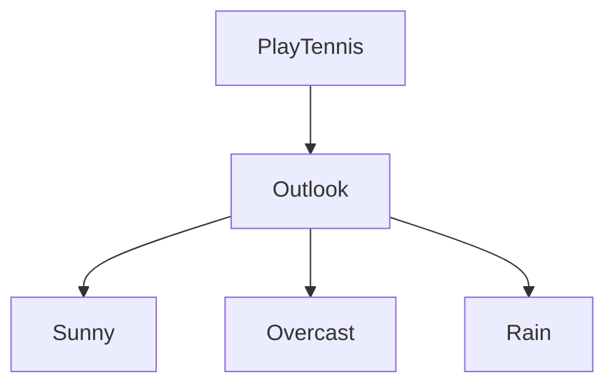

Now we need to decide which node is a leaf node and which nodes will be continued.

- Entropy of Sunny = `0`
- Entropy of Overcast = `0`
- Entropy of Rain = `0.9141`

So `Sunny` and `Overcast` are Leaf Nodes since their entropies are zero and they are **pure classes**. `Rain` Node will be chosen to continue.

Now we split the dataset by removing the attribute that's already been used.

| Day | Temperature | Humidity | Wind   | PlayTennis |
| --- | ----------- | -------- | ------ | ---------- |
| 1   | Hot         | High     | Weak   | No         |
| 2   | Hot         | High     | Strong | No         |
| 3   | Hot         | High     | Weak   | Yes        |
| 4   | Mild        | High     | Weak   | Yes        |
| 5   | Cool        | Normal   | Weak   | Yes        |
| 6   | Cool        | Normal   | Strong | No         |

Following the information gain table, 

| Attribute   | Information Gain      |
| ----------- | --------------------- |
| Humidity    | 0 (Lowest)            |
| Wind        | 0.46166               |
| Temperature | 0.21295               |

`Wind` has the next highest Information gain.

`Wind` has two values:

- Weak
- Strong

So our decision tree will become:

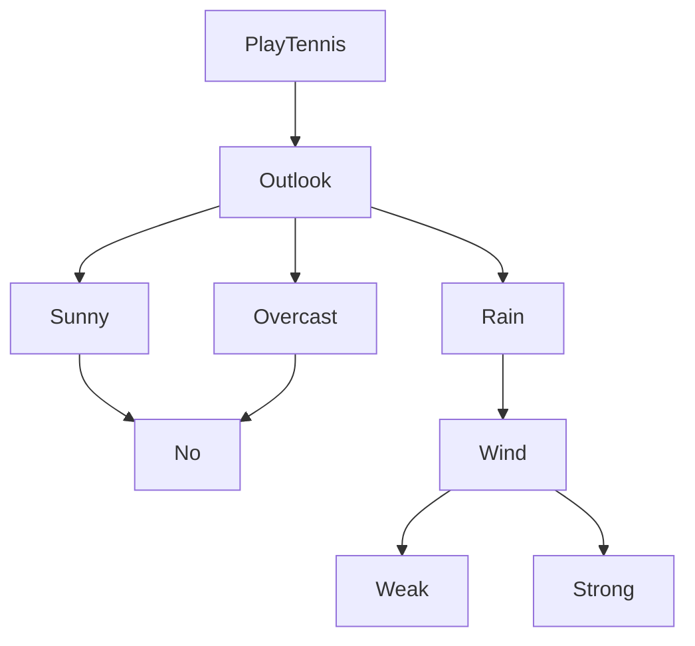

Now we will decide which is a leaf node and which node will be continued

`Entropy(Weak) = 0.8075`
`Entropy(Strong) = 0`

So `Strong` is a leaf node. `Weak` will be continued.

Now we remove `Wind` from the dataset table since it has been used.

| Day | Temperature | Humidity | PlayTennis |
| --- | ----------- | -------- | ---------- |
| 1   | Hot         | High     | No         |
| 2   | Hot         | High     | No         |
| 3   | Hot         | High     | Yes        |
| 4   | Mild        | High     | Yes        |
| 5   | Cool        | Normal   | Yes        |
| 6   | Cool        | Normal   | No         |

Following the information gain table, 

| Attribute   | Information Gain |
| ----------- | ---------------- |
| Humidity    | 0 (Lowest)       |
| Temperature | 0.21295          |

`Temperature` has the highest information gain currently.

`Temperature` has three values:

- Cool
- Mild
- Hot 

So our decision tree will become:

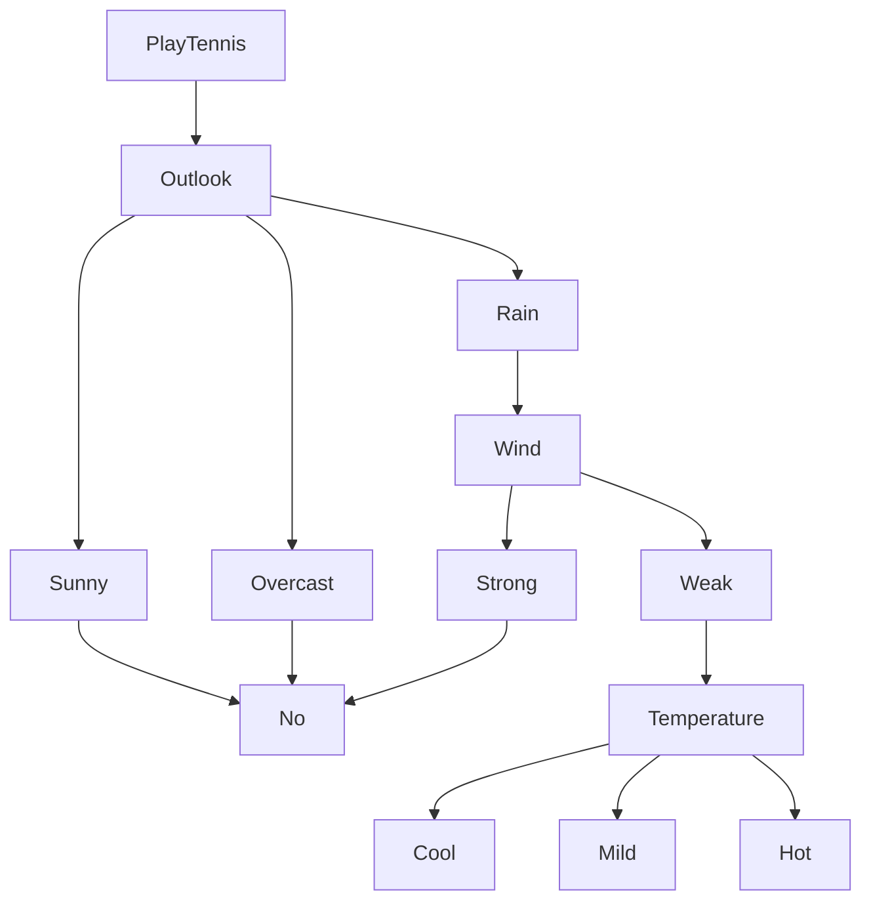


Now we decide which nodes are leaf nodes and which are to be continued.

- Cool: Entropy = `1`
- Mild : Entropy = `0`
- Hot: Entropy = `0.9141`

So, `Mild` will be a leaf node, both `Cool` and `Hot` nodes can be continued, but it's best that we use a `tie-breaker` here since `Hot`'s value is really close to `Cool`.

Generally, other algorithms have tie-breakers in them such as **random-picking**, or **alphabetical sorting** or **first occurrence**.

In our case, to keep things simple we will use **alphabetical sorting**.

So using alphabetical sorting `Cool` comes before `Hot`, so we continue `Cool` and set `Hot` as a Leaf node. 

So our decision tree will become:

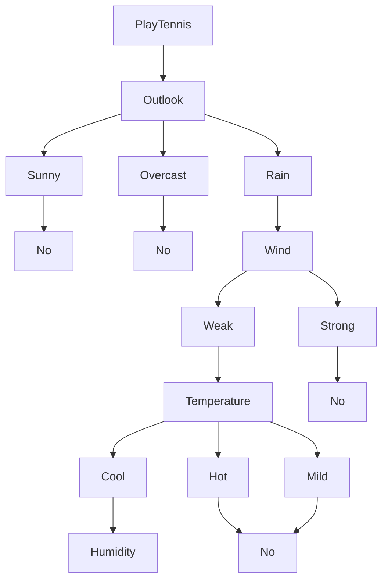


Now we remove `Temperature` from the dataset table since it has been used.

| Day | Humidity | PlayTennis |
| --- | -------- | ---------- |
| 1   | High     | No         |
| 2   | High     | No         |
| 3   | High     | Yes        |
| 4   | High     | Yes        |
| 5   | Normal   | Yes        |
| 6   | Normal   | No         |

Following the information gain table, 

| Attribute   | Information Gain |
| ----------- | ---------------- |
| Humidity    | 0 (Lowest)       |

`Humidity` is the only remaining attribute so we will split on `Humidity`.

Humidity has two values:

- High: Entropy = 1
- Normal: Entropy = 1

So our decision tree will become:


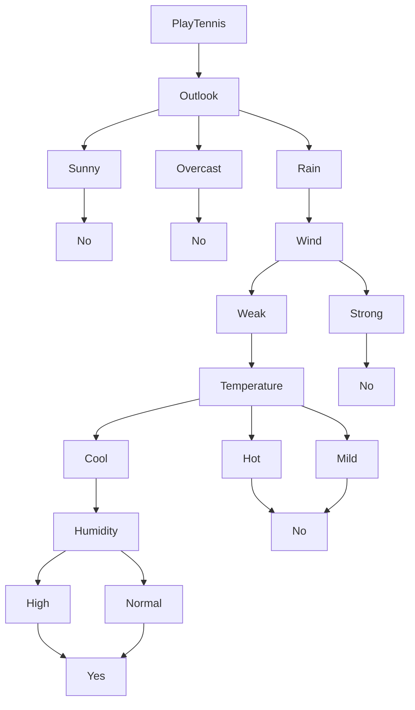


🔚 Therefore:

- No more meaningful split can be done → We **stop here** and make both `High` and `Normal` a **leaf node** using the **majority class**.
    
- But in this case:
    
    - 1 Yes, 1 No → Tie
    - So we need a tie-breaking strategy

So using alphabetical sorting `High` comes before `Normal`, so we assign `High` to `Yes` and `Normal` to `No`.

So our final decision tree becomes:

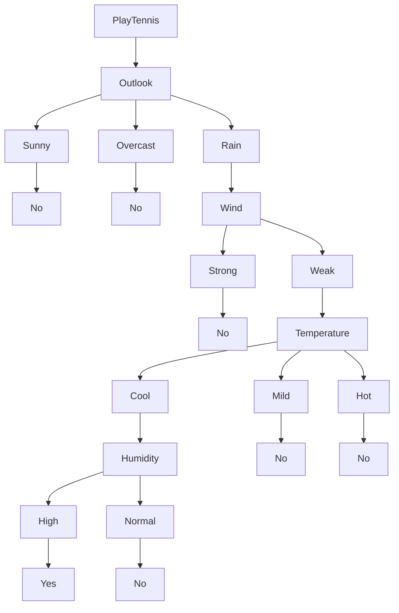

---
## 2. CART (Classification and Regression Trees)

Let's use this dataset to build the decision tree using the CART algorithm this time.

### 🌾 Dataset: Predicting if a Plant is Edible

| ID  | Color | Size  | Edible |
| --- | ----- | ----- | ------ |
| 1   | Green | Small | Yes    |
| 2   | Green | Large | Yes    |
| 3   | Red   | Small | No     |
| 4   | Red   | Large | No     |
| 5   | Green | Small | Yes    |
| 6   | Red   | Small | No     |

#### Step 1. Calculate the Gini Index of all the attributes.

In CART, the "purity" of a node is measured using **Gini Impurity**, not entropy.

The formula for Gini for a dataset $D$ is:

$$ Gini(D)=1−∑^{n}_{i=1} \ ​p^2_i​$$


or :

$$\boxed{Gini(D) \ = \ 1 \ - \ (\frac{Yes}{Total})^2 \ - \ (\frac{No}{Total})^2}$$


Where:

- $p_i$ is the probability of picking class $i$ at random.
- Lower Gini = purer set.

##### Gini Index for Color attribute

| Color | Edible |
| ----- | ------ |
| Green | Yes    |
| Green | Yes    |
| Red   | No     |
| Red   | No     |
| Green | Yes    |
| Red   | No     |

Total samples = 6

Color has two values:

- Red: 3 samples -> 3 No, 0 Yes
- Green: 3 samples -> 0 No, 3 Yes

###### For Red:

$$Gini(Red) \ = \ 1 \ - \ (\frac{0}{3})^2 \ - \ (\frac{3}{3})^2$$

$$Gini(Red) \ = \ 1 \ - \ 0 \ - \ 1$$

$$Gini(Red) \ = \ 0$$

###### For Green:

$$Gini(Green) \ = \ 1 \ - \ (\frac{3}{3})^2 \ - \ (\frac{0}{3})^2$$

$$Gini(Green) \ = \ 1 \ - \ 1 \ - \ 0 = \ 0$$

###### Weighted Gini Index for Color:

$$Weighted \ Gini \ = \ \sum{(\frac{Total \ number \ of \ samples \ of \ part}{Total \ number \ of \ entries \ in \ table} \ \times \ Gini(part))}$$

So,

$$Weighted \ Gini (Color) \ = \ [ \ (\frac{3}{6} \ \times\  0 ) \ + \ (\frac{3}{6} \ \times \ 0)\ ]$$

$$Weighted \ Gini(Color) \ = \ [ \ 0 \ + \ 0] \ = \ 0$$

---
##### Gini Index for Size Attribute

| Size  | Edible |
| ----- | ------ |
| Small | Yes    |
| Large | Yes    |
| Small | No     |
| Large | No     |
| Small | Yes    |
| Small | No     |

Total samples = 6

Size has two values:

- Small: 4 samples -> 2 No, 2 Yes
- Large: 2 samples -> 1 No, 1 Yes

###### For Small:

$$Gini(Small) \ = \ 1 \ - \ (\frac{2}{4})^2 \ - \ (\frac{2}{4})^2$$

$$Gini(Small) \ = \ 0.5$$

###### For Large:

$$Gini(Large) \ = \ 1 \ - \ (\frac{1}{2})^2 \ - \ (\frac{1}{2})^2$$

$$Gini(Large) \ = \ 0.5$$

###### Weighted Gini for Size:

$$Weighted \ Gini (Size) \ = \ [ \ (\frac{4}{6} \ \times\  0.5 ) \ + \ (\frac{2}{6} \ \times \ 0.5)\ ]$$


$$Weighted \ Gini(Color) \ = \ [ \ 0.3333 \ + \ 0.1666] \ = \ 0.4999$$

---
#### Step 2: Build the Decision Tree using the Gini Indexes

We have so far:

- `Color`: Gini = `0`
- `Size`: Gini = `0.4999`

Unlike what we do in ID3, where we choose the attribute with the highest information gain, in CART, we choose the attribute with the lowest Gini Index

A `min(0, 0.4999)` results in `0`

So we choose the starting attribute as `Color`, on the root node.

| ID  | Color | Size  | Edible |
| --- | ----- | ----- | ------ |
| 1   | Green | Small | Yes    |
| 2   | Green | Large | Yes    |
| 3   | Red   | Small | No     |
| 4   | Red   | Large | No     |
| 5   | Green | Small | Yes    |
| 6   | Red   | Small | No     |

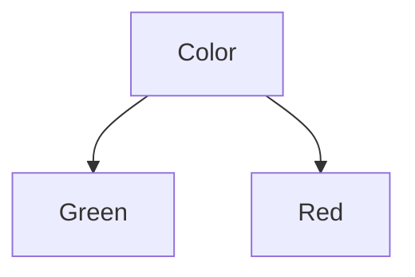

Now we need to decide which node is the leaf and which will be continued.

So we need to recalculate the Gini Indexes of Green and Red on a **node** level.

| Color | Edible |
| ----- | ------ |
| Green | Yes    |
| Green | Yes    |
| Green | Yes    |

Total samples = 3 -> 3 yes, 0 no

$$Gini(Green) \ = \ 1 \ - \ (\frac{3}{3})^2 \ - \ (\frac{0}{3})^2$$
$$Gini(Green) \ = \ 0$$

| Size | Edible |
| ---- | ------ |
| Red  | No     |
| Red  | No     |
| Red  | No     |

Total samples = 3 -> 0 yes, 3 no

$$Gini(Large) \ = \ 1 \ - \ (\frac{0}{3})^2 \ - \ (\frac{3}{3})^2$$

$$Gini(Red) \ = \ 0$$

This was technically not needed since we are still in the first split and it was calculated before, but I did this to demonstrate that we recalculate Gini index at each node level.

Now,

A leaf node is decided when an attribute has a Gini index of `0`.

Both `Green` and `Red` have a Gini index of `0`.

So neither are leaf nodes and need to be continued to split.

So we remove `Color` from the dataset as it has been used.

| ID  | Size  | Edible |
| --- | ----- | ------ |
| 1   | Small | Yes    |
| 2   | Large | Yes    |
| 3   | Small | No     |
| 4   | Large | No     |
| 5   | Small | Yes    |
| 6   | Small | No     |

Size is the only remaining attribute with a Gini index of `0.4999`, so we will split on `Size`.

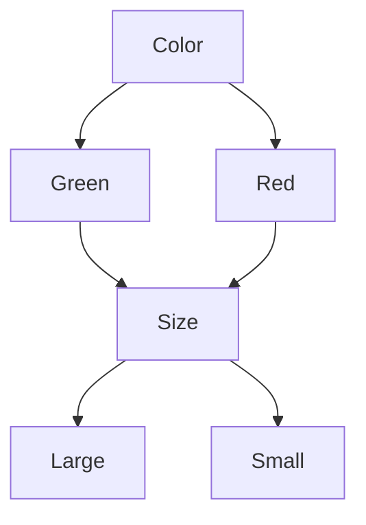

Now if we recalculate the Gini indexes of `Small` and `Large` based on this dataset (We wouldn't need to since `Red` and `Green` are evidently the two last nodes in the tree, but for practice's sake ):

We split `Large` and `Small` datasets entirely on the node level.
###### Large Node (Subset of size 2):

| Color | Edible |
| ----- | ------ |
| Large | Yes    |
| Large | No     |


So:

- Total = 2
- Class distribution = `[1 Yes, 1 No]`

$$Gini(Large) \ = \ 1 \ - \ (\frac{1}{2})^2 \ - \ (\frac{1}{2})^2 \ = \ 0.5$$

######  Small Node (Subset of size 4):

| Color | Edible |
| ----- | ------ |
| Small | Yes    |
| Small | Yes    |
| Small | No     |
| Small | No     |

- Total = 4
- Class distribution = `[2 Yes, 2 No]`

$$Gini(Small) \ = \ 1 \ - \ (\frac{2}{4})^2 \ - \ (\frac{2}{4})^2 \ = \ 0.5$$

So both are **pure nodes** and can be classified as leaf nodes.

So our final decision tree looks like:

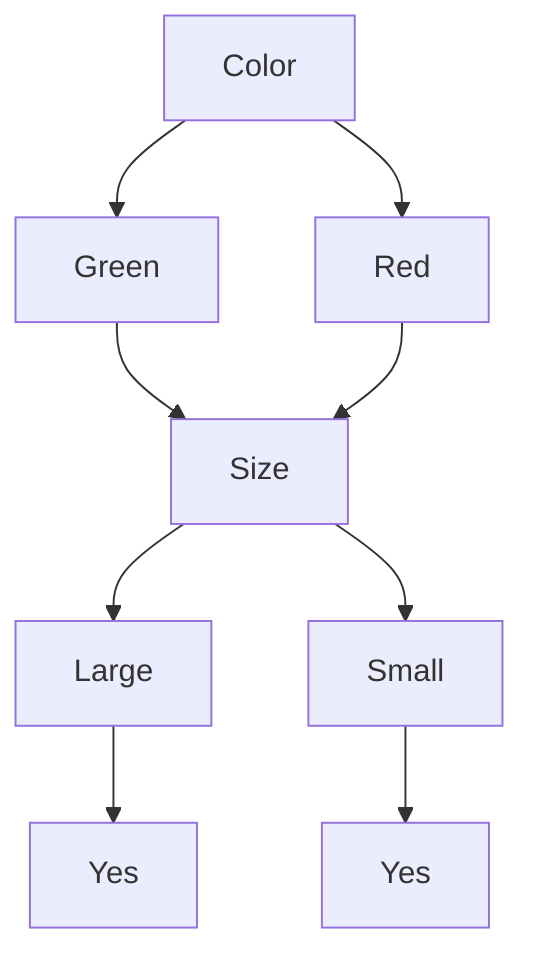

Now if you are thinking that why didn't we do the same node level calculations in ID3, we did that, however it was a different quantity, the entropy, which was done at each node (or value) level, but it was all done beforehand.

Since CART deals with only one quantity, the **Gini Index**, the precomputed values on the entire dataset are not applicable after the first split, so we need to recalculate at the node level per level.

So, even though both `Small` and `Large` in the final split had the same Gini before splitting (`0.5` when considered globally), once split into individual nodes, each subset turned out to be pure — which is only revealed through local node-level Gini calculation.

This was not necessary in this particular dataset, but of dataset of increasing attributes and sizes this step is very important.

---
# Sequential Pattern Mining

## 1. Apriori Algorithm

### 🛒 **Mini Market Basket Dataset (Transactional Format)**

We'll simulate a small grocery store’s transactions:

|Transaction ID|Items Bought|
|---|---|
|T1|Milk, Bread, Eggs|
|T2|Milk, Diapers, Beer, Eggs|
|T3|Milk, Bread, Diapers, Beer|
|T4|Bread, Milk, Diapers, Eggs|
|T5|Bread, Milk, Diapers, Beer|

which can be written as:

```python
transactions = [
    ['Milk', 'Bread', 'Eggs'],
    ['Milk', 'Diapers', 'Beer', 'Eggs'],
    ['Milk', 'Bread', 'Diapers', 'Beer'],
    ['Bread', 'Milk', 'Diapers', 'Eggs'],
    ['Bread', 'Milk', 'Diapers', 'Beer']
]
```

### Step 1: Setup the `min_support`

Let `min_support = 0.6`

---
### Step 2: Scan the entire item set and create `1-itemsets`.

`1-itemsets` can be created by **counting the individual items**. We also calculate their **support** which is done by:

$$Support(item) \ = \ \frac{count(item)}{total \ number \ of \ transactions}$$

So, there are total `5` individual items: 

- Milk
- Bread
- Beer
- Diapers
- Eggs

Now we calculate their individual counts and supports

So, from the dataset:

| Transaction ID | Items Bought               |
| -------------- | -------------------------- |
| T1             | Milk, Bread, Eggs          |
| T2             | Milk, Diapers, Beer, Eggs  |
| T3             | Milk, Bread, Diapers, Beer |
| T4             | Bread, Milk, Diapers, Eggs |
| T5             | Bread, Milk, Diapers, Beer |


| Item    | Count | Support                 |
| ------- | ----- | ----------------------- |
| Milk    | 5     | $\frac{1}{1} \ = \ 1$   |
| Bread   | 4     | $\frac{4}{5} \ = \ 0.8$ |
| Beer    | 3     | $\frac{3}{5} \ = \ 0.6$ |
| Diapers | 4     | $0.8$                   |
| Eggs    | 3     | $0.6$                   |

Now to form `1-itemsets` we need to check which items' support is greater than the `min_support`.

Here, all the items pass the threshold check so all them are good for creating `1-itemsets`.

So we have the `1-itemsets` as:

```python
[
	['Milk'],
	['Bread'],
	['Beer'],
	['Diapers'],
	['Eggs']
]
```

---
### Step 2: Generate combinations from the `1-itemsets` and check which `2-itemsets` are good.

So, from the dataset:

| Transaction ID | Items Bought               |
| -------------- | -------------------------- |
| T1             | Milk, Bread, Eggs          |
| T2             | Milk, Diapers, Beer, Eggs  |
| T3             | Milk, Bread, Diapers, Beer |
| T4             | Bread, Milk, Diapers, Eggs |
| T5             | Bread, Milk, Diapers, Beer |

Possible `2-itemsets`(without item-set duplications) are:

| Itemsets           | Count | Support                 |
| ------------------ | ----- | ----------------------- |
| `{Milk, Bread}`    | 4     | $\frac{4}{5}\ = \ 0.8$  |
| `{Milk, Beer}`     | 3     | $\frac{3}{5} \ = \ 0.6$ |
| `{Milk, Diapers}`  | 4     | $\frac{4}{5} \ = \ 0.8$ |
| `{Milk, Eggs}`     | 3     | $0.6$                   |
| `{Beer, Diapers}`  | 3     | $0.6$                   |
| `{Beer, Eggs}`     | 1     | $\frac{1}{2} \ = \ 0.2$ |
| `{Bread, Beer}`    | 2     | $0.4$                   |
| `{Bread, Diapers}` | 3     | $0.6$                   |
| `{Bread, Eggs}`    | 2     | $0.4$                   |
| `{Diapers, Eggs}`  | 2     | $0.4$                   |

Now, we remove those item-sets whose support is lesser than the `min_support`.

| Itemsets           | Count | Support |
| ------------------ | ----- | ------- |
| `{Milk, Bread}`    | 4     | $0.8$   |
| `{Milk, Beer}`     | 3     | $0.6$   |
| `{Milk, Diapers}`  | 4     | $0.8$   |
| `{Milk, Eggs}`     | 3     | $0.6$   |
| `{Beer, Diapers}`  | 3     | $0.6$   |
| `{Bread, Diapers}` | 3     | $0.6$   |

So, the `2-itemsets` are:

```python
[
	['Milk', 'Bread'],
	['Milk', 'Beer']
	['Milk', 'Diapers'],
	['Milk', 'Eggs'],
	['Bread', 'Diapers'],
	['Beer', 'Diapers'],
]
```

---
### Step 3: Generate combinations from the `2-itemsets` and generate possible `3-itemsets`.

So, from this table:

| Itemsets           | Count | Support |
| ------------------ | ----- | ------- |
| `{Milk, Bread}`    | 4     | $0.8$   |
| `{Milk, Beer}`     | 3     | $0.6$   |
| `{Milk, Diapers}`  | 4     | $0.8$   |
| `{Milk, Eggs}`     | 3     | $0.6$   |
| `{Beer, Diapers}`  | 3     | $0.6$   |
| `{Bread, Diapers}` | 3     | $0.6$   |

Using the dataset:

| Transaction ID | Items Bought               |
| -------------- | -------------------------- |
| T1             | Milk, Bread, Eggs          |
| T2             | Milk, Diapers, Beer, Eggs  |
| T3             | Milk, Bread, Diapers, Beer |
| T4             | Bread, Milk, Diapers, Eggs |
| T5             | Bread, Milk, Diapers, Beer |

Possible `3-itemsets` are:

| Itemsets                 | Count | Support |
| ------------------------ | ----- | ------- |
| `{Milk, Bread, Beer}`    | 2     | `0.4`   |
| `{Milk, Bread, Diapers}` | 3     | `0.6`   |
| `{Milk, Bread, Eggs}`    | 2     | `0.4`   |
| `{Milk, Beer, Diapers}`  | 3     | `0.6`   |
| `{Milk, Beer, Eggs}`     | 1     | `0.2`   |
| `{Milk, Diapers, Eggs}`  | 2     | `0.4`   |
| `{Bread, Beer, Diapers}` | 2     | `0.4`   |
| `{Bread, Beer, Eggs}`    | 0     | 0       |
| `{Beer, Diapers, Eggs}`  | 1     | `0.2`   |

Now we remove all the itemsets whose support are less than the `min_support`.

So, the final `3-itemsets`:

| Itemsets                 | Count | Support |
| ------------------------ | ----- | ------- |
| `{Milk, Bread, Diapers}` | 3     | `0.6`   |
| `{Milk, Beer, Diapers}`  | 3     | `0.6`   |

---
### Step 4: Calculate Confidence, Lift and generate association rules.

To recap, here are all our itemsets:

| Item    | Count | Support |
| ------- | ----- | ------- |
| Milk    | 5     | $1$     |
| Bread   | 4     | $0.8$   |
| Beer    | 3     | $0.6$   |
| Diapers | 4     | $0.8$   |
| Eggs    | 3     | $0.6$   |

| Itemsets           | Count | Support |
| ------------------ | ----- | ------- |
| `{Milk, Bread}`    | 4     | $0.8$   |
| `{Milk, Beer}`     | 3     | $0.6$   |
| `{Milk, Diapers}`  | 4     | $0.8$   |
| `{Milk, Eggs}`     | 3     | $0.6$   |
| `{Beer, Diapers}`  | 3     | $0.6$   |
| `{Bread, Diapers}` | 3     | $0.6$   |

| Itemsets                 | Count | Support |
| ------------------------ | ----- | ------- |
| `{Milk, Bread, Diapers}` | 3     | `0.6`   |
| `{Milk, Beer, Diapers}`  | 3     | `0.6`   |

Let's start with the `2-itemsets` first.

- Itemset: `{Milk, Bread}`, support = `0.8`.

Now we will interpret this association both ways:

- `Milk --> Bread`
  
  Antecedent = `Milk`
  Consequent = `Bread`
  
  Confidence of this rule = $\frac{Support(itemset)}{Support(Antecedent)} \ = \ \frac{0.8}{1} \ = \ 0.8$
  
  Lift of this rule = $\frac{Support(Antecedent \ \cup \ Consequent)}{Support(Antecedent) \ \times \ Support(Consequent)}$
  
  So, Lift = $\frac{0.8}{1 \ \times \ 0.8} \ = \ 1$ 


- `Bread --> Milk`
  
  Antecedent = `Bread`
  Consequent = `Milk`
  
  `Confidence = 0.8/0.8 = 1`
  
  `Lift = 0.8/(0.8 x 1) = 1`
  
 So for itemset `{Milk, Bread}`, we got the rules:

- `Milk --> Bread` with `lift = 1` meaning no correlation, both the items don't have a semantic match and can be bought independently.
- `Bread --> Milk` with `lift = 1` meaning no correlation, both the items don't have a semantic match and can be bought independently.

This way we can analyze all the 2-itemsets and 3-itemsets and generate a lot of association rules which can give us a lot of insight and information regarding the semantics of the purchases.

---
## 2. F-P Growth

Let's say we have this simple dataset now
### 🧾 Sample Dataset (5 transactions)

| TID | Items Bought |
| --- | ------------ |
| T1  | A, B, D, E   |
| T2  | B, C, D      |
| T3  | A, B, C, E   |
| T4  | B, E         |
| T5  | A, B, C, E   |

with `min_support = 0.6`.

  #### Step 1: Scan the dataset and count the item frequencies

- Go through the dataset once.
- Count the frequency of each item.
- Discard items below **minimum support**.
- Sort the surviving items in descending order of frequency.


So total there are 5 items, `A, B, C, D, E`

| Item | Count | Support |
| ---- | ----- | ------- |
| A    | `3`   | `0.6`   |
| B    | `5`   | `1`     |
| C    | `3`   | `0.6`   |
| D    | `2`   | `0.4`   |
| E    | `4`   | `0.8`   |

So after pruning according to the threshold, surviving items are:

| Item | Count | Support |
| ---- | ----- | ------- |
| A    | `3`   | `0.6`   |
| B    | `5`   | `1`     |
| C    | `3`   | `0.6`   |
| E    | `4`   | `0.8`   |

Sorting them in order of descending frequency:

| Item | Count | Support |
| ---- | ----- | ------- |
| B    | `5`   | `1`     |
| E    | `4`   | `0.8`   |
| A    | `3`   | `0.6`   |
| C    | `3`   | `0.6`   |

---
#### Step 2: Build the FP-Tree

- Initialize the root as `null`.
- For each transaction:
    - **Sort items** according to global frequency.
    - **Insert items as a path** into the tree.
    - If part of the path already exists, increment the count at the node.
- Store links between nodes with the same item using a **header table** for fast access.

So from our itemsets:

| Item | Count | Support |
| ---- | ----- | ------- |
| B    | `5`   | `1`     |
| E    | `4`   | `0.8`   |
| A    | `3`   | `0.6`   |
| C    | `3`   | `0.6`   |

and transactions:

| TID | Items Bought |
| --- | ------------ |
| T1  | A, B, D, E   |
| T2  | B, C, D      |
| T3  | A, B, C, E   |
| T4  | B, E         |
| T5  | A, B, C, E   |

- For `T1`, the transaction is `{A, B, C, D, E}`

We sort this in descending order of frequency and remove the unwanted items which don't meet the threshold.

So `T1`: `B, E, A, C`

We maintain the header table as follows:

```python
{
	"Root": {"B": 1}, 
	"B": {"E": 1},
	"E": {"A": 1},
	"A": {"C": 1}
}
```
with all the counts of these items as `1` since it's the first time encountering them.

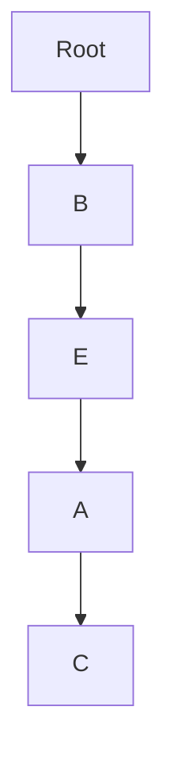

- For transaction `T2`: `{B, C, D}`

We sort and process this transaction accordingly:

`T2`: `{B, C}`

So the header table becomes:

```python
{
	"Root": {"B": 2}, 
	"B": {"E": 1},
	"E": {"A": 1},
	"A": {"C": 2}
}
```
And the tree's order remains unchanged:


- For transaction `T3`: `{A, B, C, E}`

We do the same,

`T3: {B, E, A, C}`

And update the header table:

```python
{
	"Root": {"B": 3}, 
	"B": {"E": 2},
	"E": {"A": 2},
	"A": {"C": 3}
}
```

- For transaction `T4: {B, E}`

This one's already sorted.

So we just update the header table:

```python
{
	"Root": {"B": 4}, 
	"B": {"E": 3},
	"E": {"A": 2},
	"A": {"C": 3}
}
```
- For transaction `T5: {A, B, C, E}`

We sort it : `T5: {B, E, A, C}`

And update the header table:

```python
{
	"Root": {"B": 5}, 
	"B": {"E": 4},
	"E": {"A": 3},
	"A": {"C": 4}
}
```

And our tree will look the same:


---
#### Step 3: Mine the F-P tree in a recursive extraction way to generate patterns.

- For each item (lowest frequency first):
    - Extract its **conditional pattern base** (prefix paths leading to the item).
    - Build a **conditional FP-Tree** from this base.
    - Recursively repeat the process on this new tree.
- Combine found patterns to produce all frequent itemsets.

So from our header table:

```python
{
	"Root": {"B": 5}, 
	"B": {"E": 4},
	"E": {"A": 3},
	"A": {"C": 4}
}
```

We start with the item of the lowest frequency, `A` which has a frequency of `3`.

The prefix path (nodes leading up to `A`) are:


From this path we can generate the frequent itemsets involving `A` as simply combinations with each other:

```python
{'B', 'E', 'A'}
{'B', 'E'}
{'B', 'A'}
{'E', 'A'}
{'A'}
```

Then, the next lowest frequency is `4` and two items have it, `E` and `C`.

The prefix path for `E` is:


And the frequent itemsets are:

```python
{'B', 'E'}
{'E'}
```

And prefix path for `C` is:

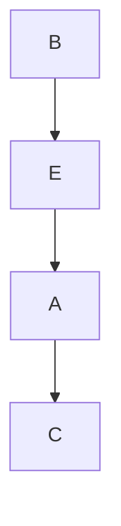


The frequent itemsets involving `C` are:

```python
{'C'}
{'A', 'C'}
{'B', 'C'}
{'E', 'C'}
{'E', 'A', 'C'}
{'B', 'A', 'C'}
{'B', 'E', 'C'}
{'B', 'E', 'A', 'C'}
```

And lastly for `B` there is no "prefix path" per se, it's just `B` itself

So the frequent itemset will just be :

```python
{'B'}
```

---
#### Step 4: Calculate the minimum support count and remove the itemsets which don't meet the support count

`min_support_count = min_support * total transactions = 0.6 * 5 = 3`

This can also be done by calculating the exact itemsets count and then calculating the their support and then check if it meets the `min_support` (like we did in apriori).

Now, from our transactions dataset:


| TID | Items Bought |
| --- | ------------ |
| T1  | A, B, D, E   |
| T2  | B, C, D      |
| T3  | A, B, C, E   |
| T4  | B, E         |
| T5  | A, B, C, E   |

And the list of all current itemsets.
```python
{'B', 'E', 'A'}
{'B', 'E'}
{'B', 'A'}
{'E', 'A'}
{'A'}

{'B', 'E'}
{'E'}

{'C'}
{'A', 'C'}
{'B', 'C'}
{'E', 'C'}
{'E', 'A', 'C'}
{'B', 'A', 'C'}
{'B', 'E', 'C'}
{'B', 'E', 'A', 'C'}

{'B'}
```

We delete the ones whose support count is not equal to `3`.

|Itemset|Appears in Tx|Support Count|Frequent?|
|---|---|---|---|
|`{'B', 'E', 'A'}`|T1, T3, T5|3|✅|
|`{'B', 'E'}`|T1, T3, T4, T5|4|✅|
|`{'B', 'A'}`|T1, T3, T5|3|✅|
|`{'E', 'A'}`|T1, T3, T5|3|✅|
|`{'A'}`|T1, T3, T5|3|✅|
|`{'E'}`|T1, T3, T4, T5|4|✅|
|`{'C'}`|T2, T3, T5|3|✅|
|`{'A', 'C'}`|T3, T5|2|❌|
|`{'B', 'C'}`|T2, T3, T5|3|✅|
|`{'E', 'C'}`|T3, T5|2|❌|
|`{'E', 'A', 'C'}`|T3, T5|2|❌|
|`{'B', 'A', 'C'}`|T3, T5|2|❌|
|`{'B', 'E', 'C'}`|T3, T5|2|❌|
|`{'B', 'E', 'A', 'C'}`|T3, T5|2|❌|
|`{'B'}`|All|5|✅|

So, our final cleaned list of frequent itemsets:

```python
[
    {'A'},
    {'B'},
    {'C'},
    {'E'},
    {'B', 'E'},
    {'B', 'A'},
    {'E', 'A'},
    {'B', 'C'},
    {'B', 'E', 'A'},
]
```
---