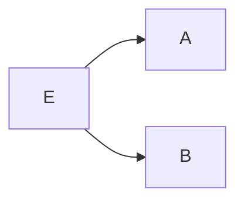

---
{"dg-publish":true,"permalink":"/data-warehousing-and-data-mining/module-4-data-streams-data-mining/","title":"Data Streams -- Data Mining -- Module 4","tags":["Data-Mining","Semester-6"],"created":"2025-04-29T12:58:59.193+05:30"}
---

---
# Index

1. [[#Data Streams]]
2. [[#Types of Data Stream]]
3. [[#Frequent Pattern Mining in Data Streams]]
4. [[#1. Lossy Counting Algorithm]]
5. [[#2. Sticky Sampling Algorithm]]
6. [[#Class Imbalance Problem]]
7. [[#1. Using a Confusion Matrix]]
8. [[#2. Precision (a.k.a Positive Predictive Value)]]
9. [[#3. Recall (a.k.a Sensitivity / True Positive Rate)]]
10. [[#4. F1 Score (harmonic mean of precision and recall)]]
11. [[#How to mitigate this problem?]]
12. [[#1. SMOTE (Synthetic Minority Oversampling Technique)]]
13. [[#2. Cost Sensitive Learning]]
14. [[#Bayesian Classification -- Naive Bayes Classifier]]
15. [[#Graph Mining]]
16. [[#1. gSpan algorithm for frequent subgraph mining]]
17. [[#Social Network Analysis (Brief Theory and a few examples)]]

---
# Data Streams

==Data stream refers to the continuous flow of data generated by various sources in real-time==. It plays a crucial role in modern technology, enabling applications to process and analyze information as it arrives, leading to timely insights and actions.

## Introduction to stream concepts

A **data stream is an existing, continuous, ordered (implicitly by entrance time or explicitly by timestamp) chain of items.** It is unfeasible to control the order in which units arrive, nor it is feasible to locally capture stream in its entirety.

It is enormous volumes of data, items arrive at a high rate.

## Types of Data Stream

- **Data stream –**

A data stream is a(possibly unchained) sequence of tuples. Each tuple comprised of a set of attributes, similar to a row in a database table.

- **Transactional data stream –**

It is a log interconnection between entities

1. Credit card – purchases by consumers from producer
2. Telecommunications – phone calls by callers to the dialed parties
3. [Web](https://www.geeksforgeeks.org/web-1-0-web-2-0-and-web-3-0-with-their-difference/) – accesses by clients of information at servers

- **Measurement data streams –**

1. Sensor Networks – a physical natural phenomenon, road traffic
2. IP Network – traffic at router interfaces
3. Earth climate – temperature, humidity level at weather stations

### Examples of Stream Source

1. Sensor Data –
    **In navigation systems, sensor data is used.** Imagine a temperature sensor floating about in the ocean, sending back to the base station a reading of the surface temperature each hour. The data generated by this sensor is a stream of real numbers. We have 3.5 terabytes arriving every day and we for sure need to think about what we can be kept continuing and what can only be archived.
    
2. **Image Data –**
    Satellites frequently send down-to-earth streams containing many terabytes of images per day. Surveillance cameras generate images with lower resolution than satellites, but there can be numerous of them, each producing a stream of images at a break of 1 second each.
    
3. **Internet and Web Traffic –**  
    A bobbing node in the center of the internet receives streams of [IP packets](https://www.geeksforgeeks.org/tcp-ip-packet-format/) from many inputs and paths them to its outputs. Websites receive streams of heterogeneous types. For example, Google receives a hundred million search queries per day.

## **Characteristics of Data Streams**

1. Large volumes of continuous data, possibly infinite.
2. Steady changing and requires a fast, real-time response.
3. Data stream captures nicely our data processing needs of today.
4. Random access is expensive and a single scan algorithm
5. Store only the summary of the data seen so far.
6. Maximum stream data are at a pretty low level or multidimensional in creation, needs multilevel and multidimensional treatment.

## **Applications of Data Streams**

1. Fraud perception
2. Real-time goods dealing
3. Consumer enterprise
4. Observing and describing on inside IT systems

## **Advantages of Data Streams**

- This data is helpful in upgrading sales
- Help in recognizing the fallacy
- Helps in minimizing costs
- It provides details to react swiftly to risk

## **Disadvantages of Data Streams**

- Lack of security of data in the cloud
- Hold cloud donor subordination
- Off-premises warehouse of details introduces the probable for disconnection

---
# Methodologies for Stream Data Processing (brief overview)

## **Main Idea:**

Because data is _fast, endless,_ and _huge_, you **can't use traditional database methods**.  
Instead, you use **smart processing methods** that:

- Handle one-pass over data
- Use limited memory
- Give approximate but useful answers
- Adapt in real-time

### 1. Sliding Window Model

**Key Idea:**  
Focus only on **recent** data by keeping a **window** (subset) of latest data points.

- Old data falls out (deleted automatically).
- Useful for applications where **recent behavior** matters more.

**Types:**

- **Fixed Window**: Size stays constant (e.g., last 1,000 records)
- **Variable Window**: Size changes based on conditions

**Example:**  
Stock price trends over the last 10 minutes, **not** all day.

---

### 2. Synopsis Data Structures

**Key Idea:**  
Instead of storing full data, store **compressed summaries** (synopses).

**Popular Synopses:**

- **Histograms** (approximate distribution of data)
- **Wavelets** (mathematical transformations)
- **Sketches** (like Count-Min Sketch)

**Advantage:**  
Memory usage is tiny but still accurate enough for analysis!

---
### 3. Sampling

**Key Idea:**  
Randomly **pick a few data points** and **ignore the rest**.

- If the sample is _representative_, you can make good guesses about the whole stream.

**Techniques:**

- **Reservoir Sampling** (for random selection when size is unknown)

**Example:**  
Select 1,000 user clicks randomly from 10 million clicks.

---
### 4. Approximate Query Processing

**Key Idea:**  
Instead of exact answers, return **fast approximate answers**.

- Answer queries like "average value" or "most frequent item" approximately.
- _Accept 1–5% error_ for 100x speed-up.

---
### 5. Load Shedding

**Key Idea:**  
If system is **overloaded**, **drop data packets** wisely.

- Goal is to lose the "least important" data first.
- Maintain high-priority processing (like fraud detection).

**Example:**  
Drop lower priority sensor data when CPU is full.

---
### 6. Concept Drift Handling

**Key Idea:**  
Detect when **data patterns change** and **adapt models**.

- If you trained your model yesterday, it may not work today.
- Concept Drift methods detect changes and trigger re-training.

---
# Frequent Pattern Mining in Data Streams

## **What’s the Goal?**

To **find frequently occurring itemsets**, sequences, or patterns **from a data stream**.

But since:

- The data is **infinite**,
- You get **only one pass**,
- And have **limited memory**,

We **can’t use traditional algorithms** like Apriori or FP-Growth directly.

So we use **stream-specific methods** to **approximate frequent patterns**.

---
## **Types of Patterns You Might Want:**

- **Itemsets:** `{milk, bread}` occurs often.
- **Sequences:** `A → B → C` often occurs.
- **Time-patterns:** Something repeats every 5 mins.

---
## **Challenges in Streaming Environment:**

1. **You can’t store the entire data.**
2. **The frequency of items may change over time.**
3. **Real-time processing is needed.**

---
## Algorithms used
### 1. Lossy Counting Algorithm

#### Purpose:
To **approximate the frequency** of items (or itemsets) in a **data stream** using **limited memory**, while tolerating a small amount of **error**.

#### 📚 **Key Parameters**:

| Term             | Description                                                               |
| ---------------- | ------------------------------------------------------------------------- |
| **ε (epsilon)**  | Error threshold — determines how much error you’re okay with (e.g., 0.01) |
| **s**            | Minimum support threshold (what frequency counts as “frequent”)           |
| **N**            | Total number of items seen so far                                         |
| **Bucket Width** | `w = ⌈1 / ε⌉` — controls how frequently we clean up                       |

---
#### Step-by-Step process

- **Stream items** one-by-one.
- **Group items into buckets** (chunks of size `w`).
- Maintain a **summary table** with:
    
    - `item`
    - `frequency (f)`
    - `delta (Δ)` = possible error in frequency.
        
- **Every w items**, do a **cleanup**:
    - Remove items where `f + Δ ≤ current bucket ID`.

---
#### ✅ **Invariant**:

- True frequency of an item is **between f and f + $\epsilon$ $\times$ N**.
- Final output contains all items with **true frequency > s*N**.
- Might include some items with frequency just below `s*N`, but not by more than ε*N.

---
#### Example 1:

Let's understand this better with a working example:

Let's say we have a data stream like this:

`a, b, a, c, a, b, d, a, b, e, b, b, a`

We have the **minimum support threshold** as : `s = 0.3`

And the **error threshold** $\epsilon \ = \ 0.2$

So the **bucket width** $w \ = \ \frac{1}{\epsilon} \ = \  5$

So there will be **5 items per bucket**.

We have total items : `13` in the stream.

So the buckets will be: 

`a, b, a, c, a`  ,   `b, d, a, b, e`  ,   `b, b, a`

Since 13 / 5  has a quotient of 2 and remainder of 3.

So two full buckets and 3 remaining items in the last bucket ("that's one way to make sense of it")

So, let's start with bucket 1:

- `a, b, a, c, a`
- Now, we need to calculate 2 things :
	- The item frequency (number of times it occurs within the bucket)
	- delta $\Delta$, which is the possible error in the frequency calculation

So, bucket **(1)**:

- a: f=3, $\Delta \ = \ 0$
- b: f=1, $\Delta \ = \ 0$
- c: f=1, $\Delta \ = \ 0$

All good so far, and since this is the first bucket, the errors of the items are zero as these are recorded for the first time.

Time to clean up, see if anything meets this condition:

$f \ + \ \Delta \leq  b_{current}$

$b_{current}$  is 1 right now.

State before cleanup:

| Item | f   | $\Delta$ |
| ---- | --- | -------- |
| a    | 3   | 0        |
| b    | 1   | 0        |
| c    | 1   | 0        |


Check all:

- `a: 3 + 0 = 3 > 1` → **Keep**
- `b: 1 + 0 = 1 = 1` → **Remove**
- `c: 1 + 0 = 1 = 1` → **Remove**


After cleanup, remaining items:

| Item | f   | $\Delta$ |
| ---- | --- | -------- |
| a    | 3   | 0        |

---

Proceeding to bucket **(2)**:

`b, d, a, b, e`

Stream: `a, b, d, e, a`  
**Current bucket number: `b_current = 2`**

Process each item:

- `b` → new → `f = 1`,  $\Delta = b_{current} - 1 \ = \ 2 \ - \  1 \ = \ 1$
- `d` → new → `f = 1`, $\Delta \ = \ 1$ (similarly)
- `a` → exists → `f = 3 → 4`, $\Delta \ = \ 0$
- `b` → exists → `f = 1 → 2` , $\Delta \ = \ 0$
- `e` → new → `f = 1`,  $\Delta \ = \ 1$, (similarly)


But why did we do this?

The **core idea** of Lossy Counting is:

> “Keep a **compact summary** of items that might be frequent, and **toss out** those that are definitely not frequent.”

This is because **we can't store all items**, so we periodically **remove items that don’t stand a chance** of being frequent, based on their observed counts.

- So we say:
> “It could have occurred **once per bucket before**, and I wouldn’t know — that’s the error.”

So we assume **worst case error = current bucket ID - 1**.

Now, cleanup time!

We remove all the items which don't match the condition:

$f \ + \ \Delta \ \leq \ b_{current}$

That means:

- The item has **such low frequency and high error**, that it can’t possibly reach the minimum threshold.

$b_{current} \ = \ 2$, so we remove all items whose $f \ + \ \Delta  \ \leq \ 2$  

State before cleanup:

| Item | f   | $\Delta$ |
| ---- | --- | -------- |
| a    | 4   | 0        |
| b    | 2   | 1        |
| d    | 1   | 1        |
| e    | 1   | 1        |

🧹 Cleanup Rule: remove if `f + Δ ≤ b_current = 2`

- `a: 4 + 0 = 4 > 2` → Keep
- `b: 2 + 1 = 3 > 2` → Keep
- `d: 1 + 1 = 2 = 2` → **Remove**
- `e: 1 + 1 = 2 = 2` → **Remove**

✅ After cleanup:

| Item | f   | $\Delta$ |
| ---- | --- | -------- |
| a    | 4   | 0        |
| b    | 2   | 1        |

---

Moving on to bucket 3:

`b, b, a`

We have:

- b: f = 2 + 1, $\rightarrow$  f = 3,  $\Delta \ = \ 1$
- b: f = 3 + 1 $\rightarrow$ f = 4,  $\Delta \ = \ 1$
- a: f = 4 + 1 $\rightarrow$ f = 5,  $\Delta \ = \ 0$

Now, let's do a cleanup for this bucket

The condition will be the same, prune all items whose $f \ + \ \Delta \ \leq \ b_{current}$ .

$b_{current} \ = \ 3$  so we will remove all items whose $f \ + \ \Delta \ \leq \ 3$ 

State before cleanup:

| Item | f   | Δ   |
| ---- | --- | --- |
| a    | 5   | 0   |
| b    | 4   | 1   |

Now you might ask, why is b's $\Delta \ = \ 1$? We already found b in bucket 2 so shouldn't the $\Delta$  be set to zero now?

Here's another core part of lossy counting which says:

>When an item is **already being tracked**, we **only increment its frequency** — we **do not change its delta**.
>
>We only assign a delta when a **new** item is first added to the data structure (i.e., it wasn’t being tracked in the previous bucket).
 

**In Bucket 2**:

- `b` was added with:
    - `f = 1` (when it first appeared)
    - `Δ = b_current - 1 = 2 - 1 = 1`
- Then it appeared again → `f = 2`

So at the end of Bucket 2:

- `b: f = 2`, `Δ = 1`

 **In Bucket 3**:

- `b` already exists in the summary → so we **only increment `f`**
- It appears **twice**, so:
    - `f = 2 → 3 → 4`
    - `Δ = 1` (unchanged)

So, with that clear, let's proceed to do the cleanup for bucket 3

- `a: 5 + 0 = 5 > 3` → Keep
- `b: 4 + 1 = 5 > 3` → Keep

---

This is the final summary of all the items are cleanup from all the buckets.

| Item | f   | Δ   |
| ---- | --- | --- |
| a    | 5   | 0   |
| b    | 4   | 1   |

Now, to find the frequent items, we use this condition:

**Keep all items whose:**  $f \ + \ \Delta \geq \ sN$  since any item whose sum of frequency and $\Delta$  is greater than $sN$  **might be frequent**

**Don't keep items whose**: $f \ \lt \ (s \ - \ \epsilon) N$  since these items **are definitely NOT frequent**.

where $N$  is the total number of items in the stream, which is 13.
$s$ is the chosen minimum support threshold, which is 0.3

So one could say that: "I could just calculate $f \ + \ \Delta \geq \ sN$  and be done with it"?

You could, but here's a _subtle difference_ and why it's better not to do that blindly

If you only check $f \ + \ \Delta \geq \ sN$:

- You’ll **only** output the **definitely frequent** items.
- You might **miss** some items that are _possibly frequent_ due to the sampling error margin (`ε`).
- This is a **conservative** approach — safe but might underreport.

If you check $f \ \lt \ (s \ - \ \epsilon) N$ as well:

- You’ll output **all potential frequent** items, including borderline cases.
- This gives a **more complete** view, while still **bounded by the ε error**.
- It’s the **recommended practice** in Sticky Sampling, especially in data mining settings where **recall matters**.


$sN \ = \ 3.9$
$(s \ - \ \epsilon)N \ = \ (0.3 \ - \ 0.2) \ \times \ 13 \ = \ 1.3$


So :

So for $a$, $5 \ + \ 0 \  \gt \ 3.9$  and $5 \ \gt \ 1.3$, so we keep it.

for $b$, $4 \ + \ 1 \ = \ 5 \gt \ 3.9$  and $f \ \gt \ 1.3$, so we keep it.

There are no further items to be processed.

---
#### ✅ Final Output:

Frequent Items for `s = 0.3`:

- `a`
- `b`

---
### 2. Sticky Sampling Algorithm

Like Lossy Counting, **Sticky Sampling** also approximates frequent itemsets in a stream using limited memory, but it uses a _probabilistic_ approach instead of fixed bucket intervals.

#### 📌 **Core Concepts:**

- You want to track items that occur **frequently enough** in the stream with some **probability of correctness**.
    
- Works with three parameters:
    - `s`: **Support threshold** (e.g., 0.3)
    - `ε`: **Error bound** (how much error you're willing to allow)
    - `δ`: **Failure probability** (e.g., 0.1 means 90% confidence)


Now hold up a second, what is this **failure probability**???

In Sticky Sampling, the failure probability `δ` is a **theoretical guarantee** on the **quality of the output**. It's not _used_ during frequent item extraction directly, but it **influences how the algorithm behaves during sampling**.

#### So Why Do We Set δ?

Because Sticky Sampling is a **probabilistic approximation algorithm**, it doesn’t track every item. Instead, it **randomly samples** items to reduce memory and time usage.

The tradeoff is:

> "We might miss some frequent items due to random chance."

To control _how likely_ we are to miss them, we set:

- `ε` — the allowed error (controls how far off we can be)
- `δ` — the failure probability (controls **how often** that error bound may be violated)

So:

- **δ = 0.1** means:  
    _With 90% probability, the algorithm's output will be within the specified error ε._

---
#### **How it Works:**

1. **Start with a sampling rate** `r = 1` (initially sample every item)
2. As more items arrive, **reduce the sampling rate** to `1/r` over time (i.e., don’t track every item anymore)
3. When an untracked item is sampled:
   
    - Add it with frequency `1` and **a potential error margin**
      
4. Periodically, **increase `r`** to reduce memory usage
5. Use a similar cleanup criterion: items with low `(f + Δ)` can be dropped
6. In the end, output all items where `f ≥ (s - ε) * N`

---
#### 🔍 Key Difference from Lossy Counting:

|Feature|Lossy Counting|Sticky Sampling|
|---|---|---|
|Cleanup Schedule|After fixed-size buckets|After exponentially spaced intervals|
|Tracking|Deterministic|Probabilistic (sampling)|
|Memory Usage|Depends on `1/ε`|Also depends on `1/ε` and `log(1/δ)`|

---
#### 🔁 How the Sampling Rate Works

- The sampling rate `r` controls **how often** you track a new, previously unseen item:
    - At `r = 1`, you track every new item
    - At `r = 2`, you only track new items with a probability of `1/2`
    - At `r = 4`, you track new items with probability `1/4`
      
- You **keep increasing `r`** as the stream grows to **control memory usage** — **because you can’t track everything forever in an infinite stream**.

Let’s say:

- `r` = current **sampling rate**    
- A new item (not yet tracked) arrives in the stream

Then the probability that you **track** this new item is:


$\boxed{p = \frac{1}{r}}$

This means:

- When `r = 1`, you always track new items — perfect tracking.
- When `r = 2`, you track new items with 50% chance — slightly selective.
- When `r = 4`, you track new items with 25% chance — more selective.

This gradual drop in probability allows us to **preserve memory** as the stream grows larger, while still giving **frequent items a good chance** to be included early and maintained.

Still not clear on how this **probability helps us to control memory growth**?

### 🎯 Why the Probability Helps: Memory vs Accuracy Trade-off

#### 1. **Streams are infinite** (or extremely long)

- We can't store every item — that would consume unbounded memory.
- So we sample _some_ items to represent the stream efficiently.

---

#### 2. **Probabilistic Tracking Controls Memory Growth**

- As the stream grows longer, we can’t afford to keep tracking new low-frequency items.
- So we _gradually reduce_ the chance of tracking new items.

This is controlled by `r`, the **sampling rate**:

- At the start (`r = 1`), you’re generous — track everything.
- Later (`r = 2`, `4`, `8`, ...) you become pickier — track only the most _frequent_ or _lucky_ new items.

---

#### 3. **Result: Bounded Memory**

- The number of items you're tracking is always **proportional to**:

$$\frac{1}{\epsilon} \ \cdot \ log(\epsilon \ \cdot N)$$
    
    which is _logarithmic_ in stream length `N`.
    

So even if the stream is millions of items long, Sticky Sampling can track it using **limited, predictable memory** — and that’s all thanks to this decreasing **probability of tracking new items**.


---
#### 🔼 When Do You Update `r`?

The update rule is usually:

> **Every time the total number of processed items `N` exceeds `1/ε × r`**, increase `r`.

This ensures that memory stays roughly proportional to `1/ε × log(1/δ)`.

How does this $r \ = \ \frac{1}{\epsilon} \ \times \ \log(\frac{1}{\delta})$  help us?

This expression doesn't control the **dynamic updates** of `r`. Instead, it gives us the **maximum value** that `r` can reach _over the entire stream_, ensuring that we **bound memory usage** while maintaining the desired accuracy and confidence.

Kind of like setting the maximum cap of $r$.

This formula tells you:

- "If I allow an error of at most `ε` and want to be **at least (1 − δ) confident**, then I **never need to increase `r` beyond** this bound."
- It helps keep memory usage **finite and predictable**, even as the stream grows infinitely.

---
#### 🧠 Why?

Because we want to:

- **Limit memory** by not keeping every single low-frequency item forever.
- Still give high-frequency items a good chance to be **sampled and tracked**, even at low sampling rates.
- Keep a probabilistic guarantee that frequent items (support ≥ `s`) will still appear with high confidence

---
#### 📌 Important Note:

Once an item is **tracked**, you **always update its frequency** when you see it again — you don’t apply any probability anymore.

Only **new, untracked** items are subject to probabilistic inclusion using `1/r`.

#### ✅ So in Summary:

| Concept                 | Meaning                                                               |
| ----------------------- | --------------------------------------------------------------------- |
| `r`                     | Sampling rate — controls how likely you are to track a new item       |
| Probability `p`         | $p \ = \ \frac{1}{r}$                                                 |
| When to increase `r`    | When total items `N ≥ 1/ε × r`                                        |
| What happens after that | You increase `r → 2r`, and new items are sampled less frequently      |
| Already tracked items   | Continue updating normally                                            |
| Purpose                 | Keeps memory usage low while ensuring high-frequency items are caught |

---
#### Example

Let's do an example to understand this more clearly:

Let’s use a small stream and these parameters:

- **Stream**: `a, b, a, c, a, b, d, a, b, e, b, b, a` (same as before, length = 13)
- **Support threshold `s`** = 0.3
- **Error bound** $\epsilon \ = \ 0.1$
- **Failure probability** $\delta \ = \ 0.1$ (i.e., 90% confidence)

- We start with a **sampling rate** `r = 1` → we track **every item**
- The total stream seen so far: `N = 0`

We'll now process the stream item by item.

##### Pass 1: Sampling Rate `r = 1`

We process each item and add it to the frequency summary:

| Item | Frequency |
| ---- | --------- |
| a    | 5         |
| b    | 4         |
| c    | 1         |
| d    | 1         |
| e    | 1         |

All items were tracked since `r = 1` → sample everything.

So we have total number of items $N \ = \ 12$

The condition for updating $r$  is if $N \ \geq \ \frac{1}{\epsilon} \ \times \ r$

So, currently $12 \ \geq \ \frac{1}{0.1} \ \times \ 1$

or $12 \ \gt 10$ 

So we update the sampling rate by this rule : $r \ = \ 2r$

So $r \ = \ 2 \times 1 \ = \ 2$

---
#### What to do next?

- The algorithm would look for any **new, previously untracked items** with a probability of $\frac{1}{2}$.
- Already tracked items like `a`, `b`, `c`, `d`, `e` would just have their frequencies updated, not their probabilities.

So let's assume if this were the **end of stream**. What would we do now?

This is our item summary

| Item | Frequency |
| ---- | --------- |
| a    | 5         |
| b    | 4         |
| c    | 1         |
| d    | 1         |
| e    | 1         |

- Total items seen: `N = 12`
- Current sampling rate `r = 2`
- Minimum support threshold: `s = 0.3`
- $\epsilon$,  error tolerance = `0.1` 
- $sN \ = \ 12 \ \times \ 0.3 \ = \ 3.6$ 
- $(s \ - \ \epsilon)N \ = \ 2.4$


The condition is the same here:

We report all items which have:

$$f \ \geq \ (s \ - \ \epsilon)N$$

And we are **guaranteed to catch items which have**:

$$f \ \geq \ s \cdot \ N$$

The items which don't satisfy $f \ \geq \ (s \ - \ \epsilon)N$  are **NOT frequent**.


So, 

| Item | Frequency | $f \ \geq \ (s \ - \ \epsilon)N$ | $f \ \geq \ s \cdot \ N$ | **Keep** |
| ---- | --------- | -------------------------------- | ------------------------ | -------- |
| a    | 5         | `5 > 2.4`, True                  | `5 > 3.6`, True          | Yes      |
| b    | 4         | `4 > 2.4`, True                  | `4 > 2.4`, True          | Yes      |
| c    | 1         | `1 < 2.4`, False                 | `1 < 2.4`, False         | No       |
| d    | 1         | `1 < 2.4`, False                 | `1 < 2.4`, False         | No       |
| e    | 1         | `1 < 2.4`, False                 | `1 < 2.4`, False         | No       |

---
#### Final Output:

Only items **a** and **b** are reported as frequent items in this stream using **Sticky Sampling**.

---

Now if we were to **continue the stream**:

```
f, a, b, a, g, h, a, b, b, b
```

Now `N = 23`.

Let's recompute if $N \geq \ \frac{1}{\epsilon} \ \times \ r$,  $23 \ \gt \ 20$

So we can update the sampling rate to $2r$  or 4.

So now new items will be tracked with a probability of $\frac{1}{4}$ or there's a $25 \%$ chance that new items will be tracked.

As $r$ continues to decrease, the probability of tracking new items becomes, even less.

If $r \ = \ \frac{1}{16}$  as of the moment, then there would be a $6.25 \%$ chance that new items will be tracked, thus controlling the memory growth.


Time to extract the frequent items:


| Item | Frequency |
| ---- | --------- |
| a    | 8         |
| b    | 8         |
| c    | 1         |
| d    | 1         |
| e    | 1         |
| f    | 1         |
| g    | 1         |
| h    | 1         |

So, 

- Total items seen: `N = 23`
- Current sampling rate `r = 4`
- Minimum support threshold: `s = 0.3`
- $\epsilon$,  error tolerance = `0.1` 
- $sN \ = \ 23 \ \times \ 0.3 \ = \ 6.9$ 
- $(s \ - \ \epsilon)N \ = \ 4.6$


| Item | Frequency | $f \ \geq \ (s \ - \ \epsilon)N$ | $f \ \geq \ s \cdot \ N$ | **Keep** |
| ---- | --------- | -------------------------------- | ------------------------ | -------- |
| a    | 8         | `8 > 4.6`, True                  | `8 > 6.9`, True          | Yes      |
| b    | 8         | `8 > 4.6`, True                  | `8 > 6.9`, True          | Yes      |
| c    | 1         | `1 < 4.6`, False                 | `1 < 6.9`, False         | No       |
| d    | 1         | `1 < 4.6`, False                 | `1 < 6.9`, False         | No       |
| e    | 1         | `1 < 4.6`, False                 | `1 < 6.9`, False         | No       |
| f    | 1         | `1 < 4.6`, False                 | `1 < 6.9`, False         | No       |
| g    | 1         | `1 < 4.6`, False                 | `1 < 6.9`, False         | No       |
| h    | 1         | `1 < 4.6`, False                 | `1 < 6.9`, False         | No       |

---
#### Final Output:

Only items **a** and **b** are reported as frequent items in this stream using **Sticky Sampling**.

---
# Class Imbalance Problem

https://www.chioka.in/class-imbalance-problem/

It is the problem in machine learning where **the total number of a class of data (positive) is far less than the total number of another class of data (negative)**. This problem is extremely common in practice and can be observed in various disciplines including fraud detection, anomaly detection, medical diagnosis, oil spillage detection, facial recognition, etc.

## Why is it a problem?

==Most machine learning algorithms and works best when the number of instances of each classes are roughly equal. When the number of instances of one class far exceeds the other, problems arise==. This is best illustrated below with an example.

### Example 1

Given a dataset of transaction data, we would like to find out which are fraudulent and which are genuine ones. Now, it is highly cost to the e-commerce company if a fraudulent transaction goes through as this impacts our customers trust in us, and costs us money. So we want to catch as many fraudulent transactions as possible.

If there is a dataset consisting of 10000 genuine and 10 fraudulent transactions, the classifier will tend to classify fraudulent transactions as genuine transactions. The reason can be easily explained by the numbers. Suppose the machine learning algorithm has two possibly outputs as follows:

1. Model 1 classified 7 out of 10 fraudulent transactions as genuine transactions and 10 out of 10000 genuine transactions as fraudulent transactions.
2. Model 2 classified 2 out of 10 fraudulent transactions as genuine transactions and 100 out of 10000 genuine transactions as fraudulent transactions.

If the classifier’s performance is determined by the number of mistakes, then clearly Model 1 is better as it makes only a total of 17 mistakes while Model 2 made 102 mistakes. However, as we want to minimize the number of fraudulent transactions happening, we should pick Model 2 instead which only made 2 mistakes classifying the fraudulent transactions. Of course, this could come at the expense of more genuine transactions being classified as fraudulent transactions, but will be a cost we can bear for now. Anyhow, a general machine learning algorithm will just pick Model 1 than Model 2, which is a problem. In practice, this means we will let a lot of fraudulent transactions go through although we could have stopped them by using Model 2. This translates to unhappy customers and money lost for the company.

---
### Example 2:


You're dealing with a dataset with two classes:

- **Minority class** (positive): Only 10 examples
- **Majority class** (negative): 990 examples  
    → Total = 1000 instances

This results in **severe imbalance**:

$$\frac{10}{1000} \ = \ 1\% \ minority \ class$$

### ❗ Why is this a problem?

- If a classifier **always predicts "negative"**, it will be correct 99% of the time.
- That means a **very high accuracy**, but **completely useless** in real-world scenarios where the positive class is important (e.g., fraud detection, cancer diagnosis).
- Since cases like **frauds** or **cancer diagnosis** **often hide under those 1 percentages**, or sometimes **even lower than that**. 

---
## 📊 Common Evaluation Metrics Under Class Imbalance

In class imbalance, you're usually trying to detect a **rare but important event**, like fraud (positive class). So, accuracy becomes meaningless. We use more **targeted metrics**.

### 1. Using a Confusion Matrix


 A confusion matrix is ==a table that displays the performance of a classification model by comparing its predictions to the actual labels of the data, especially highlighting the counts of correct and incorrect predictions for each class==. This helps analyze where the model is struggling, particularly with under-represented classes, and is crucial for understanding the model's effectiveness in imbalanced datasets.

A confusion matrix summarizes predictions:

| Truth           | Predicted Positive     | Predicted Negative     |
| --------------- | ---------------------- | ---------------------- |
| Actual Positive | **TP**(True Positive)  | **FN**(False Negative) |
| Actual Negative | **FP**(False Positive) | **TN**(True Negative)  |

A confusion matrix is often used in **binary classification problems**, where operating under class imbalance, ML models often classify differently than what's expected between **two categories**.

**Example:**  
Imagine we have 100 test samples:

- 10 are actual positive (e.g., fraud)
- 90 are actual negative (e.g., normal)

Let’s assume:

- Out of the 8 predicted as fraud:
    
    - 5 were truly fraud → ✅ **True Positives (TP) = 5**
    - 3 were normal but wrongly flagged → ❌ **False Positives (FP) = 3**

So among the 90 actual normal cases:

- 3 were misclassified → FP = 3
- So, the remaining 87 were correctly predicted as normal → ✅ **True Negatives (TN) = 87**

And among the 10 actual frauds:

- 5 were detected → TP = 5
- 5 were missed and wrongly predicted as normal → ❌ **False Negatives (FN) = 5**


So this is our confusion matrix:

| Truth           | Predicted Positive | Predicted Negative |
| --------------- | ------------------ | ------------------ |
| Actual Positive | **TP** = 5         | **FN** = 5         |
| Actual Negative | **FP** = 3         | **TN** = 87        |

---
### 2. Precision (a.k.a Positive Predictive Value)

Precision answers the important question of:

>"Out of all the cases I predicted as _positive_, how many were actually positive?"

$$Precision \ = \ \frac{TP}{TP \ + \ FP}$$

- **High precision** means: When the model says "fraud," it’s usually right.
- Important when **false positives are costly** (e.g., spam filters, arresting people).

I mean, **you wouldn't someone to be wrongly arrested, or your mail system to wrongly classify an important email as spam, right?**.

---
### 3. Recall (a.k.a Sensitivity / True Positive Rate)

Recall answers this important question:

> "Out of all the actual positives, how many did I catch?"

$$Recall \ = \ \frac{TP}{TP \ + \ FN}$$

- **High recall** means: The model catches most of the actual frauds.
- Important when **missing positives is dangerous** (e.g., fraud detection, cancer screening).

**You most certainly wouldn't want to miss a fraud detection, or a cancer screening, right?**

---
### 4. F1 Score (harmonic mean of precision and recall)

> "Balance between precision and recall"

$$F1 \ Score \ = \ \frac{2 \ \cdot \ Precision \ \cdot \ Recall}{Precision \ + \ Recall}$$

- F1 score is useful when you **want balance** and care about both FP and FN.
- It punishes extreme imbalance (e.g., very high precision but very low recall).

---
So in our case, from the confusion matrix, we see that:


| Truth           | Predicted Positive | Predicted Negative |
| --------------- | ------------------ | ------------------ |
| Actual Positive | **TP** = 5         | **FN** = 5         |
| Actual Negative | **FP** = 3         | **TN** = 87        |


The model detected 5 frauds (TP = 5), but:

- It **missed** 5 other actual frauds → FN = 5
- It also wrongly flagged 3 normal transactions as frauds → FP = 3

Then:

$$Precision \ = \ \frac{5}{5 \ + \ 3} \ = \ \frac{5}{8} \ = \ 0.625 \ or \ 62.5\%$$


$$Recall \ = \ \frac{5}{5 \ + \ 5} \ = \ 0.5 \ or \ 50\%$$

$$F1 \ Score \ = \ \frac{2 \ \cdot \ 0.625 \ \cdot \ 0.5}{0.625 \ + \ 0.5} \ \approx \ 0.555 \ or\ \ 55.5\%$$

So what do these metrics **mean**?

### ✅ Precision = **62.5%**

> "Out of all the cases the model predicted as fraud, **62.5% were actually fraud**."

- So **37.5%** of the flagged frauds were **false alarms** (false positives).
- This tells us the model is **moderately precise**, but still wastes some effort on false positives.

---

### 📉 Recall = **50%**

> "Out of all the actual frauds in the data, the model **only caught half of them**."

- So it **missed** 50% of actual frauds → that's **5 real frauds left undetected**.
- This is **critical** in domains like fraud detection or medical diagnostics, where **missing positives is risky**.

---
### ⚖️ F1 Score = **55.5%**

> "The overall balance between catching frauds and avoiding false alarms is just slightly above average."

- F1 score is **not great here**, because recall is dragging it down.
- It shows your model is **not confident or consistent** in handling fraud detection.

---
### 🔍 Summary Table

|Metric|What it measures|High when...|
|---|---|---|
|Precision|Correctness of positive predictions|FP is low|
|Recall|Coverage of actual positives|FN is low|
|F1 Score|Balance of precision and recall|Both FP and FN are low|

|Metric|Value|Interpretation|
|---|---|---|
|Precision|62.5%|Somewhat accurate when it does say “fraud,” but makes mistakes 37.5% of the time|
|Recall|50%|Misses **half of actual fraud cases**, which is risky|
|F1 Score|55.5%|Model needs tuning — it’s **mediocre** at both catching frauds and being accurate|

---
### ⚠️ Why This Is a Problem (Class Imbalance Angle):

If your dataset has **92 normal** cases and **10 frauds**, the imbalance ratio is **~1:9**.

- The model is **biased toward the majority class** (normal transactions).
- Even a dumb model that **always predicts 'normal'** would be 92% accurate — but it would **miss all frauds**.

---
## How to mitigate this problem?

Now knowing what the Class Imbalance Problem is and why is it a problem, we need to know how to deal with this problem.

We can roughly classify the approaches into two major categories: sampling based approaches and cost function based approaches.


### 1. Data Level Methods

#### 🔁 a. **Resampling Techniques**

- **Oversampling**: Add more copies of the minority class (frauds, in our case) to balance the dataset.
    
    - ✅ Improves recall
    - ❌ Risk of overfitting (especially with simple duplication)
        
- **Undersampling**: Remove examples from the majority class (normal cases) to match the minority class.
    
    - ✅ Reduces bias toward majority
    - ❌ Risk of losing important information

#### 🔬 b. **SMOTE (Synthetic Minority Over-sampling Technique)**

- Creates **synthetic data** for the minority class by **interpolating between actual minority examples**.
    
- ✅ Better than simple oversampling
- ❌ May generate borderline or noisy samples

---
### 🧠 **2. Algorithm-Level Methods**

These modify the **learning process** rather than the data.

#### ⚖️ a. **Cost-Sensitive Learning**

- Assigns **higher penalties to misclassifying minority class** (e.g., missing a fraud).
- Example: Use a **cost matrix** where FN for fraud is costlier than FP for normal.

#### 📚 b. **Weighted Classifiers**

- Modifies learning algorithms (e.g., Decision Trees, SVM, Neural Networks) to **weigh errors unequally**.
- Often used in **scikit-learn** via the `class_weight` parameter.

#### 👥 c. **Ensemble Methods (like Boosting & Bagging)**

- Use multiple classifiers that **focus more on minority class errors**.
- Example: **Balanced Random Forest** or **AdaBoost with cost-sensitive base learners**

---

### 📊 **3. Evaluation Metrics**

Standard accuracy is misleading under imbalance. Use:

- **Precision, Recall, F1-score** (as you just saw)
- **ROC-AUC**: Measures tradeoff between TPR and FPR
- **PR-AUC**: Better when data is _heavily_ skewed

---
Don't worry we won't study this many, only just two popular algorithms:

## 1. SMOTE (Synthetic Minority Oversampling Technique)

**SMOTE (Synthetic Minority Oversampling Technique)** is a **sampling method** for imbalanced datasets. It artificially generates new instances of the **minority class** by interpolating between existing examples.

---
### 🤔 Why not just duplicate samples?

If you just duplicate rare cases, models might **overfit**, i.e., memorize those few examples. SMOTE avoids this by **synthesizing** new, slightly varied examples — helping the model generalize.

---
## 🔧 How SMOTE Works (Step-by-Step)

1. **For each minority class sample** `x`, do:
2. Find `k` **nearest neighbors** among other minority class samples (default: `k=5`).
3. Randomly pick **one** neighbor `x`.
4. Generate a new synthetic sample between them:


$$new \ sample \ = \ x \ + \ \lambda \ \cdot \ (x' \ - \ x)$$

where $\lambda \ \in [0, \ 1]$ is a random number.

---
## Example 

### Imagine we have 3 minority class points:

| Sample | X₁  | X₂  | Class |
| ------ | --- | --- | ----- |
| A      | 1   | 1   | 1     |
| B      | 1   | 2   | 1     |
| C      | 2   | 1   | 1     |
| D      | 3   | 3   | 0     |
| E      | 3   | 4   | 0     |
| F      | 4   | 3   | 0     |
| G      | 4   | 4   | 0     |

#### Step 1: Identify majority and minority classes

- **Class 1** → Appears in 3 rows $\rightarrow$ **Minority class**
- **Class 0** → Appears in 4 rows $\rightarrow$ **Majority class**


Let's focus on the minority class:

Samples A (1,1), B (1,2), C (2,1)

#### Step 2: Find `k-nearest` neighours

We’ll now apply **SMOTE** with `k = 2`, and generate 1 new synthetic sample for point **A**.

But what does this `k` parameter do?

- `k` is the **number of nearest neighbors** SMOTE considers for each **minority class sample** when generating synthetic points.
- It controls **how diverse** the synthetic samples will be.

When generating a new synthetic point:

1. Pick a minority class sample `x`
2. Find its **`k` nearest neighbors** **among other minority class samples**
3. Randomly choose **one** of those `k` neighbors to interpolate with
4. Create a new point **between `x` and that neighbor**


So we have our minority class sample as A (1,1)

Now we need to find the **k-nearest neighbours**. That's just done using the **euclidean distance formula**:

So, 

Distance to B(1,2): $\sqrt{(1-1)^2 \ + \ (1-2)^2} \ = \ 1$
Distance to C(2, 1): $\sqrt{(2-1)^2 \ + \ (1-1)^2} \ = \ 1$

So, neighbours = B and C

**SMOTE is only applied to minority classes, that's why we only compute the distances of A to B and C, the other two minority classes in this dataset, besides A**.

#### Step 3: Interpolate and generate a synthetic sample

The **SMOTE interpolation between two points A and B formula is**:

$$synthetic \ = \ Target \ point \ + \ (random(0,1) \ \times \ Any \ neighbour  \ - \ Target \ point)$$

A python example would be:

```python
import numpy as np
synthetic = A + np.random.random(0,1) * (B - A)
```

We can **randomly select any one of the nearest k-neighbours as well (if and only if all the neighbours are equidistant), no hard and fast rule of selecting one particular neighbour always**.

So let's say I get :

0.6 as a random number

- B - A = (1,2) - (1,1) = (0,1)
- New sample = (1,1) + 0.6 * (0,1) = (1, 1.6)

So we get a **new synthetic sample**: **(1, 1.6)**, class = 1

---
#### Similarly for B and C

For point B, we find the nearest neighbours:

**Even though, we are sure that B's nearest neighbours are A and C, we still need to recompute the nearest neighbours since distance is symmetric and often in different datasets things are not the same**.

So for B, we have the other two same class members A and C

Distance of B(1,2) to A(1,1) = $\sqrt{(1-1)^2 \ + \ (2-1)^2} \ = \ \sqrt{2} \ \approx \ 1.41$
Distance of B(1,2) to C(2,1) = $\sqrt{(1-2)^2 \ + \ (2-1)^2} \ = \ \sqrt{2} \ \approx \ 1.41$

So both A and C are **equidistant** (same distance) from B. Hence, B’s **2 nearest neighbors are A and C**, just like A’s.

Now we choose another random number let's say 0.5

So to synthesize a new sample for B, let's use point C:

```python
import numpy as np
synthetic = B + np.random.random(0,1) * (C - B)
```

So this will be:

$$(1,2) \  + \ [(0.5) \ \times \ ([\ (2-1, \ 1-2)  \ ])]$$

$$\implies \ (1, 2) \ + \ [0.5 \ \times \ (1, -1)]$$

$$\implies \ (1, 2) \ + \ (0.5, -0.5)$$

$$(1.5, 1.5)$$

So we have a new sample (1.5, 1.5) belonging to class 1

Let's try for point C.

At this point we know that A, B and C are equidistant to each other, but still let's calculate:


Distance of C(2,1) to A(1,1) = $\sqrt{(2-1)^2 \ + \ (1-1)^2} \ = \ \sqrt{1} \ = \ 1$
Distance of C(2,1) to B(1,2) = $\sqrt{(2-1)^2 \ + \ (1-2)^2} \ = \ \sqrt{2} \ \approx \ 1.41$

As we can see here that the distance of C to B is a bit more than the distance of C to A.

**In this case we will select the lowest distance neighbour, which is A**.

So,

Let's work with another random number, for example `0.1`

Interpolating between C and A would get us:

$$(2,1) \ + \ [ \ 0.1 \ \times \ (1,1 \ - \ 2,1) \ ]$$

$$(2,1) \ + \ [0.1 \ \times \ (-1, 0)]$$

$$(2,1) \ + \ [-0.1, 0]$$

$$(1.9, 1)$$

So we have a new class 1 sample as (1.9, 1)

---


Here's a better visualization where you can see that the generated synthetic samples allow more range of exploration for the model on the minority class, thus helping better to balance out the dataset.

---
## 2. Cost Sensitive Learning

### What is Cost-Sensitive Learning?

In traditional classifiers, all misclassifications are treated equally. But in real-world imbalanced datasets (like fraud detection or disease diagnosis), misclassifying a **minority class** sample (e.g., saying a cancer patient is healthy) is **far more costly** than misclassifying a majority one.

**Cost-sensitive learning** assigns different **penalties (costs)** to different types of errors. The goal becomes:  
👉 _Minimize the **total cost** of misclassification, rather than just the number of errors._


### How it Works:

1. **Cost Matrix (C):** A table that defines the cost of every prediction outcome.
    
    Example:

|**Actual / Predicted**|**Predicted: Positive**|**Predicted: Negative**|
|---|---|---|
|**Actual: Positive**|0 (Correct prediction)|10 (**False Negative**)|
|**Actual: Negative**|1 (**False Positive**)|0 (Correct prediction)|

What this means:

- If you correctly predict a positive or a negative → cost is **0**.
- If you **miss a positive** (i.e., say "No Fraud" when it _was_ fraud) → cost is **10**.
- If you **mistakenly flag a negative** as positive (false alarm) → cost is **1**.


This matrix says:
    
- Misclassifying a positive (minority class) as negative costs **10**
- Misclassifying a negative as positive costs **1**
        
2. **Loss Function Modification:** Instead of using a regular loss (like accuracy), the classifier is trained to **minimize total cost** using this cost matrix.
    
3. **Integration with Algorithms:**
    
    - Some classifiers like **Decision Trees (e.g., C4.5, CART)**, **SVMs**, and **Logistic Regression** can be modified to use a cost matrix.
    - Some libraries (like `sklearn`) allow you to assign `class_weight='balanced'` or manually assign weights to favor the minority class.

So it's kinda **similar to reinforcement learning**.

---
### Example

### 🎯 **Scenario**: Fraud Detection

You have a model that classifies transactions as:

- `Positive` = Fraud
- `Negative` = Not Fraud


You’ve built a classifier that gives the following predictions:

| Actual \ Predicted | Predicted Fraud | Predicted Not Fraud |
| ------------------ | --------------- | ------------------- |
| **Fraud**          | 2               | 3                   |
| **Not Fraud**      | 3               | 92                  |

This gives us:

- TP = `2` (Actually fraud)
- FN = `3` (Misclassified as not fraud / missed frauds)
- FP = `3` (Misclassified as fraud)
- TN = `92` (Actually not fraud)

---
### 📊 **Cost Matrix**

| Value            | Predicted Fraud | Predicted Not Fraud |
| ---------------- | --------------- | ------------------- |
| Actual Fraud     | +0              | +10                 |
| Actual Not Fraud | +1              | 0                   |

Interpretation:

- False **Negative** (Fraud classified as not fraud) → **high cost** of 10 units (a fraud went undetected!)
- False **Positive** (Normal classified as fraud) → minor inconvenience, cost of 1 unit
- Correct predictions → 0 cost

---
### 🧮 **Cost-Sensitive Total Cost**

We calculate total cost from each error type:

- FN cost = 3 × 10 = **30**
- FP cost = 3 × 1 = **3**

✅ Total Cost = **30 + 3 = 33**

---
Now, suppose a different model gives:

| Actual \ Predicted | Predicted Fraud | Predicted Not Fraud |
| ------------------ | --------------- | ------------------- |
| **Fraud**          | 3               | 2                   |
| **Not Fraud**      | 6               | 89                  |

Now:

- TP = 3
- FN = 2 $\rightarrow$ 2 $\times$ 10 = 20
- FP = 6 $\rightarrow$ 6 $\times$ 1 = 6

✅ New Total Cost = **26**

Even though the new model had **more false positives**, it saved on **more critical false negatives**, and had **lower total cost**. So **it's better in cost-sensitive learning**, even if raw accuracy seems worse!

---
# Bayesian Classification -- Naive Bayes Classifier

## Pre-requisites 

### 1. The Bayes Theorem

https://www.youtube.com/watch?v=SktJqrYereQ&list=PLxCzCOWd7aiHGhOHV-nwb0HR5US5GFKFI&index=45

**Bayes' theorem** provides a way to update the probability of a hypothesis based on new evidence. It essentially answers the question: _If we know the likelihood of certain evidence given a hypothesis, and we know the probability of the hypothesis itself, how does observing the evidence change our confidence in the hypothesis?_

The formula is as follows:

$$\boxed{P(A|B) = \frac{P(B|A).P(A)}{P(B)}}$$
Here:

- $P(A|B)$ **Posterior Probability** — the probability of the hypothesis $A$ being true given that we have observed evidence $B$.
- $P(B∣A)$: **Likelihood** — the probability of observing evidence $B$ if the hypothesis $A$ is true.
- $P(A)$: **Prior Probability** — the initial probability of the hypothesis $A$, before seeing any evidence.
- $P(B)$: **Marginal Probability of B** — the overall probability of observing evidence $B$ under all possible scenarios.

==The idea behind Bayes' theorem is to update our belief in a hypothesis as new data (or evidence) becomes available. This helps refine predictions and decisions in situations where we are working with incomplete information==.

---
## A better understanding of the terminologies.

**Let's understand this in a more simple language**.

So we can visualize the situation using a graph:




Let's say we have two events, A and B. Both have an equal chance of happening.

1. **$P(A∣B)$**: This represents the **probability of event A happening given that event B has already happened**.
    - **“Given that B is true”** ==means we’re considering only situations where B has already occurred and are looking at how likely A is to happen under that condition==.
    - For example, if A represents having a disease and B represents testing positive for the disease, then $P(A∣B)$ is the probability of having the disease _given_ that you've tested positive.

2. **$P(B∣A)$**: Similarly, this is the **probability of event B happening given that event A has already happened**.
    
    - **“Given that A is true”** ==means we’re considering only scenarios where A has occurred and are interested in the likelihood of B under that condition==.
    - In the example above, $P(B∣A)$ would be the probability of testing positive if you actually have the disease.

3. **$P(A)$ and $P(B)$**: These are just the independent probabilities of each event happening without any conditions.
    
    - Since we assumed both events have an equal chance of occurring, $P(A)=0.5$ and $P(B)=0.5$, but this is just an assumption for simplicity. In real scenarios, these probabilities are often quite different, and might not always have a 50-50 chance of occurrence.

To sum up, $P(A∣B)$ focuses on how likely $A$ is to happen in cases where $B$ is known to have happened, while $P(B∣A)$ flips the condition and asks how likely $B$ is if $A$ has already occurred.

---
## In classification terms

If we have a dataset:

| Class    | Features |
| -------- | -------- |
| Spam     | Email1   |
| Not Spam | Email2   |

$$\boxed{P(Class|Features) = \frac{P(Features|Class).P(Class)}{P(Features)}}$$

which means:

$P(Class|Features) \ (Posterior \ Probability) \ =$   The probability of a class being assigned to the feature given that we have observed a feature (seen an email, now decide whether it's spam or not). This is what we want to **predict**.

$P(Features|Class) \ (Likelihood) \ =$  The probability of a feature belonging to a specific class given that we have already observed a class (seen a spam before, what's the probability that another email is also a spam?) This is learned from the training data.

$P(Class) \ (Prior \ Probability) \ =$   The probability of a spam or not spam. This is based on class frequency in training data.

$P(Feature) \ (Evidence) \ =$  The probability of the same words occurring in the email again (regardless of spam or not spam). This is often omitted because it’s the **same for all classes** and doesn’t affect comparison.

### ⚠️ Important:

- In practice, we often **skip calculating** $P(\text{Features})$ explicitly because it’s **constant for all classes**, and we only care about comparing the _relative_ likelihoods of each class.
- So, the classification decision is usually made using the **unnormalized numerator**:

$$P(Class∣Features)∝P(Features∣Class)⋅P(Class)$$


---
## The "Naive" part

We assume that **all features are independent**, i.e.,

$$P(x_1, x_2, x_3, ....., \ | \ y) \ = \ P(x_1 \ | \ y) \ \cdot \ P(x_2 \ | \ y) \ \ \cdot \  .... \ \cdot \ P(x_n \ | \ y)$$

This “naivety” makes it efficient and simple to compute, hence **Naive** Bayes.

### Steps for Naive Bayes Classification

1. Calculate **prior probabilities** of each class

	$P(y)$
   
2. For a new input, compute **likelihood** for each feature given the class
    
    $$P(x_i \mid y)$$
    
3. Compute the **posterior probability** for each class
    
    $$P(y \mid x_1, ..., x_n)$$
    
4. Predict the class with the **highest posterior**

---
### 📨 Example Problem:

We want to classify whether an **email is Spam or Not Spam**, based on the words it contains.

#### 📊 Dataset (Training):

| Email # | Text                       | Class    |
| ------- | -------------------------- | -------- |
| 1       | "buy cheap meds"           | Spam     |
| 2       | "cheap meds available"     | Spam     |
| 3       | "meeting at noon"          | Not Spam |
| 4       | "project meeting tomorrow" | Not Spam |

---
#### 🧾 Vocabulary (all unique words):

`[buy, cheap, meds, available, meeting, at, noon, project, tomorrow]`

So, **V = 9** (vocabulary size)

#### Step 1. Calculate Prior Probabilities

Let’s calculate how likely Spam and Not Spam are:

- Total emails : 4
- Spam emails = 2 . $P(Spam) \ = \ \frac{2}{4} \ = \ \frac{1}{2}  \ = \ 0.5$
- Non spam emails = 2. $P(!Spam) \ = \ \frac{1}{2} \ = \ 0.5$

---

#### Step 2. Word Frequencies (with Laplace Smoothing)

##### Pre-requisite : Laplace smoothing

Laplace Smoothing (also called **add-one smoothing**) is a technique used to **handle zero probabilities** in probabilistic models like **Naive Bayes**.

In Naive Bayes we calculate :

$$P(Word \mid Class) \ = \frac{count(word \ in \ class)}{total \ words \ in \ class}$$

But what if a word in the test email **never appeared** in the training emails of a certain class?

For example:  
If the word "cheap" never appeared in _Not Spam_ emails:

$$P(cheap \mid Not \ spam) \ = \ 0$$

And since Naive Bayes **multiplies** probabilities:

$$P(Not \ spam \mid Email) \ = \ P(word_1  \mid Not \ Spam) \times P(word_2 \mid Not \ Spam) \times \ .....$$

That **one zero** wipes the whole product out — the probability becomes **zero**, even if other words strongly point toward _Not Spam_.

>**This means that any email with the word "cheap" in it will be classified as spam, even if the context of the email was something entirely different, pointing to not spam**.

✅ **Laplace Smoothing fixes this** by adding `1` to every word count:


$$P(Word \mid Class) \ = \frac{count(word \ in \ class) \ + \ 1}{total \ words \ in \ class \ + \ V}$$

Where `V` is the **vocabulary size** (number of unique words). This ensures:

- No word gets a **zero probability**.
- The model is **more robust** to unseen words.
---
So, 

Let's count how often each word appears in **Spam** and **Not Spam** emails.


| Email # | Text                       | Class    |
| ------- | -------------------------- | -------- |
| 1       | "buy cheap meds"           | Spam     |
| 2       | "cheap meds available"     | Spam     |
| 3       | "meeting at noon"          | Not Spam |
| 4       | "project meeting tomorrow" | Not Spam |

**Spam Word Counts**:

- "buy" : 1
- "cheap": 2
- "meds": 2
- "available": 1

Total words in Spam = 6

**Not Spam Word Counts**

- "meeting": 2
- "at": 1
- "noon": 1
- "project": 1
- "tomorrow": 1

Total words in Not Spam = 6

Now, **apply Laplace Smoothing**:

$$P(Word \mid Class) \ = \frac{count(word \ in \ class) \ + \ 1}{total \ words \ in \ class \ + \ V}$$

so denominator for either class is 6 + 9  = 15

**Spam Conditional Probabilities (Likelihoods)**:

- $P(buy \mid spam) \ = \ \frac{2}{15} \ \approx \ 0.1333$ 
- $P(cheap \mid spam) \ = \frac{3}{15} \ = \ 0.2$
- $P(meds \mid spam) \ = \ \frac{3}{15} \ = \ 0.2$
- $P(available \mid spam) \ = \ \frac{2}{15} \ \approx \ 0.1333$
- Any other words which are not in the spam class (like **meeting** for example): will have this probability thanks to Laplace smoothing: $P \ = \ (0 \ + \ 1) \ / \ 15 \ = \ \frac{1}{15} \ \approx \ 0.0666$. This ensures that all words which belonged to a specific class in the training set are not automatically assigned that class due to having zero probability of being in the other class. (Like the word "cheap" being assumed a spam word despite the context not being spam).

**Not Spam Conditional Probabilities (Likelihoods):**

- $P(meeting \mid Not \ spam) \ = \ \frac{3}{15} \ = \ 0.2$
- $P(at \mid  Not \ Spam) \ = \frac{2}{15} \ \approx \ 0.1333$
- $P(noon \mid  Not \ Spam) \ = \ \frac{2}{15} \ \approx \ 0.1333$
- $P(project \mid  Not \ Spam) \ = \ \frac{2}{15} \ \approx \ 0.1333$
- $P(tomorrow \mid  Not \ Spam) \ = \ \frac{2}{15} \ \approx \ 0.1333$
- Any other words which are not in the Not Spam class (like **cheap** for example): will have this probability thanks to Laplace smoothing: $P \ = \ (0 \ + \ 1) \ / \ 15 \ = \ \frac{1}{15} \ \approx \ 0.0666$. This ensures that all words which belonged to a specific class in the training set are not automatically assigned that class due to having zero probability of being in the other class. (Like the word "cheap" being assumed a spam word despite the context not being spam).

---
#### Step 3: Classify a New Email

"cheap project meds".

We break it down into features list:

`["cheap", "project", "meds"]`

- Compute Score for Spam

$$P(Spam) \ = \ P(Spam) \ \cdot \ P(cheap\mid Spam) \ \cdot \ P(project \mid Spam) \ \cdot \ P(meds \mid Spam)$$

$$P(Spam) \ = \ 0.5 \ \times \ 0.2 \ \times \ 0.0666 \ \times \ 0.2$$


$$P(Spam) \ \approx \ 0.001332$$


- Compute Score for $!Spam$

$$P(!Spam) \ = \ P(!Spam) \ \cdot \ P(cheap \mid Not \ Spam) \ \cdot \ P(project \mid Not \ Spam) \ \cdot \ P(meds \mid Not \ Spam)$$

$$P(!Spam) \ = \ 0.5 \ \times \ 0.0666 \ \times \ 0.1333 \ \times \ 0.0666$$


$$P(!Spam) \ \approx \ 0.000295630074$$


Now compare the values:

The greater value is the **predicted classifier value**:

A quick $\max(0.001332, \ 0.000295630074)$, tells us that $0.001332$ is the bigger value, so $P(Spam)$ wins here.

So, the classifier predicts : **Spam**.

---
# Graph Mining

**Graph Mining** is the process of discovering interesting and useful patterns and knowledge from data represented as graphs.

- A **graph** is a data structure consisting of:
    
    - **Nodes (vertices)**: Represent entities (e.g., users, web pages, proteins).
    - **Edges (links)**: Represent relationships or interactions between entities (e.g., friendships, hyperlinks, reactions).

## 📘 Types of Graphs:

|Type|Description|
|---|---|
|**Directed Graph**|Edges have direction (e.g., Twitter follows)|
|**Undirected Graph**|Edges are bidirectional (e.g., Facebook friends)|
|**Weighted Graph**|Edges have weights (e.g., distances or strengths)|
|**Labeled Graph**|Nodes/edges have labels (e.g., atom types in chemistry)|
|**Dynamic Graph**|Graph structure evolves over time|

---
### ⚙️ Key Graph Mining Tasks:

1. **Frequent Subgraph Mining**
    
    - Find subgraphs that occur frequently across multiple graphs (like Apriori but for graphs).
    - E.g., identify common molecular structures in drug discovery.
        
2. **Graph Classification**
    
    - Predict the category of a graph (e.g., is this chemical compound toxic?).
        
3. **Community Detection / Clustering**
    
    - Group nodes that are densely connected (e.g., friend groups in social networks).
        
4. **Link Prediction**
    
    - Predict missing or future edges (e.g., who might become friends next?).
        
5. **Graph Similarity / Matching**
    
    - Measure how similar two graphs or substructures are.
        
6. **Frequent Subgraph Enumeration**
    - Identify all subgraphs that meet a minimum frequency threshold.
---
### 🧠 Common Graph Mining Algorithms:

|Task|Example Algorithm|
|---|---|
|Frequent subgraph mining|**gSpan**, **Subdue**|
|Classification|Graph Kernels, GNNs|
|Clustering|Louvain Method|
|Link prediction|Adamic-Adar, Katz|

(We won't be doing all of these, don't worry, we are only concerned with frequent subgraph mining here).

---
### Common types of graph patterns

Think of these as specific "shapes" or structures we might be looking for within a larger graph:

- **Paths:** ==A sequence of connected nodes==. Imagine a chain of friendships in a social network. Finding long paths might indicate how information or influence can spread. In a road network, a path represents a route between two locations.
    
- **Cliques:** ==A subgraph where every node is directly connected to every other node==. This represents a highly cohesive group. In our social network, a clique would be a tight-knit group of friends where everyone knows each other. Finding cliques can help identify strong communities.
    
- **Stars:** ==A central node connected to several other nodes==, but those other nodes are not necessarily connected to each other. Think of a popular blogger (the central node) with many followers (the surrounding nodes). Identifying star structures can help find hubs of activity or influence.

---
### 1.  gSpan algorithm for frequent subgraph mining

#### 🔷 Key Ideas:

- Uses **DFS (Depth First Search) Codes** to **canonicalize graphs**.
- Prunes subgraphs by extending only minimal DFS codes.
- Avoids the costly task of checking isomorphism explicitly.

#### 🔁 Basic Steps:

1. **Convert graphs to canonical DFS codes** (unique codes for isomorphic subgraphs)
2. **Start with single-edge subgraphs**
3. **Recursively extend subgraphs** by adding edges in DFS order
4. **Prune subgraphs** whose DFS code is not minimal
5. **Check frequency**: if support ≥ `min_sup`, keep it

---
### Example dataset

#### 3 Simple Graphs (undirected, labeled)

We'll work with this graph database:

- Graph 1 ($G_1$)

```
A — B — C
```

- Graph 2 ($G_2$)

```
A — B — D
```

- Graph 3 ($G_3$)

```
B — C — D
```

Let’s represent each graph as a list of labeled edges:

- $SG_1$: (A-B), (B-C)
- $SG_2$: (A-B), (B-D)
- $SG_3$: (B-C), (C-D)

When we say **“representing a graph as a list of labeled edges,”** we mean breaking the graph down into its **edges** and **describing each edge by the labels of the nodes it connects**.
This could go on as a list of tuples as long as we keep finding the connecting node which connects other nodes.

### 🎯 Goal:

Find **all subgraphs that appear in at least 2 graphs** (`min_sup = 2`).

#### Step 1: Identify all the 1-edge Subgraphs (Frequent edge patterns) 

Now what do we mean by "1-edge" subgraphs?

When we say **1-edge subgraph**, we mean a subgraph that consists of:

- Exactly **2 nodes**, and
- **1 edge** connecting them

Like this!

- SG₁: (A-B), (B-C)

Each tuple consists of two nodes and 1 edge.

##### 🧱 Why Start with 1-Edge Subgraphs?

1. **Foundation for Growth**:
    
    - In **frequent subgraph mining**, you start small and **grow** only those subgraphs that are frequent.
        
    - So we first find all **frequent 1-edge subgraphs**, then try to **extend** them to 2-edge subgraphs, 3-edge, and so on.
        
2. **Efficiency**:
    
    - This is called the **Apriori Principle**:  
        _"If a pattern is not frequent, any larger pattern containing it cannot be frequent."_
        
    - So we **avoid wasting time** generating large subgraphs that contain infrequent 1-edge subgraphs.
        
3. **Systematic Enumeration**:
    
    - Starting from the smallest ensures we don't miss any possible frequent patterns.
    - Similar strategy is used in **frequent itemset mining** (like Apriori or FP-Growth).

So ,

We’ll extract all unique 1-edge subgraphs and check their support(whether these specific subgraphs occurs in the specific pattern in the original graphs, $G_1$, $G_2$ and $G_3$):

- SG₁: (A-B), (B-C)
- SG₂: (A-B), (B-D)
- SG₃: (B-C), (C-D)

We have our `minimum_support = 2`.

| Subgraph | Appears In | Support |
| -------- | ---------- | ------- |
| (A-B)    | G₁, G₂     | 2 ✅     |
| (B-C)    | G₁, G₃     | 2 ✅     |
| (B-D)    | G₂         | 1 ❌     |
| (C-D)    | G₃         | 1 ❌     |

So, we will keep the subgraphs which meet the `minimum_support` threshold.

Keep: (A-B), (B-C).

#### Step 2: Try to extract 2-edge subgraphs

##### 📈 Then Comes 2-Edge Subgraphs

Once you find which 1-edge subgraphs are frequent, you generate **2-edge candidates** by:

- **Joining two 1-edge subgraphs** that share a common node
- Then **checking if these 2-edge subgraphs are frequent**

And so on:

- 3-edge subgraphs from frequent 2-edge ones
- 4-edge from 3-edge…

So **it's just like the apriori algorithm but for graphs**.

So we can create a 2-edge subgraph as:

- $SG_4$ = `(A-B-C)`


Now we check whether this subgraph (pattern) occurs in the original graph sets or not

- Graph 1 ($G_1$)

```
A — B — C
```

- Graph 2 ($G_2$)

```
A — B — D
```

- Graph 3 ($G_3$)

```
B — C — D
```

We see that the pattern `A - B - C` appears in:

- $G_1$ (A - B - C)
- $G_2$  has (A - B) but not (B-C), so no.
- $G_3$  has (B-C) but not (A-B), so no.

So support of $SG_4$  is just 1, thus it's not frequent.

#### Step 3: Try other possible combinations

Are there any?

We already had the 1-edge frequent patterns as `(A-B)` and `(B-C)`, so I don't think there are any more possible pairwise combinations.

So, finally:

#### ✅ Final Result: Frequent Subgraphs with `min_sup = 2`

| Subgraph | Support |
| -------- | ------- |
| (A-B)    | 2       |
| (B-C)    | 2       |

---
### Conclusion

Just like **Apriori** in association rule mining:

- You **start with small frequent patterns** (e.g. 1-edge subgraphs),
- Then you **extend them to form larger patterns** (e.g. 2-edge, 3-edge...),
- And you **only consider extensions of patterns that were already frequent**.

This avoids wasting time on unlikely combinations — that’s the **Apriori principle** in action.

---
# Social Network Analysis (Brief Theory and a few examples)

### 🌐 **What is Social Network Analysis?**

Social Network Analysis studies **relationships and interactions between entities**, represented as a **graph**:

- **Nodes (Vertices):** People, users, organizations, etc.
- **Edges (Links):** Friendships, communications, collaborations, etc.

It’s widely used in:

- Social media (e.g. Facebook, Twitter),
- Recommendation systems,
- Influence analysis,
- Fraud detection,
- Biology (e.g. protein interaction networks).

---

### 🔍 **Key Concepts in SNA**

Here are the foundational terms and metrics:

1. **Degree Centrality**
    
    - Number of edges connected to a node.
    - Shows how "popular" or active a node is.
        
2. **Betweenness Centrality**
    
    - How often a node lies on the **shortest path** between other nodes.
    - High betweenness = key "broker" or bridge.
        
3. **Closeness Centrality**
    
    - How close a node is to all other nodes (via shortest paths).
    - High closeness = can quickly interact with everyone else.
        
4. **Eigenvector Centrality**
    
    - Like degree centrality, but considers **quality of connections**
    - A node connected to influential nodes gets a higher score.
        
5. **Clustering Coefficient**
    
    - Measures how **tightly-knit a node’s neighbors** are.
    - High value = tight-knit groups or communities.
        
6. **Community Detection**
    
    - Algorithms (like Girvan–Newman, Louvain) that **identify subgroups** or clusters within a large network.
        
7. **Graph Density**
    
    - Proportion of actual edges to total possible edges.

---
### 🧠 Real-World Analogy

Imagine a school:

- Students = Nodes
- Friendships = Edges
- A student with the most friends has **high degree centrality**.
- A student who connects two friend groups has **high betweenness**.
- A student who's well connected to other central students has **high eigenvector centrality**.

---
### Example Graph (Friendship Network)

Let’s say we have the following social graph with people as nodes:

```mathematica
A — B — C  
|   |   |  
D   E   F
```

**Edges** (friendships):

- A connected to B and D
- B connected to A, C, and E
- C connected to B and F
- D connected to A
- E connected to B
- F connected to C

Now how do we analyze this network and interpret the analysis?

#### 🔎 Metric Calculations (Simple):

1. **Degree Centrality** (How many direct connections each person has)
    
    - A: 2 (B, D)
    - B: 3 (A, C, E) → **highest**
    - C: 2 (B, F)
    - D: 1 (A)
    - E: 1 (B)
    - F: 1 (C)
    
    > 🎯 **Interpretation**: B is the most active or "popular" node.
    

---

2. **Betweenness Centrality** (How often a node acts as a bridge)
    
    - B connects A ↔ C, 
    - B connects A ↔ E , 
    - B connects C ↔ E 
    - A connects B ↔ D
    - C connects B ↔ F
    - D, E and F are leaf nodes.
    
    > 🎯 **Interpretation**: B is a major **mediator**, crucial for info flow.
    

---

3. **Closeness Centrality** (How fast can you reach everyone?)
    
    - B has the smallest average distance to others (Since B bridges many nodes to each other.)
	 
    
    > 🎯 **Interpretation**: B can spread news or gossip the **fastest**.
    

---

4. **Clustering Coefficient** (Are your friends also friends?)
    
    - B’s neighbors (A, C, E) are **not** connected → low coefficient
    - A’s neighbors (B, D) are **not** connected either
    
    > 🎯 **Interpretation**: The network isn't tightly knit. People’s friends are not necessarily friends with each other.
    

### 📌 Why This Is Useful

- In **marketing**: Target person B to maximize word-of-mouth.
- In **rumor control**: Monitor B to catch spread early.
- In **community detection**: This graph may be split into subgroups (A–D–B–E) and (C–F).
- In **cybersecurity**: A highly central node like B may be critical to watch for unusual communication.
- **Hackers might perform social engineering attacks on B since B has access to other people so there's a high chance of propagation**.
- **Unscrupulous people might choose B as an effective target to spread misinformation to the groups A-D, C-F and to E**.

Since social networks are quite complicated and we generally **can't optimize social networks**, however from a technical standpoint, an optimization would include reducing the dependency on **B** and clustering all the nodes together, or connecting them thoroughly, something like this:

```mathematica
 - - - - 
|       |
A — B — C  
| \ | / |  
D - E - F
|       |
 - - - - 
```

---
### 🖧 Example: Computer Network Graph

Nodes = Servers/Routers  
Edges = Direct communication or data flow

```mathematica
     A
    / \
   B   C
    \ / \
     D   E
          \
           F

```

**Connections:**

- A ↔ B, A ↔ C
- B ↔ D
- C ↔ D, C ↔ E
- E ↔ F

---
#### 🔍 Analysis:

1. **Degree Centrality (How many direct connection a node has)**
    
    - A: 2 (B, C)
    - B: 2 (A, D)
    - C: 3 (A, D, E) ← highest
    - D: 2 (B, C)
    - E: 2 (C, F)
    - F: 1 (E)
    
    > 🧠 **Interpretation**: C is the most **connected router** — high traffic risk.
	   B is the second highest connected router.
	  E  and A are the third and fourth highest connected routers.

---

2. **Betweenness Centrality (How often a node acts as a bridge to other nodes?)**
    
    - C lies on the paths A↔F, B↔F, D↔F → **most critical bridge**
    - D connects B to C (less critical)
        
    
    > 🔥 **Interpretation**: Taking down C **disrupts entire network** → it's a **single point of failure**.
    

---

3. **Closeness Centrality (How fast can which node reach all other nodes?)**
    
    - C is **closest to all other nodes**, meaning:
        
        - Least number of hops to any node
        - Low latency if it acts as a central router
    
    > 📈 **Interpretation**: C is ideal for deploying firewall or monitoring software.
    

---

4. **Network Resilience Insight**
    
    - If **C is compromised**, F becomes **isolated**, and paths become longer or break.
    
    > ⚠️ C must be hardened or **redundancy** should be added (e.g., F ↔ D).

---
5. **Clustering coefficient (Are the other nodes well connected?)**

	-  B is connected to nodes A and D
	-  E and F are connected to each other
	-  B is not connected to E
	-  B is not connected to F
	-  B is not connected to C
	-  C is connected to A, D, E
	-  A is not connected to D
	-  A is not connected to E
	-  A is not connected to F
	-  D is not connected to C
	-  D is not connected to E
	-  D is not connected to F

Or 


Clustering Coefficient = fraction of a node’s neighbors that are also connected to each other.

This says that overall C is the most well connected node, followed by B, followed by E.

But overall the all the nodes are not **that well connected**. 

 > Low clustering implies a sparse network structure with few redundant paths — making it vulnerable to targeted attacks.

---
6. **Eigenvector Centrality (Who is connected to the well-connected nodes**?

	-  B is connected to nodes A and D
	-  E and F are connected to each other
	-  B is not connected to E
	-  B is not connected to F
	-  B is not connected to C
	-  C is connected to A, D, E --> High
	-  A is not connected to D
	-  A is not connected to E
	-  A is not connected to F
	-  D is not connected to C
	-  D is not connected to E
	-  D is not connected to F

As we can see, **C provides access to the nodes A, D and E**, basically **acting as a bridge between the upper and lower halves of the graph, since A, D and E are quite well-connected themselves**.

---
### 🛡️ Practical Use:

- **Cybersecurity**: Prioritize securing C, B, A and E.
- **Load Balancing**: Optimize routing through A and D to reduce pressure on C
- **Attack Simulation**: Know which nodes cause most damage when down
- In a real corporate network, C might represent the **core switch** or a **DMZ router** — a breach here can cause **wide-scale lateral movement**.

---
An optimized version of this network would be something like:

```mathematica
 - - A - - - 
|   / \    |
|  B - C---|
|  | \ / \  |
-----D - E--|
   | |    \ 
   --------F
```

This is a more well clustered network, a mesh topology which is excellent for **fault tolerance, high throughput, and redundancy**.

### 🔧 Improvements in the New Graph:

1. **Resilience**:  
    Every node now has **multiple alternate paths**. If **C** fails, traffic can reroute through **B–D–E** or other paths.
    
2. **Reduced Bottlenecks**:  
    No single node is now a **choke point** like C was in the previous example. Traffic load can be **evenly distributed**.
    
3. **Clustering Coefficient**:  
    Significantly increased — almost every node’s neighbors are interconnected. This is ideal in networks needing **low-latency group communication**, like:
    
    - Distributed databases
    - Peer-to-peer systems
    - Multiplayer game servers
        
4. **Security**:  
    Attackers can no longer take down the network by compromising just one or two nodes. You’ve **eliminated the single point of failure**.
    
---
### ⚖️ Trade-offs to Consider:

- **Cost/Complexity**:  
    More links = more hardware, maintenance, and routing complexity. In real systems, we often go for **hybrid topologies** to balance cost with resilience.
    
- **Flooding Risk**:  
    In broadcast-heavy scenarios, too many connections may lead to redundant traffic unless controlled by smart routing (like OSPF or spanning tree protocols).

---

