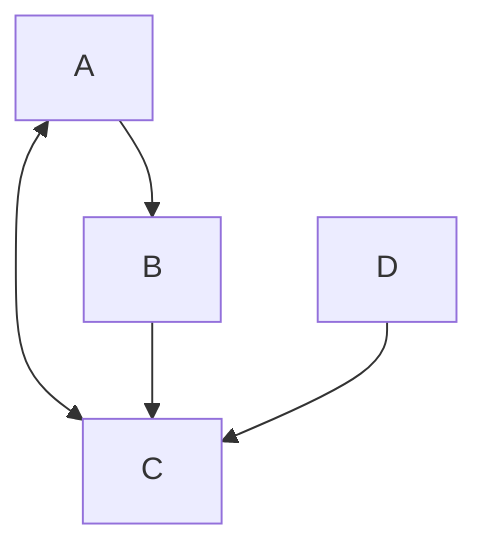

---
{"dg-publish":true,"permalink":"/data-warehousing-and-data-mining/module-5-web-mining-data-mining/","title":"Web Mining -- Data Mining -- Module 5","tags":["Semester-6","Data-Mining","Web-Mining"],"created":"2025-05-03T13:26:06.211+05:30"}
---

----
# Index

1. [[#Mining the Web Page Layout Structure]]
2. [[#Web Link Mining]]
3. [[#📊 1. PageRank Algorithm (Used by Google)]]
4. [[#2. HITS Algorithm (Hyperlink Induced Topic Search)]]
5. [[#Mining Multimedia Content on the web (brief overview)]]
6. [[#Automatic classification of documents on the web]]
7. [[#1. Support Vector Machines (SVM)]]
8. [[#2. K-NN algorithm (K-Nearest Neighbours)]]

---
# 🌐 **What is Web Mining?**


**Web Mining** is the process of using data mining techniques to extract knowledge from web data, which includes:

- Web content (e.g., text, images, videos)
- Web structure (e.g., link patterns between web pages)
- Web usage (e.g., user browsing behavior)

---
### 🔍 **Three Main Types of Web Mining**

1. **Web Content Mining**
    - Extracting useful information from the content of web pages.
    - Example: Identifying topics in blog posts, product descriptions, etc.
    - Techniques: Natural Language Processing (NLP), Information Retrieval.
        
2. **Web Structure Mining**
    - Discovering structure and relationship between web pages (like hyperlink patterns).
    - Example: Google’s PageRank uses this to rank pages.
    - Techniques: Graph theory, Link analysis.
        
3. **Web Usage Mining**
    - Understanding user behavior by analyzing web logs, clickstreams, or sessions.
    - Example: Recommender systems, heatmaps.
    - Techniques: Clustering, Association Rules, Sequential Pattern Mining.

---
# Mining the Web Page Layout Structure


### 🧱 What is "Web Page Layout Structure Mining"?

This refers to analyzing the **structural organization** of a webpage — not the content or links, but **how it's visually and semantically arranged** using HTML tags and styling (e.g., `<div>`, `<header>`, `<section>`, `<nav>`, `<footer>`, etc.).


### 🎯 Why Do We Mine Layout Structure?

- To **extract main content** vs. ads, navigation, and footers.
- To support **information extraction** (e.g., extracting all product listings).
- To enable **web scraping** tools to adapt to structure.
- For **template detection** and removing redundant layout info.

---

### 🔍 Key Techniques:

1. **DOM Tree Analysis**
    
    - The Document Object Model (DOM) represents the HTML layout as a **tree**.
    - Each tag is a node.
    - Layout structure mining inspects this tree to:
        - Find the **main content block**
        - Remove boilerplate code (ads, navbars, etc.)
            
2. **Tag Path Patterns**
    - Repeated tag patterns (like repeated `<div class="item">`) often indicate structured data, such as product listings or blog entries.
        
3. **Visual Segmentation (e.g., VIPS Algorithm)**
    
    - Uses visual layout (CSS, screen position) to divide the page into logical segments.
    - Helps identify what's central or peripheral.
        
4. **Tree-based Similarity**
    - Comparing trees across multiple pages on a website to identify **template structure**.

---
### 🛠️ Real-world Use Cases

- Google uses it to **extract answers** from websites.
- News aggregators use it to **collect headlines**.
- E-commerce sites use it to **detect templates** and crawl product data.

---
## Example -- DOM Tree Analysis

Let's say we have a sample HTML webpage:

```html
<html>
  <body>
    <header>
      <h1>My Blog</h1>
    </header>
    
    <nav>
      <ul>
        <li>Home</li>
        <li>About</li>
      </ul>
    </nav>
    
    <div class="content">
      <div class="post">
        <h2>Post 1</h2>
        <p>This is the first blog post.</p>
      </div>
      <div class="post">
        <h2>Post 2</h2>
        <p>This is the second blog post.</p>
      </div>
    </div>
    
    <footer>
      <p>Contact us</p>
    </footer>
  </body>
</html>
```

The DOM Tree for this would be:

```less
html
└── body
    ├── header
    │   └── h1
    ├── nav
    │   └── ul
    │       ├── li
    │       └── li
    ├── div (class="content")
    │   ├── div (class="post")
    │   │   ├── h2
    │   │   └── p
    │   └── div (class="post")
    │       ├── h2
    │       └── p
    └── footer
        └── p
```

Mining this tree would tell us this information:

|**Region**|**Detected as**|**Reason**|
|---|---|---|
|`<header>`|Boilerplate (title/banner)|Appears on all pages, not content-specific|
|`<nav>`|Boilerplate (navigation)|Contains menu links|
|`.post` blocks|**Main Content**|Repeating tag path → dynamic data|
|`<footer>`|Boilerplate (footer info)|Same across pages|

We would get a more professional output as:

```json
{
  "main_content": [
    {
      "title": "Post 1",
      "text": "This is the first blog post."
    },
    {
      "title": "Post 2",
      "text": "This is the second blog post."
    }
  ],
  "boilerplate": {
    "header": "My Blog",
    "footer": "Contact us",
    "nav": ["Home", "About"]
  }
}
```

This separation helps when you want to:

- Only **index the main articles**
- **Ignore repetitive layout** like navigation and footers
- Build a cleaner **search engine** or **summarization tool**

---
# Web Link Mining

## 🌐 Web Link Mining – Overview

**Web Link Mining** ==focuses on discovering patterns and structures in the hyperlinks between web pages==. The idea is that **links carry implicit human judgment** — people link to what they find relevant or authoritative.

There are two primary tasks:

1. **Identifying authoritative sources** (important pages)
2. **Discovering good hubs** (pages that link to many good sources)

---
## 🔗 Types of Links

| Link Type                | Description                   |
| ------------------------ | ----------------------------- |
| **In-links** (Backlinks) | Links pointing _to_ a page    |
| **Out-links**            | Links _from_ a page to others |
| **Reciprocal Links**     | Mutual linking between pages  |

---
## Key Algorithms in Web Link Mining

We only got two, don't worry.

### 📊 1. PageRank Algorithm (Used by Google)

#### 🧠 **Core Idea:**

A page is important if **important pages link to it**. This is a recursive definition of importance.

📌 Formula:

$$PR(A) \ = \ \frac{1 \ - \ d}{N} \ + \ d \ \sum_{i \in \ In(A)} \ \frac{PR(i)}{L(i)}$$


where:

- $PR(A)$: PageRank of page A
- $d$: damping factor (usually 0.85)
- $N$: total number of pages
- $L(i)$: number of out-links from page i
- $In(A)$: set of pages that link to page A

#### 🔄 How It Works:

1. Initialize each page's PR to $\frac{1}{N}$
2. Iterate the formula above multiple times (until values stabilize)
3. Pages with high PR are considered more _authoritative_

---
### Example

#### 🌐 Web Graph Setup

Assume we have **4 web pages**: A, B, C, D.

Their link structure:

- $A \ \rightarrow \ B, \ C$
- $B \ \rightarrow \ C$
- $C \ \rightarrow \ A$
- $D \ \rightarrow  \ C$

We can visualize it like this:



So total number of pages, $N \ = \ 4$

So initial PageRank $PR \ = \ \frac{1}{4} \ = \ 0.25$ for all pages.

And we set the damping factor $d \ = \ 0.85$.

Now it's time to **iterate**.

---
### Iteration 1

- **PR(A)** (Page rank of A):

In-links : **C** (An in-link is the **incoming link** from a page, to the page whose page rank we are evaluating).

Out-links: C has only 1 out-link, going to A

In this case, for **A**, the link coming to **A** is from **C**.

So since there's only one page that's linking to A, C and C has only 1 out-link

The page rank of A will be:

$$PR(A) \ = \ \frac{1 \ - \ 0.85}{4} \ + \ 0.85 \ \times \ \frac{0.25}{1}$$

$$\implies PR(A) \ = \ 0.0375 \ + \ 0.2125 \ \approx \ 0.25$$


- **PR(B)**:

In links: A
Out links: A has two out-links, one going to B, and another one to C

So, Page Rank of B will be:

$$PR(B) \ = \ \frac{1 \ - \ 0.85}{4} \ + \ 0.85 \ \times \ [ \ \frac{0.25}{2} \ ]$$


$$\implies PR(B) \ = \ 0.0375 \ + \ 0.10625 \ \approx \ 0.14375$$


- **PR(C)**:

In-links: **A**, **B**, **D**.

Out-links: A = 2, B = 1, D = 1

So , PageRank of C will be:

$$PR(C) \ = \ \frac{1 \ - \ 0.85}{4} \ + \ 0.85 \ \times \ [ \ \frac{0.25}{2} \ + \frac{0.14375}{1} \ + \ \frac{0.25}{1} \ ]$$

Skipping the calculations this time, I'll leave that to you guys,

$$PR(C) \ \approx \ 0.56875$$

- **PR(D)**:

In-links : None

So, 

$$PR(D) \ = \ 0.0375 \ + \ 0 \ = \ 0.0375$$

---
### 📊 Result After Iteration 1:

|Page|PageRank|
|---|---|
|A|0.25|
|B|0.14375|
|C|0.56875|
|D|0.0375|

We’d normally repeat for 10–20 iterations or until values stabilize.

In **PageRank**, "stabilization of values" means that the PageRank scores of all pages **stop changing significantly** between iterations — they **converge**.

---
### 📉 What Stabilization Looks Like:

Let’s say we have 3 pages A, B, and C. Initial ranks are:

- Iteration 0:  
    PR(A) = 0.33, PR(B) = 0.33, PR(C) = 0.33

After 1st iteration:  
PR(A) = 0.42, PR(B) = 0.29, PR(C) = 0.29

2nd iteration:  
PR(A) = 0.40, PR(B) = 0.30, PR(C) = 0.30

3rd iteration:  
PR(A) = 0.399, PR(B) = 0.3005, PR(C) = 0.3005

Eventually:

- Changes become **negligible** (like less than 0.0001)
- We say the values have **converged** or **stabilized**
- You stop iterating

---
### ✅ Why is this important?

Because without stabilization:

- You’d keep updating forever
- You wouldn't get reliable final PageRank values

---
### ✅ Interpretation:

- **Page C** is most important — everyone links to it.
- **Page D** has no incoming links → lowest score.
- **Page A** stays stable because it gets a link from C.
- **Page B** is less significant, only A points to it.

---
### 🔍 Use Cases of Web Link Mining

| Use Case               | Description                                 |
| ---------------------- | ------------------------------------------- |
| Search Engines         | Improve ranking of results (PageRank, HITS) |
| Web Structure Analysis | Understand influence and centrality         |
| Spam Detection         | Detect link farms and manipulation          |
| Community Detection    | See which sites/pages cluster together      |

---
## 2. HITS Algorithm (Hyperlink Induced Topic Search)

### 📌 **HITS Overview**

- Proposed by Jon Kleinberg.
    
- It assigns **two scores to each page**:
    
    1. **Authority Score** — How trustworthy a page is (based on _in-links_ from good hubs)
    2. **Hub Score** — How good a page is at linking to authorities (based on _out-links_ to good authorities)

You can think of it like:

- **Authorities** = Content-rich pages (e.g., research articles)
- **Hubs** = Index pages or directories that point to good content (e.g., curated lists)

---
### 🔁 Basic Working

1. Start with a **base set** of pages (could be from a search result).
2. Initialize **all hub and authority scores to 1**.
3. Iterate:
    - **Update authority score** of each page:  
        Sum of **hub scores** of pages linking _to it_
    - **Update hub score** of each page:  
        Sum of **authority scores** of pages it _links to_
        
4. Normalize scores (so they don’t explode).
5. Repeat until convergence (stabilization).

---
### 🧠 Intuition

- Good **hubs** point to good **authorities**.
- Good **authorities** are pointed to by good **hubs**.
- So the scores reinforce each other in a mutual way.
---
### Example

Let's understand this with the help of an example.


So we have this graph here that represents all our pages and their links.

#### Step 1: Initialization

Start by setting:

- Authority scores: A = 1, B = 1, C = 1, D = 1
- Hub scores: A = 1, B = 1, C = 1, D = 1

---
#### Step 2: Iterate.

- **Update authority score** of each page:  
    - Sum of **hub scores** of pages linking _to it_
- **Update hub score** of each page:  
    - Sum of **authority scores** of pages it _links to_

##### Iteration 1

- For page **A**:

	**Authority Score**:
	
	Number of pages **linking to A**: C, so it's 1
	
	Authority score = 1 + 1 = 2
	
	**Hub Score**:
	
	Number of pages **linking our from A**:  B, C, so it's 2
	
	Hub score = 1 + 2 = 3
	
	Updated scores for page **A**:
	
	**Authority Score** = 2
	**Hub Score** = 3

---
- For page **B**:

	**Authority Score**:
	
	Number of pages linking to B: A, so it's 1
	
	Authority Score = 1 + 1 = 2
	
	**Hub Score**:
	
	Number of pages linking out from B:  C, so it's 1
	
	Hub score = 1 + 1 = 2
	
	Updated scores for page **B**:
	
	**Authority Score =  2**
	**Hub Score = 3**
	
---
- For page **C**:

	**Authority Score**:
	
	Number of pages linking to C: A, B, D, so it's 3
	
	Authority Score = 1 + 3 = 4
	
	**Hub Score**:
	
	Number of pages linking out from C: A, so it's 1
	
	Hub Score = 1 + 1 = 2
---
- For page **D**:

	**Authority Score**:
	
	Number of pages linking to D: None, so it's 0
	
	Authority score = 1 + 0 = 1
	
	**Hub Score**:
	
	Number of pages linking out from D: C, so it's 1
	
	Hub score = 1 + 1  = 2

---
> We could continue this for further iterations, but then we will have to **normalize the values so that they don't become too big**.

---
### 📊 **Interpretation (after 1 iteration):**

- **C has highest authority** (3) → it's linked to by many
- **A is the best hub** (4) → it links to valuable authorities (B and C)
- **D** has zero authority → no one links to it
- **B and D** are okay hubs because they point to C
---
Now you might be wondering:

So what happens in further iterations? We use the currently obtained scores, analyze the page again and then keep on adding them up in the same way? If so then in this process only certain pages scores will increase by a higher bound, the rest will be lower, atleast for this graph. You can say that this is the same for the PageRank algorithm as well, the PageRank will just continue to be assigned based on the in-links and out-links and using the obtained values per iteration. 


The question is, if we can already see that which pages have the higher and which the lower scores, what is the point of continuing beyond iteration 1?

Well, you are not wrong, but this is why we continue till a certain number of iterations:

### 🔁 What Happens in Further Iterations?

Yes, in both algorithms:

- The scores from the **previous iteration** are used to **compute new scores**, and
- This process **repeats** until the values stop changing significantly (called **convergence**).

So for HITS:

- Authority scores are updated based on current **hub** scores.
- Hub scores are updated based on current **authority** scores.

And for PageRank:

- A page’s rank depends on the PageRank of the pages linking to it, divided by their out-degrees.

---
### 🤔 Why Not Just Stop at Iteration 1?

You're right — often you _can_ tell who’s "important" early on. But here's why we **don’t stop early**:

1. **Raw structure can be misleading**:
    
    - Some pages may seem important due to initial connections but fade out as you factor in _quality_ of those connections.
    - Example: A page linked by many **unimportant** hubs gets a low authority eventually.
        
2. **Normalization matters**:
    
    - The values may grow (e.g., from 1 → 3 → 5), but we care about **relative rankings** — we normalize scores to compare fairly.
    - Iteration balances influence and settles values to **accurate proportions**.
        
3. **Feedback loop refinement**:
    
    - A good hub points to good authorities → those authorities get reinforced → hubs that point to them get stronger.
    - This **feedback loop** stabilizes only after a few iterations.
        
4. **Early patterns aren’t always stable**:
    
    - In larger networks, the node with the highest score after iteration 1 **may not stay the highest**.
    - Iterations ensure we're not jumping to conclusions based on a single pulse of data.

---
### 🧠 Analogy:

Think of it like reputation in a social network:

- At first glance, someone popular may seem influential.
- But over time, **who** values their opinion and **how much influence those people have** matters more.
- Repeating the process lets you discover **true long-term influence**, not just surface-level impressions.
---
# Mining Multimedia Content on the web (brief overview)

This area focuses on **extracting useful information** from **non-textual content** on the web like:

- 🖼️ **Images**
- 🎬 **Videos**
- 🎵 **Audio**
- 📊 **Interactive media (e.g., flash, SVGs)**
---

### 🔍 Key Tasks:

1. **Image Mining**
    
    - Face recognition
    - Object detection (e.g., identifying cars, animals)
    - Feature extraction (edges, colors, patterns)
    - Reverse image search
        
2. **Video Mining**
    
    - Scene segmentation
    - Action/event detection
    - Emotion recognition from video (e.g., for movies or surveillance)
    - Caption generation (e.g., YouTube auto-captions)
        
3. **Audio Mining**
    
    - Speech-to-text (transcription)
    - Speaker identification
    - Music genre classification
    - Emotion detection from voice
        
4. **Metadata Mining**
    
    - Extracting tags, titles, alt-texts
    - Understanding EXIF data in images
    - Using embedded timestamps, geolocation

---

### ⚙️ Techniques Used:

- **Computer Vision** (for images/videos): CNNs, YOLO, OpenCV
- **Audio Processing**: MFCCs, spectrograms, RNNs for voice/audio
- **Deep Learning**: Transfer learning on models like VGG, ResNet
- **Multimodal Analysis**: Combining text+image+audio (e.g., Instagram post sentiment)

---

### 💡 Real-World Applications:

- YouTube’s **content recommendation**
- Instagram’s **image captioning & tag suggestions**
- Surveillance systems for **anomaly detection**
- Google Lens or reverse image search
- Spotify’s music classification or emotion tagging

---

> 🧠 **Relevance to Document Classification**: Many web documents now contain **embedded images, videos, or audio**, so understanding and preprocessing these types of content helps improve:

- Search results
- Categorization
- Accessibility
- Contextual understanding

---
# Automatic classification of documents on the web

### ✳️ What Is It?

Automatic Web Document Classification involves assigning documents (e.g., articles, blogs, reviews) to one or more **categories** using **machine learning** or **rule-based** techniques.

---

### 🧰 Techniques Involved:

1. **Preprocessing**:
    
    - Tokenization
    - Stop-word removal
    - Stemming/lemmatization
    - TF-IDF weighting or word embeddings
        
2. **Feature Representation**:
    
    - Bag of Words
    - N-grams
    - Word2Vec, TF-IDF, BERT (for advanced cases)
3. **Classification Algorithms**:
    
    - **Naive Bayes** 🟢 (lightweight and common for text) (We already did this)
    - **SVM (Support Vector Machine)** ⚙️ (effective in high-dimensional spaces)
    - **Decision Trees / Random Forests** (We did this way back, ID3, CART)
    - **Neural Networks** (for deeper understanding or longer documents) (Just for context, we **will not be covering neural networks, it's way out of depth for us**)
---

### 🔁 Example Process:

1. Crawl news articles from the web
2. Preprocess and vectorize content
3. Train a Naive Bayes model on labeled categories: _Sports_, _Politics_, _Tech_
4. Use model to classify new articles automatically

---
### 💡 Applications:

- **News categorization**
- **Spam filtering**
- **Sentiment-based product classification**
- **Content moderation**
- **Thematic sorting of search engine results**

---
## Algorithms for classification of web documents

### 1. Support Vector Machines (SVM)

SVM tries to find the **best separating boundary** (hyperplane) between two classes in a high-dimensional space (each word = a dimension). It focuses on the **"support vectors"** — the closest data points to the decision boundary.

---
### ⚙️ How It Works:

- Each document is converted into a **feature vector** (usually using TF-IDF).
- SVM finds the hyperplane that **maximizes the margin** between classes.
- Works great when your data is **not linearly separable** by using **kernels** (e.g., radial basis).

---
### 📋 Example:

Let’s say we’re classifying two categories:

- **Class A**: Tech Articles — `["AI", "Python", "model", "algorithm"]`
- **Class B**: Sports Articles — `["goal", "match", "team", "score"]`

Each document is represented as a vector based on the word frequencies or TF-IDF scores.

🛠️ The SVM finds the boundary such that:

- All Tech docs are on one side
- All Sports docs are on the other
- With the **maximum margin** in between

🔍 **Why Use It?**

- Handles **high-dimensional text** well
- Avoids overfitting
- Very accurate for **binary classification**

---
### Solved example

Let's say we have a classification problem:

Classify whether a document is **Tech** or **Sports** based on two word features:

- **Feature 1:** Frequency of the word “algorithm”
- **Feature 2:** Frequency of the word “goal”

| Document | "algorithm" freq | "goal" freq | Class  |
| -------- | ---------------- | ----------- | ------ |
| D1       | 8                | 1           | Tech   |
| D2       | 7                | 0           | Tech   |
| D3       | 6                | 2           | Tech   |
| D4       | 0                | 9           | Sports |
| D5       | 1                | 8           | Sports |
| D6       | 2                | 7           | Sports |

This is the frequency table of the given words.

We plot these on a 2D graph where:

- X-axis = "algorithm" frequency
- Y-axis = "goal" frequency

So:

- Tech documents are clustered on the **right bottom**
- Sports documents are clustered on the **left top**

---
### 🔀 **SVM Approach**:

The goal of SVM is to find the **optimal line** (in this 2D case) that:

1. Separates Tech and Sports documents.
2. Maximizes the **margin** between the closest points from each class (called **support vectors**).

Example:

- A line like `algorithm_freq - goal_freq = 3` might separate them.
- Support vectors might be D3 and D6 (closest from each class to the boundary).

---
### 🔍 Classifying a New Document:

Let’s say a new document has:

- "algorithm" = 4
- "goal" = 3

We plug this into the separating line:

```python
algorithm_freq - goal_freq = 4 - 3 = 1
```

If the SVM’s learned boundary was:

```python
algorithm_freq - goal_freq = 2.5
```

Then since `1 < 2.5`, it falls on the **Sports side** → Classified as **Sports**

---
### 2. K-NN algorithm (K-Nearest Neighbours)

### 🧠 Core Idea:

KNN classifies a document based on the **majority label** of its **K nearest neighbors** in the feature space.

### ⚙️ How It Works:

- Vectorize each document (e.g., using TF-IDF)
- Measure **similarity** (often cosine similarity or Euclidean distance)
- Find the **k most similar documents**
- Assign the class that is most frequent among those k

### 📋 Example:

Suppose you're classifying a new document that talks about "World Cup, team, final, match".

- K = 3
- You compare it to your dataset
- Find its 3 nearest documents
- If 2 of them are labeled as **Sports**, then the new doc is classified as **Sports**

🔍 **Why Use It?**

- Simple to implement
- No training needed (lazy learner)
- Good baseline for small datasets

📉 **Downside**: Computationally expensive for large datasets (must calculate distance to all documents at runtime)

---
That's it for this module very low effort, only focus on the PageRank and HITS algorithms, rest is just theory.