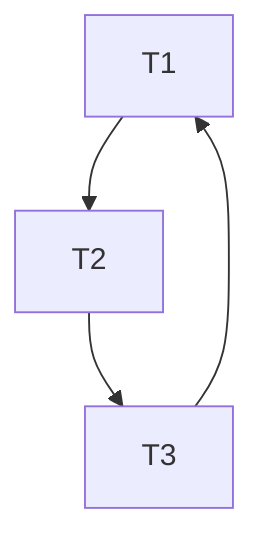
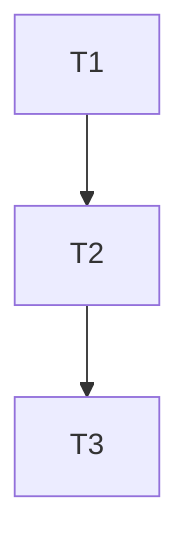
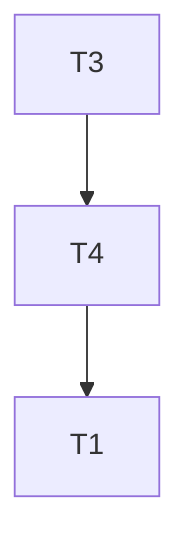
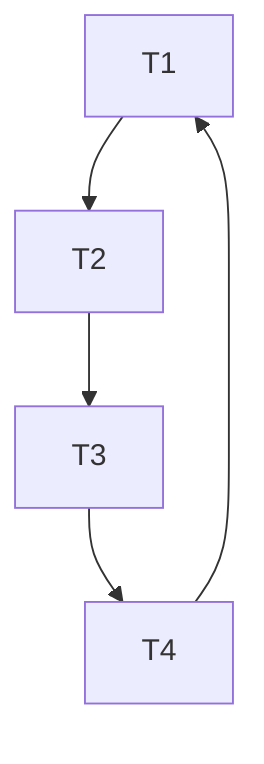

---
{"dg-publish":true,"permalink":"/distributed-systems/module-3-distributed-query-optimization/","title":"Distributed Query Optimization -- Distributed Systems -- Module 3","tags":["Distributed-Systems","Semester-6"],"created":"2025-05-22T13:34:42.988+05:30"}
---

---
# Index

1. [[#Query Processing]]
2. [[#Objectives of Query Processing]]
3. [[#Characteristics of a Query Processor]]
4. [[#Phases of Distributed Query Processing]]
5. [[#Query Decomposition]]
6. [[#Query Optimization]]
7. [[#Factors affecting Query Optimization]]
8. [[#Query Optimization in Centralized Systems]]
9. [[#Ordering of Fragment Queries]]
10. [[#Taxonomy of transaction models]]
11. [[#Distributed Query Optimization Algorithms]]
12. [[#✅ 1. **Greedy Heuristic Algorithm**]]
13. [[#✅ 2. **Dynamic Programming Algorithm (Selinger’s Algorithm)**]]
14. [[#Transaction Management]]
15. [[#Concurrency control in centralized database systems]]
16. [[#Distributed Concurrency Control Algorithms]]
17. [[#1. Distributed Two-Phase Locking (D2PL)]]
18. [[#2. Distributed Timestamp Ordering (DTO)]]
19. [[#🧾 **Distributed Commit Protocols (Commit Algorithms)**]]
20. [[#Deadlock Management]]
21. [[#Detecting deadlocks using Wait-For graphs -- examples]]

---
# Continuation of Module 2 topics.
# Query Processing 

What is Query Processing? 

==Query processing is the process of taking a user's high-level query (usually written in SQL), interpreting it, and executing it to retrieve the required data from a distributed database system== — where data is stored across multiple locations (sites). 

It involves several steps like: 

- Parsing the query 
- Translating it into a lower-level form 
- Optimizing it for efficient execution 
- Executing it across different sites 
- Combining results and presenting them to the user

## Objectives of Query Processing

### 1. Correctness 

- Ensure the query gives the right answer, regardless of where the data is stored. 

---
### 2. Efficiency 

- Execute the query using minimum resources (like CPU, memory, network bandwidth). 
- Reduce data transfer between sites as much as possible. 

---
### 3. Optimization 

- Choose the best strategy (query execution plan) to get the result quickly and with less cost. 
- Consider data location, network speed, and load on each site. 

---
### 4. Transparency 

- Hide the complexity of data distribution from the user. 
- Users write queries as if the data is in one place. 

---
### 5. Scalability 

- Handle queries efficiently even when the database grows in size or new sites are added.

---
## Characteristics of a Query Processor

### 1. Languages 

- ==The input language for queries can be Relational Algebra or Relational Calculus. The query processor converts this input into an output language that includes commands for communication between different sites==. It must correctly and efficiently translate the user's query into an executable plan.

---
### 2. Types of Optimization 

Multiple strategies can be used for executing a query. 
#### Two main approaches: 

- Exhaustive search: Evaluate all possible execution strategies (computationally expensive). 
- Heuristic-based: Choose a "good enough" plan using rules (e.g., minimize size of intermediate relations). 
- Semi-joins: Used to reduce data transfer across sites in distributed queries. 

---
### 3. Statistics 

Used for better query optimization: 

The processor uses statistical information to make better decisions. This includes: 

- The number of records (cardinality) in each fragment. 
- The number of unique values in attributes. These statistics help in estimating which execution plan will be more efficient.

---
### 4. Decision Sites 

- Refers to where the optimization and execution planning is done: 
- Centralized: One site decides everything. 
- Distributed: Multiple sites collaborate on query plan. 

---
### 5. Exploitation of Network Topology 

- Wide Area Network (WAN): High latency and cost — query processors should minimize data transfer. 
- Local Area Network (LAN): Faster and cheaper — can use parallel processing among nearby nodes. 

---
### 6. Exploitation of Replicated Fragments 

When data is replicated at multiple sites, the processor can: 

- Choose from more execution strategies. 
- Use semi-joins to reduce unnecessary data transfer. 
- Perform more local processing. However, it may also lead to more coordination and communication between sites.

---
## Phases of Distributed Query Processing

https://www.ques10.com/p/21460/explain-the-phases-of-query-processing-in-distribu/

https://www.youtube.com/watch?v=Y7SamqOKx1E


### 1. Query Decomposition 

The first layer decomposes the calculus query into an algebraic query on global relations. The information needed for this transformation is found in the global conceptual schema describing the global relations.

 Query decomposition can be viewed as four successive steps.

- Normalization
- Analysis
- Simplification
- Restructure

- ==First, the calculus query is rewritten in a normalized form that is suitable for subsequent manipulation==. Normalization of a query generally involves the manipulation of the query quantifiers and of the query qualification by applying logical operator priority. (Conversion to 1NF, 2NF, 3NF, BCNF, etc.)

-  ==Second, the normalized query is analyzed semantically so that incorrect queries are detected and rejected as early as possible. Techniques to detect incorrect queries exist only for a subset of relational calculus. Typically, they use some sort of graph that captures the semantics of the query==. (By semantical analysis it means that we make sure that the normalized query actually makes sense or not. For example if we are retrieving the student details, we wouldn't want a normalized query that returns something else or something extra which we didn't ask for.)

- ==Third, the correct query (still expressed in relational calculus) is simplified. One way to simplify a query is to eliminate redundant predicates==. Note that redundant queries are likely to arise when a query is the result of system transformations applied to the user query. such transformations are used for performing semantic data control (views, protection, and semantic integrity control). (Making the query shorter and easier to process.)

- ==Fourth, the calculus query is restructured as an algebraic query==. The traditional way to do this transformation toward a "“better" algebraic specification is to start with an initial algebraic query and transform it in order to find a go. (Conversion of relational calculus to relational algebra).

Example:

We have a query:

```sql
SELECT salary FROM instructor WHERE salary < 75000;
```
This query can be translated into either of the following relational algebra expressions

- $$\sigma_{salary \ \lt \ 75000}(\pi_{salary}(instructor))$$

or

- $$\pi_{salary}(\sigma_{salary \ \lt \ 75000}(instructor))$$

---
### 2. Data Localization 

==The main role of the second layer is to localize the query's data using data distribution information in the fragment schema==.

This layer determines which fragments are involved in the query and transforms the distributed query into a query on fragments.

Generating a query on fragments is done in two steps

- First, the query is mapped into a fragment query by substituting each relation by its reconstruction program (also called materialization program).

- Second, the fragment query is simplified and restructured to produce another "good" query.

---
### 3. Global Query Optimization 

  ==The goal of query optimization is to find an execution strategy for the query which is close to optimal==.

 - ==Query optimization consists of finding the "best" ordering of operators in the query, including communication operators that minimize a cost function==.

- ==The output of the query optimization layer is a optimized algebraic query with communication operators included on fragments==. It is typically represented and saved (for future executions) as a distributed query execution plan.

---
### 4. Local Optimization 

- Optimize sub-queries locally at each site. 
- Each site may further optimize its own part of the query using its own DBMS. 

✅ Goal: Make each local operation as efficient as possible.

---
### 5. Query Execution 

- Execute the query using the chosen plan. 
- Collect intermediate results, perform necessary joins or aggregations, and send final results to the user. 

---
# Query Decomposition

Already explained in [[#Query Decomposition]]

---
# Data Localization

==In a distributed database, data is not stored in one place — it's fragmented and distributed across multiple sites or servers. After query decomposition (which gives us a logical query), data localization transforms this logical query into subqueries that correspond to actual data fragments located across different sites==.

## Why Is This Step Needed? 

- Logical queries refer to global tables (e.g., SELECT * FROM Employees). 
- In a distributed setup, Employees might actually be split into: 
- `Employees_US` at Site A 
- `Employees_EU `at Site B 

So we need to rewrite the query to target the correct fragments. 

---
## Main Tasks in Data Localization 

### 1. Identify Relevant Fragments 
   
- Based on the fragmentation schema (horizontal, vertical, hybrid), the optimizer determines which fragments contain the needed data. 
- It replaces global relations with fragment references. 

Example: 

```sql
SELECT name FROM Employees WHERE region = 'EU'; 
```

If Employees is horizontally fragmented: 

- `Employees_US` at Site A: region = 'US' 
- `Employees_EU` at Site B: region = 'EU' 

The query is rewritten to: 

```sql
SELECT name FROM Employees_EU WHERE region = 'EU'; 
```

---
### 2. Generate Subqueries for Each Site 

- The global query is broken down into smaller subqueries, one for each site where relevant data resides. 

---
### 3. Handle Data Replication 

- If data is replicated, the optimizer must choose the best copy to access — ideally one with the lowest cost (network latency, current load, etc.). 

---
## Types of Fragmentation and How They Affect Localization 

| Fragmentation Type | Description                              | Localization Behavior                                                          |
| ------------------ | ---------------------------------------- | ------------------------------------------------------------------------------ |
| Horizontal         | Each fragment holds a subset of rows.    | Query sent only to relevant fragments (based on WHERE clause).                 |
| Vertical           | Each fragment holds a subset of columns. | Requires joining fragments using a common key.                                 |
| Hybrid             | Combination of both.                     | Complex mapping; needs rewriting logic based on both row and column placement. |

---
# Module 3 Topics start here
# Query Optimization

## Factors affecting Query Optimization

### 1. Data Distribution 

- Data is spread across different locations or servers. 
- The optimizer must figure out where the required data is stored. 
- It also needs to decide how to combine data from different places to answer the query efficiently. 

---
### 2. Communication Cost 

- When data is sent from one site to another, it uses the network. 
- This data transfer takes time and bandwidth. 
- The optimizer tries to reduce the amount of data that needs to move across the network. 

Example: Sending a large table over the network is slow, so it's better to do filtering (WHERE conditions) first at the site where the data is stored. 

---
### 3. Local Processing Cost 

This is the cost of processing data at each individual site. 
It includes: 

- Reading data from disk 
- Using CPU for operations like joins or sorting 
- The optimizer chooses the cheapest method (e.g., using an index instead of scanning a whole table). 

---
### 4. Query Structure 

- The way the query is written affects how hard it is to process. 
- More joins, nested queries, or aggregations make the query more complex. 
- The optimizer looks for the best order to perform operations (like which tables to join first). 

---
### 5. Replication of Data 

- Sometimes, copies of the same data exist at different sites. 
- The optimizer can choose the nearest or least busy copy of the data to reduce delay. 
- It must also make sure it uses the most up-to-date version of the data. 

---
### 6. Differences in Site Capabilities 

- Not all sites are equal. Some may have faster CPUs, more memory, or better storage. 
- The optimizer considers this when deciding which site should perform a task. 

---
### 7. Current System Load 

- If one site is already busy with other tasks, it might slow down your query. 
- The optimizer tries to balance the load by choosing less-busy sites. 

---
### 8. Execution Strategy 

- There are different ways to run a distributed query: 
- Query shipping: Send the query to the data site. 
- Data shipping: Bring the data to the site where the query is running. 
- The optimizer chooses the best strategy depending on the situation. 

---
### 9. Availability of Statistics 

The optimizer uses information (called metadata) like: 

- How many rows are in a table 
- How selective a condition is 
- These help estimate which plan is faster. 
- If the statistics are old or missing, the optimizer may make a bad decision. 
---
### 10. Optimization Method Used 

- Rule-based optimization uses fixed rules (e.g., always do selection first). 
- Cost-based optimization checks different options and picks the one with the lowest estimated cost. 
- Cost-based is usually better, but more complex.

---
# Query Optimization in Centralized Systems

In a centralized system, query processing is done with the following aim:

- ==Minimization of response time of query== (time taken to produce the results to users query).
- ==Maximize system throughput== (the number of requests that are processed in a given amount of time).
- ==Reduce the amount of memory and storage required for processing==.
- ==Increase parallelism==.

---
## Query Parsing and Translation

==Initially, the SQL query is scanned. Then it is parsed to look for syntactical errors and correctness of data types. If the query passes this step, the query is decomposed into smaller query blocks. Each block is then translated to equivalent relational algebra expression==.

---
## Steps for Query Optimization

Query optimization involves three steps, namely query tree generation, plan generation, and query plan code generation.

### Step 1: Query Tree Generation

==A query tree is a tree data structure representing a relational algebra expression. The tables of the query are represented as leaf nodes. The relational algebra operations are represented as the internal nodes. The root represents the query as a whole==.

==During execution, an internal node is executed whenever its operand tables are available. The node is then replaced by the result table==. This process continues for all internal nodes until the root node is executed and replaced by the result table.

#### Example 1

For example, let's say we have the following schemas:

`EMPLOYEE`

| EmpID | EName | Salary | DeptNo | DateOfJoining |
| ----- | ----- | ------ | ------ | ------------- |

`DEPARTMENT`

| DNo | DName | Location |
| --- | ----- | -------- |

And we have this query:

$$\pi_{EmpID} (\sigma_{EName = \small "ArunKumar"} {(EMPLOYEE)})$$

The corresponding query tree will be:


---
#### Example 2

Let us consider another query involving a join.

$\pi_{EName, Salary} (\sigma_{DName = \small "Marketing"} {(DEPARTMENT)})$ $\bowtie_{DNo=DeptNo}{(EMPLOYEE)}$

So the query tree will be like this:


Note how the the joining point of the two branches of this tree is $\bowtie_{DNo \ = \ DeptNo}$ where the $\bowtie$  pronounced as "bowtie" operator is used to denote the natural join of two relations.

---
### Step 2: Query Plan Generation

==After the query tree is generated, a query plan is made. A query plan is an extended query tree that includes access paths for all operations in the query tree. Access paths specify how the relational operations in the tree should be performed==. For example, a selection operation can have an access path that gives details about the use of B+ tree index for selection.

Besides, a query plan also states how the intermediate tables should be passed from one operator to the next, how temporary tables should be used and how operations should be pipelined/combined.

---
### Step 3: Code Generation

==Code generation is the final step in query optimization. It is the executable form of the query, whose form depends upon the type of the underlying operating system. Once the query code is generated, the Execution Manager runs it and produces the results==.

---
## Approaches to Query Optimization

Among the approaches for query optimization, exhaustive search and heuristics-based algorithms are mostly used.

### Exhaustive Search Optimization

==In these techniques, for a query, all possible query plans are initially generated and then the best plan is selected. Though these techniques provide the best solution==, it has an exponential time and space complexity owing to the large solution space. For example, dynamic programming technique.

### Heuristic Based Optimization

==Heuristic based optimization uses rule-based optimization approaches for query optimization==. These algorithms have polynomial time and space complexity, which is lower than the exponential complexity of exhaustive search-based algorithms. However, these algorithms do not necessarily produce the best query plan.

---
# Ordering of Fragment Queries

## 🔍 What is it?

In a **distributed database**, data is fragmented and stored across multiple sites. When a user sends a query, the system needs to:

1. Identify which fragments are relevant.
2. Determine **how to retrieve and combine those fragments efficiently**.  
    This is known as **ordering fragment queries** or **query decomposition and optimization in DDBS**.

### 🔄 **What Happens During Fragment Query Ordering?**

In a **distributed database**, data is typically **fragmented** to improve performance, availability, and manageability. These fragments can be:

- **Horizontal fragments:** Subsets of rows (tuples) — like splitting a table by regions.
- **Vertical fragments:** Subsets of columns (attributes).
- **Mixed/Derived fragments:** Combination or transformations.

When a user sends a **high-level query**, the system must:

1. **Decompose** the query into sub-queries that target specific fragments.
2. **Optimize** how those sub-queries are executed across distributed sites.
3. **Assemble** the results efficiently.

---
### 🧭 Steps in Fragment Query Ordering

Let’s break this down with an example query and walk through what the system does:

#### ❓ Example Query:

```sql
SELECT name 
FROM Employee 
WHERE department = 'Sales' AND salary > 50000;
```
#### 🧩 Suppose:

- `Employee` is **horizontally fragmented** into:
    - `Employee_East` (on Site A)
    - `Employee_West` (on Site B)

---
### 🧱 Step-by-Step Breakdown

#### 1. Query Decomposition

- The query is broken into two **local subqueries**:
    - On Site A:  
        `SELECT name FROM Employee_East WHERE department = 'Sales' AND salary > 50000;`
        
    - On Site B:  
        `SELECT name FROM Employee_West WHERE department = 'Sales' AND salary > 50000;`
---
#### 2. Query Localization

- Translate high-level query into fragment-specific versions.
- This includes **WHERE clause predicates**, **fragment metadata**, etc.

---
#### 3. Query Optimization and Ordering

- **Decide execution order** based on:
    
    - Site performance
    - Fragment size
    - Network cost
    - Estimated result size
      
- Can execute:
    
    - **In parallel**: Both sites are queried at once.
    - **Sequentially**: Query one site first, based on expected lower cost.

---
#### 4. Result Assembly

- Results are **merged/joined** at a central coordinator or client.
- Possibly involves **duplicate elimination** or **final aggregation**.
---
### ⚙️ Factors That Affect the Ordering

|Factor|Description|
|---|---|
|**Data location**|Where each fragment resides affects transfer costs.|
|**Size of fragments**|Querying larger fragments first may delay final result.|
|**Selectivity of conditions**|Fragments likely to return fewer rows may be prioritized.|
|**Network bandwidth**|Sites with faster connections might be queried first.|
|**Parallel capabilities**|If sites can be queried in parallel, ordering might be less critical.|

---
### 💡 Optimization Strategy Examples

#### **Greedy Heuristic**:

Choose the fragment with the **lowest estimated cost** first, then continue optimizing remaining parts based on intermediate results.

#### **Cost-Based Optimization**:

Estimate **communication + computation costs** of all possible query plans, and choose the most efficient one.

#### Semi join Strategy (important for DDBS):

Instead of pulling full tables to one site for join, do a **semi join** to reduce data movement.

---
### 🔁 Real-World Analogy

Think of trying to find all salespeople in a company. Your records are split across offices in two cities. You can either:

- **Call both offices at once** and ask for results (parallel).
- Or call the one you think is smaller/faster first, then the other (sequential).

How you choose depends on:

- Who answers faster (network/site performance).
- Who has fewer irrelevant people to sort through (selectivity).
- Whether calling both at once makes the whole process smoother (parallel execution).

---
# Distributed Query Optimization Algorithms

In a distributed database, optimizing a query is more complex than in centralized DBMS because of:

- Data fragmentation
- Network latency
- Site processing capabilities
- Data transfer cost

So the goal is to **find the most cost-effective plan** for query execution **across sites**.

---
## 🧠 **Static vs Dynamic Optimization**

### 1. Static Optimization (Compile-Time)

- The **execution plan is created before** the query starts running.
- Based on **catalog information** like:

    - Data distribution
    - Index availability
    - Estimated sizes of tables/fragments
- **Assumes system statistics are accurate and stable**.
- Common in most **traditional DBMS** and **exam-focused examples**.

#### ✔️ Pros:

- Simpler to implement
- Less runtime overhead
- Easy to analyze and predict behavior

#### ❌ Cons:

- Doesn't adapt to real-time conditions
- Inaccurate stats can lead to poor performance

---
### 2. Dynamic Optimization (Run-Time)

- The query plan is **built or adjusted during execution**.
- Based on **actual run-time statistics**:
    
    - Real result sizes
    - Network status
    - Current system load

---
#### ✔️ Pros:

- Adapts to current conditions
- Better performance in volatile environments

---
#### ❌ Cons:

- More complex
- Introduces runtime overhead
- Harder to analyze statically

> 🔎 **In exams, static optimization is usually the default unless specifically stated otherwise.**

---
## ⚙️ **Key Optimization Algorithms You Should Know**

Let’s cover a **core set of algorithms** — enough for your syllabus **without overwhelming you**.

### ✅ 1. **Greedy Heuristic Algorithm**

#### 🔹 Concept:

- Build the query plan **one step at a time**.
- At each step, pick the **operation with the lowest immediate cost**.
- Doesn’t look ahead — hence **greedy**.

---
#### 🔹 Simple Example:

Suppose you have 3 relations:

- `R(a, b)` – 1,000 tuples
- `S(b, c)` – 100 tuples
- `T(c, d)` – 500 tuples

And the query is:

```sql
SELECT * FROM R, S, T WHERE R.b = S.b AND S.c = T.c;
```

Let’s assume we know the **estimated join sizes**:

| Join          | Estimated Result Size    |
| ------------- | ------------------------ |
| R $\bowtie$ S | 800                      |
| S $\bowtie$ T | 200                      |
| R $\bowtie$ T | Invalid (no direct join) |

##### ✅ Greedy Steps:

1. **Pick smallest join cost first** → `S ⋈ T = 200`
2. Next, join result with `R` → `(S ⋈ T) ⋈ R = ??`

Let’s say that yields 900 final tuples.  
**Done!** That’s your plan:

```
Plan: (S ⋈ T) ⋈ R
```
---
#### ✔️ Suitable For:

- **Fast to compute**
- Doesn't explore full search space (less overhead)
- Often good enough in practice

---
### ✅ 2. **Dynamic Programming Algorithm (Selinger’s Algorithm)**

#### 🧩 Idea:

- Used in **System R**
- Explores **all possible join orders**, stores best plans for subsets of relations
- Efficient for **small number of joins**, gets expensive as query size grows

#### ✔️ Suitable For:

- Static optimization
- Centralized and distributed systems (with tweaks)

---
#### 🔹 Simple Example (Same query as before)

Relations: R, S, T  
Goal: Evaluate `R ⋈ S ⋈ T`

##### 🔸 Step 1: Compute best plans for **pairs**

|Pair|Join|Cost|
|---|---|---|
|{R, S}|R ⋈ S|800|
|{S, T}|S ⋈ T|200|
|{R, T}|Not allowed|❌|

Best plans:

- For `{R, S}` → use `R ⋈ S`
- For `{S, T}` → use `S ⋈ T`

##### 🔸 Step 2: Combine into 3-way join

|Set|Best Subplan|Cost|
|---|---|---|
|R, S, T|`(S ⋈ T) ⋈ R`|900|
||`(R ⋈ S) ⋈ T`|1100|

Pick **minimum** → ✅ Final plan = `(S ⋈ T) ⋈ R`

---
#### 💡 Why it’s useful:

- Finds **optimal plan**
- Explores multiple possibilities
- Common in exam questions

> Can be **slow for many joins**, so real DBMS limit the search space using heuristics.


> 💡 You can mention **Selinger’s approach** as a classical cost-based optimizer. Very common in university exams.

---
### ✅ 3. **Semi-join-Based Optimization**

#### 🔹 Concept:

In **distributed systems**, the goal is to reduce **data transfer**.  
Instead of sending whole tables across the network, use **semijoins** to filter only relevant data.

---
#### 🔹 What is a **Semi-join**?

A **semi-join** `R ⋉ S` returns **only those tuples of R that match with S**, but **doesn’t include S’s columns**.

---
#### 🔹 Simple Distributed Example:

Assume:

- Table `Employee(eid, did)` is at **Site A**    
- Table `Department(did, dname)` is at **Site B**
- Query:
  
```sql
SELECT eid, dname FROM Employee E, Department D WHERE E.did = D.did;
```
If we transfer both tables: **high cost** (especially if Employee is huge)

##### ✅ Semi-join Strategy:

1. **Step 1 (Reduce Data Transfer)**:
    
    - Project join attribute: $\pi_{did}(Employee)$ — send this from Site A to Site B
    
2. **Step 2 (Filter Department)**:
    
    - At Site B: do $\pi_{did}(Employee)$ ⋉ $Department$ — select only departments needed
      
3. **Step 3 (Send Back Filtered Departments)**:
    
    - Send filtered `Department` table back to Site A
      
4. **Step 4 (Join locally at Site A)**:
    
    - Final join with original Employee table


---
### 💡 Why it’s useful:

- Reduces **network traffic**
- Good for **large distributed joins**
- Common in DDBS-specific optimizations

---
### ✅ 4. **Two-Phase Optimization**

#### 🧩 Idea:

- **Phase 1 (Local Optimization):** Optimize each local subquery individually (like at each fragment)
- **Phase 2 (Global Optimization):** Optimize how to combine the local results globally

#### ✔️ Pros:

- Modular
- More scalable for large distributed systems

---
### ✅ 5. **Iterative Improvement / Genetic Algorithms (optional)**

- These are heuristic or AI-based optimizers that **explore plan space** using methods like:
    - Simulated annealing
    - Genetic search
- Not usually required in basic university courses, but you can mention as **"beyond syllabus"** if asked about advanced strategies.
---
## 📚 Summary for Exam-Level Understanding:

|Algorithm|Type|Notes|
|---|---|---|
|**Greedy Heuristic**|Static|Simple, fast, suboptimal plans|
|**Dynamic Programming (Selinger)**|Static|Best plan, expensive for many joins|
|**Semijoin Strategy**|Static/Dynamic|DDBS-specific, reduces data transfer|
|**Two-Phase Optimization**|Static|Modular; separates local and global|
|**Dynamic Optimization**|Dynamic|Adaptive, less common in basic DBMS|
|_(Genetic, etc.)_|Optional|Mention if asked for advanced types|

---
# Transaction Management

## What is a transaction?

https://www.youtube.com/watch?v=t5hsV9lC1rU&list=PLxCzCOWd7aiFAN6I8CuViBuCdJgiOkT2Y&index=74

(Content added from DBMS module 4)

### 1. Definition of a Transaction

- **Transaction as a Logical Unit of Work:**  
    A transaction is defined as a set of operations performed to complete a specific task. In everyday language, when we think of transactions, we might think of monetary actions like transferring money, withdrawing cash, or making deposits. ==In the context of a DBMS, a transaction represents any change (or even a read) performed on the database==.
    
- **Example – ATM Withdrawal:**  
    When you withdraw money from an ATM, several steps occur sequentially:
    
    - **Card Insertion:** The card is inserted, and the machine reads the corresponding account details.
    - **Authentication:** The user’s details (such as PIN) are verified.
    - **Account Selection:** The system may ask the user to select an account (savings or current).
    - **Amount Entry:** The amount to withdraw is entered.
    - **Processing:** The ATM deducts the amount from your account.
    - **Completion:** The money is dispensed, and a confirmation (transaction complete) is displayed and sent via SMS.

This sequence of operations forms one transaction.

---
### 2. Core Operations in a Database Transaction

- **Read Operation:**
    
    - **Purpose:** To fetch data from the database.
    - **How It Works:** Data (such as the current balance of an account) is stored on the hard disk. When a transaction starts, the necessary data is read from the disk into RAM, where it can be processed quickly.
      
- **Write Operation:**
    
    - **Purpose:** To update or change data in the database.
    - **How It Works:** After reading the data into RAM, the transaction performs the required arithmetic or logical operations (for example, deducting an amount from one account and adding it to another). These changes initially occur in RAM.
      
- **Commit Operation:**
    
    - **Purpose:** To permanently save the changes made during the transaction.
    - **How It Works:** Once all operations (read and write) are successfully completed in RAM, the commit operation writes the changes back to the hard disk, ensuring the database is updated with the new values.
      
- **Additional Operation – Rollback (Mentioned Briefly):**  
  
    Although not detailed in the video, a rollback operation is used to undo the changes if something goes wrong during the transaction. This helps maintain data integrity by reverting the database to its previous state.

---
### 3. Why Transactions Are Important in DBMS

- **Ensuring Data Integrity:**  
  
    Transactions ensure that a series of operations either all occur successfully or none do. This all-or-nothing approach maintains the consistency of the database. For example, during a funds transfer, the money must be deducted from one account and added to another. If one part fails, the entire transaction is rolled back.
    
- **Improving System Efficiency:**  
  
    Since the CPU processes data in RAM (which is much faster than a hard disk), read and write operations are performed in memory first. The final commit ensures that the changes are safely stored on disk without directly affecting the user experience.
    
- **User Assurance:**  
  
    When a transaction is complete, users receive confirmation (like a “transaction completed successfully” message). This assurance is vital in applications like banking, where accurate and reliable data processing is critical.
    

---
### 4. Summarizing the Process of a Transaction

1. **Read Data:**  
    The necessary data is read from the hard disk into RAM.
    
2. **Perform Operations:**  
    The transaction performs its logical unit of work (e.g., deducting from one account, adding to another). These operations are processed in RAM for speed.
    
3. **Write Data:**  
    The updated values are stored in RAM as the transaction is processed.
    
4. **Commit:**  
    Finally, the commit operation saves the changes permanently to the hard disk.
    
5. **(Optional) Rollback:**  
    If any error occurs during the process, a rollback can revert the changes to maintain data consistency.

---
## Goals of Transaction Management

Transaction management in a database system ensures that the database remains in a **consistent**, **reliable**, and **recoverable** state, even in the presence of system failures or concurrent access by multiple users. The primary goals of transaction management include:

### 1. **Maintaining Database Consistency**

- **Why:** Transactions must preserve the **integrity constraints** of the database.
- **What It Ensures:** The database transitions from one **valid state to another**.
- **Example:** Transferring funds must not create or destroy money; the total amount remains the same before and after.

### 2. **Ensuring Atomicity**

- **Why:** Either all operations of a transaction are performed, or none are.
- **What It Prevents:** Partial updates or incomplete changes due to failures like power loss or system crashes.
- **Example:** If a withdrawal transaction deducts the amount but the ATM fails before dispensing cash, the deduction must be undone.

### 3. **Guaranteeing Isolation**

- **Why:** Multiple transactions often execute concurrently.
- **What It Prevents:** Transactions interfering with each other, which can lead to **inconsistencies**.
- **Example:** Two users booking the same train seat at the same time—only one should succeed.

### 4. **Providing Durability**

- **Why:** Committed changes should never be lost, even if the system crashes afterward.
- **What It Ensures:** Data is **permanently stored** in non-volatile memory (e.g., hard disk).
- **Example:** After a successful online order, the order details should persist even after a server reboot.

### 5. **Supporting Recovery from Failures**

- **Why:** Systems can crash due to hardware, software, or power issues.
- **What It Enables:** The system can **rollback** incomplete transactions and **restore** the database to a consistent state using recovery techniques (e.g., logs, checkpoints).
- **Example:** If a transaction fails mid-way, a recovery process ensures that the database isn’t left in a corrupted or inconsistent state.

### 6. **Handling Concurrent Access Efficiently**

- **Why:** In multi-user systems, many users may access and modify data simultaneously.
- **What It Balances:** **Concurrency** with **correctness**.
- **Techniques Used:** Locking protocols, timestamp ordering, or multi version concurrency control (MVCC).

---
## Characteristics of transactions

### ACID properties of Transaction

https://www.youtube.com/watch?v=-GS0OxFJsYQ&list=PLxCzCOWd7aiFAN6I8CuViBuCdJgiOkT2Y&index=75

### 1. Atomicity

- **Definition:**  
    ==Atomicity means that a transaction is treated as a single, indivisible unit of work. Either all operations in the transaction are executed completely, or none of them are==.
    
- **Key Concept:**
    
    - **All-or-Nothing:** If any part of a transaction fails (even one operation out of many), the entire transaction is rolled back.
    - **Example:**  
        Consider an ATM transaction where multiple steps are involved (card insertion, PIN entry, amount selection, etc.). If the transaction fails at any step before the commit (for instance, due to a network failure or an incorrect OTP), all changes are undone, and the transaction must restart from the beginning. This prevents partial updates, ensuring that no operation is left half-done.

---
### 2. Consistency

- **Definition:**  
    ==Consistency ensures that a transaction brings the database from one valid state to another valid state, preserving all predefined rules and constraints==.
    
- **Key Concept:**
    
    - **Before and After Balance:** For instance, when transferring money between two accounts, the sum of the account balances should remain the same before and after the transaction.
    - **Example:**  
        If account A has 2000 rupees and account B has 3000 rupees (totaling 5000 rupees), and a transaction transfers 1000 rupees from A to B, then after the transaction, A should have 1000 rupees and B should have 4000 rupees. The total remains 5000 rupees. If any error occurs (such as the cash not being dispensed from an ATM), the inconsistency would be detected, and the transaction would be rolled back to maintain the total.

---
### 3. Isolation

- **Definition:**  
    ==Isolation ensures that concurrently executing transactions do not interfere with one another, so that the outcome is the same as if the transactions were executed sequentially (i.e., in a serial schedule)==.
    
- **Key Concept:**
    
    - **Parallel vs. Serial Execution:** Even though transactions might run in parallel (interleaved in execution), the DBMS must manage them in such a way that the final database state is as if the transactions had been processed one after the other.
    - **Example:**  
        In a system where multiple transactions are reading and writing to the same data simultaneously, isolation prevents one transaction’s intermediate state from affecting another. Conceptually, a parallel schedule (interleaving of transactions) can be transformed into an equivalent serial schedule, ensuring that the operations do not conflict and that the final state is consistent.

---
### 4. Durability

- **Definition:**  
    ==Durability guarantees that once a transaction has been committed, its changes are permanent—even in the case of a system crash or power failure==.
    
- **Key Concept:**
    
    - **Permanent Storage:** After the commit operation, all changes are written permanently to disk. This means that even if the system restarts, the committed transaction's effects remain in the database.
    - **Example:**  
        In an online banking system, once money is transferred and the transaction is committed, the updated balances (for example, 1000 in account A and 4000 in account B after a transfer) are saved permanently. This permanence is ensured by writing the changes to the hard disk, not just keeping them in RAM.

---
### Conclusion

The ACID properties ensure that database transactions are processed reliably and safely:

- **Atomicity** prevents partial transactions.
- **Consistency** maintains the integrity of the data before and after transactions.
- **Isolation** avoids conflicts between concurrently running transactions.
- **Durability** ensures that committed changes persist permanently.

These principles are fundamental in DBMS design and are crucial for systems like banking applications, where accuracy and reliability of transactions are paramount.

---
### States of a transaction

https://www.youtube.com/watch?v=ObwYFVLB_VI&list=PLxCzCOWd7aiFAN6I8CuViBuCdJgiOkT2Y&index=76


### 1. Transaction States Overview

- **Definition:**  
    A transaction is a set of operations that performs a logical unit of work. As it executes, it transitions through several states—from the time it begins to the time it either commits its changes permanently or fails.
    
- **Analogy:**  
    The video compares a transaction to a program that is stored on a hard disk (inactive) and then loaded into RAM (active) for execution. Similarly, a transaction is “inactive” until it is started, and then it becomes “active” when it is executing.
    

---
### 2. Active State

- **What It Means:**  
    ==When a transaction begins execution==, it enters the **active state**. In this state, the transaction is performing its operations.
    
- **Operations:**  
    The transaction performs a series of read and write operations. For example, it might:
    
    - Read data from the database (stored permanently on the hard disk).
    - Perform arithmetic operations on the data (like deducting an amount from one account and adding it to another).
    - Write these changes to local memory (RAM).
- **Memory Context:**  
    The operations in the active state occur in RAM, which allows the CPU (via its ALU—the Arithmetic Logical Unit) to process data quickly compared to directly accessing the hard disk.
    

---
### 3. Partially Committed State

- **What It Means:**  
    ==Once a transaction has completed all its operations (read and write) except the final commit==, it is said to be in a **partially committed state**. At this point, all operations have been executed in RAM, but the changes have not yet been saved permanently.
    
- **Key Point:**  
    Even though the transaction appears to have done most of its work, until the commit operation is performed, the changes remain temporary and only reside in memory.
    

---
### 4. Commit State

- **What It Means:**  
    The **commit operation** is the ==final step of a transaction==. When the commit is executed:
    - All the changes made during the transaction are permanently saved to the hard disk.
    - The transaction is considered successfully completed, and its changes become durable.
- **Outcome:**  
    After commit, the updated values (for example, updated account balances) are stored permanently in the database, ensuring that they persist even if the system is restarted.

---
### 5. Termination (Deallocation)

- **What It Means:**  
    ==Once a transaction commits, the resources it used (CPU time, RAM, registers, network bandwidth) are released==.
- **Key Aspect:**  
    The operating system takes back these resources so they can be used by other transactions or processes, ensuring efficient resource management.

---
### 6. Failed (Abort) State and Rollback

- **Failure Conditions:**  
    ==A transaction may fail if an error occurs during its execution (for example, a power failure, network outage, or unexpected interruption)==.
- **Abort and Rollback:**
    - If a transaction fails **before the commit** operation (whether during the active state or while it is partially committed), the system will **abort** the transaction.
    - **Rollback** is performed: all operations executed by the transaction are undone, returning the database to its previous state before the transaction began.
- **Restart Requirement:**  
    A failed transaction cannot simply resume from where it left off; it must be restarted entirely from the beginning to ensure data consistency and integrity.

---
### Conclusion

- It starts in the **active state** when executing operations in RAM.
- It moves to the **partially committed state** after executing all operations but before committing.
- It reaches the **commit state** once all changes are permanently saved to disk.
- Finally, the transaction is **terminated** by deallocating the resources it used.
- In case of any error before commit, the transaction moves to a **failed (abort) state**, triggering a rollback to preserve consistency.

---
## Taxonomy of transaction models

https://www.geeksforgeeks.org/flat-nested-distributed-transactions/

Here are some terms we should know before understanding this:

- [**Atomicity**](https://www.geeksforgeeks.org/acid-properties-in-dbms/) **-**   
    The transaction is completed entirely or not at all.
- [**Consistency**](https://www.geeksforgeeks.org/acid-properties-in-dbms/) **-**   
    It is a term that refers to the transition from one consistent state to another.
- [**Isolation**](https://www.geeksforgeeks.org/acid-properties-in-dbms/) **-**   
    It is carried out separately from other transactions.
- [**Durability -**](https://www.geeksforgeeks.org/acid-properties-in-dbms/)   
    Once completed, it is long lasting.

And some transaction commands:

- **Begin -**  
    initiate a new transaction.
- **Commit -**   
    End a transaction and the changes made during the transaction are saved. Also, it allows other transactions to see the modifications you've made.
- **Abort -**   
    End a transaction and all changes made during the transaction will be undone.

**Various roles are allocated to running a transaction successfully :**

- **Client -**   
    The transactions are issued by the clients.
- **Coordinator -**   
    The execution of the entire transaction is controlled by it (handles Begin, commit & abort).
- **Server -**  
    Every component that accesses or modifies a resource is subject to transaction control. The coordinator must be known by the transactional server. The transactional server registers its participation in a transaction with the coordinator.


> **Why a taxonomy?**  
> ==Traditional DBMS transactions follow strict ACID properties. However, in modern and distributed systems (like cloud services, mobile apps, or collaborative workflows), these properties can sometimes become too rigid. Hence, new transaction models have emerged, each balancing consistency, availability, and performance differently==.

---
### 1. **Flat Transactions (Traditional Model)**


- **Definition:**  
     A single, atomic unit of work that either completes in its entirety or is fully rolled back.
    
A client makes requests to multiple servers in a flat transaction. Transaction `T`, for example, is a flat transaction that performs operations on objects in servers `X, Y`, and `Z`. 
  
Before moving on to the next request, a flat client transaction completes the previous one. As a result, each transaction visits the server object in order.   
A transaction can only wait for one object at a time when servers utilize locking.

- **Example:**  
    ATM withdrawal, bank transfers, etc.
    
- **Properties:**  
    Strictly ACID-compliant. Suitable for short, quick transactions.


**Limitations of a flat Transaction :**

- All work is lost in the event of a crash.
- Only one DBMS may be used at a time.
- No partial rollback is possible.

---
### 2. **Nested Transactions**


- **Definition:**  
    A transaction made up of multiple **sub-transactions**, which may themselves contain further sub-transactions.
    
- **Key Concepts:**
    
    - The **main transaction** is the _parent_.
    - The **sub-transactions** are _children_ and can succeed or fail independently.
    - The **parent commits only if all children commit**; if any child fails, rollback happens recursively.
        
- **Use Cases:**  
    Useful in modular systems like object-oriented databases or microservices.
    
- **Example:**  

Consider a distributed transaction (T)  in which a customer transfers :

- Rs. 105 from account A to account C and
- Subsequently, Rs. 205 from account B to account D.

**Assuming :**

1. Account A is on server X
2. Account B is on server Y,and
3. Accounts C and D are on server Z.

The transaction T involves four requests - 2 for deposits and 2 for withdrawals. Now they can be treated as sub transactions (T1, T2, T3, T4) of the transaction T.  

As shown in the figure below, transaction T is designed as a set of four nested transactions : T1, T2, T3 and T4.


```
//Start the  Transaction
T = open transaction

//T1
openSubtransaction
a.withdraw(105);


//T2
openSubtransaction
b.withdraw(205);


//T3
openSubtransaction
c.deposit(105);


//T4
openSubtransaction
d.deposit(205);


//End the Transaction
close Transaction
```

---
### 3. **Distributed Transactions**

- **Definition:**  
    A transaction that spans **multiple networked databases or systems**.
    
- **Key Feature:**  
    Uses a **Two-Phase Commit (2PC)** or **Three-Phase Commit (3PC)** protocol to ensure atomicity across all systems.
    
- **Phases in 2PC:**
    
    1. **Prepare phase**: All involved nodes say “ready”.
    2. **Commit phase**: All nodes perform the commit only if everyone is ready.
        
- **Challenge:**  
    Complex error handling and communication delays.
    

---
### 4. **Real-Time Transactions**

- **Definition:**  
    Transactions with **strict timing constraints**, often found in **embedded** or **real-time systems**.
    
- **Requirement:**  
    Must complete within a specified deadline or be aborted.
    
- **Example:**  
    Air traffic control systems, medical monitoring.

---
### 5. **Mobile Transactions**

- **Definition:**  
    Designed for mobile devices with **intermittent connectivity** and limited resources.
    
- **Key Features:**
    
    - Disconnected operations.
    - Deferred commits.
    - Synchronization with the main database once reconnected.
        
- **Example:**  
    Offline note-taking apps that sync later.

---
### 6. Temporal Transactions

- **Definition:**  
    Transactions that operate on **time-varying data** and preserve the **history** of database changes.
    
- **Use Case:**  
    Medical records, financial auditing.
---
### Summary Table

| Model       | Use Case                 | Key Feature               |
| ----------- | ------------------------ | ------------------------- |
| Flat        | Simple, short operations | All-or-nothing ACID       |
| Nested      | Modular tasks            | Sub-transaction hierarchy |
| Distributed | Across multiple DBs      | Two/Three-phase commit    |
| Real-Time   | Embedded systems         | Time-bound constraints    |
| Mobile      | Offline mobile apps      | Deferred and sync-based   |
| Temporal    | Time-sensitive data      | Tracks changes over time  |

---
# Concurrency control

(DBMS module 4 recap)

To skip to DS-oriented topics click here: [[#Concurrency control in centralized database systems]]


## 1. Shared-Exclusive Locking Protocol

https://www.youtube.com/watch?v=94C0V7f2zm4&list=PLxCzCOWd7aiFAN6I8CuViBuCdJgiOkT2Y&index=87

This is one of the **basic concurrency control mechanisms** in databases. Its **main purpose** is to:

- Ensure **serializability** (transactions appear to run one after the other, not concurrently).
- Maintain **consistency**, part of the **ACID properties**.
- Avoid conflicts during concurrent access.

## 🧠 Two Types of Locks:

1. **Shared Lock (S-lock)**:
    
    - Allows **only reading**.
    - **Multiple transactions** can hold a shared lock on the same data at the same time.
    - No changes can be made to the data.
      
2. **Exclusive Lock (X-lock)**:
    
    - Allows **both reading and writing**.
    - **Only one transaction** can hold an exclusive lock on a data item.
    - No other transaction can access the data in any form while this lock is held.
---
###  When to Use Which?

- If a transaction only needs to **read** a data item → **Shared Lock**.
- If a transaction needs to **read and write** → **Exclusive Lock**.

Examples:

- `T1: Read(A)` → Take `S(A)` → After done, `Unlock(A)`
- `T2: Read(A), Write(A)` → Take `X(A)` → After done, `Unlock(A)`

---
### Compatibility Table

This table determines whether a new **lock request** is allowed based on the **currently held lock** on the data item.

|**Currently Held (Grant)**|**Requested Lock**|**Allowed?**|
|---|---|---|
|Shared|Shared|✅ Yes|
|Shared|Exclusive|❌ No|
|Exclusive|Shared|❌ No|
|Exclusive|Exclusive|❌ No|

### 🔎 Why?

- **Shared + Shared** → OK: Both only read; no conflict.
- **Shared + Exclusive** → Not OK: Could lead to a **read-write conflict**.
- **Exclusive + Shared/Exclusive** → Not OK: Already modifying data; any other access causes potential **write conflicts**.

---
### Lock Lifecycle 

For each transaction:

1. **Lock** the required data item(s) using `S` or `X`.
2. **Perform operations** (read/write).
3. **Unlock** when done.

This is typically implemented with the help of a **lock manager** inside the database that follows the compatibility rules.

---
### Goal of the protocol

- Make sure **concurrent schedules** are **serializable** (i.e., produce the same result as some serial schedule).
- Ensure **consistency** of data is not violated during concurrent access.
- It's a **simple way** to avoid many of the problems like dirty reads, lost updates, etc.
---
### Drawbacks of Shared-Exclusive Locking

https://www.youtube.com/watch?v=UsqtDD1VriY&list=PLxCzCOWd7aiFAN6I8CuViBuCdJgiOkT2Y&index=88

#### 🔒 Shared-Exclusive Locking: Quick Recap

- **Shared Lock (S)**: Multiple transactions can read (shared lock) the same data simultaneously.
- **Exclusive Lock (X)**: Only one transaction can write (exclusive lock) to a data item, and no other transaction can read/write it while the exclusive lock is held.

---
#### 1. **May Not Guarantee Serializability**

> **"May not be sufficient to produce only serializable schedules."**

- **Explanation**: Although locking protocols are intended to ensure serializability (a key property of correct concurrent schedules), basic shared-exclusive locking **does not guarantee** that **every schedule** it allows is **serializable**.
    
- **Example**: If transactions are interleaved in a certain way, you might end up with a schedule that violates the **serializability** requirement. This happens when the **conflict graph** of the schedule contains a **cycle** (e.g., T1 → T2 → T1).

---
#### 2. **May Not Ensure Recoverability (Irrecoverable Schedules Possible)**

> **"May not be free from irrecoverability."**

- **Explanation**: If a transaction **reads dirty (uncommitted) data** written by another transaction and then **commits** before the other transaction aborts, it leads to an **irrecoverable schedule**. Shared-exclusive locking **does not prevent** this by itself.
    
- **Why It's a Problem**: If the earlier writing transaction fails and rolls back, the reading transaction has already committed based on invalid data — causing a **dirty read** and **data inconsistency**.
    
- **Fix**: Recoverability can be ensured using **strict or cascadeless schedules**, but **plain locking alone** doesn’t prevent this issue.
  
---
#### 3. **Possibility of Deadlock**

> **"May not be free from deadlock."**

- **Explanation**: Deadlock happens when two or more transactions wait indefinitely for each other to release locks.
  
- **Scenario**:
    
    - T1 locks A, then waits for B.
    - T2 locks B, then waits for A.
    - Neither can proceed, resulting in a **deadlock**.
        
- **Why It Happens**: The locking protocol does not **prevent circular wait** conditions.
- **Fix**: You need **deadlock detection and resolution** mechanisms or use **timeout or wait-die/wound-wait** schemes.

---
#### 4. **Possibility of Starvation**

> **"May not be free from starvation."**

- **Explanation**: Starvation occurs when a transaction keeps waiting for a lock but **never gets it**, because other transactions continuously acquire the lock before it gets the chance.
    
- **Scenario**:
    
    - T2 requests a **shared** lock on A and waits.
    - T1 keeps requesting and acquiring **exclusive** locks before T2 gets its turn.
- **Why It Happens**: There is no **fairness** in lock granting — especially if **priority or order** is not maintained.
    
- **Fix**: Implementing a **fair scheduler** or **queue-based locking** helps reduce starvation.

---
###  Summary of All Key Drawbacks

|Drawback|Description|
|---|---|
|❌ Not always serializable|Locking doesn't **guarantee** serializable schedules|
|❌ Irrecoverable schedules|Transactions may **commit after reading dirty data**, breaking consistency|
|⚠️ Deadlock possible|Circular waiting on locks causes **indefinite blocking**|
|⚠️ Starvation possible|Some transactions may **never get the lock** if others keep acquiring it|

---
## 2. 2-Phase Locking (2PL)

https://www.youtube.com/watch?v=1pUaEDNLWi4&list=PLxCzCOWd7aiFAN6I8CuViBuCdJgiOkT2Y&index=89

In simpler locking protocols (like Shared & Exclusive locks), **inconsistencies or non-serializable schedules** may occur due to poor coordination. 2PL adds structure to **how and when** locks are acquired or released during a transaction to avoid such problems.

---
### 🧩 2 Phases in 2PL

1. **🔼 Growing Phase**
    
    - You can **acquire (take)** locks (Shared or Exclusive).
    - You **cannot release** any locks.
    - Think of this as the “gather all resources you need” phase.
        
2. **🔽 Shrinking Phase**
    
    - You **release** locks.
    - You are **not allowed to acquire** any new locks.
    - Once a transaction releases its **first lock**, it enters this phase, and cannot go back.

> 🔁 The transition from growing to shrinking happens the **moment a transaction releases any lock**.

---
### ✅ How Does 2PL Achieve Serializability?

Let’s take an example:

- T1: Read(A), Write(A), Read(B)
- T2: Read(A), Read(C)

In 2PL:

- T1 will **acquire all its locks first** (exclusive lock on A, maybe shared on B), and **only then** release them.
- T2 **cannot get a lock** on A until T1 is done **releasing it**.

This creates a natural **serial order** — since T2 had to **wait**, it can be considered to have happened **after T1**.

So:  
⏳ **Order of lock acquisition determines order of transaction execution**, even if they're overlapping in real time.

---
### 🧠 Key Concepts You Must Remember

|Term|Explanation|
|---|---|
|**Growing Phase**|Only lock acquisition allowed|
|**Shrinking Phase**|Only lock release allowed|
|**Lock-Point**|The point where a transaction acquires its **last lock** (or equivalently, the point where it releases its **first lock**) — helps determine the **serialization order**|
|**Compatibility Table**|Dictates whether two locks can coexist. E.g. Shared-Shared = ✅, Shared-Exclusive = ❌|

---
### ⚙ Example Breakdown

Let’s say:

- T1 does: Lock - `S(A), Lock-S(B), Unlock(A), Unlock(B)`
- T2 does: Lock - `S(A), Lock-X(B), Unlock(A), Unlock(B)`

**What happens?**

- T1 starts in Growing Phase: takes` S(A)`, then `S(B)`.
- Once it Unlocks A → it enters Shrinking Phase.
- After that, **it cannot acquire new locks** (even if needed).
- T2 can still start its Growing Phase, but it’ll be **blocked** if it needs Exclusive lock on B while someone else holds Shared.

---
### 🛑 Common Misconceptions Cleared

- ❌ _Only one transaction works at a time in 2PL_ — _Wrong!_  
    ✅ Multiple transactions **can grow simultaneously**, **as long as their locks are compatible** (e.g., Shared on Shared).
    
- ❌ _Exclusive locks can be given if growing phase is active_ — _Wrong!_  
    ✅ You still need to follow the **compatibility rules**; Exclusive lock won’t be granted if someone else has a Shared lock.

---
### Drawbacks of 2PL

### 1. **Irrecoverable Schedules**

#### 🔍 What it means:

A schedule is **recoverable** if a transaction `T2` that reads data written by `T1` **commits only after `T1` commits**.

#### ❌ Problem:

In 2PL, there is no rule that enforces this ordering of commits. So:

- If `T1` writes to `A`
- `T2` reads `A` before `T1` commits
- `T2` commits, and then later `T1` fails

You **cannot roll back** `T2` even though it read uncommitted/dirty data. This leads to an **irrecoverable schedule**, which **violates atomicity**.

---
### 2. **Cascading Rollbacks**

#### 🔍 What it means:

A **cascading rollback** happens when a failure in one transaction forces **multiple other transactions to roll back**, due to them having read its data.

#### ❌ Problem:

2PL allows this to happen:

- `T1` writes to `A`
- `T2`, `T3`, and `T4` all **read** `A` after acquiring **shared locks**
- If `T1` fails and is rolled back, now all dependent transactions (`T2`, `T3`, `T4`) must also be rolled back

This leads to a **chain of rollbacks**, which hurts **performance and consistency**.

> 💡 Even though 2PL controls how locks are acquired/released, it doesn’t **stop reads from uncommitted writes**, which causes the issue.

---
### 3. **Deadlocks**

#### 🔍 What it means:

A **deadlock** occurs when two or more transactions wait for each other indefinitely to release locks.

#### ❌ Problem:

2PL doesn’t avoid deadlocks. For example:

- `T1` locks `A` and waits for `B`
- `T2` locks `B` and waits for `A`

Now, both transactions are stuck—**circular waiting**—and neither can proceed.

> Deadlocks are a classic problem in locking systems and need **separate detection and recovery mechanisms**, like:
> 
> - Wait-for graphs
>  
> - Timeout-based aborts
>   
> - Deadlock prevention protocols (e.g., wait-die or wound-wait)
>   

---
### 4. **Starvation**

#### 🔍 What it means:

**Starvation** happens when a transaction **never gets a chance to execute** because other transactions keep overtaking it.

#### ❌ Problem:

Under 2PL, a transaction can be **perpetually delayed** in acquiring a lock if:

- Other transactions keep acquiring and releasing locks before it gets its chance
- There’s no priority or fair queuing system

This leads to starvation of long-waiting transactions.

---
### 🔄 Summary of Drawbacks:

|Issue|Possible in 2PL?|Why?|
|---|---|---|
|Irrecoverability|✅ Yes|No commit-order enforcement|
|Cascading Rollbacks|✅ Yes|No control on dirty reads|
|Deadlocks|✅ Yes|No deadlock avoidance|
|Starvation|✅ Yes|No fairness policy|

---
### ✅ How to fix them?

To address these problems, stronger protocols can be used, such as:

1. **Strict 2PL**:
    
    - All **exclusive locks** are held **until commit/abort**
    - Prevents **cascading rollbacks**
    - Guarantees **recoverable** and **cascade-less schedules**

2. **Rigorous 2PL**:
    
    - All **locks (shared and exclusive)** are held till commit
    - Ensures both **recoverability** and **serializability**

3. **Timestamp Ordering / Optimistic Concurrency**:
    
    - To avoid **deadlocks** entirely (no locks involved)

---
So this means that, what shared and exclusive locks did was give us two locks: 

- Shared is only used for reading Exclusive is used for both reading and writing. 

- S-E maintains a compatibility table which logs the logs acquired on an item and where more such locks can be acquired on the same item or not. 

- The rules are that if a lock of one type is held, another lock of the same type can be allowed to acquire on the same item but a lock of a different type cannot be allowed to be acquired. However this doesn't extend to exclusive lock (for the same lock acquiring the same lock part). 
  
- For example if `T1` holds an exclusive lock on `A`, another transaction `T2` cannot hold any lock on `A` until `T1` releases it. 

- This doesn't mean however that a transaction **cannot reacquire an exclusive lock it already holds**, that's **not necessarily true**—it can, depending on how lock upgrades/downgrades are handled.

- This means that shared on shared locks can happen, but exclusive on shared(already held) or shared on exclusive locks (already held) cannot be acquired. Also an exclusive on exclusive lock can't be acquired. 
 
 - But S-E has drawbacks, it may not guarantee serializability for every schedule, there might also be possibilities of deadlocks, starvation. 
 
 Enter 2-Phase locking:
 
 - 2-Phase locking aims to solve that by adding a sort of order on when and how the locks are acquired and released by splitting into two phases, the growing and shrinking phase. 
 
 - In the growing phase, any lock (multiple) can be acquired, and none can be released, however the rules of compatibility must be followed. In the shrinking phase, locks are released and no new ones can be acquired. This happens as soon as any transaction releases a lock.

- **Bonus**: **The Lock Point of a transaction**. The Lock Point of a transaction is the moment it **acquires it's last lock** (the end of growing phase). It's useful to define a serial schedule: if T1's lock point is before T2's, we say T1 is before T2 in the equivalent serial schedule.
  
- However 2PL can still have defects and it may still cause issues such as cascading rollbacks, deadlock and starvation
  
- To be rid of these problems we need stronger versions of 2PL or a different protocol, such as Timestamp Ordering.

---
## Strict 2PL and Rigorous 2PL

Both these protocols build on the basics 2PL protocol and add their own rules on top.

### 🔐 Strict 2-Phase Locking (Strict 2PL)

#### 🧱 Base Foundation:

- Inherits rules of **Basic 2PL**:
    
    - **Growing Phase**: Locks can be acquired, not released.
    - **Shrinking Phase**: Locks can be released, not acquired.

#### 📌 Additional Rule in Strict 2PL:

- **All Exclusive Locks must be held until the transaction _commits_ or _aborts_.**
    
    - Exclusive locks are released **only after** commit or abort.

---
#### 🛠 What Problems It Solves:

1. **Cascading Rollback**:
    
    - If another transaction reads a value written by an uncommitted transaction, and the writer aborts → the reader must also roll back (cascading).
    - Strict 2PL prevents this by **not allowing reads on uncommitted data**.
        
2. **Irrecoverability**:
    
    - A committed transaction reading from a transaction that later aborts → makes rollback impossible.
    - Prevented because reads can't happen until the writer commits.

---
#### 🧠 Insight:

- Ensures **recoverable** and **cascade-less** schedules.
- Transactions can’t read or write a value changed by another transaction until that transaction commits

---
### 🧱 Rigorous 2-Phase Locking (Rigorous 2PL)

#### 🔒 Even More Restrictive:

- **Both Shared and Exclusive locks are held until commit or abort.**
    
    - Not just exclusive (as in Strict 2PL), but **shared too** are retained till the end.

#### 💡 Key Difference from Strict 2PL:

- In Strict 2PL: Shared locks can be released before commit.
- In Rigorous 2PL: **No lock is released before commit**, neither shared nor exclusive.

---
#### ✅ What It Guarantees:

- Same benefits as Strict 2PL:
    
    - **Recoverable schedules**
    - **Cascade-less execution**
        
- But adds **stricter control** by retaining even read-locks (shared locks) until commit.

---
### 📊 Summary of Comparison:

|Property|Basic 2PL|Strict 2PL|Rigorous 2PL|
|---|---|---|---|
|Follows Growing/Shrinking?|✅ Yes|✅ Yes|✅ Yes|
|Holds exclusive locks till commit?|❌ No|✅ Yes|✅ Yes|
|Holds shared locks till commit?|❌ No|❌ No|✅ Yes|
|Prevents cascading rollback?|❌ No|✅ Yes|✅ Yes|
|Prevents irrecoverability?|❌ No|✅ Yes|✅ Yes|
|More strict?|Least strict|Moderate|Most strict|

---
### 🧱 What They _Don’t_ Solve:

- **Deadlocks**: Still possible, as locks are held longer.
- **Starvation**: A transaction might wait indefinitely if others keep taking locks.

---
# Timestamp Ordering Protocol 

## What is the Timestamp Ordering Protocol?

**Timestamp Ordering Protocol** is a concurrency control method that **ensures serializability** by ordering transactions based on their **timestamps**.

- Each **transaction** is assigned a **unique timestamp (TS)** when it enters the system.
- This timestamp determines its **age**:
    - **Smaller TS ⇒ Older Transaction**
    - **Larger TS ⇒ Younger Transaction**

---
## 🕒 Three Important Timestamps

For every **data item (say A)**, we track:

1. **TS($T_i$)**: Timestamp of transaction $T_i$.
2. **RTS(A)**: Read Timestamp of A → TS of the most recent transaction that successfully **read A**.
3. **WTS(A)**: Write Timestamp of A → TS of the most recent transaction that successfully **wrote A**.

---
## 🧠 Basic Principle

**"Older transactions should not be affected by younger ones."**

If a **younger transaction tries to read/write something modified by an older transaction**, it **might be aborted** to **preserve the correct order** of operations.

---
## 🔐 Rules of Timestamp Ordering Protocol

Let’s say transaction **T** wants to perform **Read(A)** or **Write(A)**.

### 1. **Read Rule**

Transaction **T** with timestamp **TS(T)** wants to **read A**.

- ✅ **If** `TS(T) ≥ WTS(A)` → allow the read.
- ❌ **If** `TS(T) < WTS(A)` → **abort** T and restart with a new timestamp.

**Why?**  
Because T is older, but A was written by a younger transaction, which violates the order.

**Example**:

- T1 (TS=100)
- T2 (TS=200) writes A → WTS(A)=200
- Now T1 wants to read A  
    → `TS(T1) = 100 < WTS(A) = 200` → ❌ ABORT T1

---
### 2. **Write Rule**

Transaction **T** wants to **write A**.

- ❌ **If** `TS(T) < RTS(A)` → **abort** T  
    (Someone already read A who should come after T)
    
- ❌ **If** `TS(T) < WTS(A)` → **abort** T  
    (Someone already wrote A who should come after T)
    
- ✅ **If** both conditions are false → allow the write, and set `WTS(A) = TS(T)`
    

**Example**:

- T1 (TS=100) reads A → RTS(A)=100
- T2 (TS=90) wants to write A  
    → `TS(T2)=90 < RTS(A)=100` → ❌ ABORT T2

Because someone already read A (T1), and if T2 writes now, it will create a **non-serializable** schedule.

---
## ⚖️ Summary Table

|Operation|Condition|Action|
|---|---|---|
|**Read(A)** by T|`TS(T) ≥ WTS(A)`|✅ Allow|
||`TS(T) < WTS(A)`|❌ Abort T|
|**Write(A)** by T|`TS(T) ≥ RTS(A)` **and** `TS(T) ≥ WTS(A)`|✅ Allow|
||`TS(T) < RTS(A)` or `TS(T) < WTS(A)`|❌ Abort T|

---
## 🔁 What Happens on Abort?

When a transaction is **aborted**, it's **restarted with a new timestamp** (i.e., treated as a newer transaction). This may cause starvation, so **modifications like Wait-Die or Wound-Wait** are used to handle starvation (just like in 2PL).

---
## ✅ Advantages

- Ensures **conflict serializability**
- No deadlocks (no locks → no cycles)

---
## ❌ Disadvantages

- **Starvation** can happen (younger transactions may be aborted repeatedly)
- Overhead in **maintaining timestamps** for each data item
- Can be **too strict** in some situations (may abort even when a conflict could have been resolved)

---
## A few examples on Timestamp Ordering to cement the understanding.

### 🔍 **Quick Recap: Timestamp Ordering Protocol (TO Protocol)**

- Each **transaction** is assigned a unique **timestamp (TS)** when it enters the system.
- **Older transactions** (lower TS) get **priority** over younger ones (higher TS).
- For every **data item X**, the system keeps:
    
    - **`read_TS(X)`** – the largest timestamp of a transaction that has successfully read X.
    - **`write_TS(X)`** – the largest timestamp of a transaction that has successfully written to X.

---
### ✅ **Rules** (Basic Timestamp Ordering):

When a transaction **T** wants to **Read(X)** or **Write(X)**:

1. **Read(X) by $T_i$:**
    
    - If `TS(Ti) < write_TS(X)`: ❌ **Abort Ti** (you’re trying to read something already overwritten by a younger transaction — violates consistency).
        
    - Else: ✅ **Allow the read**, and update `read_TS(X)` = max(`read_TS(X)`, `TS(Ti)`)

2. **Write(X) by $T_i$:**
    
    - If `TS(Ti) < read_TS(X)` **or** `TS(Ti) < write_TS(X)`:  
        ❌ **Abort $T_i$** (you're trying to write something based on outdated read or overwritten value).
        
    - Else: ✅ **Allow the write**, and update `write_TS(X)` = `TS(Ti)`

---
### 🧠 **Examples (Easy to Follow):**

Let’s say:

- T1: `TS(T1) = 5`
- T2: `TS(T2) = 10`

Let’s say current state for **data item A**:

- `read_TS(A) = 0`
- `write_TS(A) = 0`

---

Example 1: T1 reads A, then T2 writes A

```css
T1: Read(A)
T2: Write(A)
```

- `TS(T1) = 5`, `TS(T2) = 10`

1. **T1 reads A**:
    
    - 5 $\geq$ `write_TS(A)` (0) → ✅ Allow.
    - Set `read_TS(A) = 5`.
        
2. **T2 writes A**:
    
    - 10 $\geq$ `read_TS(A)` (5) and 10 $\geq$ `write_TS(A)` (0) → ✅ Allow.
    - Set `write_TS(A) = 10`.
 
✅ **Both succeed**.

---
#### **Example 2: T2 reads A, then T1 writes A**

```css
T2: Read(A)
T1: Write(A)
```

Initial state: `read_TS(A) = 0`, `write_TS(A) = 0`

1. **T2 reads A**:
    
    - 10 ≥ `write_TS(A)` (0) → ✅ Allow.
    - Update `read_TS(A) = 10`.
        
2. **T1 writes A**:
    
    - 5 < `read_TS(A)` (10) → ❌ **Abort T1**


❌ **T1 is aborted**. Because it’s older and tries to write something read by a younger transaction → violates timestamp order.

---

#### **Example 3: T2 wants to write A but T1 already wrote A**

```css
T1: Write(A)
T2: Write(A)
```

Initial: `write_TS(A) = 0`

1. **T1 writes A**:
    
    - 5 ≥ 0 → ✅ Allow.
    - Update `write_TS(A) = 5`.
        
2. **T2 writes A**:
    
    - 10 ≥ `read_TS(A)` (assume still 0), 10 ≥ `write_TS(A)` (5) → ✅ Allow.
    - Update `write_TS(A) = 10`.

✅ **Both succeed**.

---
#### **Example 4: Younger T2 tries to read A after older T1 wrote A**

```css
T1: Write(A)
T2: Read(A)
```

1. **T1 writes A** → ✅ `write_TS(A) = 5`
2. **T2 reads A**:
    
    - 10 ≥ `write_TS(A)` (5) → ✅ Allowed.
    - `read_TS(A)` = 10

✅ **Both succeed**.

---

#### **Example 5: Younger transaction tries to write A, older already wrote A**

```css
T1: Write(A)
T2: Write(A)
```

Assume `write_TS(A) = 5` from T1

Now T2 (`TS = 4`) tries to write A

- 4 < `write_TS(A)` (5) → ❌ **Abort T2**

You can't let a younger timestamp transaction overwrite data written by an older one.

---
### 🔁 Summary Table:

|Case|Outcome|
|---|---|
|Old reads, young writes|✅ Allowed|
|Young reads, old writes|✅ Allowed|
|Old writes, young reads|✅ Allowed|
|Young writes, old reads|❌ Abort|
|Young writes, old writes|❌ Abort if TS < `write_TS`|
|Old writes, young writes|✅ Allowed|

---
# Concurrency control in centralized database systems

You can study the following part in either DBMS module 4 or here.


https://www.geeksforgeeks.org/concurrency-control-in-distributed-transactions/

## Pessimistic Concurrency Control (PCC) -- Basic overview

The [Pessimistic Concurrency Control Mechanisms](https://www.geeksforgeeks.org/difference-between-pessimistic-approach-and-optimistic-approach-in-dbms/#:~:text=A%20Pessimistic%20approach%20is%20an%20approach%20of%20concurrency%20control%20algorithms%20in%20which%20the%20transaction%20is%20delayed%20if%20there%20is%20a%20conflict%20with%20each%20other%20at%20some%20point%20of%20time%20in%20the%20future) ==proceeds on assumption that==, most of the [transactions](https://www.geeksforgeeks.org/transaction-control-in-dbms/) ==will try to access the same resource simultaneously==. It's basically used to prevent concurrent access to a shared resource and provide a system of acquiring a Lock on the data item before performing any operation.

Algorithms that fall under this protocol:

- Two-phase locking protocol (already covered)
- Timestamp ordering protocol (this version in PCC assumes that conflicts will occur and enforces strict ordering at operation time. We covered this one in DBMS module 4)

### Advantages of Pessimistic Concurrency Control

- ***Prevents Conflicts:*** Records, therefore, cannot be changed by other transactions due to locking, thus having few conflicts when the transaction is not complete. 

- ***High Reliability***: It is useful in situations with a high level of transaction contention due to the locks that are important in maintaining consistency of the data. 

### Disadvantages of Pessimistic Concurrency Control

- ***Deadlock Risk:*** So, when dealing with locks, it must be understood that they can lead to [deadlocks](https://www.geeksforgeeks.org/introduction-of-deadlock-in-operating-system/) and thus make programming even more complicated. 
- ***Lower Concurrency:*** Locks decrease the system’s concurrency since transactions may have to wait in order to obtain the right to use the required locks. 
- ***Higher Storage Costs:*** Most of the time it demands more storage space as there is the need to preserve the locks or other [concurrency control](https://www.geeksforgeeks.org/concurrency-control-in-dbms/).

### Pessimistic Concurrency Control Methods (Basic gist)

#### 1. Isolation Level

The [isolation levels](https://www.geeksforgeeks.org/transaction-isolation-levels-dbms/) are defined as a degree to which the data residing in [Database](https://www.geeksforgeeks.org/what-is-database/) ==must be isolated by transactions for modification==. ==Because, if some transactions are operating on some data let's say transaction - T1 & there comes another transaction - T2 and modifies it further while it was under operation by transaction T1 this will cause unwanted inconsistency problems==.

---
#### 2. Two-Phase Locking Protocol

We have already covered this before.

---
#### 3. Distributed Lock Manager

==A distributed lock a critical component in the distributed transaction system, which co-ordinates the lock acquiring, and releasing operations in the transactions==. It helps in synchronizing the transaction and their operation so that data integrity is maintained.


---
#### 4. Multiple Granularity Lock

==A lock can be acquired at various granular level like: table level, row/record level, page level or any other resource's level. In transaction system a transaction can lock a whole table, or a specific row while performing some changes on it==. This lock acquiring when done by various transactions simultaneously, this phenomena is called as [multiple granularity locking](https://www.geeksforgeeks.org/multiple-granularity-locking-in-dbms/).

---
## Optimistic Concurrency Control (OCC)

The problem with pessimistic concurrency control systems is that, if a transaction acquires a lock on a resource so that no other transactions can access it. This will result in reducing concurrency of the overall system.

The [Optimistic Concurrency control techniques](https://www.geeksforgeeks.org/difference-between-pessimistic-approach-and-optimistic-approach-in-dbms/) ==proceeds on the basis of assumption that, 0 or very few transactions will try to access a certain resource simultaneously==. We can describe a system as ***FULLY OPTIMISTIC***, if it uses ***No-Locks*** at all & checks for conflicts at commit time. It has following 4-phases of operation:

- ***Read Phase***: ==When a transaction begins, it reads the data while also logging the time-stamp at which data is read== to verify for conflicts during the validation phase.
- ***Execution Phase***: ==In this phase, the transaction executes all its operation== like create, read, update or delete etc.
- ***Validation Phase***: Before [committing](https://www.geeksforgeeks.org/difference-between-commit-and-rollback-in-sql/) a transaction, ==a validation check is performed to ensure consistency== by checking the ***`last_updated`*** [timestamp](https://www.geeksforgeeks.org/introduction-to-timestamp-and-deadlock-prevention-schemes-in-dbms/) with the one recorded at ***`read_phase`***. ==If the timestamp matches, then the transaction will be allowed to be committed== and hence proceed with the commit phase.
- ***Commit phase***: ==During this phase, the transactions will either be committed== or [aborted](https://www.geeksforgeeks.org/transaction-states-in-dbms/), ==depending on the validation check performed during previous phase==. If the timestamp matches, then transactions are committed else they're aborted.

### Some OCC methods

#### 1. Timestamp Ordering (OCC) version

#### 💡 Core Idea:

Transactions **execute without locking** during their read/write phase.  
Conflicts are only checked **during the commit phase** using timestamps.

---
#### 🔄 Phases in OCC:

##### 🔄 **1. Read Phase**

- Transaction **reads** values from the database into local memory.
- **Writes are buffered** (not applied yet).
- Reads are **not blocked**, and **no locks** are held.

---
##### ✍️ **2. Validation Phase (Key Phase for OCC)**

- Before committing, the system checks whether this transaction can **safely write** without causing **conflicts**.
- This is where **timestamp ordering logic** is applied.
- If **conflict is detected**, transaction is **aborted** and restarted.

---
##### ✅ **3. Write Phase**

- If validation succeeds, the buffered writes are **applied to the database**.

---
#### 🧠 Example of OCC with Timestamps

Let’s say:

- T1: TS=10, finishes at FT=30
- T2: TS=25 (starts before T1 finishes)

 T1 writes A → W(T1) = {A}

 T2 reads A → R(T2) = {A}

Now, apply validation:

- `FT(T1) = 30`, `TS(T2) = 25` ⇒ **T1 didn’t finish before T2 started**
- `W(T1) ∩ R(T2) = {A}` ⇒ **conflict**
- ❌ **T2 is aborted**

---
#### 🔄 Key Difference vs Basic Timestamp Ordering

| Feature                        | Basic TO Protocol       | OCC with Timestamps                    |
| ------------------------------ | ----------------------- | -------------------------------------- |
| **When conflicts are checked** | On every read/write     | Only during validation (before commit) |
| **Abort timing**               | During execution        | At commit time                         |
| **Overhead**                   | Constant checks         | Buffered work + validation logic       |
| **Best suited for**            | High conflict workloads | Low conflict workloads                 |

---
#### 📋 Summary Table:

|Phase|What Happens|
|---|---|
|Read|Transaction reads freely, stores changes locally|
|Validation|Timestamp-based check against committed transactions|
|Write|If valid, writes changes to DB; otherwise, aborts|

---
#### ✅ Key Points:

- **No locks used → high concurrency**
- **Conflicts are handled only at commit time**
- Works well when **conflicts are rare**

---
#### 2. Multi-Version Concurrency Control (MVCC)

In [MVCC](https://www.geeksforgeeks.org/concurrency-control-techniques/#:~:text=Multiversion%20Concurrency%20Control%3A%20Multiversion%20schemes%20keep%20old%20versions%20of%20data%20item%20to%20increase%20concurrency.%20Multiversion%202%20phase%20locking%3A), ==every data item has multiple versions of itself. When a transaction starts, it reads the version that is valid at the start of the transaction. And when the transaction writes, it creates a new version of that specific data item. That way, every transaction can concurrently perform their operations==.

==Each successful write results in the creation of a new version of the data item written. Timestamps are used to label the versions==. When a read(X) operation is issued, select an appropriate version of X based on the timestamp of the transaction

***Example***: In a banking system two or more user can transfer money without blocking each other simultaneously.

---
# Distributed Concurrency Control Algorithms

## 1. Distributed Two-Phase Locking (D2PL)

### 💡 **What is it?**

A **distributed extension** of the basic **2PL protocol**, where:

- Each **site** has its own **lock manager**.
- Transactions may **span multiple sites**.
- To maintain **global serializability**, all sites must **coordinate** their locks.
---

### 🛠️ **How it works**

Just like regular 2PL, each transaction has:

- **Growing phase**: Can acquire locks, but not release.
- **Shrinking phase**: Can release locks, but not acquire.
    
In **D2PL**, this protocol is **enforced across all sites** involved in the transaction.

---

### 📌 **Key Differences from centralized 2PL**

|Centralized 2PL|Distributed 2PL|
|---|---|
|One lock manager|Multiple lock managers (one per site)|
|Lock requests are local|Lock requests go to _remote sites_|
|Deadlocks are local|Deadlocks can happen across sites (global deadlocks)|
|Easier to track lock phase|Must coordinate globally to detect growing/shrinking phase end|

---
### 🧠 **Key Challenges**

- **Global deadlock detection** is required.
- Must ensure **all involved sites follow 2PL**.
- Requires **message-passing** to request/release locks.

---

### 🔍 **Example**

Imagine:

- **T1** needs to read **X at Site A**, and write **Y at Site B**.
- Site A and Site B have **independent lock managers**.

#### Steps:

1. **T1 requests shared-lock on X at Site A** → Site A's lock manager grants it.
2. **T1 requests exclusive-lock on Y at Site B** → Site B's lock manager grants it.
3. T1 finishes **growing phase** and begins to **commit** (shrinking phase).
4. **T1 releases both locks** — Site A and B must both record the lock release.

---
#### Why it's tricky:

- Site A and Site B must **coordinate** to ensure T1 didn’t break 2PL globally.
    
- A deadlock could occur if:
    
    - **T1** (at Site A) is waiting for a lock held by **T2** (at Site B), and
    - **T2** (at Site B) is waiting for a lock held by **T1** (at Site A).

This is a **distributed deadlock** — not visible at any single site!

---
### 🛡️ **How to Handle Distributed Deadlocks**

- **Centralized deadlock detector** (not scalable).
- **Distributed detection** using:
    
    - **Wait-For Graphs (WFG)** merged across sites.
    - **Timeouts** (simpler but riskier).

---
### ✅ **Summary**

- D2PL enforces 2PL across multiple sites.
- Ensures **global serializability**.
- Needs **inter-site communication** for locks.
- Must handle **distributed deadlocks**.
- Often used with **commit protocols** (like 2PC) to ensure atomicity across sites.

---
## 2. Distributed Timestamp Ordering (DTO)

### 💡 **What is it?**

A **distributed version** of **timestamp ordering (TO)**:

- Every transaction is assigned a **global timestamp (TS)**.
- Transactions are ordered based on their **timestamps**, across all sites.
- Ensures **conflict-serializability** by **rejecting conflicting operations** that violate timestamp order.

---

### 📌 **Key Assumptions**

- Each transaction **Tᵢ** is assigned a **unique TS(Tᵢ)** when it starts.
- All participating sites **agree** on this timestamp (using a synchronized clock or logical clock).
- Every read/write request is checked against **`read_TS`** and **`write_TS`** at each site.

---
### 🔄 **How It Works (at each site)**

For a data item **X**:

- `read_TS(X)` = max TS of any transaction that **read** X
- `write_TS(X)` = max TS of any transaction that **wrote** X

Now:

|Operation|Rule (simplified)|
|---|---|
|**Tᵢ reads X**|Allowed if TS(Tᵢ) ≥ write_TS(X)|
||If TS(Tᵢ) < write_TS(X), **abort Tᵢ**|
|**Tᵢ writes X**|Allowed if TS(Tᵢ) ≥ read_TS(X) and TS(Tᵢ) ≥ write_TS(X)|
||Otherwise, **abort Tᵢ**|

---

### 🔍 **Example**

Assume:

- Site A stores **X**, Site B stores **Y**
- Two transactions:
    - **T1 `[TS=5]`**
    - **T2 `[TS=10]`**

#### Scenario:

1. **T1** wants to **write X** at Site A → OK if `read_TS(X) ≤ 5`, `write_TS(X) ≤ 5`
    
2. **T2** later wants to **read X** at Site A:
    
    - If T1's write happened, now `write_TS(X) = 5`
    - Since `TS(T2) = 10 ≥ 5`, read is allowed

Now suppose:

3. **T2 writes Y** at Site B → succeeds
    
4. Later, **T1 wants to read Y** at Site B:
    
    - But `write_TS(Y) = 10` (from T2)
    - `TS(T1) = 5 < 10` → **T1 is aborted!**

So, **DTO prevents T1 from reading a value written by a "future" transaction**, ensuring serial order matches timestamps.

---

### 🚨 **Key Issues in Distributed Setup**

|Challenge|Description|
|---|---|
|**Clock Sync**|Sites must agree on a global timestamp order (e.g., Lamport or vector clocks)|
|**Abort Propagation**|A transaction must be aborted at **all sites** if violated at **any one site**|
|**Communication Delay**|Timestamps must be sent along with each read/write request|
|**Cascading Aborts**|If one transaction is aborted, dependent ones may need to be aborted too|

---

### 🛠️ **How It Maintains Serializability**

DTO guarantees that the **conflict-serializable schedule** is equivalent to a serial schedule **ordered by transaction timestamps**.

This avoids the need for locking — great for **read-heavy systems** — but sacrifices **some throughput due to more aborts**.

---
### ✅ **Summary**

- DTO is the distributed version of timestamp ordering.
- Every transaction gets a **globally agreed timestamp**.
- Every read/write is checked against **read_TS** and **write_TS** at **each site**.
- Transactions violating order are **aborted**.
- Eliminates locks, but needs **global coordination** and suffers from **higher aborts**.

---
## 🧾 **Distributed Commit Protocols (Commit Algorithms)**

### ❓Why do we need them?

- In DDBS, a transaction affects **multiple sites**.
    
- So when a transaction finishes, we must **guarantee**:
    
    1. Either **all sites commit**, or
    2. **None do (rollback)**
        
- This avoids partial commits and ensures **atomicity**.
    

---
## 🔄 1. **Two-Phase Commit Protocol (2PC)**

> 🔑 The **most widely used commit algorithm** in DDBS.

### 🔹Phase 1 – Prepare Phase:

- **Coordinator** asks all participants: “Can you commit?”
- Each participant does local checks (e.g., log, locks, etc.)
- Replies:
    
    - **Yes (Vote-Commit)**
    - **No (Vote-Abort)**

### 🔹Phase 2 – Commit/Abort Phase:

- If **all** vote **Yes** → coordinator sends **Commit**
- If **any** vote **No** → coordinator sends **Abort**
- Participants then **follow the decision** and log it

### ✔ Ensures:

- **Atomicity**
- **All-or-nothing commit**

### ❗Limitations:

- **Blocking**: If coordinator crashes after "Yes" votes, participants are stuck waiting

---

## 🔄 2. **Three-Phase Commit Protocol (3PC)**

> ✅ Designed to fix the **blocking issue** in 2PC  
> 💡 Adds a middle phase to ensure recovery is possible even if coordinator crashes

### 🔹Phase 1 – `CanCommit`:

- Same as 2PC Phase 1 (ask for votes)

### 🔹Phase 2 – `PreCommit`:

- If all say Yes, coordinator sends **“Prepare to Commit”**
- Participants enter **ready-to-commit state** (but don't commit yet)

### 🔹Phase 3 – Commit:

- After getting acknowledgements for PreCommit → coordinator sends **Commit**

### ✔ Advantage:

- **Non-blocking** even if coordinator crashes mid-way
- Participants can make progress using timeout + state knowledge

---

## 🧠 Real-World Analogy:

Imagine a group project submission:

- 2PC: Leader asks everyone if they're ready, and if all agree, submits — but if leader vanishes after getting all yes, everyone is stuck.
    
- 3PC: Adds an extra step: "Okay, get ready to submit," before actually submitting. If leader disappears, the group knows what to do next.


---

## ✅ Summary Table

|Protocol|Phases|Blocking?|Common Use|
|---|---|---|---|
|**2PC**|2|❌ Yes|✅ Widely used|
|**3PC**|3|✅ No|🧪 Rare (more complex)|

---

## 📌 How it connects to concurrency control:

- **2PL**, **DTO**, etc. manage **concurrent access**
- **2PC/3PC** make sure the **final commit is consistent across all sites**

---
# Deadlock Management

## ❓ What is a Deadlock?

A **deadlock** occurs when a set of transactions **wait indefinitely** for each other to release **locks** on resources, creating a cycle of dependencies with **no resolution**.

In **distributed systems**, deadlocks are **more complex** due to:

- **Multiple sites**
- **Network delays**
- **Global resource tracking**

---
## 💥 Four Necessary Conditions for Deadlock

1. **Mutual Exclusion** – Resources are held by one transaction at a time.
2. **Hold and Wait** – Transactions hold resources while waiting for others.
3. **No Preemption** – Resources cannot be forcibly taken.
4. **Circular Wait** – A closed chain of transactions waiting on each other.

These must all be present for a deadlock to occur.

---
## 🧠 General Strategies for Deadlock Management

There are **three approaches** to managing deadlocks:

|Approach|Description|
|---|---|
|**Prevention**|Ensure at least one of the four conditions never occurs.|
|**Avoidance**|Use extra information to avoid unsafe states.|
|**Detection & Recovery**|Allow deadlocks to occur but detect and recover.|

Let’s understand each in a **distributed context**.

---

## 🔐 1. Deadlock Prevention (in Distributed Systems)

**Idea**: **Prevent deadlocks** by removing one of the four conditions.

### 🔄 Methods:

- **Timestamp ordering (Wait-Die & Wound-Wait)**:
    
    - Ensure that transactions **acquire locks in timestamp order**.
    
- **Ordering resources**:
    
    - All transactions request resources in **a predefined global order** to avoid circular waits.


### 🧊 Wait-Die vs. Wound-Wait (using timestamps):

|Protocol|If Older T wants a lock held by Younger T|If Younger T wants a lock held by Older T|
|---|---|---|
|**Wait-Die**|Wait|Abort|
|**Wound-Wait**|Preempt (force Younger T to abort)|Wait|

These protocols prevent **circular wait**.

---
## 🚦 2. Deadlock Avoidance

**Idea**: Dynamically assess if a transaction request could cause deadlock and **deny risky requests**.

### ⚙️ Implementation:

- Use a **Wait-For Graph (WFG)**:
    
    - Nodes = Transactions
    - Edge from T1 → T2 means T1 waits for a resource held by T2
        
- In distributed systems, maintain **local WFGs** at each site and **periodically share them** to build a **global WFG**.
- If adding an edge introduces a **cycle**, deny the lock request.

**Challenge**: Building and maintaining global WFGs has **communication overhead**.

---
## 🔍 3. Deadlock Detection & Recovery

**Idea**: Let deadlocks occur, then **detect and recover**.

### 📊 Detection:

- Each site maintains a **local Wait-For Graph (WFG)**.
- Periodically, sites **send their WFGs to a central coordinator** or use **distributed algorithms** to merge them.
- **Cycle detection** = Deadlock!

### 🛠️ Recovery:

Once deadlock is detected:

- **Choose a victim** transaction to abort (based on:
    
    - Age (younger preferred),
    - Resources held,
    - Checkpoints)

- **Rollback** the victim and **release locks**.
- Optionally: **Restart the transaction** later.

---
## ⚖️ Comparison Table

|Strategy|Pros|Cons|
|---|---|---|
|**Prevention**|Simple logic, no deadlocks|May abort unnecessarily|
|**Avoidance**|Avoids deadlocks dynamically|Needs global info, slow|
|**Detection & Recovery**|No need to predict, deadlocks handled|Overhead in detection + rollback|

---
## 🔄 Centralized vs Distributed Deadlock Handling

|Type|Description|
|---|---|
|**Centralized**|One site is responsible for collecting WFGs and detecting cycles. Simple but single point of failure.|
|**Distributed**|All sites participate in detecting deadlocks, better fault tolerance but more communication.|

---
# Detecting deadlocks using Wait-For graphs -- examples

## 🔁 **Wait-For Graph (WFG)** – Refresher

- A **WFG** is a directed graph where:
    
    - **Each node** = a **transaction (T1, T2, T3...)**
    - An edge from **T1 → T2** means T1 is **waiting** for a resource held by T2.

> 🔁 **A cycle in the WFG = Deadlock!**

---
### Quick recap from graph theory, what is a Cycle in a graph and how to spot them?

A **cycle** in a graph is a path that starts and ends at the same vertex, and contains at least one other vertex. In simpler terms, it's a closed loop within the graph.


---
## 🧠 Example 1: Simple Deadlock

Let's say we have **3 transactions**:  
**T1**, **T2**, **T3**

### ✅ Scenario:

- **T1** holds **R1**, needs **R2** → waiting for **T2**
- **T2** holds **R2**, needs **R3** → waiting for **T3**
- **T3** holds **R3**, needs **R1** → waiting for **T1**

Let's create a Wait-For graph to detect if there are any deadlocks




Cycle detected : `T1 → T2 → T3 → T1`

✅ This is a **deadlock**.  
🛠️ Solution: Abort one of the transactions to break the cycle.

---
## 🧠 Example 2: No Deadlock

**T1 → T2**  
**T2 → T3**  
(no edge from T3 to any transaction)



No transaction is waiting on a **dependent cycle** → ✅ **No deadlock**.

---
## 🧠 Example 3: Deadlock in Distributed Systems

Let’s consider 2 sites (S1 and S2) with local WFGs.

### Site S1:

- **T1 → T2**
- **T2 → T3**

### Site S2:

- **T3 → T4**
- **T4 → T1**

---
## Independent WFGs
### For S1:


---
### For S2:



---

🌐 Merging them for Global WFG:



🔁 Cycle:
✅ Deadlock exists across sites — this is a distributed deadlock.

---