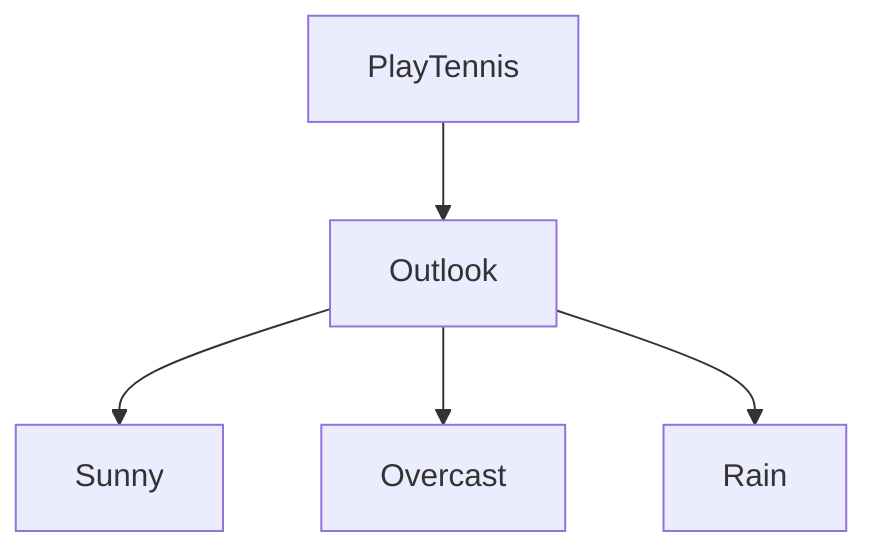
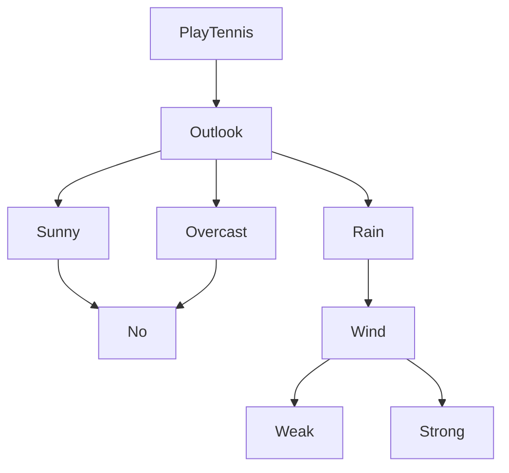
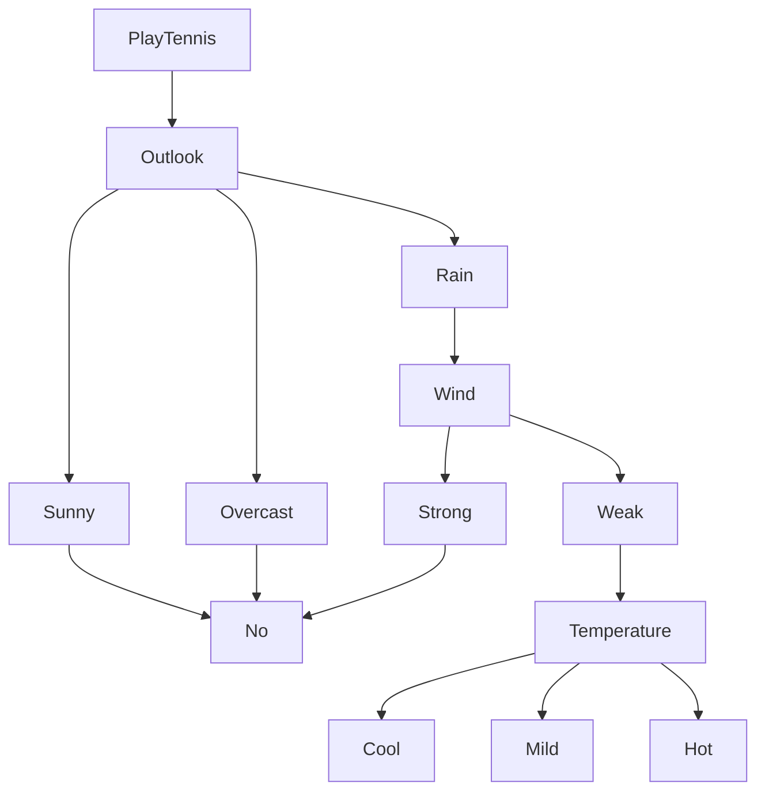
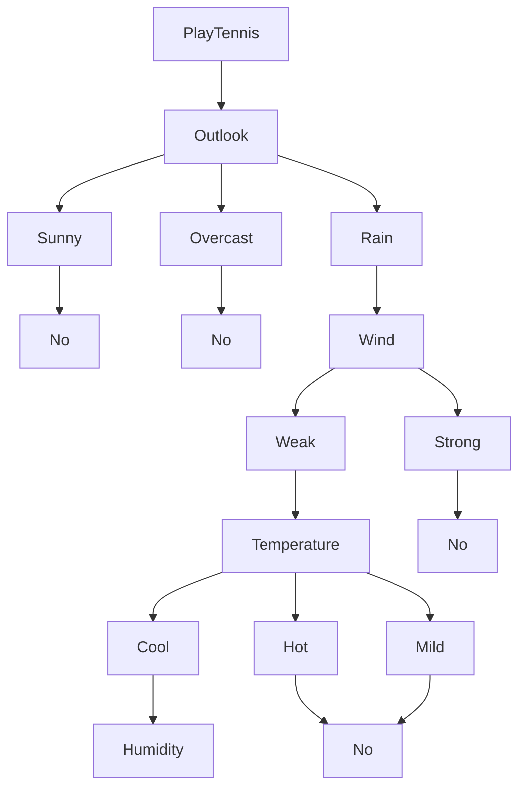
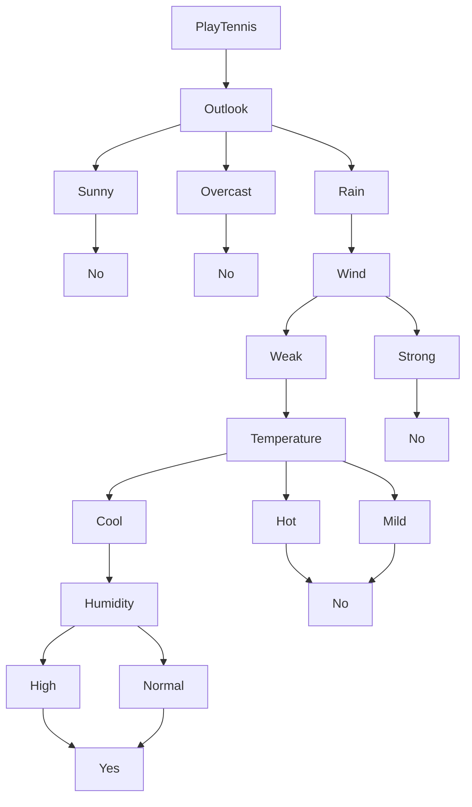
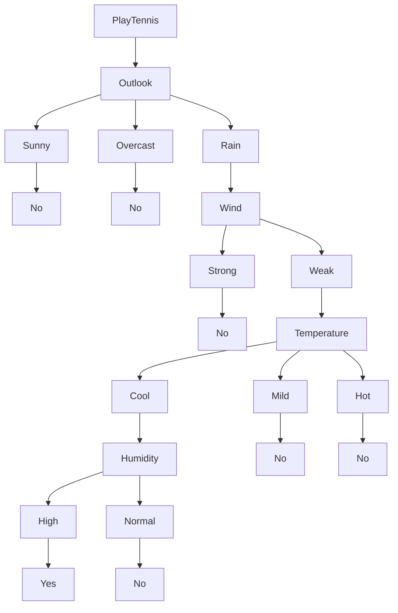
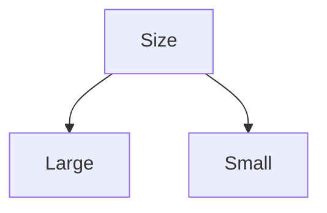
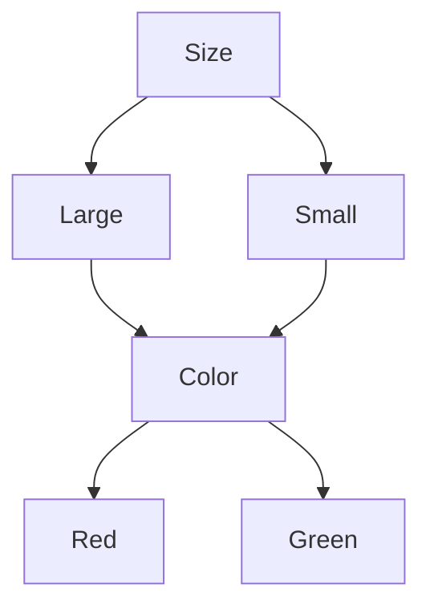
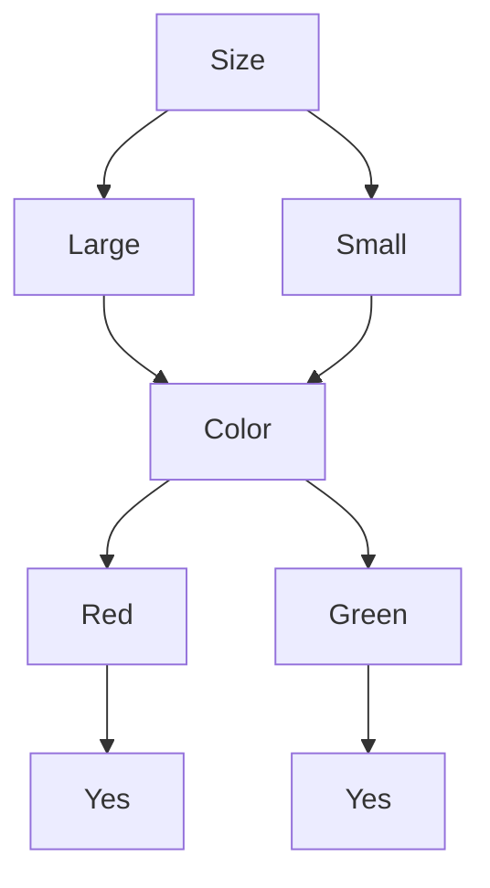
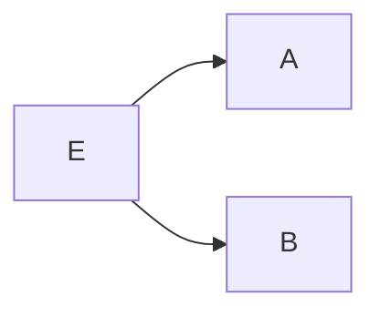

---
{"dg-publish":true,"permalink":"/machine-learning/module-1-supervised-learning-machine-learning/","title":"Supervised Learning -- Machine Learning Module 1","tags":["Semester-7","Machine-Learning"],"created":"2025-08-29T17:21:00.620+05:30","updated":"2025-09-08T11:54:45.048+05:30"}
---

---
# Index

[[#1. Basic Methods]] (Data Mining Module 2 Recap)
[[#2. Linear Models]]
[[#1. Linear Regression]]
[[#2. Generalized Linear Models (GLM)]]
[[#3. GLM Support Vector Machines(SVMs) - The Geometric Approach to Supervised Learning]]
[[#Support Vector Machines Nonlinearity and Kernel Methods]]
[[#Major Kernel Functions (Don't think about this too much, just know the names, and the formulae if possible.)]]
[[#Beyond Binary Classification: Multi-class/Structured Outputs, Ranking]]

---
# 1. Basic Methods

This is basically a recap section from Data Mining semester 6.

If you do not wish to recap this part, you may skip ahead to: [[#2. Linear Models]].
## 1. Distance Based methods

### 1. Euclidean Distance

- Most common distance metric
- Straight-line distance between two points
- Formula for two points (x₁, y₁) and (x₂, y₂): $\sqrt{(x_2 - x_1)^2 \ + \ (y_2 - y_1)^2}$
- Extends to higher dimensions

### 2. Manhattan Distance

- Sum of absolute differences along each dimension
- Also called "city block" or "taxicab" distance
- Formula: $|x_2 \ - \ x_1| \ + \ |y_2 \ - \ y_1|$

### 3. Other Distance Metrics

- **Minkowski Distance**: Generalization of Euclidean and Manhattan
- **Cosine Distance**: Based on angle between vectors (Check Data Mining Module 3)
- **Hamming Distance**: For categorical data

---
## Main Distance Based methods
### 1. K-Means Clustering

### Basic Idea:

Divides `n` objects into `k` clusters, where each object belongs to the cluster with the nearest mean (called the **centroid**).

The K-Means algorithm begins by ==randomly assigning each data point to a cluster. It then iteratively refines the clusters' centroids until convergence. The refinement process involves calculating the mean of the data points assigned to each cluster and updating the cluster centroids' coordinates accordingly. The algorithm continues to iterate until convergence, meaning the cluster assignments no longer change==. K-means clustering aims to minimize the sum of squared distances between each data point and its assigned cluster centroid.

Before we proceed further, let's understand about :

---
### What is a Centroid?

A **centroid** is the **geometric center** of a cluster.


Or 


One could say that the centroid of these clusters are the big white circles at the center, and in some cases, the green circles


It’s like the **average position** of all the points (data samples) assigned to that cluster.

For example :

Let’s say you have a 2D space where each data point is represented by coordinates:

|Point|X|Y|
|---|---|---|
|A|2|4|
|B|4|6|
|C|3|5|
If these three points belong to a single cluster, the centroid’s coordinates would be calculated like this:

$$Centroid_x \ = \ \frac{2 \ + \ 4 \ + \ 3}{3} \ = \ 3$$

$$Centroid_y \ = \ \frac{4 \ + \ 6 \ + \ 5}{3} \ = \ 5$$


So the centroid of all these data points is $(3,5)$

In higher dimensions(more number of variables),  the centroid is still just the **mean** of each coordinate (feature) across all points in the cluster and the centroid formula scales as follows :

$$Centroid_{feature} \ = \ \frac{sum \ of \ feature \ values}{number \ of \ points}$$

---

### **Why Is It Important?**

1️⃣ The centroid acts like the "**anchor**" for a cluster. 2️⃣ During the K-Means algorithm:

- Data points are assigned to the cluster whose centroid is **closest**.
- Centroids are recalculated based on the new points assigned.
- This process continues until centroids stop changing.

---
### **Important:**

- **The centroid might not be an actual data point**.
- It’s just the mathematical center, and sometimes no real data point is located there.
- In contrast, **K-Medoids** uses real data points as centers, not averages.

So, getting back to K-Means clustering,


### Algorithm of K-Means clustering

1. Choose the number of clusters `k`.
2. Randomly choose `k` centroids.
3. Assign each point to the **nearest centroid**. (This is done by calculating the distance of a point to all the centroids then assigning that point to the centroid with the lowest distance, thus creating a cluster)
4. Re-compute centroids as the **mean** of all points in the cluster (using the centroid formula).
5. Repeat steps 3 & 4 until centroids don’t change (convergence is reached) or a maximum number of iterations is reached.


---
### Advantages of K-Means

Here are some advantages of the K-means clustering algorithm -

- **Scalability** - ==K-means is a scalable algorithm that can handle large datasets with high dimensionality==. This is because it only requires calculating the distances between data points and their assigned cluster centroids.
- **Speed** - ==K-means is a relatively fast algorithm, making it suitable for real-time or near-real-time applications==. It can handle datasets with millions of data points and converge to a solution in a few iterations.
- **Simplicity** - K-means is a simple algorithm to implement and understand. It only requires specifying the number of clusters and the initial centroids, and it iteratively refines the clusters' centroids until convergence.
- **Interpretability** - K-means provide interpretable results, as the clusters' centroids represent the centre points of the clusters. This makes it easy to interpret and understand the clustering results.

---
### Disadvantages of K-Means

Here are some disadvantages of the K-means clustering algorithm -

- **Curse of dimensionality** - K-means is prone to the curse of dimensionality, which refers to the problem of high-dimensional data spaces. In high-dimensional spaces, the distance between any two data points becomes almost the same, making it difficult to differentiate between clusters.
- **User-defined K** - K-means requires the user to specify the number of clusters (K) beforehand. This can be challenging if the user does not have prior knowledge of the data or if the optimal number of clusters is unknown.
- **Non-convex shape clusters** - K-means assumes that the clusters are spherical, which means it cannot handle datasets with non-convex shape clusters. In such cases, other clustering algorithms, such as hierarchical clustering or DBSCAN, may be more suitable.
- **Unable to handle noisy data** - K-means are sensitive to noisy data or outliers, which can significantly affect the clustering results. Preprocessing techniques, such as outlier detection or noise reduction, may be required to address this issue.

---
### 2. K-Medoids Clustering

Similar to K-Means, but instead of using the **mean** as a center, it uses an **actual data point** (called a **medoid**) to represent the center.

Before, we proceed with that however,

### What is a Medoid?

A **medoid** is the **most centrally located actual data point** within a cluster.

Unlike a **centroid** (which is often an average, and not always a real data point) —  
a **medoid** is always one of the **original, real points** from your dataset.


Imagine you have a group of houses on a map, and you want to choose a **meeting point** for a neighborhood gathering:

- **Centroid (K-Means)** would give you the average of all coordinates — this could end up in the middle of a lake or someone’s rooftop!
- **Medoid (K-Medoids)** would pick one actual house from the group, the one that minimizes total travel distance for all neighbors.

---
### **How Is the Medoid Selected?**

1. For each data point in a cluster, calculate the **total distance** to all other points in the same cluster.
2. Choose the point with the **lowest total distance**.
3. That point becomes the **medoid** — the most centrally located representative of the cluster.

---
### **Why Use Medoids?**

✅ **Robust to Outliers:**  
Since medoids are real points, extreme outliers don’t "pull" the center like they do in K-Means.

✅ **Flexible Distance Metrics:**  
You’re not limited to Euclidean distance — you can use **Manhattan distance, cosine similarity, Hamming distance**, etc.

---
### Example 

Let’s say you have this simple dataset of 2D points:

| Point | X   | Y   |
| ----- | --- | --- |
| A     | 2   | 4   |
| B     | 4   | 6   |
| C     | 3   | 5   |
| D     | 9   | 9   |

In K-Means, the centroid would be "pulled" toward D because it's an **outlier**.

But in K-Medoids, the algorithm would likely select **B** or **C** as the medoid, since it’s an actual point and minimizes total distance to others.

Before we proceed further :

#### What is an Outlier?

An **outlier** is a data point that is **significantly different** or **far away** from the rest of the data.

It’s like that one kid in a class who’s either _way taller_ or _way shorter_ than everyone else — they don’t fit the typical pattern of the group.

#### Example :

|Student|Age|
|---|---|
|A|21|
|B|22|
|C|21|
|D|20|
|E|54|

Here, **54** is clearly an outlier.  
It doesn’t match the pattern of the other students, who are all around 20–22 years old.

#### How Outliers Pull the Centroid

When you calculate a **centroid**, you are averaging all the points.  
If one point is way off (an outlier), it will **shift the average** toward itself.

#### Example :

Imagine all these points on a line

```python
[1, 2, 2, 3, 3, 3, 30]
```

If you compute the average, (centroid) :

$$Centroid \ = \ \frac{1 \ + \ 2 \ + \ 2 \ + \ 3 \ + \ 3 \ + \ 3 \ + \ 30}{7}$$


$$ = \frac{44}{7} \ \approx \ 6.29$$


Now, in comparison to what the value would be if we didn't have $30$

$$ Centroid \ = \ \frac{1 \ + \ 2 \ + \ 2 \ + \ 3 \ + \ 3 \ + \ 3}{6}  \ = \ \frac{14}{6} \ \approx \ 2.33$$


So, if we see the difference, just because of one outlier, the value of the centroid was much higher (pulled towards it).


However stuff like this doesn't happen with Medoids or K-Medoids since we select an actual data point.

---
### **General K-Medoids Process:**

1. **Initialization**  
    Randomly select `k` _medoids_ (real data points).
    
2. **Assignment Step**  
    Assign each data point to the nearest medoid based on Euclidean (or another) distance.
    
3. **Update Step**  
    For each cluster:
    
    - Test each point in the cluster.
    - Calculate the total distance from that point to all other points in the cluster.
    - Choose the point with the lowest total distance as the **new medoid**.

4. **Convergence Check**  
    Repeat steps 2 and 3 until:
    
    - The medoids no longer change.
    - Or a max number of iterations is reached.

---
### Difference Between K-Means & K-Medoids Clustering

Here is a comparison between K-Means and K-Medoids clustering algorithms in a tabular format.

|                              |                                                                                                     |                                                                                                                                                        |
| ---------------------------- | --------------------------------------------------------------------------------------------------- | ------------------------------------------------------------------------------------------------------------------------------------------------------ |
| **Factor**                   | **K-Means**                                                                                         | **K-Medoids**                                                                                                                                          |
| **Objective**                | Minimizing the sum of squared distances between data points and their assigned cluster centroids.   | Minimizing the sum of dissimilarities between data points and their assigned cluster medoids.                                                          |
| **Cluster Center Metric**    | Use centroids, which are the arithmetic means of all data points in a cluster.                      | Use medoids, which are representative data points within each cluster that are most centrally located concerning all other data points in the cluster. |
| **Robustness**               | Less robust to noise and outliers.                                                                  | More robust to noise and outliers.                                                                                                                     |
| **Computational Complexity** | Faster and more efficient for large datasets.                                                       | Slower and less efficient for large datasets.                                                                                                          |
| **Cluster Shape**            | Assumes spherical clusters and is not suitable for non-convex clusters.                             | Can handle non-convex clusters.                                                                                                                        |
| **Initialization**           | Requires initial centroids to be randomly selected.                                                 | Requires initial medoids to be randomly selected.                                                                                                      |
| **Applications**             | Suitable for applications such as customer segmentation, image segmentation, and anomaly detection. | Suitable for applications where robustness to noise and outliers is important, such as clustering DNA sequences or gene expression data.               |

---
### 3. K-Nearest Neighbours

The most popular distance-based method:

**How it works:**

1. Choose a value for K (number of neighbors)
2. For a new data point, find the K closest training examples
3. **For classification**: Take majority vote among K neighbors
4. **For regression**: Take average of K neighbors' values

**Key characteristics:**

- **Lazy learning**: No explicit training phase
- **Non-parametric**: Makes no assumptions about data distribution
- **Instance-based**: Stores all training data

## Advantages of Distance-Based Methods

- **Simple to understand and implement**
- **No assumptions about data distribution**
- **Works well with small datasets**
- **Can handle both classification and regression**
- **Naturally handles multi-class problems**

## Challenges and Considerations

- **Computational cost**: Must calculate distances to all training points
- **Curse of dimensionality**: Performance degrades in high-dimensional spaces
- **Feature scaling**: Different scales can dominate distance calculations
- **Choice of K**: Too small = noise sensitive, too large = over-smoothing
- **Memory requirements**: Must store entire training dataset

## Practical Example

Imagine predicting house prices based on size and location:

- New house: 1,500 sqft in downtown
- Find 5 nearest houses in training data
- Average their prices to predict the new house price

---
## 2. Decision Trees

**Decision Trees** are a supervised machine learning algorithm used for both classification and regression tasks. They work by creating a tree-like model of decisions based on asking a series of questions about the input features.

### Key Characteristics:

- **Structure**: Resembles an upside-down tree with a root node at the top, internal nodes representing decision points, and leaf nodes containing the final predictions
- **Decision Process**: Each internal node tests a specific feature, branches represent possible outcomes, and the path from root to leaf determines the prediction
- **Interpretability**: Highly interpretable - you can follow the exact logic path the model used to make a decision
- **Versatility**: Can handle both categorical and numerical data

### How it Works:

1. Starts with the entire dataset at the root
2. Splits data based on the feature that best separates the classes/reduces variance
3. Recursively repeats this process for each subset
4. Stops when a stopping criterion is met (e.g., maximum depth, minimum samples)

Decision trees are popular because they're easy to understand, require minimal data preparation, and can capture non-linear relationships in data. However, they can be prone to overfitting and may be unstable with small data changes.

---
## 1. ID3 (Iterative Dichotomiser 3)

Let's say we have been given this dataset:

### 🧾 Dataset: `PlayTennis`

| Day | Outlook  | Temperature | Humidity | Wind   | PlayTennis |
| --- | -------- | ----------- | -------- | ------ | ---------- |
| 1   | Sunny    | Hot         | High     | Weak   | No         |
| 2   | Sunny    | Hot         | High     | Strong | No         |
| 3   | Overcast | Hot         | High     | Weak   | Yes        |
| 4   | Rain     | Mild        | High     | Weak   | Yes        |
| 5   | Rain     | Cool        | Normal   | Weak   | Yes        |
| 6   | Rain     | Cool        | Normal   | Strong | No         |

We need to build a decision tree using the ID3 algorithm.

#### Step 1. Calculate the entropy of the entire dataset first.

Entropy measures the disorder or impurity in your data.

For a set $S$ with positive and negative examples:

$$Entropy(S) \ = \ -p_+ \ log_2(p_+) \ - \ p_{-} \ log_2(p_-)$$


or 

$$Entropy(S) \ = \ - \frac{Yes}{Total} \ log_2(\frac{Yes}{Total}) \ - \ \frac{No}{Total} \ log_2(\frac{No}{Total})$$

Where:

- $p_+$​ = probability of "Yes"
- $p_-$​ = probability of "No"

Total number of events = 6
Total number of yes events = 3
Total number no events = 3

$p_+ \ = \ \frac{3}{6} \ = \ \frac{1}{2} \ = \ 0.5$
$p_- \ = \ 0.5$

So entropy of the entire dataset :

$$Entropy(dataset) \ = \ -0.5 \ \times \ \log_2{(0.5)} \ - \ 0.5 \ \times \ \log_2{(0.5)}$$

$$= \ 0.5 \ + \ 0.5$$

$$Entropy(Dataset) \ = \ 1$$

---
#### Step 2: Calculate Information Gain for every attribute except the first and last one in the table.

| Day | Outlook  | Temperature | Humidity | Wind   | PlayTennis |
| --- | -------- | ----------- | -------- | ------ | ---------- |

These are the attributes of the table.

We need to calculate the information gain for :

- Outlook
- Temperature
- Humidity
- Wind

Factors which impact the decision tree of `PlayTennis`.

---
##### 1. Information Gain of Outlook

| Outlook  | PlayTennis |
| -------- | ---------- |
| Sunny    | No         |
| Sunny    | No         |
| Overcast | Yes        |
| Rain     | Yes        |
| Rain     | Yes        |
| Rain     | No         |

Outlook has three values:

- Sunny: 2 samples -> 2 No, 0 Yes
- Overcast : 1 sample -> 1 Yes, 0 No
- Rain: 3 samples -> 2 Yes, 1 No

###### Step a) Calculate Entropy for all these values.

- For Sunny:

Total samples = 2
$p_+ \ = \ 0$
$p_- \ = \ \frac{2}{2} \ = \ 1$


$$Entropy(Sunny) \ = \ -0 \ \times \ \log_2{(0)} \ - \ 1 \ \times \ \log_2{(1)}$$

$$Entropy(Sunny) \ = \ 0 \ - \ 0 \ = \ 0$$

- For Overcast:

Total samples = 1
$p_+ \ = \ 1$
$p_- \ = \ 0$

$$Entropy(Overcast) \ = \ -1 \ \times \ \log_2{(1)} \ - \ 0 \ \times \ \log_2{(0)}$$

$$Entropy(Overcast) \ = \ 0 \ - \ 0 \ = \ 0$$


- For Rain:

Total samples = 3
$p_+ \ = \ \frac{2}{3} \ = \ 0.66$
$p_- \ = \ \frac{1}{3} \ = \ 0.33$

$$Entropy(Rain) \ = \ -0.66 \ \times \ \log_2{(0.66)} \ - \ 0.33 \ \times \ \log_2{(0.33)}$$

$$Entropy(Rain) \ \approx \ 0.3894 \ + \ 0.5247 \ \approx \ 0.9141$$

###### Step b) Calculate the Weighted Entropy for Outlook

$$Weighted \ Entropy(Outlook) \ = \ \sum(\frac{Total \ number \ of \ samples \ per \ part}{Total \ number \ of \ entries \ in \ table} \ \times \ Entropy(part))$$

- Total samples = 6
- Sunny: 2 samples, Entropy = 0
- Overcast: 1 sample, Entropy = 0
- Rain: 3 samples, Entropy ≈ 0.9141


So :

$$Weighted \ Entropy(Outlook) \ = \ [ \ (\frac{2}{6} \ \times \ 0) \ + \ (\frac{1}{6} \ \times \ 0) \ + \ (\frac{3}{6} \ \times \ 0.9141)\ ]$$

$$= \ [ \ 0 \ + \ 0 \ + \ 0.45705 \ ] \ = \ 0.45705$$

###### Step c) Calculate Information Gain for Outlook

$$Gain(Outlook) \ = \ Entropy(Dataset) \ - \ Weighted \ Entropy(Outlook)$$

$$Gain(Outlook) \ = \ 1 \ - \ 0.45705$$

$$Gain(Outlook) \ = \ 0.54295$$
---
##### 2. Information Gain of Temperature

| Temperature | PlayTennis |
| ----------- | ---------- |
| Hot         | No         |
| Hot         | No         |
| Hot         | Yes        |
| Mild        | Yes        |
| Cool        | Yes        |
| Cool        | No         |

Temperature has three values:

- Cool: 2 samples -> 1 No, 1 Yes
- Mild : 1 sample -> 1 Yes, 0 No
- Hot: 3 samples -> 1 Yes, 2 No

###### Step a) Entropy for all values

- For Cool:

$p_+ \ = \ \frac{1}{2} \ = \ 0.5$
$p_- \ = \ \frac{1}{2} \ =  0.5$

$$Entropy(Cool) \ = \ -0.5 \ \times \ \log_2{(0.5)} \ - \ 0.5 \ \times \ \log_2{(0.5)}$$

$$Entropy(Cool) \ = \ 0.5 \ + \ 0.5 \ = \ 1$$

- For Mild:

$p_+ \ = \ 1$
$p_- \ = \ 0$

$$Entropy(Mild) \ = \ -1 \ \times \ \log_2{(1)} \ - \ 0 \ \times \ \log_2{(0)}$$

$$Entropy(Mild) \ = \ 0 \ - \ 0 \ = \ 0$$

- For Hot:

$p_+ \ = \ \frac{1}{3} \ = \ 0.33$
$p_- \ = \ \frac{2}{3} \ =  0.66$

$$Entropy(Hot) \ = \ -0.33 \ \times \ \log_2{(0.33)} \ - \ 0.66 \ \times \ \log_2{(0.66)}$$

$$Entropy(Hot) \ = \ 0.5247 \ + \ 0.3894 \ = \ 0.9141$$

---
###### Step b) Weighted Entropy for Temperature

Total samples = 6 

- Cool: 2 samples -> Entropy = `1`
- Mild : 1 sample -> Entropy = `0`
- Hot: 3 samples -> Entropy = `0.9141`

$$Weighted \ Entropy(Temperature) \ = \ [ \ \frac{2}{6} \ + \ 0 \ + \ (\frac{3}{6} \ \times \ 0.9141)\ ]$$

$$Weighted \ Entropy(Temperature) \ = \ [ \ 0.33 \ + \ 0 \ + 0.4575 \ ] \ = \ 0.78705$$

---
###### Step c) Information Gain of Temperature

$$Gain(Temperature) \ = \ 1 \ - \ 0.78705 \ = \ 0.21295$$

---
##### 3. Information Gain of Humidity

| Humidity | PlayTennis |
| -------- | ---------- |
| High     | No         |
| High     | No         |
| High     | Yes        |
| High     | Yes        |
| Normal   | Yes        |
| Normal   | No         |

Humidity has two values:

- High: 4 samples -> 2 No, 2 Yes
- Normal: 2 samples -> 1 Yes, 1 No

###### Step a) Entropy of all the values

- For High:

$p_+ \ = \ \frac{2}{4} \ = \ 0.5$
$p_- \ = \ \frac{2}{4} \ = \ 0.5$

So, 


$$Entropy(High) \ = \ -0.5 \ \times \ \log_2{(0.5)} \ - \ 0.5 \ \times \ \log_2{(0.5)}$$

$$Entropy(High) \ = \ 0.5 \ + \ 0.5 \ = \ 1$$

- For Normal

$p_+ \ = \ \frac{1}{2} \ = \ 0.5$
$p_- \ = \ \frac{1}{2} \ =  0.5$


$$Entropy(Normal) \ = \ -0.5 \ \times \ \log_2{(0.5)} \ - \ 0.5 \ \times \ \log_2{(0.5)}$$

$$Entropy(Normal) \ = \ 0.5 \ + \ 0.5 \ = \ 1$$

---
###### Step b) Weighted Entropy of Humidity

Total samples = 6

Humidity has two values:

- High: 4 samples -> Entropy = 1
- Normal: 2 samples -> Entropy = 1

$$Weighted \ Entropy(Humidity) \ = \ [(\frac{4}{6} \ \times \ 1) \ + \ (\frac{2}{6} \ \times \ 1)]$$

$$Weighted \ Entropy(Humidity) \ = \ \frac{3}{3} \ = \ 1$$

---
###### Step c) Information Gain of Humidity

$$Gain(Humidity) \ = \ 1 \ - \ 1 \ = 0$$

---
##### 4. Information Gain of Wind

| Wind   | PlayTennis |
| ------ | ---------- |
| Weak   | No         |
| Strong | No         |
| Weak   | Yes        |
| Weak   | Yes        |
| Weak   | Yes        |
| Strong | No         |

Wind has two values:

- Weak: 4 samples -> 1 No, 3 Yes
- Strong: 2 samples -> 0 Yes, 2 No

###### Step a) Entropy of all the values

- For Weak:

$p_+ \ = \ \frac{3}{4} \ = \ 0.75$
$p_- \ = \ \frac{1}{4} \ = \ 0.25$

$$Entropy(Weak) \ = \ -0.75 \ \times \ \log_2{(0.75)} \ - \ 0.25 \ \times \ \log_2{(0.25)}$$

$$Entropy(Weak) \ = \ 0.3075 \ + \ 0.50 \ = \ 0.8075$$

- For Strong:

$p_+ \ = \ 0$
$p_- \ = \ \frac{2}{2} \ = \ 1$

$$Entropy(Strong) \ = \ 0 \ \times \ \log_2{(0)} \ - \ 1 \ \times \ \log_2{(1)}$$

$$Entropy(Strong) \ = \ 0$$

---
###### Step b) Weighted Entropy of Wind

Total samples = 6

Wind has two values:

- Weak: 4 samples -> Entropy = 0.8075
- Strong: 2 samples -> Entropy = 0

$$Weighted \ Entropy(Wind) \ = \ [(\frac{4}{6} \ \times \ 0.8075) \ + \ (\frac{2}{6} \ \times \ 0)]$$

$$Weighted \ Entropy(Wind) \ = \ 0.53833$$

---
###### Step c) Information Gain of Wind

$$Gain(Wind) \ = \ 1 \ - \ 0.53833$$

$$Gain(Wind) \ = \ 0.46166$$

---
So to recap:

`Gain(Outlook) =  0.54295`
`Gain(Temperature) = 0.21295`
`Gain(Humidity) = 0`
`Gain(Wind) = 0.46166`

---
#### Step 3: Use Information gain to build the decision tree.

| Attribute   | Information Gain      |
| ----------- | --------------------- |
| Outlook     | **0.54295** (Highest) |
| Humidity    | 0 (Lowest)            |
| Wind        | 0.46166               |
| Temperature | 0.21295               |

##### Procedure of building the decision tree

1. **At the start:** all attributes are candidates.
2. We choose the root node as the candidate with the highest information gain.
3. At each split, after choosing an attribute, it is **removed from consideration for that path**.
   
   **At every split, the dataset is reduced to a subset containing only the records that match the conditions so far. Information Gain is recalculated within this subset to decide the next best split.**
   
4. The remaining attributes are checked for Information Gain at each node until:
    - Entropy is zero (pure class) (will be considered a Leaf Node)
    - Attributes are exhausted (stop condition).v


So starting with outlook.

`Outlook` has three values:

- Sunny
- Overcast
- Rain



Now we need to decide which node is a leaf node and which nodes will be continued.

- Entropy of Sunny = `0`
- Entropy of Overcast = `0`
- Entropy of Rain = `0.9141`

So `Sunny` and `Overcast` are Leaf Nodes since their entropies are zero and they are **pure classes**. `Rain` Node will be chosen to continue.

Now we split the dataset by removing the attribute that's already been used.

| Day | Temperature | Humidity | Wind   | PlayTennis |
| --- | ----------- | -------- | ------ | ---------- |
| 1   | Hot         | High     | Weak   | No         |
| 2   | Hot         | High     | Strong | No         |
| 3   | Hot         | High     | Weak   | Yes        |
| 4   | Mild        | High     | Weak   | Yes        |
| 5   | Cool        | Normal   | Weak   | Yes        |
| 6   | Cool        | Normal   | Strong | No         |

Following the information gain table, 

| Attribute   | Information Gain      |
| ----------- | --------------------- |
| Humidity    | 0 (Lowest)            |
| Wind        | 0.46166               |
| Temperature | 0.21295               |

`Wind` has the next highest Information gain.

`Wind` has two values:

- Weak
- Strong

So our decision tree will become:



Now we will decide which is a leaf node and which node will be continued

`Entropy(Weak) = 0.8075`
`Entropy(Strong) = 0`

So `Strong` is a leaf node. `Weak` will be continued.

Now we remove `Wind` from the dataset table since it has been used.

| Day | Temperature | Humidity | PlayTennis |
| --- | ----------- | -------- | ---------- |
| 1   | Hot         | High     | No         |
| 2   | Hot         | High     | No         |
| 3   | Hot         | High     | Yes        |
| 4   | Mild        | High     | Yes        |
| 5   | Cool        | Normal   | Yes        |
| 6   | Cool        | Normal   | No         |

Following the information gain table, 

| Attribute   | Information Gain |
| ----------- | ---------------- |
| Humidity    | 0 (Lowest)       |
| Temperature | 0.21295          |

`Temperature` has the highest information gain currently.

`Temperature` has three values:

- Cool
- Mild
- Hot 

So our decision tree will become:




Now we decide which nodes are leaf nodes and which are to be continued.

- Cool: Entropy = `1`
- Mild : Entropy = `0`
- Hot: Entropy = `0.9141`

So, `Mild` will be a leaf node, both `Cool` and `Hot` nodes can be continued, but it's best that we use a `tie-breaker` here since `Hot`'s value is really close to `Cool`.

Generally, other algorithms have tie-breakers in them such as **random-picking**, or **alphabetical sorting** or **first occurrence**.

In our case, to keep things simple we will use **alphabetical sorting**.

So using alphabetical sorting `Cool` comes before `Hot`, so we continue `Cool` and set `Hot` as a Leaf node. 

So our decision tree will become:




Now we remove `Temperature` from the dataset table since it has been used.

| Day | Humidity | PlayTennis |
| --- | -------- | ---------- |
| 1   | High     | No         |
| 2   | High     | No         |
| 3   | High     | Yes        |
| 4   | High     | Yes        |
| 5   | Normal   | Yes        |
| 6   | Normal   | No         |

Following the information gain table, 

| Attribute   | Information Gain |
| ----------- | ---------------- |
| Humidity    | 0 (Lowest)       |

`Humidity` is the only remaining attribute so we will split on `Humidity`.

Humidity has two values:

- High: Entropy = 1
- Normal: Entropy = 1

So our decision tree will become:





🔚 Therefore:

- No more meaningful split can be done → We **stop here** and make both `High` and `Normal` a **leaf node** using the **majority class**.
    
- But in this case:
    
    - 1 Yes, 1 No → Tie
    - So we need a tie-breaking strategy

So using alphabetical sorting `High` comes before `Normal`, so we assign `High` to `Yes` and `Normal` to `No`.

So our final decision tree becomes:



---
## 2. CART (Classification and Regression Trees)

Let's use this dataset to build the decision tree using the CART algorithm this time.

### 🌾 Dataset: Predicting if a Plant is Edible

| ID  | Color | Size  | Edible |
| --- | ----- | ----- | ------ |
| 1   | Green | Small | Yes    |
| 2   | Green | Large | Yes    |
| 3   | Red   | Small | No     |
| 4   | Red   | Large | No     |
| 5   | Green | Small | Yes    |
| 6   | Red   | Small | No     |

#### Step 1. Calculate the Gini Index of all the attributes.

In CART, the "purity" of a node is measured using **Gini Impurity**, not entropy.

The formula for Gini for a dataset $D$ is:

$$ Gini(D)=1−∑^{n}_{i=1} \ ​p^2_i​$$


or :

$$\boxed{Gini(D) \ = \ 1 \ - \ (\frac{Yes}{Total})^2 \ - \ (\frac{No}{Total})^2}$$


Where:

- $p_i$ is the probability of picking class $i$ at random.
- Lower Gini = purer set.

##### Gini Index for Color attribute

| Color | Edible |
| ----- | ------ |
| Green | Yes    |
| Green | Yes    |
| Red   | No     |
| Red   | No     |
| Green | Yes    |
| Red   | No     |

Total samples = 6

Color has two values:

- Red: 3 samples -> 3 No, 0 Yes
- Green: 3 samples -> 0 No, 3 Yes

###### For Red:

$$Gini(Red) \ = \ 1 \ - \ (\frac{0}{6})^2 \ - \ (\frac{3}{6})^2$$

$$Gini(Red) \ = \ 1 \ - \ 0 \ - \ 0.25$$

$$Gini(Red) \ = \ 0.75$$

###### For Green:

$$Gini(Green) \ = \ 1 \ - \ (\frac{3}{6})^2 \ - \ (\frac{0}{6})^2$$

$$Gini(Green) \ = \ 1 \ - \ 0.25 \ = \ 0.75$$

###### Weighted Gini Index for Color:

$$Weighted \ Gini \ = \ \sum{(\frac{Total \ number \ of \ samples \ of \ part}{Total \ number \ of \ entries \ in \ table} \ \times \ Gini(part))}$$

So,

$$Weighted \ Gini (Color) \ = \ [ \ (\frac{3}{6} \ \times\  0.75 ) \ + \ (\frac{3}{6} \ \times \ 0.75)\ ]$$

$$Weighted \ Gini(Color) \ = \ [ \ 0.375 \ + \ 0.375] \ = \ 0.75$$

---
##### Gini Index for Size Attribute

| Size  | Edible |
| ----- | ------ |
| Small | Yes    |
| Large | Yes    |
| Small | No     |
| Large | No     |
| Small | Yes    |
| Small | No     |

Total samples = 6

Size has two values:

- Small: 4 samples -> 2 No, 2 Yes
- Large: 2 samples -> 1 No, 1 Yes

###### For Small:

$$Gini(Small) \ = \ 1 \ - \ (\frac{2}{4})^2 \ - \ (\frac{2}{4})^2$$

$$Gini(Small) \ = \ 0.5$$

###### For Large:

$$Gini(Large) \ = \ 1 \ - \ (\frac{1}{2})^2 \ - \ (\frac{1}{2})^2$$

$$Gini(Large) \ = \ 0.5$$

###### Weighted Gini for Size:

$$Weighted \ Gini (Size) \ = \ [ \ (\frac{4}{6} \ \times\  0.5 ) \ + \ (\frac{2}{6} \ \times \ 0.5)\ ]$$


$$Weighted \ Gini(Color) \ = \ [ \ 0.3333 \ + \ 0.1666] \ = \ 0.4999$$

---
#### Step 2: Build the Decision Tree using the Gini Indexes

We have so far:

- `Color`: Gini = `0.75`
- `Size`: Gini = `0.4999`

Unlike what we do in ID3, where we choose the attribute with the highest information gain, in CART, we choose the attribute with the lowest Gini Index

A `min(0.75, 0.4999)` results in `0.4999`

So we choose the starting attribute as `Size`, on the root node.

| ID  | Color | Size  | Edible |
| --- | ----- | ----- | ------ |
| 1   | Green | Small | Yes    |
| 2   | Green | Large | Yes    |
| 3   | Red   | Small | No     |
| 4   | Red   | Large | No     |
| 5   | Green | Small | Yes    |
| 6   | Red   | Small | No     |



Now we need to decide which node is the leaf and which will be continued.

So we need to recalculate the Gini Indexes of Large and Small on a **node** level.

| Size  | Edible |
| ----- | ------ |
| Small | Yes    |
| Small | No     |
| Small | Yes    |
| Small | No     |

Total samples = 4 -> 2 yes, 2 no

$$Gini(Small) \ = \ 1 \ - \ (\frac{1}{2})^2 \ - \ (\frac{1}{2})^2$$
$$Gini(Small) \ = \ 0.5$$

| Size  | Edible |
| ----- | ------ |
| Large | Yes    |
| Large | No     |

Total samples = 2 -> 1 yes, 1 no

$$Gini(Large) \ = \ 1 \ - \ (\frac{1}{2})^2 \ - \ (\frac{1}{2})^2$$

$$Gini(Large) \ = \ 0.5$$

This was technically not needed since we are still in the first split and it was calculated before, but I did this to demonstrate that we recalculate Gini index at each node level.

Now,

A leaf node is decided when an attribute has a Gini index of `0`.

Both `Large` and `Small` have a Gini index of `0.5`.

So neither are leaf nodes and need to be continued to split.

So we remove `Size` from the dataset as it has been used.

| ID  | Color | Edible |
| --- | ----- | ------ |
| 1   | Green | Yes    |
| 2   | Green | Yes    |
| 3   | Red   | No     |
| 4   | Red   | No     |
| 5   | Green | Yes    |
| 6   | Red   | No     |

Color is the only remaining attribute with a Gini index of `0.75`, so we will split on `Color`.



Now if we recalculate the Gini indexes of `Red` and `Green` based on this dataset (We wouldn't need to since `Red` and `Green` are evidently the two last nodes in the tree, but for practice's sake ):

We split `Red` and `Green` datasets entirely on the node level.
###### 🔴 Red Node (Subset of size 3):

|Color|Edible|
|---|---|
|Red|No|
|Red|No|
|Red|No|

So:

- Total = 3
- Class distribution = `[0 Yes, 3 No]`

$$Gini(Red) \ = \ 1 \ - \ (\frac{0}{3})^2 \ - \ (\frac{3}{3})^2 \ = \ 0$$

###### 🟢 Green Node (Subset of size 3):

|Color|Edible|
|---|---|
|Green|Yes|
|Green|Yes|
|Green|Yes|

- Total = 3
- Class distribution = `[3 Yes, 0 No]`

$$Gini(Green) \ = \ 1 \ - \ (\frac{3}{3})^2 \ - \ (\frac{0}{3})^2 \ = \ 0$$

So both are **pure nodes** and can be classified as leaf nodes.

So our final decision tree looks like:



Now if you are thinking that why didn't we do the same node level calculations in ID3, we did that, however it was a different quantity, the entropy, which was done at each node (or value) level, but it was all done beforehand.

Since CART deals with only one quantity, the **Gini Index**, the precomputed values on the entire dataset are not applicable after the first split, so we need to recalculate at the node level per level.

So, even though both `Red` and `Green` in the final split had the same Gini before splitting (`0.75` when considered globally), once split into individual nodes, each subset turned out to be pure — which is only revealed through local node-level Gini calculation.

This was not necessary in this particular dataset, but of dataset of increasing attributes and sizes this step is very important.

---
## 3. Naive Bayes Classifier

## Pre-requisites 

### 1. The Bayes Theorem

https://www.youtube.com/watch?v=SktJqrYereQ&list=PLxCzCOWd7aiHGhOHV-nwb0HR5US5GFKFI&index=45

**Bayes' theorem** provides a way to update the probability of a hypothesis based on new evidence. It essentially answers the question: _If we know the likelihood of certain evidence given a hypothesis, and we know the probability of the hypothesis itself, how does observing the evidence change our confidence in the hypothesis?_

The formula is as follows:

$$\boxed{P(A|B) = \frac{P(B|A).P(A)}{P(B)}}$$
Here:

- $P(A|B)$ **Posterior Probability** — the probability of the hypothesis $A$ being true given that we have observed evidence $B$.
- $P(B∣A)$: **Likelihood** — the probability of observing evidence $B$ if the hypothesis $A$ is true.
- $P(A)$: **Prior Probability** — the initial probability of the hypothesis $A$, before seeing any evidence.
- $P(B)$: **Marginal Probability of B** — the overall probability of observing evidence $B$ under all possible scenarios.

==The idea behind Bayes' theorem is to update our belief in a hypothesis as new data (or evidence) becomes available. This helps refine predictions and decisions in situations where we are working with incomplete information==.

---
## A better understanding of the terminologies.

**Let's understand this in a more simple language**.

So we can visualize the situation using a graph:




Let's say we have two events, A and B. Both have an equal chance of happening.

1. **$P(A∣B)$**: This represents the **probability of event A happening given that event B has already happened**.
    - **“Given that B is true”** ==means we’re considering only situations where B has already occurred and are looking at how likely A is to happen under that condition==.
    - For example, if A represents having a disease and B represents testing positive for the disease, then $P(A∣B)$ is the probability of having the disease _given_ that you've tested positive.

2. **$P(B∣A)$**: Similarly, this is the **probability of event B happening given that event A has already happened**.
    
    - **“Given that A is true”** ==means we’re considering only scenarios where A has occurred and are interested in the likelihood of B under that condition==.
    - In the example above, $P(B∣A)$ would be the probability of testing positive if you actually have the disease.

3. **$P(A)$ and $P(B)$**: These are just the independent probabilities of each event happening without any conditions.
    
    - Since we assumed both events have an equal chance of occurring, $P(A)=0.5$ and $P(B)=0.5$, but this is just an assumption for simplicity. In real scenarios, these probabilities are often quite different, and might not always have a 50-50 chance of occurrence.

To sum up, $P(A∣B)$ focuses on how likely $A$ is to happen in cases where $B$ is known to have happened, while $P(B∣A)$ flips the condition and asks how likely $B$ is if $A$ has already occurred.

---
## In classification terms

If we have a dataset:

| Class    | Features |
| -------- | -------- |
| Spam     | Email1   |
| Not Spam | Email2   |

$$\boxed{P(Class|Features) = \frac{P(Features|Class).P(Class)}{P(Features)}}$$

which means:

$P(Class|Features) \ (Posterior \ Probability) \ =$   The probability of a class being assigned to the feature given that we have observed a feature (seen an email, now decide whether it's spam or not). This is what we want to **predict**.

$P(Features|Class) \ (Likelihood) \ =$  The probability of a feature belonging to a specific class given that we have already observed a class (seen a spam before, what's the probability that another email is also a spam?) This is learned from the training data.

$P(Class) \ (Prior \ Probability) \ =$   The probability of a spam or not spam. This is based on class frequency in training data.

$P(Feature) \ (Evidence) \ =$  The probability of the same words occurring in the email again (regardless of spam or not spam). This is often omitted because it’s the **same for all classes** and doesn’t affect comparison.

### ⚠️ Important:

- In practice, we often **skip calculating** $P(\text{Features})$ explicitly because it’s **constant for all classes**, and we only care about comparing the _relative_ likelihoods of each class.
- So, the classification decision is usually made using the **unnormalized numerator**:

$$P(Class∣Features)∝P(Features∣Class)⋅P(Class)$$


---
## The "Naive" part

We assume that **all features are independent**, i.e.,

$$P(x_1, x_2, x_3, ....., \ | \ y) \ = \ P(x_1 \ | \ y) \ \cdot \ P(x_2 \ | \ y) \ \ \cdot \  .... \ \cdot \ P(x_n \ | \ y)$$

This “naivety” makes it efficient and simple to compute, hence **Naive** Bayes.

### Steps for Naive Bayes Classification

1. Calculate **prior probabilities** of each class

	$P(y)$
   
2. For a new input, compute **likelihood** for each feature given the class
    
    $$P(x_i \mid y)$$
    
3. Compute the **posterior probability** for each class
    
    $$P(y \mid x_1, ..., x_n)$$
    
4. Predict the class with the **highest posterior**

---
### 📨 Example Problem:

We want to classify whether an **email is Spam or Not Spam**, based on the words it contains.

#### 📊 Dataset (Training):

| Email # | Text                       | Class    |
| ------- | -------------------------- | -------- |
| 1       | "buy cheap meds"           | Spam     |
| 2       | "cheap meds available"     | Spam     |
| 3       | "meeting at noon"          | Not Spam |
| 4       | "project meeting tomorrow" | Not Spam |

---
#### 🧾 Vocabulary (all unique words):

`[buy, cheap, meds, available, meeting, at, noon, project, tomorrow]`

So, **V = 9** (vocabulary size)

#### Step 1. Calculate Prior Probabilities

Let’s calculate how likely Spam and Not Spam are:

- Total emails : 4
- Spam emails = 2 . $P(Spam) \ = \ \frac{2}{4} \ = \ \frac{1}{2}  \ = \ 0.5$
- Non spam emails = 2. $P(!Spam) \ = \ \frac{1}{2} \ = \ 0.5$

---

#### Step 2. Word Frequencies (with Laplace Smoothing) (This part is not really needed that much, but still good if you understand this)

##### Pre-requisite : Laplace smoothing 

Laplace Smoothing (also called **add-one smoothing**) is a technique used to **handle zero probabilities** in probabilistic models like **Naive Bayes**.

In Naive Bayes we calculate :

$$P(Word \mid Class) \ = \frac{count(word \ in \ class)}{total \ words \ in \ class}$$

But what if a word in the test email **never appeared** in the training emails of a certain class?

For example:  
If the word "cheap" never appeared in _Not Spam_ emails:

$$P(cheap \mid Not \ spam) \ = \ 0$$

And since Naive Bayes **multiplies** probabilities:

$$P(Not \ spam \mid Email) \ = \ P(word_1  \mid Not \ Spam) \times P(word_2 \mid Not \ Spam) \times \ .....$$

That **one zero** wipes the whole product out — the probability becomes **zero**, even if other words strongly point toward _Not Spam_.

>**This means that any email with the word "cheap" in it will be classified as spam, even if the context of the email was something entirely different, pointing to not spam**.

✅ **Laplace Smoothing fixes this** by adding `1` to every word count:


$$P(Word \mid Class) \ = \frac{count(word \ in \ class) \ + \ 1}{total \ words \ in \ class \ + \ V}$$

Where `V` is the **vocabulary size** (number of unique words). This ensures:

- No word gets a **zero probability**.
- The model is **more robust** to unseen words.
---
So, 

Let's count how often each word appears in **Spam** and **Not Spam** emails.


| Email # | Text                       | Class    |
| ------- | -------------------------- | -------- |
| 1       | "buy cheap meds"           | Spam     |
| 2       | "cheap meds available"     | Spam     |
| 3       | "meeting at noon"          | Not Spam |
| 4       | "project meeting tomorrow" | Not Spam |

**Spam Word Counts**:

- "buy" : 1
- "cheap": 2
- "meds": 2
- "available": 1

Total words in Spam = 6

**Not Spam Word Counts**

- "meeting": 2
- "at": 1
- "noon": 1
- "project": 1
- "tomorrow": 1

Total words in Not Spam = 6

Now, **apply Laplace Smoothing**:

$$P(Word \mid Class) \ = \frac{count(word \ in \ class) \ + \ 1}{total \ words \ in \ class \ + \ V}$$

so denominator for either class is 6 + 9  = 15

**Spam Conditional Probabilities (Likelihoods)**:

- $P(buy \mid spam) \ = \ \frac{2}{15} \ \approx \ 0.1333$ 
- $P(cheap \mid spam) \ = \frac{3}{15} \ = \ 0.2$
- $P(meds \mid spam) \ = \ \frac{3}{15} \ = \ 0.2$
- $P(available \mid spam) \ = \ \frac{2}{15} \ \approx \ 0.1333$
- Any other words which are not in the spam class (like **meeting** for example): will have this probability thanks to Laplace smoothing: $P \ = \ (0 \ + \ 1) \ / \ 15 \ = \ \frac{1}{15} \ \approx \ 0.0666$. This ensures that all words which belonged to a specific class in the training set are not automatically assigned that class due to having zero probability of being in the other class. (Like the word "cheap" being assumed a spam word despite the context not being spam).

**Not Spam Conditional Probabilities (Likelihoods):**

- $P(meeting \mid Not \ spam) \ = \ \frac{3}{15} \ = \ 0.2$
- $P(at \mid  Not \ Spam) \ = \frac{2}{15} \ \approx \ 0.1333$
- $P(noon \mid  Not \ Spam) \ = \ \frac{2}{15} \ \approx \ 0.1333$
- $P(project \mid  Not \ Spam) \ = \ \frac{2}{15} \ \approx \ 0.1333$
- $P(tomorrow \mid  Not \ Spam) \ = \ \frac{2}{15} \ \approx \ 0.1333$
- Any other words which are not in the Not Spam class (like **cheap** for example): will have this probability thanks to Laplace smoothing: $P \ = \ (0 \ + \ 1) \ / \ 15 \ = \ \frac{1}{15} \ \approx \ 0.0666$. This ensures that all words which belonged to a specific class in the training set are not automatically assigned that class due to having zero probability of being in the other class. (Like the word "cheap" being assumed a spam word despite the context not being spam).

---
#### Step 3: Classify a New Email

"cheap project meds".

We break it down into features list:

`["cheap", "project", "meds"]`

- Compute Score for Spam

$$P(Spam) \ = \ P(Spam) \ \cdot \ P(cheap\mid Spam) \ \cdot \ P(project \mid Spam) \ \cdot \ P(meds \mid Spam)$$

$$P(Spam) \ = \ 0.5 \ \times \ 0.2 \ \times \ 0.0666 \ \times \ 0.2$$


$$P(Spam) \ \approx \ 0.001332$$


- Compute Score for $!Spam$

$$P(!Spam) \ = \ P(!Spam) \ \cdot \ P(cheap \mid Not \ Spam) \ \cdot \ P(project \mid Not \ Spam) \ \cdot \ P(meds \mid Not \ Spam)$$

$$P(!Spam) \ = \ 0.5 \ \times \ 0.0666 \ \times \ 0.1333 \ \times \ 0.0666$$


$$P(!Spam) \ \approx \ 0.000295630074$$


Now compare the values:

The greater value is the **predicted classifier value**:

A quick $\max(0.001332, \ 0.000295630074)$, tells us that $0.001332$ is the bigger value, so $P(Spam)$ wins here.

So, the classifier predicts : **Spam**.

---
# 2. Linear Models

===Linear models form the backbone of many machine learning applications=== and serve as building blocks for more complex algorithms. ==They assume a linear relationship between input features and the target variable, making them both interpretable and computationally efficient==.

So it's like separating the features by a straight line, that's what linear models do.

## 1. Linear Regression

Linear models predict the target variable as a **linear combination of input features**:

$$\boxed{y \ = \ \beta_0 \ + \ \beta_1x_1 \ + \beta_2x_2 \ + \ .... \ + \ \beta_nx_n \ + \ \epsilon}$$

>Yeah, I can understand that this equation looks scary, but don't be afraid, everything will be lucid, in time.


Where:

- $y$  = **the target variable**, i.e. the result that we are expecting.
- $\beta_0$ = the intercept (ring any bells? No? Alright, no worries), the **bias term**.
- $\beta_1, \ \beta_2, \ .... , \ \beta_n$ = **the coefficients (or weights)**
- $x_1, \ x_2, \ .... , \ x_n$  = **the input features**
- $\epsilon$ = **the error term**.

Okay, so let's hang back for a moment and focus ourselves on this simple linear equation

$$y \ = \ ax \ + \ b$$

Now this is a simple looking equation, so let's use this to understand the terms mentioned above.

$y$ is the output, ==which depends on it's input==.

Take your mood, for example. If you consider your mood ($y$) to be an output of two factors (inputs) $a$ and $b$ , both of them being, let's say food and weather, with a given constant (coefficient) $x$ being the value of the food not being too overly spicy, then you got a positive $y$ value, or a good mood.

Now subsequent altering of the inputs can result in different outputs.

Then what about the intercept, or the "bias term"?

Let's remodel our equation to accommodate this then:

$$y \ = z \ +  \ ax \ + \ b$$

Here $z$ denotes the bias.

**BUT WHAT IS THE BIAS??**

The meaning lies in the word itself. Say if you are more biased towards a particular type of food or a particular type of weather, that's the bias.

==In real-life, our initial assumption towards anything is a bias towards that  particular anything==.

However in linear models, ==the value of a bias determines how well the model will perform in it's predictions==.

For example, take a judge in a court. The court and it's members have been summoned.

The case is a classic _whodunit_ (murder mystery). 

Now the ruling of the judge depends on exactly how the judge is biased.

If the judge has relations with the murderer, sorry, **allegedly accused murderer**, and is (probably bribed) then the judge has **high bias** towards the murderer and may rule in their favor.

If the judge has relations with the victim's side, then the judge has **low bias** towards the murderer and thus may rule in favor of the victim, even if the accused may not be truly guilty. (That may lead to a whole new catastrophe called the class imbalance problem.)

If the judge is truly impartial, you can say that the bias is fairly balanced.

Coming back to linear regression, 

==Bias (high bias) in linear regression is essentially the error caused by the model being _too simple_ and making incorrect assumptions about the data's true underlying patterns==. This can lead to underfitting and a lack of generalization to new data, especially in the presence of outliers and edge cases. 

Key terms here:

1. **Underfitting** : ==Not being to properly predict the outcomes accurately. The model is making an oversimplified assumption about the data==. The opposite of this is **Overfitting**, which happens when the model basically does **rote memorization** of it's training data, and can't work with anything outside of it's training data.
   
2. **Outliers** (If you studied the previous section then you know this. Refer to:  [[#What is an Outlier?]])
3. **Edge Cases**: A possible test case where stuff may go wrong beyond what was expected.

Next, the error term:

$$y \ = z \ +  \ ax \ + \ b \ + \ \epsilon$$

The $\epsilon$, ==error term is usually associated with errors due to precision (calculators or CPU precision) or noise in the training data, usually happens when the dataset is not prepared properly==.

Finally the intercept term.

**This is just another name for the bias**.

Cue back to the Linear Trend Line from Time Series Mining:

##### 📌 What _is_ the **intercept** of a line, mathematically?

In a linear equation of the form:

$$y \ = \ a \ + \ bt$$

- $y$ is the **output** or dependent variable (in our case: temperature).
- $t$ is the **input** or independent variable (in our case: day number).
- $b$ is the **slope** of the line (how much $y$ changes when $t$ increases by 1).
- $a$ is the **intercept**, more specifically:

#####  The intercept is:

> **The value of $y$ when $t \ = \ 0$**  
> That is:


$$a \ =\ y$$

when 

$$ \ t \ = \ 0$$


It tells you **where the line cuts the vertical (y) axis** — the starting value before any changes due to the slope.

So, in terms of the equation, the intercept, $\beta_0$ , **is the default value of the equation when the inputs(features) of the equation are zero**. Which would indicate a high bias since the model has practically failed to predict anything, it's running on it's default presumption plus noise within the data.

Think of it as a "default mood", which you have by default. Again a bias, since a default mood is something which one would be biased towards all the time. So we have a high bias towards what we feel by default without any external influence and would like to continue to feel so, and would continue to feel so, unless a change in our parameters (we experience something).

The key takeaway is that **the bias in a linear regression model is a helpful term, not the villain of the story, since the value of the bias helps us determine whether the model's output quality is within expectations, or exceeding expectations, or below our expectations**.

---
## Example 1: House Price Prediction (Regression)

Let's say we're predicting house prices based on size and number of bedrooms.

**Given coefficients:**

- β₀ (intercept) = 50,000
- β₁ (coefficient for size) = 100
- β₂ (coefficient for bedrooms) = 15,000

**For a house with:**

- x₁ (size) = 1,800 sqft
- x₂ (bedrooms) = 3

**Calculation:**  

$y=50,000+100(1,800)+15,000(3)$
$y=50,000+180,000+45,000$
$y=275,000$

**Predicted house price: $275,000**

---
## Example 2: Student Grade Prediction (Regression)

Let's predict a student's final exam score based on study hours and attendance rate.

**Given coefficients:**

- β₀ (intercept) = 20
- β₁ (coefficient for study hours) = 3.5
- β₂ (coefficient for attendance rate) = 0.6

**For a student with:**

- x₁ (study hours per week) = 15
- x₂ (attendance rate) = 85%

**Calculation:**  

$y=20+3.5(15)+0.6(85)$
$y=20+52.5+51$  
$y=123.5$

**However, since exam scores are typically capped at 100, this might indicate:**

1. The model needs refinement
2. This student is exceptional
3. We might need bounds or different scaling

**Predicted exam score: 100 (capped)**

---
## Key Insights from These Examples

## Interpretation of Coefficients

- **β₀ (intercept)**: Base value when all features are zero
- **β₁, β₂**: How much y increases for each unit increase in the respective feature
- **Sign matters**: Positive coefficients increase y, negative decrease y

---
## Real-World Meaning

- **Example 1**: Each additional sqft adds $100 to house price, each bedroom adds $15,000
    
- **Example 2**: Each study hour adds 3.5 points to exam score, each 1% attendance adds 0.6 points
---
## Practical Considerations

- The **ε (error term)** in real applications accounts for noise and unmeasured factors
- **Feature scaling** often improves model performance
- **Domain knowledge** helps validate if coefficients make logical sense

---
## 2. Generalized Linear Models (GLM)

### What Are Generalized Linear Models?

Think of GLMs as the **"Swiss Army knife"** (a weapon with multiple uses) of linear models. While regular linear regression is like a basic screwdriver (great for one specific job), GLMs are like a multi-tool that can handle screws, bolts, cutting, and more!

**Core Concept**: GLMs are a **flexible generalization of ordinary linear regression** that allows us to model relationships where the target variable doesn't follow a normal distribution.

So, what is this Generalization?

Remember the Linear Regression Equation?

$$\boxed{y \ = \ \beta_0 \ + \ \beta_1x_1 \ + \beta_2x_2 \ + \ .... \ + \ \beta_nx_n \ + \ \epsilon}$$

**The Problem**: This assumes your target variable `y` is:

- Continuous (like house prices, temperatures)
- Normally distributed
- Has constant variance

So, basically a lot of bias.

**Real World Reality**: Many outcomes don't fit this mold:

- **Binary outcomes**: Pass/Fail, Yes/No, Disease/Healthy
- **Count data**: Number of customers, accidents, emails received
- **Categorical data**: High/Medium/Low ratings
- **Positive continuous data**: Income, prices (can't be negative)

GLMs solve this by **generalizing three key components**:

### 1. **Probability Distribution (Exponential Family)**

Instead of assuming everything follows a normal distribution, GLMs allow your target variable to follow **different probability distributions**:

| Distribution Type | Use Case               | Example                     |
| ----------------- | ---------------------- | --------------------------- |
| **Normal**        | Continuous data        | Height, temperature, prices |
| **Binomial**      | Binary outcomes        | Pass/fail, yes/no decisions |
| **Poisson**       | Count data             | Number of emails, accidents |
| **Gamma**         | Positive continuous    | Income, reaction times      |
| **Exponential**   | Survival/waiting times | Time until failure          |

What this means that ==GLMs allow a mapping of different data types to their equivalent distributions, instead of assuming that all data types follow a default distribution==.

### 2. **Link Function**

This is the **"translator"** between your linear predictor and the expected outcome.

**Think of it like this**:

- Linear regression: Direct connection (identity link)
- GLMs: Use a "converter"(the mapping) to handle different output types

**Mathematical form** (not really needed):

$$g(E|Y|X) \ = \ \beta_0 \ + \ \beta_1x_1 \ + \beta_2x_2 \ + \ .... \ + \ \beta_nx_n \ $$

where $g()$ is the **link function**.

**Common Link Functions**: (again, don't really stress on this)

|Distribution|Link Function|Mathematical Form|Interpretation|
|---|---|---|---|
|Normal|Identity|$g(\mu) = \mu$|Direct relationship|
|Binomial|Logit|$g(\mu) = \log(\frac{\mu}{1-\mu})$|Log-odds|
|Poisson|Log|$g(\mu) = \log(\mu)$|Log of expected count|

### 3. **Linear Predictor**

This remains the same as linear regression:

$$\boxed{y \ = \ \beta_0 \ + \ \beta_1x_1 \ + \beta_2x_2 \ + \ .... \ + \ \beta_nx_n \ + \ \epsilon}$$

---
## GLM vs Linear Regression

Let's go back to our judge example to understand GLMs better:

Suppose we have a judge in a general court who presides over a lot of different cases.

If we used an AI judge only trained on normal Linear Regression, this would happen:

### Traditional Linear Regression Judge

- **Cases handled**: Only civil monetary disputes (continuous outcomes)
- **Decision method**: Awards exact dollar amounts
- **Assumption**: All disputes can be resolved with money

This judge is only trained on civil monetary dispute cases, so if any other type of case shows up, this judge will be unable to take proper decisions.

Now, let's turn to our GLM Judge who is trained a variety of different cases:

### GLM Judge (More Versatile)

- **Cases handled**: Criminal (binary: guilty/not guilty), traffic violations (counts), civil disputes
- **Decision method**: Adapts approach based on case type
- **Flexibility**: Uses different "decision frameworks" for different case types

**The Link Function** = **The judge's decision framework**

- For criminal cases: Uses probability framework (logistic)
- For traffic violations: Uses counting framework (Poisson)
- For monetary disputes: Uses direct amount framework (identity)

This judge would be much better fit for a judge in a general court for handling various types of cases.

---
## Key Advantages of GLMs

## 1. **Flexibility in Output Types**

- Can handle any outcome type that follows exponential family distributions
- No need to force-fit inappropriate models

## 2. **Interpretable Coefficients**

- Each coefficient has clear meaning within the link function context
- Business insights remain accessible

## 3. **Statistical Rigor**

- Proper probability distributions for different data types
- Better uncertainty quantification

## 4. **Unified Framework**

- One mathematical framework handles multiple model types
- Consistent estimation methods (Maximum Likelihood)

---
## When to Use GLMs vs. Linear Regression

### Use **Linear Regression** when:

- Target variable is **continuous and normally distributed**
- Examples: House prices, temperature, student grades
- Relationship appears linear
- Constant variance assumption holds

### Use **GLMs** when:

- Target variable is **not continuous or not normal
- Examples: Binary outcomes, count data, categorical responses
- Need different error distributions
- Linear regression assumptions are violated

---
## Real-World GLM Applications

### 1. **Medical Diagnosis** (Logistic Regression)

Predicting disease probability based on symptoms and test results.

### 2. **Insurance Claims** (Poisson Regression)

Modeling number of claims per customer based on demographics.

### 3. **Marketing Response** (Binomial Regression)

Predicting whether customers will respond to campaigns.

### 4. **Quality Control** (Gamma Regression)

Modeling time-to-failure for manufacturing processes.

---
## 3. GLM : Support Vector Machines(SVMs) -  The Geometric Approach to Supervised Learning

### What Are Support Vector Machines?

Think of SVMs as the **"geometric perfectionist"** of machine learning algorithms. ==While linear regression finds relationships through equations, SVMs find the **optimal geometric boundary** that separates different classes or predicts outcomes==.

**Core Philosophy**: SVMs ask the question - _"What's the **best possible line/plane** I can draw to separate my data?"_

### The "Support Vector" Concept

==**Support Vectors** are the **most important data points** that define the decision boundary - like the **pillars that hold up a bridge**.==

**Analogy**: Imagine you're a referee trying to draw a line between two opposing sports teams:

- **Most players**: Not critical for where you draw the line
- **Support vectors**: The few players closest to the boundary - these determine exactly where the line goes
- **Optimal boundary**: The line that maximizes distance from both teams' closest players


Suppose there's two classes of players in which the SVM needs to separate in order for future classifications, this is how it would look in 2D, conceptually.

The optimal boundary would be the region between the blue hyperplane and the orange arc , since that's the region where the support vectors would end up and determine where the hyperplane goes.


Now, let's dive into the mathematical part.

### Part 1: The Geometric Foundation

### Linear Separability

**The Goal**: Find a **hyperplane** that separates different classes with maximum margin.

**In 2D**: Hyperplane = Line  
**In 3D**: Hyperplane = Plane  
**In Higher Dimensions**: Hyperplane = Generalized plane

### Mathematical Representation

**Decision Boundary Equation**:

$$w \ \cdot \ x \ + \ b \ = \ 0$$

where:

- $w$ : The weight vector (perpendicular to the hyperplane)
- $x$ : The input feature vector
- $b$ : Bias term (shifts the hyperplane)

Let's hang back for a bit and understand this equation visually


The white plane at the bottom is the hyperplane, separating between two classes, one on top, the other on the bottom.

The blue line, the weight, is perpendicular to the hyperplane, with the input factor $x$ attached to it, forming $w.x$ .

As for the bias, it's not directly visualized as a line, but rather as a _force_.

Let's come back to the diagram:


If we were to say that the model is more biased towards Class A:

Imagine an upward force, pushing the hyperplane towards class A:


This is called a **positive bias** ($b \ \gt \ 0$), since the hyperplane is pushed upwards on the Y axis.

A similar high bias towards class B would be denoted as:


This is called a **negative bias** ($b \ \lt \ 0$), since the hyperplane is pushed downwards on the Y axis.

Do note that **the bias acts on the weight vector, which, since being perpendicular to the hyperplane, is able to influence it's position.**

---
## Examples

Now let's finalize the understanding of SVMs with an example.
### Problem Setup

**Scenario**: Predict whether students pass or fail based on study hours and attendance rate.

**Dataset**:

| Student | Study Hours (x₁) | Attendance % (x₂) | Result (y) |
| ------- | ---------------- | ----------------- | ---------- |
| A       | 2                | 60%               | Fail (-1)  |
| B       | 8                | 90%               | Pass (+1)  |
| C       | 3                | 70%               | Fail (-1)  |
| D       | 7                | 85%               | Pass (+1)  |
| E       | 5                | 80%               | Pass (+1)  |

#### **Step 1:** The SVM Equation

$$w \ \cdot \ x \ + \ b \ = \ 0$$

This is the base form of the equation.

Let's re-write to suit our dataset.

$$w_1x_1 \ + \ w_2x_2 \ + \ b \ = \ 0$$

where:

$x_1$ is the input parameter for the study hours
$x_2$ is the input parameter for the attendance

And $w_1$, $w_2$  are their corresponding weights
$b$ is the bias.

---
#### **Step 2:** Learned Parameters (After Training):

Let's say SVM training gives us:

- **w₁ = 0.4** (study hours coefficient)
- **w₂ = 0.02** (attendance coefficient)
- **b = -2.8** (bias)


So the SVM equation becomes:

$$\boxed{0.4x_1 \ + \ 0.02x_2 \ - \ 2.8 \ = \ 0}$$

__Note that in theory, we can't figure out how the weights are calculated without having mathematical knowledge, that for now, would be considered overkill__.

---
#### **Step 3:** Interpreting the Parameters:

**Weight Vector Analysis**:

- **w₁ = 0.4**: Each additional study hour contributes +0.4 to the "pass score"
- **w₂ = 0.02**: Each 1% increase in attendance contributes +0.02 to the "pass score"
- **Magnitude comparison**: Study hours have 20× more impact than attendance


**Bias Analysis**:

- **b = -2.8**: Negative bias means the hyperplane is "pulled" toward the origin
- **Effect**: Model is **biased toward "Fail"** - requires strong evidence to predict "Pass"
- **Interpretation**: "By default, assume students fail unless they have sufficient study hours/attendance"

---
#### **Step 4:** Making Predictions Step-by-Step

**New Student**: 6 study hours, 75% attendance

**Step 4a:** Calculate the decision function

$$f(x) \ = \ w_1x_1 \ + \ w_2x_2 \ + \ b $$

$$f(x) \ = \ 0.4(6) \ + \ 0.02(75) \ - \ 2.8 \ = \ 0$$

$$f(x) \ = \ 2.4 \ + \ 1.5 \ - \ 2.8 \ = \ 1.1$$

---
#### **Step 4b:** Apply Decision Rule

From this section:

| Result (y) |
| ---------- |
| Fail (-1)  |
| Pass (+1)  |
| Fail (-1)  |
| Pass (+1)  |
| Pass (+1)  |

We can decide, from the distance value, whether the student passed or failed.

Since $f(x) \ = \ 1.1 \ \gt \ 0$, Classify as **Pass(+1)**

The confidence of the SVM for this value (how sure it is that it's a pass):

$$\frac{|f(x)|}{|w|}$$

where $$|w| \ = \ \sqrt{ \sum_{i=n}{(w_n)^2}}$$

Since we have two weights here:

$$\frac{1.1}{\sqrt{0.4^2 \ + \ 0.02^2}}$$

**Confidence**: $2.75$

---
#### **Step 4c:** Geometric Interpretation

- Student's data point is **1.1 units** on the "Pass" side of the decision boundary
- The positive value indicates the student falls in the "Pass" region
- The magnitude (1.1) indicates confidence level

---
#### **Step 5: Understanding the support vectors**

**Identifying Support Vectors**:  
Support vectors are training points where: $|f(x)| = 1$

- **Student B**: $f(x) = 0.4(8) + 0.02(90) - 2.8 = 3.2 + 1.8 - 2.8 = 2.2$ (not a support vector)
- **Student D**: $f(x) = 0.4(7) + 0.02(85) - 2.8 = 2.8 + 1.7 - 2.8 = 1.7$ (not a support vector)


==_Note: In practice, we'd need the exact support vectors from the training algorithm_==. So don't think too much about this step.

---
# Support Vector Machines: Nonlinearity and Kernel Methods


Now, SVMs, as cool they may seem, have a fundamental limitation by default.

### The Linear SVM Limitation Problem

Remember our previous SVM discussions? We've been dealing with **linearly separable data** - where a straight line (or hyperplane) can perfectly separate classes. But what happens when real-world data looks like this:

### Real-World Scenarios Where Linear SVMs Fail

**Example 1: Concentric Circles**


- Inner circle = Class A (e.g., "Safe zone")
- Outer circle = Class B (e.g., "Danger zone")
- **Problem**: No straight line can separate these classes!


**Example 2: XOR Pattern**

- Class 1: Points at (1,-1) and (-1,1)
- Class 2: Points at (1,1) and (-1,-1)
- **Problem**: Any straight line misclassifies at least one point

**Example 3: Two Moons Dataset**


- Crescent-shaped data distributions
- **Problem**: Curved boundary needed, not straight line

**TLDR**: 

- In a Linear SVM, the decision boundary is: $w·x + b = 0$ (always a straight line/plane)
- **Real world**: Data often has complex, curved relationships
- **Result**: Poor classification performance on non-linear patterns

---
### The Brilliant Solution: The Kernel Trick

#### The Core Concept

==The **kernel trick** is like having **"magical glasses"** that let you see data in a new dimension where complex curved problems become simple straight-line problems==!

### How the Kernel Trick Works

#### Step 1: Feature Mapping ($\phi$)

**Transform** your original data to a higher-dimensional space using a mapping function $\phi$(x).

**Mathematical Representation**:

$$\phi \ : \ X \ \rightarrow \ H $$

where:

- $X$ : Original input space (e.g : 2D)
- $H$ : Higher-dimensional input space (e.g 3D, 10D, $\infty$D)

----
#### Step 2: Linear Separation in New Space

In the higher-dimensional space, find a **linear hyperplane** that separates the classes.

---
#### Step 3: Map Back to Original Space

When mapped back to the original space, this linear boundary becomes a **curved decision boundary**!

---
### The "Trick" Part: Computational Efficiency

**The Magic**: Instead of explicitly computing $\phi(x)$, we use a **kernel function $K(x,z)$** that directly computes the dot product in the higher-dimensional space:

**Why This Is Brilliant**:

- **No explicit transformation needed**
- **Computationally efficient**
- **Works with infinite-dimensional spaces**

_Note_: ==In practice, while coding using SVMs, we will directly call a kernel like this==:

```python
from sklearn.svm import SVC
model = SVC(kernel='linear', C=1.0)
model.fit(X_train, y_train)
predictions = model.predict(X_test)
```

**Hyperparameter Understanding**

- **C parameter**: Controls bias-variance tradeoff
- **Kernel selection**: Linear vs. polynomial vs. RBF
- **Feature scaling**: Critical for SVM performance

This is a linear kernel by default.

For a non-linear one (don't worry about the code too much, just observe):

```python
from sklearn.svm import SVC
from sklearn.datasets import make_circles
from sklearn.model_selection import train_test_split

# Generate some non-linearly separable data
X, y = make_circles(n_samples=100, factor=0.5, noise=0.1)
X_train, X_test, y_train, y_test = train_test_split(X, y, random_state=42)

# Using RBF kernel
svm_rbf = SVC(kernel='rbf', gamma='scale') # 'scale' is a common default for gamma
svm_rbf.fit(X_train, y_train)
print(f"RBF Kernel Accuracy: {svm_rbf.score(X_test, y_test)}")

# Using Polynomial kernel
svm_poly = SVC(kernel='poly', degree=3, coef0=1)
svm_poly.fit(X_train, y_train)
print(f"Polynomial Kernel Accuracy: {svm_poly.score(X_test, y_test)}")
```

To get an output like this:

```python
RBF Kernel Accuracy: 1.0
Polynomial Kernel Accuracy: 1.0
```

See how we directly called a Kernel function `make_circles` to map the linear data into non-linear data directly, without us having to do any of the hassle?

The Kernel we chose this time is the:

- **Radial Basis Function (RBF) Kernel**:
    
    - This is often the default and most commonly used kernel for non-linear problems.
    - It can map data into an infinite-dimensional space.
    - It has a parameter `gamma` which controls the influence of individual training samples. A smaller `gamma` means a larger influence, and vice versa.


Other kernels include:

- **Polynomial Kernel**:
    
    - This kernel computes a polynomial transformation of the input data.
    - It has parameters `degree` (the degree of the polynomial) and `coef0` (an independent term in the kernel function).
    - A `degree` of 1 is equivalent to a linear kernel.
    
- **Sigmoid Kernel**:
    
    - This kernel is derived from the hyperbolic tangent function and is sometimes used in neural network applications.
    - It also has parameters `gamma` and `coef0`.

More in depth about these Kernels, below.

Choosing the right kernel and tuning its parameters (e.g., `gamma` for RBF, `degree` for polynomial) is crucial for achieving optimal performance on non-linear datasets. This often involves techniques like cross-validation and hyperparameter tuning.

---
## Non-Linear SVMs : Example

Let's further cement our understanding of Kernels and Non-linear SVMs with an example.
### Detailed Example: Transforming XOR Problem

Let's work through the famous XOR problem step-by-step to see the kernel trick in action.

Before that, **What is the XOR Problem?**

Cue back to Digital Electronics, Semester 3.
#### Definition of XOR

The XOR (exclusive OR) function takes two binary inputs and outputs 1 if the inputs differ, and 0 if they are the same. This function is a classic example of a non-linear problem because its outputs cannot be separated by a single straight line in a two-dimensional space.

And ofcourse, the problem with Linear Models (including Linear SVMs)

#### Challenges with Linear Models

Single-layer perceptrons(we will come to this terminology later), a type of neural network, cannot solve the XOR problem due to their inability to create non-linear decision boundaries. They can only classify linearly separable data, such as AND and OR functions, which can be divided by a straight line.

---
### Original XOR Data (Linearly Inseparable)

|Point|x₁|x₂|Class|
|---|---|---|---|
|A|+1|-1|+1|
|B|-1|+1|+1|
|C|+1|+1|-1|
|D|-1|-1|-1|

**Problem**: No straight line can separate positive and negative classes.

#### Solution: Polynomial Kernel Transformation

**Kernel Function**: $K(x,z) = (x·z + 1)²$ (We will be given this in a question).

#### The feature mapping.

How the new dataset would look. This, we need to figure out ourselves.

So, from the given kernel:

$$K(x,z) = (x·z + 1)²$$

We can rewrite the equation to adjust to our dataset

$$K(x,z) = (x_1z_1 \ + \ x_2z_2 \ + 1)²$$

This falls under the identity of :

$(a \ + \ b \ + \ c)^2 \ = \ a^2 \ + \ b^2 \ + \ c^2 \ + \ 2ab \ + \ 2bc\ + \ 2ca$

So, we will have :

$$K(x,z) \ = \ x_₁²z_₁² + x_₂²z_₂² + 1 + 2x_₁x_₂z_₁z_₂ + 2x_₁z_₁ + 2x_₂z_₂$$

---

Now,
### The Key Mathematical Insight

The **z terms disappear** because we're looking for the **feature mapping $\phi(x)$ that represents how to transform input $x$**, not the entire kernel computation $K(x,z)$.

### The Critical Realization

For the kernel trick to work, this must equal a **dot product** in the transformed space:  

$K(x,z)=ϕ(x)⋅ϕ(z)$

#### What This Dot Product Looks Like

If $\phi(x) = [f₁(x), f₂(x), f₃(x), f₄(x), f₅(x), f₆(x)]$ and $\phi(z) = [f₁(z), f₂(z), f₃(z), f₄(z), f₅(z), f₆(z)]$, then:

$\phi(x)⋅ \phi(z)=f1(x)f1(z)+f2(x)f2(z)+f3(x)f3(z)+f4(x)f4(z)+f5(x)f5(z)+f6(x)f6(z)$

---
### Matching Terms: The "Reverse Engineering" Process

Now we **match each term** in our expanded kernel to terms in the dot product:

| Expanded Kernel Term | Must Equal     | $\phi(x)$ Component       | $\phi(z)$ Component       |
| -------------------- | -------------- | ------------------------- | ------------------------- |
| $x_1^2z_1^2$         | $f_1(x)f_1(z)$ | $f_1(x) = x_1^2$          | $f_1(z) = z_1^2$          |
| $x_2^2z_2^2$         | $f_2(x)f_2(z)$ | $f_2(x) = x_2^2$          | $f_2(z) = z_2^2$          |
| $2x_1x_2z_1z_2$      | $f_3(x)f_3(z)$ | $f_3(x) = \sqrt{2}x_1x_2$ | $f_3(z) = \sqrt{2}z_1z_2$ |
| $2x_1z_1$            | $f_4(x)f_4(z)$ | $f_4(x) = \sqrt{2}x_1$    | $f_4(z) = \sqrt{2}z_1$    |
| $2x_2z_2$            | $f_5(x)f_5(z)$ | $f_5(x) = \sqrt{2}x_2$    | $f_5(z) = \sqrt{2}z_2$    |
| $1$                  | $f_6(x)f_6(z)$ | $f_6(x) = 1$              | $f_6(z) = 1$              |

#### Why the √2 Appears

For the term $2x_1x_2z_1z_2$, we need:  
$f3(x)⋅f3(z)=2x_1x_2z_1z_2$

If we set $f_3(x) = \sqrt{2}x_1x_2$, then:  
$f3(x)⋅f3(z)=(2x_1x_2)⋅(2z_1z_2)=2x_1x_2z_1z_2$

The same logic applies to the $2x_1z_1$ and $2x_2z_2$ terms.

---
### The Final Feature Mapping

Once we've identified how each term breaks down, the **feature mapping $\phi(x)$ only keeps the x-dependent parts**:

$$ϕ([x1,x2])=[(x_1)^2,(x_2)^2,\sqrt{2x_1x_2},\sqrt{2x_1},\sqrt{2x_2},1]$$

**The z terms are gone** because $\phi(x)$ describes **how to transform input x**, independent of any other input z.

---
### Visual Analogy

Think of it like a **recipe for cooking**:

- **$K(x,z)$** is like describing the **combined flavor** when two dishes (made from ingredients x and z) are tasted together
- **$\phi(x)$** is the **recipe for preparing** the dish from ingredients x
- **$\phi(z)$** is the **recipe for preparing** the dish from ingredients z
- The **"combined flavor"** comes from the dot product of the two prepared dishes

When you want the recipe $\phi(x)$, you only care about **how to transform $x$** - the z ingredients are irrelevant to your specific recipe.

---
So, coming back to the transformation the data:

### Transformed Data in Higher Dimension

| Point | x₁² | x₂² | √2x₁x₂ | √2x₁ | √2x₂ | 1   | Class |
| ----- | --- | --- | ------ | ---- | ---- | --- | ----- |
| A     | 1   | 1   | -√2    | √2   | -√2  | 1   | +1    |
| B     | 1   | 1   | -√2    | -√2  | √2   | 1   | +1    |
| C     | 1   | 1   | √2     | √2   | √2   | 1   | -1    |
| D     | 1   | 1   | √2     | -√2  | -√2  | 1   | -1    |

**Result**: In this 6D space, the classes become **linearly separable**!

---
### The Magic of Kernel Computation

Instead of computing all those 6D coordinates, the kernel trick lets us compute:

**Direct Kernel Calculation**:  
$K(A,B) = ([1,-1]·[-1,1] + 1)² = (-1-1+1)² = (-1)² = 1$

**This single calculation replaces all the 6D dot product computations!**

---
## Major Kernel Functions (Don't think about this too much, just know the names, and the formulae if possible.)

## 1. Linear Kernel

**Formula**: $K(x,z) = x·z$

**Use Case**: When data is already linearly separable
**Advantage**: No transformation, fastest computation  
**Decision Boundary**: Straight lines/hyperplanes

---
## 2. Polynomial Kernel (General form)

**Formula**: $K(x,z) = (γ(x·z) + r)^d$

**Parameters**:

- **d**: Degree of polynomial ($2, 3, 4, ...$)
- **γ**: Scaling parameter (gamma)
- **r**: Independent term

**Use Case**: When you need curved boundaries with polynomial shapes
**Decision Boundary**: Polynomial curves

**Example Applications**:

- Image recognition (feature interactions)
- Text classification (word combinations)

---
## 3. Radial Basis Function (RBF/Gaussian) Kernel

**Formula**: $K(x,z) = exp(-γ||x-z||²)$

**Parameter**:

- **γ**: Controls the "width" of the kernel
- **Higher γ**: More complex, curved boundaries
- **Lower γ**: Smoother, simpler boundaries

**Use Case**: Most versatile kernel for complex, non-linear patterns
**Decision Boundary**: Smooth, curved regions
**Geometric Interpretation**: Measures **similarity based on distance** - closer points have higher kernel values.

---
## 4. Sigmoid Kernel

**Formula**: $K(x,z) = tanh(γ(x·z) + r)$

**Use Case**: Mimics neural network behavior
**Decision Boundary**: S-shaped curves

And that marks the end of this topic.

---
# Beyond Binary Classification: Multi-class/Structured Outputs, Ranking

## Part 1: Multi-class Classification

### Core Concept

==**Multi-class classification** extends binary classification to handle **three or more classes**. Each instance still gets assigned to exactly one class, but now we have more options to choose from.==

### Real-World Examples

**Image Recognition**: Classifying photos as "car," "truck," "bus," "motorcycle," or "bicycle"  
**Medical Diagnosis**: Determining if a condition is "healthy," "mild," "moderate," or "severe"  
**Email Categorization**: Sorting emails into "work," "personal," "promotions," or "social"

### Key Approaches to Multi-class Problems

### 1. **One-vs-Rest (OvR)**

- **Strategy**: Train multiple binary classifiers
- **Process**: For each class, create a "this class vs. all others" binary problem
- **Example**: For 4 classes, train 4 binary classifiers
- **Prediction**: Choose the classifier with highest confidence

### 2. **One-vs-One (OvO)**

- **Strategy**: Train binary classifiers for every pair of classes
- **Process**: For n classes, train n(n-1)/2 binary classifiers
- **Example**: For 4 classes, train 6 binary classifiers (1v2, 1v3, 1v4, 2v3, 2v4, 3v4)
- **Prediction**: Use voting mechanism across all pairwise classifiers

### 3. **Native Multi-class**

- **Strategy**: Algorithms that naturally handle multiple classes
- **Examples**: Decision trees, naive Bayes, neural networks
- **Advantage**: Direct optimization for the multi-class objective

### Multi-class SVM Extension

Building on our SVM knowledge, **multi-class SVMs** can use either:

- **Multiple binary SVMs** (OvR or OvO approach)
- **Modified optimization** to handle multiple classes simultaneously

---
## Part 2: Structured Outputs

### What Are Structured Outputs?

==**Structured outputs** go beyond simple class labels to predict **complex, interdependent structures**. Instead of predicting a single value, we predict entire sequences, trees, or graphs.==

### Examples of Structured Prediction

**Natural Language Processing**:

- **Part-of-speech tagging**: Predict grammatical role for each word in a sentence
- **Named entity recognition**: Identify and classify entities (person, location, organization)
- **Machine translation**: Convert entire sentences between languages

**Computer Vision**:

- **Image segmentation**: Classify every pixel in an image
- **Object detection**: Identify objects and their bounding boxes
- **Pose estimation**: Predict joint locations for human poses

**Bioinformatics**:

- **Protein folding**: Predict 3D structure from amino acid sequence
- **Gene sequence analysis**: Identify functional regions in DNA

### Key Characteristics

**Interdependence**: Output elements influence each other  
**Variable Size**: Output structure can vary in length or complexity  
**Hierarchical**: Outputs often have nested or tree-like structures  
**Constraint Satisfaction**: Must satisfy domain-specific rules

---
## Part 3: Ranking in Machine Learning

### Learning to Rank (LTR)

**Learning to rank** is a supervised learning framework that aims to **order objects according to their relevance, preference, or importance**

### Why Ranking Matters

**Search Engines**: Ranking web pages by relevance to user queries
**Recommendation Systems**: Ordering products by likelihood of user interest
**Information Retrieval**: Prioritizing documents by relevance  
**E-commerce**: Ranking products by purchase probability

### Types of Ranking Approaches

#### 1. **Pointwise Approach**

- **Strategy**: Predict a score for each item independently
- **Method**: Train a regression model to predict relevance scores
- **Example**: Predict rating (1-5 stars) for each movie
- **Limitation**: Ignores relative relationships between items

#### 2. **Pairwise Approach**

- **Strategy**: Learn to compare pairs of items
- **Method**: Train classifier to determine which item should rank higher
- **Example**: Given two movies, predict which user will prefer
- **Algorithms**: RankNet, RankSVM, LambdaMART

#### 3. **Listwise Approach**

- **Strategy**: Consider entire ranked lists during training
- **Method**: Optimize ranking metrics directly (NDCG, MAP)
- **Example**: Learn to rank entire search result pages
- **Algorithms**: ListNet, ListMLE, LambdaMART

---
### Ranking with SVMs

**RankSVM** extends SVM principles to ranking:

- **Objective**: Learn preferences between item pairs
- **Constraint**: For preferred item pairs $(x_i, x_j)$, ensure $f(x_i) > f(x_j)$
- **Optimization**: Maximize margin between preferred and non-preferred pairs\

---
## Practical Applications

### Multi-class in Action

- **Medical diagnosis** with multiple possible conditions[3](https://builtin.com/machine-learning/multiclass-classification)
- **Document classification** into multiple topics
- **Image recognition** for various object types[1](https://h2o.ai/wiki/multiclass-classification/)

### Structured Outputs in Practice

- **Automatic speech recognition**: Convert audio to text sequences
- **Optical character recognition**: Extract text from images
- **Autonomous driving**: Detect and classify multiple objects simultaneously

### Ranking Applications

- **Web search**: Google's PageRank and modern ranking algorithms(We covered this last semester) [9](https://towardsdatascience.com/introduction-to-ranking-algorithms-4e4639d65b8/) 
- **Netflix recommendations**: Ranking movies by predicted user interest
- **E-commerce**: Amazon's product ranking and recommendations[8](https://docs.oracle.com/en/database/oracle/machine-learning/oml4sql/21/dmcon/ranking.html)

---