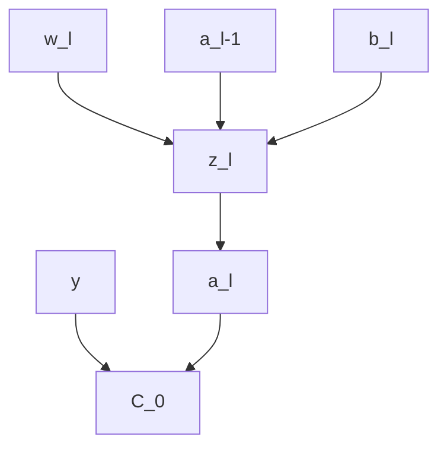

---
{"dg-publish":true,"permalink":"/machine-learning/module-4-sparse-modeling-and-estimation-modeling-time-series-data-deep-learning-and-feature-representation-learning/","tags":["Semester-7","Machine-Learning","Deep-Learning","Neural-Networks","Large-Language-Models","Transformers"],"created":"2025-08-29T17:21:01.170+05:30","updated":"2025-09-04T21:40:40.207+05:30"}
---

---
# Index

1. [[#Sparse Modeling]]
2. [[#Sparse Estimation]]
3. [[#Modeling Time Series and Sequence Data.#Pre-requisite -- Neural Networks and Deep Learning.]]
4. [[#The Humble Neural Network (Artificial Neural Networks - ANNs)]]
5. [[#The structure of a neural network.]]
6. [[#How Neural Networks learn -- Gradient Descent.]]
7. [[#Backpropagation, the heart of learning in neural networks]]
8. [[#Neural Networks Large Language Models]]
9. [[#Large Language Models How Transformers work.]]
10. [[#Transformers How the Attention mechanism works.]]
11. [[#Modeling Time Series data Pre-requisite -- Feature Representation Learning]]
12. [[#What is a Good Representation?]]
13. [[#Supervised Feature Representation Learning.]]
14. [[#1. Convolutional Neural Networks (CNNs)]]
15. [[#How does the Convolutional Layer work?]]
16. [[#2. Recurrent Neural Networks (RNNs)]]
17. [[#How is this any different from Standard Neural Networks (the multi layered perceptron) or even the attention mechanism in Transformers?]]
18. [[#3. Backpropagation through time (BPTT) explained.]]
19. [[#Unsupervised Feature Representation Learning]]
20. [[#1. Autoencoders]]
21. [[#Variational Autoencoders (VAEs)]]
22. [[#2. Generative Adversarial Networks (GANs)]]
23. [[#3. Transformers (but how they tie with encoders and decoders).]]
24. [[#4. Graph Neural Networks (GNNs)]]
25. [[#Modeling Time Series Data (Finally)]]
26. [[#Classical Time-Series models]]
27. [[#Using deep learning models for modeling time series data.]]

---
# Sparse Modeling

Had to dig up a lot of the internet for this:

https://www.youtube.com/watch?v=oAVCEoySN4Y (it's an old 2015 NYU video, watch only if you can understand from that projector presentation).

https://www.youtube.com/watch?v=SbU1pahbbkc (A very cool video explanation on Compressed Sensing (how images can be compressed and decompressed) (It utilizes the same concepts for Sparse Modeling))

https://www.youtube.com/watch?v=inr-nGnVc0k (The mathematical foundation behind Compressed Sensing, also useful for Sparse Modeling)

https://www.youtube.com/playlist?list=PLMrJAkhIeNNRHP5UA-gIimsXLQyHXxRty (Full playlist)

## The Core Idea of Sparse Modeling

- You have some **data** (say images, audio, text, etc.).
    
- You want to represent each data point **efficiently** using only a few building blocks.
    
- Those building blocks are stored in a **dictionary** (matrix `W`).
    
- Each data point is expressed as a **combination of a few dictionary elements**. The coefficients for that combination are stored in `Z`.
    
- “Sparse” means **most coefficients in `Z` are zero** → only a handful matter for each data point.

So instead of storing/using all features, we try to find a **compressed, meaningful representation**.

---
##  Example (Analogy)

Think of Lego:

- You have a big Lego set (dictionary `W`).
    
- To build a spaceship (your data `X`), you only use a **few blocks** (coefficients in `Z`).
    
- You _could_ dump the entire box to build it, but that’s wasteful. Sparse modeling forces you to use **just the essential pieces**.

---
### How it Connects to Other Stuff You Know

- If you force each data point to use only **one block** → that’s like **K-means clustering**.
    
- If you force the blocks to be **orthogonal and compact** → that’s **PCA (Principal Component Analysis)**.
    
- Sparse modeling is **in between** → a flexible way to represent data with just enough pieces, but not too many.

---
## How Do We Find the Sparse Codes (`Z`)?

This is the “hard” part, because deciding which few coefficients to keep is tricky.

Two families of approaches:

1. **Greedy algorithms**
    
    - Matching Pursuit, Orthogonal Matching Pursuit
        
    - They pick one block at a time, improving the fit step by step.
        
    - Fast but approximate.
        
2. **Relaxed optimization (L1 minimization)**
    
    - Replace the “count non-zeros” rule with “penalize large coefficients.”
        
    - Leads to convex optimization → solvable with algorithms like LASSO, ISTA (Iterative Shrinkage-Thresholding Algorithm), FISTA (fast version).
        
    - More accurate but slower.

(We don't need to delve in too deep into all these algorithms, only one will do.)

---
## Why Bother?

Sparse modeling works surprisingly well for:

- Image denoising (remove noise but keep structure).
- Super-resolution (making images sharper).
- Feature extraction in recognition tasks (faces, objects).
- Learning compact, interpretable representations.

It’s used because it gives **state-of-the-art results** in many practical tasks.

---
## Sparse Modeling vs. Compressive Sensing

- **Compressive Sensing**: Start with compressed data and try to **reconstruct the full signal**.
    
- **Sparse Modeling**: Start with full data and try to **find a sparse code (compressed representation)**.
    
- Equations look similar, but the goals differ.

---
## How to Think About It (without drowning in math)

1. You have data `X`.
2. You want `X ≈ W × Z` (dictionary × sparse codes).
3. Constraint: each column of `Z` should have only a few nonzero entries.
4. Algorithms help you find good `W` and `Z`.

---
# Example (with full pre-requisites mentioned)

This example should hopefully clear up any and all confusions including the mathematical backend.

### Pre-requisites we need (no crazy level math)

- **Linear algebra basics**: what a matrix, vector, and basis are (We already know this from [[Mathematics - 1A/Module 4 -- Vector Spaces#Basis of a Vector Space\|Module 4 -- Vector Spaces#Basis of a Vector Space]])
    
- **Norms**:
    
    - L2 norm = sum of squares (least squares).
    - L1 norm = sum of absolute values (promotes sparsity).
        
- **Optimization idea**: we’re minimizing something subject to a constraint.

---

## 1. What’s the problem? (The underdetermined system)

Imagine you’re solving:

$$C \Psi s = y$$

- $y$ = the few **measurements** you collected (like a handful of random pixels).
    
- $\Psi$ = the **basis** (e.g., Fourier or wavelet basis) that can represent your signal.
    
- $s$ = the **sparse coefficient vector** in that basis (only a few non-zeros).
    
- $C$ = the measurement/sampling matrix (which pixels or samples you actually observed).


Now:

- $y$ has way fewer entries than $s$.
- That means there are infinitely many possible $s$ that fit $y$.


So how do we find the _right_ $s$? → the **sparsest** one.

We do this with the help of something called "norms".

---
## Before that, what exactly is the sparse coefficient vector (or sparse matrix)?

https://www.geeksforgeeks.org/machine-learning/sparse-matrix-in-machine-learning/

==The sparse matrix is a matrix in which the vast majority of its elements are zero==. Formally, a matrix is considered sparse if the number of the non-zero elements is much smaller compared to the total number of the elements in the matrix. ==The Sparse matrices can be very large but have only a few non-zero elements.==

---
### Characteristics of Sparse Matrices

- **High Proportion of Zeroes:** The defining feature of the sparse matrix is that most of its elements are zeros.
- **Storage Efficiency:** The Sparse matrices can be stored the more efficiently compared to dense matrices reducing the amount of the memory required.
- **Computational Efficiency**: The Operations on sparse matrices can be optimized by the focusing only on the non-zero elements.

---
### Example

$$
\left[
\begin{array}{ccc}
  0 & 0 & 3  \\
  0 & 5 & 0 \\
  0 & 0 & 0  
\end{array}
\right]
$$


In this matrix, only two elements are non-zero (3 and 5) making it a sparse matrix with the 78% of the elements as zero.

---
## 🔹 Norms: Measuring Vector Size

==A **norm** is a function that tells you how “big” a vector is.  ==
Different norms = different ways of measuring.

### 1. L2 Norm (a.k.a. Euclidean norm)

$$
\mid\mid x \mid\mid_2 \ = \ \sqrt{x_1^2 \ + \ x_2^2 \ + \ \cdots \ + \ x_n^2}
$$

- This is the standard length/distance you already know (Pythagoras).
    
- Example:

$$x = (3, 4), \quad \mid \mid x \mid \mid_2 = \sqrt{3^2 + 4^2} = 5$$

---
### 2. L1 Norm (a.k.a. Manhattan norm)

$$\|x\|_1 = |x_1| + |x_2| + \dots + |x_n|$$

- Think of walking on a grid city like Manhattan — distance = sum of absolute steps.
    
- Example:

$$x = (3, 4), \quad \|x\|_1 = |3| + |4| = 7$$

- In modeling: minimizing $\|x\|_1$ tends to force some coefficients to become exactly zero → **sparsity**.

---
### 3. L0 “Norm” (not technically a norm, but used in sparse modeling)

$$\|x\|_0 = \text{number of nonzero entries in } \ x $$

- Example:
    
$$x = (3, 0, 0, 5), \quad \|x\|_0 = 2$$
    
- This directly measures sparsity.
- Problem: minimizing $\|x\|_0$ is computationally hard.

---
### 🚦 Why Norms Matter in Sparse Modeling

- OLS regression uses **L2 norm** (minimizes squared error) → solution spreads across features.
    
- Sparse modeling (LASSO, compressed sensing) uses **L1 norm** → solution naturally sets many coefficients to **zero**.
    
- Ideally, we’d want to minimize **L0 norm** (true sparsity), but that’s infeasible.


So the trick is:

$$\text{Minimize } \|x\|_1 \quad \text{instead of } \|x\|_0$$

→ efficient, yet still gives sparse solutions.

---
##  Example: Sparse Modeling with L2 vs L1

Suppose we want to solve the underdetermined system:

$$
x_1 \ + \ x_2 \ = \ 1
$$

This has infinitely many solutions:

 $$(1,0),(0,1),(0.5,0.5),(2,−1)$$
 , etc.


We need to pick the “best” solution using a norm.

---
### Case 1: Minimize L2 Norm

We want the solution with smallest $\|x\|_2$

$$\|x\|_2 = \sqrt{x_1^2 + x_2^2}​​$$

👉 The minimizer is

$x = (0.5, \, 0.5)$

- Both coefficients are **nonzero**.
- L2 spreads weight evenly → **not sparse**.

---
### Case 2: Minimize L1 Norm

We want the solution with smallest $\|x\|_1$​.

$$\|x\|_1 = |x_1| + |x_2|$$

👉 The minimizers are

x$$x = (1,0) \quad \text{or} \quad x = (0,1)$$

- One coefficient is **zero**.
- L1 promotes sparsity → exactly what we want in sparse modeling.

---
# ✅ Key Takeaway

- **L2 minimization → dense solutions** (all features get small weights).
    
- **L1 minimization → sparse solutions** (many weights forced to zero).
    
- This is why **LASSO (L1 penalty)** is central in sparse modeling, while **Ridge (L2 penalty)** is not.

---
## Geometric Intuition: How L1 and L2 norms look.


- Ridge (L2): penalty is a circle → touches constraint line at non-sparse points.
    
- Lasso (L1): penalty is a diamond → touches at corners (sparse solutions).

---
# Sparse Estimation

Now this is the application of Sparse Modeling in ML : Sparse Estimation

Sparse estimation is the process of estimating regression coefficients while enforcing sparsity, typically using L1 penalties (Lasso).

---
## Theoretical Basis -- The Problem

In regression, we usually want to fit a model:

$$
y \ = \ X \beta \ + \ \epsilon
$$

where:

- $y$ is the response vector (predicted output)
- $X$ is the design matrix (basically inputs)
- $\beta$  is the matrix of coefficients we want to estimate (the weights)
- $\epsilon$ : the noise (or errors)

Now the regression methods by default: the Standard Least Squared regression is

(don't focus on the equation, just try to understand what's the problem.)

The Ordinary Least Squares solution is"

$$
\hat{\beta}_{OLS} \ = \ \arg \ \min_{\beta} \| y \ - \ X\beta \|^2_2
$$

Now the problem is that if there are too many inputs, the OLS is not unique, and thus the model can overfit (memorize inputs only) and doesn't reveal sparsity, and thus won't be able to generalize.

---
## Sparse estimation -- The Solution

We often believe that **only a few predictors are truly important**.(Only a few weights are needed), so the rest unnecessary ones can be just turned off (set to zero).

So instead of just minimizing the squared error, we add a **penalty** to encourage sparsity in $\beta$ (the weights).

This is done, using the norms as stated previously, mostly L1(Lasso) and L2(Ridge) norms.

**Key difference**:

- Ridge shrinks coefficients, but rarely makes them exactly zero.
    
- Lasso _pushes some coefficients exactly to zero_ → gives sparse solutions.
    
This is the heart of **sparse estimation in regression**.

---
### How do the norms come into play here?

Sparse estimation applies the norms on the coefficients as penalties.

Basically:

$$
OLS \ loss(errors) \ + \ \lambda \ \cdot (penalty)
$$

with the penalty being L1 or L2. That's it.

---
## Minimal numerical example (no scary algebra)

Suppose we want to predict $y$ from two features $x_1$, $x_2$.

After training with OLS, it gives us:

$$
y \ = \ 3x_1 \ + 2x_2 
$$

(both coefficients non-zero)

- If we apply **ridge (L2)** with large $\lambda$:
    
$$y \approx 2.5x_1 + 1.7x_2$$

    
    (both smaller, but none exactly zero).
    
- If we apply **lasso (L1)** with large $\lambda$:
    
$$y \approx 3x_1 + 0\cdot x_2$$
    
    (one coefficient _killed off completely_).
    

That’s sparse estimation in action: L1 gives _feature selection_, L2 just smooths.

---

So, big picture:

- You only need to know _L1 = sparsity, L2 = shrinkage_.
- Lasso = L1 penalty → sparse estimation.
- Ridge = L2 penalty → non-sparse but stable estimation.


👉 The scary equations are just the formal definition of “error + penalty.”

---
# Modeling Time Series and Sequence Data.

Now here's where the real fun begins people. NEURAL NETWORKS!!

---
## Pre-requisite -- Neural Networks and Deep Learning.

# Deep Learning.

Before learning how to model different time series data with different types of neural networks, we need to know exactly what a neural network is under the hood, and how it works, how it learns.

This will tie back to almost everything we have learnt so far, so be sure to have learnt all the previous modules and that you have fairly good understanding of them.

Now, without further ado, let's unfurl the curtain on the next act, - The Humble Neural Network.

---
## The Humble Neural Network (Artificial Neural Networks - ANNs)

https://www.geeksforgeeks.org/artificial-intelligence/artificial-neural-networks-and-its-applications/

https://www.youtube.com/watch?v=aircAruvnKk&list=PLZHQObOWTQDNU6R1_67000Dx_ZCJB-3pi&index=1 (3blue1brown's series on Deep Learning and Neural Networks and how they work. It's an absolute watch, even better if you watch the videos first then come back here, since I too watched them first.)

### 1. But what is a neural network?

Instead of using a statistical ML model, like a Naive Bayes classifier, an SVM or other models like K-Means or clustering based models, we take the same let's say  a linear regression model, but instead convert into a network of artificial neurons.

==Artificial Neural Networks (ANNs) are computer systems designed to mimic how the human brain processes information. Just like the brain uses neurons to process data and make decisions, ANNs use artificial neurons to analyze data, identify patterns and make predictions. These networks consist of layers of interconnected neurons that work together to solve complex problems==. The key idea is that ANNs can "learn" from the data they process, just as our brain learns from experience.


So, how do these neurons function?

Unlike pure biological neurons which are binary neurons and are either on or off depending on the task, artificial neurons represent state values between 0 and 1, called **activation states**.

## ****Artificial neurons vs Biological neurons****

| **Aspect**             | **Biological Neurons**                                                             | **Artificial Neurons**                                                                                         |
| ---------------------- | ---------------------------------------------------------------------------------- | -------------------------------------------------------------------------------------------------------------- |
| **Structure**          | **Dendrites**: Receive signals from other neurons.                                 | **Input Nodes**: Receive data and pass it on to the next layer.                                                |
|                        | ***Cell Body (Soma)***: Processes the signals.                                     | **Hidden Layer Nodes**: Process and transform the data.                                                        |
|                        | **Axon**: Transmits processed signals to other neurons.                            | **Output Nodes**: Produce the final result after processing.                                                   |
| **Connections**        | **Synapses**: Links between neurons that transmit signals.                         | **Weights**: Connections between neurons that control the influence of one neuron on another.                  |
| **Learning Mechanism** | **Synaptic Plasticity**: Changes in synaptic strength based on activity over time. | **Backpropagation**: Adjusts the weights based on errors in predictions to improve future performance.         |
| **Activation**         | **Activation**: Neurons fire when signals are strong enough to reach a threshold.  | **Activation Function**: Maps input to output, deciding if the neuron should fire based on the processed data. |


For example take this 28x28 pixel bit space for representing the image of a number via neurons.


You can see the image has a shadow as well, which is also represented by a group of neurons having different activation values. The closer they are to 1, indicates how positive the neuron is towards that action, or in this case, lighting up to represent a small pixel of the number's image.

---
### The structure of a neural network.


Different neural networks like Recurrent Neural Networks (RNNs), Convolutional Neural Networks (CNNs), Long Term Short Term Memory Neural Networks (LSTMNNs) all have different architectures.

So instead of focusing on them, ==we are going to start at the founding pioneer stage, the simple "perceptron". It was developed by Frank Rosenblatt in 1957== when Rosenblatt published pioneering work on the first machine learning algorithm for artificial neurons, known as the perceptron. He helped revolutionize the field of artificial intelligence through his work on enabling computers to learn from experience.

A simple neural network, the perceptron (and other neural nets) have 3 distinctions.

- **The input layer**: This is where the data is plugged in.
- **The hidden layer (or layers)**: This is the where the magic happens. 
- **The output layer**: This is where we get to see the output.

Now, in understanding how the perceptron works, let's take a very simple example dataset, which itself is inspired from the MNIST dataset (https://www.kaggle.com/datasets/hojjatk/mnist-dataset). The MNIST database of handwritten digits has a training set of 60,000 examples, and a test set of 10,000 examples.

Now of course we won't be using that many examples. Instead let's just proceed with what 3blue1brown did in his video, to maintain continuity between my notes and the video.

---
#### The input layer

For the first layer, let's take our 28x28 image pixel bit space, and to represent it as a layer of input neurons, we can simply multiply it, to get 784 which will be the number of neurons in our input layer.


---
#### The output layer.

The output layer in this case, has only 9 neurons each representing a digit from 0-9.


---
#### The hidden layers


These are some in-between layers, whose purpose, we will know later on.

---
#### All-together


This is our full simple perceptron, in action, predicting some inputs to the output of the digit of 7.

---
#### The weights, biases and activations of the neurons.

Now, since we already know that activation is the value of a neuron, which depicts how much the neuron is in favor of a particular pattern.

But, we don't have any control over how this activation value is set or even directly set them ourselves.

Instead what we have, is the control over the weights and biases.

The weights here, being the strength of the edges (or connections from one neuron to another)


And so, in place of our traditional regressions where we have $x$, an arbitrary input variable, we take the activations as inputs instead.

$$
w_1a_1 \ + \ w_2a_2 \ + \ w_3a_3 \ + \ w_4a_4 \ + \ \cdots \ w_na_n
$$

So this essentially becomes a **weighted sum** of all the activation values.

Now, if we can effectively control the weights from one layer to the next, we can influence the model on specific patterns leading to a very specific output.

Now, in order to get a value only between $0$ and $1$, we need to **clamp the weighted sum between the two values.**

One very popular function to do that is the sigmoid kernel, which basically is:

$$
\sigma(x) \ = \ \frac{1}{1 \ + \ e^{-x}}
$$

which looks like this when graphed:


what this does is basically this:

Very negative values end up close to zero (values on the red segment)
Very positive values end up close to one (values on the green segment)
And values close to zero just end up increasing a bit ($0.1$, $0.2$)

So, if we apply :

$$
\sigma{(w_1a_1 \ + \ w_2a_2 \ + \ w_3a_3 \ + \ w_4a_4 \ + \ \cdots \ w_na_n)}
$$

We can clamp the output of the weighted sum between zero and one.

But that's not all, we also have the bias term remaining. This is the key motivating factor in nudging the activations towards something meaningful and not just random outputs.

Now what do we know of the bias so far? From  [[Machine Learning/Module 1 -- Supervised Learning -- Machine Learning#1. Linear Regression\|Module 1 -- Supervised Learning -- Machine Learning#1. Linear Regression]], we know that the bias is basically the default value of the equation when the inputs(features) of the equation are zero.

However that definition slightly changes when it comes to neural networks.

See, in order to effectively nudge the weighted sum towards something to get a meaningful activation value, we need to have a sort of threshold, a limiter, beyond which the weighted sum needs to exceed for the activation to signify a meaningful pattern of neurons to light up in the next layer, essentially and eventually influencing the final output.

This is the true purpose of the bias in the weighted sum here, since, the bias acts as the default values when all the other inputs (activations) are zero, which means that all the activations from the previous layer, times their respective weights, summed over, need to exceed that bias value to mean something.

Suppose, as shown in the video, we only want to neurons to activate when the weighted sum is greater than 10, so in order to do that, we purposely set the bias to $-10$, so that the weighted sum will have to have a value beyond 10, even 10.5 or 11, or even 20.


So, our weighted sum equation will end up as:

$$
\sigma{(w_1a_1 \ + \ w_2a_2 \ + \ w_3a_3 \ + \ w_4a_4 \ + \ \cdots \ w_na_n \ + \ b)}
$$


where $b$ is the bias.

And all, this was for just **one neuron**. Yes, all this hassle, all this computation, is just for one single neuron, which will be connected to each and every other neuron in the next layer, and this will continue till it reaches the final layer. So yeah, that's an awful amount of computation to by hand, and even for just plain old CPUs with their sequential execution architectures, which will be ridiculously slow.

---
##### Common Activation Functions in ANNs

==Activation functions are important in neural networks because they introduce non-linearity and helps the network to learn complex patterns==. Lets see some common activation functions used in ANNs:

1. [**Sigmoid Function**](https://www.geeksforgeeks.org/machine-learning/derivative-of-the-sigmoid-function/)**:** ==Outputs values between 0 and 1==. It is used in binary classification tasks like deciding if an image is a cat or not.
2. [**ReLU (Rectified Linear Unit)**](https://www.geeksforgeeks.org/deep-learning/relu-activation-function-in-deep-learning/)**:** ==A popular choice for hidden layers==, it returns the input if positive and zero otherwise. It helps to solve the [vanishing gradient problem](https://www.geeksforgeeks.org/deep-learning/vanishing-and-exploding-gradients-problems-in-deep-learning/).
3. [**Tanh (Hyperbolic Tangent)**](https://www.geeksforgeeks.org/deep-learning/tanh-activation-in-neural-network/)**:** ==Similar to sigmoid but outputs values between -1 and 1. It is used in hidden layers when a broader range of outputs is needed==.
4. [**Softmax**](https://www.geeksforgeeks.org/deep-learning/the-role-of-softmax-in-neural-networks-detailed-explanation-and-applications/)**:** ==Converts raw outputs into probabilities used in the final layer of a network for multi-class classification tasks==.
5. [**Leaky `ReLU`**](https://www.geeksforgeeks.org/machine-learning/Leaky-Relu-Activation-Function-in-Deep-Learning/)****:**** A variant of `ReLU` that allows small negative values for inputs ==helps in preventing “dead neurons” during training==.

---
#### Calculating the total number of parameters of the neural network.

Now, you must have seen the term parameter quite often, if you have dabbled in running large language models locally on your pc.

For example, the most popular open source model, deepseek-r1:

https://ollama.com/library/deepseek-r1

And all other models like it, are represented in different parameters:


All have different number of "billion parameters" as represented in "1.5b, 7b, 8, 14b, 32, 70b and 671b" all with differing sizes, starting from the model with the lowest number of parameters having the lowest size, up to a gigantic size of 404GB for the 671 billion parameter model.

For our humble perceptron example though:


The math works like this:

784 neurons in the input layer is linked to the first hidden layer of 16 neurons, so we get $784\times16 \ = \ 12544 \ +$ 16 neurons from the first hidden layer is linked to the 16 neurons of the second hidden layer, so we get $12544 \ + \ 256 \ = \ 12,800 \ +$  16 neurons from the second input layer is linked to the last output layer of 10 neurons, so we get $12800 \ + \ 160 \ = \ 12960 \ +$ the biases starting from the first hidden layer and ending at the final output layer gives us :

$12960 \ + \ 42 \ = \ 13,002$ parameters in this model.

---
### How Neural Networks learn -- Gradient Descent.

We already once covered the Gradient Descent method back in [[Machine Learning/Module 2 -- Unsupervised Learning -- Machine Learning#Methods of matrix completion.\|Module 2 -- Unsupervised Learning -- Machine Learning#Methods of matrix completion.#1. Gradient Descent]]

Still, let's recap. However, if you are already confident in Gradient Descent, you can skip ahead to [[#How this ties to learning in Neural Networks]].

---
### What is Gradient Descent?

**Gradient Descent** ==is an iterative optimization algorithm widely used in machine learning to minimize loss (cost) functions==.  

The core idea:

- Start at a random point (guess for parameters/weights).
- Move in the direction of steepest descent (the negative of the gradient).
- Keep repeating until you reach the minimum or can't get lower.

It’s like **walking downhill**: you keep stepping in the direction that slopes most steeply down, each step being proportional to how steep the surface is beneath your feet.

---
### Quick Numerical Example

Of course, we need to route through a pre-requisite example of how to find the gradient vector of a scalar field first, just to recap everything.


The gradient of a scalar field $f(x, y, z)$ is a vector field given by:

$$
\nabla f \ = \ (\frac{df}{dx}, \ \frac{df}{dy}, \ \frac{df}{dz})
$$

For a 2D scalar field, that would be : $\nabla f \ = \ (\frac{df}{dx}, \ \frac{df}{dy})$

A small example:

Let's say we have a scalar function:

$$
\phi \ = \ 3x^2y \ - \ y^3z^2
$$

We have to find it's gradient at points $1, -2, -1$

Finding each partial derivative:

$$
\frac{d\phi}{dx} \ = \ 6xy
$$

$$
\frac{d\phi}{dy} \ = \ 3x^2 \ - \ 3y^2z^2
$$

$$
\frac{d\phi}{dz} \ = \ -2y^3z
$$


Final gradient:

$$
6xy \ \hat{i} \ + \ (3x^2 \ - \ 3y^2z^2) \ \hat{j} \ - \ 2y^3z \ \hat{k}
$$

$$
= \ (6\times1\times-2) \ \hat{i} \ + \ (3 \times (1)^2 \ - \ 3\times(-2)^2 \times (-1)^2) \ \hat{j} \ - \ (2 \times (-2)^3 \times -1) \ \hat{k}
$$

$$
= \ -12 \ \hat{i} \ - \  9 \ \hat{j} \ - \ 16 \ \hat{k} 
$$

---
### The algorithm of Gradient Descent, with a step-by-step example.

Gradient descent, in short, is just the negative of the gradient.

Let's minimize a simple function:

$$
f(x) \ = \ (x \ - \ 3)^2
$$

- This is a parabola, shaped like a bowl, whose minimum is at $x\ = \ 3$, where $f(x) \ = \ 0$.

You might be wondering as to how to figure out the minimum of this function?

Simple, just put the value in $x$, that would result the whole function to be zero.

#### Step 1: Start with an initial guess.

Let's say $x_0 \ = \ 0$

---
#### Step 2: Calculate gradient (slope)

For our function, the gradient is:

$$\nabla f \ = \ \frac{df}{dx} \ \hat{i}$$


which would be:

$$
f'(x) \ = \ 2(x \ - \ 3) \ \times \ (1 \ - \ 0)
$$

$$
f'(x) \ = \ 2(x \ - \ 3)
$$

---
#### Step 3: Iterate, update the parameter.

The update rule is:

$$
x_{new} \ = \ x_{old} \ - \ \eta f'(x_{old})
$$

where $\eta$ (pronounced "eta" (eeh-ta)) is the learning rate (or the step size, let's say $0.1$ )

Here $f'(x_{old})$ is actually the gradient of the function with the input as the old $x$ value.

So a more better version of this would be:

$$
x_{new} \ = \ x_{old} \ - \ \eta \nabla f(x_{old})
$$

where the original function $f$  is the loss function which we are trying to minimize, and $\nabla f$ is the gradient

---
#### Step 4: Repeat till you get $x$ very close to it's minimum.

**Some example iterations would include**

```python
Iteration 1: x = 0.6000000000000001
Iteration 2: x = 1.08
Iteration 3: x = 1.464
Iteration 4: x = 1.7711999999999999
Iteration 5: x = 2.01696
Iteration 6: x = 2.213568
Iteration 7: x = 2.3708544
Iteration 8: x = 2.49668352
Iteration 9: x = 2.597346816
Iteration 10: x = 2.6778774528
Iteration 11: x = 2.74230196224
Iteration 12: x = 2.793841569792
Iteration 13: x = 2.8350732558336
Iteration 14: x = 2.86805860466688
Iteration 15: x = 2.894446883733504
Iteration 16: x = 2.9155575069868034
Iteration 17: x = 2.932446005589443
Iteration 18: x = 2.945956804471554
Iteration 19: x = 2.9567654435772432
Iteration 20: x = 2.9654123548617948
Iteration 21: x = 2.9723298838894356
Iteration 22: x = 2.9778639071115487
Iteration 23: x = 2.982291125689239
Iteration 24: x = 2.985832900551391
Iteration 25: x = 2.988666320441113
Iteration 26: x = 2.9909330563528904
Iteration 27: x = 2.9927464450823122
Iteration 28: x = 2.99419715606585
Iteration 29: x = 2.99535772485268
Iteration 30: x = 2.996286179882144
Iteration 31: x = 2.997028943905715
Iteration 32: x = 2.9976231551245722
Iteration 33: x = 2.9980985240996576
Iteration 34: x = 2.9984788192797263
Iteration 35: x = 2.998783055423781
Iteration 36: x = 2.999026444339025
Iteration 37: x = 2.99922115547122
Iteration 38: x = 2.9993769243769757
Iteration 39: x = 2.9995015395015807
Iteration 40: x = 2.9996012316012646
Iteration 41: x = 2.9996809852810116
Iteration 42: x = 2.999744788224809
Iteration 43: x = 2.9997958305798473
Iteration 44: x = 2.999836664463878
Iteration 45: x = 2.9998693315711025
Iteration 46: x = 2.999895465256882
Iteration 47: x = 2.9999163722055053
Iteration 48: x = 2.999933097764404
Iteration 49: x = 2.9999464782115233
Iteration 50: x = 2.9999571825692186
Iteration 51: x = 2.999965746055375
Iteration 52: x = 2.9999725968443
Iteration 53: x = 2.99997807747544
Iteration 54: x = 2.999982461980352
Iteration 55: x = 2.9999859695842814
Iteration 56: x = 2.999988775667425
Iteration 57: x = 2.99999102053394
Iteration 58: x = 2.999992816427152
Iteration 59: x = 2.9999942531417214
Iteration 60: x = 2.999995402513377
Iteration 61: x = 2.9999963220107015
Iteration 62: x = 2.999997057608561
Iteration 63: x = 2.999997646086849
Iteration 64: x = 2.999998116869479
Iteration 65: x = 2.9999984934955832
Iteration 66: x = 2.9999987947964666
Iteration 67: x = 2.999999035837173
Iteration 68: x = 2.9999992286697386
Iteration 69: x = 2.999999382935791
Iteration 70: x = 2.9999995063486327
Iteration 71: x = 2.999999605078906
Iteration 72: x = 2.9999996840631247
Iteration 73: x = 2.9999997472504996
Iteration 74: x = 2.9999997978004
Iteration 75: x = 2.9999998382403197
Iteration 76: x = 2.999999870592256
Iteration 77: x = 2.999999896473805
Iteration 78: x = 2.9999999171790437
Iteration 79: x = 2.999999933743235
Iteration 80: x = 2.999999946994588
Iteration 81: x = 2.99999995759567
Iteration 82: x = 2.999999966076536
Iteration 83: x = 2.9999999728612288
Iteration 84: x = 2.999999978288983
Iteration 85: x = 2.9999999826311865
Iteration 86: x = 2.999999986104949
Iteration 87: x = 2.9999999888839595
Iteration 88: x = 2.9999999911071678
Iteration 89: x = 2.9999999928857344
Iteration 90: x = 2.9999999943085873
Iteration 91: x = 2.9999999954468697
Iteration 92: x = 2.999999996357496
Iteration 93: x = 2.9999999970859967
Iteration 94: x = 2.999999997668797
Iteration 95: x = 2.9999999981350376
Iteration 96: x = 2.99999999850803
Iteration 97: x = 2.999999998806424
Iteration 98: x = 2.9999999990451394
Iteration 99: x = 2.9999999992361115
Iteration 100: x = 2.9999999993888893
Iteration 101: x = 2.9999999995111115
Iteration 102: x = 2.9999999996088893
Iteration 103: x = 2.9999999996871116
Iteration 104: x = 2.999999999749689
Iteration 105: x = 2.9999999997997513
Iteration 106: x = 2.999999999839801
Iteration 107: x = 2.9999999998718407
Iteration 108: x = 2.9999999998974727
Iteration 109: x = 2.999999999917978
Iteration 110: x = 2.9999999999343823
Iteration 111: x = 2.999999999947506
Iteration 112: x = 2.9999999999580047
Iteration 113: x = 2.9999999999664038
Iteration 114: x = 2.999999999973123
Iteration 115: x = 2.999999999978498
Iteration 116: x = 2.9999999999827986
Iteration 117: x = 2.999999999986239
Iteration 118: x = 2.999999999988991
Iteration 119: x = 2.999999999991193
Iteration 120: x = 2.999999999992954
Iteration 121: x = 2.999999999994363
Iteration 122: x = 2.9999999999954907
Iteration 123: x = 2.9999999999963927
Iteration 124: x = 2.9999999999971143
Iteration 125: x = 2.9999999999976916
Iteration 126: x = 2.9999999999981535
Iteration 127: x = 2.999999999998523
Iteration 128: x = 2.9999999999988183
Iteration 129: x = 2.9999999999990545
Iteration 130: x = 2.9999999999992437
Iteration 131: x = 2.999999999999395
Iteration 132: x = 2.999999999999516
Iteration 133: x = 2.9999999999996128
Iteration 134: x = 2.99999999999969
Iteration 135: x = 2.999999999999752
Iteration 136: x = 2.999999999999802
Iteration 137: x = 2.9999999999998415
Iteration 138: x = 2.999999999999873
Iteration 139: x = 2.9999999999998983
Iteration 140: x = 2.9999999999999187
Iteration 141: x = 2.999999999999935
Iteration 142: x = 2.999999999999948
Iteration 143: x = 2.9999999999999583
Iteration 144: x = 2.9999999999999667
Iteration 145: x = 2.9999999999999734
Iteration 146: x = 2.9999999999999787
Iteration 147: x = 2.999999999999983
Iteration 148: x = 2.9999999999999867
Iteration 149: x = 2.9999999999999893
Iteration 150: x = 2.9999999999999916
Iteration 151: x = 2.9999999999999933
Iteration 152: x = 2.9999999999999947
Iteration 153: x = 2.9999999999999956
Iteration 154: x = 2.9999999999999964
Iteration 155: x = 2.9999999999999973
Iteration 156: x = 2.999999999999998
Iteration 157: x = 2.9999999999999982
Iteration 158: x = 2.9999999999999987
Iteration 159: x = 2.999999999999999
Iteration 160: x = 2.999999999999999
```

I took the liberty to cook up a python script to see exactly in how many iterations we can get as close as possible to the minimum, $3$.

It took a total of 159 iterations to be exact. Which is why iterative methods are best left to computers, but the knowledge is still needed, hence why I added this method.

---
#### Step 5 : Plot the iterations.

Again, best left to computers.


- The blue curve is $f(x)$.
- Red dots show each gradient descent step.
- You see how the steps start large (when farther away and the slope is steep), and get smaller as you approach the minimum.

Or a shortened one:


---
#### Types of Gradient Descent

- **Batch Gradient Descent**: Compute the gradient using the whole dataset before each update.
- **Stochastic Gradient Descent (SGD)**: Update with the gradient from one example at a time.
- **Mini-batch Gradient Descent**: Updates with gradient from a small random subset (mini-batch); the most popular in practice.

---
## How this ties to learning in Neural Networks

https://www.youtube.com/watch?v=IHZwWFHWa-w&list=PLZHQObOWTQDNU6R1_67000Dx_ZCJB-3pi&index=2

Referencing this video, take this picture for example:


We wanted the network to predict the given input image as the number "3", however, it instead gave various activation outputs for a lot of numbers, which becomes a hodgepodge.

So, how do we fix this, and instead of berating the network that it's trash, make it learn?

We do this by introducing cost functions. Why cost functions?

Let's head back to semester 4, [[Artificial Intelligence/Module 2 -- Search Strategies and Adversarial Search#Heuristic Search Strategies Informed search algorithms & Shortest Path Algorithms.\|Module 2 -- Search Strategies and Adversarial Search#Heuristic Search Strategies Informed search algorithms & Shortest Path Algorithms.]]

**Core Idea:** ==At each step, the algorithm selects the node that appears to lead to the goal state most quickly, according to the heuristic function==. It essentially "greedily" chooses the path that seems best in the short term, without considering the long-term consequences.

In short, we incentivize the network to select a path that has a the lowest cost for it's intended pattern finding based on the input.

Now, what is this cost function? How do we get the desired heuristic cost values per output?

We can get that by adding up the squares of the differences of each output activation values which the network gives, from the desired output activation values we want the network to give for that specific output neuron.


So, for the third neuron, the activation value, $(0.88 \ - \ 1.00)^2 \ = \ 0.0144$ which is very very close to zero, and the smallest out of all the other values (you can just by just squaring the rest as they are just subtracting zero.)

So by default the network will be incentivized to choose the path of neurons in the previous layer to give a very high activation value for this specific neuron, for the input 3.

Now this looks good enough on the surface, but the cost function **is mapped out across the entire network**, so it's total number of inputs is basically the total number of parameters of the network, or, all of the total 13,002 weights and biases.

That's a **lot of computation**.

---
### A common misconception

So, you might be thinking, since the **cost function depends on all weights and biases**, why can’t we just compute the _exact weights_ that minimize the cost in one go (like solving equations), instead of iteratively doing gradient descent?

The short answer: **the cost function is too complex to solve directly**. Especially with this many weights and biases.

#### Nature of the Cost Function

- In a simple linear regression:

$$
y \ = \ w^T x \ + \ b
$$
    
    the cost function (squared error) is a **convex quadratic**.
    
    - We _can_ solve directly using linear algebra (normal equations).
    - That gives exact weights in one shot.
    
- In a neural network:
    
    - Activations → nonlinear (sigmoid, ReLU, tanh).
    - Layers stack → compositions of nonlinear functions.
    - Cost function becomes a **high-dimensional, non-convex surface** with many valleys, ridges, and plateaus.


- No closed-form formula exists for the global minimizer.


So you can’t just “subtract directly” to jump to the answer.

---
### How Gradient Descent saves the day

Now, **this, is where gradient descent comes into play.**

Think of gradient descent as feeling your way down a mountain with fog:

- You don’t know where the lowest point is.
- But the gradient tells you the **steepest downhill direction** at each step.
- By repeatedly stepping in that direction, you (hopefully) reach a low valley (local minimum, often good enough).
- Gradient-descent handles this in iterations, with the help of an algorithm called backpropagation (more on this in the next section.)

So, that's how, we eventually reach a vector matrix of weights and biases after the gradient descent, each of which when applied, tells us how to **nudge** the network towards the lowest possible activation value for that specific neuron. And not just that, to the reader, it also tells us very specific information as to 


Suppose, we take this matrix right here:

$$
-\nabla C(\bar{W}) \ = \ 
\left[
\begin{array}{ccc}
0.18 \\
0.15 \\
-0.51 \\
\vdots \\
0.40 \\
-0.32 \\
0.82 \\
\end{array}
\right]
$$


The values of this cost matrix tells us something very precise about all the weights.

For example, 

$w_0 \ = \ 0.18$, means that $w_0$ should increase, but not that much.
$w_1 \ = \ 0.15$, means that $w_1$ should increase, but not that much, and certainly not more than $w_0$.
$w_2 \ = \ -0.51$, means that $w_2$ should decrease, as denoted by the negative sign.

and so on...


This is represented in the network as **strengthening of edges**, meaning some edges will matter more, some will matter less, all pertaining to the path of finding patterns starting from the input layer for a specific combination of inputs and ending at the output layer, showing the desired output.

---
### Tuning back: How might Sparse Modeling help us here?

Since the cost function is an amalgamation of (in this example), $13,002$ parameters, if we compute over all of them, it will be incredibly tedious computation.

What if we could somehow, optimize this by finding only the relevant weights and turning the unnecessary ones off? That would save us a lot of computation cycles in the gradient descent iterations.

That's where our sparse modeling kicks in, optimizing the cost function by using either the L1 or L2 norms to get us a sparse matrix by only finding the relevant weights and turning off the rest.

---
### Backpropagation, the heart of learning in neural networks

#### Quick history about the backpropagation algorithm(skip if you just want to get into the algorithm itself only)

Now, Backpropagation was not theorized and published till 1986, so after Rosenblatt published his initial findings on the perceptron and tinkered around with it, work on the perceptron gradually slowed down and led to the the decades of the "AI winter", where most researchers moved on, due to significant problems with perceptron not being able to learn properly and the computation bottleneck faced with vast amount of weights and biases being tweaked manually in a network of multiple layers and a large dataset.

That's where Geoffrey Hinton came in. He is dubbed "The Godfather of deep learning". Hinton is recognized for his pivotal role in reviving neural network research and laying the groundwork for modern deep learning. He persisted in the field during the decades of the "AI winter," when most researchers had moved on.

In 1986, Hinton co-authored a highly influential paper that popularized the backpropagation algorithm, an efficient method for training multi-layered neural networks. While not his invention alone, this work demonstrated that deep networks could effectively learn.

His work on unsupervised learning with Restricted Boltzmann Machines and his collaboration on the AlexNet deep convolutional neural network in 2012 demonstrated that deep neural networks could achieve breakthroughs in image recognition and other tasks, launching the current AI boom.

---
### Back to backpropagation

https://www.youtube.com/watch?v=Ilg3gGewQ5U&list=PLZHQObOWTQDNU6R1_67000Dx_ZCJB-3pi&index=3

So, now that we can influence the weights and biases to get a certain pattern of activations, these can only reflect in the output layer if the previous layers' weights and biases are set accordingly.

But how do we start at the last layer and re-adjust the previous layers? 

It's quite simple, once we calculate the gradient descent vector matrix containing the required weights and biases for the last layer to reflect the desired output for that neuron, we propagate those weights and biases backwards to the previous layer so that the last layer is affected.

Similarly, now that we know the desired weights and biases of the second last layer, we can again find the minimized cost function using gradient descent so that these desired values can be maintained in the second last layer, but applying the newly calculated weights and biases the layer before that, i.e. the third last layer.

Recursively we can keep on proceeding till we reach the second layer, i.e the layer after the input layer, thus successfully tweaking the weights and biases of the entire network.


Now, for computers, going along the traditional route and calculating the gradient descent for all the cost functions of the entire network layer by layer is extremely demanding and time consuming, since each calculation will use every single training example in the dataset, which can have potentially thousands of samples. So here's what's done in practice instead:

The training dataset is shuffled and split into **mini-batches**, each batch can have let's say a 100 samples. Now we compute the gradient descent over these mini batches instead. It's not going to be as accurate as the original method of going over the entire dataset, but it's going to give us a close up approximate of the cost function's minima, essentially, a local minima. However, the major advantage is the boost in training speed.

This is how both methods would look when plotted.


The image on the left is the true gradient descent over all of the training dataset at once while the right side is the result of training over mini-batches over iterations. The left one would look like a careful man taking a precise calculation and going downhill, while the right one is a drunk man descending randomly but much faster than the man on the left.

This method of gradient descent via backpropagation on mini-batches, is called the **Stochastic Gradient Descent method**.

---
### The math behind backpropagation.

https://www.youtube.com/watch?v=tIeHLnjs5U8&list=PLZHQObOWTQDNU6R1_67000Dx_ZCJB-3pi&index=4

#### Pre-requisite: Multivariable differential calculus and the chain rule.

https://www.youtube.com/playlist?list=PLF-vWhgiaXWNi9OuPCbguaPgL67XH7crm

You can refer to this playlist for a quick recap of the multivariable calculus chain rule (TheOrganiChemistryTutor math)

https://www.youtube.com/watch?v=XipB_uEexF0&list=PLF-vWhgiaXWNi9OuPCbguaPgL67XH7crm&index=3

A very simple method of solving a multivariable calculus equation via the chain rule is to draw a tree like this:


And once we have constructed the equation, we can then just perform standard differentiation rules to solve it.

---
#### Coming back to the math behind backpropagation

Let's lose the multi neurons per layer and fall back to a simple model where there is only one neuron per layer.


Here we have a simple network of 4 layers, the input layer, two hidden layers and the output layer, each having only one neuron.

The $C(w_1, b_1, w_2, b_2, w_3, b_3)$ are the weights and biases of the neurons starting from the first hidden layer to the output layer.

Let's give some notations.

- $y$ is the desired activation, $1.00$
- $a^{(L)}$ is the predicted activation value of the output layer, let's say $0.66$
- $a^{(L-1)}$ is the predicted activation value of the second last layer, let's say $0.48$.

The cost function of the last layer is the square of the difference between the predicted and the desired activations.

$$C_0 \ = \ (a^{(L)} \ - \ y)^2$$

and the activation is:

$$
a^{(L)} \ = \ \sigma{(w^{(L)} a^{(L-1)} \ + \ b^{(L)})}
$$


We can set $z^{(L)} \ = \ w^{(L)} a^{(L-1)} \ + \ b^{(L)}$

So, 

$$
a^{(L)} \ = \ \sigma{(z^{(L)})}
$$

which contains the activation of the previous layer.

Now, we can visualize the dependency tree as follows:



or, for a better depiction:


Now, we can use this dependency tree to answer some questions like:

How does the weight of the last neuron affect the cost function?

How does the bias of the last neuron affect the cost function?

For that we need to find two derivatives, or the rate of change of the cost function w.r.t both the weight and the bias separately:

Based on that, we get two equations:

$$
\frac{dC_0}{dw^{(L)}} \ = \ \frac{dz^{(L)}}{dw^{(L)}} \ \cdot \ \frac{da^{(L)}}{dz^{(L)}} \ \cdot \ \frac{dC_0}{da^{(L)}}
$$


first part says : **How does z(the weighted sum) depend on the weight itself**?

second part says: **How does the activation depend on the weighted sum?**

third part says: **How does the cost function depend on the activation?**

Put them together and we get the rate of change of the cost function w.r.t the weight.

Solving it, we get:


Now, similarly, for the bias:

$$
\frac{dC_0}{db^{(L)}} \ = \ \frac{dz^{(L)}}{db^{(L)}} \ \cdot \ \frac{da^{(L)}}{dz^{(L)}} \ \cdot \ \frac{dC_0}{da^{(L)}}
$$


Only the first part changes, which says: **How does the weighted sum depend on the bias this time?**, while the rest of the parts remain the same.

Put them together and we get the rate of change of the cost function w.r.t the bias.

Put these two together and we get how the cost function of the current layer depends on both the weight and bias of the previous layer, and thus what values to propagate backwards to the previous layer.

Now, falling back to our true neural network example, the rate of change of the cost function w.r.t the weight would be:

$$
\frac{dC_0}{dw^{(L)}} \ = \ \frac{1}{n} \ \sum^{n \ - \ 1}_{k \ = \ 0} \frac{dC_k}{dw^{(L)}}
$$

which is the derivative over the average of all training examples, per mini-batch.

Similarly, for the bias:

$$
\frac{dC_0}{db^{(L)}} \ = \ \frac{1}{n} \ \sum^{n \ - \ 1}_{k \ = \ 0} \frac{dC_k}{db^{(L)}}
$$

So, our final cost matrix will be:


$$
-\nabla C(\bar{W}) \ = \ 
\left[
\begin{array}{ccc}
\frac{dC_0}{dw^{(1)}} \\
\frac{dC_0}{db^{(1)}} \\
\vdots \\
\frac{dC_0}{dw^{(L)}} \\
\frac{dC_0}{db^{(L)}} \\
\end{array}
\right]
$$


And that concludes, how backpropagation, the heart of learning in neural networks, works on the math side.

---
## Neural Networks: Large Language Models

https://www.youtube.com/watch?v=LPZh9BOjkQs&list=PLZHQObOWTQDNU6R1_67000Dx_ZCJB-3pi&index=5 (You must watch this video as the most of the concept can only be understood with visual animations, which I can't very much, properly complement with my simple text.)

Now we delve under the hood of the most widely used and the main factor behind the AI boom, the Large Language Model.

Building on our knowledge of the humble perceptron and how it works, how it learns via backpropagation, large language models introduce some new tech to the table.

### The Core Idea of an LLM

==Think of a standard LLM like a highly advanced, super-powered autocomplete==. Its single, simple goal is to predict the most likely next word in a sentence. When you interact with a chatbot, it's doing this over and over, one word at a time, to build a full response. What makes it so eerily good at this is the scale and the architecture.

---
#### 1. The Transformer: The New Neural Network Architecture

Remember how our simple neural network processed data in layers? Well, ==old-school language models had to process text one word at a time, which was slow and hard to keep track of long sentences==.

==Then came the **Transformer**. This new architecture was a revolution! Instead of processing words sequentially, it soaks in the entire input text all at once, in parallel. This makes it incredibly efficient and allows it to "see" the entire context simultaneously==.

---
#### 2. Word Embeddings: Giving Words Meaning

You know how a neuron takes in numerical values? LLMs do the same. First, every word (or even a part of a word) is converted into a list of numbers called a **vector**. This isn't just a random assignment; ==this vector actually encodes the word's meaning based on how it's used in the training data==.

How the transformer does that, is covered in the detail in the next section.

Words with similar meanings will have similar vectors. For example, the vectors for "king" and "queen" will be very close in this mathematical space, while the vector for "bicycle" will be far away. This gives the model a deeper understanding of language beyond just the words themselves.

---
#### 3. The Attention Mechanism: The Secret Sauce


This is the true genius of the Transformer. ==The **attention mechanism** lets the model focus on the most important words in the input text when it's trying to predict the next word==. It's like having a superpower that allows the model to instantly see how every word relates to every other word.
This superpower works with the help of something called a vector dot product and measuring the angle between two vectors to detect their similarities, and then turning it into a probability distribution by something called a "softmax" function (more on this in the next section).

For example, in the sentence, "The river bank was flooded," the attention mechanism would help the model know that "bank" is related to "river," not to money. This ability to instantly connect and weigh the relevance of words is why LLMs can handle context so well.

---
#### 4. The Two-Step Training Process

LLMs don't just learn in one go; they go through a two-part training process:

- **Pre-training**: This is where the model is fed an absolutely mind-boggling amount of text from the internet. We're talking trillions of words here. Its only job is to learn to predict the next word. This is where it soaks up all the patterns, grammar, and general knowledge of human language.
    
- **Reinforcement Learning with Human Feedback (RLHF)**: ==After pre-training, the model is still a bit raw. It might say unhelpful or even problematic things. This is where humans come in! Workers give the model feedback on its responses, and this feedback is used to fine-tune the model's parameters. This second phase is what turns a highly-skilled word predictor into a useful and safe assistant==.

More on reinforcement learning in the next module.

---
## Large Language Models : How Transformers work.

https://www.youtube.com/watch?v=wjZofJX0v4M&list=PLZHQObOWTQDNU6R1_67000Dx_ZCJB-3pi&index=8 (must watch)

Alright, let's dive into the guts of the Transformer architecture, the engine that powers LLMs. Remember how we talked about neural networks having layers and parameters (weights and biases)? The Transformer is a specific, brilliant kind of neural network that organizes those parameters in a way that's perfect for handling language.

---
### Step 1: Tokenization

==The very first thing a Transformer does is turn the input text into a format it can understand: numbers. It doesn't just treat words as single units. The input is broken up into tiny chunks called **tokens**. These can be whole words, parts of words, or even punctuation==.

For example, the word "unbelievable" could be broken down into the tokens `["un", "believ", "able"]`. This approach helps manage a huge vocabulary and allows the model to handle words it's never seen before by combining existing tokens.

We also learnt about tokenization back in [[Compiler_Design/Module 2 -- Lexical Analysis#2. **Token Generation*\|Module 2 -- Lexical Analysis#2. **Token Generation*]] from compiler design. This is the same tokenization but a bit more focused on not taking every single word / number / symbol as a single token, and as much as that would help us to understand tokenization in Transformers easier, but in reality the tokenization in Transformers cut even deeper sometimes taking even subparts of a word or small character sequences from a part of a word as tokens as well.


If images or sounds are input, then the tokens can be like this: Small defined pixel by pixel parts of an image or small waveforms in case of a sound.


---
### Step 2: The Embedding Matrix: From Words to Vectors


==This step is where our tokens become the numerical inputs for the network==. The model has a giant internal list of every possible token, which we can think of as a huge matrix called the **embedding matrix** ($W_E$).


Each column of this matrix is a vector—a list of numbers—that represents a token. When you feed a token into the model, it simply looks up its corresponding vector in this matrix. These vectors are what actually get processed by the rest of the network.

The cool part is that during training, the values in this matrix are tuned so that tokens with similar meanings end up with vectors that are close to each other in a high-dimensional space. For example, the vector for "queen" might be very close to the vector for "king."

==Also, the number of entries allowed in the embedding matrix is also known as the "context window" of the LLM. This context window is basically the amount of information that the LLM can actively process as defined within the boundaries of the embedding matrix. Earlier versions of ChatGPT, GPT-3, didn't have that much of a higher context window and thus would often lose information or the "context", when conversations got too large==.

==While running open source models, we can definitely tweak the context window and expand it, and doing so the model will be able to process more context and attention, but that will result in a higher computation load on the system==.

For example, in this image, take a look at how close the vectors of the words hop and jump are:


If we were to perform a simple cosine similarity distance search ([[Data Warehousing and Data Mining/Module 3 -- Time Series Mining#3. Cosine Similarity Search\|Module 3 -- Time Series Mining#3. Cosine Similarity Search]]) the angles between the two vectors would be very close to $1\textdegree$, indicating that the two words are very similar to each other.

Knowing the angle and relation between two different word vectors can also help in predicting if another word vector of either type is available.

For example, take relation and angle between two words, man and woman. Now since we know the relation and angle between them, if we tried predicting which world would be the most commonly said after the word "king", it turns out to be "queen", but just taking the angle between the words "man" and "woman", we can use that angle to predict the word for "king" to be "queen".


---
### Step 3: The Attention Block: Vectors Talking to Each Other

==This is the heart of the Transformer. The attention block is an operation that allows all the vectors (representing the tokens in the input) to "talk" to each other. The goal is for each token's vector to be updated with information from the rest of the text==.

Think back to our "river bank" example. The vector for the token "bank" would receive information from the vector for "river," which would change its value to encode the meaning of a riverbank, not a financial bank. This happens for every vector in the sequence, all in parallel, which is what makes it so fast and effective at understanding context.

==How does it decide what to pay "attention" to? It uses the **dot product** of the vectors. The dot product is a way to measure how well two vectors are aligned==.(Basically cosine similarity in short.) A large, positive dot product means the vectors point in similar directions, indicating a strong relationship. The attention mechanism uses these dot products to determine how much influence each vector has on the others.

---
### Step 4: The Feed-Forward Layer

After the attention block, the vectors pass through a **feed-forward layer**, also known as a multi-layer perceptron. In this step, the vectors don't talk to each other; they're each processed independently.

==This layer is essentially a standard neural network that applies non-linear transformations and gives the model extra capacity to learn and store patterns from the training data==.


---
### Step 5: The Unembedding Matrix and the SoftMax function.

The final vector in the sequence, which has now been enriched with the context of the entire input, is used to make a prediction. This vector is multiplied by another massive matrix called the **unembedding matrix** ($W_U$).

==This matrix is essentially the reverse of the embedding matrix. It translates the final vector back into a list of numbers, one for each token in the vocabulary. This raw output is often called the **logits**==.

The final piece of the puzzle is the **Softmax function**. The logits are just a list of numbers and can be negative or larger than one. The Softmax function takes this list and converts it into a valid probability distribution, where every value is between 0 and 1, and they all add up to 1. The largest logit will correspond to the token with the highest probability.

For example, take this example sentence which warrants a prediction:

"Harry Potter was a highly unusual boy .... least favourite teacher, Professor ???"

Generally we would expect the final output to be a set of probabilities, called a probability distribution of words like this:

$$
\begin{cases} 
\vdots \\
0.00 \ \mid \ \text{Snake} \\
0.78 \ \mid \ \text{Snape} \\
0.00 \ \mid \ \text{Snare} \\
\vdots \\
0.00 \ \mid \ \text{Treks} \\
0.16 \ \mid \ \text{Trelawney} \\
\vdots
\end{cases}
$$

And as you can see, the one with the highest probability, Snape (Serverus Snape) was indeed Harry's least favourite teacher.

These probability values need to be clamped between 0 and 1.


However, the unembedding matrix is basically a full blown matrix of different values for each original token, which often are not contained between 0 and 1, sometimes even negative numbers or even much bigger positive numbers:


So, how does one clamp these distributions between 0 and 1?

That's where the softmax function comes into play.


The SoftMax function directly converts the very high or very low, positive/negative values into probability distributions clamped between 0 and 1.

The formula for the SoftMax function is this:


Is we take one of the individual values as we are iterating through the matrix, let's say -0.8

We raise that to the power of $e$.

$e^{-0.8}$ . This converts to a positive output first.


Then we take the sum of all these positive values: $\sum^{N - 1}_{n=0}{e^{x_n}}$ 


And lastly, we divide each term by that sum:


The end result? A list of normalized positive values between 0 and 1.

That's how the SoftMax function works.


So, as you can see, if there was a value of $+8.5$ in the unembedding matrix, after softmax, it would translate to a very high probability value of $0.99$.

In some cases, a parameter called **temperature** is used in the Softmax function. A higher temperature makes the distribution more uniform, giving less likely words a better chance of being chosen, which can lead to more creative, but also more nonsensical, output. A lower temperature makes the most likely words even more dominant, leading to more predictable output.


As you can see, the temperature makes the generated content even richer.

How does this work behind the scenes?

Basically we divide both the individual values and the total sum as well with a temperature value $T$

So each individual value becomes: $e^{\frac{x_1}{T}}$ 

And the sum becomes: $\sum^{N - 1}_{n=0}{e^{\frac{x_n}{T}}}$ 


---
## Transformers: How the Attention mechanism works.

https://www.youtube.com/watch?v=eMlx5fFNoYc&list=PLZHQObOWTQDNU6R1_67000Dx_ZCJB-3pi&index=7 (must watch)

Note: For people who only want to study for the sake of exams, learning till transformers is more than enough.

However, for the really curious people who want to know how the attention mechanism works, which really is the selling point of the transformer, this section is for you.

The attention mechanism is the heart of the Transformer. It's the key innovation that allows these models to understand context by letting words in a sentence "talk" to one another. Instead of processing a sentence one word at a time, attention allows the model to look at the entire sentence simultaneously and decide which words are most relevant to each other.

To understand it, let's break down how a single **attention head** works—a full Transformer has many of these working in parallel.

---
### Step 1: Query, Key, and Value Vectors

For example let's say we took this sentence:

"a fluffy blue creature roamed the verdant forest".

Our only goal here is to properly get the network to predict the correct nouns after their adjectives.

So the initial embedding matrix would look like this:


Note how, there's no correlation between any of the words.

The goal is to perform such a computation, that the end result is this:


That the network actually learns that we are talking about a **fluffy blue creature** that roamed the **verdant forest**.

That would be possible via each vector let's say $\vec{E_1}$, $\vec{E_2}$, $\vec{E_3}$ etc... would be basically vector products:


This is where things get interesting! For every token in the input, the model creates three different vectors, each with a different purpose:

- **Query vector (Q)**: This is like a question or a request. For each word, its query vector asks, "What other words in this sentence are relevant to me?"
    
- **Key vector (K)**: This is like an answer or a label. Each word's key vector says, "Here's what I have to offer. What am I about?"
    
- **Value vector (V)**: This is the actual information or content. The value vector for a word holds the information that should be passed to other words if its key and another word's query align.
    

These three vectors are created by taking the original embedding of a word and multiplying it by three distinct learned matrices: the **Query Matrix ($W_Q$​)**, the **Key Matrix ($W_K$​)**, and the **Value Matrix ($W_V$​)**. These matrices are full of parameters that are learned during training to map a word's embedding to its Q, K, and V vectors.

---
### Step 2: Calculating Attention Scores

This is where the magic happens. To figure out which words are relevant to which, the model calculates a **score** for every possible pair of words. ==It does this by taking the **dot product** of each word's **Query vector (Q)** with every other word's **Key vector (K)**==.

$AttentionScore=Q⋅K$

Remember the dot product (cosine-similarity) from before? It's a measure of similarity. ==So, a large dot product between a query and a key means the words they represent are highly relevant to each other. This creates a grid of scores that tells the model how much attention each word should pay to every other word==.

**Analogy:** Imagine you're at a party. The **Query** is you asking a question, like "Who knows about medieval history?" The **Keys** are what everyone else is wearing on their nametags, like "Enthusiastic about history" or "Loves sci-fi." You'd pay more attention to the people whose keys (nametags) match your query (question), right? This is what the dot product does.

---
### Step 3: The Softmax Function: Normalizing the Scores

We already learnt this previously.

The scores from the previous step can be any number. To turn them into weights, we use the **Softmax function** on the scores in each row. This converts the raw scores into a set of probabilities that add up to 1. This means the model now has a percentage-based score for how much attention each word should give to every other word.

A key detail here is **Masking**. ==When the model is predicting the next word, it can't "cheat" by looking at words that come after it. To prevent this, the attention scores for future words are set to negative infinity _before_ the Softmax function is applied==. After Softmax, these scores become zero, effectively hiding future information.

---
### Step 4: Creating the New, Context-Rich Embeddings

Now that we have the weights, we can update the embeddings. ==The model creates a new vector for each word by taking a **weighted sum of all the Value vectors (V)** in the sentence. The weights for this sum are the normalized attention scores we just calculated==.

For each word, the new vector is calculated as follows:

$$
NewVector \ = \ \sum^n_{i=1}({AttentionScore_i \ \times \ ValueVector_i})
$$


This is where all the information comes together. If a word's query had a high score with another word's key (e.g., "fluffy" and "creature"), then the Value vector from "fluffy" will contribute a lot to the new, updated vector for "creature." This new vector for "creature" now encodes not just the word's meaning, but the contextual meaning of a "fluffy blue creature."

The new, updated vectors are then passed to the next layer of the transformer. This entire process is repeated across multiple layers, allowing the vectors to become more and more rich with contextual information.

---
### Multi-Headed Attention: Doing It All at Once

A full attention block doesn't just have one of these heads; it has many, each with its own set of $W_Q​,W_K​$, and $W_V​$ matrices. For example, GPT-3 uses **96 attention heads**. Each head learns to pay attention to different types of relationships.

==One head might learn to connect adjectives to nouns, while another might learn to connect pronouns to their subjects. By running them all in parallel and combining their outputs, the model can capture many different kinds of contextual relationships at the same time. This is what gives the model its immense power to understand complex language==.

---

And that people, finally concludes the Deep Learning marathon with LLMs and Transformers as well.

Now, neural networks, large language models, will no longer be a mysterious object ever.

---
# Modeling Time Series data: Pre-requisite -- Feature Representation Learning

https://www.youtube.com/watch?v=aCLMeJuGx9k&list=PLegWUnz91WfsELyRcZ7d1GwAVifDaZmgo&index=20

https://www.youtube.com/watch?v=e3GaXeqrG9I&list=PLegWUnz91WfsELyRcZ7d1GwAVifDaZmgo&index=21

https://viso.ai/deep-learning/representation-learning/

## Representation Learning

==Representation learning is a key idea in modern machine learning, especially in deep learning. The goal is to let the algorithm automatically learn what features to use to represent data, rather than having a human painstakingly hand-craft them==. For example, instead of a human defining "is this word food-related?" a machine can learn this on its own.


For example, if we take the words on these picture, `food, delicious chicken, kitchen`, see how close they are to each other, similar to words like: `music, saxophone, piano`.


The core idea is that a word's meaning can be inferred from the **context** it appears in. For instance, in the sentence "Marco saw a furry little whomp amuck hiding in the tree," even though "whomp amuck" is a made-up word, you get a sense of its meaning from the surrounding words like "furry," "little," and "tree." This insight allows us to represent words in a continuous space, capturing relationships that go beyond simple binary features.

---
## Word Embeddings: Words as Vectors

==Instead of a word being a single, isolated entry in a vocabulary list, representation learning gives each word a **vector**—a list of numbers. This vector acts as the word's coordinates in a high-dimensional space. The idea is that words with similar meanings or that appear in similar contexts will have vectors that are close to each other in this space==.

This is a powerful concept because it captures **semantic meaning**. You can perform arithmetic on these vectors to understand relationships, such as the classic analogy: $King−Man+Woman≈Queen$

---
## Word2Vec: The Core Algorithm

https://github.com/dav/word2vec

==**Word2Vec** is a popular and efficient algorithm for learning these word vectors, or **word embeddings**. While it's commonly used in deep learning, it's actually a very **shallow** algorithm itself. It's an iterative process that works a lot like stochastic gradient descent, updating its parameters (the word vectors) one example at a time==.

---
### How It Works: The Intuition

Word2Vec works by a simple, elegant objective: it tries to predict the words that are likely to appear near a given word. It does this by creating two sets of vectors:

- **Word vectors (W)**: The representations of the words themselves.
    
- **Context vectors (C)**: The representations of the words that appear in the context.

==The goal is to update these vectors so that the **dot product** of a target word's vector and its context words' vectors is **high**, while the dot product of the target word's vector and the vectors of random, non-context words is **low**==.

After the training is complete, the model discards the context vectors and keeps only the **word vectors (W)**, which are now rich with semantic and contextual information.

---
#### Key Components:

There are two main parts to Word2Vec:

1. **Skip-Gram**: This is the model architecture that tries to predict context words from a target word. For a given sentence, it takes one word (the "target") and tries to predict the words in its surrounding window.
    
2. **Negative Sampling**: This is the training objective that makes the process efficient. Instead of forcing the model to predict every word in the vocabulary that _isn't_ in the context, it only presents a small, randomly selected set of "negative" words. This makes the training much faster, as it only needs to update a few vectors at a time.

---
### Why Word2Vec is So Useful:

Word2Vec gained immense popularity because it's:

- **Fast and Efficient**: It can process massive amounts of text data very quickly, which is crucial for training effective models.
- **Scalable**: It can be easily distributed across multiple computers.
- **Versatile**: The learned word embeddings are a powerful feature that can be used for many different downstream tasks in natural language processing (NLP), like sentiment analysis, machine translation, or text classification.

---
### How a single word is actually converted to a vector, i.e. a list of numbers.

In a trained Word2Vec model, converting a word to its vector is a straightforward process. ==It's essentially a simple lookup operation, not a complex calculation==. The model's "brain" is a large matrix known as the **embedding matrix** or **word embedding matrix**.

Here's how it works in a trained model:

1. **Vocabulary and Indexing**: ==First, the model creates a fixed vocabulary of all the unique words it encountered during its training. Each word in this vocabulary is assigned a unique integer ID or index==. For example, "cat" might be index 100, and "dog" might be index 101.
    
2. **The Embedding Matrix** (from [[#Step 2 The Embedding Matrix From Words to Vectors]] in transfomers): ==The embedding matrix is a large table where each row corresponds to a word in the vocabulary, and each column corresponds to a dimension in the vector==. If your vocabulary has 50,000 words and you've chosen a vector size of 300 dimensions, your embedding matrix would be a 50,000 x 300 table.
    


    
3. **The Lookup**: When you want to convert a word into its vector, the model takes the word's integer ID and uses it to look up the corresponding row in the embedding matrix. That specific row is the word's vector.


**Example**: If you want the vector for the word "king":

- The model looks up "king" in its vocabulary and finds its index, let's say it's 20.
- The model then goes to the embedding matrix and retrieves the entire 20th row.
- This row is a list of 300 numbers (e.g., `[0.12, -0.45, 0.78, ..., 0.22]`). This list of numbers is the vector representation of the word "king."

This process is highly efficient, so even with very large vocabularies and high-dimensional vectors, the conversion is almost instantaneous.

---
## History of Representation Learning

Representation Learning has advanced significantly. Hinton and co-authors’ breakthrough discovery in 2006 marks a pivotal point, shifting the focus of representation learning towards [Deep Learning Architectures](https://viso.ai/deep-learning/deep-learning-vs-machine-learning/). The researchers’ concept of employing greedy layer-wise pre-training followed by fine-tuning [deep neural networks](https://viso.ai/deep-learning/deep-neural-network-three-popular-types/) led to further developments.

Here is a quick overview of the timeline.

- **Traditional Techniques (Pre-2000)**:
    - **Linear Methods:**
        - Principal Component Analysis (PCA): Focuses on capturing overall data variance for dimensionality reduction.
          
        - Linear Discriminant Analysis (LDA): Emphasizes maximizing separation between classes in the low-dimensional space.
          
    - **Kernel:** Researchers created techniques like Kernel PCA to manage non-linear data by projecting it into a higher-dimensional space before applying linear methods.
      
    - **Manifold Learning (2000’s):** This approach emerged to discover the intrinsic low-dimensional structure (manifold) hidden within high-dimensional data.


- **Deep Learning Era (2006 onwards):**
    - **[Neural Networks](https://viso.ai/deep-learning/artificial-neural-network/):** The introduction of deep neural networks by Hinton et al. in 2006 marked a turning point. Deep Neural Network models could learn complex, hierarchical representations of data through multiple layers. Eg, [CNN](https://viso.ai/deep-learning/convolutional-neural-networks/), [RNN](https://viso.ai/deep-learning/deep-neural-network-three-popular-types/), [Autoencoder](https://viso.ai/deep-learning/autoencoder/), and Transformers.


==We have already covered the first part, i.e. Linear Methods, PCA and such, and also neural networks and their base, even transformers, so moving on, we will be focusing on the concepts of CNNs, RNNs and Autoencoders.== 

---
## What is a Good Representation?

What really classifies a piece of information as a "good representation" of it's original form?

==A good representation has three characteristics: Information, compactness, and generalization==.

- **Information:** The representation encodes important features of the data into a compressed form.

- **Compactness**:
    - **Low Dimensionality:** ==Learned embedding representations from raw data should be much smaller than the original input. This allows for efficient storage and retrieval==, and also discards noise from the data, allowing the model to focus on relevant features and converge faster.
    
    - **Preserves Essential Information:** ==Despite being lower-dimensional, the representation retains important features. This balance between dimensionality reduction and information preservation is essential==.

- **Generalization (Transfer Learning)**: ==The aim is to learn versatile representations for transfer learning, starting with a pre-trained model== (computer vision models are often trained on [ImageNet](https://viso.ai/deep-learning/imagenet/) first) ==and then fine-tuning it for specific tasks requiring less data==.

---
## Supervised vs Unsupervised deep learning in feature representation learning

Deep Learning tasks can be divided into two categories: [Supervised and Unsupervised Learning](https://viso.ai/deep-learning/supervised-vs-unsupervised-learning/). The deciding factor is the use of labeled data.

- **Supervised Representation Learning:**
    - **Leverages Labeled Data:** Uses labeled data. The labels guide the learning algorithm about the desired outcome.
      
    - **Focuses on Specific Tasks:** The learning process is tailored towards a specific task, such as image classification or [sentiment analysis](https://viso.ai/deep-learning/visual-emotion-ai-recognition/). The learned representations are optimized to perform well on that particular task.
      
    - Examples:
        - Training a [Convolutional Neural Network](https://viso.ai/deep-learning/convolutional-neural-networks/) (CNN) to classify objects in images (e.g., dog, cat) using labeled image datasets, or a [Recurrent Neural Network (RNN)](https://viso.ai/deep-learning/deep-neural-network-three-popular-types/) for sentiment analysis of text data (positive, negative, neutral) with labeled reviews or sentences.
          
- **Unsupervised Representation Learning:**
    - **Without Labels:** Works with unlabeled data. The algorithm identifies patterns and relationships within the data itself.
      
    - **Focuses on Feature Extraction:** The goal is to learn informative representations that capture the underlying structure and essential features of the data. These representations can then be used for various downstream tasks (transfer learning).
      
    - Examples:
        - Training an autoencoder to compress and reconstruct images, learning a compressed representation that captures the key features of the image.
          
        - Using `Word2Vec` or `GloVe` on a massive text corpus to learn word embeddings, where words with similar meanings have similar representations in a high-dimensional space.
          
        - BERT to learn contextual representation of words.

---
### Supervised Feature Representation Learning.

#### 1. Convolutional Neural Networks (CNNs)

https://www.geeksforgeeks.org/machine-learning/introduction-convolution-neural-network/

**Convolutional Neural Network (CNN)** is an advanced version of [**artificial neural networks (ANNs)**](https://www.geeksforgeeks.org/artificial-intelligence/artificial-neural-networks-and-its-applications/), primarily designed to extract features from grid-like matrix datasets. ==This is particularly useful for visual datasets such as images or videos, where data patterns play a crucial role==. CNNs are widely used in [**computer vision**](https://www.geeksforgeeks.org/computer-vision/computer-vision-introduction/) applications due to their effectiveness in processing visual data.

CNNs consist of multiple layers like the input layer, Convolutional layer, pooling layer, and fully connected layers. Let's learn more about CNNs in detail.


---
#### How does the Convolutional Layer work?

https://www.youtube.com/watch?v=KuXjwB4LzSA (3blue1brown's explanation on what is convolution, must watch.)

**Convolution Neural Networks are neural networks that share their parameters**.

Imagine you have an image. It can be represented as a cuboid having its length, width (dimension of the image), and height (i.e the channel as images generally have red, green, and blue channels).


Now imagine taking a small patch of this image and running a small neural network, called a filter or kernel on it, with say, K outputs and representing them vertically.

Now slide that neural network across the whole image, as a result, we will get another image with different widths, heights, and depths. Instead of just R, G, and B channels now we have more channels but lesser width and height. This operation is called **Convolution**. If the patch size is the same as that of the image it will be a regular neural network. Because of this small patch, we have fewer weights.

==**TLDR**: If we reference back to how time series analysis is done over "sliding windows"(the filters/kernels), this is the same thing, but as we keep on sliding the neural network across the whole image, we keep on taking small "slices" or patches of the whole image, each having different widths, heights, and depths, each decreasing as we keep going==.

We learnt about the concepts of sliding windows back in Computer Networks in [[Computer Networks/Module 2 -- Data Link Layer -- Computer Networks#2. Go Back -N ARQ\|Module 2 -- Data Link Layer -- Computer Networks#2. Go Back -N ARQ]].

==The filters/kernels are smaller matrices usually 2x2, 3x3, or 5x5 shape. it slides over the input image data and computes the dot product between kernel weight and the corresponding input image patch.==

==What this results in, is the smaller the image slice, the smaller it's dimensions, the lesser weights we need for that data. It's basically a form of sparse modeling==.


---
#### The math behind the CNN

==The entire process boils down to a **dot product** operation, which you're already familiar with from our previous discussions on vectors. Think of the filter as a small grid of numbers, and a patch of the input image as a grid of numbers==.

Let's imagine a simple 2D example.

- **Filter**: a 3x3 grid of numbers (e.g., `[[1, 0, 1], [0, 1, 0], [1, 0, 1]]`).
    
- **Image Patch**: a 3x3 section of your input image's pixel values.


To perform the convolution, you simply place the filter over an image patch and multiply the corresponding numbers together. Then you add up all the results to get a single number. This is the dot product.

$$
Output \ = \ (1 \times P_{1,1}) \ + \ (0 \times P_{1,2}) \ + \ (1 \times P_{1,3}) \ + \ \cdots \ (1 \times \ P_{3,3})
$$

Suppose we use a total of 12 filters for this layer we’ll get an output volume of dimension 32 x 32 x 12.

---
##### The Process: Sliding the Filter

This single-step dot product is then repeated across the entire image.

1. **Slide**: The filter starts in the top-left corner of the image.
    
2. **Compute**: The dot product is calculated between the filter and the patch of the image it's currently on.
    
3. **Repeat**: The filter then slides to the next position, as defined by the **stride** (how many pixels it moves at a time).
    
4. **Create an Output Map**: This process is repeated until the filter has covered the entire image. Each dot product result becomes a single pixel in a new output grid called a **feature map**.


==If your input image has a depth (e.g., 3 channels for Red, Green, and Blue), the filter also has that same depth. The dot product is then calculated across all channels to produce a single value==.

The network learns the optimal numbers inside these filters through **backpropagation**. These numbers are the "weights" of the CNN. Different filters learn to detect different features in the image, such as edges, curves, or textures. Stacking the resulting feature maps together gives you an output volume.

---
#### The Activation Layer

This layer basically handles in generating the activation value by taking the in weighted sum + biases per neuron per layer and then using an activation function to output the final activation value. Example activation functions used are mostly **Tanh** and **Leaky RELU**. (from [[#Common Activation Functions in ANNs]]).

The volume remains unchanged hence output volume will have dimensions 32 x 32 x 12.

---
#### The Pooling Layer

==This layer is periodically inserted in the CNNs and its main function is to reduce the size of volume which makes the computation fast reduces memory and also prevents overfitting==. Two common types of pooling layers are **max pooling** and **average pooling**. If we use a max pool with 2 x 2 filters and stride 2, the resultant volume will be of dimension 16x16x12.


which is followed by the process of **flattening**, ==which is basically squishing the feature maps into a one-dimensional vector matrix==, after the convolution and pooling layers so they can be passed into a completely linked layer for categorization or regression. Much like how the softmax function converts the values from the unembedding matrix into a probability distribution.

---
#### The final output layer

 The output from the fully connected layers is then fed into a logistic function for classification tasks like sigmoid or softmax which converts the output of each class into the probability score of each class.


---
#### CNN: Example -- Applying CNN to an image.

Let's consider an image and apply the convolution layer, activation layer, and pooling layer operation to extract the inside feature.

This is our input image : A beautiful picture of Lord Ganesha:


#### Steps to be followed:

- import the necessary libraries
- set the parameter
- define the kernel
- Load the image and plot it.
- Reformat the image 
- Apply convolution layer operation and plot the output image.
- Apply activation layer operation and plot the output image.
- Apply pooling layer operation and plot the output image.

Now I am going to skip the part of the code since we are not diving into practicals here and now, but I am going to show the end result:


This is the image when converted to gray scale.


This is the output of what the CNN sees. As you can see, during convolution there isn't much as a whole since these are filters over small parts of the image.

In the activation phase the network slowly starts to learn the patterns within the image. Shown by how the image slowly starts to become a bit visible.

After the pooling layer has been applied, we see that the model has learnt a lot of the patterns in the image.

---
### Advantages of CNNs

1. Good at detecting patterns and features in images, videos, and audio signals.
2. Robust to translation, rotation, and scaling invariance.
3. End-to-end training, no need for manual feature extraction.
4. Can handle large amounts of data and achieve high accuracy.

---
### Disadvantages of CNNs

1. Computationally expensive to train and require a lot of memory.
2. Can be prone to overfitting if not enough data or proper regularization is used.
3. Requires large amounts of labeled data.
4. Interpretability is limited, it's hard to understand what the network has learned.

---
#### 2. Recurrent Neural Networks (RNNs)

https://www.geeksforgeeks.org/machine-learning/introduction-to-recurrent-neural-network/

**Recurrent Neural Networks (RNNs)** differ from regular neural networks in how they process information. ==While standard neural networks pass information in one direction i.e from input to output, RNNs feed information back into the network at each step==.


**Lets understand RNN with a example:**

Imagine reading a sentence and you try to predict the next word, you don’t rely only on the current word but also remember the words that came before. ==RNNs work similarly by “remembering” past information and passing the output from one step as input to the next i.e. it considers all the earlier words to choose the most likely next word. This memory of previous steps helps the network understand context and make better predictions==.

---
#### How is this any different from Standard Neural Networks (the multi layered perceptron) or even the attention mechanism in Transformers?

Here's the key differences.

##### RNNs vs. Standard Neural Networks


==Standard neural networks (like a multi-layer perceptron) are designed for a single input and output==. Think of them as a feed-forward process: data goes in one end and comes out the other. ==They don't have a built-in "memory" to pass information from one time step to the next==. ==Backpropagation is a training algorithm, not a mechanism for passing information forward through time. It's used to adjust the weights and biases based on the error of the final output, but it doesn't give the network a sense of sequence or order==.

==**Recurrent Neural Networks (RNNs)**, on the other hand, are specifically designed for sequential data. Their "memory" is a **hidden state** that's passed from one step to the next. At each time step, the network takes a new input (e.g., a word) _and_ the hidden state from the previous step. This hidden state acts as a summary of all the information the network has seen so far==. This is why RNNs are said to "remember" past information.

---
##### RNNs vs. Attention Mechanism

This is where the distinction gets more subtle. Both RNNs and the attention mechanism are designed to handle context in sequential data, but they do it in fundamentally different ways.

- **RNNs: Sequential Processing.** ==RNNs process data strictly in order, one step at a time. The hidden state is a cumulative memory, so the information from the beginning of a sequence has to pass through many steps to reach the end. This can lead to a problem called the **vanishing gradient problem**, where the network "forgets" information from long ago==.
    
- **Attention Mechanism: Parallel Processing.** As you know from our previous discussion, ==the attention mechanism doesn't process data sequentially. Instead, it processes all words at once and weighs their relevance. It can directly link a word to any other word in the sequence, no matter how far apart they are. This "all-at-once" approach avoids the vanishing gradient problem and allows Transformers to handle long-range dependencies much more effectively than standard RNNs==.


In short, while both address context, ==RNNs use a **sequential memory loop**, whereas the attention mechanism uses a **parallel-lookup system** to capture relationships. The "memory" of a Transformer is a consequence of the attention mechanism, which is fundamentally more powerful and scalable than the simple recurrent loop of an RNN==.

---
#### Key components of RNNs

##### 1. Recurrent Neurons

The fundamental processing unit in RNN is a **Recurrent Unit.** ==They hold a hidden state that maintains information about previous inputs in a sequence==. Recurrent units can "remember" information from prior steps by feeding back their hidden state, allowing them to capture dependencies across time.


---
##### 2. RNN Unfolding

==RNN unfolding or unrolling is the process of expanding the recurrent structure over time steps==. During unfolding each step of the sequence is represented as a separate layer in a series illustrating how information flows across each time step.


This unrolling enables [**backpropagation through time (BPTT)**](https://www.geeksforgeeks.org/machine-learning/ml-back-propagation-through-time/) ==a learning process where errors are propagated across time steps to adjust the network’s weights enhancing the RNN’s ability to learn dependencies within sequential data==.

Let's understand this in a more simple way.

==RNN unfolding is a conceptual tool to visualize how the network processes a sequence. Since the RNN has a "loop" where information feeds back into itself, it can be hard to see how it works across multiple time steps. Unfolding just takes that loop and stretches it out into a straight line==.

Imagine you're processing the sentence: "The cat sat on the mat."

- **Step 1:** The RNN takes the input "The" and its initial hidden state.
    
- **Step 2:** It takes the input "cat" and the hidden state from Step 1.
    
- **Step 3:** It takes the input "sat" and the hidden state from Step 2.

- ...and so on.


==Unfolding simply shows each of these steps as a separate, but connected, layer. Each layer in this unfolded view represents the RNN at a different point in time==. This makes it easier to understand how information flows and how the same set of weights is used at every step.

---
#### 3. Backpropagation through time (BPTT) explained.

==Backpropagation Through Time (BPTT) is just the application of the regular backpropagation algorithm to an **unfolded RNN**==.

==In a normal neural network, you calculate the error at the output and propagate it backward through the layers to update the weights. In an RNN, you do the same, but you also propagate the error backward through **time**==.

1. **Calculate Error**: After processing the entire sequence (e.g., the whole sentence), you calculate the total error for the model's output.
    
2. **Propagate Backward**: You then send this error back through the unfolded layers, from the last time step to the first.
    
3. **Sum Gradients**: At each time step, the gradients (the measure of how much to change the weights) are calculated. All of these gradients are then summed up.
    
4. **Update Weights**: The final, summed gradients are used to update the network's weights and biases.


==This process ensures that the RNN learns to make accurate predictions based on both the current input and the "memory" from all previous time steps==.

---
#### What do you mean "propagate the error backwards through time"?

>Is this some sort of time travel gimmick?

Nope!

To explain BPTT, let's trace the error back "through time" using a very simple example. Imagine an RNN that predicts the next word in the sequence "the dog ran."

##### The Forward Pass (Unfolded)

==The RNN processes the sequence one word at a time, calculating an output and a hidden state at each step==.

- **Time Step 1 (t=1):** ==The RNN takes the input "the" and an initial hidden state. It outputs a prediction for the next word (e.g., "cat," "dog," "big") and calculates a new hidden state==.
    
- **Time Step 2 (t=2):** ==It takes the input "dog" and the hidden state from t=1. It outputs a prediction for the next word (e.g., "ran," "is," "was") and calculates a new hidden state==.
    
- **Time Step 3 (t=3):** ==It takes the input "ran" and the hidden state from t=2. It outputs a final prediction for the next word (e.g., "away," "fast"==).


==The true "next word" after "ran" in this example is "away." The RNN's prediction might be different, let's say it predicted "fast." This difference between the prediction and the true word is the **total error** for the sequence==.

---
##### Backpropagation Through Time (BPTT)

==Now we send this error backwards to update the weights. Remember, the RNN uses the **same weights** for all three time steps==.

1. **Propagate Error at t=3**: ==We start at the last time step (t=3). The error from the prediction "fast" is calculated and used to compute the gradients (the necessary changes) for the weights==.
    
2. **Propagate Error to t=2**: ==We then "propagate" this error backward to the previous time step (t=2). The error at t=2 is the sum of two parts: the error from its own prediction ("is") and the error that was just back-propagated from t=3. This combined error is used to calculate new gradients for the weights at this step==.
    
3. **Propagate Error to t=1**: ==This process continues. The error from t=2 is propagated back to t=1, combined with the error from t=1's own prediction, and used to calculate the gradients for the weights at that step.==

---
##### Weight Update

==Finally, all the gradients calculated at each time step (t=1, t=2, and t=3) are **added together**. This gives us a single, summed gradient for each weight in the network. The weights are then updated using this summed gradient. This ensures that the weight update accounts for the network's performance at **every point in time** during the sequence, allowing it to learn from all the errors it made along the way==.

---
#### How Weights and Biases are Updated

==In a standard neural network, each layer has its own unique set of weights and biases. In an RNN, however, the **same set of weights and biases is shared across all time steps**==.

Because of this weight sharing, ==when BPTT calculates the gradients, it accumulates them for the same set of weights across every time step. The final update is an average or sum of all these contributions. This is different from a normal neural network where each layer's weights are updated independently==. ==This sharing of weights== is the reason why RNNs can be so efficient and effective for sequential data. ==It's also the reason for the **vanishing gradient problem**, where gradients from early time steps can become so small they don't contribute meaningfully to the weight updates, causing the network to "forget" information from long ago==.

---
#### The architecture of a Recurrent Neural Network

In RNNs the hidden state $H_i$​​ is calculated for every input $X_i$​​ to retain sequential dependencies. The computations follow these core formulas

##### 1. Hidden State calculation:

$$
h \ = \ \sigma(U \cdot X \ + \ W \cdot h_{t-1} \ + \  B)
$$

where:

- $h$ is the current hidden state
- $U$ and $W$ are weight matrices
- $B$ is the bias.
- $t$ is the time step.
- $\sigma$ is generally the sigmoid activation function.

---
##### 2. Output Calculation
 
$$
Y \ = \ O(V \cdot h \ + \ C)
$$

The output $Y$ is calculated by applying $O$, an activation function (generally sigmoid or Leaky `RELU`) to the weighted hidden state where $V$ and $C$ represent weights and bias.

---
##### 3. Overall function:

$$
Y \ = \ f(X, h, W, U, V, B, C)
$$

This function defines the entire RNN operation where the state matrix $S$ holds each element $S_i$​ representing the network's state at each time step $i$.


---
#### Types of Recurrent Neural Networks

##### 1. One-to-One RNN


==This is the simplest type of neural network architecture where there is a single input and a single output==. It is used for straightforward classification tasks such as binary classification where no sequential data is involved.

----
##### 2. One-to-Many RNN

==In a One-to-Many RNN the network processes a single input to produce multiple outputs over time==. This is useful in tasks where one input triggers a sequence of predictions (outputs). For example in image captioning a single image can be used as input to generate a sequence of words as a caption.


---
#### 3. Many-to-One RNN

The **Many-to-One RNN** ==receives a sequence of inputs and generates a single output. This type is useful when the overall context of the input sequence is needed to make one prediction. In sentiment analysis the model receives a sequence of words (like a sentence) and produces a single output like positive, negative or neutral==.


---
##### 4. Many-to-Many RNN

The **Many-to-Many RNN** ==type processes a sequence of inputs and generates a sequence of outputs. In language translation task a sequence of words in one language is given as input and a corresponding sequence in another language is generated as output==.


---
#### Variants of Recurrent Neural Networks

##### 1. Vanilla RNN

This simplest form of RNN consists of a single hidden layer where weights are shared across time steps. Vanilla RNNs are suitable for learning short-term dependencies but are limited by the vanishing gradient problem, which hampers long-sequence learning.

---
##### **2. Bidirectional RNNs**

[Bidirectional RNNs](https://www.geeksforgeeks.org/deep-learning/bidirectional-recurrent-neural-network/) process inputs in both forward and backward directions, capturing both past and future context for each time step. This architecture is ideal for tasks where the entire sequence is available, such as named entity recognition and question answering.

---
##### 3. Long Short-Term Memory Networks (LSTMs)

[Long Short-Term Memory Networks (LSTMs)](https://www.geeksforgeeks.org/deep-learning/deep-learning-introduction-to-long-short-term-memory/) introduce a memory mechanism to overcome the vanishing gradient problem. Each LSTM cell has three gates:

- **Input Gate**: Controls how much new information should be added to the cell state.
- **Forget Gate**: Decides what past information should be discarded.
- **Output Gate**: Regulates what information should be output at the current step. This selective memory enables LSTMs to handle long-term dependencies, making them ideal for tasks where earlier context is critical.

---
##### 4. Gated Recurrent Units (GRUs)

[Gated Recurrent Units (GRUs)](https://www.geeksforgeeks.org/machine-learning/gated-recurrent-unit-networks/) simplify LSTMs by combining the input and forget gates into a single update gate and streamlining the output mechanism. This design is computationally efficient, often performing similarly to LSTMs and is useful in tasks where simplicity and faster training are beneficial.

---
#### Limitations of Recurrent Neural Networks (RNNs)

While RNNs excel at handling sequential data they face two main training challenges i.e. [vanishing gradient and exploding gradient problem](https://www.geeksforgeeks.org/deep-learning/vanishing-and-exploding-gradients-problems-in-deep-learning/):

1. **Vanishing Gradient**: During backpropagation gradients diminish as they pass through each time step leading to minimal weight updates. This limits the RNN’s ability to learn long-term dependencies which is crucial for tasks like language translation.
   
2. **Exploding Gradient**: Sometimes gradients grow uncontrollably causing excessively large weight updates that de-stabilize training.

These challenges can hinder the performance of standard RNNs on complex, long-sequence tasks.

---
#### Applications of Recurrent Neural Networks

RNNs are used in various applications where data is sequential or time-based:

- **Time-Series Prediction**: ==RNNs excel in forecasting tasks, such as stock market predictions and weather forecasting==.
  
- **Natural Language Processing (NLP)**: RNNs are fundamental in NLP tasks like language modeling, sentiment analysis and machine translation.
  
- **Speech Recognition**: RNNs capture temporal patterns in speech data, aiding in speech-to-text and other audio-related applications.
  
- **Image and Video Processing**: When combined with convolutional layers, RNNs help analyze video sequences, facial expressions and gesture recognition.

---
### Unsupervised Feature Representation Learning

#### 1. Autoencoders

[Autoencoders](https://viso.ai/deep-learning/autoencoder/), ==as unsupervised feature learning models, learn encodings of unlabeled data, usually for dimensionality reduction or feature learning. Essentially, they aim to reconstruct input data from the constructed representation==.

Autoencoders have two parts, encoder and decoder.

- **Encoder:** ==The encoder compresses the input into a latent-space representation. It learns to reduce the dimensionality of the input data, capturing its most important features in a compressed form==.
  
- **Decoder:** ==The decoder takes the encoded data and tries to recreate the original input. The reconstruction might not be perfect but with training, the decoder learns to produce output significantly similar to the input==.


Auto-encoders learn to create dense and useful representations of data by forcing the network to prioritize important aspects of the input data. These learned representations can be later used for various other tasks.

##### Variational Autoencoders (VAEs)

==Variational Autoencoders (VAEs) are a unique kind of autoencoder that compresses data probabilistically, unlike regular autoencoders. Instead of converting an input (e.g. an image) into a single compressed form, VAEs transform it into a spectrum of possibilities within the latent space==, often represented by a multivariate Gaussian distribution.

==Thus, when compressing an image, VAEs don’t select a specific point in the latent space but rather a region that encapsulates the various interpretations of that image. Upon decompression, VAEs reconvert these probabilistic mappings into images, enabling them to generate new images based on learned representations==.

Here are the steps involved:

- **Encoder:** ==The encoder in a VAE maps the input data to a probability distribution in the latent space==. It produces two things for each input: a mean ($\mu$) and a variance ($\sigma^2$), which together define a Gaussian distribution in the latent space.
  
- **Sampling:** ==Instead of directly passing the encoded representation to the decoder, VAEs sample a point from the Gaussian distribution defined by the parameters produced by the encoder. This sampling step introduces randomness into the process, which is crucial for the generative aspect of VAEs==.

- **Decoder:** ==The sampled point is then passed to the decoder, which attempts to reconstruct the original input from this sampled latent representation. The reconstruction will not be perfect, partly because of the randomness introduced during sampling, but it will be similar to the original input==.


Till this much is more than enough, if you want you can directly skip ahead to [[#Modeling Time Series Data (Finally)]]

---
#### 2. Generative Adversarial Networks (GANs)

[Generative Adversarial Networks](https://viso.ai/deep-learning/generative-adversarial-networks-gan/) (GANs), introduced by Ian Goodfellow and colleagues in 2014, are a type of artificial intelligence algorithm used in unsupervised machine learning.

They involve two [neural networks](https://viso.ai/deep-learning/neuron-activation/): ==the generator, which aims to create data resembling real data, and the discriminator, which tries to differentiate between real and generated data. These networks are trained together in a competitive game-like process==.

- **Generator:** ==The generator network takes random noise as input and generates samples that resemble the distribution of the real data. Its goal is to produce data so convincing that the discriminator cannot tell it apart from actual data==.
  
- **Discriminator:** ==The discriminator network is a classifier that tries to distinguish between real data and fake data produced by the generator. It is trained on a mixture of real data and the fake data generated by the generator, learning to make this distinction==.


(Don't stress on the math equation too much in the image lol, just the concept is enough).

---
#### 3. Transformers (but how they tie with encoders and decoders).

We already learnt about the transformer, how it relies on the attention mechanism, what is that mechanism in [[#Large Language Models How Transformers work.]] and [[#Transformers How the Attention mechanism works.]].

So, here we will just focus on the structure of the Transformer.

A Transformer model is composed of an encoder and a decoder, each consisting of a stack of identical layers.

- **Encoder:** Processes the input data (e.g., a sentence) and transforms it into a continuous representation that holds the learned information of that input.
  
- **Decoder:** Takes the encoder’s output and generates the final output sequence, step by step, using the encoder’s representation and what it has produced so far.

Both the encoder and decoder are made up of multiple layers that include self-attention mechanisms.

Self-Attention(we already know about this) is the ability of the model to associate each word in the input sequence with every other word to better understand the context and relationships within the data. It calculates the attention scores, indicating how much focus to put on other parts of the input sequence when processing a specific part.

==Unlike sequential models like RNNs, the Transformer treats input data as a whole, allowing it to capture context from both directions (left and right of each word in NLP tasks) simultaneously. This leads to more nuanced and contextually rich representations==.


---
#### 4. Graph Neural Networks (GNNs)

[Graph Neural Networks](https://viso.ai/deep-learning/graph-neural-networks/) (GNNs) are designed to perform representation learning on graph-structured data.

==The main idea behind GNNs is to learn a representation (embedding) for each node and edge, which captures the node’s attributes and the structural information of its neighborhood. The core component of GNNs is message passing. By stacking multiple message-passing layers, GNNs capture immediate neighbor information and features from the neighborhood==.

This results in node embeddings or representations that reflect both local graph topology and global structure. The final node embeddings can then be used for various tasks such as node classification, link prediction, and graph classification.


---
#### 5. Transfer Learning

==In transfer learning, you first train a model on a very large and comprehensive dataset. This initial training allows the model to learn a rich representation of features, weights, and biases. Then, you use this learned representation as a starting point for a second model, which may not have as much training data available==. This is also called "distillation", which is a way used by a lot of companies to release newer versions of their LLMs by using the best representations from their older models to start with.

For instance, in the field of computer vision, models often undergo pre-training on the [ImageNet](https://viso.ai/deep-learning/imagenet/) dataset, which includes over a million annotated images. This process helps the model to learn rich features.

Furthermore, after this pre-training phase, you can fine-tune the model on a smaller, task-specific dataset. During this fine-tuning phase, the model adapts the general features it learned during pre-training to the specifics of the new task.


---
#### Applications of Representation Learning

##### 1. Computer Vision

- **Feature Extraction:** In traditional computer vision techniques, [feature extraction](https://viso.ai/deep-learning/feature-extraction-in-python/) was a manual process, however DL-based models like CNNs streamlined feature extraction. CNNs and Autoencoders perform edge detection, texture analysis, or color histograms by themselves.
  
 
  
- **Generalization and Transfer Learning:**  Representation Learning has facilitated the creation of robust models like [YOLO](https://viso.ai/deep-learning/yolov8-guide/) and [EfficientNet](https://viso.ai/deep-learning/efficientnet/) for [object detection](https://viso.ai/deep-learning/object-detection/), and [semantic segmentation](https://viso.ai/deep-learning/semantic-segmentation-instance-segmentation/).

---
##### 2. Natural Language Processing (NLP)

- **Language Models:** [NLP](https://viso.ai/deep-learning/natural-language-processing/) models like `BERT` and `GPT` use representation learning to understand the context and semantics of words in sentences, significantly improving performance on tasks like text classification, [sentiment analysis](https://viso.ai/deep-learning/visual-emotion-ai-recognition/), machine translation, and question answering.
  
- **Word Embeddings:** Techniques like `Word2Vec` and `GloVe` learn dense vector representations of words based on their co-occurrence information, capturing semantic similarity and enabling improved performance in almost all NLP tasks.

---
##### 3. Audio and Speech Processing

- **Speech Recognition:**  Speech Recognition utilizes representation learning to transform raw audio waveforms into informative features. These features capture the essence of phonetics and language, ultimately enabling accurate speech-to-text conversion.

- **[Music Generation](https://viso.ai/deep-learning/ai-music-generation/):** Models learn representations of musical patterns, and then generate new pieces of music that are stylistically consistent with the training data.


---
##### 4. Healthcare

- **[Disease Diagnosis](https://viso.ai/applications/computer-vision-in-healthcare/):** Representation learning extracts meaningful features from medical images (like X-rays, and MRIs) or electronic health records, assisting in the diagnosis of diseases such as cancer.

- **Genomics:** Learning representations of genetic sequences aids in understanding gene function, predicting gene expression levels, and identifying genetic markers associated with diseases.

---
# Modeling Time Series Data (Finally)

First off, let's recap from [[Data Warehousing and Data Mining/Module 3 -- Time Series Mining\|Module 3 -- Time Series Mining]] which is from Data Mining.

We will recap till Autocorrelation function. If you don't want to recap then skip ahead to [[#Classical Time-Series models]].

## 🕒 **Time Series Analysis: Basics**

### 🔹 What is a Time Series?

A **time series** is a ==sequence of data points indexed in time order==. Typically, the data is collected at consistent intervals (e.g., daily stock prices, hourly temperature, monthly sales).

Example:

```python
Time       Temperature (°C)
---------------------------
01:00      22.1
02:00      22.3
03:00      21.8
04:00      21.2
```
---
### 🔹 Why Analyze Time Series?

Time series analysis is used for:

- **Forecasting** (e.g., predicting future stock prices)
- **Trend detection** (e.g., increasing or decreasing behavior over time)
- **Anomaly detection** (e.g., detecting faults in equipment)
- **Seasonal behavior** (e.g., sales rising every December)

---
## 🧱 **Components of a Time Series**

Time series data is usually decomposed into the following key components:

### 1. **Trend (Tt)**

==A long-term increase or decrease in the data. It doesn't have to be linear==.

**Example**:  
Gradual increase in global temperatures over years.

### 2. **Seasonality (St)**

==A repeating pattern at regular intervals== (hourly, daily, monthly, yearly).  
It’s caused by seasonal factors like weather, holidays, habits, etc.

Example:  
Higher ice cream sales in summer months every year.

### 3. **Cyclic Patterns (Ct)**

==These are long-term oscillations not fixed to a calendar.  
Cycles are influenced by economic conditions, business cycles,== etc.

Difference from seasonality:  
Seasonality is **fixed and periodic**; cycles are **irregular and non-fixed**.

### 4. **Noise/Irregular (Et)**

==Random variations or residuals left after removing other components.  
Unpredictable and caused by unexpected or rare events== (e.g., pandemic).

---
## 📊 **Types of Time Series Models**

1. **Additive Model**:  
    Assumes the components add together:  

$Y_t = T_t + S_t + C_t + E_t$
    
2. **Multiplicative Model**:  
    Assumes the components multiply together:  

$Y_t = T_t × S_t × C_t × E_t$

Use additive if the seasonal fluctuations remain constant in magnitude.  
Use multiplicative if fluctuations increase with the level of the series.

---
## 🧠 Other Key Concepts

### ✅ Stationarity

==A stationary time series has constant statistical properties over time (mean, variance, autocorrelation)==.  
Stationarity is often required for many ==forecasting models (like ARIMA)==.

### ✅ Lag

==How many steps back in time you're comparing data==.  
Lag helps in autocorrelation and feature engineering.

### ✅ Autocorrelation

==How related current values are with past values in the series==.  
Helpful for modeling dependencies over time.

---

## 🧩 Real-World Applications

- Weather prediction
- Stock market forecasting
- Sales forecasting
- Network traffic monitoring
- Energy consumption trends
---
# Periodicity Analysis

#### 🚩 What Is Periodicity?

==Periodicity is when a time series **repeats a pattern at regular intervals**. These intervals are called the _period_==. Common examples:

- **Daily temperature patterns**
- **Seasonal sales trends** (e.g., spikes during Diwali or Christmas)
- **Traffic congestion patterns** during weekdays

> If trends show an upward or downward movement, **periodicity** shows cyclic up-and-down movements at fixed durations.

---
#### 🧠 Intuition

Imagine you're tracking the number of coffee sales at a cafe every hour. You’ll likely see spikes in the morning and late afternoon — **repeating every day**. That’s a _daily periodicity_.

---
#### 🔍 Identifying Periodicity

There are three key ways to detect periodicity:

1. **Visual Inspection**: Plot the time series. Look for repeating patterns.
2. **Autocorrelation Function (ACF)**:
    - Measures how similar the series is with itself at different lags.
    - High ACF at a lag = possible periodicity at that interval.
3. **Fourier Transform**:
    - Converts time series from time-domain to frequency-domain.
    - Helps us spot dominant frequencies (or periods).
    - Output: Frequencies with high amplitudes indicate repeating cycles.

---
## Lag in Time Series

A **lag** just means =="how far back in time you look"==.

If you have a time series like this (let’s say it's daily temperature):

|Day|Temp|
|---|---|
|1|21°C|
|2|23°C|
|3|22°C|
|4|24°C|
|5|23°C|
|6|25°C|
|7|26°C|

Then:

- **Lag 1** → compare today's value with **yesterday's**
- **Lag 2** → compare today's value with **2 days ago**
- **Lag 3** → compare today's value with **3 days ago**
- ...and so on.

---
### 📊 Lag in Action

Let’s create Lag 1 version of this data:

|Day|Temp|Lag-1 Temp|
|---|---|---|
|1|21°C|–|
|2|23°C|21°C|
|3|22°C|23°C|
|4|24°C|22°C|
|5|23°C|24°C|
|6|25°C|23°C|
|7|26°C|25°C|

---
### What Exactly Did We Do in Lag 1?

Let’s say you’re on **Day 4**, and you want to know:

> What was the temperature **yesterday** (i.e., Day 3)?

That’s what ==Lag 1== does — ==it shifts the original data downward by 1 step== so that for each day, you can compare today's value to the one **from 1 day before**.

So `Lag-k`  would ==shift the data downwards by k steps==

So here’s what it looks like in action:

#### Original Data:

|Day|Temp|
|---|---|
|1|21|
|2|23|
|3|22|
|4|24|
|5|23|
|6|25|
|7|26|

#### Create Lag-1 (Shift all Temps down by 1 row):

|Day|Temp|Lag-1 Temp|
|---|---|---|
|1|21|–|
|2|23|21|
|3|22|23|
|4|24|22|
|5|23|24|
|6|25|23|
|7|26|25|

**Why the blank?**

- Because **Day 1** has no "previous day" to compare it with. That’s why the **Lag-1 Temp** is blank 
- (or usually treated as `NaN` in code).

---
### 🧠 What are we doing with this?

We're preparing to measure:

> "How similar is today’s temp to yesterday’s temp?"

If there’s a **strong correlation** between `Temp` and `Lag-1 Temp`, that means the series has **memory** — it depends on the past.

This concept becomes **core** when we do:

- Autocorrelation
- ACF plots
- Time-series forecasting (like ARIMA, which literally stands for _Auto-Regressive Integrated Moving Average_)
---

So, technically this is how a Lag-2 dataset would look like if we were comparing today's temp with that of 2 days ago:

| Day | Temp | Lag-2 Temp |
| --- | ---- | ---------- |
| 1   | 21°C | –          |
| 2   | 23°C | –          |
| 3   | 22°C | 23°C       |
| 4   | 24°C | 22°C       |
| 5   | 23°C | 24°C       |
| 6   | 25°C | 23°C       |
| 7   | 26°C | 25°C       |

Key rule : **More blanks as value of n increases in a Lag-N dataset**.

----
### 🧠 What's going on?

- **Day 3** now has **Lag-2 Temp = 21°C**, because that was the temperature on **Day 1**.
- **Day 4 → Lag-2 = Day 2**
- **Day 5 → Lag-2 = Day 3**, and so on...

----
### ⬇️ More Progressive Lag = More Missing Entries

Yep, and here's a key point:

- **Lag-1:** First row is blank.
- **Lag-2:** First two rows are blank.
- **Lag-n:** First _n_ rows will be blank (or `NaN` in code).

Because you can’t look back beyond what data exists — so the higher the lag, the more initial data you _lose_ from the top.

---
### 📘 Examples of What Lags Mean

- **Lag 1**: compare with yesterday → short-term effects (momentum, decay)
- **Lag 7**: compare with last week → weekly cycles
- **Lag 12 (if monthly data)**: compare with same month last year → yearly seasonality

---
### ⚠️ Important Note:

You lose data points with each lag.  
If your dataset has 100 entries, then for:

- **Lag 1** → you get 99 valid comparisons
- **Lag 2** → 98 comparisons
- ...
- **Lag k** → (N - k) comparisons

---
## Autocorrelation Function (ACF)

Autocorrelation (ACF) tells you **how related a time series is with a lagged version of itself**.

Imagine sliding the entire time series over itself by some number of time steps (called a **lag**) and checking **how similar** the series is to the original.  
It’s like asking:

> "Is today’s value similar to the value from 1 day ago? 2 days ago? 7 days ago?"


**Formula**:

Given a time series :

$$x_1, \ x_2, \ ....., \ x_n$$

The autocorrelation at lag $k$  is :

$$ACF(k) \ or \ r_k \ = \ \frac{\Sigma^{n-k}_{i =1} \  (X_i \ - \ \bar{X})(X_{i+k} \ - \ \bar{X})}{\sqrt{\Sigma^{n-k}_{i =1} \ (X_i \ - \ \bar{X})^2 \ \cdot \ \Sigma^{n-k}_{i =1} \ (X_{i+k} \ - \ \bar{X})^2}}$$


Scary looking formula, I know. But things will clear up with a few examples.

### 🧩 What Do the Variables Mean?

| Symbol     | Meaning                                                            |
| ---------- | ------------------------------------------------------------------ |
| $X_i$      | Value at time step $i$ (current value in the original time series) |
| $X_{i+k}$​ | Value at time step $i + k$ (value after lag `k`)                   |
| $\bar{X}$  | Mean of the entire time series (or just the part used in the sum)  |
| $r_k​$     | Autocorrelation at lag $k$                                         |
| $n$        | Total number of observations in the time series                    |

**Note**, to simplify the formula we sometimes re-write $X_{i+k}$  as $Y_i$

---
### Example 1

To fully clear this out, let's work on an example step by step, in detail :

### 🌡️ Time Series Data (Temperature)

|Day|Temp (X)|
|---|---|
|1|21|
|2|23|
|3|22|
|4|24|
|5|23|
|6|25|
|7|26|

Let's say we want to find out the ACF at lag 1 ($r_1$).

### 🔁 Step 1: Create lagged pairs for lag 1

We shift the temperature values by one day to get `Lag-1 Temps`:

Note that here for simplicity purposes we set $X_{i+k} \ = \ Y_i$

| Day | Temp ($X_i$) | Lag-1 Temp ($Y_i$ or $X_{i+k}$ ) |
| --- | ------------ | -------------------------------- |
| 2   | 23           | 21                               |
| 3   | 22           | 23                               |
| 4   | 24           | 22                               |
| 5   | 23           | 24                               |
| 6   | 25           | 23                               |
| 7   | 26           | 25                               |

Note that the table above would be the same as :


| Day | Temp ($X_i$) | Lag-1 Temp ($Y_i$  or  $X_{i+k}$) |
| --- | ------------ | --------------------------------- |
| 1   | 21           | __                                |
| 2   | 23           | 21                                |
| 3   | 22           | 23                                |
| 4   | 24           | 22                                |
| 5   | 23           | 24                                |
| 6   | 25           | 23                                |
| 7   | 26           | 25                                |

However in the previous table we just skipped the first row and started from Day 2.


So we now have 6 pairs:

- X = `[23, 22, 24, 23, 25, 26]`
- Y = `[21, 23, 22, 24, 23, 25]`

---
### 🧮 Step 2: Calculate the mean ($\bar{X}$ and $\bar{Y}$)

This is a one time calculation

$$\bar{X} \ = \ \frac{23 \ + \ 22 \ + \ 24 \ + \ 23 \ + \ 25 \ + \ 26}{6} \ \approx \ 23.83$$

$$\bar{Y} \ = \ \frac{21 \ + \ 23 \ + \ 22 \ + \ 24 \ + \ 23 \ + \ 25}{6} \ \approx \ 23.0$$

---
### Step 3: Calculate each part of the formula

**Numerator**:

$$\Sigma \ (X_i \ - \ \bar{X})(Y_i \ - \ \bar{Y})$$

Now hold on a minute.

Why was $\bar{X}$  replaced with $\bar{Y}$ ? Why feel the need to do that?

Without confusing you too much, just for simplicity purposes, know this, that when we assigned $X_{i+k}$  as $Y_i$, the associated term with it's components:

$(X_{i+k} \ - \ \bar{X})$  in numerator and:

$\Sigma^{n-k}_{i =1} \ (X_{i+k} \ - \ \bar{X})^2$

will also be replaced with a $Y$ component for "consistency purposes".

Otherwise if you need more detailed explanation you can ask any AI but the answer you will get, will most certainly fry your brain (trust me, I tried it, didn't understand).
  
So let's stick to just knowing the formulae here:

**Denominator**:

$$\sqrt{ \Sigma (X_i \ - \ \bar{X})^2 \ \cdot \ \Sigma (Y_i \ - \ \bar{Y})^2}$$


Let's calculate everything in a table.

Remember we have :

$$\bar{X} \ = \ 23.83$$

$$\bar{Y} \ = \ 23.0$$


And the table as:

| i   | $X_i$ | $Y_i$ | $X_i - \bar{X}$ | $Y_i \ - \ \bar{Y}$ | $(X_i - \bar{X})(Y_i - \bar{Y})$ | $(X_i - \bar{X})^2$ | $(Y_i - \bar{Y})^2$ |
| --- | ----- | ----- | --------------- | ------------------- | -------------------------------- | ------------------- | ------------------- |
| 1   | 23    | 21    |                 |                     |                                  |                     |                     |
| 2   | 22    | 23    |                 |                     |                                  |                     |                     |
| 3   | 24    | 22    |                 |                     |                                  |                     |                     |
| 4   | 23    | 24    |                 |                     |                                  |                     |                     |
| 5   | 25    | 23    |                 |                     |                                  |                     |                     |
| 6   | 26    | 25    |                 |                     |                                  |                     |                     |

So now we start filling the values :

So for $X_i \ - \ \bar{X}$  it will be each value in a cell of $X_i \ - \ 23.83$ 

And for $Y_i \ - \ bar{Y}$, it will be each value in a cell of $Y_i \ - \ 23.0$

| i   | $X_i$ | $Y_i$ | $X_i - \bar{X}$ | $Y_i \ - \ \bar{Y}$ | $(X_i - \bar{X})(Y_i - \bar{Y})$ | $(X_i - \bar{X})^2$ | $(Y_i - \bar{Y})^2$ |
| --- | ----- | ----- | --------------- | ------------------- | -------------------------------- | ------------------- | ------------------- |
| 1   | 23    | 21    | -0.83           | -2.0                |                                  |                     |                     |
| 2   | 22    | 23    | -1.83           | 0.0                 |                                  |                     |                     |
| 3   | 24    | 22    | 0.17            | -1.0                |                                  |                     |                     |
| 4   | 23    | 24    | -0.83           | 1.0                 |                                  |                     |                     |
| 5   | 25    | 23    | 1.17            | 0.0                 |                                  |                     |                     |
| 6   | 26    | 25    | 2.17            | 2.0                 |                                  |                     |                     |

Now the remaining columns are easier.

$(X_i - \bar{X})(Y_i - \bar{Y})$  is just the product of the values of each cell of the two columns we just calculated.

$(X_i - \bar{X})^2$ is just the square of the values of the first column we calculated.

$(Y_i - \bar{Y})^2$ is just the square of the values of the second column we calculated.


So, the table is now:

| i   | $X_i$ | $Y_i$ | $X_i - \bar{X}$ | $Y_i \ - \ \bar{Y}$ | $(X_i - \bar{X})(Y_i - \bar{Y})$ | $(X_i - \bar{X})^2$ | $(Y_i - \bar{Y})^2$ |
| --- | ----- | ----- | --------------- | ------------------- | -------------------------------- | ------------------- | ------------------- |
| 1   | 23    | 21    | -0.83           | -2.0                | 1.66                             | 0.6889              | 4.0                 |
| 2   | 22    | 23    | -1.83           | 0.0                 | 0.0                              | 3.3489              | 0.0                 |
| 3   | 24    | 22    | 0.17            | -1.0                | -0.17                            | 0.0289              | 1.0                 |
| 4   | 23    | 24    | -0.83           | 1.0                 | -0.83                            | 0.6889              | 1.0                 |
| 5   | 25    | 23    | 1.17            | 0.0                 | 0.0                              | 1.3689              | 0.0                 |
| 6   | 26    | 25    | 2.17            | 2.0                 | 4.34                             | 4.7089              | 4.0                 |

Now for the numerator:

$$\Sigma \ (X_i \ - \ \bar{X})(Y_i \ - \ \bar{Y})$$


It's just the sum of the values in the column of $(X_i - \bar{X})(Y_i - \bar{Y})$

So :

$$\Sigma \ (X_i \ - \ \bar{X})(Y_i \ - \ \bar{Y}) \ \approx 4.99$$

And the denominator:

$$\sqrt{ \Sigma (X_i \ - \ \bar{X})^2 \ \cdot \ \Sigma (Y_i \ - \ \bar{Y})^2}$$


It's just the **square root of the product of the sums of all the values** in  $(X_i - \bar{X})^2$ and  $(Y_i \ - \ \bar{Y})^2$   respectively

So :

$\Sigma (X_i \ - \ \bar{X})^2 \ \approx \ 10.8334$

$\Sigma (Y_i \ - \ \bar{Y})^2 \ \approx \ 10$


So denominator :

$$\sqrt{ \Sigma (X_i \ - \ \bar{X})^2 \ \cdot \ \Sigma (Y_i \ - \ \bar{Y})^2} \ \approx \ 10.41$$

---
### ✅ Step 4 : Final ACF at lag 1:

$$r_1 \ = \ \frac{4.99}{10.41} \ \approx \ 0.479$$

---
### 🧠 Intuition

- $r_1 = 0.479$ means there’s a **moderate positive autocorrelation** — temperature values are **somewhat correlated** with the values one day before.

---
### Let's try for lag 2.

So our lag 2 dataset will look like this:

|Day|Temp ($X_i$)|Lag-2 Temp ($X_{i-2}$)|
|---|---|---|
|3|22|21|
|4|24|23|
|5|23|22|
|6|25|24|
|7|26|23|

Now we have 5 pairs

- X = `[22, 24, 23, 25, 26]`
- Y = `[21, 23, 22, 24, 23]`

Let's find the mean


$$\bar{X} \ = \ \frac{22 \ + \ 24 \ + \ 23 \ + \ 25 \ + \ 26}{5} \ = \ 24$$

$$\bar{Y} \ = \ \frac{21 \ + \ 23 \ + \ 22 \ + \ 24 \ + \ 23 }{5} \ \approx \ 22.6$$


Now let's calculate everything in the formula :

| i   | $X_i$ | $Y_i$ | $X_i - \bar{X}$ | $Y_i \ - \ \bar{Y}$ | $(X_i - \bar{X})(Y_i - \bar{Y})$ | $(X_i - \bar{X})^2$ | $(Y_i - \bar{Y})^2$ |
| --- | ----- | ----- | --------------- | ------------------- | -------------------------------- | ------------------- | ------------------- |
| 1   | 22    | 21    | -2              | -1.6                | 3.2                              | 4                   | 2.56                |
| 2   | 24    | 23    | 0               | 0.4                 | 0                                | 0                   | 0.16                |
| 3   | 23    | 22    | -1              | -0.6                | 0.6                              | 1                   | 0.36                |
| 4   | 25    | 24    | 1               | 1.4                 | 1.4                              | 1                   | 1.96                |
| 5   | 26    | 23    | 2               | 0.4                 | 0.8                              | 4                   | 0.16                |

Now for the numerator:

$$\Sigma \ (X_i \ - \ \bar{X})(Y_i \ - \ \bar{Y}) \ \approx \ 6.0$$


And for the denominator :

$$\sqrt{ \Sigma (X_i \ - \ \bar{X})^2 \ \cdot \ \Sigma (Y_i \ - \ \bar{Y})^2} \ \approx \ \sqrt{10 \ \cdot \ 5.2} \ \approx \ \sqrt{52.0} \ \approx \ 7.211$$


So, $$r_2 \ = \ \frac{6.0}{7.211} \ = \ 0.832 $$

---
### ✅ Intuition:

That’s a **strong positive correlation** at lag 2 — the temperature values from 2 days ago are quite predictive of today’s temperature. Makes sense for slow-changing weather.

### How are we interpreting this?

#### 🌡️ What Autocorrelation Values Mean

Autocorrelation (at lag _k_) measures how **similar** the time series is to a shifted version of itself by _k_ steps.

- **$r_k = 1$** → _Perfect positive correlation_: if the value _k_ days ago went up, today also goes up in the same proportion. A perfect match.
- **$r_k = 0$** → _No correlation_: the past values have no influence on today's value.
- **$r_k = -1$** → _Perfect negative correlation_: today's values are the **opposite** of what happened _k_ days ago.

|Correlation Value|Interpretation|
|---|---|
|0.9 to 1.0|Strong correlation (very similar)|
|0.7 to 0.9|Moderate to strong|
|0.4 to 0.7|Moderate|
|0.2 to 0.4|Weak|
|0.0 to 0.2|Very weak or no correlation|
|< 0|Inverse correlation|

---
## Classical Time-Series models

### The family of AR Models

### 🔑 Idea

- In time series, today’s value often depends on **yesterday’s value(s)**.
    
- **Auto-Regressive (AR) models** capture this idea:
    - "==Regress the series on its own past values.=="

---

## 1. AR(1) Model (Auto-Regressive of order 1)

Equation:

$$x_t = \phi_1 x_{t-1} + \epsilon_t$$

- $x_t$​: value at time $t$
- $\phi_1$​: coefficient (how much past influences present)
- $\epsilon_t$: random noise (shock at time $t$)

---

👉 Interpretation:

- If  $\phi_1 = 0.7$, then 70% of yesterday’s value carries over to today.
    
- The rest is noise.
    
- Stationary if $\phi_1| < 1$


**Example**:

$$

x_t = 0.7x_{t-1} + \epsilon_t

$$


If yesterday was 100, expected today ≈ 70 (plus some random variation).

---

## 2. AR(2) Model

Equation:

$$

x_t = \phi_1 x_{t-1} + \phi_2 x_{t-2} + \epsilon_t

$$


👉 Interpretation:

- Today depends on the **last two days**.
- Useful when lag-2 correlation shows up in ACF/PACF.


**Example**:


$$

x_t = 0.5x_{t-1} + 0.3x_{t-2} + \epsilon_t

$$

- Yesterday matters, but the day before yesterday also has an effect.

---
## 3. General AR(p)

$$

x_t = \phi_1 x_{t-1} + \phi_2 x_{t-2} + \cdots + \phi_p x_{t-p} + \epsilon_t

$$


- “Order $p$” just means how many lags we include.
- $p=1$: only yesterday.
- $p=2$: yesterday + 2 days ago.
- …and so on.

---

## 4. How do we choose $p$?

- Look at **PACF (Partial ACF)**:
    
    - PACF cuts off after lag $p$ for AR(p).
        
- Example: If PACF is significant up to lag 2 and then drops → AR(2) is good.


---

✅ Summary:

- **AR models** = current value explained by its **past values**.
- AR(1): yesterday only.
- AR(2): yesterday + 2 days ago.
- AR(p): general case.
- Use **PACF** to pick ppp.

---
# Moving Average (MA) Models

### 🔑 Idea

- Instead of depending on past values, MA models depend on **past random shocks (errors)**.
    
- The assumption: recent shocks can still affect the present.

---

## 1. MA(1) Model

Equation:

$$

x_t = \epsilon_t + \theta_1 \epsilon_{t-1}

$$

- $\epsilon_t$​: current random noise
- $\theta_1$: weight of yesterday’s noise

👉 Interpretation:

- Today’s value = today’s shock + a fraction of yesterday’s shock.

**Example**:

$$

x_t = \epsilon_t + 0.6 \epsilon_{t-1}

$$

- If yesterday had a positive shock, part of it carries over into today.

---
## 2. MA(2) Model

Equation:

$$

x_t = \epsilon_t + \theta_1 \epsilon_{t-1} + \theta_2 \epsilon_{t-2}

$$

👉 Interpretation:

- Today’s value depends on today’s shock + contributions from the last **two shocks**.

---

## 3. General MA(q)

$$

x_t = \epsilon_t + \theta_1 \epsilon_{t-1} + \cdots + \theta_q \epsilon_{t-q}

$$

- “Order $q$” means how many past shocks influence the present.


---

- Look at **ACF (Autocorrelation Function)**:
    
    - ACF cuts off after lag $q$ for MA(q).
        
- Example: If ACF significant up to lag 1 and then drops → MA(1) is good.


---

✅ **Summary**

- **AR models**: depend on **past values** (use PACF).
- **MA models**: depend on **past shocks** (use ACF).
- Both are simple building blocks for ARMA and ARIMA models.

---
# ARMA Models

### 🔑 Idea

- ARMA = Auto-Regressive + Moving Average.
- Combines **past values** (AR) and **past shocks** (MA).

General ARMA(p, q):

$$

x_t = \phi_1 x_{t-1} + \cdots + \phi_p x_{t-p} + \epsilon_t + \theta_1 \epsilon_{t-1} + \cdots + \theta_q \epsilon_{t-q}

$$

👉 Used for **stationary** time series (no trend/seasonality).

---
# ARIMA Models

### 🔑 Idea

- ARIMA = Auto-Regressive Integrated Moving Average.
- Extension of ARMA to handle **non-stationary** data.
- The **I (Integrated)** part = differencing the data $d$ times to remove trend/seasonality.


General ARIMA(p, d, q):

- $p$: AR order (lags of past values). 
- $d$: differencing order (how many times we subtract past values to achieve stationarity).
- $q$: MA order (lags of past shocks).

👉 Very popular classical forecasting model (Box-Jenkins methodology).

---
## ✅ **Summary**

- **AR models**: depend on past values (PACF).
- **MA models**: depend on past shocks (ACF).
- **ARMA**: combines both (for stationary series).
- **ARIMA**: ARMA + differencing to handle non-stationary series.

---
## Using deep learning models for modeling time series data.

Classical models are good for **linear, short-term dependencies**, but real-world time series often show **nonlinear patterns, long memory, and complex interactions**. Deep learning helps here.

---
### 1. Recurrent Neural Networks (RNNs)

### 🔑 Idea

- Designed for sequential data.
    
- Each step passes information (hidden state) forward in time.
    
- This lets the network "remember" past values while processing the current one.
    

Equation (simplified):

$$

h_t = f(Wx_t + Uh_{t-1})

$$


👉 RNNs model **temporal dependencies** directly.

**Pros:** Can capture nonlinear patterns, short/medium memory.  
**Cons:** Hard to capture long-term dependencies (vanishing gradient problem).

---

## 2. LSTMs (Long Short-Term Memory)

- A special kind of RNN designed to overcome the vanishing gradient problem.
- Uses **gates** (input, forget, output) to control what information to keep or discard.
- Great for modeling **long-term dependencies** (e.g., demand patterns over months).


👉 Widely used in forecasting tasks like energy demand, stock prediction, weather.

---

## 3. Transformers

### 🔑 Idea

- Unlike RNNs, Transformers don’t pass information step by step.
- They use **self-attention**: each time step can directly "look at" all others.    
- This makes them very powerful for **long sequences**.

Equation (simplified attention):

$$

Attention(Q, K, V) = softmax\left(\frac{QK^T}{\sqrt{d_k}}\right)V

$$

- Queries (Q), Keys (K), and Values (V) let each time step decide **which other steps are important**.
    

👉 Transformers can learn **global dependencies** and scale better to very long series.

**Pros:** Handle long memory, parallelizable, state-of-the-art in many forecasting benchmarks.  
**Cons:** Need more data and compute compared to RNNs/LSTMs.

---

✅ **Summary of Deep Models**

- **RNNs:** capture sequence structure, good for short-term patterns.
- **LSTMs:** solve long-term dependency issues, very effective for practical time series forecasting.
- **Transformers:** leverage attention to model global dependencies, great for long and complex series.

---

And that finally concludes the entirety of the deep learning marathon.