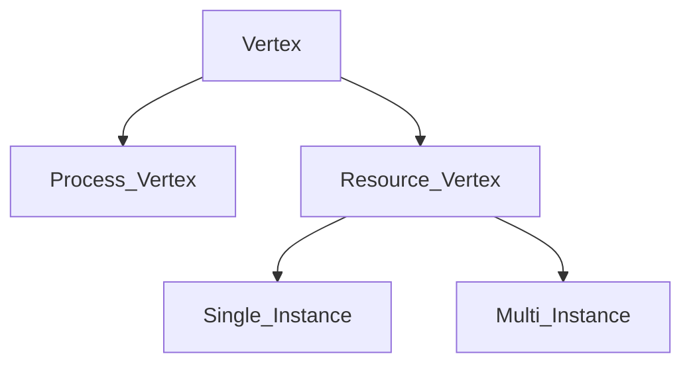
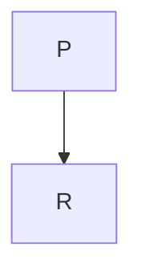
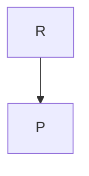
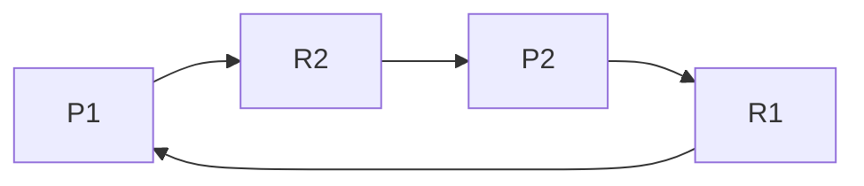

---
{"dg-publish":true,"permalink":"/operating-system-speedrun/deadlocks-module-4/","title":"Deadlock -- Operating Systems","tags":["Semester-5"],"created":"2025-03-06T18:33:28.674+05:30"}
---

---
# Index

1. [[#Deadlock Definition]]
2. [[#Necessary and Sufficient Conditions for Deadlock]]
3. [[#Resource Allocation Graph]]
4. [[#Single-Instance Resource allocation graph]]
5. [[#Multi-instance resource allocation graph.]]
6. [[#Deadlock Avoidance]]
7. [[#Deadlock Avoidance Algorithm]] (Banker's Algorithm)
8. [[#Deadlock Detection and Recovery]]
9. [[#Deadlock Detection]]
10. [[#Deadlock Recovery]]
11. [[#Example of Deadlock Detection and Recovery]]

---
### Deadlock: Definition

==A **deadlock** is a situation in an operating system where a set of processes are blocked because each process is waiting for a resource that is held by another process in the set==. In simpler terms, a deadlock occurs when multiple processes are unable to proceed because they are each holding resources that the other processes need to continue.

## Example:

If two processes (P1 and P2) are each holding a resource that the other needs, but neither can release its resource until it gets the other, they end up in a deadlock.

---
## Necessary and Sufficient Conditions for Deadlock

There are four necessary and sufficient conditions that must be present simultaneously for a deadlock to occur:

1. **Mutual Exclusion**: At least one resource must be held in a non-shareable mode. In other words, only one process can use the resource at a time. If another process requests that resource, the requesting process must be delayed until the resource is released.
    
2. **Hold and Wait**: A process must be holding at least one resource and waiting to acquire additional resources that are currently being held by other processes.
    
3. **No Preemption**: Resources cannot be forcibly taken away from a process. A resource can only be released voluntarily by the process holding it, after that process has completed its task.
    
4. **Circular Wait**: A set of processes must exist in such a way that each process is waiting for a resource held by the next process in the chain. This forms a circular chain of waiting processes.
    
    - Example:  `P1 → P2 → P3 → P1` (forms a circular wait).

If all four of these conditions are met, a deadlock occurs. If even one condition is not satisfied, deadlock can be avoided.

---
### Deadlock Prevention

**Deadlock prevention** ==involves designing a system in such a way that one or more of the four necessary conditions for deadlock (mutual exclusion, hold and wait, no preemption, circular wait) are never allowed to occur==. The idea is to proactively prevent deadlocks before they happen.

----
### 1. **Mutual Exclusion**:

- **Nature**: This condition arises when a resource cannot be shared and must be accessed by only one process at a time (e.g., printers, disk drives).
    
- **Handling in Deadlock Prevention**:
    
    - While mutual exclusion is inherent to some resources, the goal of deadlock prevention is to minimize the need for exclusive access.
    - **Strategy**: Some resources can be made **sharable**. For instance, read-only resources like files could be shared by allowing multiple readers but still restricting writers.
    - **Drawback**: For truly non-sharable resources (like printers), mutual exclusion cannot be avoided, and so this condition must still hold for certain resources.

---

### 2. **Hold and Wait**:

- **Nature**: ==This condition occurs when a process holds one or more resources and waits for additional resources that are held by other processes==.
    
- **Handling in Deadlock Prevention**:
    
    - The system is designed so that processes cannot hold resources while waiting for others.
        
    - Two primary strategies can prevent hold and wait:
        
        - **Strategy 1**: **All-at-once request** (resource allocation before execution):
            - The process must request **all the resources** it will need before it starts. If any of the requested resources is unavailable, the process waits without holding any resource.
            - **Benefit**: Eliminates the possibility of a process holding resources and waiting for others.
            - **Drawback**: Leads to **inefficient resource usage**, as resources that may not be used right away are held, leading to potential **starvation** for other processes.
        - **Strategy 2**: **Request and release approach**:
            - A process must release all held resources before requesting additional ones. Once all necessary resources are available, it can request them again in a single shot.
            - **Benefit**: Prevents deadlock by not holding onto resources while waiting for others.
            - **Drawback**: This can lead to excessive **release and reacquire cycles**, potentially causing **livelock** where no real progress is made.

---

### 3. **No Preemption**:

- **Nature**: This condition means that a process cannot be forced to release a resource before it completes its task.
    
- **Handling in Deadlock Prevention**:
    
    - Preemption allows forcibly taking resources away from processes to avoid deadlock.
    - **Strategy**:
        - If a process holding certain resources requests others that are unavailable, the system preempts the held resources and grants them to another process.
        - The preempted process can only continue when it can get all of its required resources.
    - **Application Example**:
        - If a process is holding a printer but needs additional resources (e.g., disk space), it releases the printer until all required resources become available.
- **Drawback**:
    
    - **Complexity**: Resource preemption requires mechanisms to **save the state** of the preempted process and roll it back when necessary. This adds complexity to the system.
    - **Livelock**: Preemption can lead to situations where processes repeatedly lose resources and cannot make progress.

---

### 4. **Circular Wait**:

- **Nature**: A circular wait occurs when a set of processes each hold a resource and wait for another resource held by the next process in the chain, forming a cycle.
    
- **Handling in Deadlock Prevention**:
    
    - The idea is to prevent the cycle from forming by forcing a strict ordering on resource requests.
        
    - **Strategy**:
        
        - **Imposing a resource ordering**: Resources are assigned unique numerical identifiers. Each process must request resources in **strict increasing order** based on their assigned numbers.
        - For instance, if a process is holding a resource with ID 2, it can only request resources with higher IDs (like 3, 4, etc.), and never resources with lower IDs (like 1).
        - **Implementation**: Processes must know in advance what resources they will need and in what order.
    - **Drawback**:
        
        - **Resource Ordering Complexity**: Determining a global resource order can be challenging, especially in large systems with complex resource dependencies.
        - **Rigidness**: It may not always be feasible to request resources in a predefined order, especially when resource needs are dynamic and unpredictable.

---

### Practical Considerations in Deadlock Prevention:

- **Resource Utilization**:
    
    - Many deadlock prevention strategies lead to **low resource utilization**. For instance, holding all resources upfront can cause them to sit idle for long periods.
- **System Overhead**:
    
    - Some methods, like preemption and resource ordering, introduce additional **system overhead** in terms of bookkeeping and management. Preempting a resource may require saving and restoring process states, increasing context-switching time.
- **Starvation**:
    
    - While preventing deadlocks, some strategies (like preempting resources or releasing and re-requesting resources) may cause **starvation**, where certain processes never get all the resources they need to make progress.
- **Livelock**:
    
    - Strategies that involve constantly releasing and reacquiring resources can lead to **livelock**, where processes are active but cannot make any real progress because they keep getting preempted.

---

### Example:

Let’s consider a printer and a plotter as resources that two processes (A and B) might need.

#### Hold and Wait Prevention:

- Process A requests both the printer and plotter at the beginning. If either is unavailable, A does not proceed, and the other process (B) can still access the resources.
- If both resources are available, Process A gets both and proceeds. But, this may cause **poor utilization** of the plotter if Process A uses the printer first and the plotter later.

#### Circular Wait Prevention:

- Assume resources are ordered such that the printer is resource 1 and the plotter is resource 2.
- A process can only request the plotter if it already holds the printer (and not the other way around). This ensures that no circular waiting occurs because the resource requests always go in the same order.

---
# Resource Allocation Graph

https://www.youtube.com/watch?v=BW74JYB3QOM&list=PLxCzCOWd7aiGz9donHRrE9I3Mwn6XdP8p&index=39

A resource allocation graph (or RAG) is a graph that keeps track of resources and their usage by different processes.

The graph has vertices, some of which are **process vertices** and the other are **resource vertices**.

And the direction of the edges indicate **assign/hold** or **request**.

Here node **P** indicates **Process** and **R** indicates **Resource**.

==Process to Resource indicates a request for the resource==.

==Resource to Process indicates that the process has currently acquired the resource==.

---
## Single-Instance Resource allocation graph 

Now in a graph like this :

Here we see that Process **P1** is requesting resource **R2**, which is acquired by **P2**. **P2** similarly is trying to acquire resource **R1** , which is held by process **P1**.

This shows that there is a cycle in the graph, causing a **circular wait**, which results in a deadlock.

However there are more complex resource allocation graphs, so we will need a better way to figure out whether there is a deadlock or not.

That will be done using a "detection mode" of the Banker's algorithm which is displayed in the next section.

So let's say we have another RAG like this :

So what we need to do, is to first build the resource allocation table :

We will be filling the allocate column first to account for the resources held by processes

| Processes | Allocate    | Request/Need        | Available           |
| --------- | ----------- | ------------------- | ------------------- |
| P1        | 1         0 | 0                 0 | 0                 0 |
| P2        | 0         1 | 0                 0 |                     |
| P3        | 0         0 | 1                 1 |                     |

The numbers indicate which resource is held by which process. Considering simplicity, we consider R1 first followed by R2

So we see that availability set can satisfy the current process P1 as it doesn't need process R2 and it already has R1 so no need for that.

So P1 executes and resource R1 frees up. Now we have

| Processes | Allocate    | Request/Need        | Available           |
| --------- | ----------- | ------------------- | ------------------- |
| P1        | 1         0 | 0                 0 | 0                 0 |
| P2        | 0         1 | 0                 0 | 1                 0 |
| P3        | 0         0 | 1                 1 |                     |

Now we see that P2 already has resource R2 and it doesn't need resource R1 which is now free.

So P2 executes as well, and our table becomes

| Processes | Allocate    | Request/Need        | Available           |
| --------- | ----------- | ------------------- | ------------------- |
| P1        | 1         0 | 0                 0 | 0                 0 |
| P2        | 0         1 | 0                 0 | 1                 0 |
| P3        | 0         0 | 1                 1 | 1                 1 |

So now we can satisfy process P3, thus executing it as well.

Using the resource allocation table, we could see whether there was a possibility of deadlock, which only happens if the request values conflict with the available values for a particular process.

---
## Multi-instance resource allocation graph.

https://www.youtube.com/watch?v=hJhB2ddOQtg&list=PLxCzCOWd7aiGz9donHRrE9I3Mwn6XdP8p&index=40

### Example 1

Let's say we have a resource allocation graph here

We need to find out whether a deadlock exists in this graph or not.

So we build the resource allocation table

I made the columns for the resources separate this time for better understanding

| Process | Allocated - R1 | Allocated - R2 | Requesting -R1 | Requesting -R2 | Available - R1 | Available - R2 |
| ------- | -------------- | -------------- | -------------- | -------------- | -------------- | -------------- |
| P1      | 1              | 0              | 0              | 1              | 0              | 0              |
| P2      | 0              | 1              | 1              | 0              | 0              | 0              |
| P3      | 0              | 1              | 0              | 0              | 0              | 0              |

So now we run the available figure `(0,0)` against the requesting section, see if anything can be satisfied.

We see that process `P3`  has no need for any resources. So `P3` gets terminated after execution.

Our current availability becomes: `(0,1)`

| Process | Allocated - R1 | Allocated - R2 | Requesting -R1 | Requesting -R2 | Available - R1 | Available - R2 |
| ------- | -------------- | -------------- | -------------- | -------------- | -------------- | -------------- |
| P1      | 1              | 0              | 0              | 1              | 0              | 1              |
| P2      | 0              | 1              | 1              | 0              | 0              | 1              |

Executing `P3` freed up one instance of resource `R2`, held by it.

We see that process `P1` needs one instance of resource `R2`, which can be satisfied. So `P1` gets executed right after.

Now our current availability becomes: ``

| Process | Allocated - R1 | Allocated - R2 | Requesting -R1 | Requesting -R2 | Available - R1 | Available - R2 |
| ------- | -------------- | -------------- | -------------- | -------------- | -------------- | -------------- |
| P2      | 0              | 1              | 1              | 0              | 1              | 1              |

Executing `P1` freed up the resource `R1` which was held by it.

Now lastly, process `P2` needs one instance of resource `R2` to execute, which is now available.

So `P2` is terminated successfully as well.

Since in this graph, there was no mutual exclusion, hold and wait, or circular wait, there is no deadlock.

However processes `P1` and `P2` had to be **starved** first to get executed after `P3` was done.

So there was some **starvation**, but **no deadlock** in this resource allocation graph.

---
### Example 2.

Let's build a resource allocation table for this graph.

| Process | R1 -Alloc | R2-Alloc | R3- Alloc | Req -R1 | Req -R2 | Req- R3 | Available - R1 | Available - R2 | Available - R3 |
| ------- | --------- | -------- | --------- | ------- | ------- | ------- | -------------- | -------------- | -------------- |
| P0      | 1         | 0        | 1         | 0       | 1       | 1       | 0              | 0              | 1              |
| P1      | 1         | 1        | 0         | 1       | 0       | 0       | 0              | 0              | 1              |
| P2      | 0         | 1        | 0         | 0       | 0       | 1       | 0              | 0              | 1              |
| P3      | 0         | 1        | 0         | 1       | 2       | 0       | 0              | 0              | 1              |

We see that resource `R3` has 1 instance free, so our current availability becomes: `(0,0,1)`.

We see that with our current availability we can execute process `P2` as it has a need of only one instance of resource `R3`.

So our new availability becomes: `(0,1,1)`

| Process | R1 -Alloc | R2-Alloc | R3- Alloc | Req -R1 | Req -R2 | Req- R3 | Available - R1 | Available - R2 | Available - R3 |
| ------- | --------- | -------- | --------- | ------- | ------- | ------- | -------------- | -------------- | -------------- |
| P0      | 1         | 0        | 1         | 0       | 1       | 1       | 0              | 1              | 1              |
| P1      | 1         | 1        | 0         | 1       | 0       | 0       | 0              | 1              | 1              |
| P3      | 0         | 1        | 0         | 1       | 2       | 0       | 0              | 1              | 1              |

Now we can terminate process `P0` since it needs one instance of `R2` and `R3` each.

So our new availability becomes : `(1,1,2)`

| Process | R1 -Alloc | R2-Alloc | R3- Alloc | Req -R1 | Req -R2 | Req- R3 | Available - R1 | Available - R2 | Available - R3 |
| ------- | --------- | -------- | --------- | ------- | ------- | ------- | -------------- | -------------- | -------------- |
| P1      | 1         | 1        | 0         | 1       | 0       | 0       | 1              | 1              | 2              |
| P3      | 0         | 1        | 0         | 1       | 2       | 0       | 1              | 1              | 2              |

==**Every single freed up instance of a resource needs to be added to the existing instances in our availability matrix to get the total available resources**.==

Now we see that process `P1` can be executed as it needs only one instance each of `R1` and `R2`.

So our new availability becomes: `(2,2,2)`

| Process | R1 -Alloc | R2-Alloc | R3- Alloc | Req -R1 | Req -R2 | Req- R3 | Available - R1 | Available - R2 | Available - R3 |
| ------- | --------- | -------- | --------- | ------- | ------- | ------- | -------------- | -------------- | -------------- |
| P3      | 0         | 1        | 0         | 1       | 2       | 0       | 2              | 2              | 2              |

Finally we can execute and terminate process `P3` as it has a requirement one instance of `R1` and two instances of `R2`.

And with that all our resources are freed up.

So in the graph there was some starvation till all the processes got executed and terminated, but **no deadlock** was observed as there was no mutual exclusion, no hold and wait, no circular wait.

---
# Deadlock Avoidance

In **deadlock avoidance**, the system dynamically checks whether granting a resource allocation request will lead to a deadlock in the future. The system makes safe decisions to avoid deadlock, by ensuring that resources are allocated in such a way that the system remains in a **safe state**.

### Safe State

A **safe state** is a condition where there exists a sequence of processes such that every process can eventually obtain all the needed resources and complete execution. If a system is in a safe state, deadlock can be avoided. Conversely, if the system is in an **unsafe state**, there is a potential risk of deadlock.

### Key Concepts in Deadlock Avoidance

1. **Safe State**:
    
    - The system is said to be in a safe state if it can allocate resources to each process in some order and still avoid deadlock.
    - A sequence of processes (P1, P2, ..., Pn) is **safe** if, for each process Pi, the resources that Pi can still request can be satisfied by the currently available resources or by resources held by processes Pj (where j < i).
2. **Unsafe State**:
    
    - An unsafe state is a situation where deadlock is possible, even if it has not yet occurred. It doesn’t mean a deadlock will definitely happen, but the risk exists.

---
# Deadlock Avoidance Algorithm

Deadlock avoidance relies on the system having information about the **maximum resource needs** of each process in advance. The system dynamically examines resource allocation requests to decide if allocating the requested resources leaves the system in a safe state.

## Banker's Algorithm

The most well-known algorithm for deadlock avoidance is **Dijkstra’s Banker’s Algorithm**. It checks the safe state of a system before allocating resources. Here’s how it works:

#### Key Terms:

- **Available**: The vector that indicates the number of available instances for each resource.
- **Max**: The matrix that defines the maximum number of resources each process may need.
- **Allocation**: The matrix that tracks how many resources are currently allocated to each process.
- **Need**: The matrix that tracks how many resources each process still needs to complete its execution (`Need[i][j] = Max[i][j] - Allocation[i][j]`).

#### Steps of the Banker’s Algorithm:

1. **Check for Available Resources**:
    
    - Before allocating resources to a process, check if the requested resources are less than or equal to the available resources.
    - If enough resources are available, proceed to the next step. If not, the process must wait.
2. **Pretend to Allocate the Resources**:
    
    - Simulate the allocation by assuming the resources have been allocated. This is a trial allocation to test if the system remains in a safe state.
3. **Check for Safe State**:
    
    - After the trial allocation, check if the system is still in a safe state. This is done by ensuring that there is a sequence of processes that can finish execution without causing deadlock.
    - For each process, check if the resources it needs can be fulfilled with the currently available resources.
    - If the system is in a safe state, grant the request. If not, deny the request to avoid falling into an unsafe state.
4. **Rollback**:
    
    - If the resource request would lead the system into an unsafe state, roll back the trial allocation and do not grant the resource request.

---
### Example of Banker’s Algorithm

Assume we have:

- **3 processes (P0, P1, P2)**
- **3 resources (R0, R1, R2)** with 10 instances of each resource.

Let's say we have the following resource allocation information:

|Process|Max|Allocation|Need|Available|
|---|---|---|---|---|
|P0|(7, 5, 3)|(0, 1, 0)|(7, 4, 3)|(3, 3, 2)|
|P1|(3, 2, 2)|(2, 0, 0)|(1, 2, 2)|-|
|P2|(9, 0, 2)|(3, 0, 2)|(6, 0, 0)|-|

**Step 1**: Check if the requested resources can be satisfied by the current available resources. Let’s say P1 requests (1, 0, 2) resources.

- **Available** = (3, 3, 2)
- P1’s request (1, 0, 2) ≤ (3, 3, 2), so we proceed.

**Step 2**: Trial allocation. After allocating the resources, we update the allocation and available resources:

|Process|Max|Allocation|Need|Available|
|---|---|---|---|---|
|P0|(7, 5, 3)|(0, 1, 0)|(7, 4, 3)|(2, 3, 0)|
|P1|(3, 2, 2)|(3, 0, 2)|(0, 2, 0)|-|
|P2|(9, 0, 2)|(3, 0, 2)|(6, 0, 0)|-|

**Step 3**: Check for a safe state. Now, we check if there’s a safe sequence. To find this, we look at whether each process can complete with the currently available resources.

- P0 needs (7, 4, 3) but only (2, 3, 0) is available — so P0 cannot proceed.
- P1 needs (0, 2, 0), and we have enough resources (2, 3, 0), so P1 can complete and release its resources (3, 0, 2).
- After P1 finishes, we update **Available** to (5, 3, 2). Now, check if any other processes can proceed:
    - P0 still cannot proceed (needs 7, 4, 3).
    - P2 needs (6, 0, 0), and we have (5, 3, 2), so P2 cannot proceed either.

Since we can’t finish all processes, the system would enter an unsafe state if we granted P1’s request. Therefore, we **roll back** the allocation and deny the request.

---
### A better example 

https://www.youtube.com/watch?v=7gMLNiEz3nw&list=PLxCzCOWd7aiGz9donHRrE9I3Mwn6XdP8p&index=42

 Let's say we have a given resource allocation table for resources `A, B and C`, and process `P1` through `P5`.
 
 Total instances for each of the resources: 
 
 `A = 10`
 `B = 5`
 `C = 7`

| Processes | Alloc - A | Alloc - B | Alloc - C | Max-A | Max-B | Max-C | Avl-A | Avl-B | Avl-C | Remaining-A B C |
| --------- | --------- | --------- | --------- | ----- | ----- | ----- | ----- | ----- | ----- | --------------- |
| `P1`      | 0         | 1         | 0         | 7     | 5     | 3     |       |       |       |                 |
| `P2`      | 2         | 0         | 0         | 3     | 2     | 2     |       |       |       |                 |
| `P3`      | 3         | 0         | 2         | 9     | 0     | 2     |       |       |       |                 |
| `P4`      | 2         | 1         | 1         | 4     | 2     | 2     |       |       |       |                 |
| `P5`      | 0         | 0         | 2         | 5     | 3     | 3     |       |       |       |                 |

So we calculate the available instance by subtracting the **total allocation of each resource** from it's **total number of instances**.

So for `A`, availability is : `10 - (2 + 3 + 2) = 10 - 7 = 3`
For `B`, availability is: `5 - (1 + 1) = 5 - 2 = 3`
For `C`, availability is: `7 - (2 + 1 + 2) = 7 - 5 = 2`

So our availability matrix is `(3, 3, 2)`

And we calculate the remaining needs for the processes to be executed by subtracting the current allocation from their `Max` need.

So for `P1`, remaining need of `A, B, C` = `(7-0), (5-1), (3-0)` = `7,4,3`
For `P2`, remaining need = `1, 2, 2`
For `P3`, remaining need = `6, 0, 0`
For `P4`, remaining need = `2, 1, 1`
For `P5`, remaining need = `5, 3, 1`

| Processes | Alloc - A | Alloc - B | Alloc - C | Max-A | Max-B | Max-C | Avl-A | Avl-B | Avl-C | Remaining-A B C |
| --------- | --------- | --------- | --------- | ----- | ----- | ----- | ----- | ----- | ----- | --------------- |
| `P1`      | 0         | 1         | 0         | 7     | 5     | 3     | 3     | 3     | 2     | `7, 4, 3`       |
| `P2`      | 2         | 0         | 0         | 3     | 2     | 2     | 3     | 3     | 2     | `1, 2, 2`       |
| `P3`      | 3         | 0         | 2         | 9     | 0     | 2     | 3     | 3     | 2     | `6, 0, 0`       |
| `P4`      | 2         | 1         | 1         | 4     | 2     | 2     | 3     | 3     | 2     | `2, 1, 1`       |
| `P5`      | 0         | 0         | 2         | 5     | 3     | 3     | 3     | 3     | 2     | `5, 3, 1`       |

So running the availability numbers against the remaining needs, we see that process `P4` can be successfully terminated.

| `P2` | 3   | 3   | 2   | `1, 2, 2` |
| ---- | --- | --- | --- | --------- |

As the availability is greater than that of it's needs.

So `P2` gets terminated, freeing up `2` instances of `A` 

We add these values to get our new availability `5, 3, 2`.

| Processes | Alloc - A | Alloc - B | Alloc - C | Max-A | Max-B | Max-C | Avl-A | Avl-B | Avl-C | Remaining-A B C |
| --------- | --------- | --------- | --------- | ----- | ----- | ----- | ----- | ----- | ----- | --------------- |
| `P1`      | 0         | 1         | 0         | 7     | 5     | 3     | 5     | 3     | 2     | `7, 4, 3`       |
| `P3`      | 3         | 0         | 2         | 9     | 0     | 2     | 5     | 3     | 2     | `6, 0, 0`       |
| `P4`      | 2         | 1         | 1         | 4     | 2     | 2     | 5     | 3     | 2     | `2, 1, 1`       |
| `P5`      | 0         | 0         | 2         | 5     | 3     | 3     | 5     | 3     | 2     | `5, 3, 1`       |

Next we see that we can terminate process `P4` as well since our availability exceeds it's needs.

So `P4` gets terminated, freeing up `2` instances of `A` and `1` instance each for `B` and `C`.

We add these values to get our new availability `7, 4, 3`

| Processes | Alloc - A | Alloc - B | Alloc - C | Max-A | Max-B | Max-C | Avl-A | Avl-B | Avl-C | Remaining-A B C |
| --------- | --------- | --------- | --------- | ----- | ----- | ----- | ----- | ----- | ----- | --------------- |
| `P1`      | 0         | 1         | 0         | 7     | 5     | 3     | 7     | 4     | 3     | `7, 4, 3`       |
| `P3`      | 3         | 0         | 2         | 9     | 0     | 2     | 7     | 4     | 3     | `6, 0, 0`       |
| `P5`      | 0         | 0         | 2         | 5     | 3     | 3     | 7     | 4     | 3     | `5, 3, 1`       |

We see that we can now terminate process `P1` as our availability equates that of it's remaining needs.

So `P1` gets terminated, freeing up `1` instance of `B`.

Our new availability becomes `7, 5, 3`

| Processes | Alloc - A | Alloc - B | Alloc - C | Max-A | Max-B | Max-C | Avl-A | Avl-B | Avl-C | Remaining-A B C |
| --------- | --------- | --------- | --------- | ----- | ----- | ----- | ----- | ----- | ----- | --------------- |
| `P3`      | 3         | 0         | 2         | 9     | 0     | 2     | 7     | 5     | 3     | `6, 0, 0`       |
| `P5`      | 0         | 0         | 2         | 5     | 3     | 3     | 7     | 5     | 3     | `5, 3, 1`       |

Now process `P3` gets terminated, freeing up `3` instances of `A` and `2` instances of `C`.

Our new availability becomes `10, 5, 5`.

| Processes | Alloc - A | Alloc - B | Alloc - C | Max-A | Max-B | Max-C | Avl-A | Avl-B | Avl-C | Remaining-A B C |
| --------- | --------- | --------- | --------- | ----- | ----- | ----- | ----- | ----- | ----- | --------------- |
| `P5`      | 0         | 0         | 2         | 5     | 3     | 3     | 10    | 5     | 5     | `5, 3, 1`       |
Lastly we terminate `P5`, thus freeing the remaining `2` instances of `C`.

So our current availability becomes: `10, 5, 7`.

---
### Conclusion

So here in this simulation, we see that if we grant the allocation request to `P2`, the processes get terminated one by one, and there is **no deadlock detected**, although some starvation, so the system is in a **safe state**.

So after running this simulation using the Banker's Algorithm the system can proceed with the resource allocation.

So, the safe state sequence will be: `P2 -> P4 -> P1 -> P3 -> P5`.

However this is not the only possible sequence, there are other valid safe sequences as well,

such as: `P2 -> P4 -> P5 -> P1 -> P3`.

We can also conclude that this is a safe sequence by checking that our current availability: `10, 5, 7` is the same as the total instances of each resource `A, B` and `C`.

---

### Practical Considerations of Deadlock Avoidance:

1. **Advance Knowledge**: The system must know in advance the maximum resources each process might need. This is often not practical in many real-world scenarios where processes may not have a predefined upper bound on their resource needs.
    
2. **Limited Applicability**: Deadlock avoidance techniques, particularly the Banker's algorithm, are best suited for systems where resource requirements are relatively static and known beforehand (e.g., database systems or batch processing systems).
    
3. **Overhead**: Constantly checking for safe states can lead to computational overhead, which may degrade system performance, especially with large numbers of processes and resources.
    
4. **Resource Underutilization**: If the system frequently rolls back resource requests to avoid entering an unsafe state, it can lead to poor utilization of resources.

---

### Difference Between Deadlock Prevention and Deadlock Avoidance

- **Deadlock Prevention**: Prevents deadlock by ensuring that one of the four necessary conditions for deadlock (mutual exclusion, hold and wait, no preemption, circular wait) is violated.
- **Deadlock Avoidance**: Dynamically checks if resource allocation would lead to a deadlock and only grants the request if the system remains in a safe state.

---
# Deadlock Detection and Recovery

https://www.youtube.com/watch?v=pPM9Ajqmy_4&list=PLxCzCOWd7aiGz9donHRrE9I3Mwn6XdP8p&index=41&pp=iAQB

When it’s impractical to prevent or avoid deadlock, the system can instead detect deadlock and then take steps to recover. Deadlock detection allows processes to request resources without restriction, and the system monitors the processes to check if they are in a deadlock state. If deadlock is detected, the system can perform recovery to regain resources and resume normal operations

### Deadlock Detection

Deadlock detection techniques vary based on whether the system has multiple instances of each resource or just one instance per resource. Each case requires a different approach to detect if there is a cycle (or circular dependency) among processes.

1. **Single Instance of Each Resource Type**:
    
    - **Resource-Allocation Graph**: This graph-based method is suitable for systems with only one instance of each resource type.
    - Each **node** in the graph represents either a process or a resource.
    - An **edge** from a process to a resource indicates that the process has requested the resource.
    - An edge from a resource to a process indicates that the resource is currently allocated to that process.
    - **Cycle Detection**: If a cycle exists in the resource-allocation graph, a deadlock is present.
2. **Multiple Instances of Each Resource Type**:
    
    - **Wait-for Graph**: This graph simplifies deadlock detection for systems with multiple instances of each resource by only showing which processes are waiting on other processes (ignoring resources directly).
    - If a cycle exists in the **wait-for graph**, deadlock is present.
3. **Banker’s Algorithm** (Detection version):
    
    - When there are multiple instances of each resource type, the **Banker’s Algorithm** can be used in detection mode to check if the system can safely allocate resources to all processes without deadlock.

---
### Deadlock Recovery

Once a deadlock is detected, the system must take steps to recover. Deadlock recovery methods fall into two categories:

- Process Termination:
    - **Abort All Deadlocked Processes**: Terminate all processes involved in the deadlock. This is straightforward but can lead to significant data loss and resource waste.
    - **Abort One Process at a Time:** Terminate deadlocked processes one by one, checking after each termination if the deadlock is resolved. This method minimizes disruption but can be slow.

- Criteria for choosing which process to abort:
	- Process priority or importance.
    - Amount of resources held by the process.
    - How long the process has been running or expected to run.
    - Number of times the process has been involved in deadlock (to prevent repeated deadlocking).

- Resource Preemption:
    - **Select a Victim**: Choose a process and preempt (forcefully take) some of its resources, giving them to other processes. The goal is to break the circular wait and resolve the deadlock.
    - **Rollback**: If a resource preemption leads to inconsistencies, some processes may need to be rolled back to a previous safe state, reinitializing any resources they previously held.
    - **Starvation Handling**: Ensure that the same process is not repeatedly chosen as a victim, which would lead to starvation.

---
### Example of Deadlock Detection and Recovery

Consider a system with:

- **3 processes (P0, P1, P2)**
- **3 types of resources (R1, R2, R3)**, with multiple instances of each resource.

Let’s say we have the following state:

|Process|Max|Allocation|Need|Available|
|---|---|---|---|---|
|P0|(7, 5, 3)|(0, 1, 0)|(7, 4, 3)|(3, 3, 2)|
|P1|(3, 2, 2)|(2, 0, 0)|(1, 2, 2)|-|
|P2|(9, 0, 2)|(3, 0, 2)|(6, 0, 0)|-|

### Detection:

1. Start with **Available** resources (3, 3, 2).
2. For each process, check if it can complete given the **Available** resources.
3. Suppose P0, P1, and P2 are all unable to finish, leading to a cycle detection and confirming deadlock.

### Recovery:

1. **Process Termination**: We could terminate P0, P1, or P2 to resolve the deadlock.
2. **Resource Preemption**: We could reclaim resources from P1 (e.g., (2, 0, 0)) to increase the available resources and see if other processes can finish.

---
