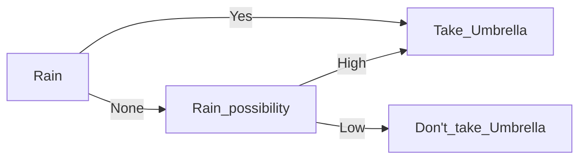

---
{"dg-publish":true,"permalink":"/software-engineering/module-2-system-design/","title":"System Design -- Software Engineering","tags":["Semester-5"],"created":"2025-03-06T18:33:28.810+05:30"}
---

---
# Index

1. [[#Context Diagrams]]
2. [[#Data-Flow Diagrams]]
3. [[#Logical Data Flow Diagram]]
4. [[#Physical Data Flow Diagram]]
5. [[#Levels of Data Flow Diagrams]]
6. [[#Problem Partitioning]]
7. [[#Software design principles]]
8. [[#Modularity]]
9. [[#Cohesion]]
10. [[#Coupling]]
11. [[#Top-Down vs Bottom-Up Design]]
12. [[#1. Top-Down Design]]
13. [[#2. Bottom-Up Design]]
14. [[#Top-Down vs Bottom-Up Design Tabular Comparison]]
15. [[#Decision Trees]]
16. [[#Decision Table]]

---
# Context Diagrams

https://www.geeksforgeeks.org/context-diagrams/

- ==A diagram used to give an overview of an entire system==.
  
- ==In a context diagram there is only one circle / process that represents the entire system==.
  
- ==The purpose of this diagram is to display the expecting inputs and outputs from the system to and from various external entities==.
  
- Through this display a system analyst can model what expected data is going to go into the system, then after it has been processed by the system, what information will be returning to the external entities

---
## Components :

1. **System Boundary**: ==The context diagram encapsulates the entire system as a single, high-level process (often represented as a single circle or square) to show the system in its entirety without internal details==.

2. **External Entity** :
	- ==These are entities outside the system boundary that interact with the system==.
	-  They could be users, other systems, or processes that provide input to or receive output from the system.

3. **System/Product/Process**:
	- ==This is the primary focus of the diagram, representing the system being analyzed or designed==.

4. **Data Flows**: ==Arrows indicate the flow of data between the system and external entities. Each arrow is labeled to show what kind of information or data is exchanged==, such as "user request," "report," or "payment confirmation."
   
   - **Unidirectional Data Flow** :
	- ==Unidirectional data flow indicates that data moves in only one direction between two components==.
	  
	- For example, data flows from an external entity to a process, or from a process to a data store, but not in the opposite direction. This type of data flow is represented by a single arrow indicating the direction of data movement.

 -  **Bidirectional Data Flow**:
	 - ==Bidirectional data flow indicates that data can move in both directions between two components==.
	   
	   
	   
	- For example, data flows between a process and an external entity can be bidirectional, allowing the process to send data to the external entity and receive data back. This type of data flow is represented by a double-headed arrow indicating that data can move in both directions.

---
### Example : Library Management System

- **Student Database**: A system or a collection of data related to students, which can include
information such as names, IDs, and academic records.

- **Students info**: Requesting or providing information related to students.

- **Staff**: People employed by an organization, often having a specific role or responsibility.

- **Library management system**: A system used to manage and organize library resources, such as books, periodicals, and multimedia materials.

- **Stock**: Inventory or resources available in a system.

- **Supplier**: An entity that provides goods or services to another entity.

- **Book details**: Information related to books, such as titles, authors, and publication dates.

- **Availability**: The state of being accessible or usable. In the context, it likely refers to the availability of books or other resources.

- **Management**: The process of coordinating and controlling resources to achieve specific goals.

**A context diagram for this information would include the following elements:**

- **External entities**: Students, Staff, Supplier
- **Processes: Requesting information** (Students info, Book details, Availability), Managing resources (Library management system, Stock, Student Database)
- **Data stores**: Student Database, Library management system, Book Database.

**Advantages**:

- **Clear Overview**: Offers a simplified, high-level view of the system’s boundaries, showing only external entities and their interactions.

-  **Improves Communication**: Helps stakeholders and non-technical team members understand the system without technical details, making it easier to discuss and refine requirements.

- **Highlights Dependencies**: Shows how the system interacts with other external entities, helping to identify dependencies early in development.

- **Focus on System Boundaries**: Emphasizes system boundaries and interactions, which aids in defining scope and avoiding scope creep.

- **Early Error Detection**: Helps catch misunderstandings or missing entities early in the project lifecycle.

---
**Disadvantages**:

- **Limited Detail**: Lacks detail about internal processes, data flows, or system functionality, making it unsuitable for understanding complex internal workings.

- **Can Be Over-Simplified**: Overly simplistic in complex systems, possibly hiding crucial internal interactions and dependencies.

- **Not Suitable for Large Systems Alone**: For large, complex systems, a context diagram alone may be insufficient, as it requires complementary detailed diagrams to fully understand the system.

- **Ambiguity in Scope Definition**: May leave out specifics, leading to potential ambiguities or misinterpretations about what is included in the system boundary.

- **Requires Additional Diagrams**: Often needs to be accompanied by Data Flow Diagrams (DFDs) or other models to provide complete understanding, adding time to documentation.
---
# Data-Flow Diagrams

https://www.geeksforgeeks.org/what-is-dfddata-flow-diagram/

https://www.youtube.com/watch?v=KN-inGJG540&list=PLxCzCOWd7aiEed7SKZBnC6ypFDWYLRvB2&index=20

==Data Flow Diagrams (DFDs) expand on context diagrams by illustrating the internal processes, data stores, and data flow within a system. DFDs show how data is transformed as it moves through the system, capturing the system's functionality in a structured, easy-to-understand way==. DFDs are especially useful in the early stages of system design to define the system's data processes without delving into specific technical details.

**Components** :
- External entities
-  Processes
- Data Flow
- Data Stores :
	- A data store is a repository of data.
	- Data is written in data store and is represented by incoming arrow
	- Data is read from data store and is represented by outgoing arrow
	- External entity cant read or write to data store

---

https://www.youtube.com/watch?v=IQFfMb2T2PY&list=PLxCzCOWd7aiEed7SKZBnC6ypFDWYLRvB2&index=20 (Logical vs Physical DFD)
## Logical Data Flow Diagram

Logical data flow diagram ==mainly focuses on the system process==.
- ==It illustrates how data flows in the system==.
- Logical Data Flow Diagram (DFD) ==mainly focuses on high level processes and data flow without diving deep into technical implementation details==.
- Logical DFD is used in various organizations for the smooth running of system. Like in a Banking software system, it is used to describe how data is moved from one entity to another.

---
## Physical Data Flow Diagram

- ==Physical data flow diagram shows how the data flow is actually implemented in the system==.
- In the Physical Data Flow Diagram (DFD), we include additional details such as data storage, data transmission, and specific technology or system components.
- Physical DFD is more specific and close to implementation

Now, there are 4 levels of DFD depending on its complexity ,

---
### Levels of Data Flow Diagrams

https://www.youtube.com/watch?v=qtTWBs49BCA&list=PLxCzCOWd7aiEed7SKZBnC6ypFDWYLRvB2&index=19

1. **Level 0 (or Context DFD)**:
    
    - ==This is a high-level diagram that represents the entire system as a single process.==
    - It’s essentially the same as the context diagram, showing the system’s interaction with external entities.
      
      
      
2. **Level 1 DFD**:
    
    - ==Level 1 DFD breaks down the single process from Level 0 into more detailed subprocesses==.
    - ==It shows the main functions or modules of the system and how data flows between them==.
    - For instance, in a Library Management System, Level 1 might include processes like "Check Out Book," "Return Book," and "Manage Inventory."
      
      
      
3. **Level 2 and Beyond**:
    
    - ==Level 2 DFDs decompose Level 1 processes into even more specific subprocesses==.
    - This hierarchical decomposition continues until the system is sufficiently detailed for design or development purposes.
      
      
  
4. **Level 3 (and beyond) DFD**
- Purpose: ==Used for complex systems where further detailing of processes is necessary==.
- Description: ==Level 3 (or higher) DFDs are rarely needed but can be used to provide as much detail as necessary. Each sub-process from Level 2 is decomposed further to clarify every action or transaction happening in the system==.
- Key Components: Further decomposed sub-processes, data flows, and data stores with an even more refined view of the data movement and processing. 

In simple terms , **higher levels = more defined system**.

---
# Problem Partitioning 

==Problem Partitioning is a design approach in system analysis and software engineering that breaks down a complex system into smaller, manageable parts or modules. This decomposition allows developers to focus on individual components, making it easier to understand, design, and implement the system==. By dividing a problem into parts, each module can be developed independently and later integrated to form the complete system.

---
### Why Use Problem Partitioning?

1. **Manageability**: Smaller components are easier to develop, test, and maintain.
2. **Parallel Development**: Different team members or groups can work on separate modules simultaneously.
3. **Simplified Debugging and Testing**: By isolating different system functions, debugging and testing become more straightforward.
4. **Reusability**: Modules developed through problem partitioning can often be reused in other projects.
5. **Enhanced Focus**: Partitioning allows designers and developers to focus on specific functionalities without getting overwhelmed by the entire system.

---
### Techniques for Problem Partitioning

Several techniques can be used to partition a problem:

1. **Functional Decomposition**: Breaking down the system based on functionality. For instance, in a Library Management System, functionalities like “Manage Books,” “Manage Members,” and “Handle Payments” can be treated as separate modules.
    
2. **Modularization**: The system is divided into modules, where each module performs a specific part of the system's overall functionality. Modularization makes sure each module has a single responsibility and minimal overlap with others.
    
3. **Object-Oriented Partitioning**: In object-oriented design, the system is broken down into classes and objects that encapsulate both data and functions. This approach focuses on the real-world entities that the system will manage (e.g., "Book," "Member," "Transaction" in a Library System).
    
4. **Layered Approach**: Dividing the system into layers based on the roles each layer performs. For instance, a typical three-layer system might include:
    
    - **Presentation Layer**: User interface.
    - **Logic Layer**: Business rules and logic processing.
    - **Data Layer**: Database and data access.
      
5. **Top-Down vs. Bottom-Up Approaches**:
    
    - **Top-Down**: Starts with the most general functions and progressively breaks them down into detailed, lower-level functions. Useful for systems where the overall structure is well-understood.
    - **Bottom-Up**: Begins by designing and developing low-level functions or modules first, which are then integrated into higher-level functions. This approach can be beneficial when individual components are better understood than the overall structure.

==As the number of partition increases = Cost of partition and complexity increases.==

---
## Software design principles

==Software design principles are concerned with providing means to handle the complexity of
the design process effectively==.

Effectively managing the complexity will not only reduce the effort needed for design but can
also reduce the scope of introducing errors during design.

----
### Some software design principles

#### Abstraction

- Definition: ==Abstraction is the process of simplifying complex systems by modeling only the
essential features while hiding the unnecessary details==.

- Purpose: It helps manage complexity by focusing on what is relevant and ignoring
extraneous information. Abstraction can occur at various levels, such as data abstraction
(e.g., abstracting a user as a class) or procedural abstraction (e.g., using functions to
encapsulate behavior).

- Example: A car's steering wheel is an abstraction that lets a driver control the car without
needing to understand the underlying mechanics.

---
#### Modularity

==Modularity specifies to the division of software into separate modules which are differently
named and addressed and are integrated later on in to obtain the completely functional
software==.

It is the only property that allows a program to be intellectually manageable. Single large
programs are difficult to understand and read due to a large number of reference variables,
control paths, global variables, etc.

**The desirable properties of a modular system are:**

- Each module is a well-defined system that can be used with other applications.
- Each module has single specified objectives.
- Modules can be separately compiled and saved in the library.
- Modules should be easier to use than to build.
- Modules are simpler from outside than inside.
---
##### **Advantages of Modularity**: 
- It allows large programs to be written by several or different people
- It encourages the creation of commonly used routines to be placed in the library and used by other programs.
- It simplifies the overlay procedure of loading a large program into main storage.
- It provides more checkpoints to measure progress.
- It provides a framework for complete testing, more accessible to test
- It produced the well designed and more readable program.
---
##### **Disadvantages of Modularity**:
- Execution time maybe, but not certainly, longer
- Storage size perhaps, but is not certainly, increased
- Compilation and loading time may be longer
- Inter-module communication problems may be increased
- More linkage required, run-time may be longer, more source lines must be written, and more documentation has to be done
---
#### Cohesion

https://www.youtube.com/watch?v=NweTzHYBgYU&list=PLxCzCOWd7aiEed7SKZBnC6ypFDWYLRvB2&index=33 (Cohesion and coupling)

==Cohesion refers to how closely related the responsibilities of a module or class are==.

==A module with high cohesion has well-defined responsibilities and focuses on a single task or
purpose, making it easier to maintain and understand==.

Cohesion is a desirable property in software design.

**Types of Cohesion**:

1. **Functional Cohesion**:
	==The highest level of cohesion where all parts of a module work together to achieve a single, well-defined task==.
	Example: A function that calculates the area of a circle.

2. **Sequential Cohesion**:
	==Elements of a module are grouped because the output of one element serves as input to another==.
	Example: A module that processes a sequence of data.

3. **Communicational Cohesion**:
	==Elements are grouped because they operate on the same data or contribute to a single data
	structure==. 
	
	Example: A module that performs various operations on a single data record.

4. **Procedural Cohesion**:
	==Elements are grouped because they always follow a specific sequence of execution==.
	Example: A series of steps in a procedure, such as a task scheduler.

5. **Temporal Cohesion**:
	==Elements are related by timing and need to be executed at the same time==.
	Example: Initialization routines that run when a system starts.

6. **Logical Cohesion**:
	==Elements perform similar functions but are selected based on a control flag==.
	Example: A module that handles different types of user input.

7. **Coincidental Cohesion**:
	==The weakest form of cohesion, where elements are grouped arbitrarily with no meaningful relationship==.
	Example: A utility class containing unrelated functions.

---
##### Advantages of High Cohesion:

1. **Ease of Maintenance**: Highly cohesive modules are easier to maintain and understand, as they focus on a single task or responsibility.

2. **Improved Reusability**: Modules that do one thing well can be reused in different parts of the system or in other projects.

3. **Simpler Testing**: Testing a cohesive module is easier because it has a well-defined purpose and fewer dependencies.

4. **Enhanced Readability**: Code is more organized and readable, making it easier for new developers to understand the system.
---
##### **Disadvantages of Low Cohesion**:

1. **Difficult Maintenance**: Modules with low cohesion are harder to maintain and understand
because they handle multiple unrelated tasks.

2. **Complex Testing**: Testing becomes more challenging due to the increased complexity of a
module with mixed responsibilities.

3. **Reduced Reusability**: Modules are less reusable as they lack a single, well-defined purpose.

---
#### Coupling

==Coupling refers to the degree of dependency between modules==.

==Low coupling is desirable because it indicates that modules are independent of each other,
making the system more flexible and easier to maintain==.

**Types of Coupling**:

1. Content Coupling (Highest):
	==One module directly modifies or relies on the internal details of another module==.
	Example: A module accessing the private data of another module.

2. Common Coupling:
	==Two or more modules share the same global data==.
	Example: Multiple modules accessing and modifying global variables.

3. External Coupling:
	==Modules are dependent on external factors like external file formats, hardware, or protocols==.
	Example: Modules interacting with the same external interface.

4. Control Coupling:
	==One module controls the behavior of another module by passing control information==.
	Example: A function passing a control flag to indicate which operation to perform.

5. Stamp Coupling (Data-Structured Coupling):
	==Modules share a data structure but only use a part of it==.
	Example: A function receiving an entire record but using only one field.

6. Data Coupling (Lowest):
	==Modules share data through parameters. Only necessary data is shared==.
	Example: A function that accepts input arguments to perform a calculation.

---
##### Advantages of Low Coupling:

1. **Ease of Maintenance**: Changes in one module are less likely to impact other modules,
making the system easier to maintain and update.

2. **Flexibility and Scalability**: Systems with low coupling are easier to extend and scale because
modules can be modified or replaced independently.

3. **Simpler Debugging**: When an issue occurs, it is easier to isolate and debug a loosely coupled
module.

4. Reusability: Loosely coupled modules are more reusable in different contexts since they
have fewer dependencies.

---
##### **Disadvantages of High Coupling**:

1. **Difficult Maintenance**: When modules are highly dependent on each other, a change in one
module may require changes in several others, making maintenance more challenging.

2. **Reduced Flexibility**: The system becomes rigid and difficult to extend or modify, as altering
one part can have a ripple effect throughout the system.

3. **Complex Testing**: Testing a highly coupled system is complicated because modules cannot be
tested independently.

4. **Limited Reusability**: Modules are less reusable in other contexts since they are tightly
connected to other parts of the system.
---
# Top-Down vs Bottom-Up Design

**Top-Down and Bottom-Up Design** are two contrasting approaches in system design and development. Each offers a different strategy for structuring and developing systems, and both have specific benefits and challenges. They can also be combined in a hybrid approach, depending on the system's requirements.

## 1. Top-Down Design

In **Top-Down Design**, ==the system is approached from a high level and gradually broken down into more specific components and functions==. This process starts with the most abstract view of the system, focusing on the big picture before moving into detailed design.

Imagine building a car. In a top-down approach, you’d start by designing the whole car,
then break it down into systems like the engine, wheels, and body, and then further break down the engine into parts like pistons and cylinders.

---
### Steps in Top-Down Design

1. **Define the System’s Overall Purpose**: Identify what the entire system should achieve.
2. **Break Down into Subsystems**: Split the system into major components or subsystems, each responsible for a major function.
3. **Decompose Further**: Each subsystem is then decomposed into more specific functions and modules.
4. **Detail Individual Modules**: Continue this decomposition until reaching modules with specific, manageable functions.
---
### Example of Top-Down Design: Library Management System

- **System Level**: The system's purpose is to manage library operations.
- **Subsystems**:
    - **User Management** (e.g., manage member data)
    - **Inventory Management** (e.g., manage book records)
    - **Transaction Processing** (e.g., handle checkouts and returns)
- **Further Decomposition**: Each subsystem is broken down into specific actions like “Add Member,” “Checkout Book,” etc.
---
### Advantages of Top-Down Design

- **Clear Overall Structure**: Helps maintain a broad view of the system, ensuring alignment with high-level goals.
- **Improved Coordination**: Since the system's high-level design is clear from the beginning, team members know how each component fits into the larger picture.
- **Easy to Document**: Documentation is more systematic since the design follows a hierarchical breakdown.

---
### Disadvantages of Top-Down Design

- **Inflexible**: It can be hard to adapt if requirements change mid-project, as each level builds on the last.
- **Detailed Work Deferred**: Lower-level details may be overlooked or ignored until later stages, potentially leading to issues when these details are eventually addressed.

---
## 2. Bottom-Up Design

==In Bottom-Up Design, the process starts with the creation of individual, detailed components, which are then gradually combined into higher-level structures==. This approach focuses on first developing and testing low-level modules and building upwards.

In the same car analogy, a bottom-up approach would start by designing individual parts,
like the pistons or brakes, and then integrate these to form subsystems like the engine or brake
system, and finally assemble the car.

---
### Steps in Bottom-Up Design

1. **Develop Low-Level Modules First**: Build small, self-contained modules that accomplish specific tasks.
2. **Combine Modules into Subsystems**: Group related modules to form functional units or subsystems.
3. **Integrate into Higher Levels**: Continue combining subsystems until the entire system is built.
---
### Example of Bottom-Up Design: Library Management System

- **Develop Specific Functions First**:
    - **Database Access Module**: Handles data storage and retrieval.
    - **User Authentication Module**: Manages member login and access control.
    - **Checkout Processing Module**: Manages book checkout transactions.
- **Combine Modules into Subsystems**: For example, the checkout and return processes form the **Transaction Processing Subsystem**.
- **Build the System by Combining Subsystems**: Integrate all subsystems into a complete Library Management System.
---
### Advantages of Bottom-Up Design

- **Flexibility**: Low-level components can be tested, refined, and potentially reused across different systems.
- **Focus on Implementation Details**: Since lower-level components are built first, specific details and potential issues are resolved early.
- **Iterative and Modular**: Allows for gradual system growth, which can adapt more easily to changing requirements.
---
### Disadvantages of Bottom-Up Design

- **Lack of Overall Vision**: Without a top-level structure, the resulting system may lack coherence if not carefully planned.
- **Integration Challenges**: Combining modules and subsystems into a cohesive system can be complex, especially if interfaces were not defined early.
- **Overhead in Coordination**: Developers may need to revisit modules to adjust for overall system design needs.
---
## Top-Down vs Bottom-Up Design Tabular Comparison

|Aspect|Top-Down Design|Bottom-Up Design|
|---|---|---|
|**Focus**|Overall system first, then details|Individual components first, then combine|
|**Structure**|Hierarchical, organized around goals|Modular, organized around functionality|
|**Adaptability**|Less adaptable to change|More adaptable to change|
|**Design Process**|Starts from abstract to specific|Starts from specific to abstract|
|**Documentation**|More structured and hierarchical|May lack high-level cohesion initially|
|**Testing and Debugging**|Higher-level issues first|Lower-level issues first|

---
# Decision Trees

Decision Trees ==are a visual tool used in software engineering and decision-making processes to outline possible decisions, their outcomes, and potential paths for reaching a goal. They are particularly useful for representing structured, step-by-step decision-making processes==.

In system design, decision trees help analyze choices, break down complex decisions, and visualize the possible results of each choice. They are widely used in software engineering, data science, machine learning, and business processes.

### Structure of a Decision Tree

A decision tree typically consists of the following elements:

1. **Root Node**: Represents the initial decision point or primary question.
2. **Decision Nodes**: Represent each decision or choice at different stages, typically marked with branches leading to further nodes.
3. **Branches**: Paths that connect nodes and represent the outcome of a particular choice.
4. **Leaf Nodes**: End points that represent the final outcomes or results of the decisions made through the tree.

Each node in a decision tree can lead to multiple possible branches, providing a structured way to visualize different choices and outcomes.

---
### Advantages of Decision Trees

- **Clear Visualization**: Decision trees provide a straightforward visual representation of each possible choice and outcome.
  
- **Easy to Interpret**: They simplify complex decision-making processes, making them easy for stakeholders to understand.
  
- **Modularity**: Each branch of the decision tree can be considered independently, aiding in modular design and testing.
  
- **Use in Automation**: Decision trees are well-suited for automating simple decision processes, as each choice leads to a deterministic outcome.

---

### Disadvantages of Decision Trees

- **Complexity with Many Decisions**: For systems with numerous decision points, decision trees can become large and complex, making them difficult to manage.
  
- **Overfitting in Machine Learning**: In machine learning, decision trees can sometimes overfit the data if the tree grows too deep or detailed.
  
- **Rigid Structure**: Decision trees follow a fixed structure, which can make them less adaptable to dynamic, evolving conditions without redesign.

---
### Decision Trees in Software Development

In software engineering, decision trees can help with various tasks:

1. **Requirements Analysis**: By mapping out possible decisions and conditions, decision trees assist in clarifying requirements and understanding how different features interact.
   
2. **Error Handling**: Decision trees can help determine error-handling paths based on specific conditions in the system.
   
3. **Testing Scenarios**: Test cases can be developed based on each branch in the decision tree, ensuring each decision path is adequately tested.
   
4. **Algorithm Design**: Algorithms with conditional branching logic, such as those in AI or rule-based systems, can use decision trees to outline paths and possible outcomes.
---
### Example of a decision Tree

---
# Decision Table

==Decision Tables are a structured way of representing decision logic by laying out conditions, possible actions, and the relationships between them==. They are especially helpful for organizing complex decision-making processes with multiple conditions, where a simple decision tree might become overly complex.

---
### Structure of a Decision Table

A decision table is organized in a grid format, with rows and columns representing the conditions, actions, and possible combinations of decisions. The main components include:

1. **Conditions**: Factors or inputs that influence the decision (e.g., “Is the user an administrator?”).
2. **Actions**: The outcomes or steps taken depending on the condition's state (e.g., “Grant full access”).
3. **Rules**: Each column represents a unique combination of condition states and the resulting actions (e.g., “If user is an admin and logged in, then grant access”).

----
### Layout of a Decision Table

Typically, decision tables are structured as follows:

|Condition/Action|Rule 1|Rule 2|Rule 3|Rule 4|
|---|---|---|---|---|
|**Condition 1**|Yes|Yes|No|No|
|**Condition 2**|Yes|No|Yes|No|
|**Action 1**|X||||
|**Action 2**||X|X||
|**Action 3**||||X|

In this format:

- Each column (Rule 1, Rule 2, etc.) represents a unique combination of conditions.
- Each row under **Conditions** shows the possible states (e.g., Yes/No).
- Rows under **Actions** indicate which actions are executed under each rule.
---
### Example of a Decision Table: User Access Permissions

Let's say we’re designing access permissions for a system, based on the user’s role and login status:

|Condition / Action|Rule 1|Rule 2|Rule 3|Rule 4|
|---|---|---|---|---|
|**Is user an admin?**|Yes|Yes|No|No|
|**Is user logged in?**|Yes|No|Yes|No|
|**Grant full access**|X||||
|**Grant partial access**|||X||
|**Deny access**||X||X|

**Interpretation**:

- **Rule 1**: User is an admin and logged in → Grant full access.
- **Rule 2**: User is an admin but not logged in → Deny access.
- **Rule 3**: User is not an admin but is logged in → Grant partial access.
- **Rule 4**: User is neither admin nor logged in → Deny access.

---

### Advantages of Decision Tables

- **Clear Representation**: Decision tables provide a clear and compact way to represent complex logic and conditions, making it easy to see all possible outcomes.
- **Error Reduction**: By explicitly listing all condition combinations, decision tables help ensure that no scenarios are overlooked.
- **Good for Documentation**: They serve as excellent documentation for decision logic, making it easy for other team members to understand the design.

---

### Disadvantages of Decision Tables

- **Scalability Issues**: With many conditions, decision tables can grow large, making them harder to manage and read.
- **Not Suitable for Dynamic Logic**: Decision tables are best for static, structured decision processes and may not work as well for highly dynamic or recursive logic.
---
### Practical Uses of Decision Tables in Software Engineering

Decision tables are useful in various stages of software development, including:

1. **Requirements Analysis**: They help in clarifying business rules by outlining different outcomes based on various conditions.
2. **Test Case Design**: Test cases can be created for each rule in the table, ensuring all scenarios are covered.
3. **Algorithm Design**: For systems with conditional logic, decision tables provide a structured approach to defining each possible path.
4. **Error Handling**: For systems requiring specific responses to different error conditions, decision tables provide a comprehensive view of error-handling paths.
---
# Structured English

==Structured English is a technique used in system design to describe complex processes and decision logic in a clear, precise, and structured form. It uses a simplified version of English with specific conventions to help developers and stakeholders understand and document business logic or system procedures without the complexity of full programming language syntax==.

---

### Key Features of Structured English

1. **Restricted Vocabulary**: ==Uses a limited set of words (such as _IF_, _THEN_, _ELSE_, _WHILE_, _DO_) to describe logic==.
2. **Clear and Concise Statements**: ==Avoids ambiguity by breaking down processes into straightforward, readable steps==.
3. **Indentation and Structure**: ==Uses indentation to show hierarchy and sequence, which improves readability==.
4. **Action and Condition Statements**: ==Describes actions (like calculations or assignments) and conditions (logical checks) to represent procedural logic==.

---

### When to Use Structured English

Structured English is particularly useful when:

- Defining algorithms and logic during the design phase.
- Describing logic for non-technical stakeholders in an understandable way.
- Creating a bridge between requirements and code by describing logic without using complex code syntax.

---

### Components of Structured English

1. **Action Statements**: Indicate specific actions that the system needs to perform (e.g., _DISPLAY invoice total_ or _CALCULATE total sales_).
2. **Conditional Statements**: Describe conditions and decision-making logic (e.g., _IF customer type is regular THEN apply discount_).
3. **Loops**: Use _WHILE_ or _FOR_ to represent repetition in the logic (e.g., _WHILE there are items in cart_).
4. **Indentation**: Each level of nesting is indented to visually represent the structure of decisions and actions, enhancing readability.

---

### Example of Structured English

Let’s go through a scenario where we’re defining the logic for a simple **Order Processing System**:

1. **Process Order**:
    - **IF** order quantity > stock available
        - THEN display “Insufficient stock”
    - **ELSE**:
        - CALCULATE total cost
        - IF customer is a _premium_ member
            - THEN APPLY 10% discount
        - ELSE:
            - APPLY standard discount
        - UPDATE stock quantity

In this example, Structured English is used to lay out the order processing logic in a way that is easy to understand and implement.

---

### Advantages of Structured English

- **Simplicity**: Allows complex logic to be documented in a simple format that’s accessible to both technical and non-technical users.
- **Clarity**: By following a standard format, Structured English eliminates ambiguity.
- **Traceability**: This technique serves as an excellent point of reference for translating business requirements into system logic.

---

### Disadvantages of Structured English

- **Not a Replacement for Code**: It doesn’t capture every detail needed for code, so it requires translation to actual code during implementation.
- **Limited for Complex Systems**: With highly complex logic, Structured English can become unwieldy and difficult to manage, leading to long lists of steps.

---

### Practical Use Cases for Structured English in Software Engineering

1. **Documentation**: Structured English serves as an intermediate step between business requirements and actual code, making it easier for developers to translate requirements.
2. **Algorithm Design**: It helps in laying out algorithms clearly before they are implemented, which is useful for team discussions and review.
3. **Business Rules Implementation**: By translating business logic into structured steps, it ensures that the system design reflects business requirements accurately.
---
# Functional vs Object Oriented approaches

https://www.youtube.com/watch?v=bTv3qCtSR5c&list=PLxCzCOWd7aiEed7SKZBnC6ypFDWYLRvB2&index=21

The **Functional** and **Object-Oriented (OO)** approaches are two major paradigms in software development. Each has a distinct way of structuring and managing code, along with unique advantages and use cases. Let’s explore the key differences, benefits, and when each approach is typically used.

---
### 1. Functional Approach

==The Functional Approach emphasizes computation as the evaluation of mathematical functions, avoiding changing-state and mutable data. Functional programming treats functions as first-class citizens, meaning they can be assigned to variables, passed as parameters, and returned as results==.

- **Core Principles**:
    
    - **Immutability**: ==Data does not change after it is created, promoting predictability and easier debugging==.
    - **Pure Functions**: ==Functions produce the same output given the same input and have no side effects (no changing of outside states)==.
    - **First-Class Functions**: ==Functions can be stored in variables, passed as arguments, and returned from other functions==.
    - **Higher-Order Functions**: ==Functions that operate on other functions, either by taking them as arguments or returning them==.
      
- **Key Concepts**:
    
    - **Recursion**: Functional programming relies on recursion rather than loops to perform repeated actions.
    - **Lambda Expressions**: Short, unnamed functions often used for passing simple functionality.
      
- **Benefits**:
    
    - **Easier Testing and Debugging**: Pure functions make it easier to test because they don’t rely on or modify external states.
    - **Modularity**: Each function is an independent unit that can be reused and tested separately.
    - **Parallel Processing**: Immutability and pure functions facilitate concurrent execution, making functional programming ideal for parallel processing.
      
- **Popular Functional Languages**: Haskell, Lisp, Scala, and functional capabilities in Python and JavaScript.
    
- **Use Cases**:
    
    - Data transformations, concurrent applications, and applications requiring high predictability in state management.

---

### 2. Object-Oriented (OO) Approach

The **Object-Oriented Approach** models real-world entities as “objects” that contain both data (attributes) and methods (functions). This paradigm organizes code around objects rather than actions or logic, making it useful for applications that model real-world entities and interactions.

- **Core Principles**:
    
    - **Encapsulation**: ==Data and methods are bundled together within objects, protecting the internal state from direct external manipulation==.
    - **Abstraction**: ==Hides complex implementation details and exposes only what is necessary==.
    - **Inheritance**: ==Allows a new class to inherit attributes and methods from an existing class, facilitating code reuse==.
    - **Polymorphism**: ==Allows objects to be treated as instances of their parent class, even if they belong to different subclasses==.
      
- **Key Concepts**:
    
    - **Classes and Objects**: A class defines the blueprint, while an object is an instance of that class.
    - **Methods**: Functions defined inside classes that operate on object data.
    - **Properties/Attributes**: Variables defined within a class that describe the state of an object.
      
- **Benefits**:
    
    - **Code Reusability**: Inheritance enables code reuse and reduces redundancy.
    - **Modularity**: The OO approach organizes code into manageable sections (objects), which are easier to debug and maintain.
    - **Real-World Modeling**: OO is intuitive for applications that closely mirror real-world entities or processes, like banking systems or simulations.
      
- **Popular OO Languages**: Java, C++, Python, Ruby, and C#.
    
- **Use Cases**:
    
    - Large applications with complex, hierarchical relationships, such as enterprise systems, GUI applications, and simulations.

---
### Key Differences Between Functional and OO Approaches

|Feature|Functional Approach|Object-Oriented Approach|
|---|---|---|
|**State**|Emphasizes immutability, avoids shared state|Allows mutable state within objects|
|**Modularity**|Based on pure functions and higher-order functions|Based on classes and objects|
|**Code Structure**|Organized around functions and data transformations|Organized around objects and their interactions|
|**Concurrency**|Easily supports concurrency due to immutability|More challenging due to mutable state|
|**Real-World Modeling**|Less intuitive for real-world object modeling|Models real-world objects naturally|
|**Execution Flow**|Follows a declarative approach|Follows an imperative approach|

---

### Choosing Between Functional and OO Approaches

- **Use Functional Programming** when:
    
    - You need simple, predictable functions without side effects.
    - You’re working on mathematical, data transformation, or concurrent processing tasks.
    - You want modularity, easier testing, and parallel execution capabilities.
      
- **Use Object-Oriented Programming** when:
    
    - You’re designing systems that require modeling of real-world entities with attributes and behaviors.
    - You’re developing large, complex applications that benefit from inheritance and polymorphism.
    - You need encapsulation to protect object states and enforce business rules.

---
### Example: Bank Account System (Comparing Approaches)

- **OO Approach**:
    
    - Define a `BankAccount` class with attributes like `balance`, and methods like `deposit()`, `withdraw()`.
    - Each instance of `BankAccount` represents a unique account with its own state.
- **Functional Approach**:
    
    - Define pure functions like `deposit(balance, amount)` and `withdraw(balance, amount)` that return updated balances.
    - The state (balance) is passed as an argument and returned without direct mutation.
---
